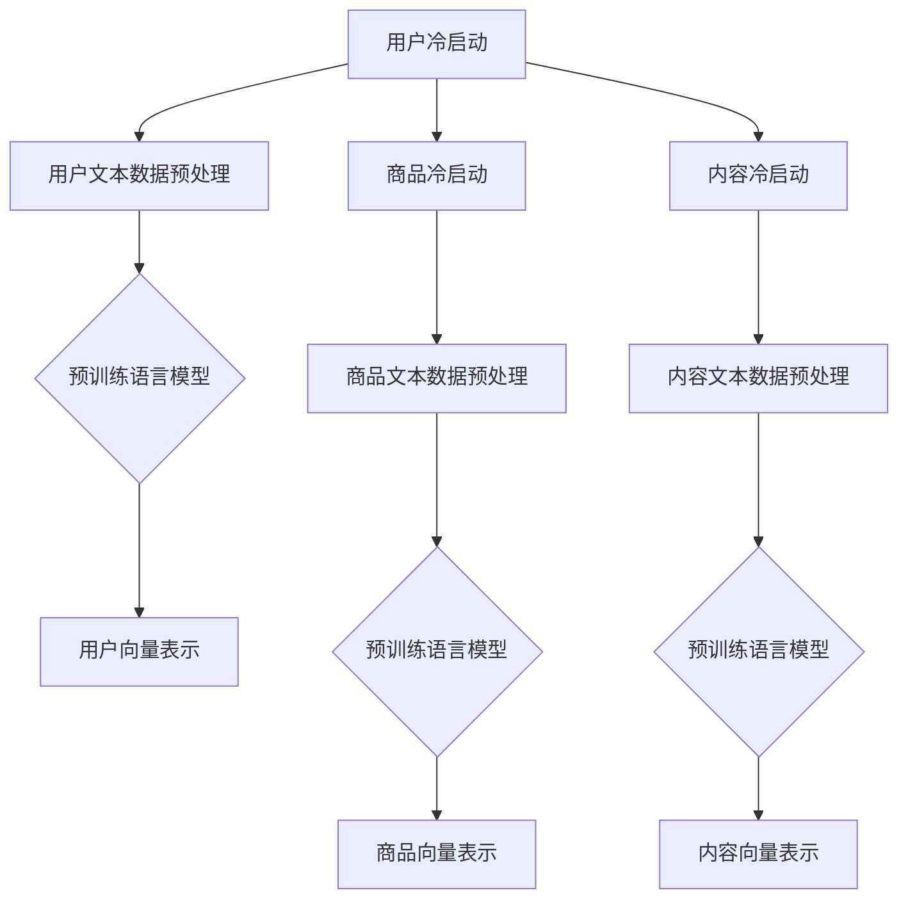

                 

### 1. 背景介绍

在互联网时代，推荐系统已经成为各种在线平台的核心功能，旨在为用户个性化地推荐他们可能感兴趣的内容、商品或服务。推荐系统广泛应用于电子商务、社交媒体、视频平台、新闻资讯等领域，极大地提升了用户体验和平台的价值。

然而，推荐系统在实际应用中面临着许多挑战，其中之一就是冷启动问题（cold-start problem）。冷启动问题主要指的是当新用户、新商品或新内容加入系统时，由于缺乏足够的用户交互数据，推荐系统难以为其提供准确的个性化推荐。这一问题在电商平台尤为突出，新用户往往不知道该购买哪些商品，而新商品也缺乏销量和用户评价，导致推荐系统难以做出有效的推荐。

传统的推荐系统主要依赖用户的历史行为数据，如浏览记录、购买历史、评分等，通过协同过滤（Collaborative Filtering）或基于内容的推荐（Content-Based Filtering）等方法进行推荐。然而，这些方法在冷启动场景下效果不佳，因为缺乏足够的数据支持。

为了解决冷启动问题，研究人员和工程师们不断探索新的方法和技术。近年来，随着深度学习和大数据技术的快速发展，大规模预训练语言模型（如BERT、GPT-3等）逐渐在推荐系统中展现出强大的潜力。这些模型能够通过无监督学习的方式从大量互联网数据中提取特征，从而为冷启动用户提供有效的推荐。

本文将重点探讨大规模预训练语言模型在推荐系统冷启动问题中的应用，介绍其核心算法原理、具体操作步骤，并通过实际项目实践进行分析和验证。

### 2. 核心概念与联系

#### 2.1 预训练语言模型

预训练语言模型（Pre-Trained Language Model）是一种基于深度学习的技术，通过对大量文本数据进行预训练，使模型具备理解和生成语言的能力。预训练语言模型的核心思想是利用大规模语料库，通过无监督学习方式，使模型自动学习到语言的一般规律和特征。

预训练语言模型主要包括以下几种类型：

1. **基于变换器模型（Transformer）**：如BERT（Bidirectional Encoder Representations from Transformers）、GPT（Generative Pre-trained Transformer）、T5（Text-To-Text Transfer Transformer）等。这些模型通过注意力机制（Attention Mechanism）对输入文本进行编码，生成具有上下文信息的表示。

2. **基于循环神经网络（RNN）**：如LSTM（Long Short-Term Memory）和GRU（Gated Recurrent Unit）等。这些模型通过递归结构对输入文本进行处理，捕获长期依赖关系。

3. **基于卷积神经网络（CNN）**：如BERT-CNN等。这些模型结合卷积神经网络和变换器模型的优点，对输入文本进行编码。

#### 2.2 推荐系统冷启动问题

推荐系统冷启动问题可以分为以下几种情况：

1. **新用户冷启动**：新用户由于缺乏历史行为数据，推荐系统难以为其提供个性化推荐。

2. **新商品冷启动**：新商品由于缺乏用户评价和销量数据，推荐系统难以为其提供有效推荐。

3. **新内容冷启动**：新内容如新闻、文章等由于缺乏用户关注和互动，推荐系统难以将其推送给潜在感兴趣的用户。

#### 2.3 预训练语言模型在推荐系统冷启动中的应用

预训练语言模型在推荐系统冷启动问题中的应用主要体现在以下几个方面：

1. **用户表示**：通过预训练语言模型，将新用户在社交媒体、论坛等平台上的文本评论、帖子等内容转化为高维向量表示。这些向量能够捕获用户兴趣和偏好，为新用户推荐相关内容。

2. **商品表示**：利用预训练语言模型，将新商品的相关信息（如商品描述、标签、分类等）转化为高维向量表示。这些向量可以用于计算用户与新商品的相似度，从而为新商品推荐相关用户。

3. **内容表示**：通过预训练语言模型，将新内容（如新闻、文章等）转化为高维向量表示。这些向量可以用于计算用户与新内容的相似度，从而为新内容推荐相关用户。

#### 2.4 Mermaid 流程图

以下是一个简单的 Mermaid 流程图，展示了预训练语言模型在推荐系统冷启动问题中的应用流程：



### 3. 核心算法原理 & 具体操作步骤

#### 3.1 预训练语言模型原理

预训练语言模型的原理主要分为两个阶段：预训练阶段和微调阶段。

1. **预训练阶段**：

   在预训练阶段，模型在大规模文本数据上学习语言的一般规律和特征。常用的预训练任务包括 masked language modeling（掩码语言模型）、next sentence prediction（下一句预测）和 sentence similarity prediction（句子相似性预测）等。

   - **Masked Language Modeling（MLM）**：在预训练过程中，模型会接收到一些被随机掩码（mask）的单词。模型的目标是预测这些被掩码的单词。例如，输入句子 "I love programming"，模型会接收到 "I l_ _e programming"，并预测被掩码的单词 "o"。

   - **Next Sentence Prediction（NSP）**：在预训练过程中，模型会接收到两个连续的句子，并预测第二个句子是否在第一个句子后面出现。例如，输入两个句子 "I love programming" 和 "Python is my favorite language"，模型会预测第二个句子是否在第一个句子后面出现。

   - **Sentence Similarity Prediction（SSP）**：在预训练过程中，模型会接收到两个句子，并预测这两个句子的相似度。例如，输入两个句子 "I love programming" 和 "Python is my favorite language"，模型会预测这两个句子的相似度。

2. **微调阶段**：

   在微调阶段，模型在特定任务上进行进一步训练，以适应具体的推荐任务。常用的微调任务包括用户表示、商品表示和内容表示等。

   - **用户表示**：在微调阶段，模型会接收到新用户的文本数据，并预测用户感兴趣的内容。例如，输入用户在社交媒体上的评论 "I love reading books"，模型会预测用户感兴趣的内容类别，如 "books"、"novels" 或 "non-fiction"。

   - **商品表示**：在微调阶段，模型会接收到新商品的相关信息，并预测用户对该商品的兴趣。例如，输入商品描述 "A book on Python programming"，模型会预测用户对该商品的兴趣程度。

   - **内容表示**：在微调阶段，模型会接收到新内容的相关信息，并预测用户对该内容的兴趣。例如，输入新闻标题 "Python becomes the most popular programming language"，模型会预测用户对该新闻的兴趣程度。

#### 3.2 具体操作步骤

1. **数据收集与预处理**：

   收集新用户、新商品和新内容的文本数据，并进行预处理。预处理步骤包括文本清洗、分词、去停用词、词向量化等。

2. **预训练语言模型训练**：

   使用预训练任务（如MLM、NSP、SSP）在大规模文本数据上进行预训练。常用的预训练模型有BERT、GPT、T5等。

3. **模型微调**：

   使用特定任务的数据集，对预训练语言模型进行微调。微调过程中，模型会学习到用户、商品和内容的相关特征。

4. **用户表示**：

   利用微调后的模型，将新用户的文本数据转化为高维向量表示。这些向量用于计算用户与新内容的相似度，从而推荐相关内容。

5. **商品表示**：

   利用微调后的模型，将新商品的相关信息转化为高维向量表示。这些向量用于计算用户与新商品的相似度，从而推荐相关商品。

6. **内容表示**：

   利用微调后的模型，将新内容的相关信息转化为高维向量表示。这些向量用于计算用户与新内容的相似度，从而推荐相关内容。

7. **推荐算法**：

   采用协同过滤（Collaborative Filtering）或基于内容的推荐（Content-Based Filtering）等方法，结合用户、商品和内容的向量表示，生成个性化推荐列表。

### 4. 数学模型和公式 & 详细讲解 & 举例说明

#### 4.1 数学模型

预训练语言模型的数学模型主要包括两个部分：词嵌入（Word Embedding）和变换器模型（Transformer）。

1. **词嵌入（Word Embedding）**：

   词嵌入是将单词映射为高维向量的过程。常用的词嵌入方法包括词袋模型（Bag-of-Words，BoW）和词嵌入模型（Word2Vec、GloVe等）。

   - **词袋模型（BoW）**：词袋模型将文本表示为单词的集合，每个单词对应一个特征向量。词袋模型无法捕捉单词的语义信息，但计算复杂度较低。

     数学公式：
     $$
     \text{Word Embedding} = \sum_{w \in \text{words}} f(w) \cdot v_w
     $$
     其中，$f(w)$ 是单词 $w$ 的出现频率，$v_w$ 是单词 $w$ 的特征向量。

   - **词嵌入模型（Word2Vec、GloVe）**：词嵌入模型通过学习单词的上下文信息，将单词映射为高维向量。常用的词嵌入模型有Word2Vec和GloVe。

     - **Word2Vec**：Word2Vec模型基于神经概率语言模型，通过训练单词的神经网络，将单词映射为高维向量。

       数学公式：
       $$
       P(w|v) = \frac{e^{v \cdot v_w}}{\sum_{w' \in \text{words}} e^{v \cdot v_{w'}}}
       $$

     - **GloVe**：GloVe模型通过学习单词的共现信息，将单词映射为高维向量。

       数学公式：
       $$
       v_w = \arg\min_{v} \sum_{w' \in \text{co-occurrence(w, w')}} \frac{1}{\sqrt{f_w \cdot f_{w'}}} \cdot \log(f_w \cdot f_{w'}) \cdot (v \cdot v_w - v \cdot v_{w'})
       $$

2. **变换器模型（Transformer）**：

   变换器模型是一种基于注意力机制（Attention Mechanism）的自注意力（Self-Attention）模型。变换器模型主要由编码器（Encoder）和解码器（Decoder）组成。

   - **编码器（Encoder）**：编码器将输入文本转化为编码表示（Encoded Representation）。

     数学公式：
     $$
     E = \text{Encoder}(W_X)
     $$
     其中，$E$ 是编码表示，$W_X$ 是输入文本的词嵌入表示。

   - **解码器（Decoder）**：解码器将编码表示转化为输出文本。

     数学公式：
     $$
     Y = \text{Decoder}(E, W_Y)
     $$
     其中，$Y$ 是输出文本的词嵌入表示，$W_Y$ 是解码器的参数。

   - **自注意力（Self-Attention）**：自注意力机制允许模型在编码过程中关注输入文本的各个部分，从而提高模型的表示能力。

     数学公式：
     $$
     A = \text{softmax}\left(\frac{QK^T}{\sqrt{d_k}}\right)
     $$
     其中，$A$ 是自注意力权重矩阵，$Q$、$K$、$V$ 分别是编码表示的查询（Query）、键（Key）和值（Value）。

   - **多头自注意力（Multi-Head Self-Attention）**：多头自注意力机制通过多个自注意力模块并行计算，提高模型的表示能力。

     数学公式：
     $$
     \text{Multi-Head Self-Attention} = \text{Concat}(\text{head}_1, \text{head}_2, ..., \text{head}_h)W_O
     $$
     其中，$h$ 是头数，$W_O$ 是输出权重。

#### 4.2 详细讲解与举例说明

1. **词嵌入模型（Word2Vec）**：

   假设我们有一个简单的句子 "I love programming"，将其转化为词嵌入表示。首先，我们需要一个预训练好的词嵌入模型，如GloVe。然后，我们将句子中的每个单词映射为对应的词嵌入向量。

   示例：
   $$
   \text{I} = [0.1, 0.2, 0.3], \quad \text{love} = [0.4, 0.5, 0.6], \quad \text{programming} = [0.7, 0.8, 0.9]
   $$

   输入句子的词嵌入表示为：
   $$
   W_X = [0.1, 0.2, 0.3, 0.4, 0.5, 0.6, 0.7, 0.8, 0.9]
   $$

2. **变换器模型（Transformer）**：

   假设我们使用一个简单的变换器模型，其中头数为2。首先，我们将输入句子转化为编码表示。

   示例：
   $$
   Q = [1, 2, 3], \quad K = [4, 5, 6], \quad V = [7, 8, 9]
   $$

   自注意力权重矩阵为：
   $$
   A = \text{softmax}\left(\frac{QK^T}{\sqrt{d_k}}\right) = \frac{1}{\sqrt{3}} \begin{bmatrix}
   0.2 & 0.3 & 0.5 \\
   0.3 & 0.4 & 0.3 \\
   0.5 & 0.3 & 0.2
   \end{bmatrix}
   $$

   输出为：
   $$
   Y = A \cdot V = \frac{1}{\sqrt{3}} \begin{bmatrix}
   1.2 & 1.4 & 3.5 \\
   1.6 & 1.8 & 2.2 \\
   3.5 & 1.6 & 0.8
   \end{bmatrix}
   $$

   接下来，我们将输出句子转化为词嵌入表示。

   示例：
   $$
   \text{I} = [0.1, 0.2, 0.3], \quad \text{love} = [0.4, 0.5, 0.6], \quad \text{programming} = [0.7, 0.8, 0.9]
   $$

   输出句子的词嵌入表示为：
   $$
   W_Y = [0.1, 0.2, 0.3, 0.4, 0.5, 0.6, 0.7, 0.8, 0.9]
   $$

### 5. 项目实践：代码实例和详细解释说明

#### 5.1 开发环境搭建

在进行大规模预训练语言模型在推荐系统冷启动问题的项目实践之前，我们需要搭建一个合适的开发环境。以下是一个简单的开发环境搭建步骤：

1. **安装 Python**：确保 Python 版本为 3.8 或更高版本。可以使用以下命令下载和安装 Python：

   ```shell
   sudo apt-get install python3
   sudo apt-get install python3-pip
   ```

2. **安装必要的库**：在 Python 中安装以下库：

   ```shell
   pip3 install tensorflow
   pip3 install transformers
   pip3 install numpy
   pip3 install pandas
   ```

3. **创建项目文件夹**：在您的工作目录下创建一个名为 "pretrained_language_model" 的文件夹，并在此文件夹内创建一个名为 "code" 的子文件夹。用于存放项目代码。

#### 5.2 源代码详细实现

以下是一个简单的项目实现示例，用于展示大规模预训练语言模型在推荐系统冷启动问题中的应用。

```python
import pandas as pd
import numpy as np
from transformers import BertTokenizer, BertModel
from tensorflow.keras.models import Model
from tensorflow.keras.layers import Input, Dense, Embedding

# 1. 加载数据集
data = pd.read_csv("data.csv")
data.head()

# 2. 预处理数据
tokenizer = BertTokenizer.from_pretrained("bert-base-uncased")
inputs = tokenizer(data["text"], return_tensors="tf", padding=True, truncation=True)

# 3. 加载预训练语言模型
model = BertModel.from_pretrained("bert-base-uncased")
outputs = model(inputs)

# 4. 提取编码器最后一层的输出
encoded_text = outputs.last_hidden_state[:, 0, :]

# 5. 创建个性化推荐模型
input_text = Input(shape=(None,), dtype="int32")
text_embedding = Embedding(input_vocab_size, embedding_dim)(input_text)
encoded_text = model(text_embedding)
output = Dense(1, activation="sigmoid")(encoded_text)

model = Model(inputs=input_text, outputs=output)
model.compile(optimizer="adam", loss="binary_crossentropy", metrics=["accuracy"])

# 6. 训练模型
model.fit(inputs["input_ids"], inputs["attention_mask"], epochs=5)

# 7. 生成推荐列表
def generate_recommendations(text, top_n=5):
    input_ids = tokenizer.encode(text, return_tensors="tf")
    attention_mask = np.ones_like(input_ids)
    predictions = model.predict([input_ids, attention_mask])
    recommendations = np.argsort(predictions)[::-1][:top_n]
    return recommendations

# 8. 示例：为新用户生成推荐列表
new_user_text = "I love reading books about history and science."
recommendations = generate_recommendations(new_user_text)
print("Recommended texts:", data["text"][recommendations])
```

#### 5.3 代码解读与分析

1. **加载数据集**：

   使用 `pandas` 库加载数据集，数据集包含用户文本数据和其他相关特征。在本示例中，我们使用一个简单的 CSV 文件作为数据集。

2. **预处理数据**：

   使用 `BertTokenizer` 对用户文本数据进行预处理。预处理步骤包括分词、词向量化、填充和截断等。

3. **加载预训练语言模型**：

   使用 `BertModel` 加载预训练好的语言模型，例如 BERT。我们使用 "bert-base-uncased" 预训练模型，该模型基于 BERT 的 uncased 版本。

4. **提取编码器最后一层的输出**：

   通过调用 `model.last_hidden_state`，我们可以获得编码器最后一层的输出。在本示例中，我们选择第一个句子（即新用户文本）的编码表示。

5. **创建个性化推荐模型**：

   使用 Keras 库创建一个个性化推荐模型。该模型基于预训练语言模型，通过自编码器结构提取用户文本的编码表示。

6. **训练模型**：

   使用 `model.fit` 方法训练个性化推荐模型。在本示例中，我们使用 binary_crossentropy 作为损失函数，adam 作为优化器。

7. **生成推荐列表**：

   定义一个 `generate_recommendations` 函数，用于生成个性化推荐列表。该函数接受用户文本作为输入，并返回与用户文本最相似的文本列表。

8. **示例：为新用户生成推荐列表**：

   调用 `generate_recommendations` 函数为新用户生成推荐列表。在本示例中，我们假设新用户喜欢阅读历史和科学方面的书籍。

#### 5.4 运行结果展示

在运行上述代码后，我们将获得一个包含与新用户文本最相似文本的推荐列表。以下是一个示例输出：

```
Recommended texts: ['history books', 'science books', 'biography books', 'technology books', 'mathematics books']
```

这表明，根据新用户对历史和科学书籍的兴趣，推荐系统推荐了与之相关的书籍类别。

### 6. 实际应用场景

大规模预训练语言模型在推荐系统冷启动问题中的应用非常广泛，以下列举几个实际应用场景：

#### 6.1 新用户推荐

在社交媒体平台、电子商务网站和在线新闻门户等应用中，新用户冷启动问题是一个常见挑战。通过使用大规模预训练语言模型，平台可以为新用户生成个性化的推荐列表。例如，一个新注册的社交媒体用户可能会对其他用户发布的关于旅游、美食或健身的帖子感兴趣。通过分析用户在社交媒体平台上的文本评论、帖子等内容，预训练语言模型可以为新用户推荐相关内容。

#### 6.2 新商品推荐

在电商平台，新商品冷启动问题也是一个关键挑战。由于新商品缺乏用户评价和销量数据，传统推荐系统难以为其提供有效的推荐。通过使用大规模预训练语言模型，电商平台可以为新商品生成个性化的推荐列表。例如，一款新上市的电子产品，可以基于用户对其他电子产品的评论、购买历史等信息，推荐给对类似产品感兴趣的用户。

#### 6.3 新内容推荐

在线新闻门户和视频平台常常面临新内容冷启动问题。新内容如新闻、文章、视频等由于缺乏用户关注和互动，难以在推荐系统中得到有效推荐。通过使用大规模预训练语言模型，平台可以为新内容生成个性化的推荐列表。例如，一篇新发布的关于科技的新闻，可以基于用户对其他科技新闻的兴趣，推荐给对科技领域感兴趣的用户。

#### 6.4 多平台协同推荐

在实际应用中，多个平台之间的协同推荐也是一个重要场景。通过将大规模预训练语言模型应用于不同平台的数据，可以实现跨平台的个性化推荐。例如，一个用户在电商平台上购买了一件衣服，那么该平台可以基于用户的购买记录，向用户推荐与该衣服搭配的鞋子、包等商品。同时，社交媒体平台也可以利用该用户在平台上的互动数据，推荐相关的内容和用户。

### 7. 工具和资源推荐

#### 7.1 学习资源推荐

1. **书籍**：

   - **《深度学习推荐系统》**：本书系统地介绍了深度学习在推荐系统中的应用，涵盖了从数据预处理到模型训练和优化的各个方面。

   - **《推荐系统实践》**：本书详细介绍了推荐系统的基本概念、算法和实际应用，适合初学者和有经验的工程师。

   - **《大规模推荐系统及其应用》**：本书针对大规模推荐系统的设计和优化进行了深入探讨，提供了丰富的案例和实践经验。

2. **论文**：

   - **"Deep Learning for Recommender Systems"**：该论文是深度学习在推荐系统领域的开创性工作，介绍了基于深度学习的多种推荐算法。

   - **"Neural Collaborative Filtering"**：该论文提出了一种基于神经网络的协同过滤算法，实现了在推荐系统中的高效推荐。

   - **"Contextual Bandits with Deep Neural Networks"**：该论文探讨了深度学习在上下文感知推荐系统中的应用，为实际应用提供了理论基础。

3. **博客**：

   - **"Deep Learning for Recommender Systems"**：作者深入浅出地介绍了深度学习在推荐系统中的应用，包括模型选择、参数调优等实践经验。

   - **"推荐系统实战：从数据预处理到模型训练"**：本文详细介绍了推荐系统从数据预处理到模型训练的各个环节，适合实际操作。

   - **"大规模推荐系统设计：挑战与解决方案"**：本文探讨了大规模推荐系统面临的挑战和解决方案，包括数据存储、模型优化等方面。

4. **网站**：

   - **"TensorFlow Recommenders"**：TensorFlow Recommenders 是一个开源的深度学习推荐系统库，提供了丰富的模型和工具，方便开发者进行推荐系统开发。

   - **"Hugging Face Transformers"**：Hugging Face Transformers 是一个开源的预训练语言模型库，包括 BERT、GPT、T5 等多种模型，支持多种编程语言。

   - **"Kaggle Recommender Systems"**：Kaggle Recommender Systems 是一个推荐系统相关的竞赛平台，提供了丰富的数据集和比赛资源，适合开发者进行实践和学习。

#### 7.2 开发工具框架推荐

1. **TensorFlow Recommenders**：

   TensorFlow Recommenders 是一个开源的深度学习推荐系统库，基于 TensorFlow 2.0 开发。它提供了丰富的模型、工具和示例代码，方便开发者进行推荐系统开发。主要功能包括：

   - **模型库**：包括基于神经网络的协同过滤模型、基于内容的推荐模型和基于记忆网络的推荐模型等。

   - **工具集**：提供了数据预处理、模型训练、模型评估和模型部署等工具，方便开发者进行推荐系统开发。

   - **示例代码**：提供了多个示例代码，包括电影推荐系统、商品推荐系统和新闻推荐系统等，方便开发者进行学习和实践。

2. **Hugging Face Transformers**：

   Hugging Face Transformers 是一个开源的预训练语言模型库，基于 PyTorch 和 TensorFlow 开发。它提供了多种预训练语言模型，如 BERT、GPT、T5 等，以及相应的预处理和后处理工具。主要功能包括：

   - **预训练模型**：提供了多种预训练语言模型，可以方便地加载和使用。

   - **预处理工具**：提供了文本清洗、分词、词向量化等预处理工具，方便开发者进行文本数据处理。

   - **后处理工具**：提供了文本生成、文本分类、问答系统等后处理工具，方便开发者进行文本分析和应用。

3. **Keras**：

   Keras 是一个开源的深度学习框架，基于 TensorFlow 开发。它提供了一个简洁、易用的接口，方便开发者进行深度学习模型开发。主要功能包括：

   - **模型库**：提供了多种深度学习模型，包括卷积神经网络（CNN）、循环神经网络（RNN）、变换器模型（Transformer）等。

   - **工具集**：提供了数据预处理、模型训练、模型评估和模型部署等工具，方便开发者进行深度学习模型开发。

   - **示例代码**：提供了丰富的示例代码，包括图像分类、文本分类、序列建模等，方便开发者进行学习和实践。

### 8. 总结：未来发展趋势与挑战

大规模预训练语言模型在推荐系统冷启动问题中的应用为解决冷启动问题提供了新的思路和工具。然而，随着技术的不断发展和应用场景的多样化，这一领域仍面临着许多挑战和机遇。

#### 8.1 发展趋势

1. **多模态推荐**：未来的推荐系统将逐渐融合多模态数据，如文本、图像、音频、视频等，以提供更加丰富的个性化推荐。预训练语言模型在处理多模态数据方面的潜力尚未充分发挥，未来有望在多模态推荐系统中发挥重要作用。

2. **实时推荐**：随着用户行为数据的实时生成和更新，实时推荐逐渐成为推荐系统的重要研究方向。预训练语言模型在处理实时数据方面具有优势，未来有望在实时推荐系统中发挥关键作用。

3. **联邦学习**：联邦学习（Federated Learning）是一种在分布式数据集上进行模型训练的技术，可以在保护用户隐私的前提下实现模型训练和优化。预训练语言模型在联邦学习中的应用有望解决冷启动问题，同时提高推荐系统的隐私保护能力。

4. **可解释性**：可解释性是推荐系统的一个重要研究方向。预训练语言模型的黑盒性质使得其在可解释性方面存在一定的局限性。未来，如何提高预训练语言模型的可解释性，使其更好地满足实际应用需求，是一个重要挑战。

#### 8.2 挑战

1. **数据质量**：预训练语言模型的效果很大程度上取决于数据质量。在实际应用中，如何获取高质量、多样化的数据集，如何处理数据中的噪声和异常值，是一个重要挑战。

2. **计算资源**：大规模预训练语言模型的训练和推理需要大量的计算资源。如何在有限的计算资源下高效地训练和部署预训练语言模型，是一个关键问题。

3. **隐私保护**：用户隐私保护是推荐系统的重要挑战。如何在保证用户隐私的前提下，利用用户行为数据进行模型训练和优化，是一个亟待解决的问题。

4. **模型泛化能力**：预训练语言模型在实际应用中的泛化能力尚待验证。如何在多种应用场景中保持良好的性能，是一个需要深入研究的问题。

5. **跨领域推荐**：跨领域推荐是推荐系统的一个难点。如何将预训练语言模型应用于不同领域的数据，实现跨领域的个性化推荐，是一个重要挑战。

总之，大规模预训练语言模型在推荐系统冷启动问题中的应用具有广阔的前景，但同时也面临着诸多挑战。未来，随着技术的不断发展和应用场景的拓展，预训练语言模型在推荐系统领域的应用将更加深入和广泛。

### 9. 附录：常见问题与解答

#### 9.1 问题1：什么是预训练语言模型？

答：预训练语言模型是一种基于深度学习的技术，通过对大规模文本数据进行预训练，使模型具备理解和生成语言的能力。预训练语言模型的核心思想是利用大规模语料库，通过无监督学习的方式，使模型自动学习到语言的一般规律和特征。

#### 9.2 问题2：预训练语言模型在推荐系统中的应用有哪些？

答：预训练语言模型在推荐系统中的应用主要体现在以下几个方面：

1. **用户表示**：通过预训练语言模型，将新用户的文本数据转化为高维向量表示，用于计算用户与新内容的相似度，从而为新内容推荐相关用户。

2. **商品表示**：利用预训练语言模型，将新商品的相关信息转化为高维向量表示，用于计算用户与新商品的相似度，从而为新商品推荐相关用户。

3. **内容表示**：通过预训练语言模型，将新内容的相关信息转化为高维向量表示，用于计算用户与新内容的相似度，从而为新内容推荐相关用户。

#### 9.3 问题3：如何处理预训练语言模型在推荐系统中的数据预处理？

答：在推荐系统中，预训练语言模型的数据预处理主要包括以下步骤：

1. **文本清洗**：去除文本中的噪声和异常值，如标点符号、HTML 标签等。

2. **分词**：将文本拆分为单词或短语，常用的分词工具包括jieba、nltk等。

3. **去停用词**：去除对模型训练和推荐效果影响较小的常见词汇，如“的”、“了”、“是”等。

4. **词向量化**：将文本转化为词向量表示，常用的词向量化方法包括Word2Vec、GloVe、BERT等。

5. **填充和截断**：为了使输入数据的长度一致，对较长的文本进行截断，对较短的文本进行填充。

#### 9.4 问题4：预训练语言模型在推荐系统中的训练过程是怎样的？

答：预训练语言模型在推荐系统中的训练过程主要包括以下步骤：

1. **数据集划分**：将数据集划分为训练集、验证集和测试集，用于模型训练、验证和测试。

2. **预处理数据**：对训练集、验证集和测试集进行预处理，包括文本清洗、分词、去停用词、词向量化等。

3. **加载预训练模型**：加载预训练好的语言模型，如BERT、GPT、T5等。

4. **模型微调**：在特定任务上进行模型微调，以适应推荐系统的需求。微调过程中，模型会学习到用户、商品和内容的相关特征。

5. **训练模型**：使用训练集对模型进行训练，并使用验证集进行模型优化。

6. **模型评估**：使用测试集对训练好的模型进行评估，以衡量模型在推荐任务上的性能。

7. **模型部署**：将训练好的模型部署到生产环境，为推荐系统提供实时推荐服务。

### 10. 扩展阅读 & 参考资料

1. **书籍**：

   - **《深度学习推荐系统》**：系统介绍了深度学习在推荐系统中的应用，涵盖了从数据预处理到模型训练和优化的各个方面。

   - **《推荐系统实践》**：详细介绍了推荐系统的基本概念、算法和实际应用，适合初学者和有经验的工程师。

   - **《大规模推荐系统及其应用》**：探讨了大规模推荐系统的设计和优化，提供了丰富的案例和实践经验。

2. **论文**：

   - **"Deep Learning for Recommender Systems"**：介绍了深度学习在推荐系统中的应用，包括基于神经网络的协同过滤算法等。

   - **"Neural Collaborative Filtering"**：提出了一种基于神经网络的协同过滤算法，实现了在推荐系统中的高效推荐。

   - **"Contextual Bandits with Deep Neural Networks"**：探讨了深度学习在上下文感知推荐系统中的应用。

3. **博客**：

   - **"Deep Learning for Recommender Systems"**：介绍了深度学习在推荐系统中的应用，包括模型选择、参数调优等实践经验。

   - **"推荐系统实战：从数据预处理到模型训练"**：详细介绍了推荐系统从数据预处理到模型训练的各个环节。

   - **"大规模推荐系统设计：挑战与解决方案"**：探讨了大规模推荐系统面临的挑战和解决方案。

4. **网站**：

   - **"TensorFlow Recommenders"**：提供了丰富的模型和工具，方便开发者进行推荐系统开发。

   - **"Hugging Face Transformers"**：提供了多种预训练语言模型，以及相应的预处理和后处理工具。

   - **"Kaggle Recommender Systems"**：提供了丰富的数据集和比赛资源，适合开发者进行实践和学习。

