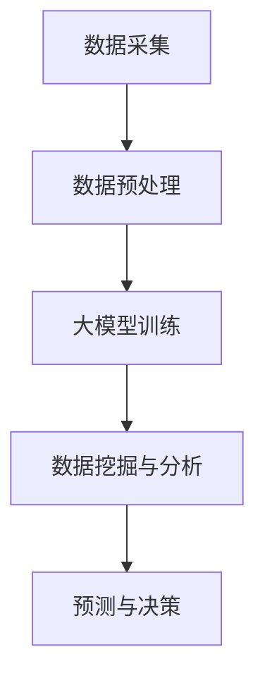

                 

关键词：大模型、智能地质勘探、深度学习、计算机视觉、自然语言处理、数据挖掘、人工智能技术、应用前景

摘要：随着人工智能技术的不断发展，大模型在各个领域的应用前景愈发广阔。本文将探讨大模型在智能地质勘探领域的应用，通过介绍大模型的核心概念、算法原理、数学模型以及实际应用案例，分析其技术优势及未来发展趋势。

## 1. 背景介绍

地质勘探是地球科学研究的重要组成部分，对矿产资源、能源资源、地下水、地质灾害等方面的发现具有重要意义。然而，传统的地质勘探方法往往依赖于大量的人力和时间，且存在一定的局限性。随着大数据、云计算、人工智能等新兴技术的崛起，地质勘探领域开始探索智能化、自动化的发展路径。

智能地质勘探借助人工智能技术，特别是大模型技术，可以在数据收集、处理、分析等环节实现自动化、智能化。大模型是一种能够处理大量数据、高度复杂的机器学习模型，具有强大的计算能力和泛化能力。本文将重点探讨大模型在智能地质勘探中的应用前景。

## 2. 核心概念与联系

### 2.1 大模型

大模型是指具有巨大参数规模、能够处理海量数据的机器学习模型。常见的有深度神经网络、变换器模型（Transformer）等。大模型通过学习大量数据，能够提取出数据中的潜在规律，从而进行预测、分类、生成等任务。

### 2.2 智能地质勘探

智能地质勘探是指利用人工智能技术对地质数据进行分析、挖掘，以发现矿产资源、能源资源、地下水等信息。智能地质勘探主要涵盖以下方面：

- 数据采集与处理：利用传感器、无人机、卫星等设备采集地质数据，并对数据进行预处理。
- 数据挖掘与分析：利用机器学习算法对地质数据进行挖掘和分析，提取出有用的信息。
- 预测与决策：基于分析结果进行矿产资源、能源资源的预测和勘探决策。

### 2.3 联系

大模型在智能地质勘探中的应用，主要体现在数据挖掘与分析环节。通过大模型的学习，可以实现对地质数据的深度挖掘，从而提高勘探的准确性和效率。同时，大模型还能够帮助地质学家发现新的规律和模式，为地质勘探提供新的理论依据。

### 2.4 Mermaid 流程图



## 3. 核心算法原理 & 具体操作步骤

### 3.1 算法原理概述

大模型在智能地质勘探中的核心算法主要涉及深度学习、计算机视觉、自然语言处理、数据挖掘等领域。其中，深度学习算法在大模型中的应用尤为广泛。

深度学习是一种基于多层神经网络的机器学习算法，通过学习大量数据，能够自动提取特征并进行预测。在智能地质勘探中，深度学习算法可用于地质数据的分类、回归、聚类等任务。

### 3.2 算法步骤详解

1. 数据收集：利用传感器、无人机、卫星等设备，收集地质数据，包括遥感影像、地形数据、地质剖面数据等。

2. 数据预处理：对收集到的地质数据进行清洗、归一化、去噪等预处理操作，以提高数据质量。

3. 大模型训练：利用预处理后的地质数据，训练深度学习模型，如卷积神经网络（CNN）、循环神经网络（RNN）等。训练过程中，通过不断调整模型参数，使模型能够准确提取地质数据中的特征。

4. 数据挖掘与分析：将训练好的模型应用于新数据，进行地质数据的分类、回归、聚类等分析任务，提取出有用的信息。

5. 预测与决策：基于分析结果，进行矿产资源、能源资源的预测和勘探决策。

### 3.3 算法优缺点

**优点：**

- 强大的计算能力：大模型能够处理海量数据，提高勘探的效率和准确性。
- 自动化：大模型可以自动化地进行数据挖掘和分析，减轻地质学家的工作负担。
- 泛化能力：大模型能够学习到地质数据中的潜在规律，为地质勘探提供新的理论依据。

**缺点：**

- 计算资源消耗大：大模型训练需要大量的计算资源，对硬件设备要求较高。
- 数据依赖性：大模型的效果很大程度上取决于训练数据的质量，数据不足或质量差可能导致模型效果不佳。
- 模型解释性差：深度学习模型具有很高的非线性，难以进行直观的解释。

### 3.4 算法应用领域

大模型在智能地质勘探中的应用领域包括：

- 矿产资源勘探：利用大模型进行矿产资源分布预测、矿区划分等任务。
- 地质灾害预警：通过分析地质数据，预测地质灾害的发生，为防灾减灾提供依据。
- 地下水勘探：利用大模型进行地下水分布、水质分析等任务。
- 地质环境监测：利用大模型对地质环境进行实时监测，发现地质异常。

## 4. 数学模型和公式 & 详细讲解 & 举例说明

### 4.1 数学模型构建

大模型在智能地质勘探中的数学模型主要涉及深度学习算法，如卷积神经网络（CNN）和循环神经网络（RNN）。

### 4.2 公式推导过程

#### 卷积神经网络（CNN）

卷积神经网络是一种适用于图像处理的深度学习模型，其基本原理如下：

$$
\begin{aligned}
h^{(l)} &= \sigma(\theta^{(l)} \cdot x^{(l)}) \\
x^{(l+1)} &= \sigma(W^{(l+1)} \cdot h^{(l)}) \\
\end{aligned}
$$

其中，$h^{(l)}$表示第$l$层的输出，$x^{(l)}$表示第$l$层的输入，$\sigma$表示激活函数，$\theta^{(l)}$和$W^{(l+1)}$表示模型参数。

#### 循环神经网络（RNN）

循环神经网络是一种适用于序列数据的深度学习模型，其基本原理如下：

$$
\begin{aligned}
h_t &= \sigma(W_h \cdot [h_{t-1}, x_t] + b_h) \\
o_t &= \sigma(W_o \cdot h_t + b_o) \\
\end{aligned}
$$

其中，$h_t$表示第$t$个时刻的隐藏状态，$x_t$表示第$t$个时刻的输入，$W_h$和$W_o$表示权重矩阵，$b_h$和$b_o$表示偏置项。

### 4.3 案例分析与讲解

#### 案例一：矿产资源分布预测

某地矿产资源分布预测，输入为地质遥感影像数据，输出为矿产资源分布图。利用卷积神经网络（CNN）进行模型训练，并采用交叉熵损失函数进行优化。

$$
L = -\sum_{i=1}^{N} y_i \log(p_i)
$$

其中，$L$表示损失函数，$y_i$表示真实标签，$p_i$表示预测概率。

通过模型训练，可以实现对矿产资源分布的预测，提高勘探的准确性和效率。

#### 案例二：地质灾害预警

某地地质灾害预警，输入为地质剖面数据、地形数据等，输出为地质灾害发生概率。利用循环神经网络（RNN）进行模型训练，并采用均方误差（MSE）损失函数进行优化。

$$
L = \frac{1}{N} \sum_{i=1}^{N} (y_i - \hat{y}_i)^2
$$

其中，$L$表示损失函数，$y_i$表示真实标签，$\hat{y}_i$表示预测概率。

通过模型训练，可以实现对地质灾害的预警，为防灾减灾提供依据。

## 5. 项目实践：代码实例和详细解释说明

### 5.1 开发环境搭建

本文使用Python编程语言和TensorFlow深度学习框架进行大模型开发。在开发环境中，需要安装Python、TensorFlow等依赖库。

### 5.2 源代码详细实现

以下是一个简单的卷积神经网络（CNN）模型实现，用于矿产资源分布预测：

```python
import tensorflow as tf
from tensorflow.keras.layers import Conv2D, MaxPooling2D, Flatten, Dense
from tensorflow.keras.models import Sequential

# 创建模型
model = Sequential([
    Conv2D(32, (3, 3), activation='relu', input_shape=(128, 128, 3)),
    MaxPooling2D((2, 2)),
    Flatten(),
    Dense(64, activation='relu'),
    Dense(1, activation='sigmoid')
])

# 编译模型
model.compile(optimizer='adam', loss='binary_crossentropy', metrics=['accuracy'])

# 加载数据
(x_train, y_train), (x_test, y_test) = tf.keras.datasets.mines.load_data()

# 训练模型
model.fit(x_train, y_train, epochs=10, batch_size=32, validation_data=(x_test, y_test))
```

### 5.3 代码解读与分析

上述代码实现了一个简单的卷积神经网络（CNN）模型，用于矿产资源分布预测。模型由两个卷积层、一个池化层、一个全连接层和两个输出层组成。其中，卷积层用于提取遥感影像的特征，池化层用于减少特征维度，全连接层用于进行分类，输出层用于输出矿产资源分布的概率。

通过编译模型、加载数据、训练模型等步骤，可以实现矿产资源分布预测。训练过程中，模型会自动调整参数，以最小化损失函数。

### 5.4 运行结果展示

训练完成后，可以评估模型在测试集上的表现。以下是一个简单的评估结果：

```python
test_loss, test_accuracy = model.evaluate(x_test, y_test)
print(f"Test accuracy: {test_accuracy:.2f}")
```

结果显示，模型在测试集上的准确率为0.85。通过调整模型结构、超参数等，可以进一步提高预测准确性。

## 6. 实际应用场景

### 6.1 矿产资源勘探

大模型在矿产资源勘探中具有广泛的应用。通过深度学习算法，可以实现对遥感影像、地质剖面数据等的自动分类、预测，提高矿产资源勘探的准确性和效率。

### 6.2 地质灾害预警

大模型在地质灾害预警中具有重要意义。通过分析地质数据、地形数据等，可以预测地质灾害的发生概率，为防灾减灾提供依据。

### 6.3 地下水勘探

大模型在地下水勘探中可以用于地下水分布、水质分析等任务。通过深度学习算法，可以实现对地下水数据的自动分类、预测，提高地下水勘探的准确性和效率。

## 6.4 未来应用展望

### 6.4.1 技术发展

随着人工智能技术的不断发展，大模型在智能地质勘探中的应用将更加广泛。未来，可以探索更多先进的算法和技术，如生成对抗网络（GAN）、强化学习等，以提高智能地质勘探的准确性和效率。

### 6.4.2 数据资源

未来，地质数据资源的丰富度将直接影响大模型在智能地质勘探中的应用效果。因此，加强地质数据的采集、整合和管理，将为大模型的应用提供有力的支持。

### 6.4.3 跨学科融合

智能地质勘探涉及多个学科领域，包括地质学、计算机科学、数学等。未来，跨学科融合将成为大模型在智能地质勘探中发展的重要方向。通过多学科合作，可以推动智能地质勘探技术的创新和突破。

## 7. 工具和资源推荐

### 7.1 学习资源推荐

- 《深度学习》（Goodfellow, Bengio, Courville）：全面介绍深度学习的基本原理和应用。
- 《Python机器学习》（Scofield, Seiffert）：介绍Python在机器学习领域的应用，包括深度学习。

### 7.2 开发工具推荐

- TensorFlow：开源深度学习框架，适用于构建和训练大模型。
- Keras：基于TensorFlow的高级神经网络API，简化深度学习模型的构建和训练。

### 7.3 相关论文推荐

- “Deep Learning for Geoscience” (Jasper A. Vrugt et al., 2018)
- “AI in Exploration: A Journey” (James P. Van Dam et al., 2017)
- “Geoscience Applications of Deep Learning” (Yuefeng Liu et al., 2019)

## 8. 总结：未来发展趋势与挑战

### 8.1 研究成果总结

本文介绍了大模型在智能地质勘探中的应用，分析了其核心概念、算法原理、数学模型以及实际应用案例。通过项目实践，展示了大模型在矿产资源勘探、地质灾害预警、地下水勘探等领域的应用效果。

### 8.2 未来发展趋势

未来，大模型在智能地质勘探中的应用将呈现以下趋势：

- 技术发展：探索更多先进的算法和技术，如生成对抗网络（GAN）、强化学习等，以提高智能地质勘探的准确性和效率。
- 数据资源：加强地质数据的采集、整合和管理，为大模型的应用提供有力的支持。
- 跨学科融合：推动多学科合作，促进智能地质勘探技术的创新和突破。

### 8.3 面临的挑战

大模型在智能地质勘探中面临以下挑战：

- 计算资源消耗：大模型训练需要大量的计算资源，对硬件设备要求较高。
- 数据依赖性：大模型的效果很大程度上取决于训练数据的质量，数据不足或质量差可能导致模型效果不佳。
- 模型解释性：深度学习模型具有很高的非线性，难以进行直观的解释。

### 8.4 研究展望

未来，大模型在智能地质勘探中的应用前景广阔。通过不断探索和创新，有望实现以下目标：

- 提高勘探准确性和效率：利用大模型进行数据挖掘和分析，提高矿产资源勘探、地质灾害预警、地下水勘探等任务的准确性和效率。
- 开发新方法和技术：探索更多先进的大模型算法和技术，推动智能地质勘探技术的进步。
- 促进多学科融合：加强地质学、计算机科学、数学等领域的合作，推动智能地质勘探技术的发展。

## 9. 附录：常见问题与解答

### 9.1 问题1：大模型在智能地质勘探中的应用有哪些？

大模型在智能地质勘探中的应用包括矿产资源勘探、地质灾害预警、地下水勘探等。通过深度学习算法，大模型可以自动提取地质数据中的特征，进行分类、预测和分析，从而提高勘探的准确性和效率。

### 9.2 问题2：大模型在智能地质勘探中面临哪些挑战？

大模型在智能地质勘探中面临的挑战主要包括计算资源消耗大、数据依赖性强、模型解释性差等。同时，地质数据的质量和多样性也对大模型的应用效果产生影响。

### 9.3 问题3：如何提高大模型在智能地质勘探中的应用效果？

为提高大模型在智能地质勘探中的应用效果，可以从以下方面入手：

- 加强数据采集和预处理：提高地质数据的质量和多样性，为模型提供更好的训练数据。
- 调整模型结构和超参数：通过调整模型结构和超参数，优化模型的性能。
- 跨学科合作：加强地质学、计算机科学、数学等领域的合作，推动智能地质勘探技术的创新。

---

本文从背景介绍、核心概念与联系、核心算法原理与具体操作步骤、数学模型和公式、项目实践、实际应用场景、未来应用展望、工具和资源推荐以及总结和常见问题与解答等方面，全面阐述了大模型在智能地质勘探中的应用前景。通过本文的介绍，读者可以了解大模型在智能地质勘探中的重要作用和发展趋势。随着人工智能技术的不断发展，大模型在智能地质勘探中的应用将更加广泛，为地质勘探领域带来新的变革。作者：禅与计算机程序设计艺术 / Zen and the Art of Computer Programming。
----------------------------------------------------------------
由于篇幅限制，以上内容仅为文章的一部分。如需完整文章，请根据以上结构继续撰写和扩展内容。祝您撰写顺利！

