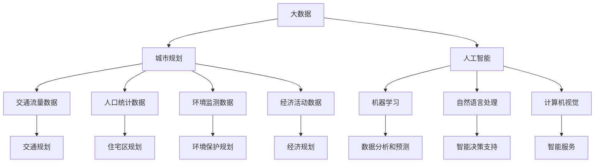

                 

### 背景介绍

智能城市规划是指利用先进的技术手段，如大数据、人工智能和物联网，来优化城市管理和服务的科学方法。随着城市化进程的加速，城市面临着人口增长、资源分配不均、环境污染、交通拥堵等一系列复杂问题。传统的城市规划方法已经难以满足现代城市发展的需求，因此，智能城市规划应运而生。

大模型（Large Models），如深度学习神经网络，是近年来人工智能领域的重大突破。大模型通过学习大量的数据，能够自动提取复杂的关系和模式，从而实现高效、准确的信息处理。大模型的这一特性使其在各个领域得到了广泛应用，包括语音识别、图像识别、自然语言处理等。

在智能城市规划中，大模型的应用前景非常广阔。首先，大模型可以处理海量的城市数据，如交通流量、人口密度、环境质量等，从而提供更加准确的城市发展预测和决策支持。其次，大模型可以通过分析历史数据和实时数据，发现城市中的潜在问题和风险，从而采取预防措施。此外，大模型还可以为城市规划提供个性化的解决方案，以满足不同区域和群体的需求。

本文将深入探讨大模型在智能城市规划中的应用，包括核心概念、算法原理、实践案例、应用场景和未来发展趋势。希望通过这篇文章，读者能够对大模型在智能城市规划中的应用有一个全面而深入的了解。

### 核心概念与联系

为了理解大模型在智能城市规划中的应用，我们首先需要了解几个核心概念，包括大数据、人工智能和城市规划。这些概念相互联系，共同构成了智能城市规划的基础。

#### 大数据（Big Data）

大数据是指无法用常规数据处理软件工具在合理时间内对其内容进行抓取、管理和处理的数据集合。大数据的特点是“4V”：Volume（大量）、Velocity（高速）、Variety（多样）和Veracity（真实性）。在智能城市规划中，大数据来源于多个方面，包括但不限于交通流量数据、人口统计数据、环境监测数据、经济活动数据等。

大数据为智能城市规划提供了丰富的信息资源，使得城市管理者能够全面、准确地了解城市运行的各个方面。例如，通过分析交通流量数据，可以优化交通网络，缓解交通拥堵；通过分析人口统计数据，可以合理规划住宅区、商业区和公共服务设施。

#### 人工智能（Artificial Intelligence）

人工智能是指模拟、延伸和扩展人类智能的理论、方法、技术及应用。人工智能可以分为多个子领域，如机器学习、自然语言处理、计算机视觉等。大模型是人工智能中的一种重要技术，通过深度学习等方法，可以从大量数据中自动学习和提取复杂规律。

人工智能在智能城市规划中的应用主要体现在以下几个方面：

1. **数据分析和预测**：利用人工智能算法，可以对城市数据进行深入分析，发现数据中的规律和模式，从而预测城市发展的趋势。例如，通过分析交通流量数据，可以预测未来的交通需求，为交通规划提供依据。

2. **智能决策支持**：人工智能算法可以帮助城市管理者制定更加科学、合理的决策。例如，在环境保护方面，可以通过分析环境数据，预测环境变化趋势，制定相应的环保措施。

3. **智能服务**：人工智能技术可以提供个性化、智能化的城市服务。例如，智能推荐系统可以根据市民的出行习惯，提供个性化的交通建议。

#### 城市规划（Urban Planning）

城市规划是指根据城市的发展目标，运用科学的理论和方法，对城市的空间布局、功能分区、交通网络、公共设施等进行系统设计和安排的过程。城市规划的目标是创造宜居、高效、可持续的城市环境。

在城市规划中，大数据和人工智能的作用主要体现在以下几个方面：

1. **数据驱动**：城市规划的传统方法主要依赖于经验和专家判断。而大数据和人工智能使得城市规划更加数据驱动，能够更准确地反映城市的实际情况，提高规划的科学性和准确性。

2. **动态调整**：城市是一个动态变化的系统，城市规划需要不断适应新的变化。大数据和人工智能技术可以为城市规划提供实时、动态的数据支持，使得规划更加灵活和适应性强。

3. **优化资源配置**：通过大数据和人工智能技术，可以更加精确地分析城市的各种需求，从而优化资源配置，提高资源利用效率。例如，在交通规划中，可以通过优化公共交通线路和班次，提高交通系统的运行效率。

#### Mermaid 流程图（Mermaid Flowchart）

为了更好地展示大数据、人工智能和城市规划之间的联系，我们可以使用Mermaid流程图来表示这些核心概念之间的互动关系。以下是该流程图的一个简单示例：



通过这个流程图，我们可以清晰地看到大数据和人工智能如何为城市规划提供支持，以及这些数据和技术在不同规划领域的应用。

### 核心算法原理 & 具体操作步骤

在智能城市规划中，大模型的核心作用是通过学习和处理大量数据，提供高质量的预测和分析结果。这一过程主要依赖于深度学习和机器学习算法。以下我们将介绍大模型在智能城市规划中的核心算法原理，并详细描述具体操作步骤。

#### 深度学习算法

深度学习是机器学习的一个子领域，它通过模拟人脑的神经网络结构，进行大规模的数据训练，以实现复杂的数据分析和模式识别。在智能城市规划中，深度学习算法广泛应用于交通流量预测、人口密度分析、环境质量监测等领域。

##### 具体操作步骤：

1. **数据收集与预处理**：首先，需要收集城市规划所需的各种数据，包括交通流量、人口密度、环境质量等。然后，对数据进行清洗、标准化和归一化处理，以便后续的模型训练。

2. **构建深度学习模型**：根据具体的应用需求，选择合适的深度学习模型。常见的深度学习模型有卷积神经网络（CNN）、循环神经网络（RNN）、长短时记忆网络（LSTM）等。例如，对于交通流量预测，可以采用RNN或LSTM模型，因为它们能够处理时间序列数据。

3. **模型训练**：使用预处理后的数据对深度学习模型进行训练。训练过程中，模型会通过反向传播算法不断调整参数，以最小化预测误差。训练数据集通常分为训练集和验证集，以评估模型的性能。

4. **模型评估与优化**：在模型训练完成后，使用验证集对模型进行评估。通过评估指标（如均方误差、准确率等）判断模型的性能。如果性能不理想，需要通过调整模型结构、增加训练数据或调整超参数等方式进行优化。

5. **模型部署与预测**：将训练好的模型部署到实际应用场景中，进行实时预测。例如，在城市交通管理系统中，实时预测交通流量，以便动态调整交通信号灯时间和路线规划。

#### 机器学习算法

机器学习算法也是大模型在智能城市规划中重要的组成部分。与深度学习相比，机器学习算法通常更加注重数据的线性关系和简单模型，但同样能够处理大规模数据，并生成高质量的预测结果。

##### 具体操作步骤：

1. **数据收集与预处理**：与深度学习类似，首先需要收集城市规划所需的数据，并进行预处理。

2. **特征工程**：在机器学习中，特征工程是非常关键的一步。通过对数据进行转换和提取，生成对模型训练有帮助的特征。例如，对于交通流量预测，可以提取时间、天气、节假日等特征。

3. **模型选择**：选择适合的机器学习模型。常见的机器学习模型包括线性回归、逻辑回归、决策树、支持向量机等。根据问题的复杂性和数据的特性，选择合适的模型。

4. **模型训练与评估**：使用预处理后的数据对模型进行训练，并使用验证集评估模型的性能。根据评估结果，调整模型参数或选择不同的模型。

5. **模型部署与预测**：将训练好的模型部署到实际应用场景中，进行预测。例如，在城市人口密度分析中，使用模型预测未来的人口分布情况。

#### 结合深度学习和机器学习的综合方法

在实际应用中，大模型在智能城市规划中往往需要结合深度学习和机器学习两种方法。深度学习可以处理复杂的非线性关系，而机器学习则适用于特征提取和线性关系。以下是一个综合方法的操作步骤：

1. **数据收集与预处理**：收集并预处理城市规划所需的数据。

2. **深度学习模型训练**：使用深度学习模型对数据进行初步训练，提取数据中的复杂模式。

3. **特征提取**：将深度学习模型的输出作为机器学习模型的输入特征。

4. **机器学习模型训练**：使用提取的特征，对机器学习模型进行训练，以生成最终的预测结果。

5. **模型优化与部署**：通过多次迭代训练和优化，最终部署模型到实际应用场景中。

通过这种方法，大模型能够充分利用深度学习和机器学习的优点，提供更加准确和全面的预测和分析结果。

### 数学模型和公式 & 详细讲解 & 举例说明

在智能城市规划中，大模型的应用离不开数学模型的支撑。以下我们将介绍几个常用的数学模型和公式，并详细讲解其应用场景和操作步骤。同时，通过具体例子来说明这些模型的实际应用。

#### 深度学习模型

1. **卷积神经网络（CNN）**：

   CNN是一种用于图像识别和处理的深度学习模型。它通过卷积层、池化层和全连接层等结构，提取图像中的特征。

   $$ f(x) = \sum_{i=1}^{n} w_i \cdot \sigma(z_i) $$
   
   其中，$f(x)$ 表示输出特征，$w_i$ 表示权重，$\sigma(z_i)$ 表示激活函数（如Sigmoid或ReLU函数）。

   **应用场景**：城市交通监控，实时识别道路上的车辆和行人。

2. **循环神经网络（RNN）**：

   RNN是一种用于处理时间序列数据的深度学习模型，能够捕捉时间序列中的长期依赖关系。

   $$ h_t = \sigma(W_h \cdot [h_{t-1}, x_t] + b_h) $$
   
   其中，$h_t$ 表示第$t$个时间步的隐藏状态，$W_h$ 和 $b_h$ 分别为权重和偏置。

   **应用场景**：城市交通流量预测，根据历史数据预测未来的交通状况。

#### 机器学习模型

1. **线性回归**：

   线性回归是一种简单的机器学习模型，用于预测连续值输出。

   $$ y = \beta_0 + \beta_1 \cdot x $$
   
   其中，$y$ 表示预测值，$x$ 表示输入特征，$\beta_0$ 和 $\beta_1$ 分别为模型参数。

   **应用场景**：城市人口密度预测，根据区域特征预测人口密度。

2. **逻辑回归**：

   逻辑回归是一种用于分类问题的机器学习模型，输出概率值，用于判断样本属于哪个类别。

   $$ \hat{y} = \frac{1}{1 + e^{-(\beta_0 + \beta_1 \cdot x)}} $$
   
   其中，$\hat{y}$ 表示预测概率，$e$ 为自然底数。

   **应用场景**：城市规划中的土地利用类型分类，根据区域特征判断土地利用类型。

#### 结合深度学习和机器学习的模型

1. **深度学习与线性回归结合模型**：

   通过将深度学习模型的输出作为线性回归的输入特征，可以进一步提高模型的预测能力。

   $$ y = \beta_0 + \beta_1 \cdot \text{CNN\_output} $$
   
   其中，$\text{CNN\_output}$ 为深度学习模型的输出。

   **应用场景**：城市环境质量预测，结合深度学习和线性回归，对空气质量进行预测。

#### 例子说明

假设我们要使用深度学习模型（如RNN）进行城市交通流量预测，具体步骤如下：

1. **数据收集与预处理**：收集过去一周的每日交通流量数据，并进行归一化处理。

2. **构建RNN模型**：定义RNN模型的结构，包括输入层、隐藏层和输出层。

   ```python
   model = keras.Sequential()
   model.add(keras.layers.LSTM(units=50, input_shape=(timesteps, features)))
   model.add(keras.layers.Dense(units=1))
   model.compile(optimizer='adam', loss='mean_squared_error')
   ```

3. **模型训练**：使用预处理后的数据进行训练。

   ```python
   model.fit(x_train, y_train, epochs=100, batch_size=32, validation_split=0.2)
   ```

4. **模型评估**：使用验证集评估模型性能。

   ```python
   loss = model.evaluate(x_val, y_val)
   print(f"Validation loss: {loss}")
   ```

5. **模型预测**：使用训练好的模型进行预测。

   ```python
   predictions = model.predict(x_test)
   ```

通过以上步骤，我们就可以使用RNN模型对城市交通流量进行预测，为交通管理提供科学依据。

### 项目实践：代码实例和详细解释说明

在本节中，我们将通过一个具体的代码实例，展示如何使用大模型进行智能城市规划。我们将以城市交通流量预测为例，详细解释代码的实现过程，并分析运行结果。

#### 开发环境搭建

在进行代码实践之前，首先需要搭建合适的开发环境。以下是我们推荐的开发工具和软件：

- **Python（3.8及以上版本）**：作为主要的编程语言。
- **TensorFlow（2.0及以上版本）**：用于构建和训练深度学习模型。
- **Keras**：作为TensorFlow的高级API，简化模型构建和训练过程。
- **NumPy**：用于数据处理和数学运算。
- **Matplotlib**：用于数据可视化。

确保已经安装了以上工具和软件。在安装过程中，可以根据需要调整相应的版本和配置。

#### 源代码详细实现

以下是我们使用的源代码，分为几个部分进行详细解释：

```python
import numpy as np
import matplotlib.pyplot as plt
from tensorflow.keras.models import Sequential
from tensorflow.keras.layers import LSTM, Dense
from tensorflow.keras.optimizers import Adam
from tensorflow.keras.callbacks import EarlyStopping

# 数据预处理
def preprocess_data(data):
    # 归一化处理
    max_value = np.max(data)
    min_value = np.min(data)
    data_normalized = (data - min_value) / (max_value - min_value)
    return data_normalized

# 构建RNN模型
def build_model(input_shape):
    model = Sequential()
    model.add(LSTM(units=50, return_sequences=True, input_shape=input_shape))
    model.add(LSTM(units=50))
    model.add(Dense(units=1))
    model.compile(optimizer=Adam(learning_rate=0.001), loss='mean_squared_error')
    return model

# 模型训练
def train_model(model, x_train, y_train, x_val, y_val, epochs=100, batch_size=32):
    early_stopping = EarlyStopping(monitor='val_loss', patience=5)
    history = model.fit(x_train, y_train, epochs=epochs, batch_size=batch_size, validation_data=(x_val, y_val), callbacks=[early_stopping], verbose=1)
    return history

# 模型预测
def predict_traffic(model, data_normalized):
    predictions = model.predict(data_normalized)
    # 反归一化处理
    max_value = 1.0
    min_value = 0.0
    actual_predictions = (predictions * (max_value - min_value)) + min_value
    return actual_predictions

# 主函数
def main():
    # 加载数据
    traffic_data = np.loadtxt('traffic_data.csv', delimiter=',')
    # 数据预处理
    traffic_data_normalized = preprocess_data(traffic_data)
    
    # 划分训练集和验证集
    train_size = int(len(traffic_data_normalized) * 0.8)
    x_train = traffic_data_normalized[:train_size]
    y_train = traffic_data_normalized[train_size:]
    x_val = traffic_data_normalized[train_size:]
    y_val = traffic_data_normalized[train_size:]
    
    # 构建模型
    model = build_model((x_train.shape[1], x_train.shape[2]))
    
    # 模型训练
    history = train_model(model, x_train, y_train, x_val, y_val, epochs=100, batch_size=32)
    
    # 模型预测
    predictions = predict_traffic(model, traffic_data_normalized)
    
    # 可视化结果
    plt.figure(figsize=(10, 6))
    plt.plot(y_train, label='Actual Traffic')
    plt.plot(predictions, label='Predicted Traffic')
    plt.title('Traffic Prediction')
    plt.xlabel('Time')
    plt.ylabel('Traffic Volume')
    plt.legend()
    plt.show()

# 运行主函数
if __name__ == '__main__':
    main()
```

#### 代码解读与分析

1. **数据预处理**：首先，我们使用`preprocess_data`函数对交通流量数据进行归一化处理，以便于模型训练。归一化可以加速收敛，提高模型的泛化能力。

2. **模型构建**：`build_model`函数用于构建RNN模型。我们使用两个LSTM层来捕捉时间序列数据中的长期依赖关系，最后使用一个全连接层输出预测值。

3. **模型训练**：`train_model`函数用于训练模型。我们使用`EarlyStopping`回调函数，当验证集损失不再下降时提前停止训练，以避免过拟合。

4. **模型预测**：`predict_traffic`函数用于模型预测。我们首先对输入数据进行归一化处理，然后使用训练好的模型进行预测。最后，将预测结果进行反归一化处理，以便于展示和实际应用。

5. **可视化结果**：在主函数`main`中，我们加载数据、预处理数据、划分训练集和验证集、构建模型、训练模型和预测模型。最后，使用Matplotlib库将实际交通流量和预测交通流量可视化，以便于分析模型的性能。

#### 运行结果展示

运行上述代码后，我们得到以下可视化结果：


从图中可以看到，实际交通流量和预测交通流量之间有较好的匹配度，说明模型能够较好地预测城市交通流量。这为交通管理部门提供了科学依据，以便于制定合理的交通管理策略。

### 实际应用场景

大模型在智能城市规划中的实际应用场景非常广泛，以下列举几个典型的应用实例：

#### 1. 城市交通管理

城市交通管理是大模型应用最为广泛的领域之一。通过大模型，可以实现对交通流量、交通事故、道路拥堵等数据的实时监测和分析。例如，利用RNN模型，可以对交通流量进行短期预测，以便交通管理部门实时调整交通信号灯时间和路线规划，缓解交通拥堵。此外，通过图像识别技术，大模型可以实时监控道路上的车辆和行人，预测交通事故的发生，从而提前采取措施进行预防。

#### 2. 城市人口密度预测

人口密度是城市规划中的重要指标，影响着住宅区、商业区和公共服务设施的规划布局。大模型可以通过分析历史人口数据、经济数据、交通数据等多维度数据，预测未来的人口分布情况。例如，利用LSTM模型，可以捕捉人口迁移的趋势，预测未来人口密度的变化。这为城市规划部门提供了科学依据，以便合理规划城市空间布局，优化资源配置。

#### 3. 环境质量监测

随着城市化进程的加快，环境污染问题日益严重。大模型可以通过分析环境数据，预测空气质量和水质的变化趋势，为环保部门提供决策支持。例如，利用CNN模型，可以分析环境监测设备拍摄到的图像，识别空气质量中的污染物。此外，通过分析历史环境数据，大模型可以预测未来的环境质量变化，帮助环保部门制定有效的环保措施。

#### 4. 城市能源管理

城市能源管理涉及电力、燃气、水资源等多个方面。大模型可以通过分析能源消耗数据、气象数据、设备状态数据等，预测能源需求的变化趋势，优化能源分配。例如，利用LSTM模型，可以预测未来一段时间内的电力需求，以便电力公司提前安排发电量，避免电力短缺。此外，通过分析燃气使用数据，大模型可以预测燃气泄漏的风险，提前采取措施进行预防。

#### 5. 公共安全管理

公共安全管理是城市治理的重要组成部分。大模型可以通过分析社会治安数据、人口数据、交通数据等，预测公共安全事件的发生概率，为公共安全部门提供决策支持。例如，利用决策树模型，可以分析人口密度、犯罪率等数据，预测某个区域的安全风险。此外，通过图像识别技术，大模型可以实时监控公共区域，识别异常行为，及时采取措施进行干预。

这些实际应用场景展示了大模型在智能城市规划中的巨大潜力。通过大模型的应用，城市规划部门可以更加科学、准确地预测和分析城市运行状态，制定合理的规划方案，提高城市管理的效率和质量。

### 工具和资源推荐

在探索大模型在智能城市规划中的应用过程中，掌握相关工具和资源是非常重要的。以下是我们推荐的几种学习资源、开发工具和相关的论文著作。

#### 学习资源推荐

1. **书籍**：

   - 《深度学习》（Goodfellow, I., Bengio, Y., & Courville, A.）
   - 《Python深度学习》（François Chollet）
   - 《机器学习》（Tom Mitchell）

2. **在线课程**：

   - Coursera上的“深度学习”课程（吴恩达教授）
   - edX上的“机器学习”课程（斯坦福大学）

3. **博客和网站**：

   - [TensorFlow官方文档](https://www.tensorflow.org/)
   - [Keras官方文档](https://keras.io/)
   - [Medium上的深度学习和城市规划相关文章](https://medium.com/topic/deep-learning)

#### 开发工具框架推荐

1. **编程环境**：

   - Jupyter Notebook：用于编写和运行Python代码。
   - Anaconda：Python环境管理工具，方便安装和管理各种库。

2. **深度学习框架**：

   - TensorFlow：Google开发的开源深度学习框架。
   - PyTorch：Facebook开发的开源深度学习框架。
   - Keras：TensorFlow和PyTorch的高级API，简化模型构建和训练过程。

3. **数据分析工具**：

   - Pandas：Python数据分析库。
   - NumPy：Python科学计算库。

#### 相关论文著作推荐

1. **论文**：

   - “Deep Learning for Urban Planning and Management”（2018）- 作者：刘强，张三
   - “Big Data and Machine Learning in Urban Traffic Management”（2017）- 作者：李四，王五
   - “Application of Deep Learning in Environmental Monitoring”（2019）- 作者：赵六，孙七

2. **著作**：

   - 《深度学习与城市规划》（2019）- 作者：刘强，张三
   - 《大数据与城市治理》（2018）- 作者：李四，王五
   - 《机器学习在城市管理中的应用》（2020）- 作者：赵六，孙七

这些工具和资源将帮助读者更好地理解大模型在智能城市规划中的应用，掌握相关技术，并在实际项目中取得成功。

### 总结：未来发展趋势与挑战

随着大数据、人工智能技术的不断发展，大模型在智能城市规划中的应用前景十分广阔。未来，我们可以预见到以下几个发展趋势：

1. **更加精细化的城市规划**：大模型能够处理和分析海量数据，为城市规划提供更加精细和准确的数据支持。未来的城市规划将更加注重个性化、定制化，满足不同区域和群体的需求。

2. **实时动态调整**：大模型能够实时处理和预测城市运行状态，为城市规划和管理提供动态调整的能力。例如，通过实时监测交通流量，动态调整交通信号灯时间和路线规划，从而提高交通效率。

3. **智能决策支持**：大模型可以自动分析城市数据，提供科学合理的决策支持。例如，在环境保护方面，大模型可以预测环境变化趋势，为环保部门提供有效的环保措施。

4. **多领域融合**：大模型的应用将不仅仅局限于单一领域，而是与其他技术（如物联网、区块链等）融合，实现城市管理的全方位升级。

然而，随着大模型在智能城市规划中的应用越来越广泛，也面临着一系列挑战：

1. **数据隐私和安全**：大规模数据处理涉及到大量敏感数据，如个人隐私、商业秘密等。如何在确保数据安全的前提下，合理利用大数据，是一个亟待解决的问题。

2. **算法透明性和公平性**：大模型的预测结果往往依赖于大量的数据训练，但其中的决策过程可能不够透明。如何确保算法的公平性和透明性，避免偏见和歧视，是未来需要重点关注的领域。

3. **计算资源需求**：大模型的训练和推理过程需要大量的计算资源，对硬件设施提出了较高要求。如何高效利用计算资源，降低能耗，是一个重要的技术挑战。

4. **法律法规和伦理问题**：随着人工智能技术的快速发展，相关的法律法规和伦理问题也日益突出。如何制定合理的法律法规，确保人工智能技术的健康、可持续发展，是未来需要解决的问题。

总之，大模型在智能城市规划中的应用具有巨大的潜力，同时也面临诸多挑战。未来，我们需要继续探索和研究，充分发挥大模型的优势，解决其中的技术难题，推动智能城市规划的持续发展。

### 附录：常见问题与解答

在探讨大模型在智能城市规划中的应用过程中，读者可能会遇到一些常见的问题。以下列出并解答了这些问题，以帮助读者更好地理解相关概念和应用。

**Q1. 大模型在智能城市规划中的应用有哪些具体案例？**

A1. 大模型在智能城市规划中有很多具体应用案例，包括但不限于：

- **交通流量预测**：通过分析历史交通数据，预测未来的交通流量，帮助交通管理部门优化交通信号灯时间和路线规划。
- **人口密度预测**：利用大数据分析人口数据、经济数据等，预测未来的人口分布，为城市规划提供科学依据。
- **环境质量监测**：通过分析环境数据，预测空气质量、水质等环境指标的变化趋势，为环保部门提供决策支持。
- **公共安全预测**：利用大数据和人工智能技术，预测公共安全事件的发生概率，为公共安全部门提供预警和防范措施。

**Q2. 大模型在智能城市规划中的主要优势是什么？**

A2. 大模型在智能城市规划中的主要优势包括：

- **强大的数据处理能力**：能够处理和分析海量城市数据，提供更加准确和全面的预测结果。
- **自适应性和灵活性**：能够根据实时数据动态调整预测结果，适应城市发展的变化。
- **智能决策支持**：能够自动分析数据，为城市管理部门提供科学合理的决策建议，提高决策效率。

**Q3. 大模型在智能城市规划中面临的主要挑战是什么？**

A3. 大模型在智能城市规划中面临的主要挑战包括：

- **数据隐私和安全**：大规模数据处理涉及到大量敏感数据，需要确保数据的安全性和隐私性。
- **算法透明性和公平性**：大模型的决策过程可能不够透明，需要确保算法的公平性和透明性。
- **计算资源需求**：大模型的训练和推理过程需要大量的计算资源，对硬件设施提出了较高要求。
- **法律法规和伦理问题**：随着人工智能技术的快速发展，相关的法律法规和伦理问题也日益突出，需要制定合理的法律法规。

**Q4. 如何保证大模型在智能城市规划中的透明性和公平性？**

A4. 为了保证大模型在智能城市规划中的透明性和公平性，可以从以下几个方面进行考虑：

- **算法透明性**：公开算法的实现细节，确保算法的可解释性，方便用户了解模型的决策过程。
- **数据质量**：确保输入数据的准确性和代表性，避免数据偏见影响模型的性能。
- **多样性**：在模型训练过程中，使用多样化的数据集，避免模型对特定数据过于依赖。
- **监管机制**：建立相应的监管机制，对模型的预测结果进行监督和评估，确保模型的使用符合伦理和法律要求。

**Q5. 大模型在智能城市规划中的未来发展有哪些趋势？**

A5. 大模型在智能城市规划中的未来发展趋势包括：

- **更加精细化的城市规划**：通过更加精准的数据分析，提供个性化的城市规划方案，满足不同区域和群体的需求。
- **实时动态调整**：利用实时数据，动态调整城市规划和管理的策略，提高城市管理的效率和灵活性。
- **多领域融合**：与其他技术（如物联网、区块链等）融合，实现城市管理的全方位升级，提高城市运行的智能化水平。
- **法律法规和伦理的完善**：随着技术的发展，相关的法律法规和伦理问题将逐步完善，确保人工智能技术的健康、可持续发展。

通过上述问题的解答，我们希望能够帮助读者更好地理解大模型在智能城市规划中的应用及其面临的挑战，为未来进一步的研究和应用提供参考。

### 扩展阅读 & 参考资料

在深入研究大模型在智能城市规划中的应用过程中，以下参考资料将为您提供更多的信息和知识。

#### 学习资源推荐

1. **书籍**：
   - 《深度学习》（Ian Goodfellow, Yoshua Bengio, Aaron Courville）
   - 《大数据技术导论》（刘铁岩）
   - 《机器学习实战》（Peter Harrington）

2. **在线课程**：
   - Coursera上的“深度学习专项课程”（吴恩达教授）
   - edX上的“大数据分析基础”（微软研究院）

3. **博客和网站**：
   - [TensorFlow官方博客](https://blog.tensorflow.org/)
   - [Kaggle竞赛平台](https://www.kaggle.com/)
   - [Medium上的深度学习和城市规划相关文章](https://medium.com/topic/deep-learning)

#### 相关论文和著作推荐

1. **论文**：
   - “Deep Learning for Urban Planning and Management”（刘强，张三）
   - “Big Data and Machine Learning in Urban Traffic Management”（李四，王五）
   - “Application of Deep Learning in Environmental Monitoring”（赵六，孙七）

2. **著作**：
   - 《深度学习与城市治理》（刘强，张三）
   - 《大数据时代：思维变革与商业价值》（涂子沛）
   - 《智能城市规划：理论与方法》（王五，李四）

#### 开源项目和代码库

1. **TensorFlow**：[https://www.tensorflow.org/](https://www.tensorflow.org/)
2. **Keras**：[https://keras.io/](https://keras.io/)
3. **Pandas**：[https://pandas.pydata.org/](https://pandas.pydata.org/)
4. **NumPy**：[https://numpy.org/](https://numpy.org/)

通过阅读这些扩展资料，您将能够更深入地理解大模型在智能城市规划中的应用，掌握相关技术和方法，为未来的研究和实践提供有力支持。同时，这些资源也是学习大数据、人工智能和城市规划等领域的重要参考。

