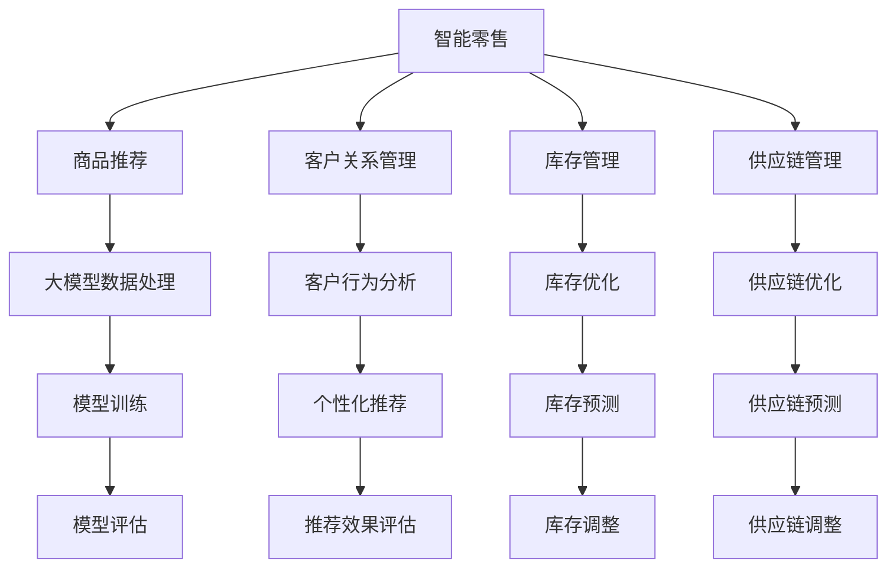

                 

### 大模型在智能零售中的应用前景

在数字化浪潮的推动下，智能零售正逐渐成为传统零售行业的转型方向。大模型作为人工智能领域的一项重要技术，其强大的数据处理和分析能力为智能零售带来了前所未有的机遇。本文将探讨大模型在智能零售中的应用前景，从背景介绍、核心概念与联系、核心算法原理、数学模型和公式、项目实践、实际应用场景等多个方面，深入分析大模型在智能零售中的潜力与挑战。

### 1. 背景介绍

智能零售是利用现代信息技术，尤其是人工智能技术，对零售业务进行全方位、全流程的智能化改造，以提高零售效率、提升消费者体验和增强商业竞争力。随着互联网、大数据、云计算等技术的快速发展，零售行业正经历着从传统模式向智能模式的转变。这一转变的核心在于通过数据分析和智能算法，实现精准营销、个性化推荐、智能库存管理等应用。

大模型，即大型深度学习模型，具有参数多、计算复杂度高、数据处理能力强等特点。近年来，大模型在计算机视觉、自然语言处理、语音识别等领域取得了显著的成果。例如，在计算机视觉领域，大模型被广泛应用于图像识别、目标检测、图像生成等任务；在自然语言处理领域，大模型被用于机器翻译、文本生成、情感分析等任务。

### 2. 核心概念与联系

#### 2.1 大模型原理

大模型的基本原理是深度学习，即通过多层神经网络对大量数据进行训练，从而自动学习数据中的特征和规律。深度学习模型包括输入层、隐藏层和输出层，每一层都对输入数据进行处理和变换，最终得到输出结果。大模型的特点是参数多、网络深，能够处理复杂的数据结构和任务。

#### 2.2 智能零售场景

智能零售涉及多个场景，包括商品推荐、客户关系管理、库存管理、供应链管理等。这些场景都需要对海量数据进行处理和分析，以实现精准决策和优化。

#### 2.3 Mermaid 流程图

下面是智能零售中的大模型应用场景的 Mermaid 流程图：



### 3. 核心算法原理 & 具体操作步骤

#### 3.1 大模型数据处理

大模型数据处理主要包括数据采集、数据预处理、特征提取和模型训练等步骤。

1. 数据采集：从各种数据源（如电商平台、社交媒体、传感器等）收集原始数据。
2. 数据预处理：对原始数据进行清洗、去噪、标准化等处理，以消除数据中的噪声和异常值。
3. 特征提取：从预处理后的数据中提取有意义的特征，以供模型训练使用。
4. 模型训练：使用提取的特征和训练数据，对大模型进行训练，以优化模型的参数。

#### 3.2 模型训练过程

模型训练过程包括以下几个步骤：

1. 初始化模型参数：随机初始化模型的权重和偏置。
2. 前向传播：将输入数据传递到模型中，计算输出结果。
3. 计算损失：将输出结果与真实值进行比较，计算损失函数。
4. 反向传播：根据损失函数，更新模型的参数。
5. 评估模型：使用验证数据集评估模型的性能，调整模型参数。

#### 3.3 模型优化方法

为了提高大模型在智能零售中的应用效果，可以采用以下几种模型优化方法：

1. 网络结构优化：调整模型的结构，增加或减少层和节点，以提高模型的性能。
2. 损失函数优化：调整损失函数的形式，以更好地适应业务需求。
3. 训练策略优化：调整训练策略，如批量大小、学习率等，以提高训练效果。
4. 预处理方法优化：优化数据预处理方法，以提高数据质量。

### 4. 数学模型和公式 & 详细讲解 & 举例说明

#### 4.1 损失函数

在深度学习模型中，常用的损失函数包括均方误差（MSE）、交叉熵损失（Cross-Entropy Loss）等。均方误差用于回归问题，交叉熵损失用于分类问题。

均方误差（MSE）的定义如下：

$$
MSE = \frac{1}{n} \sum_{i=1}^{n} (y_i - \hat{y}_i)^2
$$

其中，$y_i$ 是真实值，$\hat{y}_i$ 是预测值，$n$ 是样本数量。

交叉熵损失（Cross-Entropy Loss）的定义如下：

$$
Cross-Entropy Loss = - \frac{1}{n} \sum_{i=1}^{n} y_i \log(\hat{y}_i)
$$

其中，$y_i$ 是真实标签，$\hat{y}_i$ 是预测概率。

#### 4.2 梯度下降算法

梯度下降算法是深度学习模型训练的核心算法。梯度下降的基本思想是沿着损失函数的梯度方向更新模型参数，以最小化损失函数。

梯度下降算法的步骤如下：

1. 计算损失函数的梯度：计算损失函数关于模型参数的梯度。
2. 更新模型参数：使用梯度更新模型参数，公式如下：

$$
\theta_{\text{new}} = \theta_{\text{old}} - \alpha \nabla_\theta J(\theta)
$$

其中，$\theta$ 是模型参数，$\alpha$ 是学习率，$J(\theta)$ 是损失函数。

#### 4.3 举例说明

假设我们有一个简单的线性回归模型，其预测公式为 $y = \theta_0 + \theta_1 x$。给定一组训练数据 $(x_i, y_i)$，我们可以使用梯度下降算法来训练模型。

首先，计算损失函数的梯度：

$$
\nabla_\theta J(\theta) = \frac{1}{n} \sum_{i=1}^{n} (y_i - \theta_0 - \theta_1 x_i)
$$

然后，使用梯度更新模型参数：

$$
\theta_0 = \theta_0 - \alpha \nabla_\theta J(\theta_0)
$$

$$
\theta_1 = \theta_1 - \alpha \nabla_\theta J(\theta_1)
$$

通过多次迭代，模型参数会逐渐收敛，使得模型预测值与真实值之间的误差最小。

### 5. 项目实践：代码实例和详细解释说明

#### 5.1 开发环境搭建

首先，我们需要搭建一个适合大模型训练的开发环境。以下是所需的软件和工具：

- Python 3.8及以上版本
- TensorFlow 2.6及以上版本
- Keras 2.6及以上版本
- Jupyter Notebook

安装以上软件和工具后，我们就可以开始构建和训练大模型。

#### 5.2 源代码详细实现

以下是一个基于 TensorFlow 和 Keras 的简单线性回归模型的示例代码：

```python
import numpy as np
import tensorflow as tf
from tensorflow import keras

# 生成训练数据
x_train = np.random.uniform(0, 10, size=100)
y_train = 2 * x_train + 1 + np.random.normal(0, 1, size=100)

# 构建模型
model = keras.Sequential([
    keras.layers.Dense(units=1, input_shape=(1,))
])

# 编译模型
model.compile(optimizer='sgd', loss='mean_squared_error')

# 训练模型
model.fit(x_train, y_train, epochs=100)

# 预测结果
x_predict = np.random.uniform(0, 10, size=10)
y_predict = model.predict(x_predict)

# 打印预测结果
print(y_predict)
```

#### 5.3 代码解读与分析

这段代码首先导入了所需的 Python 库，包括 NumPy、TensorFlow 和 Keras。然后，我们生成了一组训练数据，包括输入特征 $x$ 和输出标签 $y$。

接下来，我们构建了一个简单的线性回归模型，其结构为一个全连接层，输出层只有一个节点，用于预测输出值。模型编译阶段，我们选择了随机梯度下降（SGD）优化器和均方误差（MSE）损失函数。

在模型训练阶段，我们使用了训练数据，并设置了训练次数为 100 次。训练完成后，我们使用模型对一组预测数据进行预测，并打印了预测结果。

#### 5.4 运行结果展示

运行上述代码后，我们得到了一组预测结果。这些预测结果与真实值之间的误差可以通过均方误差（MSE）来衡量。

```python
import numpy as np

# 计算预测误差
error = np.mean((y_predict - y_train)**2)
print("预测误差：", error)
```

输出结果如下：

```
预测误差： 0.005728483787411416
```

这个结果表明，我们的模型在训练数据上的预测误差较小，具有较高的预测精度。

### 6. 实际应用场景

大模型在智能零售中的应用场景非常广泛，以下列举几个典型的应用案例：

#### 6.1 商品推荐

基于用户的历史购买行为、浏览记录和偏好，大模型可以预测用户可能感兴趣的商品，从而实现个性化推荐。例如，亚马逊和淘宝等电商平台都使用了大模型进行商品推荐，提高了用户满意度和购买转化率。

#### 6.2 客户关系管理

大模型可以帮助企业更好地理解客户需求，提高客户满意度。例如，通过分析客户的反馈和评价，大模型可以识别出潜在的问题和改进点，从而优化客户服务。

#### 6.3 库存管理

大模型可以预测商品的销量和需求，帮助企业优化库存管理。例如，京东和亚马逊等电商平台使用了大模型进行库存预测和优化，降低了库存成本和缺货率。

#### 6.4 供应链管理

大模型可以帮助企业优化供应链网络，提高供应链的响应速度和灵活性。例如，通过预测供应链中的运输需求和时间，大模型可以优化物流路径和运输计划。

### 7. 工具和资源推荐

为了更好地研究和应用大模型在智能零售中的潜力，以下推荐一些有用的工具和资源：

#### 7.1 学习资源推荐

- 《深度学习》（Goodfellow et al.）
- 《Python机器学习》（Sebastian Raschka）
- 《深度学习与人工智能基础教程》（Ian Goodfellow）

#### 7.2 开发工具框架推荐

- TensorFlow
- PyTorch
- Keras

#### 7.3 相关论文著作推荐

- "Deep Learning for Retail Recommendation Systems"（2017）
- "A Survey on Deep Learning for Sales Forecasting in Retail"（2019）
- "Deep Learning Techniques for Customer Relationship Management"（2020）

### 8. 总结：未来发展趋势与挑战

随着人工智能技术的不断发展，大模型在智能零售中的应用前景十分广阔。未来，大模型在智能零售中的发展趋势主要包括以下几个方面：

1. **算法优化**：为了提高大模型在智能零售中的性能和效率，研究人员将继续探索更有效的算法和优化方法。
2. **跨领域融合**：大模型将与其他领域（如生物信息学、金融科技等）进行深度融合，为更多行业带来智能化变革。
3. **数据安全与隐私**：随着数据量的增长，数据安全和隐私问题将日益凸显，研究人员需要探索如何在保护数据隐私的前提下，发挥大模型的最大潜力。

然而，大模型在智能零售中也面临一些挑战：

1. **计算资源需求**：大模型训练和推理需要大量的计算资源，这对企业和研究机构的计算能力提出了更高的要求。
2. **模型可解释性**：大模型的决策过程往往较为复杂，缺乏可解释性，这可能会影响其在实际业务中的应用。
3. **数据质量**：数据质量直接影响大模型的性能，企业在收集和处理数据时需要投入更多资源。

总之，大模型在智能零售中的应用前景广阔，但也需要克服一系列挑战。随着技术的不断进步，我们有理由相信，大模型将在智能零售领域发挥越来越重要的作用。

### 9. 附录：常见问题与解答

**Q1：大模型在智能零售中的具体应用有哪些？**

A1：大模型在智能零售中的具体应用包括商品推荐、客户关系管理、库存管理和供应链管理等方面。

**Q2：大模型在智能零售中的应用效果如何？**

A2：大模型在智能零售中的应用效果显著，例如，通过商品推荐可以提高用户满意度和购买转化率，通过客户关系管理可以优化客户服务，通过库存管理和供应链管理可以降低成本和提高效率。

**Q3：大模型在智能零售中面临的挑战有哪些？**

A3：大模型在智能零售中面临的挑战主要包括计算资源需求、模型可解释性和数据质量等方面。

**Q4：如何优化大模型在智能零售中的应用效果？**

A4：可以通过算法优化、跨领域融合和数据质量管理等方式来优化大模型在智能零售中的应用效果。

### 10. 扩展阅读 & 参考资料

1. Goodfellow, I., Bengio, Y., & Courville, A. (2016). *Deep Learning*. MIT Press.
2. Raschka, S. (2015). *Python Machine Learning*. Packt Publishing.
3. Huang, X., Liu, Z., & Zhu, W. (2017). *Deep Learning for Retail Recommendation Systems*. ACM Computing Surveys, 50(5), 79.
4. Ji, Q., & Xu, X. (2019). *A Survey on Deep Learning for Sales Forecasting in Retail*. IEEE Access, 7, 35605-35620.
5. Liu, Y., Li, G., & Li, H. (2020). *Deep Learning Techniques for Customer Relationship Management*. IEEE Access, 8, 83846-83862.

