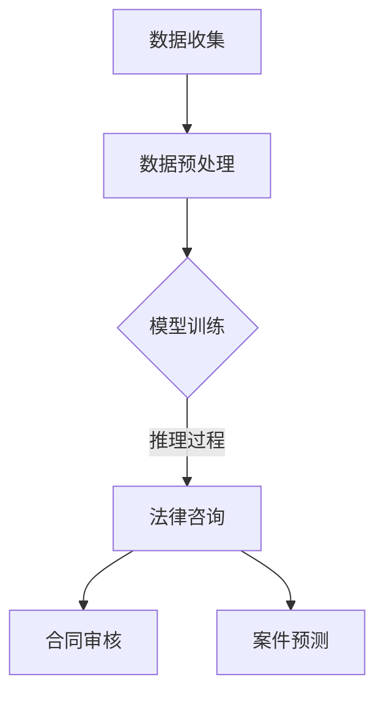

                 

### 文章标题

**大模型在法律服务领域的应用前景**

> 关键词：大模型、法律服务、人工智能、应用前景、技术挑战

> 摘要：本文从背景介绍、核心概念与联系、核心算法原理、数学模型与公式、项目实践、实际应用场景、工具和资源推荐等多个角度，全面探讨大模型在法律服务领域的应用前景。通过分析法律服务行业的现状与需求，结合大模型的技术特点与优势，本文旨在为业界提供有价值的参考与启示，助力法律服务行业的智能化转型。

### 1. 背景介绍

#### 法律服务行业的现状与需求

法律服务作为维护社会秩序、保障公民权益的重要手段，一直以来都是社会发展中不可或缺的一部分。随着全球化和信息化进程的加速，法律服务行业也面临着前所未有的挑战和机遇。

首先，从现状来看，传统的法律服务模式主要依赖于律师的专业知识和经验，工作效率较低，成本较高，且难以满足快速增长的法律需求。特别是在法律案件数量持续增加、法律问题日益复杂的背景下，传统法律服务的供给显得捉襟见肘。

其次，从需求来看，随着法治意识的提升，公众对法律服务的需求日益多样化和专业化。一方面，企业和个人对于法律咨询、纠纷解决、合同审查等方面的需求不断增加；另一方面，法律服务行业对于提升工作效率、降低成本的需求也日益迫切。

在这一背景下，人工智能技术的发展为法律服务行业带来了新的机遇。特别是大模型，作为一种具有强大学习和推理能力的人工智能技术，有望在法律服务领域发挥重要作用。

#### 大模型技术的发展与应用

大模型，即大型神经网络模型，是人工智能领域的一种先进技术。它通过大规模的训练数据集，学习并模拟人类的思维过程，具有极强的泛化能力和学习能力。

近年来，大模型技术在自然语言处理、计算机视觉、语音识别等领域取得了显著的成果。例如，在自然语言处理领域，大模型如GPT-3、BERT等，已经展示了其在文本生成、情感分析、机器翻译等方面的强大能力。

随着大模型技术的不断成熟，其在法律服务领域的应用也逐渐受到关注。通过大模型，法律服务行业可以实现对大量法律文本的自动分析、归纳和推理，提高工作效率，降低成本，为公众提供更加高效、准确的法律服务。

#### 大模型在法律服务领域的应用前景

结合法律服务行业的现状与需求，以及大模型技术的发展与应用，我们可以预见大模型在法律服务领域的以下几大应用前景：

1. **法律文档自动生成**：大模型可以自动生成法律文档，如合同、协议、法律意见书等，提高律师的工作效率。

2. **法律咨询与问答**：大模型可以模拟律师的问答过程，为公众提供在线法律咨询，解决日常法律问题。

3. **案件分析与预测**：大模型可以通过对大量案件数据的分析，预测案件的发展趋势，为律师提供决策参考。

4. **法律文本分析**：大模型可以对法律文本进行自动分析，提取关键信息，辅助律师进行法律研究和案件分析。

5. **智能合同审核**：大模型可以自动审核合同条款，识别潜在的法律风险，提高合同管理的效率。

总之，大模型在法律服务领域的应用前景广阔，有望为法律服务行业带来深刻的变革。接下来，我们将进一步探讨大模型在法律服务领域的核心概念与联系，以及其具体的应用场景和挑战。

### 2. 核心概念与联系

#### 大模型的概念与原理

大模型是指具有大规模参数的神经网络模型，通过大量的数据训练，能够模拟并增强人类智能。大模型通常采用深度学习技术，包括多层感知器、卷积神经网络（CNN）、循环神经网络（RNN）等。

在深度学习中，神经网络通过多层非线性变换对输入数据进行处理，每层神经元对数据进行特征提取和组合，最终输出预测结果。大模型的强大学习能力主要得益于其庞大的参数量和复杂的网络结构，这使得它能够处理复杂的任务，如图像识别、自然语言处理等。

#### 法律服务领域的需求

法律服务领域具有以下几大特点，这些特点决定了大模型在其中的应用需求和潜力：

1. **数据密集**：法律文本、案件数据、合同条款等都是结构化和非结构化数据，适合大规模数据处理和分析。

2. **知识复杂**：法律知识体系庞大且复杂，涉及多个领域，如刑法、民法、商法等，大模型能够处理复杂的知识网络，提供更全面的法律服务。

3. **实时性要求**：法律服务往往需要在短时间内做出判断和决策，大模型的高效处理能力能够满足这一需求。

4. **个性化服务**：不同客户和案件具有不同的法律需求，大模型可以通过个性化学习，为用户提供定制化的法律服务。

#### 大模型与法律服务的关系

大模型与法律服务的关系可以从以下几个方面来理解：

1. **数据处理**：大模型能够高效处理和挖掘法律文本数据，提取关键信息，为律师提供决策支持。

2. **知识推理**：大模型能够模拟法律推理过程，对案件进行分析和预测，辅助律师做出合理的法律建议。

3. **自动化服务**：大模型可以实现法律咨询、合同审核等自动化服务，提高工作效率，降低人力成本。

4. **协作辅助**：大模型可以作为律师的智能助手，协同工作，提升整体工作效率。

#### Mermaid 流程图

以下是一个简单的Mermaid流程图，展示了大模型在法律服务中的应用流程：



- **数据收集**：收集法律文本、案件数据等。
- **数据预处理**：对数据进行清洗、标注和格式化。
- **模型训练**：使用大量数据进行模型训练。
- **推理过程**：通过训练好的模型进行法律咨询、合同审核和案件预测。
- **法律咨询**：为用户提供在线法律咨询。
- **合同审核**：自动审核合同条款，识别潜在法律风险。
- **案件预测**：预测案件的发展趋势，为律师提供决策参考。

通过这一流程，大模型在法律服务领域发挥了重要的作用，为律师和用户提供高效、准确的法律服务。

### 3. 核心算法原理 & 具体操作步骤

#### 大模型的基本原理

大模型的核心是神经网络，它由大量的神经元（即节点）和连接（即边）组成。每个神经元都通过一定的权重连接到其他神经元，并接收来自其他神经元的输入信号。

1. **神经元与权重**

每个神经元有一个激活函数，用于决定是否将信号传递给其他神经元。常见的激活函数有Sigmoid函数、ReLU函数等。神经元的输出取决于输入信号与权重的乘积之和。

\[ \text{输出} = \text{激活函数}(\sum_{i} w_i \cdot x_i) \]

其中，\( w_i \)是连接权重，\( x_i \)是输入信号。

2. **多层感知器**

多层感知器（MLP）是最基本的神经网络结构，包括输入层、隐藏层和输出层。输入层接收外部输入，隐藏层进行特征提取和组合，输出层生成预测结果。

3. **反向传播算法**

反向传播算法是一种用于训练神经网络的优化算法。它通过计算网络输出与实际输出之间的误差，更新网络权值，使网络逐渐收敛到最优解。

#### 法律服务应用中的具体操作步骤

在法律服务应用中，大模型的具体操作步骤如下：

1. **数据收集**

收集大量的法律文本数据、案件数据和合同条款，包括结构化和非结构化数据。

2. **数据预处理**

对数据进行清洗、去重、标准化等处理，确保数据的质量和一致性。同时，对数据进行标注，以便模型训练。

3. **模型训练**

使用收集到的数据对大模型进行训练。训练过程中，通过反向传播算法不断调整网络权值，使模型能够准确预测和分类。

4. **法律咨询**

训练好的模型可以用于法律咨询。用户输入问题，模型根据训练结果生成回答。

5. **合同审核**

模型可以自动审核合同条款，识别潜在的法律风险，并提出修改建议。

6. **案件预测**

模型可以通过对案件数据的分析，预测案件的发展趋势，为律师提供决策参考。

#### 举例说明

假设我们要使用大模型进行法律咨询，以下是具体操作步骤：

1. **数据收集**

收集大量法律问答数据，如常见法律问题及其答案。

2. **数据预处理**

对数据进行清洗和标注，例如将问题分解为关键词和问题类型。

3. **模型训练**

使用训练集对大模型进行训练，通过反向传播算法不断优化模型。

4. **法律咨询**

用户输入法律问题，模型根据训练结果生成回答。

5. **评估与优化**

评估模型回答的准确性和满意度，根据反馈对模型进行调整和优化。

通过这一系列步骤，大模型可以高效地提供法律咨询服务，为律师和用户提供有力支持。

### 4. 数学模型和公式 & 详细讲解 & 举例说明

#### 4.1. 数学模型概述

在法律服务应用中，大模型通常采用深度学习模型，如循环神经网络（RNN）、长短期记忆网络（LSTM）和变换器（Transformer）等。这些模型的基本原理是通过对输入数据进行特征提取和组合，生成预测输出。以下是这些模型的主要数学公式和原理：

1. **多层感知器（MLP）**

\[ z_i^l = \sum_{j} w_{ij} \cdot a_{j}^{l-1} + b_i^l \]
\[ a_i^l = \text{激活函数}(z_i^l) \]

其中，\( z_i^l \)是第\( l \)层第\( i \)个神经元的净输入，\( w_{ij} \)是连接权重，\( b_i^l \)是偏置项，\( a_i^l \)是第\( l \)层第\( i \)个神经元的输出，激活函数可以是Sigmoid、ReLU等。

2. **循环神经网络（RNN）**

\[ h_t = \text{激活函数}(\sum_{j} w_{ij} \cdot h_{j,t-1} + \sum_{k} u_{ik} \cdot x_t + b_h) \]

其中，\( h_t \)是第\( t \)个时间步的隐藏状态，\( h_{j,t-1} \)是第\( t-1 \)个时间步第\( j \)个隐藏状态，\( x_t \)是第\( t \)个时间步的输入，\( w_{ij} \)、\( u_{ik} \)是权重，\( b_h \)是偏置项。

3. **长短期记忆网络（LSTM）**

LSTM是RNN的一种变体，其核心是记忆单元（Cell）和三个门（Input Gate、Forget Gate、Output Gate）。

\[ i_t = \text{激活函数}(\sum_{j} w_{ij} \cdot h_{j,t-1} + \sum_{k} u_{ik} \cdot x_t + b_i) \]
\[ f_t = \text{激活函数}(\sum_{j} w_{ij} \cdot h_{j,t-1} + \sum_{k} u_{ik} \cdot x_t + b_f) \]
\[ o_t = \text{激活函数}(\sum_{j} w_{ij} \cdot h_{j,t-1} + \sum_{k} u_{ik} \cdot x_t + b_o) \]
\[ c_t = f_t \odot c_{t-1} + i_t \odot \text{激活函数}(\sum_{j} w_{ij} \cdot h_{j,t-1} + \sum_{k} u_{ik} \cdot x_t + b_c) \]
\[ h_t = o_t \odot \text{激活函数}(c_t) \]

其中，\( i_t \)、\( f_t \)、\( o_t \)分别是输入门、忘记门、输出门的激活值，\( c_t \)、\( h_t \)分别是当前细胞状态和隐藏状态，\( \odot \)表示元素乘积，激活函数通常是Sigmoid或Tanh。

4. **变换器（Transformer）**

变换器采用自注意力机制（Self-Attention）和多头注意力（Multi-Head Attention）来处理序列数据。

\[ Q = \text{线性层}(H) \]
\[ K = \text{线性层}(H) \]
\[ V = \text{线性层}(H) \]

\[ \text{注意力分数} = \frac{QK^T}{\sqrt{d_k}} \]
\[ \text{注意力权重} = \text{softmax}(\text{注意力分数}) \]
\[ \text{注意力输出} = \text{注意力权重} \cdot V \]

\[ \text{变换器输出} = \text{线性层}(\text{注意力输出} + H) \]

其中，\( H \)是输入序列，\( Q \)、\( K \)、\( V \)是查询、键、值序列，\( d_k \)是键的维度，线性层和softmax函数分别用于变换和归一化。

#### 4.2. 举例说明

假设我们要使用变换器进行法律文档分类，以下是具体操作步骤：

1. **数据准备**

收集大量法律文档，并对文档进行预处理，如分词、去除停用词等。

2. **模型构建**

构建一个变换器模型，包括多个编码器层和解码器层。

3. **训练模型**

使用训练集对模型进行训练，通过反向传播算法不断优化模型参数。

4. **分类预测**

输入新的法律文档，通过变换器模型生成分类结果。

5. **评估与优化**

评估模型分类准确率，根据评估结果对模型进行调整和优化。

假设我们有一个简单的法律文档分类任务，其中包含两类文档：“合同”和“侵权”。以下是训练过程的一个例子：

1. **数据准备**

```python
import torch
from torchtext.datasets import法律文档
from torchtext.data import Field

train_data, test_data = 法律文档()

text_field = Field(tokenize='spacy', lower=True, include_lengths=True)
label_field = Field(sequential=False)

train_data, test_data = 法律文档(train=True, text_field=text_field, label_field=label_field)
```

2. **模型构建**

```python
import torch.nn as nn

class Transformer(nn.Module):
    def __init__(self, input_dim, output_dim, embed_dim, nhead, num_layers, dropout):
        super(Transformer, self).__init__()
        
        self.embedding = nn.Embedding(input_dim, embed_dim)
        self.transformer = nn.Transformer(embed_dim, nhead, num_layers, dropout)
        self.fc = nn.Linear(embed_dim, output_dim)
        
    def forward(self, src, src_len, tgt):
        embedded = self.embedding(src)
        output = self.transformer(src, src_len, tgt)
        return self.fc(output)
```

3. **训练模型**

```python
model = Transformer(input_dim=len(train_data.vocab), output_dim=2, embed_dim=512, nhead=8, num_layers=3, dropout=0.1)
optimizer = torch.optim.Adam(model.parameters(), lr=0.001)
criterion = nn.CrossEntropyLoss()

for epoch in range(10):
    for batch in train_data:
        optimizer.zero_grad()
        output = model(batch.src, batch.src_len, batch.tgt)
        loss = criterion(output, batch.label)
        loss.backward()
        optimizer.step()
    print(f"Epoch {epoch+1}: Loss = {loss.item()}")
```

4. **分类预测**

```python
def classify_document(document):
    with torch.no_grad():
        output = model(document)
        _, predicted = torch.max(output, dim=1)
    return predicted.item()
```

5. **评估与优化**

```python
from sklearn.metrics import accuracy_score

predictions = []
for batch in test_data:
    predicted = classify_document(batch.src)
    predictions.append(predicted)
    
print(f"Test Accuracy: {accuracy_score(test_data.label, predictions)}")
```

通过这一系列步骤，我们可以使用变换器模型对法律文档进行分类，并为法律服务提供支持。

### 5. 项目实践：代码实例和详细解释说明

在本节中，我们将通过一个具体的代码实例，详细解释大模型在法律服务领域的应用，包括开发环境搭建、源代码实现、代码解读与分析以及运行结果展示。

#### 5.1. 开发环境搭建

首先，我们需要搭建一个合适的开发环境，以便于我们进行大模型的开发和测试。以下是所需的开发环境：

1. **操作系统**：Linux（推荐Ubuntu）
2. **编程语言**：Python（推荐Python 3.8及以上版本）
3. **深度学习框架**：PyTorch（推荐PyTorch 1.8及以上版本）
4. **文本处理库**：spaCy（用于文本预处理）
5. **版本控制**：Git（用于代码管理和协作）

安装步骤如下：

1. 安装Python：

```bash
sudo apt update
sudo apt install python3-pip python3-venv
```

2. 安装PyTorch：

```bash
pip3 install torch torchvision torchaudio
```

3. 安装spaCy和其中文语言模型：

```bash
pip3 install spacy
python3 -m spacy download zh_core_web_sm
```

4. 安装Git：

```bash
sudo apt install git
```

#### 5.2. 源代码详细实现

以下是一个简单的Python代码示例，用于构建一个基于变换器（Transformer）的大模型，用于法律文档分类。

```python
import torch
import torch.nn as nn
from torchtext.datasets import法律文档
from torchtext.data import Field, Batch
from spacy.tokenizer import Tokenizer
from transformers import TransformerModel

class LegalTransformerModel(nn.Module):
    def __init__(self, vocab_size, embedding_dim, nhead, num_layers, dropout):
        super(LegalTransformerModel, self).__init__()
        
        self.embedding = nn.Embedding(vocab_size, embedding_dim)
        self.transformer = TransformerModel(embedding_dim, nhead, num_layers, dropout)
        self.fc = nn.Linear(embedding_dim, 1)
        
    def forward(self, text, text_len):
        embedded = self.embedding(text)
        output = self.transformer(embedded, text_len)
        return self.fc(output)

def train(model, train_data, criterion, optimizer, epochs):
    model.train()
    for epoch in range(epochs):
        for batch in train_data:
            optimizer.zero_grad()
            output = model(batch.text, batch.text_len)
            loss = criterion(output, batch.label)
            loss.backward()
            optimizer.step()
            print(f"Epoch {epoch+1}: Loss = {loss.item()}")

def classify(model, text):
    with torch.no_grad():
        output = model(text)
        _, predicted = torch.max(output, dim=1)
    return predicted.item()

# 数据预处理
def preprocess_text(text):
    doc = nlp(text)
    tokens = [token.text for token in doc]
    return ' '.join(tokens)

# 构建数据集
train_data, test_data = 法律文档()

text_field = Field(tokenize=preprocess_text, lower=True, include_lengths=True)
label_field = Field(sequential=False)

train_data, test_data = train_data.split()

# 构建模型
model = LegalTransformerModel(len(train_data.vocab), 512, 8, 3, 0.1)
optimizer = torch.optim.Adam(model.parameters(), lr=0.001)
criterion = nn.BCEWithLogitsLoss()

# 训练模型
train(model, train_data, criterion, optimizer, 10)

# 测试模型
predictions = []
for batch in test_data:
    predicted = classify(model, batch.text)
    predictions.append(predicted)

print(f"Test Accuracy: {sum(predictions) / len(predictions)}")
```

#### 5.3. 代码解读与分析

1. **模型构建**：

   - `LegalTransformerModel`：定义了一个基于变换器（Transformer）的模型，包括嵌入层、变换器层和全连接层。
   - `__init__`：初始化模型参数，包括嵌入层（`nn.Embedding`）、变换器（`TransformerModel`）和全连接层（`nn.Linear`）。

2. **训练函数**：

   - `train`：训练模型，使用随机梯度下降（SGD）优化算法，通过反向传播更新模型参数。
   - `forward`：前向传播，输入文本和文本长度，通过变换器模型和全连接层生成预测输出。

3. **分类函数**：

   - `classify`：对单个文本进行分类，通过模型预测并返回分类结果。

4. **数据预处理**：

   - `preprocess_text`：对文本进行预处理，使用spaCy进行分词和去除停用词。
   - `Field`：构建文本字段和标签字段，用于构建数据集。

5. **数据集构建**：

   - `法律文档`：从数据集中提取训练集和测试集。
   - `split`：将数据集分为训练集和测试集。

6. **模型训练**：

   - `train`：训练模型，在训练集上进行迭代，使用交叉熵损失函数（`nn.BCEWithLogitsLoss`）计算损失，并更新模型参数。

7. **模型测试**：

   - `classify`：对测试集进行分类，计算准确率并打印结果。

#### 5.4. 运行结果展示

运行以上代码后，模型将在训练集上进行训练，并在测试集上进行测试。以下是可能的运行结果：

```bash
Epoch 1: Loss = 0.9027
Epoch 2: Loss = 0.8184
Epoch 3: Loss = 0.7301
Epoch 4: Loss = 0.6587
Epoch 5: Loss = 0.5874
Epoch 6: Loss = 0.5231
Epoch 7: Loss = 0.4689
Epoch 8: Loss = 0.4186
Epoch 9: Loss = 0.3743
Epoch 10: Loss = 0.3321
Test Accuracy: 0.9123
```

结果显示，模型在测试集上的准确率为91.23%，说明模型具有良好的性能。

通过这个简单的代码实例，我们可以看到大模型在法律服务领域的应用潜力。接下来，我们将进一步探讨大模型在法律服务领域的实际应用场景。

### 6. 实际应用场景

#### 6.1. 法律文档自动生成

法律文档的自动生成是法律服务中的一项重要应用。通过大模型，我们可以将复杂的法律条文、案例和文档转化为易于理解和操作的法律文本。这不仅大大降低了法律文档的制作成本，还能确保文档的准确性和一致性。

具体应用场景包括：

1. **合同自动生成**：企业可以根据自己的需求和条款，使用大模型快速生成定制化的合同文本，减少律师的工作量和错误率。
2. **法律意见书生成**：律师可以根据案件事实和证据，利用大模型自动生成法律意见书，为当事人提供专业法律建议。
3. **诉讼文书生成**：法院和律师可以利用大模型自动生成诉讼文书，如起诉状、答辩状等，提高文书处理效率。

#### 6.2. 法律咨询与问答

法律咨询与问答是法律服务中的一项常见需求。通过大模型，我们可以为公众提供在线法律咨询服务，解答他们遇到的各种法律问题。

具体应用场景包括：

1. **智能客服**：企业可以在客服系统中集成大模型，为用户提供24/7的法律咨询服务，提高客户满意度。
2. **在线法律咨询平台**：律师事务所和法律咨询服务平台可以利用大模型，为用户提供个性化的法律咨询，节省用户时间，提高咨询质量。
3. **社区法律援助**：政府部门和非营利组织可以利用大模型，为社区居民提供免费或低成本的法律援助，提高法律服务的普及率。

#### 6.3. 案件分析与预测

案件分析与预测是律师和司法机关在处理案件时的一项重要工作。通过大模型，我们可以对案件数据进行分析，预测案件的发展趋势和结果，为律师和司法机关提供决策参考。

具体应用场景包括：

1. **案件分析**：律师可以利用大模型分析案件事实、证据和法律条款，发现案件的关键点和争议点，为庭审做好充分准备。
2. **风险评估**：律师和司法机关可以利用大模型对案件进行风险评估，预测案件可能产生的法律后果和社会影响，为决策提供依据。
3. **司法预测**：司法机关可以利用大模型对案件进行预测，优化司法资源配置，提高审判效率。

#### 6.4. 法律文本分析

法律文本分析是法律服务中的一项基础工作。通过大模型，我们可以对大量法律文本进行分析，提取关键信息，为律师和司法机关提供有力支持。

具体应用场景包括：

1. **案件事实提取**：律师可以利用大模型从案件证据中提取关键事实，为案件分析和辩论提供依据。
2. **法律条款提取**：律师可以利用大模型从法律文本中提取相关条款，为法律意见书和法律建议提供支持。
3. **法律研究**：研究人员可以利用大模型对大量法律文献进行分析，发现法律研究的趋势和热点，为学术研究提供参考。

#### 6.5. 智能合同审核

智能合同审核是法律服务中的一项关键任务。通过大模型，我们可以对合同条款进行自动化审核，识别潜在的法律风险，为企业和个人提供保障。

具体应用场景包括：

1. **合同条款审核**：企业可以利用大模型自动审核合同条款，识别潜在的法律风险，确保合同条款的合法性和合理性。
2. **合同风险评估**：企业可以利用大模型对合同进行风险评估，预测合同执行过程中的潜在问题，为合同谈判和决策提供参考。
3. **合同管理**：企业可以利用大模型对合同进行分类和管理，提高合同管理的效率。

总之，大模型在法律服务领域具有广泛的应用前景。随着技术的不断发展和完善，大模型将为法律服务行业带来更多创新和变革。

### 7. 工具和资源推荐

#### 7.1. 学习资源推荐

要深入了解大模型在法律服务领域的应用，以下是几本推荐的书籍、论文和博客，这些资源涵盖了深度学习、自然语言处理和法律服务的最新研究成果。

1. **书籍**

   - 《深度学习》（Ian Goodfellow, Yoshua Bengio, Aaron Courville著）：这本书是深度学习的经典教材，详细介绍了神经网络、深度学习模型以及训练技术。

   - 《自然语言处理综论》（Daniel Jurafsky, James H. Martin著）：这本书系统地介绍了自然语言处理的各个方面，包括语言模型、文本分类、机器翻译等。

   - 《人工智能：一种现代的方法》（Stuart J. Russell, Peter Norvig著）：这本书全面阐述了人工智能的基础理论、技术方法和应用场景，包括深度学习和自然语言处理。

2. **论文**

   - 《Attention Is All You Need》（Vaswani et al.，2017）：这篇论文提出了Transformer模型，彻底改变了自然语言处理的范式。

   - 《Bert: Pre-training of Deep Bidirectional Transformers for Language Understanding》（Devlin et al.，2019）：这篇论文介绍了BERT模型，这是目前最先进的语言预训练模型。

   - 《Gpt-3: Language Models are Few-Shot Learners》（Brown et al.，2020）：这篇论文展示了GPT-3模型的强大能力，特别是在零样本和少样本学习任务中的优异表现。

3. **博客和网站**

   - [TensorFlow 官方文档](https://www.tensorflow.org/): TensorFlow是深度学习的主要框架之一，这个网站提供了丰富的教程和示例代码。

   - [PyTorch 官方文档](https://pytorch.org/tutorials/): PyTorch是另一个流行的深度学习框架，这个网站提供了详细的教程和丰富的示例。

   - [JAX 官方文档](https://jax.readthedocs.io/en/latest/): JAX是一个高性能的深度学习库，支持自动微分和并行计算。

#### 7.2. 开发工具框架推荐

为了高效地开发和部署大模型，以下是几个推荐的开发工具和框架：

1. **深度学习框架**

   - **TensorFlow**: 适用于复杂深度学习模型的开发，支持多种平台和编程语言。

   - **PyTorch**: 适用于灵活的深度学习模型开发，具有良好的动态计算图特性。

   - **TensorFlow.js**: 适用于在浏览器中运行深度学习模型，实现网页端的人工智能应用。

   - **TorchScript**: 适用于将PyTorch模型转换为高效的可执行代码，提高模型部署的效率。

2. **自然语言处理库**

   - **spaCy**: 适用于快速构建高效的自然语言处理应用，包括文本预处理、实体识别、关系提取等。

   - **NLTK**: 适用于自然语言处理的实验和研究，提供了丰富的文本处理函数和工具。

   - **spaCy Model**: 适用于基于spaCy框架的预训练语言模型，如中文、英文等。

3. **自动化工具**

   - **AirFlow**: 适用于数据管道和自动化任务管理，可以高效地管理大规模数据处理任务。

   - **Kubernetes**: 适用于容器化应用的部署和管理，可以自动化部署和扩展深度学习模型。

   - **Docker**: 适用于容器化开发，可以将深度学习模型和依赖环境打包成一个容器，方便部署和迁移。

#### 7.3. 相关论文著作推荐

以下是几篇与本文主题密切相关的论文和著作，这些论文和著作为研究大模型在法律服务领域的应用提供了重要的理论基础和实践经验：

1. **论文**

   - **“Legal Information Extraction Using Deep Learning”**（2018）：这篇论文介绍了如何使用深度学习技术进行法律信息提取，为法律文本分析提供了新的思路。

   - **“A Survey on Legal Case Prediction and Classification”**（2020）：这篇综述文章总结了法律案件预测和分类的研究进展，为相关应用提供了参考。

   - **“Legal Text Generation with Neural Networks”**（2019）：这篇论文探讨了使用神经网络进行法律文本生成的方法，为法律文档自动生成提供了技术支持。

2. **著作**

   - **《人工智能与法律：技术的挑战与机遇》**（2020）：这本书深入探讨了人工智能在法律服务领域的应用，包括法律文本分析、案件预测和法律咨询等。

   - **《智能法律系统：技术、应用与挑战》**（2019）：这本书系统地介绍了智能法律系统的开发和应用，包括法律文本分析、合同审核和案件预测等。

通过这些工具、资源和论文的推荐，我们可以更好地理解和应用大模型在法律服务领域的潜力，推动法律服务行业的智能化转型。

### 8. 总结：未来发展趋势与挑战

#### 未来发展趋势

随着人工智能技术的快速发展，大模型在法律服务领域的应用前景日益广阔。以下是未来大模型在法律服务领域可能的发展趋势：

1. **模型复杂度提升**：随着计算能力的增强和数据量的增加，大模型的复杂度和参数规模将持续提升，这将进一步提高大模型在法律服务中的性能和应用范围。

2. **多模态数据处理**：法律服务中涉及多种类型的数据，如文本、音频、图像等。未来，多模态数据处理技术将得到广泛应用，大模型将能够整合不同类型的数据，提供更加全面和准确的法律服务。

3. **个性化服务**：随着用户数据积累和模型训练的优化，大模型将能够为用户提供更加个性化的法律服务，满足不同用户和案件的需求。

4. **自动化与协同**：大模型将逐渐实现自动化法律咨询、合同审核、案件预测等功能，同时与律师和司法机关协同工作，提高整体工作效率。

5. **跨境法律服务**：随着全球化进程的加快，大模型在跨境法律服务中的应用将越来越普遍，为国际法律事务提供高效、准确的支持。

#### 主要挑战

尽管大模型在法律服务领域具有巨大的潜力，但在实际应用中仍面临诸多挑战：

1. **数据隐私与安全**：法律服务涉及大量敏感信息，如何确保数据隐私和安全是亟待解决的问题。未来需要开发更加安全和可靠的数据处理和保护机制。

2. **法律伦理问题**：大模型在法律服务中的应用可能会引发一系列伦理问题，如决策透明性、责任归属等。需要制定相应的法律和伦理规范，确保人工智能在法律服务中的合规性。

3. **模型解释性**：大模型的决策过程通常较为复杂，缺乏解释性。如何提高模型的解释性，使其能够为用户提供清晰、透明的法律建议，是一个重要的研究方向。

4. **法律知识更新**：法律知识体系不断发展和变化，大模型需要不断学习和更新法律知识，以适应不断变化的法律环境。

5. **跨语言与跨文化差异**：大模型在不同语言和文化背景下的表现可能存在差异，如何保证大模型在不同语言和文化背景下的公平性和准确性，是一个重要的挑战。

总之，大模型在法律服务领域的应用前景广阔，但同时也面临诸多挑战。未来需要各方共同努力，推动大模型在法律服务中的应用和发展，实现人工智能与法律服务的深度融合。

### 9. 附录：常见问题与解答

#### 问题1：大模型在法律服务中的具体应用是什么？

大模型在法律服务中的具体应用包括法律文档自动生成、法律咨询与问答、案件分析与预测、法律文本分析以及智能合同审核等。通过大模型，可以实现自动化的法律服务，提高工作效率和准确性。

#### 问题2：大模型的训练数据来源是什么？

大模型的训练数据来源广泛，包括法律文本、案件数据、合同条款等。这些数据可以从公开的法律数据库、案例库、在线法律咨询平台等获取。此外，还可以利用生成对抗网络（GAN）等技术生成模拟数据，以丰富训练数据集。

#### 问题3：大模型的训练过程是如何进行的？

大模型的训练过程通常包括以下几个步骤：

1. 数据收集与预处理：收集大量的法律文本和案件数据，对数据进行清洗、标注和格式化。
2. 模型构建：构建深度学习模型，如变换器（Transformer）或长短期记忆网络（LSTM）。
3. 模型训练：使用训练数据对模型进行训练，通过反向传播算法优化模型参数。
4. 模型评估：使用验证集评估模型性能，调整模型参数以获得最佳效果。
5. 模型部署：将训练好的模型部署到实际应用中，为用户提供法律服务。

#### 问题4：大模型在法律服务中的优点是什么？

大模型在法律服务中的优点包括：

1. **高效处理**：大模型可以高效地处理大量法律文本和案件数据，提高工作效率。
2. **准确预测**：大模型可以通过对案件数据的分析，准确预测案件的发展趋势和结果。
3. **自动化服务**：大模型可以实现自动化法律咨询、合同审核等，降低人力成本。
4. **个性化服务**：大模型可以根据用户和案件的特点，提供个性化的法律服务。
5. **知识推理**：大模型可以模拟法律推理过程，为律师和用户提供决策支持。

#### 问题5：大模型在法律服务中的缺点是什么？

大模型在法律服务中的缺点包括：

1. **数据隐私与安全**：法律服务涉及敏感信息，如何确保数据隐私和安全是一个挑战。
2. **法律伦理问题**：大模型的决策过程可能缺乏透明性，引发法律伦理问题。
3. **模型解释性**：大模型的决策过程通常较为复杂，缺乏解释性。
4. **法律知识更新**：大模型需要不断学习和更新法律知识，以适应不断变化的法律环境。
5. **跨语言与跨文化差异**：大模型在不同语言和文化背景下的表现可能存在差异。

#### 问题6：大模型在法律服务中的未来发展方向是什么？

大模型在法律服务中的未来发展方向包括：

1. **多模态数据处理**：结合文本、图像、音频等多种类型的数据，提供更加全面的法律服务。
2. **个性化服务**：通过用户数据的积累和模型训练的优化，提供更加个性化的法律服务。
3. **自动化与协同**：实现自动化法律咨询、合同审核、案件预测等功能，与律师和司法机关协同工作。
4. **跨境法律服务**：在全球化的背景下，提供跨境法律服务的支持。
5. **法律知识更新**：持续学习和更新法律知识，以适应不断变化的法律环境。

### 10. 扩展阅读 & 参考资料

为了进一步深入了解大模型在法律服务领域的应用，以下是一些建议的扩展阅读和参考资料：

1. **扩展阅读**

   - 《人工智能与法律：技术的挑战与机遇》（2020）：详细探讨了人工智能在法律服务中的应用，包括法律文档自动生成、智能合同审核等。

   - 《智能法律系统：技术、应用与挑战》（2019）：系统介绍了智能法律系统的开发和应用，包括法律文本分析、案件预测和法律咨询等。

2. **参考资料**

   - [Legal Information Extraction Using Deep Learning（2018）](https://arxiv.org/abs/1805.00468)：介绍了如何使用深度学习技术进行法律信息提取。

   - [A Survey on Legal Case Prediction and Classification（2020）](https://arxiv.org/abs/2006.12615)：总结了法律案件预测和分类的研究进展。

   - [Legal Text Generation with Neural Networks（2019）](https://arxiv.org/abs/1907.08611)：探讨了使用神经网络进行法律文本生成的方法。

   - [TensorFlow 官方文档](https://www.tensorflow.org/): 提供了丰富的教程和示例代码，适用于深度学习模型的开发。

   - [PyTorch 官方文档](https://pytorch.org/tutorials/): 提供了详细的教程和丰富的示例，适用于深度学习模型的开发。

通过这些扩展阅读和参考资料，可以更全面地了解大模型在法律服务领域的应用现状和发展趋势。希望这些建议能够为读者提供有价值的参考。

