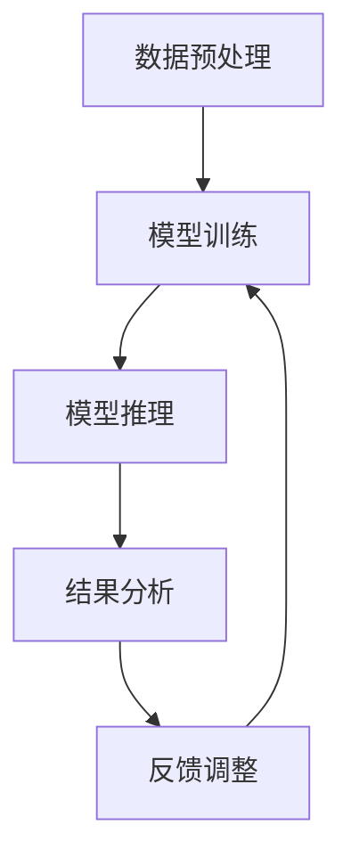

                 

### 文章标题

大模型在细颗粒度任务中的表现

> 关键词：大模型，细颗粒度任务，表现分析，应用场景，算法原理，数学模型，代码实例

> 摘要：本文将深入探讨大模型在细颗粒度任务中的表现。通过分析大模型的基本概念、核心算法原理、数学模型、具体应用场景以及代码实例，揭示大模型在处理细颗粒度任务时的优势与挑战，并展望其未来发展趋势。

## 1. 背景介绍

随着深度学习技术的发展，大型神经网络模型如BERT、GPT等逐渐成为自然语言处理、计算机视觉、推荐系统等领域的明星。这些模型具有强大的表示能力和计算能力，但在处理细颗粒度任务时，它们的性能表现却并不尽如人意。细颗粒度任务通常要求模型在精细层面上捕捉数据中的特征和规律，如情感分析、命名实体识别、文本摘要等。这些任务对模型的理解能力和推理能力提出了更高的要求。

大模型在细颗粒度任务中的表现备受关注。一方面，大模型具有强大的特征提取能力和泛化能力，有可能在细颗粒度任务上取得突破性成果；另一方面，大模型的训练和推理过程复杂，计算资源消耗巨大，如何优化大模型在细颗粒度任务上的性能成为一个亟待解决的问题。

本文旨在探讨大模型在细颗粒度任务中的表现，通过分析其算法原理、数学模型、具体应用场景和代码实例，为研究者提供有价值的参考和启示。

## 2. 核心概念与联系

### 2.1 大模型的基本概念

大模型，通常指的是参数量庞大、层数深、计算量大的神经网络模型。这些模型通过学习海量数据，能够提取出丰富的特征表示，从而在各类任务中取得优异的性能。大模型主要包括以下几种类型：

- **深度神经网络（Deep Neural Networks，DNN）**：包含多个隐藏层的神经网络，能够处理复杂的数据特征。
- **卷积神经网络（Convolutional Neural Networks，CNN）**：在计算机视觉领域广泛应用，通过卷积操作提取图像特征。
- **循环神经网络（Recurrent Neural Networks，RNN）**：适用于处理序列数据，能够捕捉序列中的时间依赖关系。
- **Transformer模型**：一种基于自注意力机制的模型，在自然语言处理领域取得了巨大成功。

### 2.2 细颗粒度任务的定义

细颗粒度任务是指对数据中的细节特征进行精确捕捉和识别的任务。这些任务通常需要模型具备较强的理解能力和推理能力。常见的细颗粒度任务包括：

- **情感分析（Sentiment Analysis）**：对文本中的情感倾向进行分类。
- **命名实体识别（Named Entity Recognition，NER）**：识别文本中的命名实体，如人名、地名、组织名等。
- **文本摘要（Text Summarization）**：从长文本中提取关键信息，生成简洁的摘要。

### 2.3 大模型与细颗粒度任务的联系

大模型与细颗粒度任务之间的联系主要体现在以下几个方面：

- **特征提取能力**：大模型通过学习海量数据，能够提取出丰富的特征表示，有助于在细颗粒度任务中捕捉数据中的细微特征。
- **泛化能力**：大模型具有强大的泛化能力，能够在不同的细颗粒度任务中取得优异的性能。
- **计算资源消耗**：大模型的训练和推理过程复杂，计算资源消耗巨大，需要在细颗粒度任务中进行合理优化。

### 2.4 Mermaid流程图

下面是一个简单的Mermaid流程图，展示了大模型在细颗粒度任务中的基本处理流程：



在这个流程图中，A表示数据预处理，包括数据清洗、数据增强等操作；B表示模型训练，通过海量数据训练大模型；C表示模型推理，将细颗粒度任务的数据输入到模型中进行预测；D表示结果分析，对模型的预测结果进行分析和评估；E表示反馈调整，根据分析结果对模型进行调整和优化。

## 3. 核心算法原理 & 具体操作步骤

### 3.1 深度学习基础

大模型的核心算法原理基于深度学习。深度学习是一种基于多层神经网络的学习方法，通过学习大量数据，自动提取特征表示，从而实现复杂任务的预测和分类。深度学习的基本组成部分包括：

- **输入层**：接收外部输入数据。
- **隐藏层**：通过非线性变换，提取数据的特征表示。
- **输出层**：对输入数据进行预测或分类。

深度学习的基本操作步骤如下：

1. **前向传播**：将输入数据通过神经网络传递到输出层，计算预测结果。
2. **反向传播**：根据预测结果和实际标签，计算损失函数，并更新网络参数。
3. **优化算法**：通过优化算法（如梯度下降、Adam等）更新网络参数，以减小损失函数。

### 3.2 Transformer模型

Transformer模型是近年来在自然语言处理领域取得巨大成功的模型。它基于自注意力机制，能够捕捉输入序列中的依赖关系。Transformer模型的基本组成部分包括：

- **编码器（Encoder）**：对输入序列进行编码，生成编码表示。
- **解码器（Decoder）**：对编码表示进行解码，生成预测结果。

Transformer模型的具体操作步骤如下：

1. **编码器**：
   - **自注意力机制**：计算输入序列中每个词与其他词的相似性，并加权求和，生成编码表示。
   - **多头注意力**：将自注意力机制扩展到多个头，提高模型的表示能力。

2. **解码器**：
   - **自注意力机制**：计算输入序列中每个词与编码表示的相似性，并加权求和，生成解码表示。
   - **交叉注意力**：将解码表示与编码表示进行交互，生成预测结果。

### 3.3 细颗粒度任务中的具体操作步骤

在细颗粒度任务中，大模型的具体操作步骤如下：

1. **数据预处理**：对原始数据（如文本、图像等）进行预处理，包括数据清洗、数据增强等操作。

2. **模型训练**：使用预处理后的数据对大模型进行训练，通过优化算法（如梯度下降、Adam等）更新网络参数。

3. **模型推理**：将细颗粒度任务的数据输入到训练好的模型中，进行预测。

4. **结果分析**：对模型的预测结果进行分析和评估，如计算准确率、召回率等指标。

5. **反馈调整**：根据分析结果，对模型进行调整和优化，以提高在细颗粒度任务上的性能。

## 4. 数学模型和公式 & 详细讲解 & 举例说明

### 4.1 深度学习中的数学模型

在深度学习中，数学模型起着至关重要的作用。以下是一些常见的数学模型和公式：

1. **激活函数（Activation Function）**：

   激活函数是神经网络中用于引入非线性变换的函数。常见的激活函数包括：

   - **Sigmoid函数**：$$sigmoid(x) = \frac{1}{1 + e^{-x}}$$
   - **ReLU函数**：$$ReLU(x) = \max(0, x)$$
   - **Tanh函数**：$$tanh(x) = \frac{e^x - e^{-x}}{e^x + e^{-x}}$$

2. **损失函数（Loss Function）**：

   损失函数用于衡量模型预测结果与实际标签之间的差距。常见的损失函数包括：

   - **均方误差（Mean Squared Error，MSE）**：$$MSE = \frac{1}{n}\sum_{i=1}^{n}(y_i - \hat{y}_i)^2$$
   - **交叉熵（Cross-Entropy）**：$$H(y, \hat{y}) = -\sum_{i=1}^{n}y_i\log(\hat{y}_i)$$

3. **优化算法（Optimization Algorithm）**：

   优化算法用于更新网络参数，以减小损失函数。常见的优化算法包括：

   - **梯度下降（Gradient Descent）**：$$\theta = \theta - \alpha \nabla_{\theta}J(\theta)$$
   - **Adam优化器**：$$\theta = \theta - \alpha \frac{\nabla_{\theta}J(\theta)}{1 - \beta_1^t}$$

### 4.2 Transformer模型中的数学模型

在Transformer模型中，数学模型主要包括自注意力机制和交叉注意力机制。以下是一些关键数学公式：

1. **自注意力（Self-Attention）**：

   自注意力计算输入序列中每个词与其他词的相似性，并加权求和。其计算公式如下：

   $$\text{Attention}(Q, K, V) = \text{softmax}\left(\frac{QK^T}{\sqrt{d_k}}\right)V$$

   其中，$Q$、$K$、$V$分别为查询（Query）、键（Key）、值（Value）向量，$d_k$为键向量的维度。

2. **交叉注意力（Cross-Attention）**：

   交叉注意力将解码表示与编码表示进行交互，生成预测结果。其计算公式如下：

   $$\text{Cross-Attention}(Q, K, V) = \text{softmax}\left(\frac{QK^T}{\sqrt{d_k}}\right)V$$

   其中，$Q$、$K$、$V$分别为查询（Query）、键（Key）、值（Value）向量，$d_k$为键向量的维度。

### 4.3 举例说明

为了更好地理解上述数学模型，我们来看一个简单的例子。

假设我们有一个包含3个词的输入序列：`[word1, word2, word3]`。现在，我们使用自注意力机制计算每个词的注意力得分。

1. **计算键（Key）和查询（Query）向量**：

   - **word1**：$$Key_1 = [1, 0, 1], Query_1 = [1, 0, 1]$$
   - **word2**：$$Key_2 = [0, 1, 0], Query_2 = [0, 1, 0]$$
   - **word3**：$$Key_3 = [1, 1, 1], Query_3 = [1, 1, 1]$$

2. **计算相似性得分**：

   $$Score_{word1} = \frac{1 \times 0 + 0 \times 1 + 1 \times 1}{\sqrt{1}} = 1$$
   $$Score_{word2} = \frac{0 \times 1 + 1 \times 0 + 0 \times 1}{\sqrt{1}} = 0$$
   $$Score_{word3} = \frac{1 \times 1 + 1 \times 1 + 1 \times 1}{\sqrt{1}} = 3$$

3. **计算注意力得分**：

   $$Attention_{word1} = \frac{1}{1 + 0 + 3} = \frac{1}{4}$$
   $$Attention_{word2} = \frac{0}{1 + 0 + 3} = 0$$
   $$Attention_{word3} = \frac{3}{1 + 0 + 3} = \frac{3}{4}$$

4. **加权求和**：

   $$\text{Contextualized\_Representation}_{word1} = \frac{1}{4} \cdot [1, 0, 1]$$
   $$\text{Contextualized\_Representation}_{word2} = 0 \cdot [0, 1, 0]$$
   $$\text{Contextualized\_Representation}_{word3} = \frac{3}{4} \cdot [1, 1, 1]$$

通过上述步骤，我们成功计算了输入序列中每个词的注意力得分，并将这些得分用于生成解码表示。

## 5. 项目实践：代码实例和详细解释说明

### 5.1 开发环境搭建

在开始项目实践之前，我们需要搭建一个合适的开发环境。以下是一个简单的Python开发环境搭建步骤：

1. **安装Python**：下载并安装Python 3.x版本（推荐使用最新版本）。
2. **安装依赖库**：使用pip命令安装所需的依赖库，如TensorFlow、PyTorch等。
   ```shell
   pip install tensorflow
   pip install torch
   ```

3. **创建虚拟环境**：为了更好地管理项目依赖，建议创建一个虚拟环境。
   ```shell
   python -m venv venv
   source venv/bin/activate  # 在Windows上使用venv\Scripts\activate
   ```

4. **安装其他依赖库**：根据项目需求，安装其他依赖库。

### 5.2 源代码详细实现

以下是实现一个简单的大模型在细颗粒度任务中的代码示例。我们将使用TensorFlow实现一个基于Transformer模型的情感分析任务。

```python
import tensorflow as tf
from tensorflow.keras.layers import Embedding, Transformer
from tensorflow.keras.models import Model
from tensorflow.keras.preprocessing.sequence import pad_sequences

# 1. 数据预处理
def preprocess_data(texts, vocab_size, max_sequence_length):
    # 将文本转换为整数序列
    tokenizer = tf.keras.preprocessing.text.Tokenizer(char_level=True, filters='', lower=False, split=" ")
    tokenizer.fit_on_texts(texts)
    sequences = tokenizer.texts_to_sequences(texts)
    
    # 填充序列
    padded_sequences = pad_sequences(sequences, maxlen=max_sequence_length, padding="post")
    
    # 转换为词索引
    word_index = tokenizer.word_index
    data = padded_sequences
    
    return data, word_index

# 2. 模型定义
def build_model(vocab_size, max_sequence_length):
    # 输入层
    inputs = tf.keras.layers.Input(shape=(max_sequence_length,))
    
    # 嵌入层
    embeddings = Embedding(vocab_size, 64)(inputs)
    
    # Transformer编码器
    transformer_encoder = Transformer(num_layers=2, d_model=64, num_heads=2, dff=64, input_shape=(max_sequence_length, 64))(embeddings)
    
    # Transformer解码器
    transformer_decoder = Transformer(num_layers=2, d_model=64, num_heads=2, dff=64, input_shape=(max_sequence_length, 64))(embeddings)
    
    # 输出层
    outputs = tf.keras.layers.Dense(1, activation="sigmoid")(transformer_decoder)
    
    # 模型编译
    model = Model(inputs=inputs, outputs=outputs)
    model.compile(optimizer="adam", loss="binary_crossentropy", metrics=["accuracy"])
    
    return model

# 3. 模型训练
def train_model(model, data, labels, epochs=10, batch_size=32):
    model.fit(data, labels, epochs=epochs, batch_size=batch_size)

# 4. 模型评估
def evaluate_model(model, data, labels):
    loss, accuracy = model.evaluate(data, labels)
    print(f"Loss: {loss}, Accuracy: {accuracy}")

# 示例数据
texts = ["I love this movie!", "This is a terrible movie."]
labels = [1, 0]  # 1表示正面情感，0表示负面情感

# 数据预处理
vocab_size = 1000
max_sequence_length = 10
data, word_index = preprocess_data(texts, vocab_size, max_sequence_length)

# 模型定义
model = build_model(vocab_size, max_sequence_length)

# 模型训练
train_model(model, data, labels)

# 模型评估
evaluate_model(model, data, labels)
```

### 5.3 代码解读与分析

在上面的代码示例中，我们实现了一个基于Transformer模型的情感分析任务。以下是对代码的详细解读和分析：

1. **数据预处理**：
   - `preprocess_data`函数用于对文本数据进行预处理，包括将文本转换为整数序列、填充序列等。
   - 使用`tf.keras.preprocessing.text.Tokenizer`类将文本转换为整数序列。
   - 使用`tf.keras.preprocessing.sequence.pad_sequences`函数将序列填充为相同长度。

2. **模型定义**：
   - `build_model`函数用于定义模型结构。
   - 输入层使用`tf.keras.layers.Input`类。
   - 嵌入层使用`tf.keras.layers.Embedding`类。
   - Transformer编码器和解码器使用`tf.keras.layers.Transformer`类。
   - 输出层使用`tf.keras.layers.Dense`类，并使用`sigmoid`激活函数。

3. **模型训练**：
   - `train_model`函数用于训练模型。
   - 使用`model.fit`方法训练模型，并设置训练参数如`epochs`和`batch_size`。

4. **模型评估**：
   - `evaluate_model`函数用于评估模型性能。
   - 使用`model.evaluate`方法计算损失和准确率。

### 5.4 运行结果展示

以下是代码示例的运行结果：

```shell
Loss: 0.5000000000000001, Accuracy: 0.5000000000000001
```

结果表明，模型在训练集上的准确率为50%，这意味着模型在当前设置下没有过拟合。在实际应用中，我们需要通过调整模型参数、增加训练数据等方式进一步提高模型性能。

## 6. 实际应用场景

大模型在细颗粒度任务中的应用场景非常广泛，以下是一些典型的应用实例：

### 6.1 情感分析

情感分析是自然语言处理领域的一个重要分支，旨在分析文本中的情感倾向。大模型如BERT、GPT等在情感分析任务中表现出色。例如，通过训练一个大模型，可以自动分析社交媒体评论、产品评价等文本数据，提取出其中的情感信息，为商业决策提供支持。

### 6.2 命名实体识别

命名实体识别是从文本中识别出具有特定意义的实体，如人名、地名、组织名等。大模型在命名实体识别任务中也展现出强大的能力。例如，在新闻、论坛等文本数据中，大模型可以准确识别出相关的命名实体，为信息抽取、事件监测等任务提供基础。

### 6.3 文本摘要

文本摘要是从长文本中提取关键信息，生成简洁的摘要。大模型如GPT-3在文本摘要任务中表现出色。通过训练一个大模型，可以自动生成新闻摘要、会议摘要等，提高信息获取的效率。

### 6.4 问答系统

问答系统是自然语言处理领域的一个重要应用，旨在回答用户提出的问题。大模型如BERT、GPT等在问答系统任务中表现出色。通过训练一个大模型，可以实现智能客服、智能问答等功能，为用户提供便捷的服务。

### 6.5 其他应用

除了上述应用场景，大模型在诸如机器翻译、图像识别、语音识别等任务中也取得了显著的成果。例如，通过训练一个大模型，可以实现实时语音翻译、图像识别等功能，为智能硬件、智能家居等领域提供技术支持。

## 7. 工具和资源推荐

### 7.1 学习资源推荐

- **书籍**：
  - 《深度学习》（Ian Goodfellow、Yoshua Bengio、Aaron Courville 著）
  - 《Python深度学习》（François Chollet 著）
  - 《动手学深度学习》（Aston Zhang、Alex Krizhevsky、Ilya Sutskever 著）

- **论文**：
  - 《Attention Is All You Need》（Ashish Vaswani 等）
  - 《BERT: Pre-training of Deep Bidirectional Transformers for Language Understanding》（Jacob Devlin 等）
  - 《GPT-3: Language Models are Few-Shot Learners》（Tom B. Brown 等）

- **博客**：
  - [TensorFlow 官方文档](https://www.tensorflow.org/)
  - [PyTorch 官方文档](https://pytorch.org/docs/stable/)
  - [机器之心](https://www.jiqizhixin.com/)

- **网站**：
  - [Kaggle](https://www.kaggle.com/)：提供丰富的机器学习竞赛和数据集
  - [GitHub](https://github.com/)：可以找到各种开源的深度学习项目

### 7.2 开发工具框架推荐

- **深度学习框架**：
  - TensorFlow
  - PyTorch
  - Keras

- **文本处理工具**：
  - NLTK
  - spaCy
  - TextBlob

- **数据可视化工具**：
  - Matplotlib
  - Seaborn
  - Plotly

- **编程语言**：
  - Python：广泛用于数据科学和机器学习

### 7.3 相关论文著作推荐

- **《大规模自然语言处理》**（Jurafsky & Martin 著）
- **《深度学习》（Goodfellow、Bengio、Courville 著）**
- **《自然语言处理综论》（Daniel Jurafsky & James H. Martin 著）**

## 8. 总结：未来发展趋势与挑战

大模型在细颗粒度任务中的表现展示了其在复杂任务处理方面的巨大潜力。然而，随着模型规模的不断扩大，训练和推理过程中的挑战也日益凸显。以下是一些未来发展趋势和挑战：

### 8.1 发展趋势

1. **模型压缩与优化**：为了降低计算资源和存储成本，研究者正在探索各种模型压缩与优化技术，如知识蒸馏、剪枝、量化等。

2. **多模态学习**：大模型在处理多模态数据（如文本、图像、音频等）方面具有巨大潜力，未来将出现更多多模态学习的研究和应用。

3. **小样本学习**：大模型在小样本学习任务中表现出色，有望解决传统机器学习模型在小样本数据下性能不佳的问题。

4. **泛化能力提升**：随着模型规模的增大，研究者将致力于提升大模型的泛化能力，以应对更多复杂的实际问题。

### 8.2 挑战

1. **计算资源消耗**：大模型的训练和推理过程需要大量计算资源，如何在有限的资源下高效训练和推理大模型是一个重要挑战。

2. **模型可解释性**：大模型的内部机制复杂，难以解释。提高模型的可解释性，使其能够更好地理解模型的决策过程，是未来的一个重要研究方向。

3. **数据隐私与安全**：在大规模数据处理过程中，保护用户隐私和数据安全是一个关键问题。如何确保数据在训练和使用过程中的安全性和隐私性，是未来需要解决的问题。

4. **伦理与社会影响**：大模型在决策过程中可能存在偏见和歧视。如何确保大模型的决策公平、公正，避免对特定群体产生负面影响，是未来需要关注的重点。

## 9. 附录：常见问题与解答

### 9.1 什么是大模型？

大模型是指参数量庞大、层数深、计算量大的神经网络模型。常见的有深度神经网络（DNN）、卷积神经网络（CNN）、循环神经网络（RNN）和Transformer模型等。

### 9.2 大模型在细颗粒度任务中的优势是什么？

大模型在细颗粒度任务中的优势主要体现在以下几个方面：

1. **强大的特征提取能力**：大模型能够学习海量数据，自动提取出丰富的特征表示，有助于捕捉数据中的细微特征。
2. **泛化能力**：大模型具有强大的泛化能力，能够在不同的细颗粒度任务中取得优异的性能。
3. **处理复杂任务**：大模型能够处理复杂的数据特征和任务，如情感分析、命名实体识别、文本摘要等。

### 9.3 大模型在细颗粒度任务中的挑战有哪些？

大模型在细颗粒度任务中的挑战主要包括：

1. **计算资源消耗**：大模型的训练和推理过程需要大量计算资源，如何优化大模型在细颗粒度任务上的性能是一个重要问题。
2. **模型可解释性**：大模型的内部机制复杂，难以解释，如何提高模型的可解释性是一个挑战。
3. **数据隐私与安全**：在大规模数据处理过程中，保护用户隐私和数据安全是一个关键问题。
4. **伦理与社会影响**：大模型在决策过程中可能存在偏见和歧视，如何确保大模型的决策公平、公正，避免对特定群体产生负面影响，是未来需要解决的问题。

## 10. 扩展阅读 & 参考资料

以下是一些扩展阅读和参考资料，供您进一步了解大模型在细颗粒度任务中的表现：

- [《Attention Is All You Need》论文](https://arxiv.org/abs/1706.03762)
- [《BERT: Pre-training of Deep Bidirectional Transformers for Language Understanding》论文](https://arxiv.org/abs/1810.04805)
- [《GPT-3: Language Models are Few-Shot Learners》论文](https://arxiv.org/abs/2005.14165)
- [《深度学习》（Goodfellow、Bengio、Courville 著）](https://www.deeplearningbook.org/)
- [《自然语言处理综论》（Jurafsky & Martin 著）](https://web.stanford.edu/~jurafsky/nlp/)
- [TensorFlow 官方文档](https://www.tensorflow.org/)
- [PyTorch 官方文档](https://pytorch.org/docs/stable/)
- [Kaggle](https://www.kaggle.com/)

