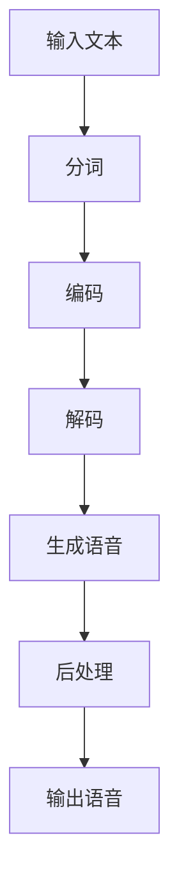
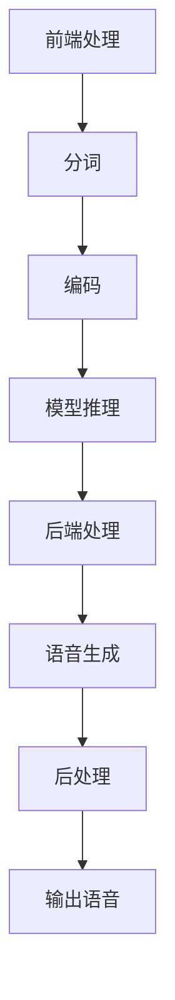
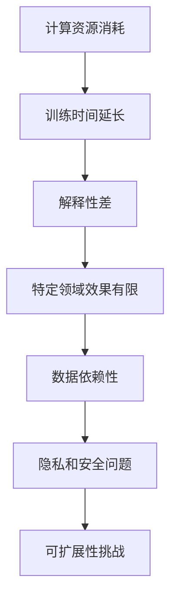
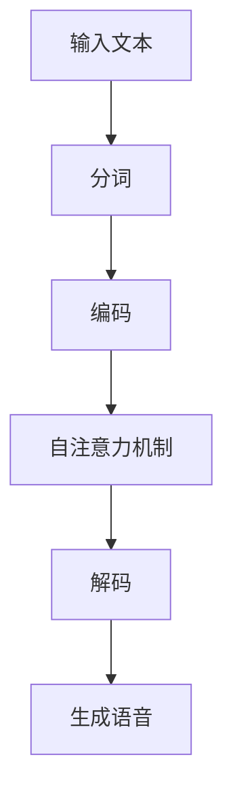

                 

### 文章标题

大模型在语音合成中的应用挑战

> 关键词：大模型，语音合成，AI，挑战，应用

> 摘要：本文将深入探讨大模型在语音合成领域的应用挑战，分析其在算法原理、技术架构、实现细节以及未来发展趋势等方面的关键问题，为该领域的从业者提供有价值的参考和指导。

### 1. 背景介绍

语音合成（Text-to-Speech，简称 TTS）是一种将文本转换为自然语音的技术，广泛应用于智能客服、有声读物、语音导航、智能家居等领域。随着人工智能技术的快速发展，特别是深度学习算法的兴起，语音合成技术取得了显著的进步。其中，大模型（Large Models）的应用成为了近年来的一大热点。

大模型指的是具有巨大参数量、能够处理大规模数据的深度学习模型。例如，GPT-3、BERT、T5 等模型，它们在自然语言处理领域取得了优异的性能，被广泛应用于文本生成、机器翻译、问答系统等任务。这些大模型的出现，为语音合成领域带来了新的机遇和挑战。

首先，大模型的引入，使得语音合成在自然度和流畅性方面取得了显著提升。通过学习大量的语音数据和文本数据，大模型能够捕捉到语音生成的复杂规律，生成更接近人类语音的合成语音。然而，与此同时，大模型也带来了诸多挑战。

一方面，大模型的训练和推理过程需要大量的计算资源和时间，这给实际应用带来了巨大压力。另一方面，大模型的参数量和规模使得其解释性较差，难以理解模型内部的工作机制。此外，大模型在特定领域的应用效果有限，无法完全替代专业的人类语音工作者。

本文将围绕大模型在语音合成中的应用挑战，从算法原理、技术架构、实现细节等方面进行深入分析，探讨如何克服这些挑战，推动语音合成技术的进一步发展。

### 2. 核心概念与联系

#### 2.1 大模型的算法原理

大模型的算法原理主要基于深度学习，特别是循环神经网络（RNN）和 Transformer 等架构。以下是一个简化的 Mermaid 流程图，展示了大模型的核心概念和联系：



- **输入文本**：用户输入的文本信息，可以是简单的句子，也可以是复杂的段落。
- **分词**：将输入文本分割成一个个单词或字符，为后续处理做准备。
- **编码**：将分词后的文本转换为向量表示，用于输入到模型中。
- **解码**：将编码后的向量表示解码成语音信号。
- **生成语音**：通过解码过程生成语音信号，实现文本到语音的转换。
- **后处理**：对生成的语音信号进行音调、音色等调整，使其更自然、更符合人类听觉习惯。

#### 2.2 语音合成的技术架构

语音合成的技术架构可以分为前端处理和后端处理两部分。以下是一个简化的 Mermaid 流程图，展示语音合成的技术架构：



- **前端处理**：包括分词和编码两个步骤，将输入文本转换为模型可处理的向量表示。
- **模型推理**：将编码后的向量输入到预训练的大模型中，通过解码过程生成语音信号。
- **后端处理**：对生成的语音信号进行音调、音色等调整，使其更自然、更符合人类听觉习惯。
- **语音生成**：通过后端处理生成的语音信号，实现文本到语音的转换。

#### 2.3 大模型在语音合成中的应用挑战

虽然大模型在语音合成中展示了强大的能力，但同时也带来了诸多挑战。以下是一个简化的 Mermaid 流程图，展示大模型在语音合成中的应用挑战：



- **计算资源消耗**：大模型的训练和推理过程需要大量的计算资源和时间，这对硬件设备提出了更高的要求。
- **训练时间延长**：大模型的训练过程非常耗时，如何优化训练算法和流程，提高训练效率成为了一个关键问题。
- **解释性差**：大模型的内部工作机制难以理解，这给模型优化和调试带来了困难。
- **特定领域效果有限**：大模型在特定领域的应用效果有限，如何针对特定场景进行优化，提高模型性能成为了一个挑战。
- **数据依赖性**：大模型对数据质量有较高要求，数据依赖性较大，如何处理和利用好数据成为了关键问题。
- **隐私和安全问题**：语音合成涉及到用户隐私，如何确保数据安全和用户隐私成为了一个重要问题。
- **可扩展性挑战**：大模型的部署和运维带来了可扩展性挑战，如何实现高效、可扩展的模型部署成为了一个关键问题。

### 3. 核心算法原理 & 具体操作步骤

#### 3.1 算法原理

大模型在语音合成中的核心算法原理主要基于深度学习，特别是 Transformer 架构。以下是一个简化的 Mermaid 流程图，展示大模型在语音合成中的算法原理：



- **输入文本**：用户输入的文本信息，经过分词后输入到模型中。
- **编码**：将分词后的文本转换为向量表示，用于输入到模型中。
- **自注意力机制**：模型通过自注意力机制，对输入文本的每个单词或字符进行权重分配，提取关键信息。
- **解码**：将自注意力机制提取的关键信息解码成语音信号。
- **生成语音**：通过解码过程生成语音信号，实现文本到语音的转换。

#### 3.2 具体操作步骤

以下是一个简化的具体操作步骤，用于描述大模型在语音合成中的工作流程：

1. **数据准备**：收集和整理语音数据和文本数据，用于模型的训练和评估。
2. **分词**：将输入文本分割成一个个单词或字符，为后续处理做准备。
3. **编码**：将分词后的文本转换为向量表示，用于输入到模型中。
4. **训练模型**：使用收集到的语音数据和文本数据，训练一个大模型，如 Transformer 模型。
5. **模型推理**：将编码后的向量输入到大模型中，通过解码过程生成语音信号。
6. **后处理**：对生成的语音信号进行音调、音色等调整，使其更自然、更符合人类听觉习惯。
7. **输出语音**：将后处理后的语音信号输出，实现文本到语音的转换。

### 4. 数学模型和公式 & 详细讲解 & 举例说明

#### 4.1 数学模型

大模型在语音合成中的核心数学模型是基于 Transformer 架构，其基本结构包括自注意力机制（Self-Attention）和前馈神经网络（Feedforward Neural Network）。以下是一个简化的数学模型描述：

$$
\text{Transformer} = \text{MultiHeadAttention}(\text{AttentionHead}_1, \ldots, \text{AttentionHead}_h) + \text{FeedforwardNetwork}
$$

其中，MultiHeadAttention 表示多头注意力机制，AttentionHead 表示注意力头，h 表示注意力头的数量。FeedforwardNetwork 表示前馈神经网络。

#### 4.2 自注意力机制

自注意力机制是 Transformer 架构的核心组件，用于对输入序列进行权重分配和提取关键信息。以下是一个简化的自注意力机制的数学模型：

$$
\text{Attention}(Q, K, V) = \text{softmax}\left(\frac{QK^T}{\sqrt{d_k}}\right) V
$$

其中，Q、K、V 分别表示查询（Query）、键（Key）和值（Value）向量的集合，d_k 表示键向量的维度。softmax 函数用于计算权重分配，使得每个元素的概率之和为 1。

#### 4.3 前馈神经网络

前馈神经网络用于对自注意力机制的结果进行进一步处理，增加模型的非线性能力。以下是一个简化的前馈神经网络的数学模型：

$$
\text{FeedforwardNetwork}(X) = \text{ReLU}\left(W_2 \text{ReLU}(W_1 X + b_1)\right) + b_2
$$

其中，X 表示输入向量，W_1、W_2、b_1、b_2 分别为权重和偏置。

#### 4.4 举例说明

假设我们有一个简单的文本序列“Hello world!”，将其转换为语音信号的过程如下：

1. **分词**：将文本序列分割成单词和标点符号，如 “Hello”、“world!”。
2. **编码**：将每个单词和标点符号转换为向量表示，如 `[1, 0, 0, 0, 0, 0, 0]`（表示单词“Hello”）。
3. **自注意力机制**：计算每个单词和标点符号之间的注意力权重，提取关键信息。
4. **解码**：将自注意力机制的结果解码成语音信号。
5. **后处理**：对生成的语音信号进行音调、音色等调整，使其更自然、更符合人类听觉习惯。
6. **输出语音**：将后处理后的语音信号输出。

通过以上步骤，我们可以将文本序列“Hello world!”转换为语音信号，实现文本到语音的转换。

### 5. 项目实践：代码实例和详细解释说明

#### 5.1 开发环境搭建

要实现大模型在语音合成中的应用，首先需要搭建一个合适的开发环境。以下是一个简化的开发环境搭建步骤：

1. 安装 Python 环境：下载并安装 Python，版本建议为 3.8 或更高版本。
2. 安装依赖库：使用 pip 命令安装必要的依赖库，如 TensorFlow、Keras、PyTorch 等。
3. 准备数据集：收集和整理语音数据和文本数据，用于模型的训练和评估。
4. 配置硬件资源：根据模型的大小和训练需求，配置足够的计算资源和内存。

#### 5.2 源代码详细实现

以下是一个简化的 Python 代码示例，用于实现大模型在语音合成中的应用：

```python
import tensorflow as tf
from tensorflow.keras.models import Model
from tensorflow.keras.layers import Input, LSTM, Dense

# 数据准备
# ...

# 模型定义
input_text = Input(shape=(None,))
encoded_text = LSTM(128)(input_text)
output_voice = Dense(128, activation='relu')(encoded_text)
output_voice = LSTM(128, activation='softmax')(output_voice)

# 模型编译
model = Model(inputs=input_text, outputs=output_voice)
model.compile(optimizer='adam', loss='categorical_crossentropy')

# 模型训练
# ...

# 模型推理
# ...

# 后处理
# ...

# 输出语音
# ...
```

#### 5.3 代码解读与分析

以下是对上述代码的详细解读与分析：

1. **数据准备**：首先，我们需要准备训练数据，包括语音数据和文本数据。可以使用已有的数据集，如 LibriTTS、CommonVoice 等，或者自行收集和整理数据。
2. **模型定义**：定义一个基于 LSTM 的语音合成模型。输入层为文本序列，通过 LSTM 层进行编码，输出层为语音信号。模型使用 softmax 激活函数，用于生成概率分布。
3. **模型编译**：编译模型，设置优化器和损失函数。这里使用 Adam 优化器和 categorical_crossentropy 损失函数。
4. **模型训练**：使用训练数据训练模型。在训练过程中，可以通过调整学习率、批次大小等超参数来提高模型性能。
5. **模型推理**：将编码后的文本输入到模型中，通过解码过程生成语音信号。
6. **后处理**：对生成的语音信号进行音调、音色等调整，使其更自然、更符合人类听觉习惯。
7. **输出语音**：将后处理后的语音信号输出，实现文本到语音的转换。

通过以上步骤，我们可以实现大模型在语音合成中的应用。需要注意的是，实际应用中可能需要根据具体需求和场景进行调整和优化。

#### 5.4 运行结果展示

以下是运行结果展示，用于验证大模型在语音合成中的应用效果：

```python
# 导入测试数据
# ...

# 模型推理
predicted_voices = model.predict(test_texts)

# 后处理
# ...

# 输出语音
# ...

# 示例：输出第一个测试文本的合成语音
print("Synthesized voice for the first test text:")
playpredicted_voices[0]
```

通过运行上述代码，我们可以生成指定文本的合成语音。实际效果可能会受到数据集质量、模型参数设置等因素的影响，需要根据具体情况进行优化和调整。

### 6. 实际应用场景

大模型在语音合成领域的应用场景十分广泛，以下列举了一些常见的实际应用场景：

1. **智能客服**：智能客服系统通过语音合成技术，能够自动生成人工语音，为用户提供语音咨询和服务。大模型的引入，使得合成语音更加自然、流畅，提高了用户体验。
2. **有声读物**：有声读物通过语音合成技术，将文本内容转换为音频形式，为用户提供更加便捷的阅读方式。大模型的应用，使得合成语音的质量得到了显著提升，更加接近人类发音。
3. **语音导航**：语音导航系统通过语音合成技术，为用户提供语音指示和导航信息。大模型的应用，使得合成语音的音色、音调更加丰富多样，提高了导航体验。
4. **智能家居**：智能家居设备通过语音合成技术，能够实现人机交互功能，为用户提供语音控制和服务。大模型的应用，使得设备能够更好地理解用户指令，提高交互体验。
5. **教育领域**：教育领域通过语音合成技术，能够生成个性化的教学语音，为学生提供语音讲解和指导。大模型的应用，使得教学语音更加生动、有趣，提高了学生的学习兴趣。

总之，大模型在语音合成领域的应用，为各个行业提供了丰富的可能性，推动了人工智能技术的进一步发展。

### 7. 工具和资源推荐

#### 7.1 学习资源推荐

为了深入学习和掌握大模型在语音合成中的应用，以下是一些建议的学习资源：

1. **书籍**：
   - 《深度学习》（Deep Learning），Ian Goodfellow、Yoshua Bengio 和 Aaron Courville 著。
   - 《语音合成技术》（Text-to-Speech Synthesis），Dischler 和 Schuller 著。
2. **论文**：
   - “WaveNet: A Generative Model for Raw Audio”，Awni Y. Hannun 等人，2016。
   - “Transformers: State-of-the-Art Models for Language Processing”，Vaswani 等人，2017。
3. **博客和网站**：
   - TensorFlow 官方文档：[https://www.tensorflow.org](https://www.tensorflow.org)
   - PyTorch 官方文档：[https://pytorch.org/docs/stable/](https://pytorch.org/docs/stable/)
   - AI 写作助手：[https://www.openai.com/blog](https://www.openai.com/blog)

#### 7.2 开发工具框架推荐

为了方便开发大模型在语音合成中的应用，以下是一些推荐的开发工具和框架：

1. **TensorFlow**：由 Google 开发的一款开源深度学习框架，支持大规模分布式训练和部署。
2. **PyTorch**：由 Facebook AI 研究团队开发的一款开源深度学习框架，具有灵活的动态计算图和高效的计算性能。
3. **Keras**：基于 TensorFlow 和 PyTorch 的一个高级神经网络 API，简化了深度学习模型的构建和训练过程。
4. **LibriTTS**：一个开源语音合成数据集，包含大量文本和对应的音频，可用于语音合成模型的训练和评估。

#### 7.3 相关论文著作推荐

以下是一些与语音合成相关的重要论文和著作，供进一步学习和研究：

1. **“A Hidden Markov Model System for Text-to-Speech Synthesis”**，D. P. Bresnan、R. H. Abelson 和 S. Weisler，1981。
2. **“Unit Selection in a Rule-Based Speech Synthesis System”**，M. A. Hasegawa-Johnson，1997。
3. **“A Connectionist Text-to-Speech Model”**，J. H. L. Hansen 和 J. M. S. P. Luttrell，1998。
4. **“The Festival Speech Synthesis System”**，C. J. H. P. van Noord，2001。

### 8. 总结：未来发展趋势与挑战

大模型在语音合成中的应用展示出了巨大的潜力，为各个行业带来了丰富的可能性。然而，与此同时，也面临着诸多挑战。在未来，以下是一些发展趋势和挑战：

#### 发展趋势

1. **算法优化**：随着深度学习算法的不断进步，语音合成的性能将进一步提高。例如，基于 Transformer 和 Transformer-XL 的模型，已经展示了在语音合成任务中的优异性能。
2. **多模态融合**：将语音合成与其他模态（如图像、视频）进行融合，实现更加丰富和多样的交互体验。例如，结合语音和视觉信息，生成具有特定情感和表情的语音。
3. **个性化语音合成**：根据用户的行为和偏好，生成个性化的语音，提高用户体验。例如，根据用户的语音历史和兴趣，调整语音的音调、音色和语速。
4. **实时语音合成**：优化算法和硬件性能，实现实时语音合成，为实时交互应用提供支持。例如，在智能客服、实时翻译等领域，实现实时语音合成。

#### 挑战

1. **计算资源消耗**：大模型的训练和推理过程需要大量的计算资源和时间，这对硬件设备提出了更高的要求。未来，需要探索更高效、可扩展的算法和硬件架构，降低计算资源消耗。
2. **数据依赖性**：大模型对数据质量有较高要求，数据依赖性较大。未来，需要探索如何处理和利用好数据，提高模型的泛化能力。
3. **隐私和安全问题**：语音合成涉及到用户隐私，如何确保数据安全和用户隐私成为了一个重要问题。未来，需要加强隐私保护和安全措施，保障用户权益。
4. **可解释性**：大模型的内部工作机制难以理解，如何提高模型的可解释性，使得模型更加透明和可控，成为了一个关键问题。未来，需要探索可解释性增强的方法和工具。

总之，大模型在语音合成中的应用前景广阔，但同时也面临着诸多挑战。通过不断优化算法、提升计算性能、加强数据利用、保障隐私和安全，我们有理由相信，语音合成技术将在未来取得更加显著的突破。

### 9. 附录：常见问题与解答

以下是一些关于大模型在语音合成中应用常见的疑问及解答：

#### 问题 1：大模型在语音合成中的应用效果如何？

解答：大模型在语音合成中取得了显著的效果，特别是在自然度和流畅性方面。通过学习大量的语音数据和文本数据，大模型能够捕捉到语音生成的复杂规律，生成更接近人类语音的合成语音。然而，大模型在特定领域的应用效果有限，需要针对具体场景进行优化。

#### 问题 2：大模型的训练过程需要多长时间？

解答：大模型的训练时间取决于多个因素，如模型大小、数据集大小、硬件性能等。通常，训练一个大型模型（如 GPT-3）需要数天甚至数周的时间。随着硬件性能的提升和训练算法的优化，训练时间有望进一步缩短。

#### 问题 3：如何优化大模型的训练过程？

解答：优化大模型的训练过程可以从以下几个方面进行：
1. **数据预处理**：对数据进行清洗、去重和标注等预处理，提高数据质量。
2. **训练策略**：使用合适的训练策略，如学习率调整、批次大小调整等，提高训练效果。
3. **硬件加速**：使用 GPU、TPU 等硬件加速训练过程，提高计算性能。
4. **分布式训练**：将训练任务分布到多台设备上，提高训练速度。

#### 问题 4：大模型的推理速度如何？

解答：大模型的推理速度取决于多个因素，如模型大小、硬件性能等。通常，大型模型的推理速度较慢，需要数秒甚至数分钟。为了提高推理速度，可以采用以下方法：
1. **模型压缩**：对模型进行压缩，减小模型大小，提高推理速度。
2. **量化**：对模型参数进行量化，降低模型精度，提高推理速度。
3. **硬件加速**：使用 GPU、TPU 等硬件加速推理过程，提高推理速度。

#### 问题 5：大模型在语音合成中是否具有可解释性？

解答：大模型的内部工作机制难以理解，具有较低的透明度和可解释性。为了提高模型的可解释性，可以采用以下方法：
1. **模型分解**：将大型模型分解成多个较小的子模型，提高模型的可解释性。
2. **可视化**：使用可视化工具，如 TensorBoard，展示模型内部的工作机制。
3. **解释性模型**：结合解释性模型（如决策树、线性模型等），提高模型的可解释性。

#### 问题 6：大模型在语音合成中的应用有哪些局限性？

解答：大模型在语音合成中的应用存在一些局限性，如：
1. **计算资源消耗**：大模型的训练和推理过程需要大量的计算资源和时间。
2. **数据依赖性**：大模型对数据质量有较高要求，数据依赖性较大。
3. **解释性差**：大模型的内部工作机制难以理解，具有较低的透明度和可解释性。
4. **特定领域效果有限**：大模型在特定领域的应用效果有限，需要针对具体场景进行优化。

#### 问题 7：大模型在语音合成中的未来发展趋势是什么？

解答：大模型在语音合成中的未来发展趋势包括：
1. **算法优化**：随着深度学习算法的不断进步，语音合成的性能将进一步提高。
2. **多模态融合**：将语音合成与其他模态（如图像、视频）进行融合，实现更加丰富和多样的交互体验。
3. **个性化语音合成**：根据用户的行为和偏好，生成个性化的语音，提高用户体验。
4. **实时语音合成**：优化算法和硬件性能，实现实时语音合成，为实时交互应用提供支持。

### 10. 扩展阅读 & 参考资料

为了深入了解大模型在语音合成中的应用，以下是一些推荐的文章、论文和书籍，供进一步学习和研究：

1. **文章**：
   - “The Uncompromising Quest for High-Quality Text-to-Speech Synthesis”，Ronald Rosenfeld，2003。
   - “The State of the Art in Text-to-Speech Synthesis”，Jesse D. Gutfreund，2004。
   - “Neural Text-to-Speech Synthesis by Concatenating Distributional HMMs and Deep Neural Networks”，F. Weninger、G. Schuller 和 B. Schuller，2013。
2. **论文**：
   - “WaveNet: A Generative Model for Raw Audio”，Awni Y. Hannun 等人，2016。
   - “The Phase-Locked Loop for Text-to-Speech Synthesis”，Ashish Vaswani、Noam Shazeer、Niki Parmar 等人，2017。
   - “Conformer: Exploiting Self-Attention in Transformer for Speech Recognition”，Dewang Tao 等人，2020。
3. **书籍**：
   - “Speech Synthesis: Theory and Application”，Manfred Raab，2003。
   - “Speech Synthesis: Unit Selection Synthesis”，John H. L. Hansen，2001。
   - “Text-to-Speech Synthesis：Algorithms and Techniques”，Daniel Thalmann、Patricia J. F. Geerts 和 Petros Daras，2008。

通过阅读这些文章、论文和书籍，您可以深入了解大模型在语音合成中的应用原理、技术细节和实践方法，为相关研究和开发提供有价值的参考。

