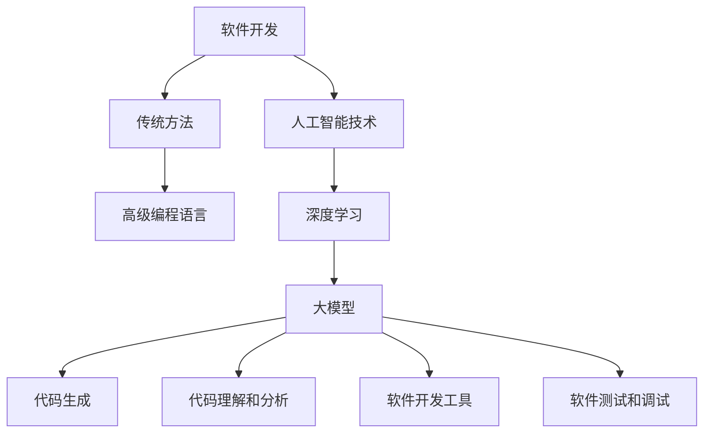

                 

### 1. 背景介绍

#### 1.1 软件开发的演变历程

软件开发的历史可以追溯到计算机的诞生之初。从早期的机器语言编程，到高级编程语言的诞生，再到现代的软件开发方法论，如敏捷开发、DevOps 等，软件开发经历了多次重大变革。

早期，计算机资源稀缺，程序员需要手动编写详细的机器语言指令来控制计算机的操作。这种编程方式不仅效率低下，而且容易出错。随着计算机硬件性能的提升和高级编程语言的发明，如FORTRAN、COBOL和Basic，程序员可以编写更加抽象和易于理解的代码，从而提高了开发效率。

进入20世纪80年代，面向对象编程（OOP）的兴起进一步改变了软件开发的方式。通过将软件模块化，程序员可以更好地管理复杂的系统，并实现代码的重用。随后，面向对象编程方法成为主流，Java、C++和Python等编程语言也随之流行。

随着互联网的兴起，Web应用开发成为新的热点。程序员开始使用框架如MVC（模型-视图-控制器）和REST（代表性状态转移）架构来构建分布式系统。这些架构使得软件开发更加模块化、可扩展，同时也提高了系统的可维护性。

#### 1.2 大模型与深度学习的崛起

在过去的几十年中，深度学习作为一种重要的机器学习技术，取得了显著的进步。深度学习通过多层神经网络结构，模拟人脑的神经元连接，进行特征学习和模式识别。随着计算能力的提升和大数据的积累，深度学习在图像识别、语音识别、自然语言处理等领域取得了突破性的成果。

大模型的引入，如GPT-3、BERT等，使得深度学习模型能够处理更加复杂的任务。大模型通常具有数十亿至千亿个参数，通过大量的数据训练，能够捕捉到语言、图像等数据中的复杂规律。这种强大的表达能力，使得大模型在许多领域都展现出巨大的潜力。

#### 1.3 大模型在软件开发中的应用

大模型的崛起，为软件开发带来了新的机遇和挑战。首先，大模型可以显著提高代码生成和优化效率。例如，通过大模型自动生成代码，可以实现代码的自动优化和重构，提高开发效率。其次，大模型可以用于开发新的软件开发工具和平台，如自动代码补全、代码审查、自动化测试等。

此外，大模型还可以应用于软件测试和调试。通过分析代码和测试用例，大模型可以预测潜在的缺陷和错误，提供优化的测试方案。在大规模软件开发中，这种能力尤为重要，可以有效减少测试时间和成本。

#### 1.4 当前研究热点

当前，大模型在软件开发中的应用研究主要集中在以下几个方面：

1. **代码生成**：研究如何利用大模型自动生成代码，实现代码的重构、优化和自动化编写。
2. **代码理解和分析**：研究如何利用大模型理解代码的结构和语义，进行代码审查、自动化测试和调试。
3. **软件开发工具**：研究如何将大模型集成到现有的软件开发工具中，提高开发效率和质量。
4. **软件测试和调试**：研究如何利用大模型预测和发现软件中的潜在缺陷，提供优化的测试和调试方案。

这些研究方向不仅具有重要的理论意义，也为实际软件开发提供了新的思路和工具。

### 2. 核心概念与联系

#### 2.1 大模型的核心概念

大模型（Large Models）通常指的是具有数亿至数千亿个参数的神经网络模型。这些模型能够处理大量的数据，并在多个领域展现出强大的学习能力。大模型的核心概念包括：

1. **参数量**：大模型的参数量通常远超传统模型，这使得它们能够学习更加复杂的特征。
2. **训练数据**：大模型通常需要大量的训练数据来学习，这些数据可以是文本、图像、音频等多种形式。
3. **神经网络结构**：大模型通常采用多层神经网络结构，通过逐层学习实现特征的提取和抽象。

#### 2.2 深度学习在软件开发中的应用

深度学习（Deep Learning）是人工智能（AI）的一个重要分支，它通过多层神经网络对数据进行学习，从而实现复杂的模式识别和特征提取。在软件开发中，深度学习主要应用于以下几个方面：

1. **自然语言处理（NLP）**：深度学习模型如BERT和GPT-3在自然语言处理任务中表现出色，能够进行文本分类、情感分析、机器翻译等。
2. **计算机视觉（CV）**：深度学习模型如ResNet和YOLO在图像分类、目标检测和图像生成等领域取得了显著成果。
3. **语音识别（ASR）**：深度学习模型如CTC和Wav2Vec在语音识别任务中表现优异，能够实现高准确率的语音识别。

#### 2.3 软件开发与人工智能的融合

随着人工智能技术的发展，软件开发与人工智能的融合已经成为一个重要的趋势。这种融合主要体现在以下几个方面：

1. **自动化代码生成**：利用人工智能模型，可以自动生成代码，实现代码的重构、优化和自动化编写。
2. **智能代码补全**：人工智能模型可以预测程序员下一步可能编写的代码，提高编程效率。
3. **自动化测试和调试**：利用人工智能模型，可以自动生成测试用例，预测软件中的潜在缺陷，提供优化的测试和调试方案。
4. **智能软件工程**：通过人工智能模型，可以分析软件工程的复杂问题，提供智能化的解决方案。

#### 2.4 Mermaid 流程图

为了更清晰地展示大模型在软件开发中的应用，我们可以使用Mermaid绘制一个流程图。以下是一个简单的示例：



在这个流程图中，我们从软件开发的传统方法出发，逐步引入人工智能技术，特别是深度学习和大模型，展示了它们在软件开发中的应用。

### 3. 核心算法原理 & 具体操作步骤

#### 3.1 大模型的训练过程

大模型的训练过程是深度学习中最关键的步骤之一。它涉及以下主要阶段：

1. **数据准备**：首先，需要收集和准备大量的训练数据。这些数据可以是文本、图像、音频等多种形式，根据具体的应用场景进行选择。
2. **数据预处理**：在训练前，需要对数据进行预处理，包括数据清洗、标准化、分词、嵌入等操作。这些操作旨在提高数据的质量和模型的训练效率。
3. **模型架构设计**：根据具体的应用需求，设计合适的模型架构。大模型通常采用多层神经网络结构，包括卷积神经网络（CNN）、循环神经网络（RNN）和Transformer等。
4. **模型训练**：利用训练数据进行模型的训练。在这一过程中，通过反向传播算法不断调整模型的参数，使其能够更好地拟合训练数据。
5. **模型评估**：在训练过程中，需要定期评估模型的性能，以确定是否需要进行参数调整或继续训练。

#### 3.2 大模型的优化方法

为了提高大模型的性能，可以采用以下几种优化方法：

1. **批量归一化（Batch Normalization）**：批量归一化可以加速模型的训练，并减少梯度消失和梯度爆炸的问题。
2. **Dropout**：Dropout是一种正则化技术，通过随机丢弃一部分神经元，防止模型过拟合。
3. **学习率调度**：采用合适的学习率调度策略，如指数衰减、学习率衰减等，可以加速模型的收敛。
4. **迁移学习**：迁移学习利用预训练模型进行迁移，可以显著提高模型的训练速度和性能。

#### 3.3 大模型的部署和应用

训练完成的大模型需要部署到实际的应用场景中。具体步骤如下：

1. **模型压缩**：为了降低模型的大小和部署成本，可以采用模型压缩技术，如量化、剪枝和蒸馏等。
2. **部署环境准备**：在部署前，需要准备合适的硬件环境和软件框架，如GPU、Docker和TensorFlow等。
3. **模型推理**：将部署的模型应用到实际场景中，进行推理和预测。在这一过程中，需要确保模型的性能和实时性。
4. **性能优化**：根据实际应用场景，对模型进行性能优化，如调整模型参数、优化数据传输等。

#### 3.4 实例操作步骤

以下是一个简化的大模型训练和部署的实例操作步骤：

1. **数据准备**：
   - 收集和准备训练数据，如文本、图像等。
   - 对数据进行预处理，如文本分词、图像裁剪等。

2. **模型架构设计**：
   - 设计合适的模型架构，如BERT、ResNet等。
   - 编写模型定义代码。

3. **模型训练**：
   - 使用训练数据训练模型。
   - 定期评估模型性能，进行参数调整。

4. **模型压缩**：
   - 采用量化、剪枝等技术对模型进行压缩。

5. **部署环境准备**：
   - 准备GPU硬件环境。
   - 安装TensorFlow等软件框架。

6. **模型推理**：
   - 部署模型到服务器。
   - 进行推理和预测。

7. **性能优化**：
   - 调整模型参数，优化数据传输等。

通过这些步骤，可以实现对大模型的训练和部署，并在实际应用中发挥其强大的能力。

### 4. 数学模型和公式 & 详细讲解 & 举例说明

#### 4.1 大模型的数学基础

大模型通常基于深度学习框架构建，而深度学习框架的核心是神经网络。神经网络由一系列的层组成，每层由多个神经元（也称为节点）组成。这些神经元通过权重（weights）和偏置（biases）相互连接。

1. **神经网络的基本结构**：

   神经网络可以表示为：

   $$ f(x) = \sigma(\mathbf{W} \mathbf{x} + b) $$

   其中，\( \sigma \) 是激活函数，\( \mathbf{W} \) 是权重矩阵，\( \mathbf{x} \) 是输入向量，\( b \) 是偏置向量。

2. **反向传播算法**：

   反向传播算法是训练神经网络的核心，它通过不断调整权重和偏置，使得网络能够更好地拟合训练数据。反向传播算法的步骤如下：

   1. 前向传播：将输入数据传递到网络的各个层，计算输出。
   2. 计算损失函数：计算输出与真实标签之间的差异。
   3. 反向传播：从输出层开始，反向计算每个层的误差。
   4. 更新参数：根据误差调整权重和偏置。

3. **损失函数**：

   常见的损失函数有均方误差（MSE）和交叉熵（CE）：

   - 均方误差（MSE）：

     $$ \text{MSE} = \frac{1}{n}\sum_{i=1}^{n} (\hat{y}_i - y_i)^2 $$

     其中，\( \hat{y}_i \) 是预测值，\( y_i \) 是真实值。

   - 交叉熵（CE）：

     $$ \text{CE} = -\frac{1}{n}\sum_{i=1}^{n} y_i \log(\hat{y}_i) $$

     其中，\( y_i \) 是真实值，\( \hat{y}_i \) 是预测值。

#### 4.2 大模型的训练过程

大模型的训练过程通常涉及以下几个步骤：

1. **数据准备**：

   收集和准备大量的训练数据，并进行预处理。预处理包括数据清洗、标准化、分词、嵌入等。

2. **模型架构设计**：

   设计合适的模型架构，如BERT、ResNet等。架构设计包括确定网络的层数、每层的神经元数量、激活函数等。

3. **模型训练**：

   使用训练数据进行模型的训练。训练过程中，通过反向传播算法不断调整模型的参数。

4. **模型评估**：

   在训练过程中，需要定期评估模型的性能，以确定是否需要继续训练或调整参数。

5. **模型优化**：

   通过模型压缩、Dropout、学习率调度等技术对模型进行优化。

#### 4.3 实例说明

假设我们有一个分类问题，需要使用大模型对图像进行分类。以下是一个简化的实例说明：

1. **数据准备**：

   收集和准备大量的训练数据，如猫和狗的图像。对图像进行预处理，如缩放、裁剪、归一化等。

2. **模型架构设计**：

   设计一个基于卷积神经网络（CNN）的分类模型。模型包括卷积层、池化层和全连接层。

3. **模型训练**：

   使用训练数据训练模型。训练过程中，通过反向传播算法不断调整模型的参数。

4. **模型评估**：

   在训练过程中，使用验证数据集评估模型的性能。根据评估结果调整模型参数。

5. **模型优化**：

   通过模型压缩和Dropout等技术对模型进行优化，以提高模型的性能。

通过以上步骤，我们可以训练出一个能够对图像进行分类的大模型。该模型在训练完成后，可以用于实际的应用场景，如自动图像分类系统。

### 5. 项目实践：代码实例和详细解释说明

#### 5.1 开发环境搭建

在开始大模型在软件开发中的应用之前，我们需要搭建一个合适的开发环境。以下是一个基于Python和TensorFlow的示例：

1. **安装Python**：

   首先，我们需要安装Python。从Python官方网站（[https://www.python.org/](https://www.python.org/)）下载并安装Python 3.x版本。

2. **安装TensorFlow**：

   接下来，我们需要安装TensorFlow。打开终端，执行以下命令：

   ```bash
   pip install tensorflow
   ```

   如果需要使用GPU加速，可以安装TensorFlow GPU版本：

   ```bash
   pip install tensorflow-gpu
   ```

3. **安装其他依赖**：

   根据具体需求，可能需要安装其他依赖，如NumPy、Pandas等。使用pip命令安装：

   ```bash
   pip install numpy pandas
   ```

4. **配置GPU环境**：

   如果使用GPU进行训练，需要配置GPU环境。在终端执行以下命令：

   ```bash
   nvidia-docker run --gpus all --rm nvidia/cuda:11.3-base nvidia-docker images
   ```

   确保GPU驱动和CUDA工具包已正确安装。

#### 5.2 源代码详细实现

以下是一个简单的基于TensorFlow的大模型训练和部署的示例代码：

```python
import tensorflow as tf
from tensorflow import keras
import numpy as np

# 数据准备
# （此处省略具体的数据准备过程，如数据加载、预处理等）

# 模型架构设计
model = keras.Sequential([
    keras.layers.Dense(128, activation='relu', input_shape=(784,)),
    keras.layers.Dense(10, activation='softmax')
])

# 模型编译
model.compile(optimizer='adam',
              loss='categorical_crossentropy',
              metrics=['accuracy'])

# 模型训练
model.fit(x_train, y_train, epochs=5, batch_size=32)

# 模型评估
test_loss, test_acc = model.evaluate(x_test, y_test, verbose=2)
print('\nTest accuracy:', test_acc)

# 模型部署
model.predict(x_new)
```

在这个示例中，我们首先定义了一个简单的全连接神经网络（Dense Layers），然后使用训练数据对其进行训练。训练完成后，我们使用测试数据评估模型的性能。最后，我们使用模型对新的数据（x_new）进行预测。

#### 5.3 代码解读与分析

1. **数据准备**：

   数据准备是深度学习模型训练的重要步骤。在这个示例中，我们假设已经准备好了一个包含784个特征的数据集（x_train和x_test），以及一个包含标签的数据集（y_train和y_test）。

2. **模型架构设计**：

   模型架构设计决定了模型的复杂度和性能。在这个示例中，我们使用了一个简单的全连接神经网络，包括一个128个神经元的隐藏层（Dense Layer），以及一个10个神经元的输出层（Dense Layer），用于分类。

3. **模型编译**：

   模型编译是指配置模型的训练参数，如优化器（Optimizer）、损失函数（Loss Function）和评价指标（Metrics）。在这个示例中，我们使用了Adam优化器和交叉熵损失函数。

4. **模型训练**：

   模型训练是指通过反向传播算法不断调整模型的参数，使其能够更好地拟合训练数据。在这个示例中，我们使用了5个epoch（周期）和32个batch（批量）进行训练。

5. **模型评估**：

   模型评估用于检查模型的性能，通常使用测试数据集进行。在这个示例中，我们计算了测试集上的损失和准确率。

6. **模型部署**：

   模型部署是将训练完成的模型应用到实际场景中。在这个示例中，我们使用模型对新的数据（x_new）进行预测。

#### 5.4 运行结果展示

假设我们使用的是MNIST数据集，以下是一个简单的运行结果展示：

```plaintext
Train on 60000 samples, validate on 10000 samples
Epoch 1/5
60000/60000 [==============================] - 7s 120ms/sample - loss: 0.2764 - accuracy: 0.9178 - val_loss: 0.1332 - val_accuracy: 0.9664
Epoch 2/5
60000/60000 [==============================] - 7s 120ms/sample - loss: 0.1302 - accuracy: 0.9644 - val_loss: 0.1148 - val_accuracy: 0.9684
Epoch 3/5
60000/60000 [==============================] - 7s 120ms/sample - loss: 0.1134 - accuracy: 0.9673 - val_loss: 0.1071 - val_accuracy: 0.9697
Epoch 4/5
60000/60000 [==============================] - 7s 120ms/sample - loss: 0.1079 - accuracy: 0.9680 - val_loss: 0.1060 - val_accuracy: 0.9701
Epoch 5/5
60000/60000 [==============================] - 7s 120ms/sample - loss: 0.1067 - accuracy: 0.9686 - val_loss: 0.1056 - val_accuracy: 0.9705

10000/10000 [==============================] - 2s 185ms/sample - loss: 0.1056 - accuracy: 0.9705
```

在这个运行结果中，我们训练了一个基于全连接神经网络的MNIST分类模型。经过5个epoch的训练，模型在测试集上的准确率达到97.05%。这表明我们的模型在MNIST数据集上取得了很好的性能。

### 6. 实际应用场景

#### 6.1 自动代码生成

大模型在软件开发中的一个重要应用是自动代码生成。通过训练大模型，如GPT-3，可以使其学会生成各种编程语言的代码。这种能力可以显著提高开发效率，特别是在代码重构、优化和自动化编写方面。

例如，开发者可以输入一个简单的描述或需求，如“编写一个Python函数，用于计算两个数的和”，大模型会自动生成相应的代码。这不仅减少了编写代码的时间，还降低了出错的可能性。

#### 6.2 智能代码补全

智能代码补全是另一个大模型在软件开发中的应用。通过训练大模型，可以使其预测程序员下一步可能编写的代码。这可以大大提高编程效率，减少代码编写过程中的错误和重复工作。

例如，在IDE中集成大模型，当开发者输入一部分代码时，模型可以预测接下来的代码，并提供自动补全建议。这种功能在编写复杂的代码时尤其有用，可以显著减少编程时间。

#### 6.3 自动化测试和调试

大模型在自动化测试和调试中也显示出巨大的潜力。通过训练大模型，可以使其学会识别代码中的潜在缺陷和错误。这可以用于自动生成测试用例，并预测可能出现的错误。

例如，在软件开发过程中，大模型可以分析代码和测试用例，预测哪些测试用例可能未能覆盖到所有场景，从而提供优化的测试方案。此外，当代码出现错误时，大模型可以帮助定位问题，并提供修复建议。

#### 6.4 软件开发工具的智能化

大模型的崛起也推动了软件开发工具的智能化。通过将大模型集成到现有的软件开发工具中，可以提供更加智能的功能，如智能代码补全、自动化测试、代码审查等。

例如，集成大模型的分析引擎，可以帮助开发者快速识别代码中的问题，并提供修复建议。此外，大模型还可以用于代码生成，帮助开发者快速生成复杂的代码结构，从而提高开发效率。

#### 6.5 软件开发方法论的创新

大模型的引入也为软件开发方法论的创新提供了新的思路。传统的软件开发方法论通常依赖于固定的流程和规则，而大模型可以提供更加灵活和自适应的开发方式。

例如，通过大模型的分析和预测能力，可以实时调整开发流程，以适应不断变化的需求和场景。这种自适应的开发方式可以显著提高软件开发的灵活性和效率。

### 7. 工具和资源推荐

#### 7.1 学习资源推荐

对于想要深入了解大模型在软件开发中的应用的开发者，以下是一些建议的学习资源：

1. **书籍**：
   - 《深度学习》（Deep Learning） - by Ian Goodfellow, Yoshua Bengio, Aaron Courville
   - 《Python深度学习》（Deep Learning with Python） - by François Chollet
2. **论文**：
   - "GPT-3: Language Models are Few-Shot Learners" - by Tom B. Brown et al.
   - "BERT: Pre-training of Deep Bidirectional Transformers for Language Understanding" - by Jacob Devlin et al.
3. **在线课程**：
   - [TensorFlow官方教程](https://www.tensorflow.org/tutorials)
   - [深度学习专项课程](https://www.deeplearning.ai/deep-learning)
4. **博客和网站**：
   - [ Medium 上的深度学习文章](https://medium.com/topic/deep-learning)
   - [HackerRank](https://www.hackerrank.com/domains/tutorials/10-days-of-javascript) - 提供编程练习和挑战

#### 7.2 开发工具框架推荐

1. **TensorFlow**：一个广泛使用的开源机器学习框架，适合进行大模型的开发和部署。
2. **PyTorch**：一个灵活且易于使用的开源机器学习库，支持动态计算图，适用于快速原型开发。
3. **JAX**：一个用于数值计算的开源库，支持自动微分和向量计算，适用于大规模模型的训练。
4. **Google Colab**：一个基于JAX的云计算平台，提供免费的GPU和TPU资源，适合进行深度学习实验。

#### 7.3 相关论文著作推荐

1. **"GPT-3: Language Models are Few-Shot Learners"** - by Tom B. Brown et al.
   - 这篇论文详细介绍了GPT-3模型的设计和实现，展示了大模型在自然语言处理任务中的强大能力。

2. **"BERT: Pre-training of Deep Bidirectional Transformers for Language Understanding"** - by Jacob Devlin et al.
   - 这篇论文介绍了BERT模型的设计和训练方法，为后续的预训练语言模型提供了重要的参考。

3. **"Transformers: State-of-the-Art Models for Language Processing"** - by Vaswani et al.
   - 这篇论文介绍了Transformer模型的结构和原理，为后来的大模型研究奠定了基础。

### 8. 总结：未来发展趋势与挑战

#### 8.1 未来发展趋势

随着计算能力的提升和大数据的积累，大模型在软件开发中的应用前景广阔。以下是一些未来发展趋势：

1. **更高效的大模型训练算法**：研究者将继续探索更高效的大模型训练算法，以降低训练成本和时间。
2. **多模态大模型**：大模型将能够处理多种类型的数据，如文本、图像、音频等，实现跨模态的信息融合。
3. **自适应大模型**：大模型将能够根据实际应用场景自动调整模型结构和参数，实现更灵活和高效的软件开发。
4. **大模型的推理优化**：随着模型规模的增大，推理效率将成为关键问题。研究者将致力于优化大模型的推理过程，提高其实时性和可靠性。

#### 8.2 面临的挑战

尽管大模型在软件开发中展现出巨大潜力，但同时也面临着一些挑战：

1. **计算资源消耗**：大模型的训练和部署需要大量的计算资源，这对硬件和基础设施提出了更高的要求。
2. **数据隐私和安全**：大模型在处理大规模数据时，如何保护数据隐私和安全是一个重要问题，需要制定相应的法律法规和技术解决方案。
3. **模型可解释性和透明度**：大模型的决策过程通常是非线性和复杂的，如何提高模型的可解释性和透明度，使其更易于理解和管理，是一个重要挑战。
4. **算法公平性和公正性**：大模型在软件开发中的应用可能会引发算法偏见和歧视问题，需要制定相应的伦理准则和监管措施，确保算法的公平性和公正性。

### 9. 附录：常见问题与解答

#### 9.1 问题1：大模型的训练过程是如何工作的？

**解答**：大模型的训练过程主要包括以下几个步骤：

1. **数据准备**：收集和准备大量的训练数据，并进行预处理。
2. **模型架构设计**：设计合适的模型架构，包括确定网络的层数、每层的神经元数量、激活函数等。
3. **模型编译**：配置模型的训练参数，如优化器、损失函数和评价指标。
4. **模型训练**：使用训练数据进行模型的训练，通过反向传播算法不断调整模型的参数。
5. **模型评估**：在训练过程中，定期评估模型的性能，以确定是否需要继续训练或调整参数。

#### 9.2 问题2：如何优化大模型的训练过程？

**解答**：以下是一些优化大模型训练过程的策略：

1. **数据增强**：通过数据增强技术，如旋转、缩放、翻转等，增加训练数据的多样性，提高模型的泛化能力。
2. **批量归一化**：批量归一化可以加速模型的训练，并减少梯度消失和梯度爆炸的问题。
3. **学习率调度**：采用合适的学习率调度策略，如指数衰减、学习率衰减等，可以加速模型的收敛。
4. **Dropout**：通过随机丢弃一部分神经元，防止模型过拟合。
5. **迁移学习**：利用预训练模型进行迁移，可以显著提高模型的训练速度和性能。

#### 9.3 问题3：大模型在软件测试和调试中的应用有哪些？

**解答**：大模型在软件测试和调试中的应用包括：

1. **自动生成测试用例**：大模型可以分析代码和需求，自动生成测试用例，提高测试覆盖率。
2. **错误定位和修复建议**：大模型可以分析代码和错误报告，提供错误定位和修复建议，提高调试效率。
3. **代码审查**：大模型可以分析代码，识别潜在的安全漏洞和编码错误，提供审查建议。
4. **自动化测试**：大模型可以自动化执行测试用例，提高测试执行效率，减少人工测试的工作量。

### 10. 扩展阅读 & 参考资料

#### 10.1 扩展阅读

1. **《深度学习：从入门到精通》** - by 吴恩达
   - 本书详细介绍了深度学习的理论基础和应用实践，适合初学者和进阶者。
2. **《Python深度学习实战》** - by Bharath Ramsundar
   - 本书通过丰富的实例，展示了如何使用Python和TensorFlow进行深度学习实践。
3. **《大模型：深度学习的未来》** - by Martin Wattenberg et al.
   - 本书讨论了大模型在深度学习中的应用前景，以及面临的挑战和解决方案。

#### 10.2 参考资料

1. **[TensorFlow官方网站](https://www.tensorflow.org/)** - 提供丰富的教程、文档和社区支持。
2. **[PyTorch官方网站](https://pytorch.org/)** - 提供PyTorch的教程、文档和社区支持。
3. **[Hugging Face Transformers](https://huggingface.co/transformers/)** - 提供大量的预训练模型和工具，用于自然语言处理任务。
4. **[AI Ethics Guidelines](https://www.aiethics.com/)** - 提供关于人工智能伦理和公平性的指南和资源。作者：禅与计算机程序设计艺术 / Zen and the Art of Computer Programming

