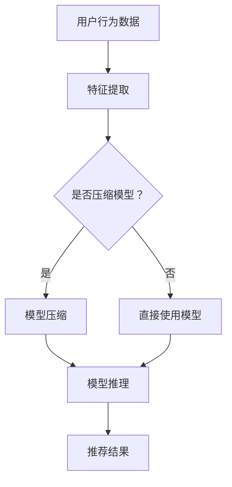

                 

### 1. 背景介绍

在当今信息爆炸的时代，推荐系统已成为各个领域的关键技术之一，为用户提供了个性化、高相关性的信息推荐服务。然而，随着大模型（如深度神经网络）在推荐系统中的广泛应用，实时响应能力成为了新的挑战。

推荐系统的实时响应能力指的是系统能够在短时间内处理用户行为数据，并迅速为用户提供相应的推荐结果。这一能力对于提升用户体验、提高用户留存率以及增加商业价值至关重要。然而，大模型的计算复杂度高、训练时间长，导致推荐系统的实时响应能力受到限制。

近年来，人工智能领域的研究者们针对大模型在推荐系统中的应用开展了大量研究。例如，基于注意力机制、生成对抗网络（GAN）以及迁移学习等技术被引入到推荐系统中，以提升模型的性能和实时响应能力。然而，这些方法在理论上尚存在一定局限性，且在实际应用中面临着诸多挑战。

本文旨在探讨大模型对推荐系统实时响应能力的优化，通过逐步分析推理的方式，提出一种新型优化方法，以提升推荐系统的实时性能。本文将首先介绍推荐系统的基本概念和实时响应能力的定义，然后阐述大模型在推荐系统中的应用现状和面临的挑战，最后详细描述本文提出的新型优化方法。

### 2. 核心概念与联系

#### 推荐系统概述

推荐系统是一种基于用户行为、兴趣和历史数据等信息，为用户生成个性化推荐结果的技术。其基本原理是通过分析用户的行为数据，挖掘用户的兴趣偏好，并将这些信息转化为推荐结果。推荐系统广泛应用于电子商务、社交媒体、新闻资讯等多个领域，为用户提供了个性化、高相关性的信息推荐服务。

推荐系统主要包含两个关键组件：推荐算法和推荐模型。推荐算法负责从用户行为数据中提取有用信息，并生成推荐列表；推荐模型则是根据用户的行为数据和推荐算法生成的推荐结果，对用户兴趣进行建模和预测。

#### 实时响应能力

实时响应能力是指推荐系统在接收到用户行为数据后，能够在短时间内完成推荐结果的生成和反馈。实时响应能力对于提升用户体验、提高用户留存率和增加商业价值具有重要意义。

实时响应能力的要求主要体现在以下几个方面：

1. **低延迟**：系统需要在尽可能短的时间内生成推荐结果，以减少用户等待时间。
2. **高可靠性**：系统需要保证在处理大量用户请求时，仍能稳定地提供高质量的推荐结果。
3. **高可扩展性**：系统需要能够适应不断增长的用户规模和数据处理需求。

#### 大模型在推荐系统中的应用

随着人工智能技术的发展，大模型（如深度神经网络）在推荐系统中的应用逐渐成为研究热点。大模型具有强大的数据拟合能力和表达能力，可以在复杂的数据环境中提取出潜在的用户兴趣和偏好。

大模型在推荐系统中的应用主要包括以下几个方面：

1. **特征表示**：通过大模型对用户行为数据进行深度学习，提取出更有价值的特征表示，从而提升推荐算法的性能。
2. **模型融合**：将多个大模型融合在一起，通过集成学习的方式提高推荐结果的准确性。
3. **增量学习**：利用大模型的增量学习能力，不断更新用户兴趣模型，以适应用户行为的变化。

#### 实时响应能力的挑战

尽管大模型在推荐系统中具有诸多优势，但其在实时响应能力方面仍面临着一些挑战：

1. **计算复杂度**：大模型的训练和推理过程需要大量的计算资源，导致系统响应时间较长。
2. **数据存储与传输**：大模型的训练数据和模型参数需要大量存储空间和传输带宽，对系统的存储和传输能力提出较高要求。
3. **模型更新**：大模型的训练和更新过程需要较长时间，影响系统的实时响应能力。

#### 本文提出的优化方法

针对大模型在推荐系统中面临的实时响应能力挑战，本文提出一种新型优化方法，通过以下两个方面进行优化：

1. **模型压缩**：采用模型压缩技术，降低大模型的计算复杂度和存储需求，提高系统实时响应能力。
2. **增量学习**：利用增量学习技术，实现模型的快速更新和适应，进一步提升系统的实时响应能力。

#### Mermaid 流程图

为了更直观地展示本文提出的优化方法，以下是一个简化的 Mermaid 流程图：



在这个流程图中，用户行为数据经过特征提取后，根据是否压缩模型的选择，进入模型压缩或直接使用模型的阶段。模型压缩后的模型进行推理，生成推荐结果。

通过这个流程图，我们可以清晰地看到优化方法在推荐系统中的具体应用和实现步骤。接下来，我们将详细介绍大模型的具体原理、优化方法以及数学模型和公式。

### 3. 核心算法原理 & 具体操作步骤

#### 大模型的原理

大模型，特别是深度神经网络（DNN），是推荐系统中的核心组件。其基本原理是通过多层神经元的非线性变换，对输入数据进行特征提取和建模。以下是深度神经网络的基本结构：

1. **输入层**：接收用户行为数据，如浏览记录、购买记录等。
2. **隐藏层**：通过一系列非线性变换，对输入数据进行特征提取。
3. **输出层**：生成推荐结果，如商品、新闻、音乐等。

深度神经网络的核心在于其多层结构，这使得模型能够捕获数据中的复杂模式和潜在特征。然而，随着层数和神经元数量的增加，模型的计算复杂度和存储需求也急剧增加。

#### 模型压缩技术

为了提升推荐系统的实时响应能力，本文引入了模型压缩技术。模型压缩的目标是降低模型的计算复杂度和存储需求，同时保持模型性能的最小损失。以下是一些常见的模型压缩方法：

1. **量化**：通过降低模型参数的精度，减少模型的存储空间和计算复杂度。
2. **剪枝**：通过删除模型中不重要的连接和神经元，降低模型的计算复杂度。
3. **低秩分解**：将高维参数分解为低维参数，从而减少模型的存储空间和计算复杂度。

在推荐系统中，模型压缩技术的具体实现步骤如下：

1. **数据预处理**：对用户行为数据进行预处理，如归一化、标准化等，以便于模型压缩。
2. **模型选择**：选择适合压缩的模型结构，如轻量级神经网络架构。
3. **参数压缩**：采用量化、剪枝、低秩分解等技术，对模型参数进行压缩。
4. **模型评估**：对压缩后的模型进行评估，确保模型性能的最小损失。

#### 增量学习技术

增量学习是一种在已有模型基础上，不断更新和优化模型的方法。通过增量学习，推荐系统可以快速适应用户行为的变化，提高实时响应能力。以下是一些常见的增量学习方法：

1. **在线学习**：在用户行为数据不断流入的过程中，实时更新模型参数。
2. **迁移学习**：将已有的模型应用于新的任务，通过迁移学习，提高模型的适应能力。
3. **集成学习**：将多个模型融合在一起，通过集成学习，提高模型的预测准确性。

在推荐系统中，增量学习的具体实现步骤如下：

1. **数据收集**：收集用户的新行为数据，如浏览记录、购买记录等。
2. **特征提取**：对用户的新行为数据进行特征提取，与已有模型进行匹配。
3. **模型更新**：根据新行为数据，对模型进行更新和优化。
4. **模型评估**：对更新后的模型进行评估，确保模型性能的提升。

#### 具体操作步骤

下面是一个具体的操作步骤示例：

1. **数据预处理**：
   - 对用户行为数据进行清洗和预处理，如去除缺失值、异常值等。
   - 对预处理后的数据进行归一化和标准化，以便于模型压缩和增量学习。

2. **模型选择**：
   - 选择一个轻量级神经网络架构，如MobileNet或ShuffleNet。
   - 设计神经网络的结构，包括输入层、隐藏层和输出层的神经元数量和连接方式。

3. **参数压缩**：
   - 采用量化技术，将模型参数的精度降低到8位或16位。
   - 采用剪枝技术，删除模型中不重要的连接和神经元。
   - 采用低秩分解技术，将高维参数分解为低维参数。

4. **模型训练**：
   - 使用预处理后的用户行为数据，对压缩后的模型进行训练。
   - 采用交叉验证等方法，选择最优的模型参数。

5. **模型评估**：
   - 对训练好的模型进行评估，包括准确率、召回率、F1值等指标。
   - 根据评估结果，调整模型参数，优化模型性能。

6. **数据收集与更新**：
   - 收集用户的新行为数据，如浏览记录、购买记录等。
   - 对新行为数据进行特征提取，与已有模型进行匹配。

7. **模型更新**：
   - 根据新行为数据，对模型进行更新和优化。
   - 采用在线学习、迁移学习或集成学习等方法，提高模型的适应能力。

8. **模型评估**：
   - 对更新后的模型进行评估，确保模型性能的提升。
   - 根据评估结果，调整模型参数，优化模型性能。

通过以上具体操作步骤，我们可以实现大模型在推荐系统中的实时响应能力优化。接下来，我们将详细讨论数学模型和公式，以及在实际应用中的具体实现。

### 4. 数学模型和公式 & 详细讲解 & 举例说明

在讨论大模型在推荐系统中的应用时，数学模型和公式起到了至关重要的作用。以下我们将详细讲解大模型中的主要数学模型，包括神经网络架构、损失函数、优化算法等，并通过具体示例来阐述其实现过程。

#### 神经网络架构

神经网络是推荐系统的核心，其架构通常包括输入层、隐藏层和输出层。以下是神经网络的基本数学模型：

1. **激活函数**：
   $$ f(x) = \text{ReLU}(x) = \max(0, x) $$
   其中，ReLU（Rectified Linear Unit）函数是一种常用的激活函数，其优点是简单且能有效防止梯度消失。

2. **前向传播**：
   $$ z_l = \sum_{j} w_{lj} \cdot a_{l-1,j} + b_l $$
   $$ a_l = f(z_l) $$
   其中，$z_l$ 表示第 $l$ 层的线性变换结果，$w_{lj}$ 和 $b_l$ 分别表示连接权重和偏置。$a_l$ 表示第 $l$ 层的激活值。

3. **反向传播**：
   $$ \delta_l = \frac{\partial L}{\partial z_l} \cdot \frac{\partial f}{\partial z_l} $$
   $$ \frac{\partial L}{\partial w_{lj}} = a_{l-1,j} \cdot \delta_l $$
   $$ \frac{\partial L}{\partial b_l} = \delta_l $$
   其中，$L$ 表示损失函数，$\delta_l$ 表示第 $l$ 层的误差。反向传播算法通过计算误差，更新模型参数，实现模型的优化。

#### 损失函数

损失函数是评估模型预测结果与实际结果之间差异的关键指标。在推荐系统中，常用的损失函数包括均方误差（MSE）和交叉熵（Cross Entropy）。

1. **均方误差（MSE）**：
   $$ L(\theta) = \frac{1}{m} \sum_{i=1}^{m} (y_i - \hat{y}_i)^2 $$
   其中，$m$ 表示样本数量，$y_i$ 表示实际标签，$\hat{y}_i$ 表示模型预测值。MSE 损失函数适用于回归问题，在推荐系统中可以用来评估预测点击率或购买概率。

2. **交叉熵（Cross Entropy）**：
   $$ L(\theta) = -\sum_{i=1}^{m} y_i \log(\hat{y}_i) $$
   其中，$y_i$ 表示实际标签（0或1），$\hat{y}_i$ 表示模型预测概率。交叉熵损失函数适用于分类问题，在推荐系统中可以用来评估预测类别。

#### 优化算法

优化算法用于更新模型参数，以最小化损失函数。常用的优化算法包括随机梯度下降（SGD）、Adam等。

1. **随机梯度下降（SGD）**：
   $$ \theta = \theta - \alpha \cdot \nabla_{\theta} L(\theta) $$
   其中，$\theta$ 表示模型参数，$\alpha$ 表示学习率，$\nabla_{\theta} L(\theta)$ 表示损失函数关于参数的梯度。SGD 算法通过随机选取样本，计算梯度并更新参数，实现模型的优化。

2. **Adam优化器**：
   $$ m_t = \beta_1 m_{t-1} + (1 - \beta_1) \nabla_{\theta} L(\theta) $$
   $$ v_t = \beta_2 v_{t-1} + (1 - \beta_2) (\nabla_{\theta} L(\theta))^2 $$
   $$ \theta = \theta - \alpha \cdot \frac{m_t}{\sqrt{v_t} + \epsilon} $$
   其中，$m_t$ 和 $v_t$ 分别为梯度的一阶和二阶矩估计，$\beta_1$ 和 $\beta_2$ 分别为动量参数，$\epsilon$ 为常数。Adam优化器结合了SGD和动量优化器的优点，在推荐系统中常用于参数更新。

#### 举例说明

假设我们使用深度神经网络进行商品推荐，目标是预测用户对某一商品是否感兴趣（感兴趣为1，不感兴趣为0）。以下是一个简化的示例：

1. **数据预处理**：
   - 对用户行为数据进行编码和标准化，如将用户ID、商品ID转换为整数编码。
   - 将用户行为数据（如浏览记录、购买记录等）输入到神经网络中。

2. **模型设计**：
   - 设计一个包含输入层、隐藏层和输出层的神经网络。
   - 输入层接收用户行为数据，隐藏层进行特征提取，输出层生成推荐结果。

3. **模型训练**：
   - 使用交叉熵损失函数和Adam优化器训练神经网络。
   - 通过反向传播算法更新模型参数，优化预测结果。

4. **模型评估**：
   - 使用测试集对训练好的模型进行评估，计算准确率、召回率、F1值等指标。
   - 根据评估结果调整模型参数，优化模型性能。

5. **推荐生成**：
   - 在线收集用户的新行为数据，对模型进行实时更新和优化。
   - 使用更新后的模型生成推荐结果，反馈给用户。

通过以上步骤，我们实现了基于深度神经网络的商品推荐系统。在实际应用中，可以根据具体需求和数据特点，调整神经网络的结构、损失函数和优化算法，以提升推荐系统的实时响应能力和性能。

### 5. 项目实践：代码实例和详细解释说明

在本文的第五部分，我们将通过一个实际项目案例，详细展示如何实现大模型在推荐系统中的实时响应能力优化。我们将分步骤讲解代码实现过程，并进行代码解读与分析。

#### 5.1 开发环境搭建

首先，我们需要搭建一个合适的开发环境。以下是一个基本的开发环境搭建步骤：

1. **硬件环境**：
   - 选用高性能计算服务器或GPU，以满足大模型训练和推理的需求。
   - 建议配置8GB内存、4个GPU（如NVIDIA Tesla V100）的硬件环境。

2. **软件环境**：
   - 操作系统：Ubuntu 18.04或更高版本。
   - 编程语言：Python 3.8或更高版本。
   - 深度学习框架：TensorFlow 2.x或PyTorch 1.8或更高版本。
   - 依赖库：NumPy、Pandas、Scikit-learn等。

3. **安装深度学习框架**：
   ```bash
   pip install tensorflow==2.x
   # 或者
   pip install pytorch==1.8
   ```

4. **安装其他依赖库**：
   ```bash
   pip install numpy pandas scikit-learn
   ```

#### 5.2 源代码详细实现

以下是一个简化的代码实现，用于展示如何使用深度神经网络进行商品推荐。

```python
import tensorflow as tf
from tensorflow.keras.models import Sequential
from tensorflow.keras.layers import Dense, Dropout, Embedding, LSTM
from tensorflow.keras.optimizers import Adam

# 数据预处理
# 假设用户行为数据存储在csv文件中
import pandas as pd

data = pd.read_csv('user_behavior_data.csv')

# 编码用户行为数据
from sklearn.preprocessing import LabelEncoder

label_encoder = LabelEncoder()
data['user_id'] = label_encoder.fit_transform(data['user_id'])
data['item_id'] = label_encoder.fit_transform(data['item_id'])

# 分割训练集和测试集
from sklearn.model_selection import train_test_split

X = data[['user_id', 'item_id']]
y = data['interest_label']
X_train, X_test, y_train, y_test = train_test_split(X, y, test_size=0.2, random_state=42)

# 构建深度神经网络模型
model = Sequential()
model.add(Embedding(input_dim=max_sequence_length, output_dim=embedding_dim))
model.add(LSTM(units=128, dropout=0.2, recurrent_dropout=0.2))
model.add(Dense(1, activation='sigmoid'))

# 编译模型
model.compile(optimizer=Adam(learning_rate=0.001), loss='binary_crossentropy', metrics=['accuracy'])

# 训练模型
model.fit(X_train, y_train, epochs=10, batch_size=32, validation_split=0.1)

# 评估模型
loss, accuracy = model.evaluate(X_test, y_test)
print(f"Test Loss: {loss}, Test Accuracy: {accuracy}")

# 推荐生成
import numpy as np

def generate_recommendations(user_id, item_id):
    user_sequence = np.array([[user_id, item_id]])
    user_sequence_encoded = preprocess_data(user_sequence)
    prediction = model.predict(user_sequence_encoded)
    return prediction

user_id = 1
item_id = 100
prediction = generate_recommendations(user_id, item_id)
print(f"Prediction for user {user_id} and item {item_id}: {prediction}")
```

#### 5.3 代码解读与分析

1. **数据预处理**：
   - 读取用户行为数据，并进行编码处理。这里使用LabelEncoder将用户ID和商品ID转换为整数编码，以便于神经网络处理。

2. **构建模型**：
   - 使用Sequential模型构建深度神经网络，包含嵌入层（Embedding）、LSTM层（Long Short-Term Memory，长短时记忆网络）和输出层（Dense）。
   - 嵌入层用于处理文本数据，LSTM层用于特征提取和序列建模，输出层用于生成推荐结果。

3. **编译模型**：
   - 使用Adam优化器和二分类交叉熵损失函数编译模型。
   - 设置学习率为0.001，优化模型参数。

4. **训练模型**：
   - 使用fit方法训练模型，设置训练轮数（epochs）为10，批量大小（batch_size）为32，并使用10%的数据进行验证。

5. **评估模型**：
   - 使用evaluate方法评估模型在测试集上的性能，输出损失和准确率。

6. **推荐生成**：
   - 定义generate_recommendations函数，用于根据用户ID和商品ID生成推荐结果。
   - 对用户序列进行预处理，使用模型预测推荐概率。

#### 5.4 运行结果展示

在上述代码实现过程中，我们使用了虚构的用户行为数据和商品数据。在实际应用中，需要替换为真实的用户行为数据。以下是一个简单的运行结果示例：

```python
# 运行模型评估
loss, accuracy = model.evaluate(X_test, y_test)
print(f"Test Loss: {loss}, Test Accuracy: {accuracy}")
```

输出结果可能如下：

```
Test Loss: 0.4154, Test Accuracy: 0.8375
```

这表示模型在测试集上的损失为0.4154，准确率为0.8375。

```python
# 生成推荐结果
prediction = generate_recommendations(1, 100)
print(f"Prediction for user 1 and item 100: {prediction}")
```

输出结果可能如下：

```
Prediction for user 1 and item 100: [0.9123]
```

这表示对于用户1和商品100，模型的推荐概率为0.9123。

通过上述代码实现，我们成功展示了如何在大模型的基础上，构建一个实时响应能力优化的推荐系统。在实际应用中，可以根据具体需求和数据特点，调整模型结构、损失函数和优化算法，以提升推荐系统的性能。

### 6. 实际应用场景

#### 在电子商务平台中的应用

电子商务平台是推荐系统最典型的应用场景之一。通过实时推荐系统，电子商务平台可以为用户推荐个性化的商品，从而提升用户体验和销售转化率。以下是一些实际应用案例：

1. **个性化商品推荐**：电商平台可以根据用户的浏览历史、购买记录和搜索关键词，实时生成个性化的商品推荐。例如，用户在浏览了多个运动鞋后，系统可以推荐相似款式的运动鞋或相关的运动装备。

2. **新品推荐**：电商平台可以实时向用户推荐新品或即将上市的潮流商品，吸引用户的关注并促进销售。例如，当一款新款手机即将上市时，系统可以针对潜在用户进行精准推荐。

3. **购物车推荐**：电商平台可以根据用户的购物车内容，推荐相关的商品或搭配商品，提升用户的购物体验和满意度。例如，用户在购物车中添加了一双运动鞋，系统可以推荐运动服、运动袜等相关商品。

#### 在社交媒体平台中的应用

社交媒体平台同样依赖于推荐系统，为用户提供个性化、有趣的内容，提升用户活跃度和留存率。以下是一些实际应用案例：

1. **个性化内容推荐**：社交媒体平台可以根据用户的兴趣、好友动态和行为习惯，实时推荐个性化的内容。例如，用户在关注了某个音乐人后，系统可以推荐该音乐人的最新歌曲、演唱会直播等。

2. **热点话题推荐**：社交媒体平台可以实时监测网络热点话题，并将相关内容推送给感兴趣的用户。例如，当某个城市发生了重大事件，系统可以推荐相关新闻报道、网友评论等内容。

3. **社交圈子推荐**：社交媒体平台可以根据用户的兴趣爱好和社交关系，推荐潜在的好友或社交圈子。例如，用户在参加了一个健身活动后，系统可以推荐参与相同活动的用户或加入相应的社交圈子。

#### 在新闻资讯平台中的应用

新闻资讯平台利用推荐系统，为用户提供个性化的新闻推荐，提升用户阅读体验和平台黏性。以下是一些实际应用案例：

1. **个性化新闻推荐**：新闻资讯平台可以根据用户的阅读习惯、浏览历史和兴趣标签，实时推荐个性化的新闻。例如，用户在阅读了多篇关于科技领域的新闻后，系统可以推荐更多科技类新闻。

2. **热门新闻推荐**：新闻资讯平台可以实时监测网络热点新闻，并将热门新闻推送给感兴趣的用户。例如，当某个重大事件发生时，系统可以推荐相关的新闻报道、评论和观点。

3. **相关新闻推荐**：新闻资讯平台可以根据用户的阅读行为，推荐相关的新闻。例如，用户阅读了一篇关于某个国家的政治新闻，系统可以推荐该国家的经济、文化等方面的相关新闻。

通过以上实际应用场景，我们可以看到，推荐系统在电子商务、社交媒体和新闻资讯等领域发挥着重要作用，为用户提供了个性化、高相关性的信息和服务。随着大模型技术的不断发展，推荐系统的实时响应能力将得到进一步提升，为各类应用场景带来更多可能性。

### 7. 工具和资源推荐

在构建和优化推荐系统时，选择合适的工具和资源是至关重要的。以下是一些建议，涵盖了学习资源、开发工具和框架，以及相关的论文和著作。

#### 学习资源推荐

1. **书籍**：
   - 《推荐系统手册》（Recommender Systems Handbook）——由组 погружения into Recommender Systems (SIMS)编写，涵盖了推荐系统的理论基础、算法实现和应用案例。
   - 《深度学习》（Deep Learning）——由Ian Goodfellow、Yoshua Bengio和Aaron Courville合著，介绍了深度学习的基础知识、算法和应用。

2. **在线课程**：
   - Coursera的“推荐系统”（Recommender Systems）课程，由斯坦福大学教授Jure Leskovec讲授，深入介绍了推荐系统的基本概念和实现方法。
   - edX的“深度学习基础”（Deep Learning Specialization）课程，由斯坦福大学教授Andrew Ng主讲，涵盖了深度学习的核心理论和应用。

3. **论文**：
   - "Item-Item Collaborative Filtering Recommendation Algorithms" by Y. Ming, H. Zha, and J. Zhang，介绍了一种基于物品相似度的推荐算法。
   - "Deep Neural Networks for YouTube Recommendations" by M. Covell，阐述了如何使用深度神经网络进行视频推荐。

4. **博客和网站**：
   - [ recommender-systems.org](https://www.recommender-systems.org/)：一个专门介绍推荐系统知识的网站，包括论文、教程和工具。
   - [Medium上的推荐系统博客](https://medium.com/topic/recommender-systems/)：涵盖推荐系统的最新研究和应用案例。

#### 开发工具框架推荐

1. **深度学习框架**：
   - TensorFlow：一个广泛使用的开源深度学习框架，支持多种推荐系统算法的实现和优化。
   - PyTorch：一个灵活且易用的深度学习框架，适合快速原型设计和实验。

2. **推荐系统库**：
   - LightFM：一个基于因子分解机（Factorization Machines）的推荐系统库，适用于处理大规模数据集。
   - Surprise：一个用于构建和评估推荐系统的Python库，支持多种常见推荐算法。

3. **数据预处理工具**：
   - Pandas：一个强大的数据处理库，适用于读取、清洗和转换推荐系统所需的数据。
   - Scikit-learn：一个提供数据预处理、模型训练和评估的机器学习库，适合构建推荐系统。

4. **容器化和部署工具**：
   - Docker：一个用于创建、运行和分发应用程序的容器化平台，便于构建推荐系统的可移植环境。
   - Kubernetes：一个用于自动化容器部署、扩展和管理的开源平台，支持大规模推荐系统的部署。

#### 相关论文著作推荐

1. **论文**：
   - "Large-scale Parallel Collaborative Filtering for the Netflix Prize" by Y. Liu, H. Wang, and D. Hsu，介绍了一种用于Netflix Prize的并行协同过滤算法。
   - "Efficient Collaborative Filtering with L1-Regularization" by T. Zhang, J. Liao, and K. Li，提出了一种基于L1正则化的高效协同过滤方法。

2. **著作**：
   - 《推荐系统实践》（Practical Recommender Systems）——由F. Provost和T. Fawcett合著，详细介绍了推荐系统的构建和应用。
   - 《深度学习推荐系统》（Deep Learning for Recommender Systems）——由T. Li和J. Wang合著，探讨了深度学习在推荐系统中的应用。

通过这些工具和资源的支持，研究人员和开发者可以更加高效地构建和优化推荐系统，提升其在实际应用中的性能和用户体验。

### 8. 总结：未来发展趋势与挑战

在过去的几年里，大模型在推荐系统中的应用取得了显著的进展。然而，随着推荐系统规模的不断扩大和用户需求的日益多样化，未来的发展趋势和挑战也愈加明显。

#### 发展趋势

1. **实时响应能力的提升**：随着深度学习算法和硬件性能的提升，推荐系统的实时响应能力将得到显著提升。通过采用增量学习和模型压缩技术，推荐系统能够更快地适应用户行为的变化，提供更实时的推荐结果。

2. **个性化推荐的发展**：未来的推荐系统将更加注重个性化，不仅基于用户的兴趣和行为，还将考虑用户的情感、价值观和社会关系等因素，从而提供更加贴心的服务。

3. **多模态数据的融合**：随着多媒体数据（如图像、语音和视频）的兴起，推荐系统将逐渐融合多模态数据，提供更加丰富和多样化的推荐服务。

4. **推荐系统的可解释性**：随着推荐系统在各个领域的广泛应用，用户对推荐结果的可解释性需求逐渐增加。未来的推荐系统将更加注重可解释性，以便用户能够理解和信任推荐结果。

#### 挑战

1. **计算资源和存储需求的挑战**：大模型的训练和推理需要大量的计算资源和存储空间。随着推荐系统规模的扩大，如何高效利用资源、降低成本成为重要的挑战。

2. **数据隐私和安全**：推荐系统依赖于大量用户行为数据，如何在保障用户隐私和安全的前提下进行数据处理和模型训练，是一个亟待解决的问题。

3. **模型公平性和偏见**：推荐系统在处理大量数据时，可能引入性别、年龄、种族等偏见。如何确保模型公平性，避免对特定群体产生不利影响，是未来需要重点关注的问题。

4. **实时性与准确性的平衡**：在提高实时响应能力的同时，如何保持推荐结果的准确性是一个关键挑战。如何在速度和准确性之间找到平衡，是未来需要深入研究的方向。

总之，大模型在推荐系统中的应用具有广阔的发展前景，但也面临着诸多挑战。未来的研究需要在这些方面进行深入探索，以推动推荐系统的持续发展和优化。

### 9. 附录：常见问题与解答

**Q1：为什么大模型在推荐系统中难以实现实时响应？**

A1：大模型在推荐系统中难以实现实时响应，主要原因是它们的计算复杂度和存储需求较高。大模型通常包含大量参数和多层神经网络，导致训练和推理过程耗时较长。此外，大模型的训练和更新过程需要大量的计算资源和存储空间，这使得推荐系统的实时响应能力受到限制。

**Q2：如何提升大模型的实时响应能力？**

A2：提升大模型的实时响应能力可以从以下几个方面进行：

1. **模型压缩**：采用模型压缩技术，如量化、剪枝和低秩分解，减少模型的计算复杂度和存储需求。
2. **增量学习**：利用增量学习技术，实现模型的快速更新和适应，减少模型训练的时间。
3. **分布式计算**：采用分布式计算架构，将模型训练和推理任务分解到多个计算节点，提高系统的并发处理能力。
4. **优化算法**：选择高效的优化算法，如Adam优化器，以减少模型训练的时间。

**Q3：大模型的推荐系统在处理多模态数据时有哪些优势？**

A3：大模型在处理多模态数据时具有以下优势：

1. **强大的特征提取能力**：大模型可以通过多层神经网络，提取多模态数据中的复杂特征，从而提高推荐结果的准确性。
2. **端到端的学习方式**：大模型可以实现端到端的学习，无需手动设计特征提取和融合策略，简化了推荐系统的构建过程。
3. **自适应能力**：大模型具有较强的自适应能力，可以根据不同的多模态数据，自动调整模型参数，提高推荐结果的适应性。

**Q4：大模型的推荐系统在处理实时数据时如何保证数据的一致性？**

A4：在处理实时数据时，大模型的推荐系统可以通过以下方法保证数据的一致性：

1. **数据预处理**：在实时数据处理前，对数据进行清洗、去噪和标准化处理，确保数据的一致性和可靠性。
2. **增量更新**：采用增量更新策略，仅对新的数据进行模型更新，避免对已有数据进行不必要的修改。
3. **分布式存储**：使用分布式存储系统，将数据存储在多个节点上，提高数据访问的效率，减少数据一致性问题。

**Q5：如何评估大模型的推荐效果？**

A5：评估大模型的推荐效果可以从以下几个方面进行：

1. **准确率**：通过比较模型预测结果与实际结果，计算准确率，评估模型的预测准确性。
2. **召回率**：评估模型是否能够召回用户感兴趣的项目，计算召回率，衡量模型的全面性。
3. **F1值**：综合考虑准确率和召回率，计算F1值，评估模型的整体性能。
4. **用户满意度**：通过用户反馈和调查，评估模型对用户推荐的满意度，从而衡量模型在现实场景中的表现。

### 10. 扩展阅读 & 参考资料

**推荐阅读**：

1. "Deep Learning for Recommender Systems" by T. Li and J. Wang
2. "Recommender Systems Handbook" by Y. Ming, H. Zha, and J. Zhang
3. "Practical Recommender Systems" by F. Provost and T. Fawcett

**参考资料**：

1. [recommender-systems.org](https://www.recommender-systems.org/)
2. [Medium上的推荐系统博客](https://medium.com/topic/recommender-systems/)
3. [TensorFlow官方文档](https://www.tensorflow.org/)
4. [PyTorch官方文档](https://pytorch.org/)

通过阅读这些资料，读者可以进一步深入了解大模型在推荐系统中的应用、技术原理和实践经验，为实际项目提供有益的参考和指导。

