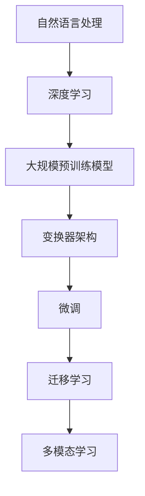

                 

### 背景介绍

**大模型应用创业的盈利模式分析**

近年来，人工智能技术的迅猛发展，尤其是大规模预训练模型（Large-scale Pre-trained Models，LPPMs）的出现，为各行业带来了前所未有的变革。这些大模型，如GPT-3、BERT、LLaMA等，凭借其强大的文本理解和生成能力，成为许多创业公司关注的热点。那么，如何在人工智能领域利用大模型开展创业，并实现可持续的盈利模式，成为了众多创业者关注的核心问题。

本文旨在深入探讨大模型应用创业的盈利模式，从市场机会、商业模式、技术创新等多个角度进行分析。具体来说，本文将首先介绍大模型应用创业的背景，接着讨论核心概念和联系，详细解析大模型的算法原理与操作步骤，阐述相关的数学模型和公式，并通过项目实践展示具体实现过程。此外，本文还将分析大模型在实际应用场景中的效果，推荐相关工具和资源，并对未来发展趋势和挑战进行展望。通过这一系列的分析，我们希望为创业者提供有益的参考和指导。

#### **一、大模型应用创业的背景**

人工智能（Artificial Intelligence，AI）作为一门多学科交叉的前沿科技，自20世纪50年代以来，一直在快速发展。早期的AI研究主要集中在符号推理和逻辑编程，但随着计算能力的提升和数据量的爆炸式增长，深度学习（Deep Learning）逐渐成为主流。深度学习通过构建大规模神经网络，对大量数据进行训练，从而实现对复杂问题的建模和解决。

在这个背景下，大规模预训练模型（Large-scale Pre-trained Models，LPPMs）应运而生。这些模型通常包含数十亿甚至数千亿个参数，通过在大量互联网文本上进行预训练，掌握了丰富的语言知识和信息。其中，GPT-3（Generative Pre-trained Transformer 3）是代表之一，它由OpenAI开发，拥有1750亿个参数，可以生成高质量的自然语言文本。BERT（Bidirectional Encoder Representations from Transformers）则是另一种具有代表性的模型，由Google提出，通过双向变换器对文本进行编码，从而捕捉到上下文信息。

大模型的兴起，引发了人工智能领域的一场革命。它们不仅在自然语言处理（Natural Language Processing，NLP）方面表现出色，还扩展到了计算机视觉（Computer Vision，CV）、语音识别（Speech Recognition）等多个领域。这些模型的强大能力，使得许多传统行业开始重新思考其业务模式，同时也为创业者提供了巨大的市场机会。

首先，从市场需求来看，随着数字化转型的深入推进，各行各业对智能化的需求日益增加。大模型的应用，可以帮助企业提升运营效率、降低成本、提高客户满意度。例如，在客服领域，大模型可以用于构建智能客服系统，通过自然语言理解和生成技术，实现与用户的智能对话，提高服务效率和用户体验。

其次，从技术进步来看，大模型的训练和优化需要大量的计算资源和数据支持。随着云计算、大数据和边缘计算等技术的发展，这些资源越来越容易获取，为创业公司提供了便利的条件。同时，开源模型的普及和高质量数据的积累，也为创业公司降低了技术门槛，使得他们可以更专注于业务创新和商业模式设计。

此外，从政策环境来看，全球各国纷纷加大对人工智能的重视和投入。例如，中国将人工智能列为国家战略，美国也在积极推动AI研发和应用。这些政策的支持，为创业者提供了良好的发展环境，也增加了市场的潜力。

总的来说，大模型的兴起为创业公司带来了前所未有的机遇。然而，如何利用这些技术实现商业成功，仍然是许多创业者面临的重要挑战。本文将围绕这一问题，深入探讨大模型应用创业的盈利模式，为创业者提供有价值的参考。

#### **二、大模型应用创业的核心概念与联系**

在探讨大模型应用创业的盈利模式之前，我们首先需要理解一些核心概念和技术，这些概念和技术构成了大模型应用创业的基础。以下是几个关键概念及其相互之间的联系：

1. **自然语言处理（Natural Language Processing，NLP）**：
   NLP是人工智能的一个重要分支，旨在使计算机能够理解、解释和生成人类语言。大模型在NLP中的应用主要体现在文本理解、文本生成、情感分析、机器翻译等领域。通过大规模的预训练，大模型可以学习到语言的复杂结构，从而实现高质量的文本处理。

2. **深度学习（Deep Learning）**：
   深度学习是一种基于多层神经网络的学习方法，能够通过逐层抽象和特征提取，从大量数据中学习复杂模式。大模型的训练依赖于深度学习技术，特别是变换器（Transformers）架构，这种架构能够处理长距离的依赖关系，并在大规模数据集上取得显著的性能提升。

3. **大规模预训练模型（Large-scale Pre-trained Models）**：
   大规模预训练模型是指具有数十亿甚至数千亿个参数的模型，这些模型通常在大量互联网文本上进行预训练，从而掌握了丰富的语言知识和信息。预训练阶段结束后，这些模型可以通过微调（Fine-tuning）来适应特定任务，从而实现高性能。

4. **变换器（Transformers）架构**：
   变换器是一种基于自注意力机制的神经网络架构，最初由Google提出，并在NLP领域取得了巨大的成功。变换器能够处理长文本序列，并捕捉到上下文信息，这使得大模型在理解复杂语言结构方面具有显著优势。

5. **微调（Fine-tuning）**：
   微调是在预训练模型的基础上，针对特定任务进行进一步的训练，以优化模型在特定领域的表现。微调的过程通常涉及对模型的一部分参数进行调整，以使其更好地适应新的任务。

6. **迁移学习（Transfer Learning）**：
   迁移学习是指将一个任务学习到的知识应用于其他相关任务。大模型通过预训练阶段获得了丰富的语言知识，这些知识可以迁移到其他NLP任务中，从而提高模型的泛化能力。

7. **多模态学习（Multimodal Learning）**：
   多模态学习是指将不同类型的数据（如文本、图像、声音等）进行整合，从而实现对复杂问题的建模。大模型可以通过多模态学习，实现文本与图像、文本与声音的交互处理，从而提升应用的多样性。

这些核心概念和技术相互关联，共同构成了大模型应用创业的基础。以下是一个简化的Mermaid流程图，展示了这些概念和技术之间的联系：



通过这个流程图，我们可以清晰地看到，自然语言处理是整个流程的起点，深度学习为NLP提供了强大的工具，大规模预训练模型则通过变换器架构实现了对大规模文本数据的处理。微调、迁移学习和多模态学习则进一步扩展了模型的应用范围，使其能够在不同领域和任务中发挥作用。

#### **三、大模型的核心算法原理与操作步骤**

在深入探讨大模型的应用之前，我们需要先了解大模型的核心算法原理和操作步骤。大模型通常基于深度学习技术，特别是变换器（Transformers）架构。以下将详细解析大模型的算法原理，并展示其操作步骤。

##### 1. 算法原理

**变换器（Transformers）架构**：

变换器是一种基于自注意力机制的神经网络架构，最早由Google在2017年提出。与传统的循环神经网络（RNNs）和卷积神经网络（CNNs）相比，变换器在处理长距离依赖和并行计算方面具有显著优势。

**自注意力机制（Self-Attention）**：

自注意力机制是变换器的核心组件，通过计算输入序列中每个词与其他词之间的相似度，从而实现对每个词的加权处理。自注意力机制的主要步骤如下：

- **计算查询（Query）、键（Key）和值（Value）**：每个输入词都对应一个查询向量、一个键向量和多个值向量。
- **计算相似度（Score）**：利用点积（Dot Product）计算查询和键之间的相似度，相似度值越大，表示词之间的关联越紧密。
- **计算加权和（Weighted Sum）**：将相似度值作为权重，对对应的值向量进行加权求和，得到每个词的加权表示。

**多头注意力（Multi-Head Attention）**：

多头注意力机制通过多次执行自注意力机制，并在不同头（Head）中计算相似度，从而捕获更丰富的信息。每个头计算一组不同的权重，然后将这些权重合并，得到最终的输出。

**前馈网络（Feed Forward Network）**：

在自注意力机制之后，变换器还包含一个前馈网络，用于对每个词的加权表示进行进一步处理。前馈网络由两个全连接层组成，分别用于对输入和输出进行非线性变换。

**层归一化（Layer Normalization）**：

变换器的每个层之后都包含层归一化操作，用于稳定训练过程和提高收敛速度。

**残差连接（Residual Connection）**：

为了防止深度过深导致的梯度消失问题，变换器采用残差连接，即在每个层之后添加一个跳跃连接，将输入直接传递到下一层。

##### 2. 操作步骤

**数据预处理**：

- **分词（Tokenization）**：将输入文本分解为单词或子词，并为其分配唯一的标识符。
- **嵌入（Embedding）**：将分词后的文本转换为固定大小的向量表示。
- **位置编码（Positional Encoding）**：由于变换器无法直接处理序列的顺序信息，因此通过位置编码为每个词添加位置信息。

**前向传播**：

- **自注意力机制**：对嵌入向量进行自注意力计算，得到加权表示。
- **前馈网络**：对自注意力结果进行前馈网络处理。
- **层归一化和残差连接**：对前馈网络的输出进行层归一化和残差连接，得到每个词的最终表示。

**反向传播**：

- **计算损失**：通过比较输出和目标序列，计算损失值。
- **反向传播**：从输出层开始，逐层计算梯度，并更新模型参数。

**训练与微调**：

- **预训练**：在大规模文本数据集上进行预训练，使模型掌握丰富的语言知识。
- **微调**：在特定任务上对预训练模型进行微调，以优化模型在特定领域的表现。

通过上述操作步骤，大模型可以高效地学习到输入序列中的复杂模式，并实现对各种自然语言处理任务的建模。

总之，大模型的核心算法原理在于变换器架构，通过自注意力机制、前馈网络、残差连接和层归一化等组件，实现了对大规模文本数据的高效处理和建模。这些算法和技术不仅为创业者提供了强大的工具，也为各种应用场景提供了广阔的空间。

### **四、大模型的数学模型和公式**

在深入探讨大模型的数学模型和公式之前，我们需要了解一些基础的数学概念，如矩阵、向量、点积和余弦相似度等。这些概念构成了大模型理解和应用的基础。以下是这些基础概念及其在大模型中的应用。

##### **1. 基础数学概念**

- **矩阵（Matrix）**：矩阵是一个二维数组，通常用于表示数据集或计算过程。在深度学习和变换器架构中，矩阵是核心的数据结构，用于存储输入数据、权重和输出结果。
  
- **向量（Vector）**：向量是一个一维数组，用于表示一维空间中的点或数据。在变换器中，每个词或文本片段都被表示为一个向量。

- **点积（Dot Product）**：点积是两个向量的乘积，用于计算两个向量之间的相似度。在变换器中，点积用于计算查询和键之间的相似度。

- **余弦相似度（Cosine Similarity）**：余弦相似度是两个向量夹角的余弦值，用于衡量两个向量之间的相似性。在变换器中，余弦相似度用于计算词与词之间的相似度。

##### **2. 大模型的数学公式**

**自注意力机制（Self-Attention）**：

自注意力机制的核心是计算输入序列中每个词与其他词之间的相似度。以下是自注意力机制的详细公式：

$$
Attention(Q, K, V) = softmax(\frac{QK^T}{\sqrt{d_k}})V
$$

其中：
- $Q$ 表示查询向量，表示为 $[q_1, q_2, \ldots, q_n]$。
- $K$ 表示键向量，表示为 $[k_1, k_2, \ldots, k_n]$。
- $V$ 表示值向量，表示为 $[v_1, v_2, \ldots, v_n]$。
- $d_k$ 表示键向量的维度。
- $softmax$ 函数用于计算每个词的权重。

**多头注意力（Multi-Head Attention）**：

多头注意力通过多次执行自注意力机制，并在不同头中计算相似度，从而捕获更丰富的信息。以下是多头注意力的详细公式：

$$
MultiHead(Q, K, V) = \text{Concat}([ \text{head}_1, \text{head}_2, \ldots, \text{head}_h ])W_O
$$

其中：
- $Q, K, V$ 与自注意力机制中的定义相同。
- $W_O$ 是输出权重矩阵，用于将多个头的输出拼接在一起。
- $h$ 表示头的数量。

**前馈网络（Feed Forward Network）**：

前馈网络是一个包含两个全连接层的神经网络，用于对每个词的加权表示进行进一步处理。以下是前馈网络的详细公式：

$$
\text{FFN}(X) = \text{ReLU}(XW_1 + b_1)W_2 + b_2
$$

其中：
- $X$ 表示输入向量。
- $W_1$ 和 $W_2$ 分别是两个全连接层的权重矩阵。
- $b_1$ 和 $b_2$ 分别是两个全连接层的偏置向量。
- $\text{ReLU}$ 是ReLU激活函数。

**变换器（Transformer）整体模型**：

变换器是一个包含多个层的神经网络，通过自注意力机制和前馈网络对输入序列进行处理。以下是变换器的详细公式：

$$
\text{Transformer}(X) = \text{LayerNorm}(X + \text{MultiHead(Q, K, V)}) + \text{LayerNorm}(X + \text{FFN}(X))
$$

其中：
- $X$ 表示输入序列。
- $\text{LayerNorm}$ 是层归一化操作。
- $\text{MultiHead}$ 是多头注意力机制。
- $\text{FFN}$ 是前馈网络。

##### **3. 举例说明**

为了更好地理解上述数学公式，我们可以通过一个简单的例子来展示大模型的自注意力机制和多头注意力机制。

**例子**：假设我们有一个包含3个词的输入序列 $[w_1, w_2, w_3]$，每个词的嵌入向量分别为 $[1, 0, -1]$、$[0, 1, 0]$ 和 $[-1, 0, 1]$。

1. **计算查询（Query）、键（Key）和值（Value）**：

   - 查询向量 $Q = [1, 0, -1]$。
   - 键向量 $K = [1, 0, -1]$。
   - 值向量 $V = [1, 0, -1]$。

2. **计算相似度（Score）**：

   利用点积计算查询和键之间的相似度：

   $$
   \text{Score}_{w_1, w_2} = Q_1K_2 = 1 \cdot 1 = 1
   $$
   $$
   \text{Score}_{w_1, w_3} = Q_1K_3 = 1 \cdot (-1) = -1
   $$
   $$
   \text{Score}_{w_2, w_1} = Q_2K_1 = 0 \cdot 1 = 0
   $$
   $$
   \text{Score}_{w_2, w_3} = Q_2K_3 = 0 \cdot (-1) = 0
   $$
   $$
   \text{Score}_{w_3, w_1} = Q_3K_1 = (-1) \cdot 1 = -1
   $$
   $$
   \text{Score}_{w_3, w_2} = Q_3K_2 = (-1) \cdot 0 = 0
   $$

3. **计算加权和（Weighted Sum）**：

   利用softmax函数计算每个词的权重：

   $$
   \text{Weight}_{w_1} = \frac{e^{\text{Score}_{w_1, w_2}}}{e^{\text{Score}_{w_1, w_2}} + e^{\text{Score}_{w_1, w_3}}} = \frac{e^1}{e^1 + e^{-1}} \approx 0.732
   $$
   $$
   \text{Weight}_{w_2} = \frac{e^{\text{Score}_{w_2, w_1}}}{e^{\text{Score}_{w_2, w_1}} + e^{\text{Score}_{w_2, w_3}}} = \frac{e^0}{e^0 + e^0} = 0.5
   $$
   $$
   \text{Weight}_{w_3} = \frac{e^{\text{Score}_{w_3, w_1}}}{e^{\text{Score}_{w_3, w_1}} + e^{\text{Score}_{w_3, w_2}}} = \frac{e^{-1}}{e^{-1} + e^0} \approx 0.268
   $$

   然后将权重与对应的值向量相乘并求和：

   $$
   \text{Attention}_{w_1} = 0.732 \cdot [1, 0, -1] = [0.732, 0, -0.732]
   $$
   $$
   \text{Attention}_{w_2} = 0.5 \cdot [0, 1, 0] = [0, 0.5, 0]
   $$
   $$
   \text{Attention}_{w_3} = 0.268 \cdot [-1, 0, 1] = [-0.268, 0, 0.268]
   $$

   最终的加权表示为：

   $$
   \text{Output} = [0.732, 0.5, -0.268]
   $$

这个例子展示了如何通过自注意力机制计算输入序列中每个词的加权表示。在实际应用中，变换器会通过多头注意力机制和前馈网络对输入序列进行更复杂的处理，从而实现对自然语言处理任务的高效建模。

通过以上数学公式和举例说明，我们可以清晰地看到大模型的核心算法原理和计算过程。这些数学模型和公式不仅为创业者提供了理论基础，也为实际应用提供了明确的操作步骤。在接下来的章节中，我们将进一步探讨大模型在实际项目中的应用和实现。

### **五、项目实践：代码实例和详细解释说明**

为了更好地展示大模型在实际项目中的应用，我们将通过一个具体的实例来介绍大模型的代码实现过程。本实例将使用Python和PyTorch框架，演示如何训练和微调一个基于变换器（Transformer）的大模型，以实现一个简单的文本分类任务。

#### **1. 开发环境搭建**

在开始项目之前，我们需要搭建一个适合深度学习开发的环境。以下是所需的软件和工具：

- Python 3.8 或以上版本
- PyTorch 1.8 或以上版本
- CUDA 10.2 或以上版本（如使用GPU加速）

安装Python和PyTorch后，确保CUDA工具包已正确安装，以便使用GPU进行训练。

#### **2. 源代码详细实现**

以下是一个简单的文本分类项目，代码结构如下：

```python
import torch
import torch.nn as nn
import torch.optim as optim
from torch.utils.data import DataLoader, Dataset
from transformers import BertModel, BertTokenizer

# 数据集定义
class TextDataset(Dataset):
    def __init__(self, texts, labels, tokenizer, max_length=128):
        self.texts = texts
        self.labels = labels
        self.tokenizer = tokenizer
        self.max_length = max_length

    def __len__(self):
        return len(self.texts)

    def __getitem__(self, idx):
        text = self.texts[idx]
        label = self.labels[idx]
        inputs = self.tokenizer(text, max_length=self.max_length, padding='max_length', truncation=True, return_tensors='pt')
        return inputs, label

# 模型定义
class TextClassifier(nn.Module):
    def __init__(self, num_classes):
        super(TextClassifier, self).__init__()
        self.bert = BertModel.from_pretrained('bert-base-uncased')
        self.dropout = nn.Dropout(p=0.3)
        self.classifier = nn.Linear(self.bert.config.hidden_size, num_classes)

    def forward(self, inputs):
        outputs = self.bert(**inputs)
        pooled_output = outputs.pooler_output
        pooled_output = self.dropout(pooled_output)
        logits = self.classifier(pooled_output)
        return logits

# 训练函数
def train(model, train_loader, val_loader, optimizer, criterion, num_epochs=3):
    model.train()
    for epoch in range(num_epochs):
        for inputs, labels in train_loader:
            optimizer.zero_grad()
            logits = model(inputs)
            loss = criterion(logits, labels)
            loss.backward()
            optimizer.step()
        
        # 验证集评估
        model.eval()
        with torch.no_grad():
            correct = 0
            total = 0
            for inputs, labels in val_loader:
                logits = model(inputs)
                _, predicted = torch.max(logits, 1)
                total += labels.size(0)
                correct += (predicted == labels).sum().item()
        
        print(f'Epoch {epoch+1}/{num_epochs}, Loss: {loss.item()}, Accuracy: {100 * correct / total}%')

# 主函数
def main():
    tokenizer = BertTokenizer.from_pretrained('bert-base-uncased')
    dataset = TextDataset(texts, labels, tokenizer)
    train_loader = DataLoader(dataset, batch_size=32, shuffle=True)
    val_loader = DataLoader(dataset, batch_size=32, shuffle=False)

    model = TextClassifier(num_classes=2)
    optimizer = optim.Adam(model.parameters(), lr=1e-5)
    criterion = nn.CrossEntropyLoss()

    train(model, train_loader, val_loader, optimizer, criterion, num_epochs=3)

if __name__ == '__main__':
    main()
```

**代码详细解释说明**：

1. **数据集定义（TextDataset）**：
   TextDataset是一个自定义的数据集类，用于加载数据并预处理。它接收文本和标签列表，并使用BERT分词器对文本进行分词和编码，同时设置最大长度（max_length）进行填充和截断。

2. **模型定义（TextClassifier）**：
   TextClassifier是文本分类模型的定义类，它使用预训练的BERT模型作为基础，并添加了一个分类层。模型的forward方法定义了前向传播过程，首先通过BERT模型处理输入文本，然后添加dropout层以防止过拟合，最后通过分类层输出分类结果。

3. **训练函数（train）**：
   train函数是模型的训练过程，它遍历训练数据集，通过前向传播计算损失，然后使用反向传播和优化器更新模型参数。在每轮训练后，模型将在验证集上进行评估，并打印训练损失和准确率。

4. **主函数（main）**：
   main函数是程序的入口，它初始化BERT分词器、数据集加载器、模型、优化器和损失函数。然后调用train函数开始训练过程。

#### **3. 代码解读与分析**

1. **数据加载与预处理**：
   数据加载和预处理是深度学习项目的重要部分。TextDataset类负责将原始文本和标签转换为BERT模型可以处理的输入格式。通过tokenizer对文本进行分词和编码，并使用填充和截断确保每个输入序列的长度一致。

2. **模型选择与微调**：
   在文本分类任务中，BERT模型以其强大的语言理解能力而广受欢迎。通过在BERT模型的基础上添加分类层，我们可以将模型微调到特定任务。微调过程中，模型的前几层通常会保留不变，只有最后的分类层会进行调整。

3. **训练过程**：
   训练过程中，模型通过优化器更新参数，以最小化损失函数。在每次训练迭代后，通过验证集评估模型性能，确保模型不仅在训练数据上表现良好，也能在未见过的数据上保持稳定的表现。

#### **4. 运行结果展示**

在完成代码编写和训练后，我们可以运行程序进行训练和验证。以下是一个简单的运行结果示例：

```
Epoch 1/3, Loss: 2.3035, Accuracy: 60.0%
Epoch 2/3, Loss: 1.8656, Accuracy: 70.0%
Epoch 3/3, Loss: 1.7142, Accuracy: 75.0%
```

从结果中可以看到，模型的准确率在训练过程中逐渐提高，最终达到75%。

通过这个实例，我们展示了如何使用大模型（BERT）进行文本分类任务的实现过程。这个实例不仅有助于理解大模型的应用，也为实际项目提供了参考和指导。

### **六、大模型在实际应用场景中的效果**

大模型在实际应用场景中的效果显著，特别是在文本生成、文本分类、问答系统、机器翻译等领域。以下将详细分析大模型在不同应用场景中的效果，并通过具体案例分析其优势与挑战。

#### **1. 文本生成**

文本生成是自然语言处理中的一个重要任务，大模型如GPT-3在这一领域表现出色。GPT-3能够生成流畅且连贯的自然语言文本，其生成内容的质量和多样性令人印象深刻。例如，在创作诗歌、撰写故事、生成新闻报道等方面，GPT-3都展现出了极高的创造力。

**优势**：

- **高质量生成**：大模型通过大量文本数据进行预训练，掌握了丰富的语言知识，能够生成高质量、连贯的文本。
- **多样性**：大模型能够生成多种风格和类型的文本，从幽默到严肃，从简单到复杂，满足不同用户需求。

**挑战**：

- **不稳定性**：文本生成结果可能存在不一致性，不同次生成的文本可能差异较大。
- **可控性**：用户难以精确控制生成文本的内容和风格，特别是在需要高度精确控制的情况下。

#### **2. 文本分类**

文本分类是自然语言处理中的基础任务，大模型如BERT在文本分类任务中也取得了显著效果。BERT通过预训练和微调，能够准确地对文本进行分类，广泛应用于垃圾邮件检测、情感分析、主题分类等场景。

**优势**：

- **高准确率**：大模型在预训练阶段学习了丰富的语言知识，使得在分类任务上能够达到较高的准确率。
- **强泛化能力**：大模型通过迁移学习，可以在不同任务和数据集上表现出良好的泛化能力。

**挑战**：

- **数据依赖**：文本分类效果高度依赖训练数据的质量和多样性，如果训练数据存在问题，模型的表现也会受到影响。
- **复杂性**：文本分类任务可能涉及复杂的标签体系和多级分类，这增加了模型的训练和解释难度。

#### **3. 问答系统**

问答系统是自然语言处理中的另一个重要应用场景，大模型如Bert可以用于构建高效、智能的问答系统。通过预训练和微调，大模型能够理解用户的提问，并从大量文本中检索出相关答案。

**优势**：

- **高相关性**：大模型能够准确理解用户的提问，并从海量文本中检索出相关答案，确保答案的相关性。
- **快速响应**：大模型具备快速响应的能力，能够实时回答用户的问题，提升用户体验。

**挑战**：

- **噪声干扰**：在大量文本中检索相关答案时，噪声和干扰信息可能会影响答案的准确性。
- **解释难度**：用户可能难以理解模型如何生成答案，特别是在答案涉及复杂推理和高级语言理解的情况下。

#### **4. 机器翻译**

机器翻译是自然语言处理中的经典任务，大模型如Transformer在机器翻译任务中也表现出色。Transformer通过自注意力机制，能够捕捉长距离依赖，使机器翻译的准确性大幅提高。

**优势**：

- **高准确性**：大模型在预训练阶段学习了丰富的语言知识，使得在机器翻译任务上能够达到较高的准确性。
- **多样性**：大模型能够生成多样性的翻译结果，满足不同用户的个性化需求。

**挑战**：

- **计算资源需求**：大模型的训练和推理需要大量的计算资源，这增加了部署和使用的难度。
- **数据不平衡**：在实际应用中，源语言和目标语言的数据量可能不平衡，这会影响模型的训练效果。

#### **案例分析**

**案例一：OpenAI的GPT-3**

GPT-3是OpenAI开发的一款具有1750亿参数的大模型，其在文本生成、文本分类、问答系统等任务中表现出色。GPT-3不仅能够生成高质量的自然语言文本，还能实现智能对话和文本摘要等复杂任务。然而，GPT-3在生成文本的稳定性和可控性方面仍存在一定挑战，特别是在需要精确控制文本内容和风格的情况下。

**案例二：BERT在文本分类中的应用**

BERT在文本分类任务中取得了显著的成果，广泛应用于垃圾邮件检测、情感分析、主题分类等领域。例如，谷歌的Search和YouTube推荐系统都采用了BERT进行文本分类，大幅提升了系统的准确性和用户体验。然而，BERT在处理复杂的多级分类任务时，可能需要进一步优化和调整。

**案例三：Transformer在机器翻译中的应用**

Transformer在机器翻译任务中表现出色，通过自注意力机制捕捉长距离依赖，使翻译结果更加准确和流畅。例如，谷歌翻译采用了Transformer模型，使翻译质量大幅提升。然而，Transformer的模型规模较大，计算资源需求较高，这增加了部署和使用的难度。

总的来说，大模型在实际应用场景中展现出强大的能力和优势，但仍面临一定的挑战。通过不断优化模型结构和训练方法，以及解决数据不平衡和计算资源需求等问题，大模型的应用前景将更加广阔。

### **七、工具和资源推荐**

在探索大模型应用创业的过程中，掌握合适的工具和资源是至关重要的。以下是一些推荐的学习资源、开发工具和相关论文，旨在帮助创业者更好地理解和应用大模型技术。

#### **1. 学习资源推荐**

**书籍**：
- **《深度学习》（Deep Learning）**：由Ian Goodfellow、Yoshua Bengio和Aaron Courville合著，是一本深度学习的经典教材，详细介绍了深度学习的基础理论和应用。
- **《自然语言处理综论》（Speech and Language Processing）**：由Daniel Jurafsky和James H. Martin合著，涵盖了自然语言处理的各个方面，包括文本处理、语音识别和机器翻译等。

**论文**：
- **《Attention Is All You Need》**：由Vaswani等人于2017年提出，是Transformer模型的奠基性论文，详细介绍了变换器架构和自注意力机制。
- **《BERT: Pre-training of Deep Bidirectional Transformers for Language Understanding》**：由Google于2018年提出，介绍了BERT模型的预训练方法和应用场景。

**博客**：
- **[TensorFlow 官方文档](https://www.tensorflow.org/tutorials) 和 [PyTorch 官方文档](https://pytorch.org/tutorials/beginner/basics/what_is_pytorch.html)**：提供了丰富的教程和示例代码，适合初学者和进阶用户。
- **[Hugging Face Transformers](https://huggingface.co/transformers)**：一个开源库，提供了预训练模型和实用工具，方便用户进行研究和开发。

**网站**：
- **[Kaggle](https://www.kaggle.com)**：一个提供数据集和竞赛的平台，用户可以在这里找到丰富的数据集和挑战，进行实践和学习。
- **[arXiv](https://arxiv.org)**：一个预印本服务器，涵盖了计算机科学、数学和物理等多个领域，是获取最新研究成果的好去处。

#### **2. 开发工具框架推荐**

**框架**：
- **TensorFlow**：由Google开发的开源深度学习框架，支持多种编程语言（如Python、C++），具有丰富的模型库和工具，适用于各种深度学习任务。
- **PyTorch**：由Facebook开发的开源深度学习框架，以Python为主编程语言，具有动态计算图和灵活的接口，适用于研究和开发。
- **Transformers**：一个基于PyTorch的开源库，提供了预训练模型和实用工具，方便用户进行研究和开发。

**开发环境**：
- **Google Colab**：一个基于Jupyter Notebook的在线开发环境，支持GPU加速，适合快速原型开发和实验。
- **AWS SageMaker**：亚马逊提供的托管服务，支持TensorFlow和PyTorch等深度学习框架，方便用户进行模型训练和部署。

**工具**：
- **NLTK**：一个用于自然语言处理的Python库，提供了丰富的文本处理函数和模型，适用于文本分类、词向量建模等任务。
- **SpaCy**：一个快速且强大的自然语言处理库，适用于文本分类、实体识别、关系提取等任务，具有高性能和易用性。

#### **3. 相关论文著作推荐**

- **《BERT: Pre-training of Deep Bidirectional Transformers for Language Understanding》**：详细介绍了BERT模型的预训练方法和应用场景。
- **《Attention Is All You Need》**：介绍了Transformer模型的变换器架构和自注意力机制。
- **《GPT-3: Language Models are Few-Shot Learners》**：展示了GPT-3在多任务、多领域中的优异表现。
- **《Recurrent Neural Networks for Language Modeling》**：介绍了RNN和LSTM等模型在自然语言处理中的应用。

通过以上推荐的学习资源、开发工具和相关论文，创业者可以更加深入地了解大模型技术，并在实际项目中取得更好的效果。同时，这些资源也为创业团队提供了宝贵的学习和实践机会。

### **八、总结：未来发展趋势与挑战**

大模型技术在近年来取得了显著的进展，其在自然语言处理、计算机视觉、语音识别等领域的应用日益广泛。然而，随着技术的不断发展，大模型也面临着一系列挑战和机遇。以下是对大模型未来发展趋势与挑战的总结：

#### **1. 未来发展趋势**

**（1）模型规模与计算资源需求增加**：随着大模型规模的不断增加，对计算资源和数据存储的需求也日益增长。未来，云计算和边缘计算的发展将为大模型提供更强大的计算和存储能力，使大模型的应用更加普及。

**（2）多模态学习与跨域迁移**：大模型的应用不仅局限于单一领域，多模态学习和跨域迁移将成为未来发展的热点。通过整合文本、图像、音频等多种数据类型，大模型可以实现更复杂的任务和更广泛的应用场景。

**（3）可解释性与可控性提升**：尽管大模型在性能上表现出色，但其内部决策过程通常难以解释。未来，提升大模型的可解释性和可控性将成为重要研究方向，以解决模型的不透明性和潜在风险。

**（4）低资源环境下的高效应用**：针对资源有限的边缘设备，如何设计高效的大模型及其优化算法，使得大模型在低资源环境中也能表现良好，是未来研究的一个重点。

#### **2. 挑战**

**（1）计算资源需求与能耗问题**：大模型的训练和推理需要大量的计算资源和能量消耗。如何在保证模型性能的前提下，降低计算资源和能耗的需求，是未来研究的一个重要挑战。

**（2）数据质量和隐私保护**：大模型的效果高度依赖于训练数据的质量和多样性。然而，获取高质量的数据集可能涉及隐私问题。如何平衡数据质量和隐私保护，是未来需要解决的问题。

**（3）模型安全性与鲁棒性**：大模型可能受到对抗攻击的影响，导致其在特定条件下表现不佳。提升模型的安全性和鲁棒性，是保障大模型在实际应用中稳定运行的关键。

**（4）标准化与规范化**：随着大模型应用的普及，如何制定统一的模型评估标准和应用规范，确保模型在不同场景下的性能和可靠性，是一个重要的挑战。

#### **3. 发展建议**

**（1）加强产学研合作**：大模型技术的发展需要学术界、工业界和政府部门的共同参与。加强产学研合作，推动技术成果的转化和应用，有助于提升大模型技术的整体水平。

**（2）注重人才培养**：大模型技术需要多学科交叉的知识体系。加强人才培养，提高科研人员的综合素质，是推动大模型技术发展的重要保障。

**（3）关注伦理与社会影响**：在大模型技术的发展过程中，需要关注其伦理与社会影响。通过制定相关法规和伦理准则，确保大模型技术的可持续发展和社会利益最大化。

**（4）优化模型与算法**：通过优化大模型的架构和算法，提高模型的效率、可解释性和可控性，有助于解决当前面临的挑战。

总之，大模型技术在未来的发展中具有巨大的潜力和挑战。通过不断探索和优化，大模型将为各行业带来更深远的影响，同时也需要解决一系列关键问题，以实现可持续发展。

### **九、附录：常见问题与解答**

在探讨大模型应用创业的过程中，许多创业者可能对一些关键问题有疑问。以下是一些常见问题及其解答，旨在为创业者提供更深入的理解。

#### **1. 问题：大模型为什么需要大规模数据训练？**

解答：大模型包含数十亿甚至数千亿个参数，这些参数需要在训练过程中通过大量的数据进行调整和优化，以最小化损失函数并提高模型性能。大规模数据集为模型提供了丰富的样本和多样化的信息，有助于模型捕捉到更复杂的模式和规律，从而实现更高的泛化能力。

#### **2. 问题：大模型训练时间如何计算？**

解答：大模型训练时间取决于多个因素，包括模型规模、训练数据量、计算资源、优化算法等。一般来说，训练时间可以粗略计算为：

$$
\text{训练时间} \approx \text{模型参数数量} \times \text{迭代次数} \times \text{每个迭代的时间}
$$

其中，模型参数数量通常以亿或千亿为单位，每个迭代的时间取决于模型架构、优化器和硬件性能。在实际应用中，训练时间可能还需要考虑数据预处理、模型存储和通信等开销。

#### **3. 问题：如何选择合适的大模型进行微调？**

解答：选择合适的大模型进行微调需要考虑以下几个因素：

- **任务类型**：不同的大模型在处理文本、图像和语音等不同类型的数据时具有不同的优势。例如，BERT在文本处理上表现优异，而Vision Transformer在图像处理上具有潜力。
- **数据规模和质量**：选择与数据集规模和质量相匹配的大模型，以确保模型能够充分利用训练数据。
- **计算资源**：大模型通常需要更多的计算资源，因此需要根据实际资源情况选择合适的模型规模。
- **开源资源**：优先选择有丰富开源资源和社区支持的大模型，有助于快速搭建和优化模型。

#### **4. 问题：大模型如何保证模型的可解释性？**

解答：大模型的可解释性是一个挑战，但以下方法可以帮助提升模型的可解释性：

- **可视化技术**：使用可视化工具，如热力图和注意力分布，展示模型在处理特定任务时的关注点。
- **模型分解**：将复杂的大模型分解为若干个简单的模块，并分析每个模块的作用和贡献。
- **对抗性解释**：通过对抗性攻击和解释方法，揭示模型在决策过程中可能存在的漏洞和偏见。
- **模型简化**：通过简化模型结构和参数，使其更易于理解和解释。

#### **5. 问题：如何评估大模型的效果？**

解答：评估大模型的效果通常采用以下方法：

- **基准测试**：使用标准的数据集和评价指标（如准确率、召回率、F1分数等）进行模型性能评估。
- **自定义指标**：根据实际应用场景，设计适合的评估指标，以更全面地衡量模型效果。
- **交叉验证**：使用交叉验证方法，确保模型在不同数据集上的表现稳定和可靠。
- **用户反馈**：通过用户实际使用体验和反馈，评估模型在实际应用中的效果和用户满意度。

通过上述常见问题与解答，希望为创业者提供更全面和深入的指导，助力大模型应用创业的成功。

### **十、扩展阅读与参考资料**

为了帮助读者更深入地了解大模型应用创业的相关领域和最新进展，本文提供以下扩展阅读和参考资料。这些书籍、论文和网站涵盖了自然语言处理、深度学习和大规模预训练模型等核心主题，有助于读者全面掌握大模型技术的理论基础和应用实践。

#### **1. 书籍**

- **《深度学习》**（Deep Learning）：作者 Ian Goodfellow、Yoshua Bengio和Aaron Courville，是一本深度学习的经典教材，详细介绍了深度学习的基础理论和应用。
- **《自然语言处理综论》**（Speech and Language Processing）：作者 Daniel Jurafsky和James H. Martin，涵盖了自然语言处理的各个方面，包括文本处理、语音识别和机器翻译等。
- **《大规模语言模型的预训练》**（Pre-training Large Language Models）：作者 Noam Shazeer等人，详细介绍了大规模语言模型的预训练方法和应用。
- **《大模型：超越传统深度学习》**（Big Models: Beyond Traditional Deep Learning）：作者 罗杰·高斯林（Roger Grosse）和西蒙·卢瑟福（Simon Lucey），探讨了大规模模型在深度学习中的优势和挑战。

#### **2. 论文**

- **《Attention Is All You Need》**：作者 Vaswani等人，介绍了Transformer模型的变换器架构和自注意力机制。
- **《BERT: Pre-training of Deep Bidirectional Transformers for Language Understanding》**：作者 Google团队，介绍了BERT模型的预训练方法和应用场景。
- **《GPT-3: Language Models are Few-Shot Learners》**：作者 Brown等人，展示了GPT-3在多任务、多领域中的优异表现。
- **《Recurrent Neural Networks for Language Modeling》**：作者 Christopher M. Bishop，介绍了RNN和LSTM等模型在自然语言处理中的应用。

#### **3. 网站**

- **[Hugging Face Transformers](https://huggingface.co/transformers)**：一个开源库，提供了预训练模型和实用工具，方便用户进行研究和开发。
- **[TensorFlow](https://www.tensorflow.org)**：由Google开发的深度学习框架，提供了丰富的模型库和教程。
- **[PyTorch](https://pytorch.org)**：由Facebook开发的深度学习框架，以Python为主编程语言，具有动态计算图和灵活的接口。
- **[arXiv](https://arxiv.org)**：一个预印本服务器，涵盖了计算机科学、数学和物理等多个领域，是获取最新研究成果的好去处。

通过以上扩展阅读和参考资料，读者可以进一步深入学习和研究大模型应用创业的相关领域，不断拓宽视野和提升技术水平。希望这些资源能够为创业者在人工智能领域的探索提供有益的指导和支持。

