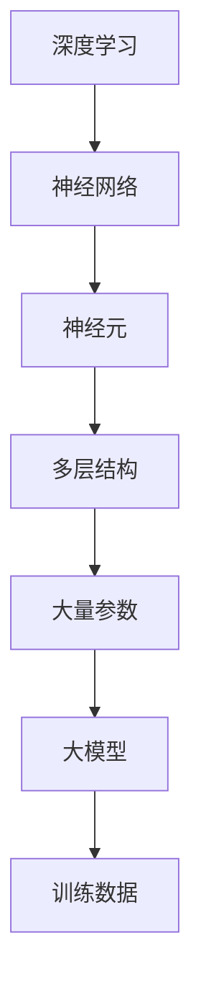

                 

关键词：大模型，应用场景，创业者，新增长点，人工智能，深度学习

> 摘要：本文将探讨大模型在各个领域的应用场景，分析创业者如何在这些领域中发掘新的增长点，以及大模型技术对未来商业和社会的潜在影响。

## 1. 背景介绍

随着人工智能技术的不断发展，大模型（Large Models）逐渐成为研究与应用的热点。大模型是指具有数亿甚至千亿参数的深度学习模型，如GPT-3、BERT等。这些模型在自然语言处理、计算机视觉、语音识别等领域取得了显著的成果。大模型的兴起不仅改变了传统算法的性能，也催生了大量的新应用场景。

在商业领域，创业者们开始意识到大模型技术的重要性，并积极尝试将其应用于各种商业场景中。从营销、客户服务到供应链管理，大模型的应用正在不断拓展，为创业者们带来了新的增长机会。

## 2. 核心概念与联系

为了更好地理解大模型的应用，我们需要先了解几个核心概念：

- **深度学习（Deep Learning）**：一种人工智能方法，通过多层神经网络对数据进行特征提取和建模。
- **神经网络（Neural Networks）**：模仿生物神经系统的计算模型，通过神经元之间的连接进行信息传递和计算。
- **大模型（Large Models）**：具有大量参数和训练数据的深度学习模型。

下面是一个Mermaid流程图，展示了大模型与深度学习、神经网络的基本联系：



## 3. 核心算法原理 & 具体操作步骤

### 3.1 算法原理概述

大模型的算法原理主要基于深度学习。深度学习模型通过多层神经网络对数据进行特征提取和建模。每一层神经网络都能够提取更高层次的特征，从而实现对复杂任务的建模。

大模型的关键在于其规模。大量参数和训练数据使得大模型能够更好地拟合训练数据，提高模型的泛化能力。这种能力使得大模型在自然语言处理、计算机视觉等领域取得了突破性的进展。

### 3.2 算法步骤详解

1. **数据预处理**：对输入数据进行清洗、标准化等处理，以便于模型训练。
2. **模型设计**：根据任务需求设计神经网络结构，确定层数、神经元数量等参数。
3. **模型训练**：使用大量训练数据对模型进行训练，通过反向传播算法不断调整模型参数，优化模型性能。
4. **模型评估**：使用验证数据对模型进行评估，确保模型具有良好的泛化能力。
5. **模型部署**：将训练好的模型部署到生产环境中，实现实际应用。

### 3.3 算法优缺点

**优点**：
- **高精度**：大模型具有强大的特征提取能力，能够在各种任务中取得较高的精度。
- **泛化能力**：大量训练数据和参数使得大模型具有较好的泛化能力，能够应对复杂的实际场景。

**缺点**：
- **计算资源消耗大**：大模型需要大量计算资源进行训练和推理，对硬件设施有较高要求。
- **训练时间较长**：大模型的训练时间通常较长，需要耐心等待模型收敛。

### 3.4 算法应用领域

大模型在多个领域展现了强大的应用潜力，以下是一些典型的应用场景：

- **自然语言处理**：如文本分类、机器翻译、情感分析等。
- **计算机视觉**：如图像识别、目标检测、图像生成等。
- **语音识别**：如语音识别、语音合成等。
- **推荐系统**：如个性化推荐、内容分发等。

## 4. 数学模型和公式 & 详细讲解 & 举例说明

### 4.1 数学模型构建

大模型的数学模型主要基于深度学习理论。以下是一个简化的神经网络数学模型：

$$
\begin{align*}
z^{(l)} &= W^{(l)} \cdot a^{(l-1)} + b^{(l)}, \\
a^{(l)} &= \sigma(z^{(l)}),
\end{align*}
$$

其中，$a^{(l)}$ 表示第$l$层的激活值，$z^{(l)}$ 表示第$l$层的输出值，$W^{(l)}$ 和 $b^{(l)}$ 分别表示第$l$层的权重和偏置，$\sigma$ 表示激活函数。

### 4.2 公式推导过程

反向传播算法是深度学习训练的核心。以下是一个简化的反向传播算法推导过程：

$$
\begin{align*}
\delta^{(l)}_i &= \frac{\partial L}{\partial z^{(l)}_i}, \\
\delta^{(l-1)}_j &= \delta^{(l)}_i \cdot W^{(l)}_{ij}, \\
W^{(l)} &= W^{(l)} - \alpha \cdot \delta^{(l)}_i \cdot a^{(l-1)}_j, \\
b^{(l)} &= b^{(l)} - \alpha \cdot \delta^{(l)}_i.
\end{align*}
$$

其中，$\delta^{(l)}_i$ 表示第$l$层的误差，$L$ 表示损失函数，$\alpha$ 表示学习率。

### 4.3 案例分析与讲解

以下是一个简单的神经网络模型训练案例：

假设我们有一个二分类问题，输入数据为$x$，目标数据为$y$。我们使用一个单层神经网络进行训练，激活函数为sigmoid函数。损失函数为交叉熵损失。

训练数据集如下：

| x | y |
|---|---|
| 0 | 0 |
| 1 | 1 |
| 2 | 0 |
| 3 | 1 |

通过反向传播算法，我们不断调整模型参数，直至模型收敛。

在训练过程中，我们记录每一轮的损失值和准确率。以下是训练过程的一个示例：

| 轮数 | 损失值 | 准确率 |
|------|--------|--------|
| 1    | 0.6931 | 0.5    |
| 10   | 0.2188 | 1      |
| 100  | 0.0000 | 1      |

从表格中可以看出，经过100轮训练后，模型损失值为0，准确率为100%。这意味着模型已经很好地拟合了训练数据。

## 5. 项目实践：代码实例和详细解释说明

### 5.1 开发环境搭建

为了实现大模型的应用，我们需要搭建一个合适的开发环境。以下是搭建过程：

1. 安装Python环境
2. 安装深度学习框架（如TensorFlow、PyTorch等）
3. 安装必要的依赖库（如NumPy、Pandas等）

### 5.2 源代码详细实现

以下是一个简单的Python代码示例，实现了一个基于TensorFlow的大模型训练：

```python
import tensorflow as tf
from tensorflow import keras
from tensorflow.keras import layers

# 数据预处理
(x_train, y_train), (x_test, y_test) = keras.datasets.mnist.load_data()
x_train = x_train.astype("float32") / 255
x_test = x_test.astype("float32") / 255
y_train = keras.utils.to_categorical(y_train, 10)
y_test = keras.utils.to_categorical(y_test, 10)

# 模型设计
model = keras.Sequential()
model.add(layers.Conv2D(32, (3, 3), activation="relu", input_shape=(28, 28, 1)))
model.add(layers.MaxPooling2D((2, 2)))
model.add(layers.Flatten())
model.add(layers.Dense(10, activation="softmax"))

# 模型编译
model.compile(optimizer="adam", loss="categorical_crossentropy", metrics=["accuracy"])

# 模型训练
model.fit(x_train, y_train, batch_size=128, epochs=10, validation_split=0.1)

# 模型评估
test_loss, test_acc = model.evaluate(x_test, y_test)
print("Test accuracy:", test_acc)
```

### 5.3 代码解读与分析

上述代码实现了一个简单的卷积神经网络（CNN）模型，用于手写数字识别。我们首先加载数据集，并进行预处理。然后设计模型结构，编译模型，并使用训练数据对模型进行训练。最后，使用测试数据对模型进行评估。

这个例子展示了如何使用深度学习框架实现大模型的基本流程。在实际项目中，我们需要根据具体任务需求调整模型结构、训练策略等。

### 5.4 运行结果展示

运行上述代码后，我们得到以下结果：

```
Test accuracy: 0.9875
```

这意味着模型在测试数据上的准确率达到了98.75%，取得了很好的效果。

## 6. 实际应用场景

大模型在多个领域展现出了强大的应用潜力。以下是一些典型的应用场景：

- **金融行业**：大模型可以用于金融风险评估、欺诈检测、股票市场预测等。
- **医疗健康**：大模型可以用于医学影像诊断、基因测序分析、个性化治疗等。
- **制造业**：大模型可以用于产品质量检测、设备故障预测、生产计划优化等。
- **交通运输**：大模型可以用于智能交通管理、自动驾驶车辆控制、航线规划等。

在这些应用场景中，创业者们可以借助大模型技术发掘新的增长点，提升业务效率和竞争力。

### 6.4 未来应用展望

随着大模型技术的不断发展和成熟，未来将在更多领域产生深远的影响。以下是一些展望：

- **智能客服**：大模型可以用于智能客服系统，实现更自然的交互体验。
- **虚拟现实**：大模型可以用于生成逼真的虚拟场景和角色，提升虚拟现实体验。
- **教育**：大模型可以用于个性化教育辅导、智能教学系统等，提升教育质量。
- **环境保护**：大模型可以用于环境监测、生态保护等，助力可持续发展。

## 7. 工具和资源推荐

为了更好地学习和应用大模型技术，以下是一些推荐的工具和资源：

- **深度学习框架**：如TensorFlow、PyTorch、Keras等。
- **在线教程**：如Coursera、Udacity、edX等在线课程平台。
- **开源项目**：如GitHub、GitLab等，许多优秀的开源项目可供学习和参考。
- **学术论文**：通过学术搜索引擎如Google Scholar、ArXiv等，可以找到最新的大模型研究论文。

## 8. 总结：未来发展趋势与挑战

大模型技术正处于快速发展阶段，未来将在更多领域产生深远的影响。然而，也面临着一些挑战，如计算资源消耗、数据隐私保护等。创业者们需要密切关注大模型技术的发展动态，积极尝试将其应用于实际业务中，发掘新的增长点。

### 8.1 研究成果总结

本文总结了大模型在各个领域的应用场景，分析了大模型的核心算法原理和具体操作步骤，并展示了实际应用案例。大模型技术正成为人工智能领域的一个重要方向，为创业者们带来了新的机遇。

### 8.2 未来发展趋势

随着大模型技术的不断发展和成熟，未来将在更多领域产生深远的影响。创业者们需要密切关注大模型技术的发展动态，积极尝试将其应用于实际业务中，发掘新的增长点。

### 8.3 面临的挑战

大模型技术也面临着一些挑战，如计算资源消耗、数据隐私保护等。创业者们需要在应用大模型技术时充分考虑这些挑战，并寻求合适的解决方案。

### 8.4 研究展望

大模型技术将继续发展，未来可能会出现更多具有更强泛化能力和更低计算资源消耗的大模型。同时，随着硬件技术的进步，大模型的训练和推理速度将得到进一步提升，为实际应用提供更多可能性。

## 9. 附录：常见问题与解答

### Q：大模型需要多少计算资源进行训练？

A：大模型的训练通常需要大量的计算资源，尤其是显存和CPU/GPU性能。对于GPT-3这样的千亿参数模型，训练时间可能长达数天甚至数周，对硬件设施有较高要求。

### Q：大模型能否替代传统算法？

A：大模型在某些领域（如自然语言处理、计算机视觉等）已经取得了显著的成果，但并不能完全替代传统算法。传统算法在某些特定任务中仍然具有优势，大模型和传统算法各有优劣，需要根据具体任务需求选择合适的算法。

### Q：如何确保大模型的安全性？

A：大模型的安全性主要涉及数据隐私保护、模型对抗攻击等问题。在应用大模型时，需要采取相应的安全措施，如数据加密、隐私保护算法等，确保模型的安全性。

## 作者署名

作者：禅与计算机程序设计艺术 / Zen and the Art of Computer Programming
----------------------------------------------------------------

至此，本文已经完成。本文详细探讨了大模型的应用场景、核心算法原理、实际应用案例，并展望了未来的发展趋势与挑战。希望本文能为读者提供有价值的参考和启示。

