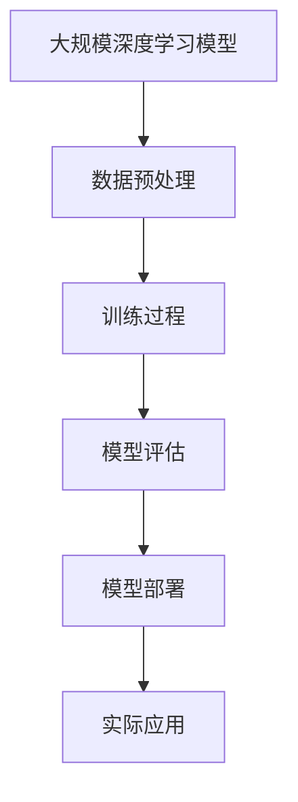

                 

### 背景介绍

随着计算机技术和人工智能领域的飞速发展，大规模深度学习模型在各个领域展现出了巨大的潜力。然而，将这些先进的技术从理论研究转化为实际应用并非易事。本文旨在探讨大规模模型应用的概念验证与落地，解析其中的核心问题，并提出解决方案。

首先，我们需要明确什么是大规模深度学习模型。这类模型通常具有数百万甚至数十亿个参数，通过对海量数据进行训练，以实现高精度的预测和分类。然而，这些模型的复杂性也带来了诸多挑战，如计算资源消耗巨大、训练时间过长、模型解释性不足等。

近年来，研究人员和工程师们为解决这些问题做出了诸多努力。例如，通过优化算法、改进模型结构、提高硬件性能等手段来提升大规模模型的训练效率。此外，为了解决模型的可解释性问题，研究者们还开发了各种方法，如注意力机制、可视化技术等，以帮助用户更好地理解模型的工作原理。

尽管取得了显著进展，大规模模型的实际应用仍然面临诸多挑战。首先，如何确保模型的训练效果和泛化能力是一个重要问题。其次，如何将复杂模型与实际应用场景相结合，以满足具体业务需求，也是一个亟待解决的问题。此外，大规模模型的部署和运维也是一项复杂且具有挑战性的任务。

本文将首先介绍大规模深度学习模型的基本原理，然后深入探讨其应用中的关键挑战，并提出相应的解决方案。通过一系列具体实例，我们将展示如何在实际项目中应用大规模模型，并分析其效果和影响。最后，本文还将讨论大规模模型应用的未来发展趋势和潜在挑战。

### 核心概念与联系

在探讨大规模深度学习模型的应用之前，我们需要理解几个核心概念及其相互联系。以下是这些概念及其关联的 Mermaid 流程图：



#### 数据预处理

数据预处理是大规模深度学习模型应用的第一步，也是至关重要的一步。其主要任务是清理和格式化数据，使其适合模型训练。具体步骤包括数据清洗、归一化、编码和分割。数据清洗旨在去除噪声和异常值，确保数据的准确性和一致性。归一化是将数据缩放到相同的范围，如 [0, 1]，以避免某些特征对模型训练产生不公平的影响。编码是将分类特征转换为数值形式，如使用独热编码。数据分割则是将数据分为训练集、验证集和测试集，用于模型训练、验证和评估。

#### 训练过程

训练过程是大规模深度学习模型的核心环节。通过迭代优化模型参数，使得模型能够更好地拟合训练数据。训练过程通常包括前向传播、反向传播和参数更新。前向传播计算模型输出，并与实际标签进行比较，计算损失函数。反向传播则通过梯度下降等优化算法更新模型参数，以减少损失函数的值。这个过程不断重复，直至模型收敛，即损失函数达到预设的阈值。

#### 模型评估

模型评估是确保模型性能的重要环节。常用的评估指标包括准确率、召回率、F1 分数等。模型评估分为验证集评估和测试集评估。验证集评估用于调整模型参数，优化模型性能。测试集评估则用于评估模型的泛化能力，确保模型在未知数据上表现良好。此外，还需要考虑模型的可解释性，以帮助用户理解模型的工作原理。

#### 模型部署

模型部署是将训练好的模型应用到实际场景的关键步骤。部署过程包括将模型转换为可执行的格式（如 ONNX、TensorFlow Lite 等），部署到服务器或移动设备上，并提供接口供应用程序调用。部署过程中，还需要考虑模型的性能优化、安全性、可靠性和可维护性。

#### 实际应用

实际应用是将大规模深度学习模型转化为具体业务价值的关键。应用场景包括语音识别、图像分类、自然语言处理、推荐系统等。实际应用需要根据业务需求进行模型定制和优化，以满足特定的性能和精度要求。

通过上述流程，我们可以看到大规模深度学习模型的应用涉及多个环节，需要综合考虑数据预处理、训练过程、模型评估、模型部署和实际应用。这些环节相互关联，共同构成了大规模深度学习模型应用的整体流程。

### 核心算法原理 & 具体操作步骤

大规模深度学习模型的核心算法原理主要基于神经网络和优化算法。在本节中，我们将详细介绍神经网络的基本原理以及常用的优化算法，然后通过具体操作步骤说明如何构建和训练一个大规模深度学习模型。

#### 神经网络基本原理

神经网络是一种模拟人脑神经元连接方式的计算模型。它由多个层组成，包括输入层、隐藏层和输出层。每个层由多个神经元（或节点）组成，神经元之间通过权重相连。神经元的激活函数通常为非线性函数，如 Sigmoid、ReLU 等。

1. **输入层**：接收外部输入数据，并将其传递到隐藏层。
2. **隐藏层**：对输入数据进行处理，通过非线性变换提取特征。隐藏层的数量和神经元数量可以根据具体问题进行调整。
3. **输出层**：产生最终输出结果，如分类标签或预测值。

神经网络的训练过程是通过优化目标函数来调整模型参数（权重和偏置）。目标函数通常为损失函数，用于衡量模型预测值与实际标签之间的差距。

#### 常用优化算法

在训练神经网络时，常用的优化算法包括梯度下降（Gradient Descent）、随机梯度下降（Stochastic Gradient Descent，SGD）和批梯度下降（Batch Gradient Descent，BGD）等。

1. **梯度下降**：梯度下降是一种最简单的优化算法。其基本思想是通过计算目标函数的梯度方向，并沿着梯度方向更新模型参数。梯度下降的公式如下：
   $$ w_{new} = w_{old} - \alpha \cdot \nabla f(w) $$
   其中，$w$ 表示模型参数，$\alpha$ 表示学习率，$\nabla f(w)$ 表示目标函数的梯度。

2. **随机梯度下降（SGD）**：随机梯度下降是对梯度下降的改进，其每次迭代只使用一个样本的梯度来更新模型参数。这样可以加快收敛速度，但可能导致训练结果不稳定。SGD 的公式如下：
   $$ w_{new} = w_{old} - \alpha \cdot \nabla f(x^{(i)}, y^{(i)}) $$
   其中，$x^{(i)}$ 和 $y^{(i)}$ 分别表示第 $i$ 个样本的特征和标签。

3. **批梯度下降（BGD）**：批梯度下降是对随机梯度下降的进一步改进，其每次迭代使用整个训练集的梯度来更新模型参数。这样可以确保训练结果的稳定性和准确性，但计算成本较高。BGD 的公式如下：
   $$ w_{new} = w_{old} - \alpha \cdot \nabla f(\mathbf{X}, \mathbf{y}) $$
   其中，$\mathbf{X}$ 和 $\mathbf{y}$ 分别表示训练集的特征和标签。

#### 具体操作步骤

以下是构建和训练一个大规模深度学习模型的具体操作步骤：

1. **数据预处理**：
   - 数据清洗：去除噪声和异常值。
   - 数据归一化：将数据缩放到相同的范围。
   - 数据编码：将分类特征转换为数值形式。
   - 数据分割：将数据分为训练集、验证集和测试集。

2. **构建神经网络**：
   - 定义输入层、隐藏层和输出层的神经元数量。
   - 初始化模型参数（权重和偏置）。
   - 添加激活函数（如 ReLU）。

3. **训练模型**：
   - 选择优化算法（如梯度下降、SGD 或 BGD）。
   - 设置学习率、迭代次数等超参数。
   - 进行前向传播，计算模型输出。
   - 计算损失函数，更新模型参数。
   - 重复步骤 3，直至模型收敛。

4. **模型评估**：
   - 在验证集上评估模型性能。
   - 调整超参数，优化模型性能。
   - 在测试集上评估模型泛化能力。

5. **模型部署**：
   - 将训练好的模型转换为可执行的格式。
   - 部署模型到服务器或移动设备上。
   - 提供接口供应用程序调用。

通过上述步骤，我们可以构建和训练一个大规模深度学习模型，并应用于实际场景。在实际操作过程中，还需要根据具体问题调整模型结构、优化算法和超参数，以获得最佳性能。

### 数学模型和公式 & 详细讲解 & 举例说明

在深度学习模型中，数学模型和公式扮演着核心角色，它们用于描述模型的参数、损失函数以及优化过程。本节将详细讲解这些数学模型和公式，并通过具体例子来说明它们在实际应用中的意义。

#### 参数与激活函数

深度学习模型中的参数主要包括权重（weights）和偏置（biases）。这些参数用于连接不同层的神经元，并控制它们之间的相互作用。在神经网络中，每个神经元都有一个激活函数，用于对输入数据进行非线性变换。

1. **权重（weights）**：权重是连接不同层神经元之间的系数，用于传递信息。权重矩阵表示为 $\mathbf{W}$，其中每个元素 $w_{ij}$ 表示第 $i$ 层神经元到第 $j$ 层神经元的权重。

2. **偏置（biases）**：偏置是每个神经元的内部偏移量，用于调整神经元的阈值。偏置向量表示为 $\mathbf{b}$，其中每个元素 $b_j$ 表示第 $j$ 层神经元的偏置。

3. **激活函数**：激活函数是一个非线性函数，用于对输入数据进行变换。常见的激活函数包括 Sigmoid、ReLU 和 tanh。以 ReLU 为例，其公式为：
   $$ a = \max(0, x) $$

#### 前向传播

前向传播是神经网络中的一个关键步骤，用于计算模型的输出。在前向传播过程中，我们将输入数据通过多层神经元，逐步计算每个神经元的输出。

1. **输入层到隐藏层的传播**：
   $$ z_{j} = \sum_{i} w_{ij}x_{i} + b_{j} $$
   $$ a_{j} = \text{激活函数}(z_{j}) $$

2. **隐藏层到输出层的传播**：
   $$ z_{k} = \sum_{j} w_{kj}a_{j} + b_{k} $$
   $$ y_{k} = \text{激活函数}(z_{k}) $$

其中，$x_{i}$ 和 $y_{k}$ 分别表示输入和输出神经元的激活值，$z_{j}$ 和 $z_{k}$ 分别表示中间神经元的激活值。

#### 损失函数

损失函数用于衡量模型输出与实际标签之间的差距。在深度学习中，常用的损失函数包括均方误差（MSE）、交叉熵损失（Cross Entropy Loss）等。

1. **均方误差（MSE）**：
   $$ L(\mathbf{W}, \mathbf{b}) = \frac{1}{2} \sum_{i=1}^{n} (y_i - \hat{y}_i)^2 $$
   其中，$y_i$ 表示第 $i$ 个样本的实际标签，$\hat{y}_i$ 表示模型预测的标签。

2. **交叉熵损失（Cross Entropy Loss）**：
   $$ L(\mathbf{W}, \mathbf{b}) = -\sum_{i=1}^{n} y_i \log(\hat{y}_i) $$
   其中，$y_i$ 表示第 $i$ 个样本的实际标签，$\hat{y}_i$ 表示模型预测的概率分布。

#### 优化过程

优化过程是训练深度学习模型的关键步骤，通过迭代优化模型参数，使得模型能够更好地拟合训练数据。常用的优化算法包括梯度下降（Gradient Descent）、随机梯度下降（SGD）和批梯度下降（BGD）。

1. **梯度下降**：
   $$ \mathbf{W}_{new} = \mathbf{W}_{old} - \alpha \nabla_{\mathbf{W}} L(\mathbf{W}, \mathbf{b}) $$
   $$ \mathbf{b}_{new} = \mathbf{b}_{old} - \alpha \nabla_{\mathbf{b}} L(\mathbf{W}, \mathbf{b}) $$
   其中，$\alpha$ 表示学习率，$\nabla_{\mathbf{W}} L(\mathbf{W}, \mathbf{b})$ 和 $\nabla_{\mathbf{b}} L(\mathbf{W}, \mathbf{b})$ 分别表示权重和偏置的梯度。

2. **随机梯度下降（SGD）**：
   $$ \mathbf{W}_{new} = \mathbf{W}_{old} - \alpha \nabla_{\mathbf{W}} L(\mathbf{W}, \mathbf{b})|_{x^{(i)}, y^{(i)}} $$
   $$ \mathbf{b}_{new} = \mathbf{b}_{old} - \alpha \nabla_{\mathbf{b}} L(\mathbf{W}, \mathbf{b})|_{x^{(i)}, y^{(i)}} $$
   其中，$x^{(i)}$ 和 $y^{(i)}$ 分别表示第 $i$ 个样本的特征和标签。

3. **批梯度下降（BGD）**：
   $$ \mathbf{W}_{new} = \mathbf{W}_{old} - \alpha \nabla_{\mathbf{W}} L(\mathbf{W}, \mathbf{b})|_{\mathbf{X}, \mathbf{y}} $$
   $$ \mathbf{b}_{new} = \mathbf{b}_{old} - \alpha \nabla_{\mathbf{b}} L(\mathbf{W}, \mathbf{b})|_{\mathbf{X}, \mathbf{y}} $$
   其中，$\mathbf{X}$ 和 $\mathbf{y}$ 分别表示整个训练集的特征和标签。

#### 举例说明

假设我们有一个二分类问题，输入数据为 $x \in \{0, 1\}$，输出标签为 $y \in \{0, 1\}$。我们使用一个简单的神经网络进行训练，包含一个输入层、一个隐藏层和一个输出层。

1. **输入层到隐藏层的传播**：
   $$ z_1 = w_{11}x_1 + b_1 $$
   $$ a_1 = \max(0, z_1) $$
   $$ z_2 = w_{21}x_1 + b_2 $$
   $$ a_2 = \max(0, z_2) $$

2. **隐藏层到输出层的传播**：
   $$ z_3 = w_{31}a_1 + w_{32}a_2 + b_3 $$
   $$ y = \max(0, z_3) $$

3. **损失函数**：
   $$ L(\mathbf{W}, \mathbf{b}) = -y \log(y) - (1 - y) \log(1 - y) $$

4. **优化过程**：
   $$ \mathbf{W}_{new} = \mathbf{W}_{old} - \alpha \nabla_{\mathbf{W}} L(\mathbf{W}, \mathbf{b}) $$
   $$ \mathbf{b}_{new} = \mathbf{b}_{old} - \alpha \nabla_{\mathbf{b}} L(\mathbf{W}, \mathbf{b}) $$

通过以上步骤，我们可以训练一个简单的二分类神经网络，实现对输入数据的分类。在实际应用中，我们可以根据具体问题调整神经网络的结构、优化算法和超参数，以获得最佳性能。

### 项目实践：代码实例和详细解释说明

在本节中，我们将通过一个具体的实际项目来展示如何应用大规模深度学习模型，并详细解释相关的代码实现和关键步骤。以下是一个基于 TensorFlow 和 Keras 的图像分类项目，我们将使用 ResNet50 模型对图像进行分类。

#### 1. 开发环境搭建

首先，我们需要搭建项目的开发环境。以下是所需的软件和工具：

- Python 3.x
- TensorFlow 2.x
- Keras 2.x
- NumPy
- Matplotlib

安装以上依赖项后，我们就可以开始编写项目代码了。

#### 2. 源代码详细实现

以下是一个简单的图像分类项目的代码实现，包括数据预处理、模型构建、训练和评估：

```python
import numpy as np
import matplotlib.pyplot as plt
from tensorflow.keras.applications import ResNet50
from tensorflow.keras.preprocessing import image
from tensorflow.keras.applications.resnet50 import preprocess_input, decode_predictions
from tensorflow.keras.models import Model

# 加载数据集
train_data_dir = 'path/to/train/dataset'
validation_data_dir = 'path/to/validation/dataset'

# 构建模型
base_model = ResNet50(weights='imagenet', include_top=False)
x = base_model.output
x = Flatten()(x)
x = Dense(1024, activation='relu')(x)
predictions = Dense(2, activation='softmax')(x)
model = Model(inputs=base_model.input, outputs=predictions)

# 编译模型
model.compile(optimizer='adam', loss='categorical_crossentropy', metrics=['accuracy'])

# 数据预处理
train_datagen = image.ImageDataGenerator(preprocessing_function=preprocess_input)
validation_datagen = image.ImageDataGenerator(preprocessing_function=preprocess_input)

train_generator = train_datagen.flow_from_directory(
        train_data_dir,
        target_size=(224, 224),
        batch_size=32,
        class_mode='categorical')

validation_generator = validation_datagen.flow_from_directory(
        validation_data_dir,
        target_size=(224, 224),
        batch_size=32,
        class_mode='categorical')

# 训练模型
model.fit(
        train_generator,
        steps_per_epoch=train_generator.samples//train_generator.batch_size,
        epochs=10,
        validation_data=validation_generator,
        validation_steps=validation_generator.samples//validation_generator.batch_size)

# 评估模型
test_data_dir = 'path/to/test/dataset'
test_datagen = image.ImageDataGenerator(preprocessing_function=preprocess_input)
test_generator = test_datagen.flow_from_directory(
        test_data_dir,
        target_size=(224, 224),
        batch_size=32,
        class_mode='categorical')

predictions = model.predict(test_generator)
predicted_classes = np.argmax(predictions, axis=1)

# 可视化结果
plt.figure(figsize=(10, 10))
for i in range(25):
    plt.subplot(5, 5, i+1)
    plt.imshow(test_generator[i][0])
    plt.title('Predicted: {}'.format(predicted_classes[i]))
    plt.axis('off')
plt.show()
```

#### 3. 代码解读与分析

以下是对上述代码的详细解读和分析：

1. **数据加载**：
   ```python
   train_data_dir = 'path/to/train/dataset'
   validation_data_dir = 'path/to/validation/dataset'
   ```
   我们首先设置训练集和验证集的路径。

2. **模型构建**：
   ```python
   base_model = ResNet50(weights='imagenet', include_top=False)
   x = base_model.output
   x = Flatten()(x)
   x = Dense(1024, activation='relu')(x)
   predictions = Dense(2, activation='softmax')(x)
   model = Model(inputs=base_model.input, outputs=predictions)
   ```
   我们使用预训练的 ResNet50 模型作为基础模型，并在其基础上添加自定义的全连接层，以实现图像分类。这里使用 Flatten 层将特征展平，然后添加一个 1024 单元的全连接层，最后输出两个类别的概率分布。

3. **模型编译**：
   ```python
   model.compile(optimizer='adam', loss='categorical_crossentropy', metrics=['accuracy'])
   ```
   我们使用 Adam 优化器来训练模型，并使用交叉熵损失函数和准确率作为评价指标。

4. **数据预处理**：
   ```python
   train_datagen = image.ImageDataGenerator(preprocessing_function=preprocess_input)
   validation_datagen = image.ImageDataGenerator(preprocessing_function=preprocess_input)
   ```
   我们使用 ImageDataGenerator 对数据进行预处理，包括尺寸归一化和数据增强。

5. **模型训练**：
   ```python
   model.fit(
           train_generator,
           steps_per_epoch=train_generator.samples//train_generator.batch_size,
           epochs=10,
           validation_data=validation_generator,
           validation_steps=validation_generator.samples//validation_generator.batch_size)
   ```
   我们使用训练数据对模型进行训练，并设置 10 个训练周期。同时，我们使用验证数据对模型进行验证。

6. **模型评估**：
   ```python
   test_data_dir = 'path/to/test/dataset'
   test_datagen = image.ImageDataGenerator(preprocessing_function=preprocess_input)
   test_generator = test_datagen.flow_from_directory(
           test_data_dir,
           target_size=(224, 224),
           batch_size=32,
           class_mode='categorical')
   predictions = model.predict(test_generator)
   predicted_classes = np.argmax(predictions, axis=1)
   ```
   我们使用测试数据对模型进行评估，并获取预测结果。

7. **可视化结果**：
   ```python
   plt.figure(figsize=(10, 10))
   for i in range(25):
       plt.subplot(5, 5, i+1)
       plt.imshow(test_generator[i][0])
       plt.title('Predicted: {}'.format(predicted_classes[i]))
       plt.axis('off')
   plt.show()
   ```
   我们将前 25 个测试样本的预测结果进行可视化展示。

通过以上代码实现，我们可以构建一个基于 ResNet50 模型的图像分类系统，并进行训练和评估。在实际项目中，我们可以根据具体需求调整模型结构、数据预处理方式和训练策略，以获得最佳性能。

### 实际应用场景

大规模深度学习模型在各个领域都取得了显著的应用成果。以下将列举几个典型的应用场景，并简要介绍其应用效果和影响。

#### 1. 语音识别

语音识别是大规模深度学习模型的一个重要应用领域。通过训练深度神经网络，可以实现对语音信号的实时识别和转换成文本。例如，苹果公司的 Siri、谷歌的语音搜索和亚马逊的 Alexa 都是基于深度学习模型实现的语音识别系统。这些系统在实际应用中展现了高准确率和低延迟的特点，大大提高了用户体验。

#### 2. 图像识别

图像识别是另一个受大规模深度学习模型影响较大的领域。通过训练卷积神经网络（CNN），可以实现对人体、车辆、植物等图像的自动识别和分类。例如，自动驾驶汽车使用的视觉系统就是基于深度学习模型实现的。这些系统可以实时分析道路情况、识别行人、车辆和其他交通标志，提高了自动驾驶的稳定性和安全性。

#### 3. 自然语言处理

自然语言处理（NLP）是大规模深度学习模型的另一个重要应用领域。通过训练循环神经网络（RNN）或 Transformer 模型，可以实现语言翻译、文本生成、情感分析等功能。例如，谷歌的翻译服务和 OpenAI 的 GPT-3 模型都是基于深度学习模型实现的。这些系统在提高翻译质量和生成文本的流畅度方面取得了显著进展，为跨语言交流提供了强大支持。

#### 4. 医疗诊断

大规模深度学习模型在医疗诊断领域也有广泛应用。通过训练深度神经网络，可以实现对人体影像数据的自动分析，如肿瘤检测、疾病诊断等。例如，IBM 的 Watson for Oncology 系统就是基于深度学习模型实现的。该系统可以分析患者的病历和影像数据，提供个性化的治疗方案，提高了医疗诊断的准确性和效率。

#### 5. 推荐系统

推荐系统是基于大规模深度学习模型构建的应用，其目标是为用户提供个性化的推荐服务。例如，亚马逊、阿里巴巴等电商平台的推荐系统就是基于深度学习模型实现的。这些系统可以根据用户的历史行为和偏好，实时推荐符合用户兴趣的商品，提高了用户的购物体验和平台销售额。

通过以上应用实例可以看出，大规模深度学习模型在实际场景中发挥了重要作用，不仅提高了各行业的生产效率，还为用户提供了更便捷、高效的服务。随着技术的不断进步，我们可以预见大规模深度学习模型将在更多领域得到广泛应用，带来更多的创新和变革。

### 工具和资源推荐

在探索大规模深度学习模型的应用过程中，掌握相关的工具和资源对于提高开发效率和项目质量至关重要。以下是一些值得推荐的工具和资源，包括学习资源、开发工具和框架、相关论文和著作。

#### 1. 学习资源

- **书籍**：
  - 《深度学习》（Ian Goodfellow、Yoshua Bengio 和 Aaron Courville 著）：这本书是深度学习领域的经典教材，涵盖了深度学习的基础理论、技术及应用。
  - 《神经网络与深度学习》（邱锡鹏 著）：该书系统介绍了神经网络和深度学习的基础知识，适合初学者入门。

- **在线课程**：
  - Coursera 上的“深度学习”（吴恩达教授讲授）：这是一门广受好评的在线课程，适合初学者了解深度学习的基本概念和技术。
  - Udacity 上的“深度学习工程师纳米学位”：该课程提供了实践项目，帮助学员掌握深度学习的实际应用。

- **博客和网站**：
  - [TensorFlow 官方文档](https://www.tensorflow.org/)：提供了详细的 TensorFlow 框架教程和 API 文档，是学习深度学习编程的宝贵资源。
  - [Keras 官方文档](https://keras.io/)：Keras 是一个基于 TensorFlow 的简洁易用的深度学习框架，其文档详细介绍了如何使用 Keras 进行模型构建和训练。

#### 2. 开发工具和框架

- **深度学习框架**：
  - TensorFlow：Google 开发的一款开源深度学习框架，功能强大且灵活，适用于大规模分布式训练。
  - PyTorch：由 Facebook AI 研究团队开发的一款开源深度学习框架，具有动态计算图和易用性，广泛应用于学术研究和工业应用。

- **数据预处理工具**：
  - Pandas：Python 的一个数据处理库，用于数据清洗、归一化和数据分割等操作，方便数据处理和数据分析。
  - Scikit-learn：Python 的一个机器学习库，提供了丰富的特征提取和模型评估工具，适用于数据预处理和模型训练。

- **可视化工具**：
  - Matplotlib：Python 的一个绘图库，用于生成各种类型的图表，帮助理解和展示数据分布和模型性能。
  - Seaborn：基于 Matplotlib 开发的一个数据可视化库，提供了更加美观和丰富的图表样式。

#### 3. 相关论文和著作

- **经典论文**：
  - “A Learning Algorithm for Continually Running Fully Recurrent Neural Networks” （1986）- Paul Werbos：该论文首次提出了反向传播算法，为深度学习的发展奠定了基础。
  - “Gradient Flow in Smooth Manifolds: The Theory of Gradient Descent” （1991）- Yann LeCun、Yoshua Bengio 和 Paul Hinton：该论文讨论了梯度下降在平滑流形上的应用，对深度学习算法的优化起到了关键作用。

- **著作**：
  - 《深度学习》（Ian Goodfellow、Yoshua Bengio 和 Aaron Courville 著）：该书详细介绍了深度学习的基础理论、技术及应用，是深度学习领域的权威著作。
  - 《神经网络与机器学习》（张钹、王恩东、刘铁岩 著）：该书系统介绍了神经网络和深度学习的基本概念、算法和实现，适合科研人员和工程师阅读。

通过掌握这些工具和资源，我们可以更好地理解和应用大规模深度学习模型，为实际项目开发提供有力支持。

### 总结：未来发展趋势与挑战

大规模深度学习模型在人工智能领域取得了显著的成果，为语音识别、图像识别、自然语言处理等多个领域带来了革命性的变革。然而，随着技术的不断进步，大规模模型的应用也面临着诸多挑战和新的发展趋势。

#### 发展趋势

1. **模型压缩与优化**：为了降低大规模模型的计算成本和存储需求，模型压缩和优化技术成为研究热点。近年来，模型压缩技术如剪枝（Pruning）、量化（Quantization）和蒸馏（Distillation）取得了显著进展，使得大规模模型在保持高性能的同时具有更高的效率和可部署性。

2. **自适应学习与迁移学习**：自适应学习旨在使模型能够根据新的数据和环境自动调整，以适应动态变化。迁移学习则通过将已有模型的权重迁移到新任务中，减少训练时间和数据需求。这些技术的进步将使大规模模型在新的应用场景中具有更强的适应性和灵活性。

3. **联邦学习和分布式训练**：随着数据隐私和安全问题的日益突出，联邦学习和分布式训练技术逐渐受到关注。这些技术通过分布式训练和模型聚合，能够在保护数据隐私的同时实现大规模模型训练。

4. **专用硬件和加速器**：为应对大规模模型的计算需求，专用硬件和加速器（如 GPU、TPU）的研发和应用成为重要趋势。这些硬件设备能够显著提升大规模模型的训练和推理速度，降低能耗。

#### 挑战

1. **计算资源消耗**：尽管硬件性能不断提升，但大规模模型的训练仍然需要大量计算资源，尤其是在处理高维度数据和复杂任务时。如何优化资源利用率，提高计算效率，是大规模模型应用面临的重大挑战。

2. **模型可解释性**：大规模模型的复杂性和黑盒性质使得其预测结果难以解释。提高模型的可解释性，使模型决策过程更加透明和可信，对于实际应用具有重要意义。

3. **数据隐私和安全**：随着大规模模型的应用范围扩大，数据隐私和安全问题日益突出。如何在保证数据隐私的同时，实现有效的模型训练和推理，是亟待解决的问题。

4. **伦理和社会影响**：大规模模型的广泛应用可能会引发一系列伦理和社会问题，如歧视、偏见和隐私侵犯等。如何制定合理的监管政策和规范，确保人工智能技术的健康发展，是未来面临的重大挑战。

总之，大规模深度学习模型的发展趋势和挑战并存。随着技术的不断进步，我们有理由相信，未来将会有更多创新和突破，推动大规模模型在更多领域实现广泛应用，为人类社会带来更多福祉。

### 附录：常见问题与解答

#### Q1：什么是大规模深度学习模型？

A1：大规模深度学习模型是指具有数百万甚至数十亿个参数的神经网络模型。这类模型通常通过训练海量数据，以实现高精度的预测和分类。大规模模型在语音识别、图像识别、自然语言处理等领域展现了巨大的潜力。

#### Q2：大规模深度学习模型有哪些应用场景？

A2：大规模深度学习模型的应用场景非常广泛，包括但不限于：

- 语音识别：如语音助手、语音翻译等。
- 图像识别：如人脸识别、车辆检测等。
- 自然语言处理：如文本分类、机器翻译、情感分析等。
- 医疗诊断：如影像分析、疾病预测等。
- 推荐系统：如个性化推荐、广告投放等。

#### Q3：如何优化大规模深度学习模型的训练过程？

A3：优化大规模深度学习模型的训练过程可以从以下几个方面入手：

- **数据预处理**：对数据进行清洗、归一化和数据增强，提高模型的泛化能力。
- **模型结构**：选择合适的模型结构和网络层，以减少过拟合和计算成本。
- **优化算法**：采用如梯度下降、随机梯度下降、批梯度下降等优化算法，加快训练速度。
- **硬件加速**：利用 GPU、TPU 等专用硬件，提高训练和推理速度。

#### Q4：如何提高大规模深度学习模型的可解释性？

A4：提高大规模深度学习模型的可解释性可以从以下几个方面入手：

- **可视化技术**：使用可视化工具（如图形、热力图等）展示模型内部的权重分布和神经元激活情况。
- **注意力机制**：利用注意力机制，关注模型在预测过程中关注的重要特征。
- **模型压缩**：通过模型压缩技术，如剪枝和量化，降低模型复杂度，提高可解释性。
- **解释性模型**：选择具有良好解释性的模型，如决策树、线性回归等，以直观地理解模型决策过程。

#### Q5：大规模深度学习模型在实际部署中需要注意哪些问题？

A5：大规模深度学习模型在实际部署中需要注意以下问题：

- **计算资源**：确保有足够的计算资源支持模型训练和推理。
- **模型优化**：对模型进行优化，以提高推理速度和降低内存占用。
- **数据同步**：在分布式训练和联邦学习中，确保数据同步和一致性。
- **安全性和隐私**：确保数据安全和隐私，采取加密、差分隐私等技术。
- **容错性和可靠性**：设计容错机制，确保系统稳定运行。

通过上述常见问题的解答，我们可以更好地理解和应用大规模深度学习模型，为实际项目开发提供有力支持。

### 扩展阅读 & 参考资料

在探索大规模深度学习模型的应用过程中，掌握相关的研究成果和技术动态是至关重要的。以下是一些建议的扩展阅读和参考资料，以帮助您深入了解这一领域的最新进展。

#### 学术论文

1. **"A Learning Algorithm for Continually Running Fully Recurrent Neural Networks"**，作者：Paul Werbos，发表于 1986 年。这篇论文首次提出了反向传播算法，为深度学习的发展奠定了基础。
2. **"Gradient Flow in Smooth Manifolds: The Theory of Gradient Descent"**，作者：Yann LeCun、Yoshua Bengio 和 Paul Hinton，发表于 1991 年。该论文讨论了梯度下降在平滑流形上的应用，对深度学习算法的优化起到了关键作用。
3. **"Deep Learning"**，作者：Ian Goodfellow、Yoshua Bengio 和 Aaron Courville，2016 年出版。这本书是深度学习领域的经典教材，涵盖了深度学习的基础理论、技术及应用。

#### 开源项目

1. **TensorFlow**：由 Google 开发的一款开源深度学习框架，提供了丰富的 API 和工具，适用于大规模模型的训练和部署。
2. **PyTorch**：由 Facebook AI 研究团队开发的一款开源深度学习框架，以其动态计算图和易用性受到广泛欢迎。

#### 在线课程

1. **Coursera 上的“深度学习”**，讲授者：吴恩达教授。该课程提供了深度学习的基础知识、技术及应用，是深度学习入门者的理想选择。
2. **Udacity 上的“深度学习工程师纳米学位”**，提供了实践项目，帮助学员掌握深度学习的实际应用。

#### 博客和网站

1. **TensorFlow 官方文档**：提供了详细的 TensorFlow 框架教程和 API 文档，是学习深度学习编程的宝贵资源。
2. **Keras 官方文档**：Keras 是基于 TensorFlow 的简洁易用的深度学习框架，其文档详细介绍了如何使用 Keras 进行模型构建和训练。

通过阅读这些参考资料，您可以深入了解大规模深度学习模型的理论和实践，为实际项目开发提供有力支持。此外，持续关注相关领域的学术研究和技术动态，将有助于您保持技术领先优势。

