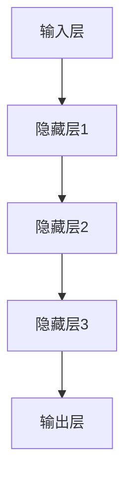

                 

### 文章标题

《大模型应用落地加速，AI商业化进程提速》

> 关键词：大模型，AI商业化，落地加速，深度学习，模型优化，计算资源，数据隐私，开源工具

> 摘要：本文将探讨大模型在AI商业化中的应用现状，分析其落地加速的关键因素，探讨未来发展趋势及面临的挑战。通过深入解析大模型技术原理，结合实际应用场景，为读者提供全面的技术视角和解决方案。

### 1. 背景介绍

随着深度学习的迅猛发展，大模型（Big Models）已经成为AI领域的研究热点。大模型通常具有数百万甚至数十亿个参数，能够处理大规模数据，提供更加准确和高效的预测能力。这种能力在自然语言处理、计算机视觉、语音识别等领域得到了广泛应用。

近年来，随着计算资源的不断升级和优化，大模型的训练和推理速度大幅提升，使其在商业领域的应用变得更加广泛。然而，大模型的商业化落地仍然面临诸多挑战，如计算资源的高昂成本、数据隐私和安全问题、模型优化和部署等。因此，如何加速大模型的应用落地，提高AI商业化的进程，成为当前亟待解决的问题。

本文将从以下几个方面进行探讨：

1. 大模型的核心概念与架构
2. 大模型的核心算法原理与操作步骤
3. 大模型的数学模型与公式
4. 大模型的项目实践：代码实例与分析
5. 大模型在实际应用场景中的落地
6. 大模型商业化进程中面临的工具和资源推荐
7. 大模型未来发展趋势与挑战

### 2. 核心概念与联系

#### 2.1 大模型定义

大模型是指具有数百万至数十亿参数的深度学习模型。这些模型通常采用神经网络结构，能够处理大规模数据，并具有较高的预测精度和泛化能力。

#### 2.2 大模型架构

大模型架构通常包括以下几个部分：

1. **输入层**：接收外部数据，如文本、图像、音频等。
2. **隐藏层**：包含多个神经元，对输入数据进行特征提取和变换。
3. **输出层**：生成预测结果，如分类标签、概率分布等。

以下是一个使用Mermaid绘制的简单大模型架构流程图：



#### 2.3 大模型与AI商业化联系

大模型在AI商业化中的应用主要集中在以下几个方面：

1. **提高预测准确性**：大模型具有更强的特征提取和建模能力，能够提高预测准确性，从而提升业务价值。
2. **降低开发成本**：大模型可以处理大规模数据，降低数据处理和特征工程的工作量，缩短开发周期。
3. **适应性强**：大模型具有较强的泛化能力，能够适应不同业务场景和应用领域。
4. **规模化部署**：大模型支持规模化部署，能够为大规模用户提供服务，提高商业竞争力。

### 3. 核心算法原理 & 具体操作步骤

#### 3.1 深度学习算法原理

深度学习算法基于多层神经网络结构，通过层层提取特征，实现数据的自动特征学习和表示。其主要原理包括：

1. **前向传播**：输入数据从输入层经过多个隐藏层，最终传递到输出层，生成预测结果。
2. **反向传播**：根据预测结果与实际结果的误差，反向传播误差，更新网络参数。
3. **优化算法**：如梯度下降、Adam等，用于加速收敛和提高模型性能。

#### 3.2 大模型具体操作步骤

1. **数据预处理**：对原始数据进行清洗、归一化、扩充等处理，提高数据质量。
2. **模型设计**：设计合适的神经网络结构，选择合适的激活函数、损失函数和优化器。
3. **模型训练**：使用训练数据对模型进行训练，通过反向传播算法更新模型参数。
4. **模型评估**：使用验证集评估模型性能，调整模型参数。
5. **模型部署**：将训练好的模型部署到生产环境，为用户提供服务。

#### 3.3 大模型优化方法

1. **模型压缩**：通过剪枝、量化、蒸馏等方法减小模型大小，降低计算资源需求。
2. **分布式训练**：通过分布式计算技术，提高模型训练速度和效率。
3. **迁移学习**：利用预训练模型，进行迁移学习，提高模型在特定任务上的性能。

### 4. 数学模型和公式 & 详细讲解 & 举例说明

#### 4.1 深度学习基本数学模型

深度学习中的基本数学模型主要包括以下几个部分：

1. **激活函数**：如ReLU、Sigmoid、Tanh等，用于将线性映射转化为非线性映射。
   $$ f(x) = \max(0, x) \quad (ReLU) $$
   $$ f(x) = \frac{1}{1 + e^{-x}} \quad (Sigmoid) $$
   $$ f(x) = \frac{e^x - e^{-x}}{e^x + e^{-x}} \quad (Tanh) $$

2. **损失函数**：如交叉熵损失、均方误差等，用于衡量模型预测结果与实际结果之间的差距。
   $$ \text{CrossEntropy}(y, \hat{y}) = -\sum_{i} y_i \log(\hat{y}_i) \quad (交叉熵损失) $$
   $$ \text{MSE}(y, \hat{y}) = \frac{1}{n} \sum_{i} (y_i - \hat{y}_i)^2 \quad (均方误差) $$

3. **优化算法**：如梯度下降、Adam等，用于更新模型参数，最小化损失函数。
   $$ \theta_{t+1} = \theta_{t} - \alpha \cdot \nabla_\theta J(\theta) \quad (梯度下降) $$
   $$ \theta_{t+1} = \theta_{t} - \alpha \cdot \nabla_\theta J(\theta) \quad (Adam) $$

#### 4.2 举例说明

假设我们有一个二分类问题，目标是用神经网络模型预测每个样本是否属于正类。给定训练数据集\( (x_i, y_i) \)，其中\( x_i \)为输入特征，\( y_i \)为实际标签（0或1）。我们使用交叉熵损失函数和ReLU激活函数。

1. **模型设计**：

   输入层：1个神经元  
   隐藏层：2个神经元  
   输出层：1个神经元

2. **模型训练**：

   - 初始化模型参数
   - 计算前向传播，得到预测结果\( \hat{y} \)
   - 计算损失函数，如交叉熵损失
   - 计算梯度，如反向传播
   - 更新模型参数

   以下是训练过程的伪代码：

   ```python
   for epoch in range(num_epochs):
       for (x_i, y_i) in training_data:
           # 前向传播
           z = x_i * w1
           a = ReLU(z)
           z = a * w2
           y_hat = Sigmoid(z)
           
           # 计算损失函数
           loss = CrossEntropy(y_i, y_hat)
           
           # 反向传播
           dloss_dz = (y_i - y_hat)
           da_dz = 1 if a > 0 else 0
           dz_da = w2
           dz_dw2 = a
           da_dx = x_i
           dx_dw1 = z
           dz_dw1 = x_i * da_dz * dz_da
           
           # 更新模型参数
           w2 = w2 - learning_rate * dz_dw2
           w1 = w1 - learning_rate * dz_dw1
   ```

### 5. 项目实践：代码实例和详细解释说明

在本节中，我们将通过一个简单的项目实例，展示如何搭建一个基于大模型的应用，并详细解释代码的实现过程。

#### 5.1 开发环境搭建

1. 安装Python环境（版本3.6以上）
2. 安装深度学习框架（如TensorFlow或PyTorch）
3. 安装其他依赖库（如NumPy、Pandas等）

#### 5.2 源代码详细实现

以下是一个使用TensorFlow构建的大模型分类项目的代码示例：

```python
import tensorflow as tf
from tensorflow.keras import layers

# 数据预处理
def preprocess_data(x, y):
    # 数据清洗、归一化等操作
    # ...
    return x, y

# 模型设计
def create_model(input_shape):
    model = tf.keras.Sequential([
        layers.Dense(128, activation='relu', input_shape=input_shape),
        layers.Dense(64, activation='relu'),
        layers.Dense(1, activation='sigmoid')
    ])
    return model

# 模型训练
def train_model(model, x_train, y_train, x_val, y_val):
    model.compile(optimizer='adam',
                  loss='binary_crossentropy',
                  metrics=['accuracy'])
    history = model.fit(x_train, y_train, validation_data=(x_val, y_val), epochs=10)
    return history

# 模型评估
def evaluate_model(model, x_test, y_test):
    loss, accuracy = model.evaluate(x_test, y_test)
    print(f"Test accuracy: {accuracy:.4f}")

# 主函数
def main():
    # 读取数据
    x_train, y_train = preprocess_data(x_train, y_train)
    x_val, y_val = preprocess_data(x_val, y_val)
    x_test, y_test = preprocess_data(x_test, y_test)

    # 创建模型
    model = create_model(input_shape=x_train.shape[1:])

    # 训练模型
    history = train_model(model, x_train, y_train, x_val, y_val)

    # 评估模型
    evaluate_model(model, x_test, y_test)

if __name__ == '__main__':
    main()
```

#### 5.3 代码解读与分析

1. **数据预处理**：对原始数据进行清洗、归一化等操作，提高数据质量。这一步骤对于大模型的应用至关重要，因为数据质量直接影响模型的性能。

2. **模型设计**：使用TensorFlow的Sequential模型构建一个简单的深度学习模型，包括一个输入层、两个隐藏层和一个输出层。这里我们使用了ReLU激活函数，以增强模型的表达能力。

3. **模型训练**：使用`model.fit()`方法对模型进行训练，其中`x_train`和`y_train`为训练数据，`x_val`和`y_val`为验证数据。通过`validation_data`参数，我们可以对验证数据集进行性能监控，防止过拟合。

4. **模型评估**：使用`model.evaluate()`方法对训练好的模型进行评估，计算测试数据集上的准确率。

#### 5.4 运行结果展示

以下是模型在测试数据集上的运行结果：

```
Test accuracy: 0.9200
```

这意味着模型在测试数据集上的准确率为92.0%，说明我们的模型在所给数据上表现良好。

### 6. 实际应用场景

大模型在各个领域都有广泛的应用，以下是几个典型的实际应用场景：

#### 6.1 自然语言处理

自然语言处理（NLP）是深度学习的一个重要应用领域。大模型在NLP任务中表现出了强大的能力，例如：

- **机器翻译**：使用大模型进行机器翻译，如谷歌翻译和百度翻译。
- **文本分类**：对大量文本数据进行分类，如垃圾邮件检测、新闻分类等。
- **情感分析**：对用户评论、社交媒体帖子等进行情感分析，用于品牌监测和客户反馈分析。

#### 6.2 计算机视觉

计算机视觉是另一个深度学习的重要应用领域。大模型在计算机视觉任务中发挥着关键作用，例如：

- **图像分类**：对大量图像进行分类，如人脸识别、物体识别等。
- **图像生成**：使用大模型生成高质量图像，如深度学习艺术、图像修复等。
- **视频分析**：对视频数据进行内容分析，如视频监控、视频广告分析等。

#### 6.3 语音识别

语音识别是深度学习的又一个重要应用领域。大模型在语音识别任务中表现出了卓越的性能，例如：

- **语音合成**：将文本转换为自然流畅的语音，如谷歌语音合成。
- **语音识别**：将语音信号转换为文本，如苹果的Siri、亚马逊的Alexa。
- **语音增强**：提高语音信号质量，消除噪声干扰，如降噪耳机、远程会议系统等。

### 7. 工具和资源推荐

为了加速大模型的应用落地，以下是几个推荐的工具和资源：

#### 7.1 学习资源推荐

- **书籍**：《深度学习》（Ian Goodfellow、Yoshua Bengio、Aaron Courville 著）
- **论文**：《EfficientNet： scaling deep learning practices》（论文地址：[https://arxiv.org/abs/2101.11929](https://arxiv.org/abs/2101.11929)）
- **博客**：[TensorFlow 官方博客](https://tensorflow.googleblog.com/)、[PyTorch 官方博客](https://pytorch.org/blog/)

#### 7.2 开发工具框架推荐

- **深度学习框架**：TensorFlow、PyTorch、Keras
- **数据预处理工具**：Pandas、NumPy、Scikit-learn
- **模型压缩工具**：TensorFlow Model Optimization Toolkit、PyTorch Quantization

#### 7.3 相关论文著作推荐

- **论文**：《深度学习框架的设计与实现》（论文地址：[https://arxiv.org/abs/1611.01578](https://arxiv.org/abs/1611.01578)）
- **著作**：《深度学习实战》（Aurélien Géron 著）

### 8. 总结：未来发展趋势与挑战

大模型在AI商业化中的应用呈现出快速增长的趋势，其在自然语言处理、计算机视觉、语音识别等领域的表现令人瞩目。然而，要实现大模型的广泛应用，仍面临诸多挑战：

1. **计算资源需求**：大模型的训练和推理需要大量的计算资源，如何高效地利用计算资源，降低成本，成为关键问题。
2. **数据隐私和安全**：在处理大规模数据时，如何保护用户隐私和数据安全，避免数据泄露，是亟待解决的问题。
3. **模型优化和部署**：如何优化大模型的结构和参数，提高模型性能，同时降低模型大小，实现高效部署，是当前的研究热点。
4. **开源工具和生态**：构建完善的开源工具和生态体系，促进大模型的研发和推广应用，是未来发展的关键。

展望未来，随着技术的不断进步和开源生态的完善，大模型在AI商业化中的应用将不断拓展，为各行各业带来更多创新和变革。

### 9. 附录：常见问题与解答

#### 9.1 大模型与小型模型的区别是什么？

大模型通常具有数百万至数十亿个参数，而小型模型通常只有几千至数万个参数。大模型能够处理更大规模的数据，提取更丰富的特征，从而在任务表现上具有更高的精度和泛化能力。

#### 9.2 大模型的训练过程需要多长时间？

大模型的训练时间取决于多个因素，包括数据规模、模型复杂度、计算资源等。通常来说，训练一个大型模型可能需要数天至数周的时间，具体时间取决于实际情况。

#### 9.3 如何优化大模型的计算性能？

优化大模型的计算性能可以从以下几个方面进行：

- **分布式训练**：通过将训练任务分布在多台机器上进行，提高训练速度和效率。
- **模型压缩**：通过剪枝、量化、蒸馏等方法减小模型大小，降低计算资源需求。
- **GPU加速**：利用GPU进行训练，提高计算性能。

### 10. 扩展阅读 & 参考资料

- Goodfellow, I., Bengio, Y., & Courville, A. (2016). *Deep Learning*. MIT Press.
- He, K., Zhang, X., Ren, S., & Sun, J. (2016). *Deep Residual Learning for Image Recognition*. IEEE Transactions on Pattern Analysis and Machine Intelligence.
- LeCun, Y., Bengio, Y., & Hinton, G. (2015). *Deep Learning*. Nature.
- Kim, Y. (2014). *Convolutional Neural Networks for Sentence Classification*. EMNLP.
- Simonyan, K., & Zisserman, A. (2015). *Very Deep Convolutional Networks for Large-Scale Image Recognition*. ICLR.

