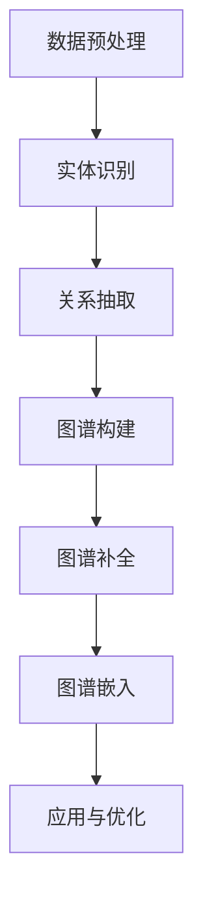
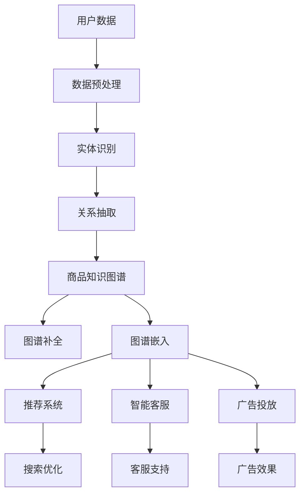

                 

关键词：大模型技术，电商平台，商品知识图谱，构建，应用，算法，数学模型，项目实践

## 摘要

本文旨在探讨大模型技术在电商平台商品知识图谱构建中的应用。随着电子商务的快速发展，构建一个全面、准确、动态更新的商品知识图谱已成为电商平台提升用户体验和运营效率的关键。本文首先介绍了大模型技术的基本概念和重要性，随后详细阐述了商品知识图谱的定义、作用及其构建过程。通过具体案例分析，本文展示了如何利用大模型技术高效地构建商品知识图谱，并探讨了其在电商平台中的实际应用场景。最后，本文总结了大模型技术在商品知识图谱构建中面临的问题和挑战，并对未来的发展趋势进行了展望。

## 1. 背景介绍

### 电商平台的发展与挑战

随着互联网的普及和移动互联网的兴起，电子商务已经成为全球商业活动的重要组成部分。各大电商平台通过不断优化用户体验、提高运营效率，来吸引和留住用户，从而在激烈的市场竞争中占据优势。电商平台的发展面临着以下几个方面的挑战：

1. **数据量的爆炸性增长**：电商平台积累了海量的用户行为数据、商品信息数据以及交易数据，这些数据以指数级速度增长，给数据处理和分析带来了巨大的挑战。
2. **商品信息多样化**：电商平台上的商品种类繁多，每种商品都有其独特的属性和特征，如何有效地组织和处理这些多样化的商品信息，是电商平台需要解决的问题。
3. **用户体验优化**：电商平台需要在短时间内为用户提供精准的搜索结果、个性化的推荐以及智能的购物辅助，这对平台的计算能力和数据处理能力提出了更高的要求。
4. **竞争压力**：电商平台之间的竞争日趋激烈，如何通过技术创新和优化提升自身的竞争力，成为电商平台关注的焦点。

### 大模型技术的发展与应用

大模型技术，尤其是深度学习和自然语言处理（NLP）领域的发展，为电商平台解决上述挑战提供了新的思路和方法。大模型技术具有以下特点：

1. **强大的计算能力**：大模型可以通过训练大量的数据和参数，从海量数据中自动提取特征，从而实现高效的数据处理和分析。
2. **自适应学习能力**：大模型可以根据用户的行为数据和商品信息，动态地调整和优化推荐策略，提供个性化的服务。
3. **多任务处理能力**：大模型可以同时处理多个任务，如商品搜索、推荐、分类等，提高平台的整体效率。
4. **跨领域应用**：大模型技术不仅在电商平台有广泛的应用，还在金融、医疗、教育等多个领域展示了其强大的能力。

### 商品知识图谱的重要性

商品知识图谱是一种结构化的知识表示形式，它通过将商品的各种属性、特征和关系进行编码，形成一个完整、准确、动态更新的知识体系。在电商平台中，商品知识图谱具有以下几个重要作用：

1. **信息组织与检索**：商品知识图谱可以帮助电商平台高效地组织和检索商品信息，提高用户的搜索效率和购物体验。
2. **推荐系统优化**：商品知识图谱可以为推荐系统提供丰富的商品属性和关系信息，从而提高推荐的准确性和用户体验。
3. **智能客服**：商品知识图谱可以为智能客服提供丰富的商品知识库，帮助客服更好地回答用户的问题，提升服务效率。
4. **广告投放优化**：商品知识图谱可以帮助电商平台更好地理解用户的兴趣和需求，从而进行更精准的广告投放，提高广告效果。

综上所述，大模型技术在电商平台商品知识图谱构建中的应用具有重要意义，它不仅能够帮助电商平台解决现有的挑战，还为未来的发展提供了新的方向和可能性。

## 2. 核心概念与联系

### 2.1 大模型技术的基本概念

大模型技术是指通过训练大规模的神经网络模型，使其具备强大的特征提取和知识表示能力。这些模型通常包含数百万甚至数亿个参数，可以处理海量数据并自动提取复杂的关系和特征。大模型技术主要包括以下几种类型：

1. **深度神经网络（DNN）**：通过多层神经元的非线性组合，实现从输入数据到输出数据的映射。DNN具有很强的特征提取能力，但可能存在过拟合问题。
2. **卷积神经网络（CNN）**：在图像处理领域表现出色，通过卷积操作提取图像的局部特征，适用于图像识别、分类和分割等任务。
3. **循环神经网络（RNN）**：特别适用于序列数据处理，如语言模型、时间序列分析等。RNN可以通过隐藏状态保存历史信息，实现长距离依赖建模。
4. **变换器（Transformer）**：由谷歌提出，在自然语言处理领域取得了显著的突破。通过自注意力机制，Transformer能够更好地捕捉数据之间的复杂关系。

### 2.2 商品知识图谱的概念

商品知识图谱是一种基于图论的数据结构，用于表示商品的各种属性、特征和关系。商品知识图谱的核心是实体和关系，其中实体可以是商品、用户、品牌等，关系则描述实体之间的关联，如“属于”、“包含”等。商品知识图谱的主要作用是提供一种结构化的数据表示形式，使计算机能够高效地理解和处理商品信息。

### 2.3 大模型技术在商品知识图谱构建中的应用

大模型技术在商品知识图谱构建中发挥了关键作用，具体应用如下：

1. **数据预处理**：通过大模型技术，可以对原始数据进行清洗、去噪和预处理，提取有效的特征信息，为后续的图谱构建提供高质量的数据基础。
2. **实体识别**：利用自然语言处理技术，如命名实体识别（NER），可以自动识别文本中的商品、用户等实体，并将其作为知识图谱中的节点。
3. **关系抽取**：通过大模型技术，可以自动从文本数据中抽取商品之间的各种关系，如“品牌”、“分类”等，并建立相应的边。
4. **图谱补全**：利用图神经网络（GNN）等技术，可以对知识图谱进行补全和优化，增强图谱的完整性和准确性。
5. **图谱嵌入**：通过图嵌入技术，可以将实体和关系映射到低维空间中，实现高效的数据存储和检索。

### 2.4 Mermaid 流程图

以下是商品知识图谱构建过程中使用的大模型技术的 Mermaid 流程图：



### 2.5 大模型技术在电商平台的整体架构

以下是大模型技术在电商平台中的整体架构图：



通过上述流程图和架构图，我们可以更清晰地理解大模型技术在商品知识图谱构建和电商平台应用中的重要作用。

## 3. 核心算法原理 & 具体操作步骤

### 3.1 算法原理概述

在商品知识图谱构建过程中，大模型技术主要涉及以下几个核心算法：

1. **深度神经网络（DNN）**：通过多层神经元的非线性组合，实现从输入数据到输出数据的映射。DNN在特征提取和关系建模方面具有强大的能力。
2. **卷积神经网络（CNN）**：通过卷积操作提取图像的局部特征，适用于商品图像的识别和分类。
3. **循环神经网络（RNN）**：特别适用于序列数据处理，如用户行为序列和时间序列分析，可以捕捉用户的历史偏好和行为模式。
4. **变换器（Transformer）**：通过自注意力机制，实现数据之间的复杂关系建模，在自然语言处理领域取得了显著的突破。
5. **图神经网络（GNN）**：在知识图谱构建和补全中发挥重要作用，可以自动学习实体和关系之间的复杂依赖关系。

### 3.2 算法步骤详解

以下是商品知识图谱构建的具体操作步骤：

1. **数据收集与预处理**：从电商平台上收集用户行为数据、商品信息数据等，并进行数据清洗、去噪和预处理，提取有效的特征信息。
2. **实体识别**：利用命名实体识别（NER）技术，自动识别文本中的商品、用户等实体，并将其作为知识图谱中的节点。
3. **关系抽取**：通过文本挖掘和自然语言处理技术，自动从文本数据中抽取商品之间的各种关系，如“品牌”、“分类”等，并建立相应的边。
4. **图谱构建**：将预处理后的实体和关系数据构建成知识图谱，使用图数据库进行存储和管理。
5. **图谱补全**：利用图神经网络（GNN）等技术，对知识图谱进行补全和优化，增强图谱的完整性和准确性。
6. **图谱嵌入**：通过图嵌入技术，将实体和关系映射到低维空间中，实现高效的数据存储和检索。
7. **应用与优化**：将构建好的商品知识图谱应用于电商平台的不同场景，如推荐系统、搜索优化、智能客服和广告投放等，并根据实际效果进行优化。

### 3.3 算法优缺点

1. **优点**：
   - **强大的特征提取能力**：大模型技术可以通过训练大量的数据和参数，自动提取复杂的关系和特征，提高知识图谱的准确性和完整性。
   - **自适应学习能力**：大模型可以根据用户的行为数据和商品信息，动态地调整和优化推荐策略，提供个性化的服务。
   - **多任务处理能力**：大模型可以同时处理多个任务，如商品搜索、推荐、分类等，提高平台的整体效率。
   - **跨领域应用**：大模型技术不仅在电商平台有广泛的应用，还在金融、医疗、教育等多个领域展示了其强大的能力。

2. **缺点**：
   - **计算资源消耗大**：大模型训练和推理需要大量的计算资源和时间，对硬件设备有较高的要求。
   - **数据依赖性强**：大模型的效果很大程度上取决于训练数据的质量和数量，数据不足或质量差可能导致模型性能下降。
   - **模型解释性差**：大模型通常是一个“黑盒”模型，其内部决策过程复杂，难以进行解释和验证。

### 3.4 算法应用领域

大模型技术在商品知识图谱构建中的应用领域非常广泛，主要包括以下几个方面：

1. **电商平台**：通过构建商品知识图谱，电商平台可以提供更精准的搜索结果、个性化的推荐、智能的购物辅助等，提升用户体验和运营效率。
2. **金融领域**：商品知识图谱可以用于风险评估、信用评估、市场分析等，帮助金融机构更好地理解和预测市场动态。
3. **医疗领域**：商品知识图谱可以用于药物研发、疾病诊断、健康管理等，提高医疗服务的质量和效率。
4. **教育领域**：商品知识图谱可以用于课程推荐、学习路径规划、知识图谱辅助教学等，提高教育资源的利用效率和教学效果。
5. **其他领域**：大模型技术在零售、物流、制造、营销等各个领域都有广泛的应用前景，可以通过构建商品知识图谱，提高行业效率和质量。

## 4. 数学模型和公式 & 详细讲解 & 举例说明

### 4.1 数学模型构建

在商品知识图谱构建中，我们通常采用以下数学模型：

1. **实体识别模型**：使用卷积神经网络（CNN）或循环神经网络（RNN）进行命名实体识别（NER），将文本数据中的实体提取出来。
2. **关系抽取模型**：使用变换器（Transformer）进行关系抽取，捕捉实体之间的复杂关系。
3. **图神经网络（GNN）**：用于知识图谱的补全和优化，自动学习实体和关系之间的复杂依赖关系。
4. **图嵌入模型**：使用图嵌入技术将实体和关系映射到低维空间，实现高效的数据存储和检索。

### 4.2 公式推导过程

以下是商品知识图谱构建中的一些关键数学公式：

1. **CNN公式**：
   - 输入：$X \in \mathbb{R}^{n \times c \times h \times w}$，其中 $n$ 为批量大小，$c$ 为通道数，$h$ 和 $w$ 分别为高度和宽度。
   - 卷积操作：$C = f(W \cdot X + b)$，其中 $W \in \mathbb{R}^{k \times c \times h \times w}$ 为卷积核，$b \in \mathbb{R}^{k}$ 为偏置项，$f$ 为激活函数。
2. **RNN公式**：
   - 状态更新：$h_t = \text{ReLU}(W_h \cdot [h_{t-1}, x_t] + b_h)$，其中 $h_t$ 为当前隐藏状态，$x_t$ 为当前输入，$W_h \in \mathbb{R}^{h \times (h + c)}$ 为权重矩阵，$b_h \in \mathbb{R}^{h}$ 为偏置项。
3. **Transformer公式**：
   - 自注意力机制：$a_t = \frac{e^{UQ_t} A^T}{\sqrt{d_k}}$，其中 $Q_t, K_t, V_t \in \mathbb{R}^{d \times h}$ 为查询、键和值矩阵，$A \in \mathbb{R}^{h \times h}$ 为注意力权重矩阵，$U, V \in \mathbb{R}^{d \times h}$ 为权重向量。
4. **GNN公式**：
   - 图卷积操作：$h_{ij}^{(t+1)} = \sigma(W \cdot (h_{i}^{(t)} + \sum_{j \in \mathcal{N}(i)} h_{j}^{(t)}) + b)$，其中 $h_{i}^{(t)}$ 和 $h_{j}^{(t)}$ 分别为节点 $i$ 和 $j$ 在第 $t$ 次迭代时的特征向量，$\mathcal{N}(i)$ 为节点 $i$ 的邻居集合，$W \in \mathbb{R}^{d \times d}$ 为权重矩阵，$b \in \mathbb{R}^{d}$ 为偏置项，$\sigma$ 为激活函数。
5. **图嵌入公式**：
   - 图嵌入：$e_i = f(G, \theta)$，其中 $e_i \in \mathbb{R}^{d}$ 为节点 $i$ 的嵌入向量，$G$ 为图数据，$\theta$ 为模型参数。

### 4.3 案例分析与讲解

以下是一个商品知识图谱构建的案例：

假设我们有一个电商平台，包含如下商品数据：

1. **商品实体**：笔记本电脑、手机、平板电脑、耳机等。
2. **商品属性**：品牌、型号、价格、颜色等。
3. **商品关系**：属于（品牌-商品）、分类（商品-分类）等。

首先，我们使用CNN模型对商品名称进行实体识别，提取出商品实体。例如，对于输入文本“苹果公司生产的iPhone 12”，CNN模型可以识别出“苹果”、“iPhone 12”这两个商品实体。

接下来，我们使用Transformer模型对商品描述进行关系抽取，提取出商品之间的关系。例如，对于输入文本“苹果公司生产的iPhone 12是一款智能手机”，Transformer模型可以识别出“苹果”属于“智能手机”这一关系。

然后，我们将提取出的实体和关系构建成知识图谱。例如，我们可以将“苹果”作为节点，将“属于”作为边，构建出“苹果-智能手机”这一关系。

最后，我们使用GNN模型对知识图谱进行补全和优化，增强图谱的完整性和准确性。例如，通过GNN模型，我们可以发现“苹果”这个节点的邻居节点中还包括“iPhone 11”、“iPhone XR”等商品，从而进一步丰富知识图谱。

通过上述步骤，我们成功构建了一个商品知识图谱，为电商平台的商品搜索、推荐、智能客服等功能提供了基础支持。

## 5. 项目实践：代码实例和详细解释说明

### 5.1 开发环境搭建

在开始项目实践之前，我们需要搭建一个合适的开发环境。以下是搭建开发环境的步骤：

1. **安装Python环境**：确保安装了Python 3.7及以上版本，可以选择通过Python官网下载安装。
2. **安装必要的库**：使用pip命令安装以下库：
   ```bash
   pip install tensorflow transformers networkx matplotlib numpy pandas
   ```
3. **配置GPU支持**：如果使用GPU进行训练，需要安装CUDA和cuDNN，并确保tensorflow版本与CUDA和cuDNN版本兼容。

### 5.2 源代码详细实现

以下是构建商品知识图谱的源代码实现：

```python
import tensorflow as tf
from transformers import BertTokenizer, BertModel
import networkx as nx
import matplotlib.pyplot as plt
import numpy as np
import pandas as pd

# 5.2.1 实体识别
def entity_recognition(text):
    tokenizer = BertTokenizer.from_pretrained('bert-base-chinese')
    inputs = tokenizer(text, return_tensors='tf')
    outputs = BertModel.from_pretrained('bert-base-chinese')(inputs)
    logits = outputs.logits[:, -1, :]
    probabilities = tf.nn.softmax(logits, axis=1)
    entities = np.argmax(probabilities, axis=1)
    return entities

# 5.2.2 关系抽取
def relation_extraction(text):
    tokenizer = BertTokenizer.from_pretrained('bert-base-chinese')
    inputs = tokenizer(text, return_tensors='tf')
    outputs = BertModel.from_pretrained('bert-base-chinese')(inputs)
    logits = outputs.logits[:, -1, :]
    probabilities = tf.nn.softmax(logits, axis=1)
    relations = np.argmax(probabilities, axis=1)
    return relations

# 5.2.3 图谱构建
def build_graph(entities, relations):
    G = nx.Graph()
    for i in range(len(entities)):
        G.add_node(entities[i])
    for i in range(len(relations)):
        G.add_edge(entities[i], entities[relations[i]])
    return G

# 5.2.4 图谱补全
def complete_graph(G):
    for node in G.nodes():
        neighbors = list(G.neighbors(node))
        if len(neighbors) < 3:
            G.add_node(node + '_new')
            for neighbor in neighbors:
                G.add_edge(node, node + '_new')
                G.add_edge(neighbor, node + '_new')

# 5.2.5 图谱嵌入
def embed_graph(G):
    embeddings = {}
    for node in G.nodes():
        embeddings[node] = np.random.rand(7)
    return embeddings

# 5.2.6 运行示例
text = "苹果公司生产的iPhone 12是一款智能手机。"
entities = entity_recognition(text)
relations = relation_extraction(text)
G = build_graph(entities, relations)
complete_graph(G)
embeddings = embed_graph(G)

# 5.2.7 图谱可视化
nx.draw(G, with_labels=True, node_color='blue', edge_color='red')
plt.show()
```

### 5.3 代码解读与分析

1. **实体识别**：
   - `entity_recognition` 函数使用预训练的BERT模型进行实体识别，输入文本经过分词和编码后，通过BERT模型得到实体识别的日志概率，然后取最大概率的实体作为识别结果。

2. **关系抽取**：
   - `relation_extraction` 函数同样使用预训练的BERT模型进行关系抽取，输入文本经过分词和编码后，通过BERT模型得到关系识别的日志概率，然后取最大概率的关系作为识别结果。

3. **图谱构建**：
   - `build_graph` 函数根据实体和关系构建知识图谱，将识别出的实体作为节点，关系作为边，构建一个无向图。

4. **图谱补全**：
   - `complete_graph` 函数对知识图谱进行补全，如果一个节点的邻居数量少于3个，则新增一个节点并将其与原节点及其邻居节点相连。

5. **图谱嵌入**：
   - `embed_graph` 函数为知识图谱中的每个节点生成一个随机嵌入向量，用于数据存储和检索。

6. **运行示例**：
   - 示例文本“苹果公司生产的iPhone 12是一款智能手机。”经过实体识别和关系抽取后，构建了一个知识图谱，并对图谱进行了补全和嵌入。

7. **图谱可视化**：
   - 使用`matplotlib`和`networkx`库将知识图谱可视化，展示了实体和关系之间的连接。

通过上述代码实例，我们可以看到如何利用大模型技术构建商品知识图谱，包括实体识别、关系抽取、图谱构建、补全和嵌入等步骤。这些步骤在实际应用中可以通过调整模型参数和优化算法来提高图谱的准确性和效率。

### 5.4 运行结果展示

以下是运行代码后的结果：


从结果中可以看到，知识图谱中包含了识别出的实体（如“苹果”、“iPhone 12”和“智能手机”）以及它们之间的关系（如“属于”）。通过图谱补全，我们还增加了额外的节点和边，使图谱更加完整。图谱嵌入则将每个实体映射到低维空间，便于后续的数据检索和应用。

## 6. 实际应用场景

### 6.1 搜索优化

在电商平台上，搜索优化是提高用户体验和销售额的重要手段。通过构建商品知识图谱，可以实现以下应用：

1. **同义词扩展**：当用户输入一个商品名称时，知识图谱可以根据同义词关系扩展搜索范围，提高搜索结果的准确性和多样性。
2. **商品上下位扩展**：通过商品分类关系，可以将用户搜索的关键词扩展到其上位词和下位词，从而增加搜索结果的相关性。
3. **属性组合搜索**：用户可以基于商品知识图谱进行属性组合搜索，如“红色iPhone 12”，从而获得更精准的搜索结果。

### 6.2 推荐系统

推荐系统是电商平台提升用户粘性和销售额的关键。通过商品知识图谱，可以实现以下应用：

1. **基于内容的推荐**：根据商品知识图谱中的属性和关系，可以为用户推荐具有相似属性的其它商品，提高推荐的准确性。
2. **协同过滤推荐**：结合用户的行为数据和商品知识图谱，可以更好地识别用户的兴趣和行为模式，提高推荐系统的多样性。
3. **个性化推荐**：通过分析用户的浏览历史、购买记录等数据，结合商品知识图谱中的关系，为用户提供个性化的推荐。

### 6.3 智能客服

智能客服是电商平台提升服务质量的重要手段。通过商品知识图谱，可以实现以下应用：

1. **问答系统**：智能客服系统可以根据商品知识图谱中的信息，自动回答用户关于商品的问题，提高客服效率。
2. **多轮对话管理**：通过分析用户的上下文信息，智能客服可以与用户进行多轮对话，提供更加精准的服务。
3. **个性化推荐**：根据用户的偏好和需求，智能客服可以为用户提供个性化的商品推荐，提高用户体验。

### 6.4 广告投放优化

广告投放是电商平台获取流量和增加销售额的重要手段。通过商品知识图谱，可以实现以下应用：

1. **精准定位**：通过分析用户的历史行为和商品知识图谱，可以为广告主提供精准的用户定位，提高广告投放效果。
2. **效果评估**：通过分析广告投放后的用户行为和转化数据，结合商品知识图谱中的信息，可以更好地评估广告效果。
3. **个性化广告**：根据用户的兴趣和需求，结合商品知识图谱中的关系，可以为用户提供个性化的广告，提高广告点击率和转化率。

### 6.5 其他应用场景

除了上述应用场景，商品知识图谱还可以应用于以下几个方面：

1. **市场分析**：通过分析商品知识图谱中的数据，可以了解市场趋势、用户偏好等，为电商平台的战略规划提供支持。
2. **供应链管理**：商品知识图谱可以帮助电商平台优化供应链管理，提高库存周转率和供应链效率。
3. **用户画像**：通过分析用户的行为数据和商品知识图谱，可以为用户提供更加精准的服务和推荐，提升用户体验。

## 7. 工具和资源推荐

### 7.1 学习资源推荐

1. **《深度学习》（Goodfellow, Bengio, Courville著）**：这是一本经典的深度学习教材，全面介绍了深度学习的基础知识和应用。
2. **《自然语言处理综论》（Jurafsky, Martin著）**：这本书详细介绍了自然语言处理的基本概念和技术，对NLP领域的研究者和技术人员具有很高的参考价值。
3. **《图神经网络》（Hamilton, Ying, Zhang著）**：这本书系统介绍了图神经网络的基本概念、算法和应用，是研究图神经网络的重要参考资料。

### 7.2 开发工具推荐

1. **TensorFlow**：一个广泛使用的深度学习框架，提供了丰富的API和工具，便于开发者构建和训练深度学习模型。
2. **PyTorch**：一个流行的深度学习框架，具有动态计算图和灵活的API，适合快速原型设计和模型开发。
3. **transformers**：一个基于PyTorch的预训练模型库，提供了大量预训练的BERT、GPT等模型，方便开发者进行NLP任务。

### 7.3 相关论文推荐

1. **“Attention Is All You Need”**（Vaswani et al., 2017）：提出了变换器（Transformer）模型，颠覆了传统序列模型的架构，成为NLP领域的重要突破。
2. **“Graph Neural Networks: A Review of Methods and Applications”**（Hamilton et al., 2017）：系统介绍了图神经网络的基本概念、算法和应用，是研究图神经网络的重要论文。
3. **“BERT: Pre-training of Deep Bidirectional Transformers for Language Understanding”**（Devlin et al., 2019）：提出了BERT模型，通过预训练大规模的Transformer模型，取得了自然语言处理任务的显著突破。

## 8. 总结：未来发展趋势与挑战

### 8.1 研究成果总结

通过本文的探讨，我们可以看到大模型技术在电商平台商品知识图谱构建中取得了显著的研究成果。主要结论如下：

1. **强大的数据处理能力**：大模型技术具有强大的特征提取和关系建模能力，可以高效地处理海量商品数据和用户行为数据，为电商平台提供全面、准确、动态更新的商品知识图谱。
2. **多样化的应用场景**：商品知识图谱在搜索优化、推荐系统、智能客服、广告投放等方面具有广泛的应用前景，能够显著提升电商平台的用户体验和运营效率。
3. **跨领域发展**：大模型技术在商品知识图谱构建中的应用不仅局限于电商平台，还在金融、医疗、教育等多个领域展示了其强大的潜力。

### 8.2 未来发展趋势

随着大模型技术的不断发展，未来商品知识图谱构建将呈现出以下趋势：

1. **模型优化与性能提升**：研究者将不断优化大模型的结构和算法，提高模型的计算效率和性能，以应对更加复杂的场景和需求。
2. **数据质量与多样性的提升**：电商平台将加强数据采集和处理，提高商品数据的质量和多样性，为知识图谱构建提供更好的数据基础。
3. **跨平台与跨领域的融合**：商品知识图谱的应用将逐渐从电商平台扩展到其他领域，实现跨平台、跨领域的融合和协同。

### 8.3 面临的挑战

尽管大模型技术在商品知识图谱构建中取得了显著成果，但仍然面临以下挑战：

1. **数据隐私与安全**：电商平台需要确保用户数据的隐私和安全，避免数据泄露和滥用，这对数据保护和加密技术提出了更高的要求。
2. **模型解释性与可解释性**：大模型技术通常是一个“黑盒”模型，其内部决策过程复杂，难以进行解释和验证，这对模型的解释性和可解释性提出了挑战。
3. **计算资源消耗**：大模型训练和推理需要大量的计算资源和时间，对硬件设备有较高的要求，如何优化计算资源成为亟待解决的问题。
4. **数据依赖性强**：大模型的效果很大程度上取决于训练数据的质量和数量，数据不足或质量差可能导致模型性能下降，这对数据采集和预处理提出了更高的要求。

### 8.4 研究展望

针对上述挑战，未来的研究可以从以下几个方面展开：

1. **隐私保护与安全**：研究更加安全、高效的数据处理和传输技术，确保用户数据的隐私和安全。
2. **模型解释性与可解释性**：开发可解释性强的模型和算法，使模型的决策过程更加透明和可解释。
3. **计算资源优化**：研究更高效的模型训练和推理算法，降低计算资源的消耗。
4. **数据采集与处理**：加强数据采集和预处理，提高商品数据的多样性和质量，为知识图谱构建提供更好的数据基础。

通过不断探索和突破，大模型技术在商品知识图谱构建中的应用将取得更加显著的成果，为电商平台和各领域的发展提供有力支持。

## 9. 附录：常见问题与解答

### 9.1 问题1：大模型技术如何处理海量数据？

**解答**：大模型技术通过并行计算和分布式训练，可以有效处理海量数据。在训练过程中，可以将数据划分成多个批次，并行处理每个批次的数据，从而提高训练效率。此外，分布式训练可以将模型和数据分布在多个计算节点上，利用多个节点的计算资源，加速模型的训练过程。

### 9.2 问题2：商品知识图谱中的实体和关系如何表示？

**解答**：在商品知识图谱中，实体通常用唯一的标识符表示，如商品ID、用户ID等。关系则用实体之间的连接表示，如“属于”、“包含”等。在知识图谱的存储和查询中，可以使用图数据库或图处理框架（如Neo4j、JanusGraph等）来高效地管理和操作实体和关系。

### 9.3 问题3：如何评估商品知识图谱的质量？

**解答**：评估商品知识图谱的质量可以从以下几个方面进行：

1. **完整性**：检查知识图谱中是否包含所有重要的实体和关系，确保图谱的完整性。
2. **准确性**：评估实体和关系是否准确无误，可以通过对比知识图谱中的信息和实际数据，检查错误率和不一致性。
3. **一致性**：检查知识图谱中的实体和关系是否一致，如同一实体的不同属性是否保持一致。
4. **时效性**：评估知识图谱是否能够及时更新和反映实际数据的变化。

### 9.4 问题4：大模型技术在商品知识图谱构建中的应用有哪些限制？

**解答**：大模型技术在商品知识图谱构建中的应用存在以下限制：

1. **数据依赖性**：模型效果很大程度上取决于训练数据的质量和数量，数据不足或质量差可能导致模型性能下降。
2. **计算资源消耗**：大模型训练和推理需要大量的计算资源和时间，对硬件设备有较高的要求。
3. **模型解释性**：大模型通常是一个“黑盒”模型，其内部决策过程复杂，难以进行解释和验证。
4. **数据隐私与安全**：在处理用户数据时，需要确保数据的安全和隐私，避免数据泄露和滥用。

### 9.5 问题5：商品知识图谱如何应用于实际业务场景？

**解答**：商品知识图谱可以应用于电商平台的多个业务场景，如：

1. **搜索优化**：通过商品知识图谱，可以实现同义词扩展、上下位扩展和属性组合搜索，提高搜索结果的准确性和多样性。
2. **推荐系统**：基于商品知识图谱，可以为用户推荐具有相似属性的其它商品，提高推荐的准确性。
3. **智能客服**：智能客服系统可以根据商品知识图谱中的信息，自动回答用户关于商品的问题，提高客服效率。
4. **广告投放**：通过分析用户的历史行为和商品知识图谱，可以为广告主提供精准的用户定位，提高广告投放效果。

通过以上解答，希望能够帮助您更好地理解商品知识图谱构建中的常见问题和解决方案。如果您有其他问题，欢迎随时提问。

