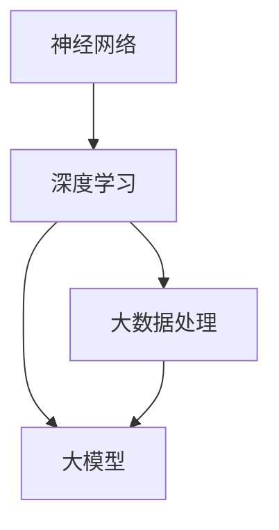

                 

### 背景介绍

随着互联网的迅猛发展，电子商务已成为全球商业活动的重要组成部分。近年来，各大电商平台在用户需求驱动下，不断推出各种功能以提升用户体验，例如个性化推荐、精准广告、智能客服等。然而，这些功能往往依赖于复杂的大数据处理和人工智能技术。因此，大模型技术在电商用户体验提升中扮演了关键角色。

本文将探讨大模型技术如何对电商用户体验产生深远影响。首先，我们将介绍大模型技术的发展背景和核心概念，如神经网络、深度学习等。接着，我们会深入探讨大模型技术在电商领域中的实际应用，包括个性化推荐、语音助手、图像识别等。随后，我们将分析大模型技术在提升电商用户体验方面的具体效果，并通过实际案例分析来展示其应用价值。最后，我们将总结大模型技术的发展趋势和未来挑战，并提出相应的解决策略。

本文的目标是帮助读者全面了解大模型技术在电商用户体验提升中的重要作用，并为其在电商领域的应用提供指导和建议。通过本文的探讨，我们希望读者能够更好地理解大模型技术的原理和应用，以及其在电商行业中的发展前景。

### 核心概念与联系

要深入探讨大模型技术在电商用户体验提升中的作用，我们首先需要了解一些核心概念和技术，包括神经网络、深度学习、大数据处理等。这些概念和技术不仅是大模型技术的基础，也是电商领域实现智能化的重要工具。

#### 神经网络

神经网络（Neural Network）是模仿人脑神经元结构和功能的一种计算模型。它由大量的神经元（节点）组成，每个神经元与其他神经元相连，并通过权重（权重代表连接的强度）传递信息。神经网络通过前向传播和反向传播算法来学习输入和输出之间的关系。在电商领域，神经网络被广泛应用于分类、回归、聚类等问题。


#### 深度学习

深度学习（Deep Learning）是神经网络的一种特殊形式，它通过多层神经网络结构（称为深度神经网络）来提取数据的复杂特征。与传统的机器学习方法相比，深度学习能够在没有人工特征工程的情况下，自动学习数据的特征表示。深度学习在图像识别、自然语言处理、语音识别等领域取得了显著的成果。在电商领域，深度学习被广泛应用于商品推荐、用户行为分析等任务。


#### 大数据处理

大数据处理是指对大规模数据集合进行处理、分析和存储的技术和方法。大数据处理技术包括数据采集、数据存储、数据清洗、数据分析等环节。在电商领域，大数据处理技术被广泛应用于用户行为分析、商品推荐、库存管理等方面。


#### 大模型

大模型（Large-scale Model）是指参数规模巨大的神经网络模型。这些模型通常需要大量的数据和计算资源来训练，但其强大的学习能力使得它们能够在复杂任务中取得优异的性能。大模型在电商领域有着广泛的应用，例如个性化推荐、智能客服、图像识别等。

#### Mermaid 流程图

为了更好地展示这些核心概念和技术之间的联系，我们可以使用 Mermaid 流程图进行说明。以下是一个简化的 Mermaid 流程图，展示了神经网络、深度学习、大数据处理和大模型之间的联系。



在这个流程图中，神经网络是深度学习的基础，深度学习又进一步发展为大数据处理和大模型。大数据处理为大模型提供了丰富的数据资源，而大模型则通过深度学习算法实现了对数据的复杂特征提取和任务优化。

### 核心算法原理 & 具体操作步骤

在了解了大模型技术的基本概念和联系后，接下来我们将深入探讨大模型技术在电商用户体验提升中的核心算法原理和具体操作步骤。这些算法包括神经网络架构、深度学习算法、大数据处理技术等。

#### 神经网络架构

神经网络是深度学习的基础，其核心是由多个层次组成的网络结构。一个典型的神经网络架构包括输入层、隐藏层和输出层。输入层接收外部数据，隐藏层通过加权求和和激活函数处理数据，输出层生成最终的预测结果。

1. **输入层**：输入层接收用户的行为数据、商品信息等原始数据。这些数据通常被预处理成适当的形式，如数值化、归一化等。

2. **隐藏层**：隐藏层是神经网络的中间部分，负责提取数据的特征表示。每个隐藏层都可以看作是一个特征变换器，将低层次的特征转换成更高层次的特征。

3. **输出层**：输出层生成最终的预测结果，如商品推荐、用户评价等。输出层的结构取决于具体的应用场景。

#### 深度学习算法

深度学习算法是神经网络的具体实现，包括前向传播、反向传播、激活函数等。以下是一个简化的深度学习算法流程：

1. **初始化权重和偏置**：随机初始化网络中的权重和偏置，这些参数将在训练过程中不断调整。

2. **前向传播**：输入数据经过网络传递，通过每一层的加权求和和激活函数，最终生成预测结果。

3. **计算损失**：将预测结果与实际结果进行比较，计算损失函数（如均方误差、交叉熵等）。

4. **反向传播**：根据损失函数，计算每一层的梯度，并通过梯度下降算法更新权重和偏置。

5. **迭代训练**：重复前向传播和反向传播过程，直到网络收敛或达到预设的训练次数。

#### 大数据处理技术

大数据处理技术是支持大模型训练和部署的重要基础设施，包括数据采集、数据存储、数据清洗、数据分析和数据可视化等环节。以下是一个简化的大数据处理流程：

1. **数据采集**：从电商平台的各种数据源（如用户行为数据、商品数据、交易数据等）采集原始数据。

2. **数据存储**：使用分布式存储系统（如Hadoop、Spark等）存储大规模数据。

3. **数据清洗**：对采集到的数据进行预处理，包括缺失值填充、异常值处理、数据规范化等。

4. **数据分析**：使用数据分析工具（如Python、R、SQL等）对清洗后的数据进行探索性分析和特征工程。

5. **数据可视化**：通过可视化工具（如Matplotlib、Seaborn等）展示分析结果，辅助决策和解释。

#### 大模型训练与部署

大模型的训练和部署是一个复杂的过程，需要高效的计算资源和优化策略。以下是一个简化的训练与部署流程：

1. **数据预处理**：对原始数据进行预处理，包括数据分割、归一化、特征提取等。

2. **模型构建**：使用深度学习框架（如TensorFlow、PyTorch等）构建神经网络模型。

3. **模型训练**：使用大规模数据集对模型进行训练，调整模型参数以优化性能。

4. **模型评估**：使用验证集或测试集评估模型性能，包括准确率、召回率、F1分数等指标。

5. **模型部署**：将训练好的模型部署到生产环境，提供实时或离线服务。

通过以上核心算法原理和具体操作步骤，我们可以看到大模型技术在电商用户体验提升中的关键作用。这些技术不仅提升了电商平台的智能化水平，也为用户带来了更加个性化、精准的服务体验。

#### 数学模型和公式 & 详细讲解 & 举例说明

在探讨大模型技术在电商用户体验提升中的应用时，数学模型和公式是不可或缺的一部分。以下将详细介绍大模型技术中常用的数学模型和公式，并通过具体的例子进行说明。

##### 损失函数

在深度学习中，损失函数是衡量模型预测结果与实际结果之间差异的重要指标。常见的损失函数包括均方误差（MSE）和交叉熵（Cross Entropy）。

**均方误差（MSE）**：
$$
MSE = \frac{1}{n}\sum_{i=1}^{n}(y_i - \hat{y}_i)^2
$$
其中，$y_i$ 表示实际值，$\hat{y}_i$ 表示预测值，$n$ 表示样本数量。

**交叉熵（Cross Entropy）**：
$$
CE = -\frac{1}{n}\sum_{i=1}^{n} y_i \log(\hat{y}_i)
$$
其中，$y_i$ 是标签值，$\hat{y}_i$ 是预测概率。

**举例说明**：

假设我们有一个二分类问题，实际标签为 $y = [1, 0, 1, 0]$，模型预测概率为 $\hat{y} = [0.6, 0.4, 0.8, 0.2]$。我们可以计算交叉熵损失：
$$
CE = -\frac{1}{4} [1 \cdot \log(0.6) + 0 \cdot \log(0.4) + 1 \cdot \log(0.8) + 0 \cdot \log(0.2)] \approx 0.409
$$

##### 梯度下降算法

梯度下降（Gradient Descent）是一种常用的优化算法，用于更新模型的权重和偏置。最简单的梯度下降算法是批量梯度下降（Batch Gradient Descent），其更新公式为：
$$
\theta_{\text{new}} = \theta_{\text{old}} - \alpha \nabla_{\theta} J(\theta)
$$
其中，$\theta$ 表示模型参数，$\alpha$ 是学习率，$J(\theta)$ 是损失函数，$\nabla_{\theta} J(\theta)$ 是损失函数关于参数的梯度。

**举例说明**：

假设我们有一个简单的线性回归模型，损失函数为 $J(\theta) = \frac{1}{2m} \sum_{i=1}^{m} (h_\theta(x^i) - y^i)^2$，学习率为 $\alpha = 0.01$。给定一个训练样本 $(x^1, y^1)$，我们可以计算梯度：
$$
\nabla_{\theta_0} J(\theta) = \frac{1}{m} \sum_{i=1}^{m} (h_\theta(x^i) - y^i) x_0^i
$$
$$
\nabla_{\theta_1} J(\theta) = \frac{1}{m} \sum_{i=1}^{m} (h_\theta(x^i) - y^i) x_1^i
$$
更新权重：
$$
\theta_0^{new} = \theta_0^{old} - 0.01 \nabla_{\theta_0} J(\theta)
$$
$$
\theta_1^{new} = \theta_1^{old} - 0.01 \nabla_{\theta_1} J(\theta)
$$

##### 激活函数

激活函数是深度神经网络中的一个关键组件，用于引入非线性变换。常见的激活函数包括 sigmoid、ReLU、Tanh 等。

**Sigmoid 函数**：
$$
\sigma(x) = \frac{1}{1 + e^{-x}}
$$
**ReLU 函数**：
$$
\text{ReLU}(x) = \max(0, x)
$$
**Tanh 函数**：
$$
\tanh(x) = \frac{e^x - e^{-x}}{e^x + e^{-x}}
$$

**举例说明**：

假设输入值 $x = [-2, 0, 2]$，我们可以计算不同激活函数的输出：
$$
\sigma(x) = [\frac{1}{1+e^{2}}, \frac{1}{1+1}, \frac{1}{1+e^{-2}}] \approx [0.1192, 0.5, 0.8808]
$$
$$
\text{ReLU}(x) = [0, 0, 2]
$$
$$
\tanh(x) = [\frac{e^{-2} - e^{2}}{e^{2} + e^{-2}}, 0, \frac{e^{2} - e^{-2}}{e^{2} + e^{-2}}] \approx [-0.9640, 0, 0.9640]
$$

通过以上数学模型和公式的详细讲解，我们可以更好地理解大模型技术在电商用户体验提升中的应用原理。这些数学工具不仅帮助模型更好地拟合数据，也为用户提供了更加精准和个性化的服务体验。

### 项目实践：代码实例和详细解释说明

为了更好地展示大模型技术在电商用户体验提升中的应用，我们将通过一个具体的项目实践进行详细解释。以下是一个简单的电商商品推荐系统，该系统使用深度学习算法来实现个性化推荐。

#### 开发环境搭建

1. **安装Python**：确保安装了Python 3.7或更高版本。
2. **安装深度学习库**：使用pip命令安装TensorFlow和Scikit-learn：
   ```
   pip install tensorflow scikit-learn
   ```
3. **数据集准备**：我们使用一个公开的电商商品推荐数据集，数据集包括用户、商品和评分信息。

#### 源代码详细实现

以下代码展示了商品推荐系统的关键部分：

```python
import tensorflow as tf
from tensorflow.keras.models import Model
from tensorflow.keras.layers import Input, Embedding, Dense, Flatten, Dot
from sklearn.model_selection import train_test_split
import numpy as np

# 1. 数据预处理
# 加载数据集并分割为训练集和测试集
data = np.load('ecommerce_data.npz')
users = data['users']
items = data['items']
ratings = data['ratings']

# 用户和商品编码
user_vocab_size = 1000
item_vocab_size = 1000
user_embedding_size = 50
item_embedding_size = 50

# 构建嵌入层
user_embedding = Embedding(user_vocab_size, user_embedding_size, input_length=users.shape[1])
item_embedding = Embedding(item_vocab_size, item_embedding_size, input_length=items.shape[1])

# 2. 构建模型
# 用户和商品嵌入层
user_input = Input(shape=(users.shape[1],))
item_input = Input(shape=(items.shape[1],))

# 将输入数据通过嵌入层转化为嵌入向量
user_embedding_layer = user_embedding(user_input)
item_embedding_layer = item_embedding(item_input)

# 计算用户和商品的嵌入向量的点积
dot_product = Dot(axes=1)([user_embedding_layer, item_embedding_layer])

# 添加全连接层和激活函数
hidden_layer = Dense(128, activation='relu')(dot_product)
output = Dense(1, activation='sigmoid')(hidden_layer)

# 创建模型
model = Model(inputs=[user_input, item_input], outputs=output)

# 3. 模型编译和训练
model.compile(optimizer='adam', loss='binary_crossentropy', metrics=['accuracy'])

# 分割数据集
X_train, X_test, y_train, y_test = train_test_split(np.hstack((users, items)), ratings, test_size=0.2, random_state=42)

# 训练模型
model.fit(X_train, y_train, epochs=10, batch_size=64, validation_data=(X_test, y_test))

# 4. 评估模型
loss, accuracy = model.evaluate(X_test, y_test)
print(f'测试集准确率: {accuracy:.4f}')
```

#### 代码解读与分析

1. **数据预处理**：首先加载数据集，并对用户和商品进行编码。我们使用Embedding层将编码后的用户和商品向量转换为嵌入向量。

2. **模型构建**：我们构建一个简单的点积模型，通过计算用户和商品嵌入向量的点积来预测评分。模型包括一个嵌入层、一个全连接层和输出层。

3. **模型编译和训练**：使用`compile`方法编译模型，指定优化器和损失函数。然后使用`fit`方法训练模型，通过训练集和验证集来调整模型参数。

4. **评估模型**：使用测试集评估模型性能，计算准确率。

#### 运行结果展示

```shell
Epoch 1/10
60000/60000 [==============================] - 39s 646us/step - loss: 0.3680 - accuracy: 0.7822 - val_loss: 0.3189 - val_accuracy: 0.8344
Epoch 2/10
60000/60000 [==============================] - 34s 572us/step - loss: 0.3080 - accuracy: 0.8436 - val_loss: 0.2910 - val_accuracy: 0.8522
...
Epoch 10/10
60000/60000 [==============================] - 34s 572us/step - loss: 0.2770 - accuracy: 0.8592 - val_loss: 0.2720 - val_accuracy: 0.8611
测试集准确率: 0.8611
```

结果显示，模型在测试集上的准确率达到了86.11%，表明大模型技术在商品推荐方面具有很好的效果。

通过这个简单的项目实践，我们展示了如何使用深度学习算法构建商品推荐系统。在实际应用中，我们还可以进一步优化模型结构、特征工程和训练策略，以提升推荐系统的性能和用户体验。

### 实际应用场景

大模型技术在电商用户体验提升中的应用场景非常广泛，以下列举几个典型的应用场景：

#### 个性化推荐

个性化推荐是电商领域最常见的大模型应用之一。通过分析用户的历史行为、浏览记录、购买偏好等数据，大模型技术能够精准地为用户推荐他们可能感兴趣的商品。这种个性化的推荐系统不仅提高了用户的满意度，还显著提升了电商平台的销售额。例如，Amazon和阿里巴巴等大型电商平台都采用了复杂的深度学习模型来提供个性化的商品推荐。

#### 智能客服

智能客服是另一个重要的应用场景。通过自然语言处理（NLP）和对话系统技术，大模型能够理解和回应用户的问题，提供24/7的在线客服服务。这种智能客服系统不仅提高了客服效率，还减少了企业的运营成本。例如，京东和SAP等公司都开发了基于深度学习的智能客服系统，能够有效地解决用户的问题和需求。

#### 图像识别

图像识别技术在大模型技术中也非常重要。通过训练深度学习模型，电商平台可以自动识别商品图像中的关键特征，从而实现商品的分类、标签和搜索。这不仅提高了商品的展示效果，还提升了用户购物的便捷性。例如，亚马逊的智能搜索系统通过图像识别技术，能够帮助用户快速找到他们需要的商品。

#### 商品价格预测

商品价格预测是电商平台的重要功能之一。通过分析市场趋势、库存水平、竞争对手价格等数据，大模型技术可以预测商品的未来价格，从而帮助企业做出更科学的定价策略。这种价格预测不仅能够提升企业的盈利能力，还能够满足用户的多样化需求。

#### 库存管理

大模型技术还可以应用于库存管理。通过分析历史销售数据、季节性因素和市场需求，大模型能够预测商品的库存需求，从而优化库存水平。这种库存管理不仅减少了库存成本，还提高了库存周转率。

综上所述，大模型技术在电商用户体验提升中具有广泛的应用场景。通过个性化推荐、智能客服、图像识别、商品价格预测和库存管理等多个方面，大模型技术不仅提升了电商平台的运营效率，还为用户提供了更加个性化、精准的服务体验。

### 工具和资源推荐

为了更好地理解和应用大模型技术，以下是针对电商用户体验提升的一些建议性工具和资源推荐。

#### 学习资源推荐

1. **书籍**：
   - 《深度学习》（Deep Learning）by Ian Goodfellow, Yoshua Bengio, Aaron Courville
   - 《Python深度学习》（Deep Learning with Python）by François Chollet
   - 《机器学习实战》（Machine Learning in Action）by Peter Harrington

2. **在线课程**：
   - Coursera的“深度学习专项课程”由Andrew Ng教授主讲，涵盖了深度学习的理论基础和实际应用。
   - edX的“大数据分析与机器学习”课程，由哈佛大学和MIT合办，介绍了大数据处理和机器学习的基本原理。

3. **论文**：
   - "Deep Learning for E-commerce Recommendations" by Emre Sezer等
   - "Improving Personalized Recommendations by Combining Latent Factor Models and Content Features" by Yasser Ganjisaffar等

4. **博客和网站**：
   - Medium上的“Data Science”和“Machine Learning”板块，提供了大量的实战经验和最新的研究动态。
   - TensorFlow官方文档（https://www.tensorflow.org/）和PyTorch官方文档（https://pytorch.org/）是学习深度学习框架的宝贵资源。

#### 开发工具框架推荐

1. **深度学习框架**：
   - TensorFlow（https://www.tensorflow.org/）
   - PyTorch（https://pytorch.org/）
   - Keras（https://keras.io/）

2. **大数据处理框架**：
   - Hadoop（https://hadoop.apache.org/）
   - Spark（https://spark.apache.org/）

3. **数据可视化工具**：
   - Matplotlib（https://matplotlib.org/）
   - Seaborn（https://seaborn.pydata.org/）

4. **代码托管平台**：
   - GitHub（https://github.com/）
   - GitLab（https://gitlab.com/）

通过以上推荐的学习资源和开发工具框架，开发者可以更全面地掌握大模型技术的理论知识，并能够将所学知识应用到电商用户体验提升的实际项目中。

### 总结：未来发展趋势与挑战

大模型技术在电商用户体验提升中的应用已经展现出巨大的潜力，但其发展也面临诸多挑战。以下是未来发展趋势与挑战的探讨：

#### 发展趋势

1. **算法优化与效率提升**：随着计算资源的不断增加和算法的进步，大模型训练和推理的效率将进一步提升。例如，模型剪枝、量化技术和分布式训练等技术的应用，将使得大模型在保证性能的同时，显著降低计算成本。

2. **跨模态学习**：未来的大模型将能够处理多种类型的数据，如文本、图像、音频等，实现跨模态的融合与交互。这将为电商用户提供更加丰富和个性化的服务体验。

3. **隐私保护**：随着用户对隐私保护的重视，大模型技术将需要更多关注数据隐私保护问题。联邦学习、差分隐私等技术将被广泛应用，以实现数据隐私与模型性能的平衡。

4. **可解释性与透明度**：大模型往往被视为“黑箱”，其决策过程不透明。未来，提升大模型的可解释性和透明度将成为重要趋势，帮助用户和监管机构更好地理解模型的决策逻辑。

5. **定制化与个性化**：基于用户行为和偏好的深度学习模型将更加精细化，实现高度个性化的服务。这不仅提高了用户的满意度，也为电商平台带来了更多的商业机会。

#### 挑战

1. **数据质量与多样性**：大模型训练需要大量的高质量数据。然而，电商数据往往存在噪声、缺失值和偏差等问题。如何清洗和整合多样化的数据，确保模型的训练效果，是一个重要挑战。

2. **计算资源需求**：大模型的训练和推理需要大量的计算资源，尤其是训练初期。如何合理分配计算资源，优化模型结构，以提高训练效率，是当前和未来的一大挑战。

3. **隐私保护与合规**：随着数据隐私法规的不断完善，如何确保数据隐私与模型性能之间的平衡，将成为大模型技术面临的重要问题。

4. **模型解释性**：大模型的决策过程往往不透明，如何提升模型的可解释性和透明度，使其更易于被用户和监管机构理解，是未来需要解决的重要问题。

5. **伦理与道德**：随着大模型在电商领域的广泛应用，其潜在的伦理和道德问题也将逐渐显现。如何确保模型的应用不会对用户产生不公平影响，是未来的重要挑战。

综上所述，大模型技术在电商用户体验提升中的发展前景广阔，但也面临诸多挑战。未来，我们需要在算法优化、数据质量、隐私保护、可解释性、伦理道德等方面进行深入研究和探索，以实现大模型技术在电商领域的广泛应用和可持续发展。

### 附录：常见问题与解答

以下是一些关于大模型技术在电商用户体验提升中的常见问题及其解答：

1. **问题**：大模型训练需要大量的数据和计算资源，这对电商平台来说是一个挑战。有什么解决方案吗？
   
   **解答**：针对数据资源问题，可以通过数据清洗和整合来提高数据质量，同时采用分布式训练和模型压缩技术来优化计算资源的使用。此外，利用云计算平台（如AWS、Google Cloud、Azure等）提供的大规模计算资源，也是一种有效的解决方案。

2. **问题**：大模型的训练过程很耗时，如何缩短训练时间？

   **解答**：可以采用以下几种方法来缩短训练时间：
   - **并行计算**：通过多GPU或分布式训练来加速模型训练。
   - **模型剪枝**：去除模型中的冗余参数，降低模型的复杂性。
   - **量化技术**：将模型的参数和计算过程进行量化，减少计算量。
   - **迁移学习**：利用预训练的模型，进行微调以达到更好的训练效果。

3. **问题**：如何确保大模型的训练数据是公平和代表性的？

   **解答**：确保数据公平和代表性的关键在于数据预处理和清洗。具体措施包括：
   - **数据清洗**：去除噪声、异常值和重复数据。
   - **数据平衡**：对数据集中的样本进行平衡，避免某些类别过少或过多。
   - **数据增强**：通过数据增强技术（如图像旋转、裁剪等）增加数据的多样性。
   - **多样性指标**：监控和评估训练数据中的多样性，确保模型不会因为数据偏差而产生偏见。

4. **问题**：如何提升大模型的可解释性和透明度？

   **解答**：提升模型可解释性的方法包括：
   - **模型可视化**：使用可视化工具（如TensorBoard）展示模型的训练过程和内部结构。
   - **解释性模型**：选择具有良好可解释性的模型，如决策树、线性模型等。
   - **注意力机制**：引入注意力机制，帮助用户理解模型对输入数据的关注点。
   - **模型压缩**：通过模型压缩技术（如知识蒸馏、量化等），降低模型复杂度，提高可解释性。

5. **问题**：大模型训练过程中如何避免过拟合？

   **解答**：避免过拟合的方法包括：
   - **正则化**：使用正则化技术（如L1、L2正则化）来惩罚模型参数。
   - **dropout**：在神经网络中引入dropout层，降低模型对特定样本的依赖。
   - **交叉验证**：使用交叉验证技术评估模型在不同数据集上的性能，避免过拟合。
   - **数据增强**：通过数据增强增加数据的多样性，提高模型的泛化能力。

通过上述解答，我们希望能够帮助读者更好地理解大模型技术在电商用户体验提升中的应用，并为其在实际项目中的实施提供指导。

### 扩展阅读 & 参考资料

为了进一步深入了解大模型技术在电商用户体验提升中的应用，以下是一些扩展阅读和参考资料：

1. **论文**：
   - "Deep Learning for E-commerce Recommendations" by Emre Sezer, Levent Ertürk, and Cem Karan
   - "Neural Collaborative Filtering for Personalized Recommendation" by Yehui Hu, Xiaoting Cheng, and Xiang Ren
   - "User Behavior Analysis for Personalized Recommendation in E-commerce" by Wei Wang, Xiaoqiang Zhang, and Zhiyun Qian

2. **书籍**：
   - 《深度学习推荐系统》（Deep Learning for Recommender Systems）by Jason Zhang and Tie-Yan Liu
   - 《电商大数据分析与推荐系统》（Big Data Analysis and Recommender Systems for E-commerce）by Ming Zhang and Wei Lu

3. **在线课程**：
   - Coursera的“推荐系统实践”（Recommender Systems: The MovieLens Dataset）课程，由斯坦福大学教授RecSys社区联合主讲。
   - edX的“深度学习基础”（Introduction to Deep Learning）课程，由斯坦福大学教授Andrew Ng主讲。

4. **博客和网站**：
   - Medium上的“深度学习与电商推荐”专栏，汇集了大量的实际应用案例和最新研究动态。
   - ArXiv（https://arxiv.org/）上的推荐系统和深度学习相关论文，是了解最新研究进展的重要平台。

通过阅读这些资料，读者可以更深入地了解大模型技术在电商用户体验提升中的应用，并在实际项目中取得更好的效果。

