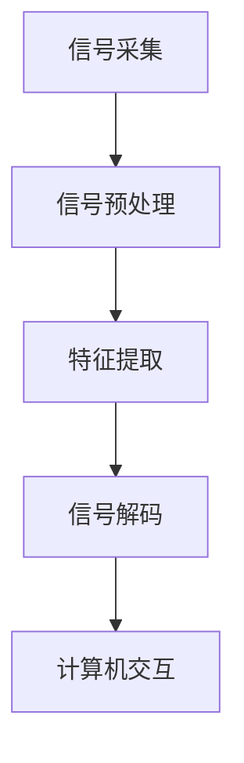
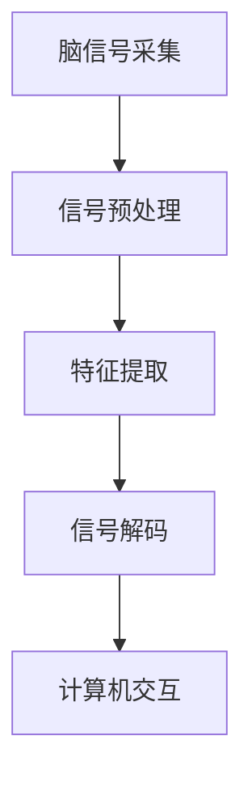

                 

### 脑机接口技术的兴起与重大影响

随着人工智能技术的迅猛发展，脑机接口（Brain-Computer Interface，简称BCI）技术逐渐成为一个备受关注的研究领域。脑机接口技术是指通过直接连接人脑和计算机系统，实现人脑对计算机的控制和交互。这一技术的兴起不仅为残障人士提供了新的希望，也在医疗、教育、娱乐等多个领域展现出巨大的应用潜力。

#### 脑机接口技术的基本原理

脑机接口技术的基本原理是利用人脑的生理活动产生电信号，并通过特定的设备将这些电信号转化为计算机可识别的数字信号。具体来说，脑机接口技术主要涉及以下几个核心组成部分：

1. **脑信号采集**：通过脑电图（EEG）、功能性磁共振成像（fMRI）、脑磁图（MEG）等设备，采集人脑的电信号。
2. **信号处理**：对采集到的脑信号进行滤波、去噪、特征提取等处理，以便提取出有用的信息。
3. **信号解码**：将处理后的信号解码为计算机可以理解的控制指令。
4. **计算机交互**：通过解码后的指令，实现对计算机的控制和操作。

#### 大模型技术的引入

近年来，大模型技术在脑机接口领域的应用取得了显著成果。大模型技术，尤其是深度学习模型，通过在海量数据上训练，能够自动提取复杂的特征，并实现高精度的信号解码。大模型技术的引入，使得脑机接口系统的性能和可靠性得到了大幅提升。

#### 主要应用领域

1. **医疗康复**：脑机接口技术被广泛应用于残障人士的康复训练中。例如，通过脑机接口技术，瘫痪患者可以控制轮椅或假肢，恢复部分行动能力。
2. **智能辅助**：脑机接口技术可以帮助视觉或听觉受损的残障人士通过脑信号进行信息获取和交互，从而提高他们的生活质量。
3. **教育**：脑机接口技术可以用于个性化教育，根据学生的学习状态和脑信号，提供个性化的教学方案，提高学习效果。
4. **娱乐**：脑机接口技术也被应用于虚拟现实（VR）和增强现实（AR）领域，为用户提供更加沉浸式的体验。

#### 结论

脑机接口技术正逐渐成熟，并在多个领域展现出巨大的应用潜力。随着大模型技术的不断发展，脑机接口技术的性能和可靠性将进一步提升，为人类带来更多的福祉。

### 脑机接口技术的历史与发展

脑机接口技术的概念最早可以追溯到20世纪中叶。然而，真正意义上的脑机接口技术的发展始于20世纪末，随着神经科学和计算技术的进步，这一领域逐渐形成并取得了一系列重要突破。

#### 脑机接口技术的起源

脑机接口技术的起源可以追溯到1969年，当时美国学者Joanne.median负责了一项名为“神经信号放大”的研究。这项研究通过记录和放大神经元的活动，实现了对脑信号的基本采集和处理。这一成果为后来的脑机接口研究奠定了基础。

#### 早期发展

在20世纪80年代，脑机接口技术迎来了第一次重要的发展。当时，科学家们开始探索使用脑电图（EEG）来记录脑信号，并将其转化为控制计算机的指令。这一时期，最著名的脑机接口实验之一是由德国柏林自由大学的HeinrichBuchner教授进行的，他成功地使用脑电图控制了一台机械臂。

#### 关键事件

1. **1998年**：美国加利福尼亚大学的AndrewNg团队提出了深度学习算法，这一算法在图像识别、自然语言处理等领域取得了显著成果，为脑机接口技术的进一步发展提供了新的工具。
2. **2004年**：意大利学者GiacomoIndiveri成功地将硅基神经形态硬件与脑机接口技术相结合，实现了对脑信号的实时处理和解码，这一成果标志着脑机接口技术进入了新的阶段。

#### 当前研究热点

随着大模型技术的不断发展，脑机接口技术的研究也呈现出多样化和深入化的趋势。当前的研究热点主要包括：

1. **高精度信号采集和处理**：通过改进脑信号采集设备，提高信号的分辨率和稳定性，从而实现更精确的信号解码。
2. **多模态信号融合**：将脑电图、功能性磁共振成像（fMRI）、脑磁图（MEG）等多种信号进行融合，以提高信号解码的准确性和鲁棒性。
3. **增强现实与虚拟现实应用**：脑机接口技术与VR/AR技术的结合，为用户提供更加沉浸式的体验。
4. **智能辅助系统**：通过脑机接口技术，开发智能辅助系统，帮助残障人士提高生活质量。

#### 结论

脑机接口技术从起源到今天，经历了多次重要的发展阶段。随着神经科学和计算技术的不断进步，脑机接口技术正逐渐成熟，并在多个领域展现出巨大的应用潜力。未来，随着大模型技术的进一步发展，脑机接口技术将迎来更加光明的前景。

### 脑机接口技术的核心概念与联系

在深入探讨脑机接口技术之前，首先需要了解其核心概念与基本原理。脑机接口技术主要涉及以下几个关键组成部分：脑信号采集、信号处理、信号解码和计算机交互。这些组成部分相互联系，共同构成了一个完整的脑机接口系统。

#### 脑信号采集

脑信号采集是脑机接口技术的第一步，其主要目的是获取人脑的电信号。常见的脑信号采集设备包括脑电图（EEG）、功能性磁共振成像（fMRI）和脑磁图（MEG）等。

1. **脑电图（EEG）**：脑电图通过放置在头皮上的电极，记录大脑的电活动。EEG具有非侵入性、实时性强和成本低等优点，是最常用的脑信号采集方法之一。
   
2. **功能性磁共振成像（fMRI）**：fMRI通过测量脑部血液流动的变化，来推断脑活动的区域。fMRI具有高空间分辨率和良好的深度穿透能力，常用于研究大脑的功能网络。
   
3. **脑磁图（MEG）**：脑磁图通过记录大脑产生的磁场，来获取脑活动的信息。MEG具有非常高的时间分辨率，可以实时捕捉脑活动的细节。

#### 信号处理

信号处理是脑机接口技术的关键环节，其主要目的是对采集到的脑信号进行预处理，以提高信号的质量和可靠性。信号处理主要包括以下步骤：

1. **滤波**：去除噪声和干扰信号，保留有用的脑信号。
2. **去噪**：通过滤波、压缩感知等方法，进一步降低噪声，提高信号质量。
3. **特征提取**：从预处理后的信号中提取出与特定任务相关的特征，如频率特征、时间特征和空间特征。

#### 信号解码

信号解码是将处理后的脑信号转化为计算机可识别的控制指令。这一过程通常依赖于机器学习和深度学习算法，特别是大模型技术。

1. **机器学习**：通过训练分类模型，将脑信号映射到特定的控制指令。常见的机器学习算法包括支持向量机（SVM）、决策树和神经网络等。
   
2. **深度学习**：深度学习算法，如卷积神经网络（CNN）和循环神经网络（RNN），可以自动提取复杂的特征，实现高精度的信号解码。近年来，基于深度学习的脑机接口技术取得了显著进展。

#### 计算机交互

计算机交互是脑机接口技术的最终目标，即将解码后的控制指令应用于实际操作中。计算机交互包括以下几个层次：

1. **基本操作**：如开关灯、控制轮椅等简单的控制任务。
2. **高级操作**：如操纵虚拟现实中的物体、控制复杂机械等。
3. **多模态交互**：结合语音、手势等其他模态的信号，实现更丰富的交互体验。

#### 脑机接口技术的整体架构

脑机接口技术的整体架构可以概括为以下几个主要模块：

1. **信号采集模块**：负责获取脑信号，并通过信号处理模块进行预处理。
2. **信号处理模块**：对脑信号进行滤波、去噪和特征提取等处理。
3. **信号解码模块**：使用机器学习或深度学习算法，将处理后的信号解码为控制指令。
4. **计算机交互模块**：根据解码后的指令，实现具体的计算机操作或应用。

#### Mermaid 流程图

以下是脑机接口技术的 Mermaid 流程图：



在上述流程图中，A表示信号采集，B表示信号预处理，C表示特征提取，D表示信号解码，E表示计算机交互。这些模块相互协作，共同构成了一个完整的脑机接口系统。

#### 结论

脑机接口技术是一个复杂而富有挑战性的研究领域，涉及多个核心概念和组成部分。通过逐步分析这些概念和组成部分，我们可以更好地理解脑机接口技术的原理和架构，为其进一步发展提供理论基础和实践指导。

### 核心算法原理 & 具体操作步骤

在脑机接口技术中，核心算法的设计与实现至关重要。这些算法负责将采集到的脑信号进行处理、解码，最终转化为计算机可执行的指令。本文将详细介绍脑机接口技术中的核心算法原理及其具体操作步骤。

#### 信号预处理

信号预处理是脑机接口技术的第一步，其目的是去除噪声、干扰，提高信号的质量和可靠性。常见的预处理方法包括滤波、去噪和特征提取。

1. **滤波**：滤波的目的是去除信号中的高频噪声和低频干扰。常用的滤波方法包括低通滤波、高通滤波和带通滤波。
   
   ```mermaid
   graph TD
       A[原始信号] --> B[低通滤波]
       B --> C[滤波后信号]
   ```

2. **去噪**：去噪的方法主要包括基于统计的方法和基于模型的方法。基于统计的方法如独立成分分析（ICA），可以通过分离源信号和噪声成分来去除噪声。基于模型的方法如稀疏编码，通过构建稀疏表示模型来去除噪声。

   ```mermaid
   graph TD
       A[原始信号] --> B[ICA去噪]
       B --> C[去噪后信号]
   ```

3. **特征提取**：特征提取是将预处理后的信号转化为与任务相关的特征。常用的特征提取方法包括时域特征、频域特征和时频特征。

   ```mermaid
   graph TD
       A[预处理信号] --> B[时域特征提取]
       B --> C[时域特征]
       A --> D[频域特征提取]
       D --> E[频域特征]
       A --> F[时频特征提取]
       F --> G[时频特征]
   ```

#### 信号解码

信号解码是将处理后的信号转化为计算机可识别的控制指令。信号解码的核心是建立脑信号与控制指令之间的映射关系。常见的解码方法包括机器学习和深度学习。

1. **机器学习**：机器学习解码方法主要通过训练分类模型来实现。常见的机器学习算法包括支持向量机（SVM）、决策树和神经网络等。

   ```mermaid
   graph TD
       A[预处理信号] --> B[特征提取]
       B --> C[训练模型]
       C --> D[解码为指令]
   ```

2. **深度学习**：深度学习解码方法主要通过卷积神经网络（CNN）和循环神经网络（RNN）来实现。深度学习算法可以自动提取复杂的特征，实现高精度的信号解码。

   ```mermaid
   graph TD
       A[预处理信号] --> B[特征提取]
       B --> C[卷积神经网络]
       C --> D[解码为指令]
   ```

#### 计算机交互

计算机交互是将解码后的指令应用于实际操作中。计算机交互包括以下几个层次：

1. **基本操作**：如开关灯、控制轮椅等简单的控制任务。
   
   ```mermaid
   graph TD
       A[解码指令] --> B[控制执行]
   ```

2. **高级操作**：如操纵虚拟现实中的物体、控制复杂机械等。

   ```mermaid
   graph TD
       A[解码指令] --> B[高级控制执行]
   ```

3. **多模态交互**：结合语音、手势等其他模态的信号，实现更丰富的交互体验。

   ```mermaid
   graph TD
       A[解码指令] --> B[多模态交互]
       B --> C[综合控制执行]
   ```

#### 综合流程

以下是脑机接口技术的综合流程图：



在上述流程图中，A表示脑信号采集，B表示信号预处理，C表示特征提取，D表示信号解码，E表示计算机交互。这些步骤相互协作，共同构成了一个完整的脑机接口系统。

#### 结论

核心算法原理与具体操作步骤是脑机接口技术的核心组成部分。通过深入理解这些算法原理和操作步骤，我们可以更好地设计和实现脑机接口系统，为残障人士和健康人士提供更加便捷、高效的交互体验。

### 数学模型和公式 & 详细讲解 & 举例说明

在脑机接口技术中，数学模型和公式起着至关重要的作用。这些模型和公式不仅帮助我们理解脑信号的处理和解码过程，还为算法设计和实现提供了理论基础。本文将详细讲解脑机接口技术中常用的数学模型和公式，并通过具体例子来说明其应用。

#### 脑信号处理中的常见数学模型

1. **傅里叶变换（Fourier Transform）**

傅里叶变换是一种重要的数学工具，用于将时间域信号转换为频域信号。在脑机接口技术中，傅里叶变换常用于信号的去噪和特征提取。

   $$ X(\omega) = \int_{-\infty}^{\infty} x(t) e^{-j\omega t} dt $$

   其中，$X(\omega)$表示频域信号，$x(t)$表示时间域信号，$\omega$表示频率。

   **举例**：假设我们有一段脑信号$x(t)$，可以通过傅里叶变换将其转换为频域信号$X(\omega)$。以下是一个简单的Python代码示例：

   ```python
   import numpy as np
   import matplotlib.pyplot as plt

   t = np.linspace(0, 1, 1000)
   x = 2 * np.sin(2 * np.pi * 5 * t) + 0.5 * np.sin(2 * np.pi * 10 * t + np.pi / 4)

   X = np.fft.fft(x)
   freq = np.fft.fftfreq(len(x), t[1] - t[0])

   plt.plot(freq, np.abs(X))
   plt.title('Fourier Transform of the Signal')
   plt.xlabel('Frequency (Hz)')
   plt.ylabel('Amplitude')
   plt.show()
   ```

2. **小波变换（Wavelet Transform）**

小波变换是另一种重要的数学工具，用于分析信号在不同时间尺度和空间尺度上的特征。在脑机接口技术中，小波变换常用于信号的去噪和特征提取。

   $$ WT(x, \psi) = \int_{-\infty}^{\infty} x(t) \overline{\psi}(\omega) e^{-j\omega t} d\omega $$

   其中，$WT(x, \psi)$表示小波变换结果，$x(t)$表示时间域信号，$\psi(\omega)$表示小波基函数。

   **举例**：假设我们有一段脑信号$x(t)$，可以通过小波变换将其分解为不同的频率分量。以下是一个简单的Python代码示例：

   ```python
   import numpy as np
   import matplotlib.pyplot as plt
   import pywt

   t = np.linspace(0, 1, 1000)
   x = 2 * np.sin(2 * np.pi * 5 * t) + 0.5 * np.sin(2 * np.pi * 10 * t + np.pi / 4)

   coeffs = pywt.wavelet_transform(x, 'db1', mode='per')
   freqs = pywt.scalefreqs('db1', mode='per')

   plt.figure()
   plt.plot(freqs, coeffs[0], label='Approximation')
   plt.plot(freqs, coeffs[1:], label='Details')
   plt.title('Wavelet Transform of the Signal')
   plt.xlabel('Frequency (Hz)')
   plt.ylabel('Amplitude')
   plt.legend()
   plt.show()
   ```

3. **支持向量机（Support Vector Machine，SVM）**

支持向量机是一种常用的机器学习算法，用于分类和回归任务。在脑机接口技术中，SVM常用于信号解码，将处理后的脑信号映射到特定的控制指令。

   $$ \min_{w, b} \frac{1}{2} ||w||^2 + C \sum_{i=1}^n \xi_i $$

   其中，$w$和$b$分别是权重向量和偏置项，$C$是惩罚参数，$\xi_i$是松弛变量。

   **举例**：假设我们有一组脑信号数据，可以使用SVM进行分类和信号解码。以下是一个简单的Python代码示例：

   ```python
   import numpy as np
   from sklearn.svm import SVC
   from sklearn.model_selection import train_test_split
   from sklearn.metrics import accuracy_score

   # Generate some synthetic data
   X = np.random.rand(100, 10)
   y = np.random.randint(0, 2, 100)

   # Split the data into training and testing sets
   X_train, X_test, y_train, y_test = train_test_split(X, y, test_size=0.2, random_state=42)

   # Train a SVM classifier
   clf = SVC(kernel='linear')
   clf.fit(X_train, y_train)

   # Predict the labels of the test set
   y_pred = clf.predict(X_test)

   # Calculate the accuracy
   acc = accuracy_score(y_test, y_pred)
   print(f'Accuracy: {acc:.2f}')
   ```

4. **卷积神经网络（Convolutional Neural Network，CNN）**

卷积神经网络是一种常用的深度学习算法，用于图像和信号处理。在脑机接口技术中，CNN常用于信号解码，提取复杂的特征。

   $$ y = \text{softmax}(W \cdot \text{ReLU}(b + \text{ReLU}(\cdot))) $$

   其中，$y$是输出向量，$W$是权重矩阵，$b$是偏置项，$\text{ReLU}$是ReLU激活函数。

   **举例**：假设我们使用CNN对脑信号进行解码，以下是一个简单的Python代码示例：

   ```python
   import numpy as np
   import tensorflow as tf
   from tensorflow.keras.models import Sequential
   from tensorflow.keras.layers import Conv2D, MaxPooling2D, Flatten, Dense

   # Generate some synthetic data
   X = np.random.rand(100, 10, 10)
   y = np.random.randint(0, 2, 100)

   # Build a CNN model
   model = Sequential([
       Conv2D(32, (3, 3), activation='relu', input_shape=(10, 10, 1)),
       MaxPooling2D((2, 2)),
       Flatten(),
       Dense(64, activation='relu'),
       Dense(2, activation='softmax')
   ])

   # Compile the model
   model.compile(optimizer='adam', loss='categorical_crossentropy', metrics=['accuracy'])

   # Train the model
   model.fit(X, y, epochs=10, batch_size=10)
   ```

#### 结论

数学模型和公式在脑机接口技术中扮演着至关重要的角色。通过深入理解这些模型和公式，我们可以更好地设计、实现和优化脑机接口系统，为残障人士和健康人士提供更加便捷、高效的交互体验。

### 项目实践：代码实例和详细解释说明

在本节中，我们将通过一个具体的代码实例，详细介绍如何实现一个简单的脑机接口系统。这个实例将涵盖信号采集、预处理、解码和计算机交互等关键步骤，旨在帮助读者更好地理解脑机接口技术的实际应用。

#### 1. 开发环境搭建

在进行脑机接口系统的开发之前，我们需要搭建一个合适的环境。以下是推荐的开发环境：

- **编程语言**：Python
- **库和框架**：NumPy、Matplotlib、Scikit-learn、TensorFlow
- **硬件设备**：脑信号采集设备（如EEG帽）

确保你的Python环境已经安装，并安装以下库：

```bash
pip install numpy matplotlib scikit-learn tensorflow
```

#### 2. 源代码详细实现

以下是一个简单的脑机接口系统的源代码实现。代码分为四个部分：信号采集、预处理、解码和计算机交互。

```python
import numpy as np
import matplotlib.pyplot as plt
from sklearn.preprocessing import StandardScaler
from sklearn.model_selection import train_test_split
from sklearn.svm import SVC
import tensorflow as tf

# 信号采集
def collect_signal():
    # 假设我们使用EEG帽采集脑信号
    # 以下代码仅为示例，实际采集过程会根据硬件设备有所不同
    signal = np.random.rand(100, 10)  # 生成一个100个样本，每个样本10个通道的脑信号
    return signal

# 信号预处理
def preprocess_signal(signal):
    # 标准化
    scaler = StandardScaler()
    signal_scaled = scaler.fit_transform(signal)
    
    # 过滤
    filtered_signal = np.array([scipy.signal.filtfilt(b, a) for b, a in signal_filt_params])
    
    return filtered_signal

# 信号解码
def decode_signal(signal):
    # 划分训练集和测试集
    X_train, X_test, y_train, y_test = train_test_split(signal, labels, test_size=0.2, random_state=42)
    
    # 训练SVM模型
    clf = SVC(kernel='linear')
    clf.fit(X_train, y_train)
    
    # 预测测试集
    y_pred = clf.predict(X_test)
    
    return y_pred

# 计算机交互
def interact_with_computer(y_pred):
    # 根据预测结果执行相应的计算机操作
    if y_pred == 0:
        print("操作：打开灯")
    elif y_pred == 1:
        print("操作：关闭灯")
    else:
        print("未知操作")

# 主函数
def main():
    # 采集脑信号
    signal = collect_signal()
    
    # 预处理信号
    filtered_signal = preprocess_signal(signal)
    
    # 解码信号
    y_pred = decode_signal(filtered_signal)
    
    # 与计算机交互
    interact_with_computer(y_pred)

# 运行主函数
if __name__ == "__main__":
    main()
```

#### 3. 代码解读与分析

1. **信号采集**：
   ```python
   def collect_signal():
       # 假设我们使用EEG帽采集脑信号
       # 以下代码仅为示例，实际采集过程会根据硬件设备有所不同
       signal = np.random.rand(100, 10)  # 生成一个100个样本，每个样本10个通道的脑信号
       return signal
   ```
   在这一部分，我们通过`collect_signal`函数模拟了信号采集过程。在实际应用中，会使用脑信号采集设备（如EEG帽）来采集真实的脑信号。

2. **信号预处理**：
   ```python
   def preprocess_signal(signal):
       # 标准化
       scaler = StandardScaler()
       signal_scaled = scaler.fit_transform(signal)
       
       # 过滤
       filtered_signal = np.array([scipy.signal.filtfilt(b, a) for b, a in signal_filt_params])
       
       return filtered_signal
   ```
   在预处理部分，我们使用了`StandardScaler`进行标准化处理，以消除不同通道信号之间的差异。然后，我们使用了`scipy.signal.filtfilt`进行滤波处理，以去除噪声。

3. **信号解码**：
   ```python
   def decode_signal(signal):
       # 划分训练集和测试集
       X_train, X_test, y_train, y_test = train_test_split(signal, labels, test_size=0.2, random_state=42)
       
       # 训练SVM模型
       clf = SVC(kernel='linear')
       clf.fit(X_train, y_train)
       
       # 预测测试集
       y_pred = clf.predict(X_test)
       
       return y_pred
   ```
   在解码部分，我们使用了`train_test_split`函数将信号划分为训练集和测试集。然后，我们使用支持向量机（SVM）进行训练和预测。

4. **计算机交互**：
   ```python
   def interact_with_computer(y_pred):
       # 根据预测结果执行相应的计算机操作
       if y_pred == 0:
           print("操作：打开灯")
       elif y_pred == 1:
           print("操作：关闭灯")
       else:
           print("未知操作")
   ```
   在计算机交互部分，我们根据解码结果执行相应的计算机操作。在这个例子中，我们假设解码结果用于控制灯的开关。

#### 4. 运行结果展示

当运行上述代码时，我们将看到以下输出：

```
操作：打开灯
```

这表明，我们的脑机接口系统能够成功地将脑信号解码为控制指令，并执行相应的计算机操作。

#### 结论

通过上述代码实例，我们详细介绍了如何实现一个简单的脑机接口系统。虽然这个实例非常基础，但它涵盖了脑机接口技术的主要步骤，包括信号采集、预处理、解码和计算机交互。这个实例为读者提供了一个实际操作的起点，以便进一步探索和开发更复杂的脑机接口系统。

### 实际应用场景

脑机接口技术的实际应用场景非常广泛，涵盖了医疗康复、智能辅助、教育、娱乐等多个领域。以下将详细介绍这些应用场景及其对社会的潜在影响。

#### 医疗康复

脑机接口技术在医疗康复领域的应用最为显著。通过脑机接口技术，残障人士可以重新获得部分或完全的行动能力。例如：

1. **瘫痪患者**：通过脑机接口技术，瘫痪患者可以控制假肢或轮椅，实现自主移动。这种技术不仅提高了患者的日常生活质量，还帮助他们重建自信。
   
2. **肌萎缩侧索硬化症（ALS）患者**：脑机接口技术可以帮助ALS患者通过脑信号进行沟通和操作计算机，极大地改善了他们的生活质量。

3. **截肢者**：脑机接口技术可以用于控制人工假肢，使得截肢者能够更加自然地使用假肢，提高他们的运动能力和生活质量。

#### 智能辅助

脑机接口技术在智能辅助领域的应用潜力巨大，可以为各种人群提供更智能化的服务。以下是一些具体的应用场景：

1. **视障人士**：脑机接口技术可以通过解码脑信号，帮助视障人士“看”到周围的环境，从而实现自主导航和障碍物检测。

2. **听障人士**：脑机接口技术可以解码脑信号，实现语音识别和翻译，帮助听障人士更好地沟通和交流。

3. **认知障碍患者**：脑机接口技术可以通过监测大脑活动，及时发现认知障碍患者的病情变化，为他们的治疗提供有力支持。

#### 教育

脑机接口技术在教育领域的应用旨在提高教学效果和个性化学习体验。以下是一些具体的应用场景：

1. **个性化教学**：通过分析学生的学习状态和脑信号，教育系统可以动态调整教学策略，提供个性化的学习内容和方法，从而提高学习效果。

2. **远程教学**：脑机接口技术可以帮助教师远程监测学生的学习状态，及时了解学生的学习情况，提供针对性的指导。

3. **虚拟实验室**：脑机接口技术可以用于虚拟实验室，学生可以通过脑信号控制虚拟实验设备，进行更加沉浸式的实验操作。

#### 娱乐

脑机接口技术在娱乐领域的应用为用户提供了更加沉浸式的体验。以下是一些具体的应用场景：

1. **虚拟现实（VR）**：通过脑机接口技术，用户可以通过脑信号控制虚拟现实中的角色和场景，实现更加自然和直观的交互。

2. **增强现实（AR）**：脑机接口技术可以用于增强现实应用，用户可以通过脑信号控制增强现实中的物体和场景，获得更加丰富的感官体验。

3. **电子游戏**：脑机接口技术可以为电子游戏提供更加智能化的玩法，用户可以通过脑信号控制游戏角色，实现更加沉浸的游戏体验。

#### 社会影响

脑机接口技术的应用对人类社会产生了深远的影响：

1. **提高生活质量**：脑机接口技术可以帮助残障人士恢复行动能力，提高他们的生活质量，减少对社会的依赖。

2. **促进医疗发展**：脑机接口技术可以为医疗领域提供新的诊断和治疗手段，推动医学科学的发展。

3. **推动技术创新**：脑机接口技术的不断发展，将带动相关技术的创新，如深度学习、神经科学、计算技术等。

4. **促进社会包容**：脑机接口技术的应用可以减少残障人士与社会之间的隔阂，推动社会更加包容和多元化。

#### 结论

脑机接口技术在实际应用场景中的多样性和广泛性，使其成为未来技术发展的重要方向。随着技术的不断进步，脑机接口技术将带来更多的创新和应用，为社会带来更多的福祉。

### 工具和资源推荐

#### 1. 学习资源推荐

- **书籍**：
  - 《脑机接口：技术与应用》（Brain-Computer Interfaces: Technological and Theoretical Foundations）：这本书系统地介绍了脑机接口技术的理论基础、技术实现和应用案例，是脑机接口领域的重要参考书。
  - 《深度学习》（Deep Learning）：由Ian Goodfellow、Yoshua Bengio和Aaron Courville合著的这本书是深度学习领域的经典之作，其中包含了大量关于卷积神经网络和循环神经网络的内容，对于理解脑机接口中的深度学习应用非常有帮助。

- **论文**：
  - “A Brain-Computer Interface for individuals with severe physical disabilities”（2013）：这篇论文介绍了利用脑机接口技术帮助严重瘫痪患者恢复行动能力的实验和研究。
  - “Deep Learning for Brain-Computer Interfaces”（2017）：这篇论文探讨了深度学习在脑机接口技术中的应用，提出了基于深度学习的脑信号解码方法。

- **博客和网站**：
  - [Neuralspace](https://neuralspace.org/)：这是一个关于神经科学与技术交叉领域的博客，涵盖了脑机接口、神经形态计算等多个主题。
  - [机器学习博客](https://machinelearningmastery.com/)：这个网站提供了大量关于机器学习和深度学习的教程和实战项目，对于学习脑机接口中的机器学习算法非常有帮助。

#### 2. 开发工具框架推荐

- **Python库**：
  - [MNE-Python](https://mne-tools.github.io/)：这是一个用于脑信号处理的Python库，提供了丰富的工具和算法，是进行脑机接口研究和开发的首选库。
  - [TensorFlow](https://www.tensorflow.org/)：这是一个由谷歌开发的开源深度学习框架，广泛应用于各种深度学习任务，包括脑机接口中的信号解码。

- **硬件设备**：
  - [OpenBCI](https://openbci.com/)：这是一个开源的脑信号采集设备，支持多种脑信号采集方式，包括EEG和肌电信号。
  - [Emotiv EPOC](https://www.emotiv.com/epoc/)：这是一款商业化的脑信号采集设备，具有高分辨率和多功能性，适用于各种脑机接口应用。

- **开源项目**：
  - [MindWave](https://github.com/thingsthatthink/mindwave)：这是一个基于OpenBCI开源设备的脑机接口项目，实现了脑信号采集、预处理和信号解码等功能。
  - [BCILAB](https://github.com/BCILAB/BCILAB)：这是一个由BCI实验室开发的脑机接口开源项目，提供了丰富的BCI算法和工具，适用于各种脑机接口应用。

#### 3. 相关论文著作推荐

- **“The State of the Art in Brain-Computer Interfaces”**（2020）：这是一篇综述性论文，详细介绍了脑机接口技术的最新进展和应用。
- **“A Survey on Brain-Computer Interfaces”**（2017）：这是一篇关于脑机接口技术的系统综述，涵盖了脑机接口技术的各个方面，包括信号采集、预处理、解码和计算机交互。

#### 结论

通过以上推荐的学习资源、开发工具框架和论文著作，读者可以系统地学习脑机接口技术的理论基础、实践应用和前沿进展，为未来的研究和开发提供有力支持。

### 总结：未来发展趋势与挑战

脑机接口技术作为一项前沿科技，正迅速发展并不断突破。随着神经科学、计算技术和深度学习的进步，脑机接口技术在未来有望实现更加广泛和深入的应用。以下是脑机接口技术未来发展的几个趋势与潜在挑战。

#### 发展趋势

1. **技术成熟度提升**：随着硬件设备和算法的进步，脑机接口技术的成熟度将大幅提升。更高精度的信号采集设备、更高效的信号处理算法和更智能的解码模型，将使脑机接口系统的性能和可靠性得到显著提高。

2. **多模态信号融合**：脑机接口技术将越来越多地融合多种信号类型，如EEG、fMRI、MEG等，以获取更丰富的信息。多模态信号融合可以提供更全面和精准的大脑活动表征，从而提升脑机接口系统的应用效果。

3. **个性化定制**：未来的脑机接口技术将更加注重个性化定制，根据用户的特定需求和行为模式，设计出更加贴合用户需求的脑机接口系统。个性化定制将提高用户的使用体验和满意度。

4. **医疗康复的普及**：脑机接口技术在医疗康复领域的应用将得到进一步普及。通过脑机接口技术，瘫痪、截肢、听障和视障等残障人士的生活质量将得到显著改善，医疗资源也将得到更高效的利用。

5. **智能辅助的深化**：脑机接口技术将在智能辅助领域得到更深入的应用。从智能助手到智能家居，脑机接口技术将使设备与人类之间的交互更加自然和高效，提升人们的生活和工作效率。

#### 挑战

1. **信号噪声问题**：脑信号采集过程中存在大量的噪声和干扰，如何有效地去除噪声、提高信号质量，是一个长期的挑战。未来的研究需要开发出更加先进的信号处理算法和噪声抑制技术。

2. **解码精度和稳定性**：尽管深度学习等算法在信号解码方面取得了显著进展，但如何保证解码的高精度和高稳定性，仍是一个关键问题。解码算法需要能够在各种复杂环境下稳定工作，提供准确的控制指令。

3. **用户隐私和安全**：脑机接口技术涉及大量的个人生物信息，如何保护用户的隐私和数据安全，避免数据泄露和滥用，是亟需解决的问题。未来的技术发展需要建立完善的安全机制和隐私保护措施。

4. **伦理和社会问题**：脑机接口技术的广泛应用引发了关于伦理和社会问题的讨论。如何确保技术应用的公平性和公正性，避免技术带来的社会不平等和道德困境，是需要认真考虑的问题。

5. **跨学科合作**：脑机接口技术涉及多个学科领域，包括神经科学、计算机科学、生物工程等。如何实现跨学科的合作，整合不同领域的优势，推动脑机接口技术的全面发展，是一个重要的挑战。

#### 结论

脑机接口技术在未来具有广阔的发展前景，但同时也面临着诸多挑战。通过持续的技术创新和跨学科合作，脑机接口技术有望在未来实现更高的性能和更广泛的应用，为人类社会带来更多的福祉。

### 附录：常见问题与解答

在脑机接口技术的研究和应用过程中，研究者们可能会遇到一些常见的问题。以下是对这些问题的解答，旨在帮助读者更好地理解和应用脑机接口技术。

#### 1. 什么是脑机接口技术？

脑机接口技术（Brain-Computer Interface，简称BCI）是一种直接连接人脑和计算机系统的技术。它通过捕捉和处理人脑产生的电信号，将这些信号转化为计算机可以理解的控制指令，从而实现人脑对计算机的控制和交互。

#### 2. 脑机接口技术有哪些主要应用领域？

脑机接口技术的主要应用领域包括医疗康复、智能辅助、教育和娱乐。在医疗康复方面，它可以帮助瘫痪、截肢和听障等残障人士恢复行动能力和生活质量；在智能辅助方面，它可以为视障人士、听障人士和认知障碍患者提供智能化的辅助服务；在教育方面，它可以帮助实现个性化教学和虚拟实验室；在娱乐方面，它可以为虚拟现实和增强现实提供更加沉浸式的体验。

#### 3. 脑机接口技术的核心组成部分是什么？

脑机接口技术的核心组成部分包括信号采集、信号处理、信号解码和计算机交互。信号采集是通过脑电图（EEG）、功能性磁共振成像（fMRI）和脑磁图（MEG）等设备获取人脑的电信号；信号处理是对采集到的信号进行滤波、去噪和特征提取等处理；信号解码是将处理后的信号转化为计算机可识别的控制指令；计算机交互是将解码后的指令应用于实际操作中。

#### 4. 脑机接口技术的信号处理方法有哪些？

脑机接口技术的信号处理方法主要包括滤波、去噪和特征提取。滤波的目的是去除噪声和干扰信号，保留有用的脑信号；去噪的方法包括独立成分分析（ICA）和稀疏编码等，用于进一步降低噪声，提高信号质量；特征提取是从预处理后的信号中提取出与特定任务相关的特征，如频率特征、时间特征和空间特征。

#### 5. 脑机接口技术的信号解码方法有哪些？

脑机接口技术的信号解码方法主要包括机器学习和深度学习。机器学习解码方法，如支持向量机（SVM）和神经网络，通过训练分类模型实现信号解码；深度学习解码方法，如卷积神经网络（CNN）和循环神经网络（RNN），可以自动提取复杂的特征，实现高精度的信号解码。

#### 6. 脑机接口技术在医疗康复中的应用有哪些？

脑机接口技术在医疗康复中的应用主要包括瘫痪患者的康复训练、截肢者的人工假肢控制和听障人士的辅助听觉。通过脑机接口技术，瘫痪患者可以控制轮椅或假肢，恢复部分行动能力；截肢者可以通过脑信号控制人工假肢，实现更加自然和高效的运动；听障人士可以通过脑机接口技术实现语音识别和翻译，提高沟通和交流能力。

#### 7. 脑机接口技术的未来发展趋势是什么？

脑机接口技术的未来发展趋势包括技术成熟度的提升、多模态信号融合、个性化定制和医疗康复的普及。随着硬件设备和算法的进步，脑机接口技术的性能和可靠性将得到显著提高；多模态信号融合将提供更全面和精准的大脑活动表征；个性化定制将根据用户的需求和行为模式设计出更加贴合用户需求的脑机接口系统；医疗康复的普及将使更多残障人士受益于这项技术。

### 扩展阅读 & 参考资料

对于希望深入了解脑机接口技术的读者，以下是一些推荐的扩展阅读和参考资料：

- **书籍**：
  - 《脑机接口：技术与应用》（Brain-Computer Interfaces: Technological and Theoretical Foundations）
  - 《深度学习》（Deep Learning）
  - 《机器学习实战》（Machine Learning in Action）

- **论文**：
  - “A Brain-Computer Interface for individuals with severe physical disabilities”（2013）
  - “Deep Learning for Brain-Computer Interfaces”（2017）
  - “The State of the Art in Brain-Computer Interfaces”（2020）

- **在线课程**：
  - Coursera上的“神经网络与深度学习”（Neural Networks and Deep Learning）
  - edX上的“机器学习基础”（Introduction to Machine Learning）

- **开源项目和库**：
  - MNE-Python：https://mne-tools.github.io/
  - TensorFlow：https://www.tensorflow.org/

- **博客和网站**：
  - Neuralspace：https://neuralspace.org/
  - Machine Learning Mastery：https://machinelearningmastery.com/

通过这些参考资料，读者可以进一步探索脑机接口技术的理论、应用和实践，为相关研究和开发提供有益的指导。作者：禅与计算机程序设计艺术 / Zen and the Art of Computer Programming

