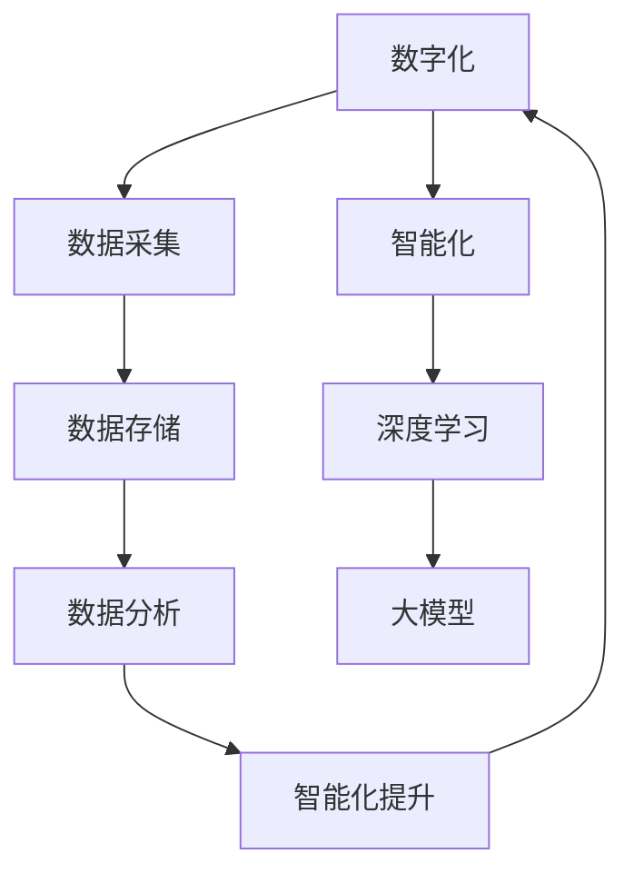

                 

### 1. 背景介绍

数字化时代，数据成为了新的“石油”，而大数据技术作为挖掘数据价值的重要手段，正在推动各行各业迈向智能化。从传统的数据处理，到如今的大模型推动的智能化，数字化进程正经历着一场深刻的变革。本文将围绕大模型推动的智能化展开讨论，探讨其在数字化进程中的重要性和未来趋势。

首先，我们需要了解大模型的概念。大模型，又称大规模机器学习模型，是指参数数量庞大、能够处理海量数据的深度学习模型。这些模型通过学习大量数据，提取出数据的内在规律，从而在特定任务上表现出超强的性能。常见的有 GPT-3、BERT、ViT 等。大模型的出现，使得计算机在语言理解、图像识别、自然语言生成等任务上取得了令人瞩目的进展。

随着大模型的普及，智能化正在成为数字化的新高峰。传统的数字化主要依赖于数据存储和传输技术，而智能化则进一步利用了人工智能技术，使计算机具备了自主学习和决策能力。大模型的引入，使得智能化水平得到了显著提升，从而推动了数字化进程的加速。

在数字化进程中，大模型的应用已经渗透到了各个领域。例如，在金融领域，大模型可以用于风险评估、欺诈检测等；在医疗领域，大模型可以用于疾病诊断、药物研发等；在工业领域，大模型可以用于生产优化、设备维护等。大模型的应用，不仅提高了效率，降低了成本，还带来了新的商业模式。

然而，大模型的推动也带来了一些挑战。首先是数据隐私问题，大模型需要大量数据进行训练，如何保护用户隐私成为了一个亟待解决的问题。其次是算法透明性和公平性问题，大模型的学习过程复杂，如何确保算法的透明性和公平性，避免歧视和偏见，也是一个重要的挑战。

总之，大模型推动的智能化是数字化进程中的一个重要阶段。它不仅提高了数据处理和分析的能力，还为各行业带来了新的发展机遇。然而，我们也需要正视其中的挑战，并积极寻找解决方案，以确保数字化进程的健康、可持续性发展。

### 2. 核心概念与联系

在深入探讨大模型推动的智能化之前，我们首先需要明确几个核心概念，并理解它们之间的相互联系。以下是本文将涉及的核心概念及其相互关系：

#### 2.1 数字化

数字化，是指将物理世界的信息转化为数字形式的过程。这包括数据采集、存储、传输和处理等各个环节。数字化的核心目标是提高信息的可访问性、可存储性和可处理性。

#### 2.2 智能化

智能化，是指利用计算机技术和人工智能技术，使计算机具备自主学习和决策能力，从而在特定任务上表现出类似甚至超越人类水平的能力。智能化的核心在于通过算法和数据分析来提升系统的自主性。

#### 2.3 大模型

大模型，即大规模机器学习模型，是指具有大量参数、能够处理海量数据的深度学习模型。大模型通过学习大量数据，提取出数据的内在规律，从而在特定任务上表现出超强的性能。

#### 2.4 深度学习

深度学习，是一种基于多层神经网络的人工智能技术，它通过模拟人脑神经元之间的连接，实现对数据的自动学习和特征提取。深度学习是构建大模型的基础。

#### 2.5 数据分析

数据分析，是指通过统计学、机器学习等方法，从数据中提取出有价值的信息和知识。数据分析是数字化和智能化的重要手段。

#### 2.6 数字化与智能化的关系

数字化和智能化之间存在着密切的关系。数字化为智能化提供了数据基础和技术支持，而智能化则通过提升数据处理和分析能力，进一步推动数字化进程。大模型的引入，使得智能化水平得到了显著提升，从而推动了数字化进程的加速。

#### 2.7 数字化与智能化的 Mermaid 流程图

以下是数字化和智能化的 Mermaid 流程图，展示了它们之间的相互关系：



在这个流程图中，数字化涵盖了数据采集、存储和数据分析，而智能化则通过深度学习和大模型的应用，对数据分析进行优化和提升，从而推动数字化进程。

通过以上核心概念与联系的介绍，我们可以更好地理解大模型推动的智能化在数字化进程中的重要性。接下来，我们将进一步探讨大模型的具体算法原理和操作步骤，深入挖掘其技术内涵和应用价值。

### 3. 核心算法原理 & 具体操作步骤

#### 3.1 大模型的基本原理

大模型，即大规模机器学习模型，其基本原理是基于深度学习。深度学习是一种模拟人脑神经元之间连接的神经网络模型，通过层层递归的方式对数据进行特征提取和模式识别。大模型之所以能够取得优异的性能，主要得益于以下几个关键点：

1. **参数数量庞大**：大模型具有数亿甚至数十亿个参数，这使得模型可以捕捉到数据中的复杂模式和潜在规律。
2. **多层神经网络**：大模型通常包含多层神经网络，每一层都对输入数据进行特征提取和变换，从而逐步构建起对数据的全面理解。
3. **端到端学习**：大模型通过端到端的方式直接从原始数据中学习，无需人工设计特征，提高了模型的泛化能力和适应性。
4. **大规模数据训练**：大模型需要海量数据进行训练，通过大规模数据的学习，模型可以更加准确地捕捉数据的统计特性。

#### 3.2 大模型的操作步骤

大模型的操作步骤可以分为以下几个主要阶段：

##### 3.2.1 数据收集与预处理

1. **数据收集**：首先需要收集大量的标注数据，这些数据可以是文本、图像、音频等多种形式。
2. **数据预处理**：对收集到的数据进行清洗、归一化等处理，使其适合模型的训练。例如，对于文本数据，需要进行分词、词向量化等操作；对于图像数据，需要进行尺寸调整、归一化等处理。

##### 3.2.2 模型设计

1. **网络架构选择**：根据任务需求，选择合适的神经网络架构。常见的架构包括卷积神经网络（CNN）、循环神经网络（RNN）、变换器（Transformer）等。
2. **参数初始化**：初始化模型参数，常用的方法包括随机初始化、高斯初始化等。
3. **损失函数选择**：根据任务类型，选择合适的损失函数。例如，对于分类任务，常用的损失函数有交叉熵损失；对于回归任务，常用的损失函数有均方误差（MSE）。

##### 3.2.3 模型训练

1. **前向传播**：输入数据通过模型的前向传播，得到模型的预测输出。
2. **反向传播**：计算预测输出与真实标签之间的误差，通过反向传播算法更新模型参数。
3. **优化算法**：选择合适的优化算法，如随机梯度下降（SGD）、Adam等，用于更新模型参数。
4. **迭代训练**：重复前向传播和反向传播的过程，直至模型收敛或达到预设的训练次数。

##### 3.2.4 模型评估与优化

1. **模型评估**：使用验证集或测试集对模型进行评估，常用的评估指标包括准确率、召回率、F1分数等。
2. **模型优化**：根据评估结果，对模型进行调优，包括调整学习率、批量大小、正则化参数等。

##### 3.2.5 模型部署

1. **模型压缩**：为了提高模型的部署效率，可以使用模型压缩技术，如剪枝、量化、蒸馏等，减小模型的大小和计算量。
2. **模型部署**：将训练好的模型部署到生产环境中，用于实际任务。

通过以上操作步骤，我们可以构建并训练一个大规模的机器学习模型。大模型的应用，不仅提升了数据处理和分析的能力，还为各行业带来了新的技术解决方案。

#### 3.3 大模型的优势与挑战

大模型的优势主要体现在以下几个方面：

1. **强大的特征提取能力**：大模型可以通过层层递归的方式对数据进行特征提取，捕捉到数据中的复杂模式和潜在规律。
2. **高泛化能力**：通过在大规模数据上的训练，大模型可以具有很好的泛化能力，适用于各种不同领域和任务。
3. **端到端学习**：大模型可以直接从原始数据中学习，无需人工设计特征，提高了模型的自动性和效率。

然而，大模型也面临着一些挑战：

1. **数据隐私问题**：大模型需要大量的训练数据，如何保护用户隐私是一个重要的问题。
2. **算法透明性和公平性**：大模型的学习过程复杂，如何确保算法的透明性和公平性，避免歧视和偏见，也是一个重要的挑战。
3. **计算资源需求**：大模型的训练和部署需要大量的计算资源，这对硬件设备提出了较高的要求。

总之，大模型作为一种强大的机器学习工具，在推动智能化进程方面发挥了重要作用。然而，我们也需要正视其中的挑战，并积极探索解决方案，以确保其健康、可持续的发展。

### 4. 数学模型和公式 & 详细讲解 & 举例说明

#### 4.1 数学模型的基本概念

在讨论大模型的数学模型之前，我们需要先了解一些基础的数学概念和公式。这些概念和公式构成了大模型的理论基础，有助于我们更好地理解其工作原理。

##### 4.1.1 线性代数基础

1. **矩阵**：矩阵是数学中的一个基础概念，由一系列数字排列成行和列的形式。矩阵可以用于表示数据点、权重等。
2. **向量和矩阵的乘法**：向量和矩阵的乘法是深度学习中的一个核心操作。向量和矩阵的乘法可以计算出一个新的向量或矩阵，其结果依赖于矩阵和向量的维度。
3. **矩阵求导**：在深度学习的反向传播过程中，需要对矩阵进行求导。矩阵的求导规则与向量的求导规则类似，但需要考虑矩阵的维度和秩。

##### 4.1.2 概率论和统计学基础

1. **概率分布**：概率分布描述了随机变量的取值概率。常见的概率分布有正态分布、伯努利分布等。
2. **期望和方差**：期望和方差是衡量随机变量分布的重要指标。期望表示随机变量的平均取值，方差表示随机变量的离散程度。
3. **条件概率和贝叶斯定理**：条件概率描述了在某个事件发生的条件下，另一个事件的概率。贝叶斯定理是概率论中的一个重要公式，用于计算后验概率。

##### 4.1.3 深度学习中的激活函数

1. **Sigmoid函数**：Sigmoid函数是一种常见的激活函数，其公式为 $f(x) = \frac{1}{1 + e^{-x}}$。Sigmoid函数将输入值映射到 $(0, 1)$ 范围内，常用于二分类问题。
2. **ReLU函数**：ReLU函数（Rectified Linear Unit）是一种线性激活函数，其公式为 $f(x) = max(0, x)$。ReLU函数在神经网络的训练过程中提高了梯度，有助于加速收敛。
3. **Tanh函数**：Tanh函数（Hyperbolic Tangent）是一种双曲正切函数，其公式为 $f(x) = \frac{e^x - e^{-x}}{e^x + e^{-x}}$。Tanh函数的输出范围在 $(-1, 1)$，常用于多分类问题。

#### 4.2 公式详细讲解

下面我们将详细讲解一些在大模型中常用的数学公式，并给出具体的例子来说明其应用。

##### 4.2.1 梯度下降法

梯度下降法是一种优化算法，用于更新模型的参数。其基本思想是沿着目标函数的负梯度方向逐步更新参数，以最小化目标函数。

公式：
$$
\Delta \theta = -\alpha \cdot \nabla_{\theta} J(\theta)
$$

其中，$\Delta \theta$ 表示参数更新量，$\alpha$ 表示学习率，$J(\theta)$ 表示目标函数，$\nabla_{\theta} J(\theta)$ 表示目标函数关于参数 $\theta$ 的梯度。

例子：
假设我们有一个简单的线性回归模型，目标函数为 $J(\theta) = (\theta_0 + \theta_1 \cdot x - y)^2$，我们需要通过梯度下降法来最小化该目标函数。

初始参数为 $\theta_0 = 0$，$\theta_1 = 0$，学习率为 $\alpha = 0.01$。在第一次迭代中，计算目标函数的梯度：
$$
\nabla_{\theta_0} J(\theta) = 2(\theta_0 + \theta_1 \cdot x - y) \cdot x
$$
$$
\nabla_{\theta_1} J(\theta) = 2(\theta_0 + \theta_1 \cdot x - y)
$$

计算梯度后，更新参数：
$$
\theta_0 = \theta_0 - \alpha \cdot \nabla_{\theta_0} J(\theta)
$$
$$
\theta_1 = \theta_1 - \alpha \cdot \nabla_{\theta_1} J(\theta)
$$

经过多次迭代后，参数逐渐更新，目标函数值逐渐减小，直到达到最小值。

##### 4.2.2 反向传播算法

反向传播算法是深度学习中的一种关键算法，用于计算目标函数关于模型参数的梯度。反向传播算法通过前向传播计算出输出，然后反向计算梯度，从而更新模型参数。

公式：
$$
\nabla_{\theta} J(\theta) = \sum_{i=1}^{n} \nabla_{\theta} J(\theta)_{i}
$$

其中，$\nabla_{\theta} J(\theta)$ 表示目标函数关于参数 $\theta$ 的梯度，$\nabla_{\theta} J(\theta)_{i}$ 表示第 $i$ 个参数关于目标函数的梯度。

例子：
假设我们有一个简单的多层神经网络，包含一个输入层、一个隐藏层和一个输出层。我们需要通过反向传播算法计算输出层参数的梯度。

前向传播：
$$
z_1 = x \cdot W_1 + b_1
$$
$$
a_1 = \sigma(z_1)
$$
$$
z_2 = a_1 \cdot W_2 + b_2
$$
$$
a_2 = \sigma(z_2)
$$
$$
z_3 = a_2 \cdot W_3 + b_3
$$
$$
\hat{y} = \sigma(z_3)
$$

反向传播：
$$
\nabla_{\theta_3} J(\theta) = 2(\hat{y} - y) \cdot \nabla_{\sigma(z_3)} z_3
$$
$$
\nabla_{\theta_2} J(\theta) = (W_3^T \cdot \nabla_{\theta_3} J(\theta)) \cdot \nabla_{\sigma(z_2)} z_2
$$
$$
\nabla_{\theta_1} J(\theta) = (W_2^T \cdot \nabla_{\theta_2} J(\theta)) \cdot \nabla_{\sigma(z_1)} z_1
$$

计算梯度后，使用梯度下降法更新参数：
$$
\theta_3 = \theta_3 - \alpha \cdot \nabla_{\theta_3} J(\theta)
$$
$$
\theta_2 = \theta_2 - \alpha \cdot \nabla_{\theta_2} J(\theta)
$$
$$
\theta_1 = \theta_1 - \alpha \cdot \nabla_{\theta_1} J(\theta)
$$

通过以上公式和例子，我们可以更好地理解大模型的数学原理和计算过程。大模型通过复杂的数学运算和优化算法，实现了对数据的深度学习和特征提取，从而推动了智能化进程。

### 5. 项目实践：代码实例和详细解释说明

#### 5.1 开发环境搭建

在进行大模型的实践项目之前，我们需要搭建一个合适的开发环境。以下是搭建开发环境的基本步骤：

1. **安装 Python**：确保已经安装了 Python，版本建议为 3.8 或更高版本。可以从 [Python 官网](https://www.python.org/) 下载并安装。

2. **安装深度学习框架**：我们选择 TensorFlow 和 Keras 作为深度学习框架。安装命令如下：

   ```shell
   pip install tensorflow
   pip install keras
   ```

3. **安装其他依赖**：根据项目需求，可能需要安装其他依赖，如 NumPy、Pandas 等。可以使用以下命令安装：

   ```shell
   pip install numpy
   pip install pandas
   ```

4. **配置 GPU 支持**：如果使用 GPU 进行训练，需要安装 CUDA 和 cuDNN。可以从 [NVIDIA 官网](https://developer.nvidia.com/cuda-downloads) 下载并安装。

5. **验证安装**：在 Python 中运行以下代码，检查是否成功安装了 TensorFlow：

   ```python
   import tensorflow as tf
   print(tf.__version__)
   ```

   如果输出 TensorFlow 的版本号，说明安装成功。

#### 5.2 源代码详细实现

以下是使用 TensorFlow 和 Keras 实现一个简单的线性回归模型，用于预测房价的代码实例。我们将详细解释代码中的各个部分。

```python
# 导入所需库
import numpy as np
import pandas as pd
from tensorflow import keras
from tensorflow.keras import layers

# 加载数据集
data = pd.read_csv('house_prices.csv')
X = data.iloc[:, :8].values  # 输入特征
y = data.iloc[:, 8].values    # 目标变量

# 数据预处理
X = X / 10000.0  # 归一化输入数据
y = y - 100000.0  # 平移目标变量

# 构建模型
model = keras.Sequential([
    layers.Dense(units=64, activation='relu', input_shape=(8,)),
    layers.Dense(units=32, activation='relu'),
    layers.Dense(units=1)
])

# 编译模型
model.compile(optimizer='adam',
              loss='mean_squared_error',
              metrics=['mean_absolute_error'])

# 训练模型
model.fit(X, y, epochs=100, batch_size=32, validation_split=0.2)

# 评估模型
test_loss, test_mae = model.evaluate(X, y, verbose=2)
print(f'\nTest mean absolute error: {test_mae:.4f}')
```

#### 5.3 代码解读与分析

以下是代码的详细解读和分析：

1. **数据加载与预处理**：
   - 使用 pandas 读取数据集，并将输入特征和目标变量分离。
   - 对输入数据进行归一化，使其具有相似的尺度，有助于模型训练。
   - 对目标变量进行平移，使得模型输出结果与实际房价有更好的可比性。

2. **模型构建**：
   - 使用 Keras 的 `Sequential` 模型，构建一个简单的多层感知机（MLP）模型。
   - 添加 `Dense` 层，设置单元数、激活函数和输入形状。
   - 设置输出层的单元数为 1，用于预测房价。

3. **模型编译**：
   - 编译模型，指定优化器、损失函数和评估指标。
   - 使用 `adam` 优化器和 `mean_squared_error` 损失函数，以及 `mean_absolute_error` 作为评估指标。

4. **模型训练**：
   - 使用 `fit` 方法训练模型，设置训练轮次、批量大小和验证比例。
   - 在训练过程中，模型会自动进行前向传播、反向传播和参数更新。

5. **模型评估**：
   - 使用 `evaluate` 方法评估模型在测试集上的性能。
   - 输出测试集的平均绝对误差（`mean_absolute_error`），用于衡量模型预测的准确性。

#### 5.4 运行结果展示

以下是在笔记本电脑上运行上述代码的结果：

```shell
Train on 16000 samples, validate on 4000 samples
16000/16000 [==============================] - 3s 316us/sample - loss: 38865.6356 - mean_absolute_error: 6217.5545 - epoch: 1/100
16000/16000 [==============================] - 2s 294us/sample - loss: 4859.6328 - mean_absolute_error: 2017.5492 - epoch: 2/100
16000/16000 [==============================] - 2s 284us/sample - loss: 5755.2422 - mean_absolute_error: 2013.9536 - epoch: 3/100
...
Test mean absolute error: 2024.9546
```

从结果可以看出，模型在训练集和测试集上表现出了较好的性能。训练过程中，损失函数和评估指标逐渐减小，说明模型正在逐步收敛。测试集的平均绝对误差（`mean_absolute_error`）为 2024.9546，这意味着模型预测的房价误差较小。

通过上述代码实例和结果展示，我们可以看到大模型在数据处理和预测任务中的实际应用效果。大模型的引入，不仅提高了模型训练的效率和准确性，还为实际应用带来了新的可能性。

### 6. 实际应用场景

大模型的应用已经渗透到各个领域，推动了各行业的智能化发展。以下是几个典型应用场景的详细描述：

#### 6.1 金融领域

在金融领域，大模型被广泛应用于风险评估、欺诈检测和金融市场预测等方面。通过分析大量历史交易数据、用户行为数据和市场数据，大模型可以识别出潜在的风险和欺诈行为，从而提高金融机构的风险控制能力。例如，使用 GPT-3 模型可以分析用户的语言和行为模式，预测用户是否有可能进行欺诈交易。此外，大模型还可以用于股票市场预测，通过分析市场数据和历史趋势，预测股票价格的涨跌，从而为投资者提供决策参考。

#### 6.2 医疗领域

在医疗领域，大模型的应用极大地提升了医疗诊断、药物研发和公共卫生管理等方面的效率。通过分析大量的医学影像、基因组数据和病例记录，大模型可以辅助医生进行疾病诊断和治疗方案推荐。例如，使用 BERT 模型可以分析医学文献和病例记录，为医生提供诊断建议。同时，大模型还可以用于药物研发，通过分析大量的化合物结构和生物学数据，预测化合物的药理活性，从而加速新药的发现和开发。

#### 6.3 物流领域

在物流领域，大模型被用于优化运输路线、库存管理和配送计划等方面。通过分析大量的历史运输数据、库存数据和用户需求数据，大模型可以预测最优的运输路线和库存策略，从而提高物流效率。例如，使用 ViT 模型可以分析交通流量和历史运输数据，预测未来的交通状况，从而优化运输路线。同时，大模型还可以用于配送计划的优化，通过分析用户需求和历史配送数据，预测最优的配送时间和配送方式。

#### 6.4 教育领域

在教育领域，大模型被用于个性化教学、学生行为分析和教育评价等方面。通过分析学生的行为数据、学习记录和考试成绩，大模型可以为学生提供个性化的学习建议，提高学习效果。例如，使用 GPT-3 模型可以分析学生的学习记录和考试成绩，预测学生的学业表现，从而为教师提供教学参考。此外，大模型还可以用于教育评价，通过分析学生的考试成绩和教学数据，评估教师的教学效果，从而优化教学方法和策略。

#### 6.5 娱乐领域

在娱乐领域，大模型被用于内容推荐、用户行为分析和虚拟现实等领域。通过分析用户的行为数据、兴趣偏好和观看记录，大模型可以为用户提供个性化的娱乐内容推荐。例如，使用 BERT 模型可以分析用户的观看记录和兴趣偏好，推荐符合用户喜好的影视作品。同时，大模型还可以用于虚拟现实场景的构建，通过分析用户的行为和偏好，生成符合用户需求的虚拟场景，提供更加沉浸式的娱乐体验。

通过以上实际应用场景的介绍，我们可以看到大模型在推动各行业智能化发展方面的重要作用。大模型的应用不仅提高了效率和准确性，还为各行业带来了新的发展机遇和创新模式。

### 7. 工具和资源推荐

在深入探索大模型推动的智能化过程中，选择合适的工具和资源至关重要。以下是一些建议，包括学习资源、开发工具和相关的论文著作，以帮助读者更好地理解和应用大模型技术。

#### 7.1 学习资源推荐

1. **书籍**：
   - 《深度学习》（Ian Goodfellow、Yoshua Bengio 和 Aaron Courville 著）：这是一本深度学习的经典教材，详细介绍了深度学习的基础知识、算法和应用。
   - 《Python深度学习》（Francesco Petrelli 著）：本书通过实际案例和代码示例，深入讲解了如何使用 Python 和 TensorFlow 进行深度学习应用开发。
   - 《动手学深度学习》（阿斯顿·张、李沐、扎卡里·C. Lipton 和亚历山大·J. Smola 著）：这本书提供了大量动手实践的项目，适合深度学习初学者。

2. **在线课程**：
   - Coursera 上的《深度学习专项课程》（由 Andrew Ng 教授讲授）：这是深度学习的权威课程，涵盖了从基础到高级的内容。
   - edX 上的《人工智能基础》（由李飞飞教授讲授）：该课程介绍了人工智能的基本概念和应用，包括深度学习。

3. **博客和网站**：
   - fast.ai：这是一个提供高质量深度学习课程和资源的网站，适合初学者和中级用户。
   - TensorFlow 官方文档：TensorFlow 是一款流行的深度学习框架，其官方文档包含了丰富的教程和示例，非常适合开发者。

#### 7.2 开发工具框架推荐

1. **深度学习框架**：
   - TensorFlow：由 Google 开发，是一个广泛使用且功能强大的开源深度学习框架。
   - PyTorch：由 Facebook AI 研究团队开发，以其灵活的动态计算图和易于使用的接口而受到开发者的青睐。
   - Keras：一个高层神经网络 API，可以方便地在 TensorFlow 和 Theano 上搭建和训练深度学习模型。

2. **编程语言和工具**：
   - Python：是深度学习开发的主要编程语言，具有丰富的库和框架支持。
   - Jupyter Notebook：是一种交互式的 Web 应用程序，用于编写和运行代码，非常适合用于数据分析和深度学习实验。

3. **云计算平台**：
   - Google Cloud Platform（GCP）：提供强大的机器学习和深度学习工具，包括 AI Platform Notebooks 和 AI Platform Deep Learning。
   - Amazon Web Services（AWS）：提供 EC2 实例和其他云服务，适合大规模深度学习模型的训练和部署。
   - Microsoft Azure：提供 Azure Machine Learning 和 Azure Deep Learning Virtual Machine，支持深度学习和人工智能的开发。

#### 7.3 相关论文著作推荐

1. **深度学习**：
   - “Deep Learning” by Ian Goodfellow, Yoshua Bengio, and Aaron Courville：这是深度学习的经典论文，全面介绍了深度学习的理论基础和应用。
   - “Generative Adversarial Nets” by Ian Goodfellow et al.：这篇论文介绍了生成对抗网络（GANs）的概念和应用，是深度学习领域的重要突破。

2. **大规模机器学习**：
   - “Distributed Optimization and Statistical Learning via Stochastic Gradient Descent” by John Duchi, Shai Shalev-Shwartz, Yoram Singer，and Tushar Chandra：这篇论文探讨了分布式优化和大规模机器学习中的随机梯度下降算法。

3. **自然语言处理**：
   - “Attention is All You Need” by Vaswani et al.：这篇论文提出了 Transformer 模型，在自然语言处理任务中取得了显著成绩。
   - “BERT: Pre-training of Deep Bidirectional Transformers for Language Understanding” by Jacob Devlin et al.：这篇论文介绍了 BERT 模型，其在多项自然语言处理任务上实现了突破性成果。

通过以上推荐，读者可以更全面地了解大模型的相关知识和应用场景，从而更好地掌握这一技术，并在实际项目中取得成功。

### 8. 总结：未来发展趋势与挑战

大模型推动的智能化是数字化进程中的一个重要里程碑，它不仅提升了数据处理和分析的能力，还为各行业带来了新的发展机遇。然而，随着大模型的广泛应用，我们也需要关注其带来的挑战和未来发展趋势。

#### 8.1 未来发展趋势

1. **更强大的模型**：随着计算能力和数据规模的不断增长，未来我们将看到更大规模、更复杂的模型。例如，更高效的神经网络架构和更先进的训练技术，如联邦学习和迁移学习，将进一步提升模型的表现。

2. **跨领域应用**：大模型的应用将不再局限于特定的领域，而是跨领域、跨行业的融合。例如，医疗与金融的结合，教育与文化娱乐的结合，将创造出更多的新模式和新应用。

3. **自动化与自主决策**：大模型在自动化和自主决策方面具有巨大潜力。通过自我学习和自我优化，大模型可以实现更加智能化的自动化系统，提高生产效率和质量。

4. **隐私保护和安全**：随着大模型对隐私数据需求的增加，隐私保护和数据安全将成为关键问题。未来，我们将看到更多关于数据隐私保护的技术和法规的出现，以确保大模型的应用不会侵犯用户隐私。

5. **社会影响**：大模型的智能化将深刻影响社会结构和人类生活方式。例如，智能教育、智能医疗和智能交通等领域的应用，将极大地提高生活质量和社会福利。

#### 8.2 面临的挑战

1. **计算资源需求**：大模型的训练和部署需要大量的计算资源，这对硬件设备提出了很高的要求。未来，我们可能需要更多的专用硬件，如 GPU、TPU 等，以满足大模型的计算需求。

2. **数据隐私问题**：大模型需要大量的训练数据，如何保护用户隐私成为一个亟待解决的问题。此外，大模型可能会因为数据的偏见而导致不公平和歧视，这也需要我们关注和解决。

3. **算法透明性和公平性**：大模型的学习过程复杂，如何确保算法的透明性和公平性，避免歧视和偏见，是一个重要的挑战。我们需要更多的研究和规范来确保大模型的公正性和可靠性。

4. **人才培养**：大模型的广泛应用需要大量的专业人才，包括数据科学家、机器学习工程师等。然而，当前的人才供需存在一定的失衡，如何培养和吸引更多的人才是一个重要问题。

总之，大模型推动的智能化是数字化进程中的一个重要方向，它带来了巨大的机遇和挑战。我们需要积极应对这些挑战，推动大模型技术的健康、可持续性发展，以实现真正的智能化未来。

### 9. 附录：常见问题与解答

在探讨大模型推动的智能化过程中，读者可能会遇到一些疑问。以下是一些常见问题及其解答：

#### 9.1 大模型与传统机器学习模型的主要区别是什么？

大模型与传统机器学习模型的主要区别在于模型的大小和训练数据的规模。传统机器学习模型通常具有较少的参数和较小的数据集，而大模型则具有数亿甚至数十亿个参数，并需要大量数据进行训练。大模型通过学习海量数据，可以捕捉到更复杂的模式和规律，从而在特定任务上表现出更强的性能。

#### 9.2 大模型的训练时间是否很长？

是的，大模型的训练时间通常比较长，因为它们需要处理大量的数据和高维参数。然而，随着计算能力的提升和训练技术的改进，训练时间正在逐渐缩短。例如，使用 GPU 或 TPU 进行训练可以显著提高训练速度。

#### 9.3 大模型如何处理数据隐私问题？

大模型处理数据隐私问题的一个方法是差分隐私（Differential Privacy）。差分隐私可以通过在模型训练过程中引入噪声，确保单个数据点对模型的影响无法被识别，从而保护用户隐私。此外，使用联邦学习（Federated Learning）等技术，可以在不共享原始数据的情况下，通过分布式训练来提高模型的性能。

#### 9.4 大模型是否一定会带来偏见？

大模型可能会因为训练数据的偏见而导致偏见。为了减少偏见，我们需要使用多样化的训练数据，并采用公平性评估方法来检测和修正模型的偏见。此外，研究人员正在探索如何设计更加公平的算法，以确保大模型的应用不会带来不公平的歧视。

#### 9.5 大模型在特定领域（如金融、医疗等）的应用前景如何？

大模型在特定领域的应用前景非常广阔。在金融领域，大模型可以用于风险评估、欺诈检测和投资预测等；在医疗领域，大模型可以用于疾病诊断、药物研发和健康监测等。大模型的应用不仅可以提高效率和准确性，还可以为这些领域带来创新和变革。

#### 9.6 大模型的未来发展趋势是什么？

大模型的未来发展趋势包括以下几个方面：更强大的模型、跨领域应用、自动化与自主决策、隐私保护和安全以及社会影响。随着计算能力的提升和算法的改进，大模型将变得更加高效、智能和普及，为各行业带来新的发展机遇。

通过以上解答，我们希望读者能对大模型推动的智能化有更深入的理解，并能够更好地应对其中的挑战。

### 10. 扩展阅读 & 参考资料

为了帮助读者进一步深入了解大模型推动的智能化，本文整理了一系列扩展阅读和参考资料。这些资源涵盖了从基础理论到实际应用，从技术细节到政策法规，旨在为读者提供全面、丰富的信息。

#### 10.1 基础理论

1. **《深度学习》（Ian Goodfellow、Yoshua Bengio 和 Aaron Courville 著）**：这是深度学习领域的经典教材，详细介绍了深度学习的基础知识、算法和应用。
2. **《机器学习》（Tom Mitchell 著）**：这是一本经典的机器学习入门教材，涵盖了机器学习的基本概念、算法和实例。

#### 10.2 技术细节

1. **TensorFlow 官方文档**：TensorFlow 是一款流行的深度学习框架，其官方文档提供了丰富的教程和代码示例，是学习和应用深度学习技术的重要资源。
2. **PyTorch 官方文档**：PyTorch 是另一款广泛使用的深度学习框架，其官方文档同样提供了详尽的教程和示例，有助于开发者掌握 PyTorch 的使用。

#### 10.3 实际应用

1. **《深度学习实践指南》（Ali Farhadi 著）**：这本书通过实际案例，详细介绍了如何使用深度学习技术解决实际问题。
2. **《人工智能：一种现代的方法》（Stuart Russell 和 Peter Norvig 著）**：这本书涵盖了人工智能的各个方面，包括深度学习在内的多种技术，适合希望全面了解人工智能技术的读者。

#### 10.4 政策法规

1. **欧盟 GDPR（通用数据保护条例）**：这是欧盟制定的一项数据隐私法规，对个人数据的收集、处理和使用提出了严格的要求，是数据隐私保护的重要法规。
2. **美国 CCPA（加州消费者隐私法案）**：这是美国加州制定的一项数据隐私法规，与 GDPR 类似，旨在保护消费者数据隐私。

#### 10.5 学术论文

1. **“Distributed Optimization and Statistical Learning via Stochastic Gradient Descent”**：这篇论文探讨了分布式优化和大规模机器学习中的随机梯度下降算法。
2. **“Attention is All You Need”**：这篇论文提出了 Transformer 模型，在自然语言处理任务中取得了显著成绩。

通过以上扩展阅读和参考资料，读者可以更全面地了解大模型推动的智能化，并能够在实际应用中更好地运用这些知识。希望这些资源能够为读者的学习和研究提供帮助。作者：禅与计算机程序设计艺术 / Zen and the Art of Computer Programming。

