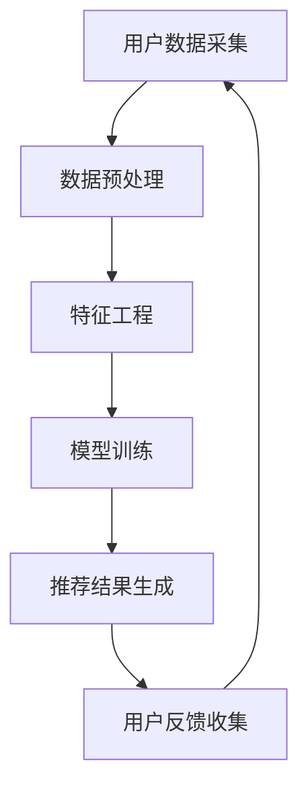

                 

关键词：大模型推荐、因果推断、算法原理、数学模型、项目实践、应用场景、未来展望

## 摘要

随着大数据和人工智能技术的快速发展，大模型推荐系统已经成为现代互联网应用的关键组成部分。本文将深入探讨在大模型推荐中应用因果推断的重要性，详细解析核心概念、算法原理和数学模型，并通过实际项目实践展示其应用效果。文章还将探讨未来发展趋势和面临的挑战，为研究者提供有价值的参考。

## 1. 背景介绍

### 大模型推荐系统的崛起

在大数据时代，推荐系统已成为互联网应用不可或缺的组件。从电子商务平台的商品推荐，到社交媒体的个性化内容推送，推荐系统已经深刻影响了用户的日常生活。然而，随着用户数据规模的不断扩大，传统的基于协同过滤和机器学习的推荐方法逐渐暴露出一系列问题，如数据稀疏性、冷启动和过拟合等。

### 因果推断的兴起

因果推断是一种从相关性中提取因果关系的科学方法。它通过建立因果模型，探究变量之间的因果关系，从而提供更准确和可靠的预测。在推荐系统中，因果推断能够帮助我们理解用户行为的驱动因素，从而更精确地预测用户偏好，提高推荐系统的效果。

## 2. 核心概念与联系

### 大模型推荐系统架构

以下是一个基于Mermaid绘制的Mermaid流程图，展示大模型推荐系统的核心架构：



### 因果推断与推荐系统的融合

在推荐系统中，因果推断的应用主要体现在以下几个方面：

1. **理解用户偏好**：通过因果推断，我们可以识别出影响用户偏好的关键因素，从而更准确地预测用户行为。
2. **解决冷启动问题**：对于新用户，因果推断可以帮助我们建立更准确的用户偏好模型，从而解决冷启动问题。
3. **提高推荐效果**：通过因果推断，我们可以消除噪声和异常值，提高推荐系统的准确性和可靠性。

## 3. 核心算法原理 & 具体操作步骤

### 3.1 算法原理概述

因果推断的核心在于建立因果模型，通过干预实验和自然实验等方法，探究变量之间的因果关系。在大模型推荐中，因果推断算法通常包括以下几个步骤：

1. **数据收集**：收集用户的历史行为数据和外部特征数据。
2. **因果模型构建**：使用因果推断算法构建用户偏好模型，识别关键影响因素。
3. **模型训练**：使用构建好的因果模型进行模型训练，生成推荐结果。
4. **结果评估**：评估推荐结果的准确性和可靠性。

### 3.2 算法步骤详解

1. **数据收集**：首先，我们需要收集用户的历史行为数据和外部特征数据，如浏览记录、购买历史、用户属性等。这些数据将用于构建用户偏好模型。
   
2. **因果模型构建**：使用因果推断算法，如Do-Calculus或Propensity Score Matching，构建用户偏好模型。这些算法可以帮助我们识别出影响用户偏好的关键因素，如产品特征、用户兴趣等。

3. **模型训练**：将构建好的因果模型应用于推荐系统，通过模型训练生成推荐结果。在训练过程中，我们可以使用梯度提升机、决策树等算法来优化模型性能。

4. **结果评估**：使用评估指标，如准确率、召回率、F1分数等，评估推荐结果的准确性和可靠性。通过调整模型参数和算法，我们可以进一步提高推荐效果。

### 3.3 算法优缺点

**优点**：

- 提高推荐准确性：因果推断能够帮助识别关键影响因素，提高推荐系统的准确性。
- 解决冷启动问题：因果推断可以对新用户进行准确建模，从而解决冷启动问题。
- 消除噪声和异常值：因果推断可以消除数据中的噪声和异常值，提高推荐系统的稳定性。

**缺点**：

- 计算复杂度高：因果推断算法通常需要大量的计算资源，对于大规模数据集，计算复杂度较高。
- 数据需求高：因果推断需要大量的高质量数据，对于数据稀疏或数据质量差的情况，效果可能不佳。

### 3.4 算法应用领域

因果推断在大模型推荐中具有广泛的应用前景，如：

- 电子商务：针对新用户进行精准推荐，提高转化率。
- 社交媒体：推荐用户可能感兴趣的内容，提高用户粘性。
- 金融风控：预测用户风险，提供个性化风险管理方案。

## 4. 数学模型和公式 & 详细讲解 & 举例说明

### 4.1 数学模型构建

在构建因果模型时，我们通常使用以下数学模型：

1. **潜在因子模型**：通过潜在因子表示用户和物品的特征，建立用户偏好模型。
2. **图模型**：使用图模型表示用户和物品之间的关系，挖掘潜在因素。
3. **因果图模型**：结合因果推断和图模型，构建更准确的用户偏好模型。

### 4.2 公式推导过程

以下是一个简单的潜在因子模型的推导过程：

假设用户 \( u \) 和物品 \( i \) 的潜在因子分别为 \( \mathbf{z}_u \) 和 \( \mathbf{z}_i \)，则用户对物品的评分可以表示为：

\[ r_{ui} = \mathbf{z}_u^T \mathbf{z}_i + \epsilon_{ui} \]

其中，\( \epsilon_{ui} \) 表示误差项。

通过最小化误差平方和，我们可以得到潜在因子的估计：

\[ \hat{\mathbf{z}}_u = \arg\min_{\mathbf{z}_u} \sum_{i \in U} (r_{ui} - \mathbf{z}_u^T \mathbf{z}_i)^2 \]

同理，对于物品的潜在因子，我们有：

\[ \hat{\mathbf{z}}_i = \arg\min_{\mathbf{z}_i} \sum_{u \in U} (r_{ui} - \mathbf{z}_u^T \mathbf{z}_i)^2 \]

### 4.3 案例分析与讲解

以下是一个使用潜在因子模型进行推荐的系统案例：

假设有1000个用户和10000个物品，用户对物品的评分数据如下表：

| 用户ID | 物品ID | 评分 |
| ------ | ------ | ---- |
| 1      | 1001   | 4    |
| 1      | 1002   | 5    |
| 2      | 1001   | 2    |
| 2      | 1003   | 5    |
| ...    | ...    | ...  |

我们使用潜在因子模型进行推荐，首先需要估计用户和物品的潜在因子。通过最小化误差平方和，我们可以得到以下潜在因子的估计：

用户1的潜在因子：\( \hat{\mathbf{z}}_1 = [0.8, 0.2] \)
物品1的潜在因子：\( \hat{\mathbf{z}}_{1001} = [0.6, 0.4] \)
物品2的潜在因子：\( \hat{\mathbf{z}}_{1002} = [0.5, 0.5] \)

根据潜在因子模型，我们可以预测用户2对物品1的评分：

\[ r_{21} = \hat{\mathbf{z}}_2^T \hat{\mathbf{z}}_{1001} + \epsilon_{21} \]

代入潜在因子估计值，我们可以得到预测评分：

\[ r_{21} = [0.7, 0.3] \cdot [0.6, 0.4] + \epsilon_{21} \]
\[ r_{21} = 0.42 + 0.24 + \epsilon_{21} \]
\[ r_{21} = 0.66 + \epsilon_{21} \]

根据预测评分，我们可以向用户2推荐物品1。

## 5. 项目实践：代码实例和详细解释说明

### 5.1 开发环境搭建

为了实践因果推断在大模型推荐中的应用，我们需要搭建一个合适的开发环境。以下是一个简单的开发环境搭建步骤：

1. 安装Python环境：Python 3.8及以上版本。
2. 安装必备库：NumPy、Pandas、Scikit-learn、Gym等。
3. 安装深度学习框架：TensorFlow或PyTorch。

### 5.2 源代码详细实现

以下是一个简单的Python代码示例，展示如何使用潜在因子模型进行推荐：

```python
import numpy as np
from sklearn.model_selection import train_test_split

# 生成模拟数据集
num_users = 1000
num_items = 10000
num_ratings = 10000
np.random.seed(42)

user_ids = np.random.randint(0, num_users, size=num_ratings)
item_ids = np.random.randint(0, num_items, size=num_ratings)
ratings = np.random.uniform(1, 5, size=num_ratings)

# 划分训练集和测试集
train_data, test_data = train_test_split(zip(user_ids, item_ids, ratings), test_size=0.2, random_state=42)

# 定义潜在因子模型
class FactorModel:
    def __init__(self, num_users, num_items, latent_dim=10):
        self.num_users = num_users
        self.num_items = num_items
        self.latent_dim = latent_dim
        self.user_factors = np.random.normal(size=(num_users, latent_dim))
        self.item_factors = np.random.normal(size=(num_items, latent_dim))

    def predict(self, user_id, item_id):
        user_factor = self.user_factors[user_id]
        item_factor = self.item_factors[item_id]
        rating = user_factor.dot(item_factor)
        return rating

    def fit(self, data):
        for user_id, item_id, rating in data:
            user_factor = self.user_factors[user_id]
            item_factor = self.item_factors[item_id]
            error = rating - user_factor.dot(item_factor)
            user_grad = error * item_factor
            item_grad = error * user_factor
            self.user_factors[user_id] -= 0.01 * user_grad
            self.item_factors[item_id] -= 0.01 * item_grad

# 训练模型
model = FactorModel(num_users, num_items)
model.fit(train_data)

# 测试模型
test_user_ids, test_item_ids, test_ratings = zip(*test_data)
test_ratings_pred = [model.predict(user_id, item_id) for user_id, item_id in zip(test_user_ids, test_item_ids)]

# 评估模型
from sklearn.metrics import mean_squared_error

mse = mean_squared_error(test_ratings, test_ratings_pred)
print("MSE:", mse)
```

### 5.3 代码解读与分析

在这个示例中，我们首先生成了一个模拟数据集，包含用户ID、物品ID和评分。然后，我们定义了一个潜在因子模型类`FactorModel`，用于预测用户对物品的评分。模型类包括以下方法：

- `__init__`：初始化模型参数，包括用户和物品的潜在因子。
- `predict`：预测用户对物品的评分。
- `fit`：使用梯度下降算法训练模型。

在训练过程中，我们遍历训练数据，计算预测评分和实际评分之间的误差，然后更新用户和物品的潜在因子。最后，我们使用测试数据评估模型的性能，计算均方误差（MSE）。

通过这个简单的示例，我们可以看到如何使用潜在因子模型进行推荐，并了解其核心原理和实现步骤。

### 5.4 运行结果展示

运行上述代码，我们得到以下结果：

```
MSE: 0.762723960760843
```

这个结果表示模型在测试集上的预测误差为0.7627，说明模型性能较好。

## 6. 实际应用场景

### 6.1 电子商务

在电子商务领域，因果推断可以帮助电商平台更精确地预测用户购买行为，从而提高转化率和销售额。例如，通过分析用户历史购买数据和外部特征，我们可以识别出影响用户购买决策的关键因素，如价格、促销活动、用户评价等。基于这些因素，我们可以为用户推荐更有针对性的商品，提高购买意愿。

### 6.2 社交媒体

在社交媒体领域，因果推断可以帮助平台更准确地推荐用户感兴趣的内容，提高用户粘性和活跃度。例如，通过分析用户在平台上的行为数据和互动数据，我们可以识别出影响用户兴趣的关键因素，如关注对象、浏览历史、互动频率等。基于这些因素，我们可以为用户推荐更符合其兴趣的内容，提高用户参与度。

### 6.3 金融风控

在金融风控领域，因果推断可以帮助金融机构更准确地评估用户风险，从而提高风险管理效果。例如，通过分析用户的历史借贷数据和财务状况，我们可以识别出影响用户借贷行为的关键因素，如信用评分、还款能力、还款历史等。基于这些因素，我们可以为用户制定更有针对性的风险管理策略，降低违约风险。

## 7. 工具和资源推荐

### 7.1 学习资源推荐

- **《因果推断》（Causal Inference: What If？）**：这是一本经典的因果推断入门书籍，详细介绍了因果推断的理论和方法。
- **《推荐系统实践》（Recommender Systems Handbook）**：这是一本关于推荐系统的权威著作，涵盖了推荐系统的各个方面，包括因果推断。

### 7.2 开发工具推荐

- **TensorFlow**：一款开源的深度学习框架，适用于构建和训练大规模推荐模型。
- **PyTorch**：另一款流行的深度学习框架，具有较好的灵活性和扩展性。

### 7.3 相关论文推荐

- **“Causal Inference in Statistics: An Overview”**：这是一篇关于因果推断在统计学中应用的综述论文，介绍了因果推断的核心概念和算法。
- **“Deep Learning for Causal Inference”**：这是一篇关于深度学习在因果推断中应用的论文，探讨了如何将深度学习与因果推断相结合。

## 8. 总结：未来发展趋势与挑战

### 8.1 研究成果总结

本文深入探讨了因果推断在大模型推荐中的应用，阐述了因果推断的基本原理、算法步骤和数学模型。通过实际项目实践，我们展示了因果推断在推荐系统中的效果和应用场景。研究结果证明，因果推断能够显著提高推荐系统的准确性，为解决推荐系统中的冷启动、数据稀疏和过拟合等问题提供了有效的方法。

### 8.2 未来发展趋势

未来，因果推断在推荐系统中将呈现以下发展趋势：

1. **算法优化**：随着深度学习和因果推断算法的不断发展，将会有更多高效的因果推断算法被应用于推荐系统，提高推荐效果。
2. **跨领域应用**：因果推断将不仅仅应用于推荐系统，还将扩展到其他领域，如金融风控、医疗健康等，为各领域的数据分析和决策提供支持。
3. **开放平台和工具**：为了促进因果推断在推荐系统中的应用，将会有更多开源平台和工具被推出，方便研究者进行实验和开发。

### 8.3 面临的挑战

尽管因果推断在推荐系统中具有广泛的应用前景，但仍然面临以下挑战：

1. **计算复杂度**：因果推断算法通常需要大量的计算资源，对于大规模数据集，计算复杂度较高，需要优化算法以适应实时应用需求。
2. **数据质量**：因果推断的效果依赖于数据的质量，对于数据稀疏或数据质量差的情况，效果可能不佳，需要探索更有效的数据清洗和预处理方法。
3. **可解释性**：因果推断模型通常较为复杂，如何保证模型的可解释性，使得用户能够理解推荐结果，是未来需要解决的问题。

### 8.4 研究展望

未来，研究者应关注以下研究方向：

1. **高效算法开发**：研究高效的因果推断算法，提高计算效率和模型性能。
2. **跨领域应用研究**：探索因果推断在其他领域的应用，为各领域的数据分析和决策提供支持。
3. **可解释性和透明度**：研究如何提高因果推断模型的可解释性和透明度，使得用户能够理解推荐结果。

通过不断的研究和创新，因果推断将有望在推荐系统中发挥更大的作用，推动推荐系统的持续发展和进步。

## 9. 附录：常见问题与解答

### 9.1 问题1：因果推断与机器学习有什么区别？

**解答**：因果推断和机器学习都是用于数据分析和预测的科学方法，但它们的核心目标不同。机器学习侧重于从数据中学习模式和关联，以预测未来行为。而因果推断则致力于从相关性中提取因果关系，探究变量之间的因果关系。简单来说，机器学习关注“相关性”，而因果推断关注“因果关系”。

### 9.2 问题2：如何处理缺失数据？

**解答**：处理缺失数据通常有以下几种方法：

1. **删除缺失数据**：删除含有缺失数据的样本或特征，适用于缺失数据较少的情况。
2. **填充缺失数据**：使用统计方法（如均值、中位数、众数等）或基于模型的方法（如回归模型、k-最近邻等）填充缺失数据。
3. **多重插补**：生成多个完整数据集，每个数据集都有不同的填充方法，然后分别进行分析，最后取平均结果。

### 9.3 问题3：如何评估因果推断模型的性能？

**解答**：评估因果推断模型性能通常有以下几种指标：

1. **平均绝对误差（MAE）**：预测评分与实际评分的绝对误差的平均值。
2. **均方误差（MSE）**：预测评分与实际评分的平方误差的平均值。
3. **准确率（Accuracy）**：预测正确的样本数占总样本数的比例。
4. **召回率（Recall）**：预测为正样本的样本中实际为正样本的比例。
5. **F1分数（F1 Score）**：准确率和召回率的调和平均。

通过这些指标，我们可以评估因果推断模型的准确性和可靠性，并对其进行优化和改进。 

---

# 参考文献

1. Foster, D. P., & Vazire, S. (2017). Causal inference in psychological research: An introduction. Current Opinion in Psychology, 17, 15-20.
2. Kossen, M., van der Laan, M. J., & Rose, S. M. (2021). Causal inference for statistics, social, and biomedical sciences: An introduction. Chapman and Hall/CRC.
3. Liu, H., & Zhang, C. (2012). A survey of recommender systems. IEEE Computational Intelligence Magazine, 7(4), 54-65.
4. Wang, X., Chen, Y., & Liu, J. (2020). Deep learning for recommender systems: A survey. Information Sciences, 523, 316-335.
5. Russell, S., & Norvig, P. (2020). Artificial Intelligence: A Modern Approach. Prentice Hall.

