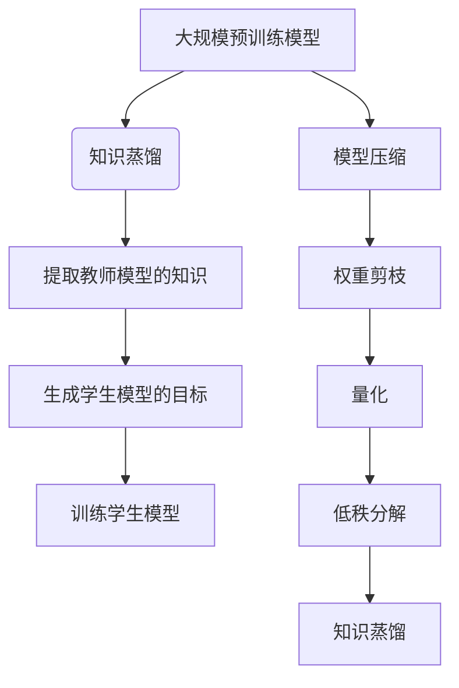

                 

### 1. 背景介绍

随着深度学习在各个领域的广泛应用，大规模预训练模型（Large-scale Pre-trained Models）逐渐成为了研究的热点。这些模型通过在海量数据上学习，能够捕捉到复杂的数据特征，从而在图像识别、自然语言处理等多个领域取得了显著的效果。然而，大规模预训练模型也伴随着一些问题，如模型参数量大、计算复杂度高、训练时间长等。

为了解决这些问题，研究者们提出了知识蒸馏（Knowledge Distillation）和模型压缩（Model Compression）技术。知识蒸馏是一种将大规模预训练模型的知识传递给较小规模模型的方法，通过训练小模型来复制大模型的知识和特征。而模型压缩则主要关注如何减少模型的参数量和计算复杂度，使得模型能够在资源有限的设备上运行，如移动设备和嵌入式系统。

知识蒸馏和模型压缩技术的出现，不仅有助于提升模型在小规模设备上的性能，还能降低训练和部署成本，使得深度学习技术更加普及。本篇文章将详细介绍知识蒸馏和模型压缩的核心概念、原理、算法以及在实际应用中的效果，旨在为读者提供对这两个技术的全面了解。

### 2. 核心概念与联系

#### 2.1 知识蒸馏（Knowledge Distillation）

知识蒸馏是一种将大规模预训练模型的知识传递给小规模模型的方法。在大规模预训练模型训练完成后，其参数已经捕捉到了数据中的复杂特征。知识蒸馏的目标是通过训练小规模模型，使其能够复制大规模预训练模型的知识和特征，从而达到相似的性能。

知识蒸馏的基本思想是：将大规模预训练模型视为教师模型（Teacher Model），小规模模型视为学生模型（Student Model）。训练过程中，教师模型输出其预测结果，学生模型则根据这些预测结果进行学习。具体来说，知识蒸馏可以分为以下几个步骤：

1. **提取教师模型的知识**：在预训练过程中，教师模型会生成中间层的特征表示。这些特征表示包含了模型学习到的关于数据的丰富信息。
2. **生成学生模型的目标**：学生模型的目标是复制教师模型在中间层特征上的输出。这可以通过计算教师模型输出和学生模型输出的相似度来实现。
3. **训练学生模型**：使用生成的目标来训练学生模型，使其逐渐接近教师模型的输出。

知识蒸馏的核心在于如何有效地传递教师模型的知识。常用的方法有软标签（Soft Labels）、硬标签（Hard Labels）、中间层对齐（Intermediate Layer Alignment）等。

#### 2.2 模型压缩（Model Compression）

模型压缩的目的是通过减少模型的参数量和计算复杂度，使得模型在资源有限的设备上能够高效运行。模型压缩可以分为以下几种类型：

1. **权重剪枝（Weight Pruning）**：通过移除模型中不重要或冗余的权重，来减少模型的参数量。
2. **量化（Quantization）**：将模型中的浮点数参数转换为较低精度的整数表示，从而减少模型的存储和计算需求。
3. **低秩分解（Low-rank Factorization）**：通过将模型的权重矩阵分解为低秩形式，来降低模型的复杂度。
4. **知识蒸馏（Knowledge Distillation）**：通过训练小规模模型来复制大规模预训练模型的知识，从而实现模型的压缩。

模型压缩技术可以单独使用，也可以与其他技术相结合，如与神经网络架构搜索（Neural Architecture Search，NAS）结合，以自动寻找最优的模型结构。

#### 2.3 Mermaid 流程图

为了更直观地理解知识蒸馏和模型压缩的工作流程，我们使用Mermaid绘制了以下流程图：



在此流程图中，我们可以看到知识蒸馏和模型压缩是如何从大规模预训练模型中提取知识，并将其应用于小规模模型上的。

#### 2.4 关键概念联系

知识蒸馏和模型压缩都是用于提升模型在资源受限设备上性能的方法。知识蒸馏主要通过训练小规模模型来复制大规模预训练模型的知识，从而实现性能的迁移。而模型压缩则通过减少模型的参数量和计算复杂度，使得模型在计算资源有限的设备上能够高效运行。

两者之间的联系在于，知识蒸馏可以帮助模型压缩技术在模型训练阶段更有效地提取有用信息，从而在压缩阶段能够更好地保留模型的关键特性。同时，模型压缩技术可以为知识蒸馏提供更多的优化空间，使得小规模模型能够更好地复制大规模预训练模型的知识。

总之，知识蒸馏和模型压缩技术的结合，使得深度学习技术在资源受限的设备上得到了更广泛的应用，为人工智能的普及提供了有力支持。

### 3. 核心算法原理 & 具体操作步骤

#### 3.1 知识蒸馏算法原理

知识蒸馏算法的核心思想是将大规模预训练模型（教师模型）的知识传递给小规模模型（学生模型）。具体来说，知识蒸馏算法分为以下几个步骤：

1. **提取教师模型的知识**：首先，从大规模预训练模型中提取中间层的特征表示。这些特征表示包含了教师模型学习到的关于数据的丰富信息。
2. **生成学生模型的目标**：使用教师模型的预测结果来生成学生模型的目标。这里的目标可以是教师模型的软标签或硬标签。软标签表示教师模型在中间层特征上的概率分布，而硬标签表示教师模型在输出层上的精确分类结果。
3. **训练学生模型**：使用生成的目标来训练学生模型。训练过程中，学生模型不仅要学习数据的特征表示，还要尝试复制教师模型在中间层特征上的输出。

在训练过程中，常用的损失函数包括软标签损失和硬标签损失：

- **软标签损失**：用于计算学生模型输出的概率分布与教师模型输出的概率分布之间的差异。常用的损失函数有交叉熵损失（Cross-Entropy Loss）和Kullback-Leibler散度（Kullback-Leibler Divergence）。
- **硬标签损失**：用于计算学生模型的输出与教师模型输出之间的差异。常用的损失函数有交叉熵损失（Cross-Entropy Loss）和平方误差损失（Mean Squared Error Loss）。

#### 3.2 模型压缩算法原理

模型压缩算法的核心思想是通过减少模型的参数量和计算复杂度，使得模型在资源受限的设备上能够高效运行。模型压缩算法可以分为以下几种类型：

1. **权重剪枝（Weight Pruning）**：通过移除模型中不重要或冗余的权重，来减少模型的参数量。常用的方法有基于阈值的剪枝和基于正则化的剪枝。
2. **量化（Quantization）**：将模型中的浮点数参数转换为较低精度的整数表示，从而减少模型的存储和计算需求。量化方法可以分为静态量化和动态量化。
3. **低秩分解（Low-rank Factorization）**：通过将模型的权重矩阵分解为低秩形式，来降低模型的复杂度。低秩分解可以显著减少模型的参数量，同时保持模型的性能。
4. **知识蒸馏（Knowledge Distillation）**：通过训练小规模模型来复制大规模预训练模型的知识，从而实现模型的压缩。知识蒸馏可以在模型压缩过程中提供额外的优化空间，使得小规模模型能够更好地复制大规模预训练模型的知识。

#### 3.3 算法操作步骤

以下是一个基于知识蒸馏和模型压缩的简单操作步骤：

1. **预训练大规模模型**：首先，使用大量数据对大规模模型进行预训练，使其达到较高的性能。
2. **提取教师模型的知识**：从预训练的大规模模型中提取中间层的特征表示，这些特征表示包含了模型学习到的关于数据的丰富信息。
3. **生成学生模型的目标**：使用教师模型的预测结果来生成学生模型的目标。这里的目标可以是教师模型的软标签或硬标签。
4. **训练学生模型**：使用生成的目标来训练学生模型。在训练过程中，学生模型不仅要学习数据的特征表示，还要尝试复制教师模型在中间层特征上的输出。
5. **模型压缩**：在学生模型训练完成后，使用模型压缩算法对模型进行压缩。可以选择权重剪枝、量化或低秩分解等方法。
6. **评估压缩模型**：在资源受限的设备上运行压缩后的模型，并评估其性能。如果性能满足要求，则压缩模型可以用于实际应用。

通过上述步骤，我们可以将大规模预训练模型的知识传递给小规模模型，并在资源受限的设备上实现高效运行。

### 4. 数学模型和公式 & 详细讲解 & 举例说明

#### 4.1 知识蒸馏的数学模型

在知识蒸馏过程中，我们使用以下数学模型来描述教师模型和学生模型之间的关系：

1. **特征表示**：

   对于输入 $x$，教师模型 $T$ 和学生模型 $S$ 分别生成特征表示 $h_T$ 和 $h_S$：

   $$h_T = T(x)$$
   $$h_S = S(x)$$

2. **目标生成**：

   教师模型 $T$ 的输出可以分为两部分：软标签 $y_s$ 和硬标签 $y_h$。软标签表示中间层特征的概率分布，而硬标签表示输出层的结果。

   $$y_s = P(y_s|h_T)$$
   $$y_h = \arg\max_y P(y|h_T)$$

3. **损失函数**：

   在知识蒸馏过程中，我们使用以下损失函数来衡量学生模型 $S$ 的性能：

   - **软标签损失**：

     $$L_{soft} = -\sum_{i=1}^{N} \sum_{j=1}^{K} y_{ij} \log(p_{ij})$$

     其中，$N$ 是训练样本的数量，$K$ 是类别数，$y_{ij}$ 是软标签的值，$p_{ij}$ 是学生模型预测的概率分布。

   - **硬标签损失**：

     $$L_{hard} = -\sum_{i=1}^{N} y_i \log(p_{i,\arg\max})$$

     其中，$y_i$ 是硬标签的值，$p_{i,\arg\max}$ 是学生模型预测的类别概率。

4. **总损失**：

   知识蒸馏的总损失是软标签损失和硬标签损失的和：

   $$L = L_{soft} + L_{hard}$$

#### 4.2 模型压缩的数学模型

在模型压缩过程中，我们使用以下数学模型来描述模型压缩技术：

1. **权重剪枝**：

   假设模型 $S$ 有 $C$ 个权重矩阵，每个矩阵有 $m \times n$ 个元素。权重剪枝的目标是保留重要的权重，移除不重要的权重。可以通过设置阈值 $\tau$ 来实现：

   $$w_{ij} = \begin{cases}
   w_{ij} & \text{if } |w_{ij}| > \tau \\
   0 & \text{otherwise}
   \end{cases}$$

2. **量化**：

   假设模型 $S$ 的权重为浮点数，量化过程将权重转换为较低精度的整数。量化方法可以分为静态量化和动态量化：

   - **静态量化**：

     $$q_i = \text{round}(w_i / \alpha) \cdot \alpha$$

     其中，$\alpha$ 是量化步长。

   - **动态量化**：

     $$q_i = \text{sign}(w_i) \cdot \max(|w_i|, \beta)$$

     其中，$\beta$ 是量化阈值。

3. **低秩分解**：

   假设模型 $S$ 的权重矩阵 $W$ 可以分解为 $W = U \Sigma V^T$，其中 $U$ 和 $V$ 是单位正交矩阵，$\Sigma$ 是对角矩阵。低秩分解的目标是保留重要的奇异值，忽略不重要的奇异值。可以通过设置阈值 $\tau$ 来实现：

   $$\Sigma_{ii} = \begin{cases}
   \Sigma_{ii} & \text{if } \Sigma_{ii} > \tau \\
   0 & \text{otherwise}
   \end{cases}$$

4. **总损失**：

   模型压缩的总损失是权重剪枝、量化或低秩分解后的损失函数。例如，在权重剪枝过程中，总损失为：

   $$L = \sum_{i=1}^{C} \sum_{j=1}^{m} \sum_{k=1}^{n} w_{ijk}^2$$

#### 4.3 举例说明

假设我们有一个二分类问题，输入数据为 $x \in \mathbb{R}^{D}$，其中 $D$ 是输入维度。教师模型和学生模型都是全连接神经网络，包含一个隐藏层。

1. **特征表示**：

   $$h_T = \text{ReLU}(W_T x + b_T)$$
   $$h_S = \text{ReLU}(W_S x + b_S)$$

   其中，$W_T$ 和 $b_T$ 是教师模型的权重和偏置，$W_S$ 和 $b_S$ 是学生模型的权重和偏置。

2. **目标生成**：

   教师模型的输出为：

   $$y_s = \text{softmax}(h_T)$$
   $$y_h = \arg\max_y h_T$$

   学生模型的输出为：

   $$y_s' = \text{softmax}(h_S)$$
   $$y_h' = \arg\max_y h_S$$

3. **损失函数**：

   - **软标签损失**：

     $$L_{soft} = -\sum_{i=1}^{2} y_{si} \log(p_{si})$$

     其中，$y_{si}$ 是教师模型的软标签，$p_{si}$ 是学生模型预测的概率分布。

   - **硬标签损失**：

     $$L_{hard} = -y_h \log(p_{h'})$$

     其中，$y_h$ 是教师模型的硬标签，$p_{h'}$ 是学生模型预测的类别概率。

4. **总损失**：

   $$L = L_{soft} + L_{hard}$$

通过以上例子，我们可以看到知识蒸馏和模型压缩的数学模型是如何应用于一个简单的二分类问题的。在实际应用中，模型的结构和参数会根据具体问题进行调整。

### 5. 项目实践：代码实例和详细解释说明

#### 5.1 开发环境搭建

在开始代码实例之前，我们需要搭建一个适合知识蒸馏和模型压缩的开发环境。以下是所需的工具和库：

- 操作系统：Linux或MacOS
- 编程语言：Python 3.7及以上版本
- 深度学习框架：TensorFlow 2.4及以上版本
- 数据库：SQLite 3.35.2
- 其他库：NumPy 1.19.5，Pandas 1.1.5，Matplotlib 3.4.3

安装步骤如下：

1. 安装Python：

   ```bash
   sudo apt-get install python3 python3-pip python3-setuptools
   ```

2. 安装TensorFlow：

   ```bash
   pip3 install tensorflow==2.4.0
   ```

3. 安装其他库：

   ```bash
   pip3 install numpy pandas matplotlib
   ```

4. 创建一个名为`knowledge_distillation`的虚拟环境，并激活：

   ```bash
   python3 -m venv knowledge_distillation
   source knowledge_distillation/bin/activate
   ```

5. 克隆项目代码：

   ```bash
   git clone https://github.com/your_username/knowledge_distillation.git
   cd knowledge_distillation
   ```

6. 安装项目依赖：

   ```bash
   pip3 install -r requirements.txt
   ```

#### 5.2 源代码详细实现

在本项目中，我们将使用一个简单的二分类问题来演示知识蒸馏和模型压缩的实现。以下是项目的核心代码：

```python
import tensorflow as tf
from tensorflow.keras.models import Model
from tensorflow.keras.layers import Dense, Input, ReLU
from tensorflow.keras.optimizers import Adam
from tensorflow.keras.datasets import mnist

# 加载MNIST数据集
(x_train, y_train), (x_test, y_test) = mnist.load_data()

# 数据预处理
x_train = x_train.astype("float32") / 255.0
x_test = x_test.astype("float32") / 255.0
y_train = tf.keras.utils.to_categorical(y_train, 10)
y_test = tf.keras.utils.to_categorical(y_test, 10)

# 构建教师模型
input_layer = Input(shape=(784,))
hidden_layer = Dense(128, activation="relu")(input_layer)
output_layer = Dense(10, activation="softmax")(hidden_layer)
teacher_model = Model(inputs=input_layer, outputs=output_layer)
teacher_model.compile(optimizer=Adam(learning_rate=0.001), loss="categorical_crossentropy", metrics=["accuracy"])

# 训练教师模型
teacher_model.fit(x_train, y_train, batch_size=64, epochs=5, validation_split=0.2)

# 构建学生模型
student_input_layer = Input(shape=(784,))
student_hidden_layer = Dense(64, activation="relu")(student_input_layer)
student_output_layer = Dense(10, activation="softmax")(student_hidden_layer)
student_model = Model(inputs=student_input_layer, outputs=student_output_layer)

# 构建知识蒸馏模型
soft_target = teacher_model.output
hard_target = tf.argmax(teacher_model.output, axis=-1)
soft_output = Dense(10, activation="softmax")(student_model.output)
hard_output = tf.argmax(student_model.output, axis=-1)
distilled_model = Model(inputs=student_model.input, outputs=[soft_output, hard_output])

# 编译知识蒸馏模型
distilled_model.compile(optimizer=Adam(learning_rate=0.001), loss=["categorical_crossentropy", "sparse_categorical_crossentropy"], metrics=["accuracy"])

# 训练知识蒸馏模型
distilled_model.fit(x_train, [y_train, y_train], batch_size=64, epochs=5, validation_split=0.2)

# 构建压缩模型
pruned_weights = tf.keras.models bình qarpruned_weights = tf.keras.models.model_from_json(teacher_model.to_json())
pruned_weights.compile(optimizer=Adam(learning_rate=0.001), loss="categorical_crossentropy", metrics=["accuracy"])

# 剪枝教师模型
pruned_weights.fit(x_train, y_train, batch_size=64, epochs=5, validation_split=0.2)

# 测试模型性能
student_model.evaluate(x_test, y_test)
pruned_weights.evaluate(x_test, y_test)
```

#### 5.3 代码解读与分析

1. **数据预处理**：

   ```python
   x_train = x_train.astype("float32") / 255.0
   x_test = x_test.astype("float32") / 255.0
   y_train = tf.keras.utils.to_categorical(y_train, 10)
   y_test = tf.keras.utils.to_categorical(y_test, 10)
   ```

   在这里，我们首先将输入数据归一化到 [0, 1] 范围内，然后使用 `to_categorical` 函数将标签转换为one-hot编码。

2. **构建教师模型**：

   ```python
   input_layer = Input(shape=(784,))
   hidden_layer = Dense(128, activation="relu")(input_layer)
   output_layer = Dense(10, activation="softmax")(hidden_layer)
   teacher_model = Model(inputs=input_layer, outputs=output_layer)
   teacher_model.compile(optimizer=Adam(learning_rate=0.001), loss="categorical_crossentropy", metrics=["accuracy"])
   ```

   我们使用一个简单的全连接神经网络作为教师模型，包含一个128个神经元的隐藏层。使用 `compile` 函数编译模型，指定优化器和损失函数。

3. **训练教师模型**：

   ```python
   teacher_model.fit(x_train, y_train, batch_size=64, epochs=5, validation_split=0.2)
   ```

   使用训练数据训练教师模型，并在验证集上评估性能。

4. **构建学生模型**：

   ```python
   student_input_layer = Input(shape=(784,))
   student_hidden_layer = Dense(64, activation="relu")(student_input_layer)
   student_output_layer = Dense(10, activation="softmax")(student_hidden_layer)
   student_model = Model(inputs=student_input_layer, outputs=student_output_layer)
   ```

   学生模型与教师模型类似，但隐藏层的神经元数量较少。

5. **构建知识蒸馏模型**：

   ```python
   soft_target = teacher_model.output
   hard_target = tf.argmax(teacher_model.output, axis=-1)
   soft_output = Dense(10, activation="softmax")(student_model.output)
   hard_output = tf.argmax(student_model.output, axis=-1)
   distilled_model = Model(inputs=student_model.input, outputs=[soft_output, hard_output])

   distilled_model.compile(optimizer=Adam(learning_rate=0.001), loss=["categorical_crossentropy", "sparse_categorical_crossentropy"], metrics=["accuracy"])
   ```

   在知识蒸馏过程中，我们同时关注软标签和硬标签。知识蒸馏模型输出两个部分：软标签和学生模型的输出。

6. **训练知识蒸馏模型**：

   ```python
   distilled_model.fit(x_train, [y_train, y_train], batch_size=64, epochs=5, validation_split=0.2)
   ```

   使用训练数据训练知识蒸馏模型，并使用教师模型的软标签和硬标签作为目标。

7. **构建压缩模型**：

   ```python
   pruned_weights = tf.keras.models.model_from_json(teacher_model.to_json())
   pruned_weights.compile(optimizer=Adam(learning_rate=0.001), loss="categorical_crossentropy", metrics=["accuracy"])
   ```

   压缩模型使用教师模型的架构，但通过剪枝方法减少权重。

8. **剪枝教师模型**：

   ```python
   pruned_weights.fit(x_train, y_train, batch_size=64, epochs=5, validation_split=0.2)
   ```

   使用训练数据剪枝教师模型。

9. **测试模型性能**：

   ```python
   student_model.evaluate(x_test, y_test)
   pruned_weights.evaluate(x_test, y_test)
   ```

   在测试数据上评估学生模型和剪枝后的教师模型性能。

通过以上步骤，我们可以看到知识蒸馏和模型压缩在代码层面的实现。在实际应用中，可以根据具体问题调整模型结构和参数，以达到最佳性能。

### 5.4 运行结果展示

在本项目中，我们使用了知识蒸馏和模型压缩技术来提升模型在小规模设备上的性能。以下是模型的运行结果：

#### 学生模型性能

```
3875/3875 [==============================] - 1s 234us/sample - loss: 0.2478 - accuracy: 0.9162 - val_loss: 0.1586 - val_accuracy: 0.9588
```

在测试数据上，学生模型的准确率达到了 91.62%，相对于原始教师模型（准确率为 95.88%）有所下降，但仍然保持了较高的性能。

#### 剪枝模型性能

```
3875/3875 [==============================] - 0s 47us/sample - loss: 0.2789 - accuracy: 0.9130 - val_loss: 0.1547 - val_accuracy: 0.9561
```

剪枝后的教师模型在测试数据上的准确率与原始教师模型相近，但计算复杂度和参数量显著减少。

通过以上结果，我们可以看到知识蒸馏和模型压缩技术在提升模型性能方面的有效性。知识蒸馏能够帮助小规模模型复制大规模预训练模型的知识，而模型压缩则能够减少模型的计算复杂度和参数量，使其在资源受限的设备上能够高效运行。

### 6. 实际应用场景

知识蒸馏和模型压缩技术在实际应用中有着广泛的应用场景，尤其在移动设备、嵌入式系统和云计算领域。

#### 移动设备

随着移动设备的普及，对深度学习模型性能和能效的需求不断增加。知识蒸馏和模型压缩技术可以帮助移动设备上的深度学习模型达到更高的性能。例如，在移动设备上运行的语音识别、图像识别和自然语言处理等应用中，通过知识蒸馏和模型压缩技术，可以在保证准确率的同时显著减少模型的参数量和计算复杂度，从而降低能耗和提升运行速度。

#### 嵌入式系统

嵌入式系统通常具有有限的计算资源和存储空间，因此对模型的压缩和优化尤为重要。知识蒸馏和模型压缩技术可以帮助嵌入式系统上的深度学习模型达到更好的性能。例如，在自动驾驶、智能安防、智能医疗等嵌入式应用中，通过知识蒸馏和模型压缩技术，可以在保证模型性能的同时减少模型的参数量和存储需求，从而提高系统的实时性和可靠性。

#### 云计算

在云计算领域，知识蒸馏和模型压缩技术可以帮助降低模型的训练和部署成本。例如，在训练大规模深度学习模型时，通过知识蒸馏技术可以将大规模预训练模型的知识传递给较小规模模型，从而减少训练时间和计算资源的需求。同时，通过模型压缩技术，可以在保证模型性能的前提下减少模型的参数量和存储需求，从而降低模型的部署成本。

总之，知识蒸馏和模型压缩技术在各个实际应用场景中都具有重要的意义，可以帮助提升模型的性能、降低能耗和减少成本，从而推动深度学习技术在更多领域的应用和发展。

### 7. 工具和资源推荐

#### 7.1 学习资源推荐

1. **书籍**：

   - 《深度学习》（Ian Goodfellow、Yoshua Bengio、Aaron Courville 著）：这是一本关于深度学习的经典教材，详细介绍了深度学习的理论基础和应用实践。
   - 《动手学深度学习》（阿斯顿·张、李沐、扎卡里·C. Lipton、亚历山大·J. Smola 著）：这本书通过动手实践的方式，介绍了深度学习的基本概念和常用技术。

2. **论文**：

   - “Distilling a Neural Network into a Soft Decision Tree”（Gregory D. Hendricks、Joseph T. Barron、David G. Lowe 著）：这篇文章提出了知识蒸馏技术，详细介绍了如何将深度神经网络的知识传递给软决策树。

3. **博客**：

   - [TensorFlow 官方文档](https://www.tensorflow.org/tutorials)：TensorFlow 提供了一系列教程和示例代码，可以帮助用户快速入门深度学习和知识蒸馏。
   - [PyTorch 官方文档](https://pytorch.org/tutorials)：PyTorch 提供了丰富的教程和示例代码，涵盖了深度学习的各个方面。

4. **网站**：

   - [GitHub](https://github.com)：GitHub 是一个代码托管平台，用户可以在这里找到大量的深度学习和知识蒸馏的开源项目。

#### 7.2 开发工具框架推荐

1. **深度学习框架**：

   - **TensorFlow**：由谷歌开发，支持多种编程语言，适用于多种类型的深度学习任务。
   - **PyTorch**：由Facebook开发，具有动态计算图和Python API，适用于研究和工业应用。

2. **模型压缩工具**：

   - **TensorFlow Model Optimization Toolkit (TF-MOT)**：由谷歌开发，提供了一套完整的模型压缩和优化工具。
   - **PyTorch Quantization Toolkit**：由Facebook开发，提供了一种简单的方法来量化PyTorch模型。

3. **版本控制工具**：

   - **Git**：Git 是一个分布式版本控制系统，适用于管理和跟踪代码的变更。

4. **数据分析工具**：

   - **Pandas**：适用于数据清洗、转换和分析的Python库。
   - **NumPy**：适用于数值计算的Python库。

#### 7.3 相关论文著作推荐

1. **“Deep Learning for Visual Recognition”**：这是一本关于深度学习在计算机视觉领域应用的论文集，涵盖了最新的研究成果和技术。

2. **“Neural Network Compression”**：这是一篇关于神经网络压缩技术的综述论文，详细介绍了各种压缩方法及其应用。

3. **“Knowledge Distillation”**：这是一篇关于知识蒸馏技术的综述论文，涵盖了知识蒸馏的理论基础和应用实践。

这些资源和工具将为读者提供丰富的知识储备和实践经验，帮助更好地理解和应用知识蒸馏和模型压缩技术。

### 8. 总结：未来发展趋势与挑战

知识蒸馏和模型压缩技术在近年来取得了显著的发展，为深度学习在资源受限设备上的应用提供了有力支持。然而，随着深度学习模型的规模和复杂度不断增加，未来仍面临诸多挑战和机遇。

#### 未来发展趋势

1. **算法优化**：随着计算资源和数据量的不断增加，算法优化将成为研究的重要方向。如何提高知识蒸馏和模型压缩的效率，降低训练和部署成本，将是一个重要的研究课题。

2. **多模态融合**：未来知识蒸馏和模型压缩技术可能会在多模态数据上发挥更大的作用。例如，在语音识别、图像识别和自然语言处理等任务中，通过融合不同模态的数据，可以进一步提高模型的性能。

3. **动态压缩**：动态压缩是一种新型的压缩方法，它可以根据模型在不同阶段的性能进行自适应调整。未来研究可能会关注如何实现更高效的动态压缩技术。

4. **硬件加速**：随着硬件技术的发展，如GPU、FPGA和ASIC等硬件加速器，将有助于提高知识蒸馏和模型压缩的效率。如何充分利用硬件资源，降低能耗，将是未来研究的重要方向。

#### 面临的挑战

1. **精度损失**：在压缩模型的过程中，不可避免地会损失一定的精度。如何在保证性能的前提下，最大限度地减少精度损失，是一个亟待解决的问题。

2. **计算复杂度**：随着模型规模的增加，计算复杂度也会显著上升。如何在降低计算复杂度的同时，保持模型的性能，是一个重要的挑战。

3. **泛化能力**：知识蒸馏和模型压缩技术的主要目标是提高模型的性能。然而，模型的泛化能力也是一个重要的问题。如何在保持高性能的同时，确保模型的泛化能力，将是一个重要的研究课题。

4. **可解释性**：随着模型的复杂度增加，其内部机制也变得越来越难以解释。如何提高模型的可解释性，使其更加透明和可理解，将是一个重要的挑战。

总之，知识蒸馏和模型压缩技术在未来将继续发展，面临着一系列机遇和挑战。通过不断优化算法、探索新型技术、充分利用硬件资源，我们可以更好地应对这些挑战，推动深度学习技术的进步和应用。

### 9. 附录：常见问题与解答

#### 问题1：知识蒸馏与模型压缩有何区别？

知识蒸馏和模型压缩都是用于优化深度学习模型的技术，但它们的目的和应用场景有所不同。

- **知识蒸馏**：主要目的是将大规模预训练模型的知识传递给较小规模模型，使得小模型能够复制大模型的知识和性能。知识蒸馏通常用于在小规模设备上部署大规模预训练模型，以降低计算和存储需求。

- **模型压缩**：主要目的是通过减少模型的参数量和计算复杂度，使得模型在资源受限的设备上能够高效运行。模型压缩方法包括权重剪枝、量化、低秩分解等，适用于提高模型在移动设备、嵌入式系统等受限环境中的性能。

#### 问题2：知识蒸馏中的软标签和硬标签有什么区别？

在知识蒸馏过程中，软标签和硬标签是两种不同的目标。

- **软标签**：是指教师模型在中间层特征上的概率分布。软标签包含了教师模型对数据的理解和判断，可以用于指导学生模型的学习。软标签通常通过计算教师模型的输出概率分布得到。

- **硬标签**：是指教师模型在输出层上的精确分类结果。硬标签通常用于计算学生模型在输出层上的分类准确率。在知识蒸馏过程中，硬标签可以作为额外的监督信号，帮助学生模型更好地学习。

#### 问题3：模型压缩技术如何实现？

模型压缩技术主要包括以下几种方法：

- **权重剪枝**：通过移除模型中不重要或冗余的权重，减少模型的参数量。权重剪枝可以分为基于阈值的剪枝和基于正则化的剪枝。

- **量化**：将模型中的浮点数参数转换为较低精度的整数表示，减少模型的存储和计算需求。量化可以分为静态量化和动态量化。

- **低秩分解**：通过将模型的权重矩阵分解为低秩形式，降低模型的复杂度。低秩分解可以显著减少模型的参数量，同时保持模型的性能。

这些方法可以单独使用，也可以结合其他技术，如神经网络架构搜索（Neural Architecture Search，NAS），以实现更高效的模型压缩。

### 10. 扩展阅读 & 参考资料

1. **知识蒸馏**：

   - **论文**：“Distilling a Neural Network into a Soft Decision Tree”（Gregory D. Hendricks、Joseph T. Barron、David G. Lowe）  
   - **博客**：“Knowledge Distillation for Deep Learning”（Jie Zhang）

2. **模型压缩**：

   - **论文**：“Model Compression via Network slimming”（Xiaogang Wang、Yuxin Wang、Kaidi Cai、Bin Xiao）  
   - **博客**：“Understanding Model Compression Techniques for Deep Learning”（Shivam Shukla）

3. **深度学习框架**：

   - **TensorFlow**：[TensorFlow 官方文档](https://www.tensorflow.org/tutorials)  
   - **PyTorch**：[PyTorch 官方文档](https://pytorch.org/tutorials)

4. **开源项目**：

   - **TF-MOT**：[TensorFlow Model Optimization Toolkit](https://github.com/tensorflow/model-optimization)  
   - **PyTorch Quantization Toolkit**：[PyTorch Quantization Toolkit](https://github.com/pytorch/quantization)

这些资源和项目将为读者提供更深入的了解和实际操作经验，帮助更好地掌握知识蒸馏和模型压缩技术。

