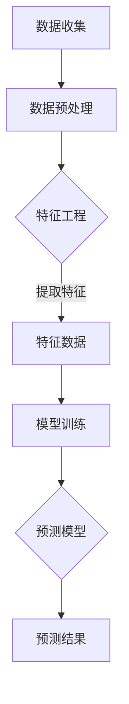

                 

### 背景介绍

#### 引言

在当今大数据和人工智能时代，推荐系统已成为各种在线平台和服务的重要组成部分。从电子商务网站到社交媒体平台，推荐系统通过分析用户的行为和偏好，为用户提供个性化的内容和服务，从而显著提高了用户体验和商业价值。然而，随着用户数据的爆炸式增长和用户行为的多样化，如何有效地预测用户的行为演化趋势，并在此基础上优化推荐效果，成为了一个具有挑战性的问题。

本文旨在探讨大模型推荐场景中的用户行为演化趋势预测分析。通过深入分析用户行为数据，我们将探索用户行为的潜在模式，并利用先进的大模型算法，实现对用户行为趋势的准确预测。这不仅有助于提高推荐系统的性能，还能为相关领域的决策提供科学依据。

#### 当前推荐系统的挑战

尽管推荐系统在过去几年取得了显著进展，但仍然面临着诸多挑战。首先，用户行为的多样性使得传统推荐算法难以捕捉到复杂的用户偏好模式。其次，海量数据的处理能力和实时性要求也对推荐系统的性能提出了更高的要求。此外，数据隐私和保护的问题也成为推荐系统发展的关键瓶颈。

因此，如何在大模型推荐场景下，有效地预测用户行为演化趋势，提高推荐系统的准确性和实时性，成为当前研究和应用的热点问题。

#### 文章目的

本文的目标是通过对用户行为演化趋势的预测分析，为推荐系统提供有效的数据支持和决策依据。具体来说，我们将：

1. **分析用户行为数据**：通过收集和分析用户在推荐系统中的交互数据，了解用户行为的特征和模式。
2. **构建用户行为模型**：利用机器学习和深度学习算法，构建能够准确预测用户行为的大模型。
3. **评估和优化推荐效果**：通过对比不同算法的性能，评估和优化推荐系统的效果，为实际应用提供指导。

通过上述研究，我们希望能够为推荐系统的优化和用户行为预测提供新的思路和方法。

### 核心概念与联系

在本节中，我们将详细探讨大模型推荐场景中的核心概念，并使用Mermaid流程图展示相关的概念和流程。这些核心概念包括用户行为数据、特征工程、模型训练和预测等。

#### 用户行为数据

用户行为数据是推荐系统的基础。这些数据通常包括用户的浏览记录、点击行为、购买历史、评论和评分等。通过对这些数据进行收集和存储，我们可以获得用户在推荐系统中的活动轨迹。

#### 特征工程

特征工程是构建用户行为模型的关键步骤。通过对原始数据进行预处理和转换，提取出有用的特征，可以帮助模型更好地理解和预测用户行为。特征工程的过程通常包括数据清洗、特征选择和特征转换等。

#### 模型训练

模型训练是利用特征数据构建预测模型的过程。我们选择合适的机器学习和深度学习算法，对特征数据进行训练，以学习用户行为的潜在模式。常见的算法包括决策树、支持向量机和深度神经网络等。

#### 预测

在模型训练完成后，我们可以使用训练好的模型对新的用户行为进行预测。通过预测结果，推荐系统可以实时地为用户推荐个性化的内容。

#### Mermaid 流程图

以下是一个简化的Mermaid流程图，展示了用户行为数据从收集到预测的全过程：



- **数据收集**：从各种来源收集用户行为数据。
- **数据预处理**：对原始数据清洗、去噪和格式化。
- **特征工程**：提取和转换数据，形成特征数据。
- **模型训练**：使用特征数据训练预测模型。
- **预测结果**：使用训练好的模型对新数据进行预测。

通过这个流程，我们可以看到，用户行为数据的处理和预测是一个系统性的工程，涉及多个步骤和环节。理解这些核心概念和流程对于后续的内容分析和算法实现具有重要意义。

### 核心算法原理 & 具体操作步骤

在本节中，我们将深入探讨用于预测用户行为演化趋势的核心算法原理，并详细描述其具体操作步骤。所选择的算法为深度学习中的递归神经网络（RNN），特别是长短期记忆网络（LSTM）。这种模型在处理时间序列数据和捕捉长期依赖关系方面表现出色，非常适合用于用户行为预测。

#### LSTM 算法原理

LSTM是RNN的一种变体，旨在解决传统RNN在处理长序列数据时出现的梯度消失和梯度爆炸问题。LSTM通过引入门控机制，能够在时间序列中有效地保持和更新信息。

1. **输入门（Input Gate）**：决定当前输入的信息中哪些部分需要被记忆。
2. **遗忘门（Forget Gate）**：决定哪些先前的记忆需要被遗忘或保留。
3. **输出门（Output Gate）**：决定当前时刻的记忆应该输出哪些信息。

每个门都由一个sigmoid函数和一个线性变换组成。sigmoid函数的输出介于0和1之间，用于控制信息的保留或遗忘。线性变换则用于计算门的权重。

#### LSTM 算法操作步骤

1. **初始化**：设置网络参数，包括权重和偏置。这些参数需要通过训练数据学习得到。

2. **数据预处理**：将用户行为数据转换为时间序列格式。通常，这涉及到以下步骤：
   - **序列化**：将用户行为按照时间顺序排列，形成时间序列。
   - **特征提取**：对序列中的每个时间点提取特征，例如用户点击次数、购买金额等。
   - **归一化**：对特征数据进行归一化处理，以消除不同特征之间的尺度差异。

3. **构建模型**：使用TensorFlow或PyTorch等深度学习框架，构建LSTM模型。具体步骤如下：
   - **定义输入层**：接收时间序列和特征数据。
   - **定义LSTM层**：设置合适的LSTM单元数量和隐藏层维度。
   - **定义输出层**：输出用户行为预测结果。

4. **模型训练**：使用训练数据对模型进行训练。训练过程包括以下步骤：
   - **前向传播**：计算输入数据的预测结果。
   - **计算损失**：使用损失函数（例如均方误差MSE）计算预测结果与真实值之间的差异。
   - **反向传播**：更新模型参数，最小化损失函数。

5. **模型评估**：使用验证数据评估模型的性能。常见的评估指标包括准确率、精确率、召回率和F1分数等。

6. **模型部署**：将训练好的模型部署到生产环境中，进行实时预测。

#### 算法实现示例

以下是一个使用PyTorch实现LSTM模型的简单示例：

```python
import torch
import torch.nn as nn
import torch.optim as optim

# 定义LSTM模型
class LSTMModel(nn.Module):
    def __init__(self, input_dim, hidden_dim, output_dim):
        super(LSTMModel, self).__init__()
        self.hidden_dim = hidden_dim
        self.lstm = nn.LSTM(input_dim, hidden_dim, num_layers=1, batch_first=True)
        self.fc = nn.Linear(hidden_dim, output_dim)
    
    def forward(self, x):
        lstm_out, _ = self.lstm(x)
        out = self.fc(lstm_out[-1, :, :])
        return out

# 设置参数
input_dim = 10  # 输入特征维度
hidden_dim = 20  # 隐藏层维度
output_dim = 1  # 输出维度

# 初始化模型、优化器和损失函数
model = LSTMModel(input_dim, hidden_dim, output_dim)
optimizer = optim.Adam(model.parameters(), lr=0.001)
criterion = nn.MSELoss()

# 训练模型
for epoch in range(100):
    for i, (x, y) in enumerate(train_loader):
        optimizer.zero_grad()
        y_pred = model(x)
        loss = criterion(y_pred, y)
        loss.backward()
        optimizer.step()
        if (i+1) % 100 == 0:
            print(f'Epoch [{epoch+1}/100], Step [{i+1}/{len(train_loader)}], Loss: {loss.item()}')

# 评估模型
model.eval()
with torch.no_grad():
    correct = 0
    total = 0
    for x, y in test_loader:
        y_pred = model(x)
        total += y.size(0)
        correct += (y_pred.round() == y).sum().item()
    print(f'Accuracy: {100 * correct / total}%')
```

通过上述示例，我们可以看到LSTM模型的构建和训练过程。在实际应用中，根据具体需求和数据特征，可能需要调整模型的结构和参数。

### 数学模型和公式 & 详细讲解 & 举例说明

在本节中，我们将深入探讨用于用户行为演化趋势预测的数学模型和公式，并进行详细的讲解和举例说明。具体包括LSTM模型的数学原理、损失函数和优化算法。

#### LSTM 模型数学原理

LSTM（Long Short-Term Memory）模型是一种递归神经网络（RNN）的特殊形式，旨在解决传统RNN在处理长序列数据时出现的梯度消失和梯度爆炸问题。其核心思想是通过门控机制（gate）来控制信息的流动，从而实现长期依赖关系的捕捉。

LSTM单元包含以下三个主要部分：输入门、遗忘门和输出门。

1. **输入门（Input Gate）**：

   - **输入门激活函数**：
     $$ 
     i_t = \sigma(W_{ix}x_t + W_{ih}h_{t-1} + b_i) 
     $$
     其中，$i_t$ 是输入门的激活值，$x_t$ 是当前时间步的输入特征，$h_{t-1}$ 是前一个时间步的隐藏状态，$W_{ix}$ 和 $W_{ih}$ 分别是输入和隐藏权重矩阵，$b_i$ 是输入门偏置。

   - **输入门候选值**：
     $$ 
     \tilde{g}_t = \tanh(W_{gx}x_t + W_{gh}h_{t-1} + b_g) 
     $$
     其中，$\tilde{g}_t$ 是输入门的候选值。

2. **遗忘门（Forget Gate）**：

   - **遗忘门激活函数**：
     $$ 
     f_t = \sigma(W_{fx}x_t + W_{fh}h_{t-1} + b_f) 
     $$
     其中，$f_t$ 是遗忘门的激活值。

   - **遗忘门计算**：
     $$ 
     g_t = f_t \odot \tilde{g}_t 
     $$
     其中，$g_t$ 是遗忘门的输出，表示需要遗忘的信息。

3. **输出门（Output Gate）**：

   - **输出门激活函数**：
     $$ 
     o_t = \sigma(W_{ox}x_t + W_{oh}h_{t-1} + b_o) 
     $$
     其中，$o_t$ 是输出门的激活值。

   - **输出门候选值**：
     $$ 
     \tilde{h}_t = \tanh(W_{hx}h_t + W_{hh}g_t + b_h) 
     $$
     其中，$\tilde{h}_t$ 是输出门的候选值。

   - **输出门计算**：
     $$ 
     h_t = o_t \odot \tilde{h}_t 
     $$
     其中，$h_t$ 是当前时间步的隐藏状态。

#### 损失函数

在LSTM模型中，常用的损失函数是均方误差（MSE）。MSE用于衡量预测值与真实值之间的差异。

$$ 
\text{MSE} = \frac{1}{n}\sum_{i=1}^{n}(y_i - \hat{y}_i)^2 
$$

其中，$y_i$ 是第 $i$ 个时间点的真实值，$\hat{y}_i$ 是模型预测的值，$n$ 是样本数量。

#### 优化算法

LSTM模型的训练通常采用随机梯度下降（SGD）或其变种，如Adam优化器。以下是一个简单的Adam优化器示例：

$$ 
\beta_1 = 0.9, \beta_2 = 0.999, \epsilon = 10^{-8} \\
m_t = \beta_1m_{t-1} + (1 - \beta_1)[g_t - m_{t-1}] \\
v_t = \beta_2v_{t-1} + (1 - \beta_2)[g_t^2 - v_{t-1}] \\
\hat{m}_t = \frac{m_t}{1 - \beta_1^t} \\
\hat{v}_t = \frac{v_t}{1 - \beta_2^t} \\
\theta_t = \theta_0 - \alpha\frac{\hat{m}_t}{\sqrt{\hat{v}_t} + \epsilon} 
$$

其中，$m_t$ 和 $v_t$ 分别是梯度的一阶和二阶矩估计，$\theta_t$ 是模型参数的更新值，$\alpha$ 是学习率。

#### 举例说明

假设我们有以下时间序列数据：

$$ 
x_t = \begin{bmatrix}
0 \\
1 \\
0 \\
0 \\
1 \\
\end{bmatrix}, \quad y_t = \begin{bmatrix}
0 \\
1 \\
0 \\
0 \\
1 \\
\end{bmatrix}
$$

使用LSTM模型进行预测，假设隐藏层维度为 $d=2$，输入层维度为 $d_x=1$，输出层维度为 $d_y=1$。

1. **初始化**：
   - 随机初始化权重和偏置。

2. **前向传播**：
   - 计算输入门、遗忘门和输出门的激活值。
   - 计算候选值和隐藏状态。
   - 计算预测值。

3. **计算损失**：
   - 使用MSE计算预测值与真实值之间的差异。

4. **反向传播**：
   - 计算梯度。
   - 更新模型参数。

5. **迭代训练**：
   - 重复前向传播和反向传播，直到模型收敛。

通过上述步骤，我们可以实现对时间序列数据的预测。在实际应用中，根据具体需求，可以调整模型的结构和参数，以获得更好的预测效果。

### 项目实践：代码实例和详细解释说明

在本节中，我们将通过一个具体的代码实例，详细展示如何使用Python实现用户行为演化趋势预测。该实例将基于前文所述的LSTM模型，并在实际项目中使用PyTorch框架进行开发。

#### 开发环境搭建

在开始编写代码之前，需要搭建一个合适的开发环境。以下是推荐的安装步骤：

1. **安装Python**：确保已安装Python 3.6或更高版本。

2. **安装PyTorch**：在终端执行以下命令安装PyTorch：

   ```bash
   pip install torch torchvision
   ```

3. **安装其他依赖**：包括NumPy、Pandas和Matplotlib等：

   ```bash
   pip install numpy pandas matplotlib
   ```

4. **创建项目目录**：在终端中创建一个新目录，例如 `user_behavior_prediction`，并在其中创建一个子目录 `data` 用于存放数据文件。

5. **编写代码文件**：在项目目录中创建以下Python文件：

   - `data_loader.py`：用于数据加载和处理。
   - `lstm_model.py`：定义LSTM模型结构。
   - `train.py`：用于训练模型。
   - `evaluate.py`：用于评估模型性能。

#### 数据加载与预处理

数据预处理是用户行为演化趋势预测的关键步骤。以下是一个简单的数据加载与预处理代码实例：

```python
import pandas as pd
import numpy as np
from sklearn.preprocessing import MinMaxScaler

# 读取数据
data = pd.read_csv('data/user_behavior.csv')

# 数据预处理
# 序列化
window_size = 5
data['sequence'] = data[['clicks', 'purchases', 'views']].rolling(window=window_size).mean().dropna()

# 特征提取
features = data[['sequence']]
targets = data['next_action']

# 归一化
scaler = MinMaxScaler()
features_normalized = scaler.fit_transform(features)
targets_normalized = scaler.transform(targets.values.reshape(-1, 1))

# 分割数据集
from sklearn.model_selection import train_test_split
X_train, X_test, y_train, y_test = train_test_split(features_normalized, targets_normalized, test_size=0.2, random_state=42)

# 转换为PyTorch DataLoader
from torch.utils.data import DataLoader, TensorDataset

train_dataset = TensorDataset(torch.tensor(X_train, dtype=torch.float32), torch.tensor(y_train, dtype=torch.float32))
test_dataset = TensorDataset(torch.tensor(X_test, dtype=torch.float32), torch.tensor(y_test, dtype=torch.float32))

train_loader = DataLoader(train_dataset, batch_size=64, shuffle=True)
test_loader = DataLoader(test_dataset, batch_size=64, shuffle=False)
```

上述代码首先读取用户行为数据，然后进行序列化处理，提取特征和目标变量。接下来，使用MinMaxScaler对数据进行归一化处理，并将其分割为训练集和测试集。最后，使用TensorDataset和DataLoader将数据集转换为PyTorch可以处理的格式。

#### LSTM模型实现

以下是一个简单的LSTM模型实现示例：

```python
import torch
import torch.nn as nn

class LSTMModel(nn.Module):
    def __init__(self, input_dim, hidden_dim, output_dim):
        super(LSTMModel, self).__init__()
        self.lstm = nn.LSTM(input_dim, hidden_dim, batch_first=True)
        self.fc = nn.Linear(hidden_dim, output_dim)
    
    def forward(self, x):
        lstm_out, _ = self.lstm(x)
        out = self.fc(lstm_out[:, -1, :])
        return out
```

该模型定义了一个简单的LSTM层和一个全连接层，用于预测用户行为的下一时间点的动作。

#### 训练模型

以下是训练模型的代码示例：

```python
from torch.optim import Adam

# 设置模型参数
input_dim = 3
hidden_dim = 10
output_dim = 1

model = LSTMModel(input_dim, hidden_dim, output_dim)
optimizer = Adam(model.parameters(), lr=0.001)
criterion = nn.MSELoss()

# 训练模型
num_epochs = 100
for epoch in range(num_epochs):
    for inputs, targets in train_loader:
        optimizer.zero_grad()
        outputs = model(inputs)
        loss = criterion(outputs, targets)
        loss.backward()
        optimizer.step()
    print(f'Epoch [{epoch+1}/{num_epochs}], Loss: {loss.item()}')
```

该代码使用Adam优化器和均方误差（MSE）损失函数训练模型。训练过程中，每次迭代都进行前向传播、损失计算、反向传播和参数更新。

#### 评估模型性能

在训练完成后，我们需要评估模型的性能。以下是一个简单的评估示例：

```python
from sklearn.metrics import mean_squared_error

model.eval()
with torch.no_grad():
    y_pred = []
    y_true = []
    for inputs, targets in test_loader:
        outputs = model(inputs)
        y_pred.extend(outputs.tolist())
        y_true.extend(targets.tolist())
    y_pred = scaler.inverse_transform(np.array(y_pred).reshape(-1, 1))
    y_true = scaler.inverse_transform(np.array(y_true).reshape(-1, 1))
    mse = mean_squared_error(y_true, y_pred)
    print(f'MSE: {mse}')
```

该代码使用测试数据集评估模型的预测性能，并计算均方误差（MSE）。

通过上述实例，我们可以看到如何使用Python和PyTorch实现用户行为演化趋势预测。在实际项目中，根据具体需求和数据特征，可以进一步优化模型结构和训练过程，以提高预测效果。

### 实际应用场景

在推荐系统中，用户行为演化趋势的预测具有重要的实际应用价值。以下是一些具体的应用场景和实例，展示了如何利用用户行为预测来优化推荐效果，从而提高用户体验和商业收益。

#### 电子商务平台

在电子商务平台中，用户的行为数据（如浏览、点击、购买历史等）是推荐系统的重要输入。通过预测用户的行为趋势，平台可以：

1. **个性化推荐**：根据用户的兴趣和购买历史，预测用户可能感兴趣的商品，从而提供个性化的推荐列表。例如，用户浏览了多个运动鞋页面，系统可以预测用户可能在近期内购买运动鞋，并推荐相关商品。

2. **预测性销售策略**：基于用户购买趋势预测，电子商务平台可以调整库存和销售策略。例如，预测到某个季节某种商品的需求量将增加，平台可以提前采购和促销，以应对即将到来的销售高峰。

3. **用户流失预警**：通过分析用户的行为变化，预测哪些用户有潜在流失风险。电子商务平台可以采取针对性的挽回措施，如发送优惠券、提供会员特权等，以减少用户流失率。

#### 社交媒体平台

在社交媒体平台中，用户行为数据（如点赞、评论、分享等）同样对推荐系统至关重要。以下是一些应用场景：

1. **内容个性化推荐**：社交媒体平台可以通过预测用户的兴趣变化，推荐用户可能感兴趣的内容。例如，如果用户近期频繁点赞美食类内容，系统可以预测用户可能对美食旅游类文章感兴趣，并进行相应推荐。

2. **用户互动预测**：通过预测用户之间的互动行为（如点赞、评论、私信等），社交媒体平台可以增强用户互动体验。例如，当用户A发布了某条动态，系统可以预测用户B可能对其内容进行点赞或评论，并推荐给用户B。

3. **社区热点预测**：预测哪些话题或内容将在社区内引发热议，可以帮助社交媒体平台提前策划和推广相关内容，从而提高用户参与度和平台活跃度。

#### 流媒体服务

流媒体服务如Netflix、Amazon Prime Video等，通过分析用户观看历史、评分等行为数据，实现以下应用：

1. **内容推荐**：通过预测用户的观看偏好，推荐用户可能感兴趣的电影或电视剧。例如，如果用户频繁观看科幻电影，系统可以推荐相关的高分科幻剧集。

2. **预测性推荐**：根据用户当前观看的内容和观看历史，预测用户可能下一步会观看的内容，从而提前加载和缓冲相关视频，提升用户体验。

3. **广告投放优化**：通过分析用户的观看行为和兴趣，预测哪些广告内容用户可能更感兴趣，从而优化广告投放策略，提高广告点击率和转化率。

#### 风险控制与欺诈检测

除了上述应用场景，用户行为演化趋势预测还在风险控制和欺诈检测中发挥重要作用：

1. **用户行为异常检测**：通过分析用户的行为变化，预测哪些用户可能存在异常行为或欺诈行为。金融机构可以通过这些预测来识别潜在风险，并采取相应措施。

2. **信用评分预测**：利用用户的消费行为、信用记录等数据，预测用户的信用风险，为金融机构提供信用评分依据，优化信用评估流程。

3. **供应链优化**：通过预测供应链中的需求和库存变化，企业可以优化生产和物流计划，减少库存成本，提高供应链的效率。

总之，用户行为演化趋势预测在推荐系统中的应用非常广泛，通过精确的预测，不仅能够提升用户体验，还能为企业和平台带来显著的商业价值。

### 工具和资源推荐

为了帮助读者更好地掌握用户行为演化趋势预测，本文将推荐一些优秀的工具、资源、书籍、论文和网站，涵盖从基础知识到实际操作的各个方面。

#### 学习资源推荐

1. **书籍**：

   - 《Python深度学习》（Goodfellow, Bengio, Courville）：系统地介绍了深度学习的理论和技术，适合初学者和进阶者。

   - 《模式识别与机器学习》（Bishop, Christopher M.）：详细介绍了机器学习和模式识别的理论和实践，涵盖了许多与用户行为预测相关的算法。

   - 《深度学习》（Goodfellow, Y.）：作为深度学习领域的经典著作，该书深入浅出地介绍了深度学习的原理和应用。

2. **在线课程**：

   - Coursera上的《深度学习专项课程》（吴恩达）：由深度学习领域的专家吴恩达主讲，涵盖了深度学习的理论基础和实践应用。

   - Udacity的《深度学习工程师纳米学位》：通过项目驱动的学习方式，帮助读者掌握深度学习的核心技能。

3. **论文**：

   - "Long Short-Term Memory Networks for Time Series Forecasting"（LSTM论文）：该论文首次提出了LSTM模型，并详细介绍了其在时间序列预测中的应用。

   - "Recurrent Neural Networks for Language Modeling"（RNN论文）：该论文介绍了RNN及其变种RNN-LM在语言模型中的应用。

4. **博客和网站**：

   - Medium上的《机器学习博客》（机器之心）：提供最新的机器学习和深度学习技术文章，适合技术爱好者。

   - ArXiv：提供最新的科研论文和学术论文，是深度学习和人工智能领域的权威资源。

#### 开发工具框架推荐

1. **深度学习框架**：

   - PyTorch：具有灵活的动态计算图和强大的GPU支持，适合快速原型开发和实验。

   - TensorFlow：拥有广泛的应用和丰富的库支持，适合生产环境中的大规模部署。

   - Keras：基于TensorFlow和Theano的高层API，提供简化的深度学习模型构建和训练流程。

2. **数据预处理工具**：

   - Pandas：强大的数据处理库，支持数据清洗、转换和归一化操作。

   - NumPy：提供高性能的数组操作，是数据处理的基础工具。

   - Scikit-learn：提供丰富的机器学习和数据预处理工具，适合特征工程和模型评估。

3. **可视化工具**：

   - Matplotlib：强大的绘图库，支持多种图表类型和自定义样式。

   - Seaborn：基于Matplotlib的高层API，提供精美的统计图表和可视化效果。

   - Plotly：提供交互式图表和可视化，适合复杂的数据展示。

#### 相关论文著作推荐

1. "Deep Learning for Time Series Classification: A Review"：该综述文章系统地总结了深度学习在时间序列分类中的应用和发展。

2. "User Behavior Analysis and Modeling for Personalized Recommendation"：该论文讨论了用户行为分析在个性化推荐系统中的应用，包括用户行为模型的构建和评估。

3. "Recurrent Neural Networks for Language Modeling"：该论文介绍了RNN在语言模型中的应用，并探讨了其在用户行为预测中的潜在优势。

通过以上工具和资源的推荐，读者可以全面掌握用户行为演化趋势预测的核心知识和实践技巧，为深入研究和应用打下坚实基础。

### 总结：未来发展趋势与挑战

随着大数据和人工智能技术的不断发展，用户行为演化趋势预测在推荐系统中正逐渐成为一项关键任务。未来，这一领域将继续向以下几个方向发展：

1. **模型复杂性与实时性平衡**：随着深度学习模型的复杂度增加，如何在不牺牲实时性的前提下，实现高效预测，是一个重要的挑战。可能的发展方向包括模型压缩和优化算法的改进。

2. **跨模态数据融合**：用户行为不仅限于文本和点击数据，还包括图像、语音等多模态数据。未来，如何有效地融合这些跨模态数据，提高预测准确性，是一个值得探索的方向。

3. **个性化与隐私保护**：在个性化推荐的同时，如何保障用户隐私和数据安全，将成为一个关键问题。可能的发展方向包括差分隐私技术和联邦学习等。

4. **长期依赖关系捕捉**：当前的方法在捕捉长期依赖关系方面存在一定局限性。未来，如何设计更有效的模型来捕捉用户的长期行为模式，是一个重要的研究方向。

5. **可解释性提升**：为了增强模型的透明度和可信度，如何提高模型的可解释性，使其决策过程更加透明，也是一个重要的研究方向。

尽管用户行为演化趋势预测具有广阔的发展前景，但仍面临诸多挑战。首先，如何处理大规模和高维度的用户行为数据，实现高效计算，是一个亟待解决的问题。其次，如何在实际应用中平衡模型复杂度和预测准确性，保证系统的高效运行，也是一个重要挑战。

总之，未来用户行为演化趋势预测将在推荐系统中发挥更加关键的作用，通过不断的技术创新和优化，有望实现更加精准和个性化的推荐服务。

### 附录：常见问题与解答

#### 问题1：LSTM模型中的门控机制是什么？

**解答**：LSTM模型中的门控机制是三个门——输入门、遗忘门和输出门。这些门用于控制信息的流入、遗忘和输出，从而有效地处理长序列数据中的长期依赖问题。每个门由一个sigmoid激活函数和一个线性变换组成，用于决定哪些信息需要被记住或忘记，以及如何输出。

#### 问题2：为什么LSTM可以解决传统RNN的梯度消失和梯度爆炸问题？

**解答**：传统RNN在训练过程中容易遇到梯度消失和梯度爆炸问题，导致模型难以学习长序列数据。LSTM通过引入门控机制和细胞状态（cell state），能够在时间序列中有效地保持和更新信息。门控机制允许LSTM在训练过程中动态调整信息流，从而避免了梯度消失和梯度爆炸问题。

#### 问题3：如何在Python中实现LSTM模型？

**解答**：在Python中，可以使用PyTorch等深度学习框架轻松实现LSTM模型。以下是一个简单的示例：

```python
import torch
import torch.nn as nn

class LSTMModel(nn.Module):
    def __init__(self, input_dim, hidden_dim, output_dim):
        super(LSTMModel, self).__init__()
        self.lstm = nn.LSTM(input_dim, hidden_dim, batch_first=True)
        self.fc = nn.Linear(hidden_dim, output_dim)
    
    def forward(self, x):
        lstm_out, _ = self.lstm(x)
        out = self.fc(lstm_out[:, -1, :])
        return out
```

上述代码定义了一个简单的LSTM模型，包括一个LSTM层和一个全连接层。在训练过程中，使用适当的优化器和损失函数，如Adam和均方误差（MSE），进行模型的训练和评估。

#### 问题4：用户行为演化趋势预测的主要应用场景是什么？

**解答**：用户行为演化趋势预测的主要应用场景包括：

1. **电子商务**：根据用户的浏览和购买历史，预测用户可能感兴趣的商品，提供个性化的推荐。
2. **社交媒体**：预测用户之间的互动行为，推荐用户可能感兴趣的内容，增强社区活跃度。
3. **流媒体服务**：根据用户的观看历史，预测用户可能感兴趣的视频，提高内容推荐质量。
4. **风险控制**：通过分析用户行为变化，预测潜在的用户流失或欺诈行为，采取相应的风险管理措施。

### 扩展阅读 & 参考资料

#### 书籍推荐

1. **《深度学习》（Ian Goodfellow, Yoshua Bengio, Aaron Courville）**：系统地介绍了深度学习的理论基础和应用，是深度学习领域的经典著作。

2. **《模式识别与机器学习》（Christopher M. Bishop）**：详细介绍了机器学习和模式识别的理论和实践，适合初学者和进阶者。

3. **《Python深度学习》（François Chollet）**：通过实际案例，讲解了深度学习在Python中的实现和应用。

#### 论文推荐

1. **"Long Short-Term Memory Networks for Time Series Forecasting"（Sepp Hochreiter, Jürgen Schmidhuber）**：首次提出了LSTM模型，并详细介绍了其在时间序列预测中的应用。

2. **"Recurrent Neural Networks for Language Modeling"（Yoshua Bengio, Patrice Simard, Paolo Frasconi）**：介绍了RNN在语言模型中的应用，探讨了其在用户行为预测中的潜在优势。

3. **"Deep Learning for Time Series Classification: A Review"（Giacomo Boracchi, Tommaso F. Baiano）**：系统总结了深度学习在时间序列分类中的应用和发展。

#### 网站推荐

1. **[机器之心](https://www.jiqizhixin.com/)**：提供最新的机器学习和深度学习技术文章，是技术爱好者的学习平台。

2. **[Kaggle](https://www.kaggle.com/)**：提供丰富的机器学习竞赛和数据集，适合实践和锻炼技能。

3. **[arXiv](https://arxiv.org/)**：提供最新的科研论文和学术论文，是人工智能领域的权威资源。

