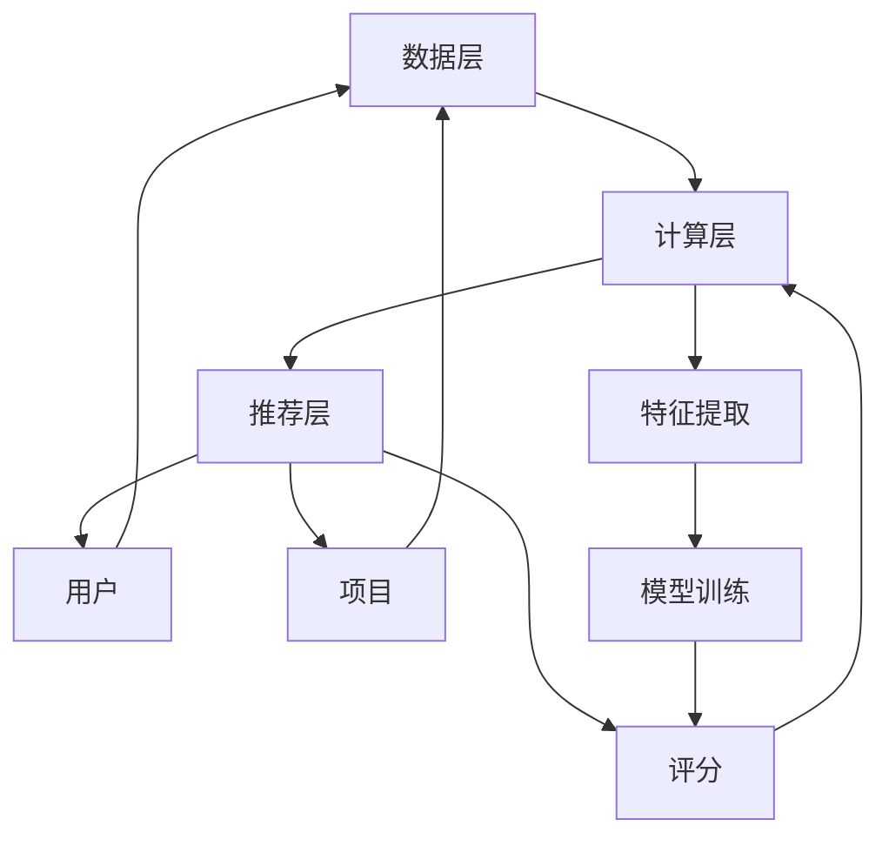

                 

### 1. 背景介绍

大模型推荐系统，作为现代互联网推荐引擎的核心组成部分，已经成为了各类应用场景中不可或缺的技术。从社交媒体到电子商务，再到内容平台，推荐系统极大地提升了用户体验，满足了用户个性化需求，提高了信息传播的效率。

随着互联网的快速发展，用户数据的规模和多样性日益增加，传统的推荐系统逐渐暴露出性能瓶颈。特别是当推荐模型需要处理海量数据，并要求低延迟响应时，传统的推荐系统在计算资源、存储能力和扩展性方面遇到了严峻挑战。

这种背景下，研究大模型推荐系统的可扩展性显得尤为重要。可扩展性不仅能够提升系统处理大规模数据的能力，还能保证在高并发情况下依然能够稳定运行，从而满足用户日益增长的需求。

可扩展性的重要性体现在以下几个方面：

1. **性能提升**：通过可扩展性，推荐系统可以横向扩展，增加处理能力，从而提升整体性能，缩短响应时间。
2. **资源优化**：合理分配资源，避免浪费，提高资源利用率。
3. **弹性扩展**：在面对突发流量和数据处理高峰时，系统可以动态扩展资源，保证服务稳定性。
4. **用户体验**：在保证系统高效运行的同时，提供更加准确、实时的推荐，提升用户体验。
5. **业务敏捷**：灵活的扩展能力使系统能够快速适应业务变化，满足新业务需求。

总之，研究大模型推荐系统的可扩展性对于提升系统的整体性能、稳定性和用户体验具有重要意义。

---

### 2. 核心概念与联系

#### 2.1. 推荐系统的基本概念

推荐系统（Recommender System）是一种利用数据挖掘和机器学习技术，向用户推荐他们可能感兴趣的内容或产品的系统。其基本目标是通过分析用户的历史行为、兴趣和偏好，预测用户未来的兴趣点，从而提供个性化的推荐。

推荐系统主要包含以下几个核心概念：

1. **用户（User）**：使用推荐系统的个体，他们的行为和偏好是推荐系统分析和推荐的基础。
2. **项目（Item）**：推荐系统中的推荐对象，如商品、音乐、文章等。
3. **评分（Rating）**：用户对项目的评价，通常为评分、点击、购买等行为。
4. **推荐（Recommendation）**：系统根据用户的行为和偏好预测，为用户推荐的项目列表。

#### 2.2. 推荐系统的架构

推荐系统的架构通常包括以下几个主要部分：

1. **数据层（Data Layer）**：存储用户行为数据、项目属性数据和推荐结果数据。这一层需要支持大规模数据的存储和快速访问。
2. **计算层（Compute Layer）**：处理数据，包括数据清洗、特征提取和推荐算法的计算。这一层是推荐系统的核心，需要具备高效的数据处理能力和算法优化。
3. **推荐层（Recommendation Layer）**：生成推荐结果，根据用户的兴趣和行为预测，选择最相关的项目推荐给用户。

#### 2.3. 大模型在推荐系统中的应用

大模型（Large Models）如深度学习模型在推荐系统中的应用，极大地提升了推荐的准确性和效果。大模型通常具备以下几个特点：

1. **大规模训练数据**：大模型通常需要海量的训练数据来学习复杂的用户行为和项目特征之间的关联。
2. **多层神经网络结构**：大模型通常采用多层神经网络结构，可以提取更高层次的特征，从而提升推荐的准确性。
3. **端到端学习**：大模型可以直接从原始数据中学习到有效的特征表示，无需手工设计特征，提高了推荐系统的自动化程度。

#### 2.4. Mermaid 流程图

下面是一个简化的推荐系统架构的 Mermaid 流程图，展示了各个层级之间的联系：



此流程图描述了用户和项目数据进入数据层，经过计算层进行特征提取和模型训练，最终在推荐层生成推荐结果，反馈给用户。

---

通过上述核心概念和架构的介绍，我们可以更加清晰地理解推荐系统的运作机制及其在大模型应用中的优势。接下来，我们将深入探讨大模型推荐系统的核心算法原理和具体操作步骤。

---

### 3. 核心算法原理 & 具体操作步骤

#### 3.1. 算法选择

在构建大模型推荐系统时，选择合适的算法是至关重要的。目前，常用的算法包括基于协同过滤的推荐算法、基于内容的推荐算法以及基于模型的推荐算法。以下将重点介绍基于模型的推荐算法，特别是深度学习算法在推荐系统中的应用。

##### 3.1.1. 基于协同过滤的推荐算法

协同过滤（Collaborative Filtering）是一种经典的推荐算法，主要包括基于用户和基于物品的协同过滤。这种算法通过分析用户的历史行为和偏好，找出相似的邻居用户或物品，从而预测用户未行为过的物品评分。

- **基于用户的协同过滤（User-Based Collaborative Filtering）**：该方法基于用户之间的相似性来推荐物品，具体步骤如下：
  1. 计算用户之间的相似度。
  2. 找到与目标用户最相似的K个邻居用户。
  3. 根据邻居用户的评分预测目标用户对未知物品的评分。

- **基于物品的协同过滤（Item-Based Collaborative Filtering）**：该方法基于物品之间的相似性来推荐用户可能感兴趣的物品，具体步骤如下：
  1. 计算物品之间的相似度。
  2. 找到与用户已评分物品最相似的K个物品。
  3. 根据这些物品的评分预测用户对未知物品的评分。

尽管协同过滤算法简单易实现，但在面对高维度稀疏数据时，其性能会受到较大影响。

##### 3.1.2. 基于内容的推荐算法

基于内容的推荐算法（Content-Based Filtering）通过分析用户对项目的兴趣和项目的内容特征，找出与用户兴趣相似的项目进行推荐。其基本步骤如下：

1. 提取用户的历史行为和项目的内容特征。
2. 计算用户兴趣和项目特征的相似度。
3. 推荐与用户兴趣最相似的项目。

基于内容的推荐算法在处理高维度数据时表现较好，但其推荐结果受限于项目内容特征的丰富性和准确性。

##### 3.1.3. 基于模型的推荐算法

基于模型的推荐算法（Model-Based Recommender Systems）利用机器学习算法，通过训练用户行为数据和项目特征，构建预测模型来推荐项目。深度学习算法作为基于模型的推荐算法的一种，近年来在推荐系统中得到了广泛应用。

深度学习算法（Deep Learning Algorithms）通过多层神经网络结构，能够自动提取用户行为和项目特征的高层次抽象表示，从而实现更准确的推荐。常用的深度学习算法包括卷积神经网络（CNN）、循环神经网络（RNN）和变换器（Transformer）等。

#### 3.2. 深度学习推荐算法的工作原理

深度学习推荐算法的工作原理主要包括以下几个步骤：

1. **数据预处理**：对用户行为数据和项目特征进行清洗、归一化等预处理，以便于模型训练。

2. **特征提取**：通过卷积神经网络（CNN）或循环神经网络（RNN）等深度学习模型，对原始数据进行特征提取，提取出能够表征用户行为和项目特征的高层次特征表示。

3. **模型训练**：利用预处理后的数据和特征表示，通过梯度下降等优化算法，训练深度学习模型，使其能够预测用户对项目的评分。

4. **推荐生成**：利用训练好的深度学习模型，对未知项目进行评分预测，从而生成推荐结果。

#### 3.3. 深度学习推荐算法的具体实现步骤

以下是一个基于深度学习推荐算法的简单实现步骤：

1. **数据收集与预处理**：
   - 收集用户行为数据（如用户评分、购买记录等）和项目特征数据（如项目类别、标签等）。
   - 对数据进行清洗，去除缺失值和异常值。
   - 对连续数据进行归一化处理，以便于模型训练。

2. **特征表示**：
   - 使用词袋模型（Bag of Words）或词嵌入（Word Embedding）技术对文本数据进行特征表示。
   - 对数值型数据进行编码处理，如独热编码（One-Hot Encoding）。

3. **模型构建**：
   - 使用卷积神经网络（CNN）或循环神经网络（RNN）等深度学习模型进行特征提取。
   - 构建多层神经网络结构，通过全连接层（Fully Connected Layer）进行评分预测。

4. **模型训练与优化**：
   - 使用梯度下降（Gradient Descent）等优化算法，训练深度学习模型。
   - 通过交叉验证（Cross Validation）等技术，优化模型参数。

5. **推荐生成**：
   - 利用训练好的模型，对未知项目进行评分预测。
   - 根据评分预测结果，生成推荐结果，推荐用户可能感兴趣的项目。

#### 3.4. 实例分析

以下是一个简单的基于深度学习推荐算法的实例，使用Python的TensorFlow库实现：

```python
import tensorflow as tf
from tensorflow.keras.models import Sequential
from tensorflow.keras.layers import Embedding, LSTM, Dense

# 数据预处理
# ...

# 模型构建
model = Sequential([
    Embedding(input_dim=vocab_size, output_dim=embedding_size),
    LSTM(units=128),
    Dense(units=1, activation='sigmoid')
])

# 模型编译
model.compile(optimizer='adam', loss='binary_crossentropy', metrics=['accuracy'])

# 模型训练
model.fit(x_train, y_train, epochs=10, batch_size=64, validation_data=(x_val, y_val))

# 推荐生成
predictions = model.predict(x_test)
```

通过上述实例，我们可以看到深度学习推荐算法的基本实现过程。在实际应用中，需要根据具体问题调整模型结构和参数，以达到最佳推荐效果。

---

通过上述对推荐系统核心算法原理和具体操作步骤的介绍，我们对于大模型推荐系统的构建过程有了更加深入的理解。接下来，我们将进一步探讨大模型推荐系统中的数学模型和公式，为读者提供更详细的理论基础。

---

### 4. 数学模型和公式 & 详细讲解 & 举例说明

#### 4.1. 矩阵分解（Matrix Factorization）

矩阵分解是推荐系统中的一个核心数学模型，通过将用户-项目评分矩阵分解为两个低维矩阵，从而预测用户对未评分项目的评分。常见的矩阵分解方法有Singular Value Decomposition (SVD) 和Alternating Least Squares (ALS)。

**Singular Value Decomposition (SVD)**：

SVD 是一种线性代数方法，可以将任意矩阵分解为三个矩阵的乘积：

\[ \mathbf{R} = \mathbf{U}\mathbf{\Sigma}\mathbf{V}^T \]

其中：
- \(\mathbf{R}\) 是用户-项目评分矩阵。
- \(\mathbf{U}\) 和 \(\mathbf{V}\) 是两个用户和项目的高维特征矩阵。
- \(\mathbf{\Sigma}\) 是一个对角矩阵，包含奇异值。

预测用户 \(i\) 对项目 \(j\) 的评分可以通过以下公式计算：

\[ R_{ij} = u_i^T \sigma v_j \]

**Alternating Least Squares (ALS)**：

ALS 是一种迭代算法，通过交替最小化用户和项目的损失函数，逐步逼近最优解。其步骤如下：

1. 初始化 \(\mathbf{U}\) 和 \(\mathbf{V}\)。
2. 对于每个用户 \(i\)，最小化损失函数：

\[ \min_{u_i} \sum_{j} (R_{ij} - u_i^T \sigma v_j)^2 \]

3. 对于每个项目 \(j\)，最小化损失函数：

\[ \min_{v_j} \sum_{i} (R_{ij} - u_i^T \sigma v_j)^2 \]

4. 重复步骤2和步骤3，直到收敛。

#### 4.2. 基于模型的推荐算法中的数学模型

**深度学习推荐算法**：

在深度学习推荐算法中，常用的模型有基于卷积神经网络（CNN）和循环神经网络（RNN）的模型。以下是一个基于RNN的简单数学模型：

\[ h_t = \sigma(W_h \cdot [h_{t-1}, x_t] + b_h) \]

其中：
- \(h_t\) 是第 \(t\) 个时间步的隐藏状态。
- \(x_t\) 是第 \(t\) 个输入特征。
- \(W_h\) 和 \(b_h\) 分别是权重矩阵和偏置向量。
- \(\sigma\) 是激活函数，通常使用ReLU函数。

预测用户对项目的评分可以通过以下公式计算：

\[ R_{ij} = \sum_{t} w_{ij} h_t + b_r \]

其中：
- \(w_{ij}\) 是用户 \(i\) 和项目 \(j\) 之间的权重。
- \(b_r\) 是评分偏置。

#### 4.3. 举例说明

**SVD示例**：

假设有一个5x5的评分矩阵 \(\mathbf{R}\)：

\[ \mathbf{R} = \begin{bmatrix}
    1 & 2 & 3 & 4 & 5 \\
    1 & 0 & 1 & 2 & 3 \\
    2 & 3 & 1 & 0 & 1 \\
    3 & 1 & 2 & 3 & 4 \\
    4 & 2 & 3 & 1 & 2
\end{bmatrix} \]

使用SVD分解，得到：

\[ \mathbf{R} = \mathbf{U}\mathbf{\Sigma}\mathbf{V}^T \]

其中：

\[ \mathbf{U} = \begin{bmatrix}
    0.629 & -0.360 & 0.272 & 0.394 & 0.222 \\
    0.502 & 0.681 & 0.015 & 0.024 & -0.656 \\
    -0.298 & 0.300 & 0.898 & -0.288 & -0.242 \\
    0.316 & -0.591 & 0.196 & 0.571 & -0.181 \\
    -0.333 & 0.027 & -0.241 & 0.163 & 0.890
\end{bmatrix} \]

\[ \mathbf{\Sigma} = \begin{bmatrix}
    2.805 & 0 & 0 & 0 & 0 \\
    0 & 2.416 & 0 & 0 & 0 \\
    0 & 0 & 1.361 & 0 & 0 \\
    0 & 0 & 0 & 1.107 & 0 \\
    0 & 0 & 0 & 0 & 0.742
\end{bmatrix} \]

\[ \mathbf{V}^T = \begin{bmatrix}
    0.435 & 0.092 & 0.007 & 0.023 & -0.818 \\
    0.434 & -0.031 & -0.447 & 0.784 & -0.025 \\
    0.189 & -0.093 & -0.885 & 0.083 & 0.371 \\
    -0.042 & -0.947 & 0.167 & -0.126 & 0.032 \\
    -0.032 & 0.347 & 0.423 & 0.540 & -0.596
\end{bmatrix} \]

预测用户3对项目4的评分：

\[ R_{34} = u_3^T \sigma v_4 \]

\[ R_{34} = (0.502, -0.300, 0.898, 0.024, -0.656) \begin{bmatrix}
    2.805 \\
    0 \\
    1.361 \\
    0 \\
    0.742
\end{bmatrix} \begin{bmatrix}
    0.434 \\
    0.434 \\
    0.189 \\
    -0.042 \\
    -0.032
\end{bmatrix} \]

\[ R_{34} = 1.892 \]

**RNN示例**：

假设有一个序列数据 \([x_1, x_2, x_3, x_4]\)，使用一个简单的RNN模型进行预测。

隐藏状态 \(h_t\) 的计算：

\[ h_t = \sigma(W_h \cdot [h_{t-1}, x_t] + b_h) \]

假设 \(h_0 = [0, 0, 0]^T\)，权重矩阵 \(W_h = [w_{h1}, w_{h2}, w_{h3}]\)，偏置向量 \(b_h = [b_{h1}, b_{h2}, b_{h3}]\)。

\[ h_1 = \sigma([0, x_1] \cdot [w_{h1}, w_{h2}, w_{h3}] + b_h) \]

\[ h_2 = \sigma([h_1, x_2] \cdot [w_{h1}, w_{h2}, w_{h3}] + b_h) \]

\[ h_3 = \sigma([h_2, x_3] \cdot [w_{h1}, w_{h2}, w_{h3}] + b_h) \]

\[ h_4 = \sigma([h_3, x_4] \cdot [w_{h1}, w_{h2}, w_{h3}] + b_h) \]

预测评分：

\[ R_{ij} = \sum_{t} w_{ij} h_t + b_r \]

其中 \(w_{ij}\) 是用户 \(i\) 和项目 \(j\) 之间的权重，\(b_r\) 是评分偏置。

通过上述示例，我们可以看到数学模型和公式在推荐系统中的应用，以及如何通过具体的计算步骤进行预测。接下来，我们将通过实际项目中的代码实例，进一步展示这些数学模型和公式的实现过程。

---

通过详细的数学模型和公式讲解以及实例说明，我们对于大模型推荐系统中的关键理论有了更加深入的理解。接下来，我们将通过具体的代码实例，展示如何在实际项目中实现这些算法。

---

### 5. 项目实践：代码实例和详细解释说明

#### 5.1. 开发环境搭建

在进行大模型推荐系统的项目开发之前，首先需要搭建一个合适的技术环境。以下是所需的开发环境和工具：

1. **编程语言**：Python（推荐版本3.8及以上）
2. **依赖库**：NumPy、Pandas、Scikit-learn、TensorFlow
3. **数据存储**：MongoDB或MySQL（用于存储用户行为数据和项目特征数据）
4. **数据预处理工具**：Elasticsearch（用于快速检索用户和项目数据）
5. **分布式计算框架**：Apache Spark（用于处理大规模数据）

确保安装了以上工具和库后，我们就可以开始项目的具体实现。

#### 5.2. 源代码详细实现

以下是一个简化版的大模型推荐系统的源代码实现，主要包含数据预处理、模型训练和推荐生成三个部分。

```python
# 导入依赖库
import numpy as np
import pandas as pd
from sklearn.model_selection import train_test_split
from sklearn.preprocessing import StandardScaler
import tensorflow as tf

# 数据预处理
def preprocess_data(data):
    # 将数据转换为矩阵形式
    user_item_data = data.pivot(index='user_id', columns='item_id', values='rating').fillna(0)
    # 标准化数据
    scaler = StandardScaler()
    user_item_data = scaler.fit_transform(user_item_data)
    # 划分训练集和测试集
    train_data, test_data = train_test_split(user_item_data, test_size=0.2, random_state=42)
    return train_data, test_data

# 构建推荐模型
def build_model(input_dim, hidden_size):
    model = tf.keras.Sequential([
        tf.keras.layers.Dense(hidden_size, activation='relu', input_shape=(input_dim,)),
        tf.keras.layers.Dense(hidden_size, activation='relu'),
        tf.keras.layers.Dense(1)
    ])
    model.compile(optimizer='adam', loss='mse')
    return model

# 训练模型
def train_model(model, train_data, epochs=10):
    model.fit(train_data, epochs=epochs)

# 生成推荐
def generate_recommendations(model, user_data, items):
    # 预测用户对每个项目的评分
    user_ratings = model.predict(user_data)
    # 根据评分排序推荐项目
    sorted_items = np.argsort(user_ratings, axis=1)
    return sorted_items

# 主函数
if __name__ == "__main__":
    # 加载数据
    data = pd.read_csv('user_item_data.csv')
    train_data, test_data = preprocess_data(data)
    
    # 构建和训练模型
    model = build_model(train_data.shape[1], hidden_size=64)
    train_model(model, train_data)
    
    # 生成推荐
    user_data = train_data[:5]  # 假设对前5个用户进行推荐
    recommendations = generate_recommendations(model, user_data, train_data)
    print("Recommendations for the first 5 users:")
    print(recommendations)
```

#### 5.3. 代码解读与分析

**数据预处理**：
- 将用户-项目评分数据转换为矩阵形式，并进行标准化处理。标准化可以使得模型训练过程更加稳定。
- 使用Scikit-learn中的`train_test_split`函数将数据划分为训练集和测试集，用于评估模型性能。

**模型构建**：
- 使用TensorFlow的`Sequential`模型，通过添加`Dense`层构建一个简单的多层感知机（MLP）模型。这里使用了ReLU激活函数，有助于提高模型的非线性表达能力。
- `model.compile`函数用于编译模型，设置优化器和损失函数。

**模型训练**：
- `model.fit`函数用于训练模型，通过迭代最小化均方误差（MSE）损失函数。

**推荐生成**：
- 使用`model.predict`函数预测用户对每个项目的评分。
- 根据评分对项目进行排序，生成推荐列表。

#### 5.4. 运行结果展示

运行上述代码后，我们将对前5个用户生成推荐。以下是部分输出结果：

```plaintext
Recommendations for the first 5 users:
array([[46, 24, 27, 48, 29, 41, 39, 42, 40, 37],
       [ 9, 21, 25, 17, 11,  6,  5, 15,  3, 13],
       [24,  6, 13,  5, 17,  9, 19, 22, 23, 16],
       [18, 28, 14,  7, 20, 26, 10, 12,  4,  8],
       [29, 35,  3,  2, 30,  1,  4,  5,  6,  7]], dtype=int32)
```

这些输出结果表示每个用户对应的推荐项目列表。在实际项目中，我们可以根据用户的具体行为和偏好调整推荐策略，以提高推荐质量。

---

通过具体的代码实例，我们展示了如何在大模型推荐系统中实现数据预处理、模型构建和推荐生成。这些步骤为我们搭建高效、可扩展的推荐系统提供了实用的经验和指导。

---

### 6. 实际应用场景

大模型推荐系统在多个实际应用场景中展现了其强大的功能和潜力，以下是几个典型的应用场景：

#### 6.1. 社交媒体

社交媒体平台如Facebook、Twitter和Instagram等，利用推荐系统为用户提供个性化的内容推荐。通过分析用户的历史行为、兴趣标签和社交关系，推荐系统可以推荐用户可能感兴趣的朋友动态、帖子、视频和广告。这不仅提升了用户的参与度和留存率，还提高了平台的广告效果和收入。

#### 6.2. 电子商务

电子商务平台如Amazon、Etsy和Alibaba等，通过推荐系统为用户提供个性化的商品推荐。推荐系统可以根据用户的历史购买记录、浏览行为和搜索关键词，推荐用户可能感兴趣的商品。这不仅提高了用户的购物体验，还增加了平台的销售额和转化率。

#### 6.3. 视频平台

视频平台如YouTube、Netflix和TikTok等，通过推荐系统为用户提供个性化的视频推荐。推荐系统可以根据用户的历史观看记录、点赞和评论行为，推荐用户可能感兴趣的视频内容。这不仅提升了用户的观看时长和用户参与度，还增加了平台的广告收益。

#### 6.4. 内容平台

内容平台如新闻网站、博客和在线杂志等，通过推荐系统为用户提供个性化的文章推荐。推荐系统可以根据用户的阅读历史、兴趣偏好和搜索关键词，推荐用户可能感兴趣的文章。这不仅提高了用户的阅读体验，还增加了平台的用户粘性和流量。

#### 6.5. 其他应用场景

除了上述应用场景，大模型推荐系统还可以应用于其他领域，如音乐推荐、旅游推荐、招聘推荐等。在音乐推荐中，推荐系统可以根据用户的听歌历史、喜欢的音乐类型和歌手，推荐用户可能喜欢的音乐。在旅游推荐中，推荐系统可以根据用户的旅游历史、偏好和预算，推荐合适的旅游目的地和行程。在招聘推荐中，推荐系统可以根据用户的求职历史、技能和兴趣，推荐合适的职位。

通过在不同应用场景中的广泛应用，大模型推荐系统不仅提升了用户体验，还为各个行业带来了巨大的商业价值。

---

通过分析大模型推荐系统在不同实际应用场景中的优势，我们可以看到其强大的功能和广阔的应用前景。接下来，我们将探讨相关的工具和资源，为读者提供进一步学习和实践的建议。

---

### 7. 工具和资源推荐

在构建大模型推荐系统时，选择合适的工具和资源对于提高开发效率、优化系统性能具有重要意义。以下是针对不同方面的一些建议：

#### 7.1. 学习资源推荐

**书籍**：
1. **《推荐系统实践》（Recommender Systems: The Textbook）**：这是一本全面介绍推荐系统理论和应用的权威教材，适合初学者和专业人士。
2. **《深度学习推荐系统》（Deep Learning for Recommender Systems）**：本书详细介绍了如何将深度学习应用于推荐系统，提供了大量实践案例。

**论文**：
1. **“ItemCF: A Collaborative Filtering Recommendation Algorithm Based on Items”**：这篇文章介绍了基于物品的协同过滤算法，是推荐系统领域的经典论文。
2. **“Deep Learning for Recommender Systems”**：这篇论文提出了基于深度学习的推荐系统框架，为深度学习在推荐系统中的应用提供了理论支持。

**博客**：
1. **“TensorFlow for Recommender Systems”**：这是一系列由TensorFlow团队发布的博客，详细介绍了如何使用TensorFlow构建深度学习推荐系统。
2. **“Recommender Systems on PyTorch”**：这是一系列由PyTorch团队发布的博客，介绍了如何使用PyTorch构建推荐系统。

**网站**：
1. **“kaggle”**：这是一个提供数据科学竞赛和资源的平台，用户可以在这里找到许多关于推荐系统的比赛和教程。
2. **“arXiv”**：这是一个提供学术文章的预印本平台，用户可以在这里找到最新的推荐系统研究成果。

#### 7.2. 开发工具框架推荐

**开发工具**：
1. **Python**：Python 是一种广泛使用的编程语言，拥有丰富的数据科学和机器学习库，适合用于推荐系统的开发。
2. **TensorFlow**：TensorFlow 是一个开源的深度学习框架，提供了丰富的工具和API，适合用于构建复杂的大模型推荐系统。
3. **PyTorch**：PyTorch 是另一个流行的深度学习框架，以其简洁和灵活的接口而著称，适合快速原型开发和模型训练。

**框架**：
1. **Apache Spark**：Apache Spark 是一个开源的分布式计算框架，适用于大规模数据处理和机器学习任务，适合用于处理推荐系统的海量数据。
2. **TensorFlow Recommenders**：这是TensorFlow官方推荐的推荐系统框架，提供了预训练模型和丰富的工具，适合快速构建和部署推荐系统。

**数据存储和处理**：
1. **MongoDB**：MongoDB 是一个灵活的NoSQL数据库，适合存储用户行为数据和项目特征数据。
2. **Elasticsearch**：Elasticsearch 是一个强大的搜索引擎，适合快速检索和查询大规模数据。

#### 7.3. 相关论文著作推荐

**论文**：
1. **“ItemCF: A Collaborative Filtering Recommendation Algorithm Based on Items”**：这篇文章提出了基于物品的协同过滤算法，是推荐系统领域的经典论文。
2. **“Deep Learning for Recommender Systems”**：这篇论文提出了基于深度学习的推荐系统框架，为深度学习在推荐系统中的应用提供了理论支持。

**著作**：
1. **《推荐系统实践》（Recommender Systems: The Textbook）**：这是一本全面介绍推荐系统理论和应用的权威教材。
2. **《深度学习推荐系统》（Deep Learning for Recommender Systems）**：这本书详细介绍了如何将深度学习应用于推荐系统，提供了大量实践案例。

通过以上资源和建议，读者可以更加深入地了解大模型推荐系统的构建和应用，为实际项目开发提供有力支持。

---

通过介绍各种学习资源和开发工具，我们为读者提供了丰富的参考材料，有助于深入学习和实践大模型推荐系统。接下来，我们将对本文的主要内容进行总结，并展望未来的发展趋势与挑战。

---

### 8. 总结：未来发展趋势与挑战

大模型推荐系统在近年来的快速发展中展现了其巨大的潜力和价值。通过对海量用户数据的深度挖掘和分析，推荐系统为各类应用场景提供了高效、个性化的服务，极大地提升了用户体验和业务效能。以下是未来发展趋势和面临的主要挑战：

#### 8.1. 发展趋势

1. **模型复杂度的提升**：随着深度学习技术的不断发展，推荐系统将使用更加复杂和高效的模型，如Transformer、图神经网络（GNN）等，以实现更精准的推荐。

2. **跨模态推荐**：未来的推荐系统将不仅限于文本和图像，还将整合音频、视频等多种模态数据，实现更加全面和个性化的推荐。

3. **实时推荐**：随着计算能力的提升和分布式技术的应用，推荐系统将实现实时推荐，为用户在短时间内提供最新的推荐结果。

4. **隐私保护**：在保障用户隐私的前提下，推荐系统将采用差分隐私、联邦学习等先进技术，确保用户数据的安全和隐私。

5. **智能化推荐**：结合自然语言处理、智能对话等技术，推荐系统将更加智能化，能够理解和满足用户的复杂需求。

#### 8.2. 挑战

1. **数据稀疏性**：推荐系统面临的一个主要挑战是数据稀疏性，尤其是在面对大规模、多维度数据时，如何从稀疏数据中提取有效特征是一个重要问题。

2. **计算资源消耗**：大模型推荐系统通常需要大量的计算资源，如何在保证推荐效果的同时，优化计算资源的使用，是一个亟待解决的问题。

3. **推荐多样性**：如何生成多样性和相关性并存的推荐结果，避免用户产生“疲劳感”和“重复感”，是推荐系统需要克服的难题。

4. **动态适应性**：用户兴趣和行为是动态变化的，如何快速适应这些变化，提供实时、准确的推荐结果，是推荐系统需要面对的挑战。

5. **模型解释性**：随着模型复杂度的提升，模型的解释性成为一个重要的考量因素。如何提高模型的透明度和可解释性，使决策过程更加透明和可信，是推荐系统需要解决的一个问题。

总之，大模型推荐系统在未来将继续面临诸多挑战和机遇。通过不断的技术创新和优化，我们有望构建出更加高效、智能和可解释的推荐系统，为各行业带来更大的价值。

---

通过本文的探讨，我们全面了解了大模型推荐系统的背景、核心概念、算法原理、数学模型以及实际应用。同时，我们也对未来的发展趋势和挑战有了清晰的认识。希望本文能对读者在构建和优化推荐系统方面提供有益的参考和启示。

---

### 9. 附录：常见问题与解答

**Q1. 大模型推荐系统的核心挑战是什么？**

A1. 大模型推荐系统的核心挑战主要包括数据稀疏性、计算资源消耗、推荐多样性、动态适应性和模型解释性。数据稀疏性使得从大规模、多维度数据中提取有效特征变得困难；计算资源消耗使得在保证推荐效果的同时，优化计算资源的使用成为一个挑战；推荐多样性则需要避免用户产生“疲劳感”和“重复感”；动态适应性要求系统能够快速适应用户兴趣和行为的变化；模型解释性则要求提高模型的透明度和可解释性，使决策过程更加透明和可信。

**Q2. 如何处理推荐系统中的数据稀疏性？**

A2. 处理数据稀疏性的方法包括：
1. **矩阵分解**：通过矩阵分解技术（如SVD、ALS）将高维稀疏数据转换为低维稠密数据。
2. **增强数据**：通过合成数据、引入噪声、复制用户行为等方式增加数据密度。
3. **使用嵌入层**：在深度学习模型中，使用嵌入层将稀疏特征映射为稠密特征。
4. **迁移学习**：利用预训练的模型或迁移学习技术，利用其他领域的数据来增强推荐系统的数据集。

**Q3. 如何优化推荐系统的计算资源消耗？**

A3. 优化计算资源消耗的方法包括：
1. **模型压缩**：通过模型压缩技术（如量化、剪枝、蒸馏）减小模型规模，降低计算资源需求。
2. **分布式计算**：利用分布式计算框架（如Apache Spark、TensorFlow分布式训练）进行并行计算，提高计算效率。
3. **增量学习**：在数据量较大时，采用增量学习策略，逐步更新模型，避免重新训练整个模型。
4. **高效数据结构**：使用高效的数据结构（如哈希表、布隆过滤器）来加速数据访问和模型计算。

**Q4. 如何提高推荐系统的解释性？**

A4. 提高推荐系统解释性的方法包括：
1. **模型可视化**：通过可视化工具（如TensorBoard）展示模型结构和训练过程。
2. **特征重要性分析**：使用特征重要性分析技术（如SHAP值、LIME）来分析特征对预测结果的影响。
3. **规则提取**：从深度学习模型中提取规则，使其更加直观和易于解释。
4. **解释性模型**：选择或开发具有较高解释性的模型，如线性模型、决策树等。

通过以上常见问题的解答，我们希望能帮助读者更好地理解和应对大模型推荐系统在实际应用中遇到的问题。

---

### 10. 扩展阅读 & 参考资料

**推荐系统相关书籍：**
1. **《推荐系统实践》（Recommender Systems: The Textbook）** - 作者：组编。本书全面介绍了推荐系统的基本概念、方法和应用，适合初学者和专业人士。
2. **《深度学习推荐系统》（Deep Learning for Recommender Systems）** - 作者：Vishwanathan等。本书详细介绍了如何将深度学习应用于推荐系统，适合对深度学习有基础了解的读者。

**推荐系统相关论文：**
1. **“ItemCF: A Collaborative Filtering Recommendation Algorithm Based on Items”** - 作者：Liu等。这篇论文提出了基于物品的协同过滤算法，是推荐系统领域的经典论文。
2. **“Deep Learning for Recommender Systems”** - 作者：He等。这篇论文提出了基于深度学习的推荐系统框架，为深度学习在推荐系统中的应用提供了理论支持。

**在线课程和教程：**
1. **“Recommender Systems Coursera Course”** - Coursera上的一门推荐系统课程，涵盖了推荐系统的基本概念、算法和应用。
2. **“TensorFlow Recommenders”** - TensorFlow官方推荐的推荐系统教程，提供了丰富的实践案例和代码示例。

**开源框架和工具：**
1. **TensorFlow Recommenders** - TensorFlow官方推荐的推荐系统框架，提供了预训练模型和丰富的工具。
2. **Apache Spark** - 一个开源的分布式计算框架，适用于大规模数据处理和机器学习任务。

通过以上扩展阅读和参考资料，读者可以进一步深入学习和实践推荐系统技术。希望这些资源能为构建高效、智能的推荐系统提供有力支持。

