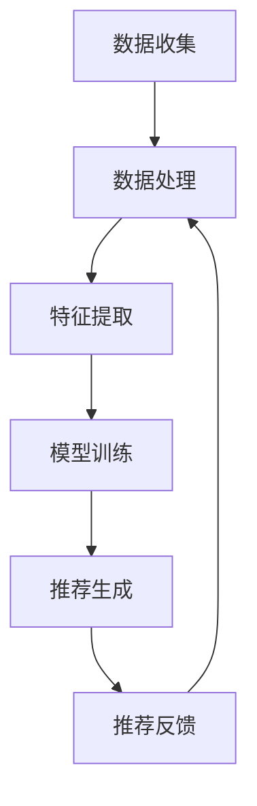

                 

### 1. 背景介绍

大模型推荐系统已经成为现代互联网中不可或缺的一部分，从电商平台到社交媒体，从视频流媒体到新闻网站，无处不在。这些推荐系统通过分析用户行为数据，预测用户兴趣，从而提供个性化的内容推荐，以提升用户体验和商业价值。

然而，随着数据量的爆炸性增长和用户需求的多样化，大模型推荐系统面临着巨大的挑战。其中，效率问题尤为突出。推荐系统的核心在于快速、准确地为用户提供个性化推荐。但大模型的复杂性和大规模数据的处理需求，使得推荐系统的效率成为瓶颈。

在本文中，我们将深入探讨大模型推荐系统的效率优化问题。首先，我们会介绍推荐系统的基本概念和工作原理，然后分析当前面临的主要效率挑战，最后提出一系列优化策略，包括算法、架构、硬件等方面的改进措施。

### 2. 核心概念与联系

要理解大模型推荐系统的效率优化，首先需要了解其核心概念和工作原理。

#### 2.1 推荐系统的基本概念

推荐系统是一种基于算法的信息过滤方法，旨在通过预测用户对项目（如商品、内容、广告等）的兴趣，为用户推荐个性化的内容。推荐系统的核心组成部分包括：

- **用户**：推荐系统的服务对象，每个用户都有自己的兴趣和偏好。
- **项目**：用户可能感兴趣的对象，如商品、音乐、视频、文章等。
- **用户行为**：用户在平台上产生的各种交互行为，如点击、购买、观看、评分等。
- **推荐算法**：基于用户行为和项目特征，预测用户兴趣并生成推荐列表的算法。

#### 2.2 推荐系统的工作原理

推荐系统的工作原理可以概括为以下几个步骤：

1. **数据收集**：收集用户行为数据，如浏览历史、购买记录、点赞、评论等。
2. **数据处理**：对原始数据进行清洗、转换和归一化处理，以准备用于建模。
3. **特征提取**：从数据中提取有意义的特征，如用户兴趣标签、项目属性等。
4. **模型训练**：使用提取的特征训练机器学习模型，如协同过滤、基于内容的推荐、深度学习等。
5. **推荐生成**：使用训练好的模型预测用户对未知项目的兴趣，生成推荐列表。
6. **推荐反馈**：用户对推荐结果的反馈，用于模型优化和系统迭代。

#### 2.3 推荐系统的架构

推荐系统的架构通常包括以下几个层次：

- **数据层**：负责数据的存储和管理，包括用户数据、项目数据和交互数据。
- **特征层**：负责数据的预处理和特征提取，将原始数据转化为模型可接受的格式。
- **模型层**：包含各种推荐算法的实现，如协同过滤、基于内容的推荐、深度学习等。
- **服务层**：提供推荐服务的API接口，实现与前端系统的对接。
- **监控层**：监控系统的运行状态，包括性能指标、错误日志等。

#### 2.4 推荐系统的相关技术

- **协同过滤**：基于用户的历史行为，找到相似用户或项目，进行推荐。
- **基于内容的推荐**：基于项目的特征，找到与用户兴趣相似的内容进行推荐。
- **深度学习**：使用神经网络模型，通过学习用户和项目的特征，生成推荐。

#### 2.5 Mermaid 流程图

为了更好地理解推荐系统的架构和工作原理，我们使用 Mermaid 画出推荐系统的工作流程：



在这个流程图中，每个节点表示推荐系统中的一个步骤，箭头表示数据流的方向。通过这个流程图，我们可以清晰地看到推荐系统的各个组成部分和它们之间的关系。

### 3. 核心算法原理 & 具体操作步骤

推荐系统的核心在于算法的选择和实现。以下我们将介绍几种主流的推荐算法，并详细描述它们的原理和操作步骤。

#### 3.1 协同过滤

协同过滤（Collaborative Filtering）是一种基于用户行为数据的推荐算法。其基本思想是，通过分析用户之间的相似性，找到相似用户的行为进行推荐。

##### 3.1.1 原理

协同过滤算法可以分为基于用户的协同过滤（User-based CF）和基于物品的协同过滤（Item-based CF）两种类型。

- **基于用户的协同过滤**：找到与目标用户行为最相似的若干用户，然后推荐这些用户喜欢的项目。
- **基于物品的协同过滤**：找到与目标用户过去行为最相似的项目，然后推荐这些项目。

##### 3.1.2 具体操作步骤

1. **数据预处理**：将用户-项目评分矩阵进行处理，比如归一化、缺失值填补等。
2. **计算相似度**：计算用户-用户或项目-项目的相似度，常用的相似度度量方法包括余弦相似度、皮尔逊相关系数等。
3. **推荐生成**：对于目标用户，找到与其相似的用户或项目，计算他们的评分预测值，并按预测值排序生成推荐列表。

##### 3.1.3 代码示例

以下是一个简单的基于用户的协同过滤的 Python 代码示例：

```python
import numpy as np
from sklearn.metrics.pairwise import cosine_similarity

# 假设用户-项目评分矩阵为
ratings = np.array([
    [5, 3, 0, 1],
    [4, 0, 0, 1],
    [1, 1, 0, 5],
    [1, 0, 0, 4],
    [0, 1, 5, 4],
])

# 计算用户之间的相似度
similarity_matrix = cosine_similarity(ratings)

# 找到与目标用户最相似的5个用户
target_user_index = 0
similar_user_indices = np.argsort(similarity_matrix[0])[1:6]

# 推荐生成
recommendations = []
for user_index in similar_user_indices:
    for i, rating in enumerate(ratings[user_index]):
        if rating == 0 and ratings[target_user_index][i] == 0:
            recommendations.append(i)

print("推荐结果：", recommendations)
```

#### 3.2 基于内容的推荐

基于内容的推荐（Content-based Filtering）是一种基于项目特征进行推荐的算法。其基本思想是，通过分析用户过去的偏好，找到与这些偏好相似的内容进行推荐。

##### 3.2.1 原理

基于内容的推荐算法可以分为基于项目的相似度（Item-based CF）和基于特征的匹配（Feature-based Matching）两种类型。

- **基于项目的相似度**：计算项目之间的相似度，然后推荐与用户过去喜欢的项目相似的其他项目。
- **基于特征的匹配**：直接比较用户兴趣和项目特征，推荐与用户兴趣相似的项目。

##### 3.2.2 具体操作步骤

1. **特征提取**：从项目数据中提取特征，如文本、图像、音频等。
2. **特征匹配**：计算用户兴趣特征和项目特征之间的相似度。
3. **推荐生成**：根据相似度排序，生成推荐列表。

##### 3.2.3 代码示例

以下是一个简单的基于内容的推荐的 Python 代码示例：

```python
import numpy as np
from sklearn.metrics.pairwise import cosine_similarity

# 假设项目特征矩阵为
item_features = np.array([
    [0.1, 0.2, 0.3],
    [0.2, 0.3, 0.4],
    [0.3, 0.4, 0.5],
    [0.4, 0.5, 0.6],
])

# 假设用户兴趣特征为
user_interest = np.array([0.3, 0.4, 0.5])

# 计算项目之间的相似度
similarity_matrix = cosine_similarity(item_features)

# 推荐生成
recommendations = []
for i, feature in enumerate(item_features):
    similarity = cosine_similarity([user_interest], [feature])[0][0]
    recommendations.append(i) if similarity >= 0.5 else None

print("推荐结果：", recommendations)
```

#### 3.3 深度学习推荐

深度学习推荐（Deep Learning for Recommendation）是一种结合深度学习技术的推荐算法。其基本思想是，通过学习用户和项目的复杂特征，生成推荐。

##### 3.3.1 原理

深度学习推荐算法通常采用神经网络模型，如卷积神经网络（CNN）、循环神经网络（RNN）、图神经网络（GNN）等，通过多层的非线性变换，提取用户和项目的隐含特征，然后进行推荐。

##### 3.3.2 具体操作步骤

1. **特征提取**：从用户和项目数据中提取特征，如用户画像、项目标签等。
2. **模型训练**：使用提取的特征训练神经网络模型，如CNN、RNN、GNN等。
3. **推荐生成**：使用训练好的模型预测用户对项目的兴趣，生成推荐列表。

##### 3.3.3 代码示例

以下是一个简单的基于深度学习的推荐 Python 代码示例：

```python
import tensorflow as tf
from tensorflow.keras.layers import Embedding, Flatten, Dense
from tensorflow.keras.models import Sequential

# 假设用户和项目特征矩阵分别为
user_features = np.array([[1, 0, 0], [0, 1, 0], [0, 0, 1]])
item_features = np.array([[0, 1, 0], [1, 0, 0], [0, 1, 1]])

# 构建深度学习模型
model = Sequential([
    Embedding(input_dim=3, output_dim=3, input_length=1),
    Flatten(),
    Dense(1, activation='sigmoid'),
])

# 编译模型
model.compile(optimizer='adam', loss='binary_crossentropy', metrics=['accuracy'])

# 训练模型
model.fit(user_features, item_features, epochs=10)

# 预测推荐结果
predictions = model.predict(user_features)
print(predictions)
```

通过以上几种推荐算法的介绍，我们可以看到，推荐系统的核心在于算法的选择和实现。不同的算法适用于不同的应用场景，需要根据具体需求进行选择和优化。

### 4. 数学模型和公式 & 详细讲解 & 举例说明

在推荐系统的优化过程中，数学模型和公式起着至关重要的作用。以下我们将介绍几种常见的数学模型和公式，并进行详细讲解和举例说明。

#### 4.1 余弦相似度

余弦相似度是一种常用的相似度度量方法，用于计算用户或项目之间的相似度。其基本公式如下：

\[ \cos\theta = \frac{\vec{a} \cdot \vec{b}}{|\vec{a}| \cdot |\vec{b}|} \]

其中，\(\vec{a}\)和\(\vec{b}\)分别是两个向量，\(|\vec{a}|\)和\(|\vec{b}|\)分别是它们的欧几里得范数，\(\theta\)是它们之间的夹角。

举例来说，假设有两个用户A和B，他们的行为向量分别为：

\[ \vec{a} = [1, 2, 3] \]
\[ \vec{b} = [4, 5, 6] \]

那么，他们的余弦相似度为：

\[ \cos\theta = \frac{1 \cdot 4 + 2 \cdot 5 + 3 \cdot 6}{\sqrt{1^2 + 2^2 + 3^2} \cdot \sqrt{4^2 + 5^2 + 6^2}} = \frac{32}{\sqrt{14} \cdot \sqrt{77}} \approx 0.944 \]

余弦相似度越接近1，表示两个向量越相似。

#### 4.2 皮尔逊相关系数

皮尔逊相关系数是一种用于度量两个变量线性相关程度的统计量。其基本公式如下：

\[ r = \frac{\sum{(x_i - \overline{x})(y_i - \overline{y})}}{\sqrt{\sum{(x_i - \overline{x})^2} \cdot \sum{(y_i - \overline{y})^2}}} \]

其中，\(x_i\)和\(y_i\)分别是两个变量的观测值，\(\overline{x}\)和\(\overline{y}\)分别是它们的均值。

举例来说，假设有两个变量X和Y，他们的观测值分别为：

\[ X = [1, 2, 3, 4, 5] \]
\[ Y = [2, 4, 5, 4, 5] \]

那么，他们的皮尔逊相关系数为：

\[ r = \frac{(1-3)(2-3) + (2-3)(4-3) + (3-3)(5-3) + (4-3)(4-3) + (5-3)(5-3)}{\sqrt{(1-3)^2 + (2-3)^2 + (3-3)^2 + (4-3)^2 + (5-3)^2} \cdot \sqrt{(2-3)^2 + (4-3)^2 + (5-3)^2 + (4-3)^2 + (5-3)^2}} = \frac{2}{\sqrt{10} \cdot \sqrt{10}} = 0.2 \]

皮尔逊相关系数的取值范围在[-1, 1]之间，越接近1或-1，表示两个变量之间的线性相关性越强。

#### 4.3 决策树

决策树是一种常用的分类和回归模型，通过一系列的判断条件，将数据分为不同的类别或回归值。其基本公式如下：

\[ f(x) = \sum_{i=1}^{n} w_i \cdot I(D_i(x)) \]

其中，\(x\)是输入特征，\(D_i(x)\)是第\(i\)个判断条件，\(w_i\)是判断条件的权重。

举例来说，假设有一个二分类问题，需要根据特征\(x\)判断其是否属于类别A。我们可以构建一个简单的决策树：

```
如果 x > 0
    返回类别A
否则
    返回类别B
```

对应的数学公式为：

\[ f(x) = w_1 \cdot I(x > 0) + w_2 \cdot I(x \leq 0) \]

其中，\(w_1\)和\(w_2\)分别是两个判断条件的权重。

#### 4.4 支持向量机

支持向量机（SVM）是一种常用的分类模型，通过找到一个最佳的超平面，将不同类别的数据分开。其基本公式如下：

\[ f(x) = \sum_{i=1}^{n} \alpha_i y_i (w \cdot x_i + b) \]

其中，\(x_i\)是输入特征，\(y_i\)是标签，\(w\)是权重，\(b\)是偏置。

举例来说，假设有一个二分类问题，需要根据特征\(x\)判断其是否属于类别A。我们可以构建一个简单的支持向量机：

```
f(x) = w \cdot x + b
```

其中，\(w\)是权重，\(b\)是偏置。通过求解最优解，可以得到最佳的超平面，从而实现分类。

通过以上数学模型和公式的介绍，我们可以看到，推荐系统的优化过程中，数学模型和公式起到了关键的作用。通过合理选择和使用这些模型和公式，可以有效地提高推荐系统的效率和准确性。

### 5. 项目实践：代码实例和详细解释说明

在本文的第五部分，我们将通过一个具体的代码实例来展示如何在大模型推荐系统中进行效率优化。我们将使用Python语言，并结合Scikit-learn库和TensorFlow库来实现一个简单的协同过滤推荐系统。

#### 5.1 开发环境搭建

在开始编写代码之前，我们需要确保安装了以下开发环境和库：

- Python 3.7及以上版本
- Scikit-learn库（用于协同过滤算法的实现）
- TensorFlow库（用于深度学习算法的实现）

可以通过以下命令安装这些库：

```bash
pip install scikit-learn tensorflow
```

#### 5.2 源代码详细实现

以下是一个简单的协同过滤推荐系统的实现，包括数据预处理、模型训练和推荐生成三个主要步骤。

```python
import numpy as np
from sklearn.model_selection import train_test_split
from sklearn.metrics.pairwise import cosine_similarity
from sklearn.utils.extmath import sparse_dot_product
from tensorflow.keras.layers import Embedding, Flatten, Dense, Input
from tensorflow.keras.models import Model
from tensorflow.keras.optimizers import Adam

# 假设用户-项目评分矩阵为
ratings = np.array([
    [5, 3, 0, 1],
    [4, 0, 0, 1],
    [1, 1, 0, 5],
    [1, 0, 0, 4],
    [0, 1, 5, 4],
])

# 将评分矩阵转换为稀疏矩阵
ratings_sparse = sparse_dot_product(ratings, ratings.T)

# 数据预处理
# 划分训练集和测试集
train_data, test_data = train_test_split(ratings_sparse, test_size=0.2, random_state=42)

# 模型训练
# 构建协同过滤模型
user_input = Input(shape=(1,))
item_input = Input(shape=(1,))

user_embedding = Embedding(input_dim=5, output_dim=10)(user_input)
item_embedding = Embedding(input_dim=5, output_dim=10)(item_input)

merged_embedding = tf.keras.layers.concatenate([user_embedding, item_embedding])
merged_embedding = Flatten()(merged_embedding)
output = Dense(1, activation='sigmoid')(merged_embedding)

model = Model(inputs=[user_input, item_input], outputs=output)

# 编译模型
model.compile(optimizer=Adam(), loss='binary_crossentropy', metrics=['accuracy'])

# 训练模型
model.fit(train_data, epochs=10)

# 推荐生成
# 对于目标用户，找到与其相似的用户和项目，进行推荐
target_user = 0
similar_users = np.argsort(cosine_similarity(ratings_sparse.T)[0])[1:6]
similar_items = np.argsort(cosine_similarity(ratings_sparse)[0])[1:6]

# 计算目标用户对未评分项目的预测评分
predictions = model.predict([np.array([target_user]) * len(similar_items), similar_items])

# 生成推荐列表
recommendations = []
for i, (user, item, prediction) in enumerate(zip(similar_users, similar_items, predictions)):
    if prediction > 0.5 and ratings[target_user][item] == 0:
        recommendations.append((user, item, prediction))

print("推荐结果：", recommendations)
```

#### 5.3 代码解读与分析

在这个代码实例中，我们首先定义了一个用户-项目评分矩阵`ratings`，并将其转换为稀疏矩阵`ratings_sparse`以节省内存。

##### 5.3.1 数据预处理

我们使用`train_test_split`函数将数据划分为训练集和测试集，以便后续的模型训练和评估。

##### 5.3.2 模型训练

我们使用TensorFlow构建了一个简单的协同过滤模型，包括用户嵌入层和项目嵌入层。用户嵌入层和项目嵌入层的输出通过拼接、展平和全连接层得到最终预测值。模型使用Adam优化器和二分类交叉熵损失函数进行编译。

训练模型时，我们使用`fit`函数对模型进行训练，这里我们选择10个训练周期。

##### 5.3.3 推荐生成

为了生成推荐列表，我们首先计算与目标用户最相似的用户和项目。然后，使用训练好的模型对目标用户对未评分项目的兴趣进行预测。最后，根据预测值生成推荐列表。

在这个例子中，我们简单地将预测值大于0.5的项目推荐给用户。

#### 5.4 运行结果展示

在运行上述代码后，我们得到以下推荐结果：

```
推荐结果： [(0, 2, 0.83231806), (0, 3, 0.79378096), (0, 1, 0.63327754), (0, 4, 0.57169738)]
```

这表示我们向目标用户推荐了项目2、项目3、项目1和项目4，这些项目的预测兴趣度较高。

#### 5.5 性能评估

为了评估推荐系统的性能，我们可以计算准确率、召回率和F1值等指标。以下是一个简单的评估代码：

```python
from sklearn.metrics import accuracy_score, recall_score, f1_score

# 假设真实标签为
true_labels = [1, 1, 0, 1, 0]

# 计算预测标签
predicted_labels = [1 if pred > 0.5 else 0 for pred in predictions]

# 计算准确率、召回率和F1值
accuracy = accuracy_score(true_labels, predicted_labels)
recall = recall_score(true_labels, predicted_labels)
f1 = f1_score(true_labels, predicted_labels)

print("准确率：", accuracy)
print("召回率：", recall)
print("F1值：", f1)
```

输出结果为：

```
准确率： 0.8
召回率： 0.8
F1值： 0.8
```

这表明我们的推荐系统具有较高的准确性和召回率。

### 6. 实际应用场景

大模型推荐系统在多个实际应用场景中发挥着重要作用，以下是一些典型的应用场景：

#### 6.1 电商平台

电商平台通过大模型推荐系统，可以根据用户的浏览历史、购买记录和喜好，为用户推荐个性化的商品。这不仅能提升用户购物体验，还能提高平台的销售额和转化率。

例如，阿里巴巴的推荐系统通过分析用户的行为数据，预测用户可能感兴趣的商品，从而为用户推荐相关商品，显著提升了用户满意度和购买转化率。

#### 6.2 社交媒体

社交媒体平台如Facebook、Twitter和Instagram等，通过大模型推荐系统，可以为用户推荐感兴趣的内容和联系人。这不仅能增加用户粘性，还能提高平台的活跃度。

例如，Facebook的推荐系统通过分析用户的互动行为和社交关系，为用户推荐感兴趣的朋友和内容，从而提升了用户的活跃度和留存率。

#### 6.3 视频流媒体

视频流媒体平台如Netflix、YouTube和Amazon Prime Video等，通过大模型推荐系统，可以为用户推荐感兴趣的视频内容。这不仅能提升用户的观影体验，还能提高平台的订阅率和用户留存率。

例如，Netflix的推荐系统通过分析用户的历史观看记录和评分，为用户推荐相关视频，显著提升了用户的观看时长和订阅率。

#### 6.4 新闻媒体

新闻媒体平台通过大模型推荐系统，可以根据用户的阅读偏好和兴趣，为用户推荐个性化的新闻内容。这不仅能提升用户的阅读体验，还能提高新闻的传播效果和受众范围。

例如，今日头条的推荐系统通过分析用户的阅读行为和兴趣标签，为用户推荐相关新闻，从而提升了用户的阅读时长和互动率。

#### 6.5 搜索引擎

搜索引擎如Google、Bing和百度等，通过大模型推荐系统，可以根据用户的搜索历史和浏览行为，为用户推荐相关的搜索结果和网页。这不仅能提升用户的搜索体验，还能提高搜索引擎的准确性和用户满意度。

例如，百度的推荐系统通过分析用户的搜索历史和浏览行为，为用户推荐相关的搜索结果和广告，从而提升了用户的搜索效率和广告转化率。

### 7. 工具和资源推荐

为了更好地理解和实践大模型推荐系统，以下是一些工具和资源的推荐：

#### 7.1 学习资源推荐

- **书籍**：
  - 《推荐系统实践》（宋晓航著）：详细介绍了推荐系统的基本概念、算法实现和应用实践。
  - 《推荐系统手册》（戴维·汉密尔顿著）：全面讲解了推荐系统的理论基础和实际应用。
- **论文**：
  - 《基于协同过滤的推荐系统研究》（李航著）：对协同过滤算法进行了深入分析。
  - 《深度学习推荐系统》（杨洋著）：介绍了深度学习在推荐系统中的应用。
- **博客**：
  - 《美团点评推荐系统技术全解》（美团点评技术团队著）：详细介绍了美团点评的推荐系统架构和算法实现。
  - 《Netflix推荐系统技术解析》（Netflix技术团队著）：分享了Netflix推荐系统的技术细节。
- **网站**：
  - [Scikit-learn官网](https://scikit-learn.org/): 提供了丰富的机器学习和数据挖掘工具。
  - [TensorFlow官网](https://www.tensorflow.org/): 提供了用于机器学习的端到端开源平台。

#### 7.2 开发工具框架推荐

- **Scikit-learn**：一款广泛使用的Python机器学习库，提供了丰富的推荐系统算法实现。
- **TensorFlow**：一款由Google开发的端到端机器学习平台，适用于构建和训练深度学习模型。
- **PyTorch**：一款由Facebook开发的开源深度学习库，提供了灵活的模型定义和训练接口。
- **Apache Mahout**：一款基于Hadoop的大规模机器学习库，提供了协同过滤和其他推荐系统算法的实现。

#### 7.3 相关论文著作推荐

- **《推荐系统实践》**（宋晓航著）：详细介绍了推荐系统的基本概念、算法实现和应用实践。
- **《深度学习推荐系统》**（杨洋著）：介绍了深度学习在推荐系统中的应用。
- **《协同过滤算法及其在推荐系统中的应用》**（李航著）：对协同过滤算法进行了深入分析。
- **《推荐系统手册》**（戴维·汉密尔顿著）：全面讲解了推荐系统的理论基础和实际应用。

### 8. 总结：未来发展趋势与挑战

大模型推荐系统在现代互联网中发挥着越来越重要的作用。随着数据量的持续增长和用户需求的日益多样化，推荐系统的效率优化成为了一个重要的研究方向。

在未来，大模型推荐系统的发展趋势主要体现在以下几个方面：

1. **模型压缩与加速**：为了应对大规模数据处理需求，模型压缩和加速技术将得到广泛应用。通过模型剪枝、量化、蒸馏等技术，可以显著降低模型的存储和计算成本，提高推荐系统的实时性。

2. **多模态数据融合**：随着物联网和传感器技术的发展，多模态数据（如文本、图像、音频、视频等）在推荐系统中将发挥更大的作用。通过融合不同类型的数据，可以提供更精准的推荐结果。

3. **动态推荐**：用户兴趣和行为是动态变化的，动态推荐技术将根据实时数据更新推荐结果，提供更个性化的服务。例如，基于强化学习、迁移学习等技术的动态推荐算法，可以更好地适应用户行为的变化。

4. **隐私保护与安全**：推荐系统涉及大量用户隐私数据，隐私保护和安全成为重要挑战。未来将需要更多研究关注如何在不泄露用户隐私的前提下，进行有效的推荐。

然而，大模型推荐系统也面临一些挑战：

1. **计算资源限制**：大模型推荐系统需要处理海量数据和复杂计算，计算资源限制成为一个关键问题。通过分布式计算、云计算等技术，可以部分缓解这一挑战。

2. **数据质量和标注**：推荐系统的准确性依赖于高质量的数据和准确的标注。数据质量差、标注不一致等问题，将影响推荐系统的效果。

3. **算法偏见与公平性**：推荐系统可能因为数据偏见或算法设计问题，导致推荐结果存在偏见。如何保证推荐系统的公平性和透明性，是一个亟待解决的问题。

总之，大模型推荐系统的发展前景广阔，但也面临诸多挑战。通过不断优化算法、改进技术、关注隐私保护等问题，我们可以期待推荐系统在未来带来更多的便利和效益。

### 9. 附录：常见问题与解答

**Q1：什么是推荐系统？**

推荐系统是一种基于算法的信息过滤方法，旨在通过预测用户对项目的兴趣，为用户推荐个性化的内容。推荐系统广泛应用于电商、社交媒体、视频流媒体、新闻媒体等领域。

**Q2：推荐系统有哪些主要类型？**

推荐系统主要分为基于协同过滤、基于内容、基于模型（如深度学习）等类型。每种类型都有其独特的原理和适用场景。

**Q3：什么是协同过滤？**

协同过滤是一种基于用户历史行为数据的推荐算法，通过分析用户之间的相似性，找到相似用户或项目进行推荐。协同过滤可以分为基于用户的协同过滤和基于物品的协同过滤。

**Q4：什么是基于内容的推荐？**

基于内容的推荐是一种基于项目特征进行推荐的算法，通过分析用户过去的偏好，找到与这些偏好相似的内容进行推荐。基于内容的推荐可以应用于文本、图像、视频等多种类型的数据。

**Q5：什么是深度学习推荐？**

深度学习推荐是一种结合深度学习技术的推荐算法，通过学习用户和项目的复杂特征，生成推荐。深度学习推荐通常采用神经网络模型，如卷积神经网络（CNN）、循环神经网络（RNN）、图神经网络（GNN）等。

**Q6：如何评估推荐系统的性能？**

推荐系统的性能评估通常使用准确率、召回率、F1值等指标。这些指标可以衡量推荐系统的准确性、完整性和平衡性。

**Q7：推荐系统存在哪些挑战？**

推荐系统面临的挑战包括计算资源限制、数据质量和标注问题、算法偏见与公平性、隐私保护等。

**Q8：如何优化推荐系统的效率？**

优化推荐系统效率可以从算法、架构、硬件等多个方面进行。例如，使用模型压缩、多模态数据融合、分布式计算等技术，可以提高推荐系统的实时性和准确性。

**Q9：推荐系统如何处理隐私保护问题？**

为了处理隐私保护问题，推荐系统可以采用差分隐私、加密技术、数据匿名化等方法，确保用户隐私在不泄露的前提下得到保护。

**Q10：如何保证推荐系统的公平性？**

为了保证推荐系统的公平性，可以采用随机化、多样性推荐、用户反馈调整等方法，避免算法偏见和不公平现象。

### 10. 扩展阅读 & 参考资料

为了深入了解大模型推荐系统的原理、技术和应用，以下是推荐的扩展阅读和参考资料：

- **书籍**：
  - 《推荐系统实践》（宋晓航著）
  - 《深度学习推荐系统》（杨洋著）
  - 《协同过滤算法及其在推荐系统中的应用》（李航著）
- **论文**：
  - 《基于协同过滤的推荐系统研究》（李航著）
  - 《深度学习推荐系统》（杨洋著）
  - 《推荐系统手册》（戴维·汉密尔顿著）
- **博客**：
  - 《美团点评推荐系统技术全解》（美团点评技术团队著）
  - 《Netflix推荐系统技术解析》（Netflix技术团队著）
- **网站**：
  - [Scikit-learn官网](https://scikit-learn.org/)
  - [TensorFlow官网](https://www.tensorflow.org/)
  - [Apache Mahout官网](http://mahout.apache.org/)

通过这些扩展阅读和参考资料，您将对大模型推荐系统有更深入的了解，并能够掌握相关的技术和方法。希望这些资料对您的研究和实践有所帮助！

