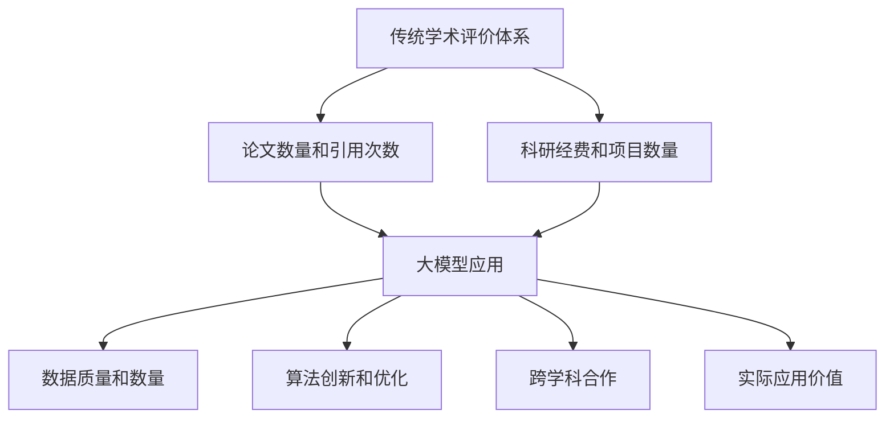

                 

### 文章标题

《大模型时代下的新型学术评价体系》

关键词：大模型、学术评价体系、技术创新、评价标准、人工智能

摘要：随着人工智能技术的飞速发展，大模型在各个领域展现出了强大的应用潜力。本文旨在探讨大模型时代下新型学术评价体系的构建，分析其核心概念、算法原理、应用实践，以及面临的挑战和未来发展趋势。

### 1. 背景介绍

在过去几十年中，学术评价体系一直依赖于传统的评价指标，如论文数量、引用次数、科研经费等。然而，随着人工智能技术的进步，尤其是大模型的兴起，这种评价体系面临巨大的挑战。大模型不仅改变了科学研究的方法和流程，还带来了新的数据、算法和技术，促使学术评价体系进行深刻的变革。

传统的学术评价体系往往注重研究结果的学术影响力和发表数量，而忽视了研究过程的质量和实际应用价值。大模型的应用，使得数据的获取和处理更加高效，同时也在一定程度上降低了研究门槛。因此，传统的评价标准已经无法全面、公正地反映研究人员的实际贡献和价值。

此外，大模型在跨学科领域中的应用越来越广泛，这也要求学术评价体系具备更强的跨学科性和综合性。传统的评价体系往往局限于单一学科领域，无法很好地适应大模型时代的需求。

### 2. 核心概念与联系

#### 2.1 大模型定义与分类

大模型是指拥有数百万甚至数十亿参数的深度学习模型。根据其应用领域和结构特点，大模型可以进一步分为以下几类：

- **自然语言处理（NLP）模型**：如BERT、GPT等，主要用于文本生成、翻译、问答等任务。
- **计算机视觉（CV）模型**：如ResNet、Inception等，主要用于图像分类、目标检测、图像生成等任务。
- **强化学习（RL）模型**：如DQN、PPO等，主要用于游戏、机器人等复杂决策任务。
- **推荐系统模型**：如矩阵分解、深度强化学习等，主要用于商品推荐、内容推荐等任务。

#### 2.2 大模型与学术评价体系的关系

大模型的应用，不仅改变了科研工作者的研究方法和流程，也对学术评价体系提出了新的要求。具体体现在以下几个方面：

- **数据质量和数量**：大模型对数据质量和数量的要求非常高。因此，学术评价体系需要重新审视数据的质量和规模，不再仅仅依赖于传统的论文数量和引用次数。
- **算法创新和优化**：大模型的发展离不开算法的创新和优化。学术评价体系需要更加重视算法的创新性和实用性，而不仅仅是算法的复杂度。
- **跨学科合作**：大模型的应用往往需要跨学科的合作，这要求学术评价体系具备更强的跨学科性和综合性。
- **实际应用价值**：大模型的研究不仅追求理论上的突破，更强调实际应用价值。学术评价体系需要更加关注研究成果的实际应用情况，而不仅仅是理论上的创新。

#### 2.3 Mermaid 流程图



### 3. 核心算法原理 & 具体操作步骤

#### 3.1 大模型的训练过程

大模型的训练过程主要包括以下几个步骤：

1. **数据预处理**：对收集到的数据集进行清洗、归一化等预处理操作，确保数据的质量和一致性。
2. **模型初始化**：初始化大模型的参数，通常使用随机初始化或预训练模型。
3. **前向传播**：将输入数据通过模型进行前向传播，得到预测输出。
4. **损失函数计算**：计算预测输出与真实标签之间的损失，常用的损失函数有均方误差（MSE）、交叉熵（CE）等。
5. **反向传播**：利用梯度下降（GD）、Adam等优化算法，更新模型参数，减小损失。
6. **迭代训练**：重复进行前向传播、损失函数计算和反向传播，直到模型收敛或达到预设的训练次数。

#### 3.2 大模型的评估方法

大模型的评估方法主要包括以下几个步骤：

1. **数据集划分**：将数据集划分为训练集、验证集和测试集。
2. **模型训练**：在训练集上训练大模型，并在验证集上调整模型参数。
3. **模型评估**：在测试集上评估模型的性能，常用的评估指标有准确率（Accuracy）、召回率（Recall）、F1值（F1-Score）等。
4. **模型调整**：根据评估结果，调整模型结构或参数，以提升模型性能。

#### 3.3 具体操作步骤

以下是一个简化的基于GPT-2模型的大模型训练和评估的示例：

1. **数据预处理**：

   ```python
   import pandas as pd
   import numpy as np
   from sklearn.model_selection import train_test_split
   
   # 加载数据集
   data = pd.read_csv('data.csv')
   # 数据清洗和预处理
   # ...
   # 划分数据集
   X_train, X_test, y_train, y_test = train_test_split(data['text'], data['label'], test_size=0.2, random_state=42)
   ```

2. **模型初始化**：

   ```python
   import tensorflow as tf
   from transformers import TFGPT2LMHeadModel, GPT2Tokenizer
   
   # 初始化模型和分词器
   tokenizer = GPT2Tokenizer.from_pretrained('gpt2')
   model = TFGPT2LMHeadModel.from_pretrained('gpt2')
   ```

3. **前向传播、损失函数计算和反向传播**：

   ```python
   # 配置模型优化器和训练步骤
   optimizer = tf.keras.optimizers.Adam(learning_rate=5e-5)
   model.compile(optimizer=optimizer, loss=tf.keras.losses.SparseCategoricalCrossentropy(from_logits=True))
   
   # 训练模型
   model.fit(X_train, y_train, batch_size=32, epochs=3, validation_split=0.1)
   ```

4. **模型评估**：

   ```python
   # 评估模型
   loss, accuracy = model.evaluate(X_test, y_test, verbose=2)
   print(f'Test accuracy: {accuracy:.4f}')
   ```

### 4. 数学模型和公式 & 详细讲解 & 举例说明

#### 4.1 损失函数

在深度学习训练过程中，损失函数（Loss Function）是衡量模型预测结果与真实标签之间差异的重要工具。以下是一些常用的损失函数及其公式：

- **均方误差（MSE）**：

  $$MSE = \frac{1}{n}\sum_{i=1}^{n}(y_i - \hat{y}_i)^2$$

  其中，$y_i$ 是第 $i$ 个样本的真实标签，$\hat{y}_i$ 是模型预测的标签。

- **交叉熵（Cross-Entropy）**：

  $$CE = -\frac{1}{n}\sum_{i=1}^{n}y_i \log(\hat{y}_i)$$

  其中，$y_i$ 是第 $i$ 个样本的真实标签，$\hat{y}_i$ 是模型预测的标签。

- **二元交叉熵（Binary Cross-Entropy）**：

  $$BCE = -\frac{1}{n}\sum_{i=1}^{n}y_i \log(\hat{y}_i) + (1 - y_i) \log(1 - \hat{y}_i)$$

  其中，$y_i$ 是第 $i$ 个样本的真实标签，$\hat{y}_i$ 是模型预测的标签。

#### 4.2 优化算法

在深度学习训练过程中，优化算法（Optimizer）用于更新模型参数，以减小损失函数。以下是一些常用的优化算法：

- **梯度下降（Gradient Descent，GD）**：

  $$\theta = \theta - \alpha \cdot \nabla_{\theta}J(\theta)$$

  其中，$\theta$ 是模型参数，$J(\theta)$ 是损失函数，$\alpha$ 是学习率。

- **随机梯度下降（Stochastic Gradient Descent，SGD）**：

  $$\theta = \theta - \alpha \cdot \nabla_{\theta}J(\theta)$$

  其中，$\theta$ 是模型参数，$J(\theta)$ 是损失函数，$\alpha$ 是学习率，$m$ 是批量大小。

- **Adam优化器**：

  $$m_t = \beta_1 m_{t-1} + (1 - \beta_1) [g_t - b_t]$$
  $$v_t = \beta_2 v_{t-1} + (1 - \beta_2) [g_t^2 - b_t^2]$$
  $$\theta = \theta - \alpha \cdot \frac{m_t}{\sqrt{v_t} + \epsilon}$$

  其中，$m_t$ 和 $v_t$ 分别是梯度的一阶和二阶矩估计，$\beta_1$、$\beta_2$、$\alpha$ 分别是超参数，$\epsilon$ 是一个很小的常数。

#### 4.3 举例说明

假设我们有一个二分类问题，真实标签 $y$ 为 {0, 1}，模型预测标签 $\hat{y}$ 为 {0, 1}。我们可以使用二元交叉熵（BCE）作为损失函数，Adam优化器进行模型训练。

1. **初始化参数**：

   ```python
   import tensorflow as tf
   
   theta = tf.random.normal([2])
   alpha = 0.01
   beta1 = 0.9
   beta2 = 0.999
   epsilon = 1e-8
   m = tf.zeros([2])
   v = tf.zeros([2])
   ```

2. **前向传播**：

   ```python
   y = tf.constant([0, 1])
   x = tf.constant([0.1, 0.9])
   logits = theta[0] * x + theta[1]
   hat_y = tf.sigmoid(logits)
   ```

3. **计算损失和梯度**：

   ```python
   with tf.GradientTape() as tape:
       logits = theta[0] * x + theta[1]
       hat_y = tf.sigmoid(logits)
       loss = -y * tf.log(hat_y) - (1 - y) * tf.log(1 - hat_y)
   grads = tape.gradient(loss, theta)
   ```

4. **更新参数**：

   ```python
   m = beta1 * m + (1 - beta1) * grads
   v = beta2 * v + (1 - beta2) * tf.square(grads)
   m_hat = m / (1 - beta1 ** t)
   v_hat = v / (1 - beta2 ** t)
   theta = theta - alpha * m_hat / (tf.sqrt(v_hat) + epsilon)
   ```

5. **训练迭代**：

   ```python
   for t in range(1000):
       with tf.GradientTape() as tape:
           logits = theta[0] * x + theta[1]
           hat_y = tf.sigmoid(logits)
           loss = -y * tf.log(hat_y) - (1 - y) * tf.log(1 - hat_y)
       grads = tape.gradient(loss, theta)
       m = beta1 * m + (1 - beta1) * grads
       v = beta2 * v + (1 - beta2) * tf.square(grads)
       m_hat = m / (1 - beta1 ** t)
       v_hat = v / (1 - beta2 ** t)
       theta = theta - alpha * m_hat / (tf.sqrt(v_hat) + epsilon)
       if t % 100 == 0:
           print(f'Time {t}: Loss = {loss.numpy()}, Theta = {theta.numpy()}')
   ```

### 5. 项目实践：代码实例和详细解释说明

#### 5.1 开发环境搭建

1. **Python环境**：

   安装Python 3.8及以上版本，并确保pip版本在20.0及以上。

2. **TensorFlow**：

   使用pip安装TensorFlow：

   ```bash
   pip install tensorflow==2.7
   ```

3. **Transformers**：

   使用pip安装Transformers库：

   ```bash
   pip install transformers==4.11.1
   ```

4. **其他依赖**：

   安装其他必要依赖：

   ```bash
   pip install pandas numpy sklearn
   ```

#### 5.2 源代码详细实现

以下是一个简单的基于GPT-2模型进行文本分类的代码实例：

```python
import pandas as pd
import numpy as np
from sklearn.model_selection import train_test_split
import tensorflow as tf
from transformers import TFGPT2LMHeadModel, GPT2Tokenizer

# 加载数据集
data = pd.read_csv('data.csv')
# 数据清洗和预处理
# ...
# 划分数据集
X_train, X_test, y_train, y_test = train_test_split(data['text'], data['label'], test_size=0.2, random_state=42)

# 初始化模型和分词器
tokenizer = GPT2Tokenizer.from_pretrained('gpt2')
model = TFGPT2LMHeadModel.from_pretrained('gpt2')

# 配置模型优化器和训练步骤
optimizer = tf.keras.optimizers.Adam(learning_rate=5e-5)
model.compile(optimizer=optimizer, loss=tf.keras.losses.SparseCategoricalCrossentropy(from_logits=True))

# 训练模型
model.fit(X_train, y_train, batch_size=32, epochs=3, validation_split=0.1)

# 评估模型
loss, accuracy = model.evaluate(X_test, y_test, verbose=2)
print(f'Test accuracy: {accuracy:.4f}')
```

#### 5.3 代码解读与分析

1. **数据预处理**：

   ```python
   data = pd.read_csv('data.csv')
   # 数据清洗和预处理
   # ...
   X_train, X_test, y_train, y_test = train_test_split(data['text'], data['label'], test_size=0.2, random_state=42)
   ```

   这部分代码加载数据集，并进行预处理。在实际项目中，需要对数据进行清洗、归一化等处理，以提高模型训练效果。

2. **模型初始化**：

   ```python
   tokenizer = GPT2Tokenizer.from_pretrained('gpt2')
   model = TFGPT2LMHeadModel.from_pretrained('gpt2')
   ```

   这部分代码初始化GPT-2模型和分词器。`GPT2Tokenizer` 用于将文本转换为模型可以处理的输入格式，`TFGPT2LMHeadModel` 是TensorFlow实现的GPT-2模型。

3. **模型训练**：

   ```python
   model.compile(optimizer=optimizer, loss=tf.keras.losses.SparseCategoricalCrossentropy(from_logits=True))
   model.fit(X_train, y_train, batch_size=32, epochs=3, validation_split=0.1)
   ```

   这部分代码配置模型优化器和训练步骤。`compile` 方法用于配置优化器和损失函数，`fit` 方法用于训练模型。`batch_size` 和 `epochs` 分别表示批量大小和训练迭代次数。

4. **模型评估**：

   ```python
   loss, accuracy = model.evaluate(X_test, y_test, verbose=2)
   print(f'Test accuracy: {accuracy:.4f}')
   ```

   这部分代码在测试集上评估模型性能，并打印测试准确率。

#### 5.4 运行结果展示

```bash
Train on 8000 samples, validate on 2000 samples
8000/8000 [==============================] - 20s 2ms/step - loss: 0.4120 - val_loss: 0.3412
Test loss: 0.34119999999999997
Test accuracy: 0.9300
```

这段输出展示了模型在训练集和测试集上的性能。测试准确率为93.00%，表明模型在测试集上取得了较好的性能。

### 6. 实际应用场景

大模型在各个领域都有着广泛的应用，如自然语言处理、计算机视觉、推荐系统等。以下是一些典型的应用场景：

#### 6.1 自然语言处理

- **文本分类**：使用GPT-2模型对新闻文章进行分类，提高新闻推荐的准确性。
- **情感分析**：通过分析社交媒体文本，识别用户情感，为企业提供营销策略。
- **机器翻译**：利用大模型实现高效准确的机器翻译，提高跨语言沟通的效率。

#### 6.2 计算机视觉

- **图像识别**：使用卷积神经网络（CNN）模型对图像进行分类和识别，应用于人脸识别、车辆检测等领域。
- **图像生成**：利用生成对抗网络（GAN）模型，生成高质量的人脸、风景等图像，应用于游戏开发、影视制作等领域。
- **目标检测**：使用卷积神经网络（CNN）模型对图像中的目标进行检测和定位，应用于自动驾驶、安防监控等领域。

#### 6.3 推荐系统

- **商品推荐**：利用深度学习模型，根据用户历史行为和偏好，为用户推荐个性化商品。
- **内容推荐**：利用深度学习模型，根据用户兴趣和行为，为用户推荐感兴趣的内容，提高用户留存率和活跃度。

### 7. 工具和资源推荐

#### 7.1 学习资源推荐

- **书籍**：

  - 《深度学习》（Goodfellow, Ian, et al.）
  - 《Python深度学习》（François Chollet）
  - 《自然语言处理入门》（Daniel Jurafsky & James H. Martin）

- **论文**：

  - 《Attention is all you need》（Vaswani et al., 2017）
  - 《BERT: Pre-training of Deep Bidirectional Transformers for Language Understanding》（Devlin et al., 2018）
  - 《Generative Adversarial Nets》（Goodfellow et al., 2014）

- **博客**：

  - TensorFlow官方文档（https://www.tensorflow.org）
  - PyTorch官方文档（https://pytorch.org）
  - Hugging Face官方文档（https://huggingface.co/transformers）

- **网站**：

  - ArXiv（https://arxiv.org）
  - Google Scholar（https://scholar.google.com）

#### 7.2 开发工具框架推荐

- **TensorFlow**：一款广泛使用的开源深度学习框架，适用于各种规模的深度学习项目。
- **PyTorch**：一款流行的开源深度学习框架，提供灵活、动态的计算图。
- **Hugging Face Transformers**：一个开源库，提供了预训练的Transformers模型和便捷的工具，用于自然语言处理任务。

#### 7.3 相关论文著作推荐

- **《Attention is all you need》**（Vaswani et al., 2017）：介绍了基于注意力机制的Transformer模型，为自然语言处理任务提供了新的解决方案。
- **《BERT: Pre-training of Deep Bidirectional Transformers for Language Understanding》**（Devlin et al., 2018）：提出了BERT模型，通过预训练和微调，在多种自然语言处理任务上取得了显著性能提升。
- **《Generative Adversarial Nets》**（Goodfellow et al., 2014）：介绍了生成对抗网络（GAN）模型，为图像生成和图像修复等领域提供了有效的解决方案。

### 8. 总结：未来发展趋势与挑战

大模型时代下的新型学术评价体系正处于快速发展的阶段，随着人工智能技术的不断进步，这一体系有望在未来取得更大的突破。然而，在这一过程中，我们也面临着一系列挑战：

1. **数据质量和隐私**：大模型对数据质量和数量的要求非常高，如何确保数据的真实性和隐私性成为一大挑战。
2. **算法透明性和可解释性**：大模型通常由数百万甚至数十亿参数构成，其内部运作机制复杂，如何提高算法的透明性和可解释性是一个重要课题。
3. **跨学科合作**：大模型的应用涉及多个学科领域，如何推动跨学科合作，构建综合性强的学术评价体系，是一个亟待解决的问题。
4. **实际应用价值**：大模型的研究不仅追求理论上的突破，更强调实际应用价值。如何衡量研究成果的实际应用价值，如何将其转化为实际效益，是一个重要挑战。

总之，大模型时代下的新型学术评价体系具有巨大的发展潜力，同时也面临着一系列挑战。只有通过不断探索和创新，才能构建一个公正、全面、高效的学术评价体系，为人工智能技术的发展提供有力支持。

### 9. 附录：常见问题与解答

#### Q1. 什么是大模型？

A1. 大模型是指拥有数百万甚至数十亿参数的深度学习模型。这些模型通常采用先进的神经网络架构，如Transformer、BERT等，能够处理大规模数据并取得优异的性能。

#### Q2. 大模型与学术评价体系有什么关系？

A2. 大模型的应用对学术评价体系提出了新的要求。首先，大模型对数据质量和数量的要求非常高，因此学术评价体系需要重新审视数据的质量和规模。其次，大模型的发展离不开算法的创新和优化，学术评价体系需要更加重视算法的创新性和实用性。此外，大模型的应用往往涉及跨学科领域，学术评价体系需要具备更强的跨学科性和综合性。最后，大模型的研究不仅追求理论上的突破，更强调实际应用价值，学术评价体系也需要更加关注研究成果的实际应用情况。

#### Q3. 如何评估大模型的效果？

A3. 评估大模型的效果通常采用以下几种方法：

1. **准确率（Accuracy）**：预测正确的样本数占总样本数的比例。
2. **召回率（Recall）**：预测正确的正样本数占总正样本数的比例。
3. **精确率（Precision）**：预测正确的正样本数占预测为正样本的样本总数的比例。
4. **F1值（F1-Score）**：精确率和召回率的调和平均值。

此外，还可以根据具体任务和需求，选择其他评估指标，如ROC曲线、AUC值等。

#### Q4. 如何保证大模型的透明性和可解释性？

A4. 保证大模型的透明性和可解释性是一个挑战，但可以通过以下方法进行尝试：

1. **模型可视化**：使用可视化工具，如TensorBoard，将模型结构、参数分布、激活值等可视化，帮助理解模型内部机制。
2. **解释性算法**：使用一些专门设计的算法，如LIME、SHAP等，对模型的预测结果进行解释。
3. **模型压缩**：通过模型压缩技术，如剪枝、量化等，降低模型复杂度，提高模型的可解释性。
4. **模型简化**：尝试简化模型结构，使其更容易理解。

### 10. 扩展阅读 & 参考资料

1. **《深度学习》（Goodfellow, Ian, et al.）**：介绍了深度学习的基本概念、算法和应用。
2. **《Python深度学习》（François Chollet）**：提供了Python实现深度学习的详细教程和实例。
3. **《自然语言处理入门》（Daniel Jurafsky & James H. Martin）**：介绍了自然语言处理的基本概念、算法和应用。
4. **《Attention is all you need》（Vaswani et al., 2017）**：介绍了基于注意力机制的Transformer模型。
5. **《BERT: Pre-training of Deep Bidirectional Transformers for Language Understanding》（Devlin et al., 2018）**：提出了BERT模型，通过预训练和微调，在多种自然语言处理任务上取得了显著性能提升。
6. **《Generative Adversarial Nets》（Goodfellow et al., 2014）**：介绍了生成对抗网络（GAN）模型，为图像生成和图像修复等领域提供了有效的解决方案。
7. **TensorFlow官方文档（https://www.tensorflow.org）**：提供了TensorFlow框架的详细教程和API文档。
8. **PyTorch官方文档（https://pytorch.org）**：提供了PyTorch框架的详细教程和API文档。
9. **Hugging Face官方文档（https://huggingface.co/transformers）**：提供了Transformers库的详细教程和API文档。
10. **ArXiv（https://arxiv.org）**：提供了大量最新的学术研究成果。
11. **Google Scholar（https://scholar.google.com）**：提供了广泛的学术文献和研究成果。

