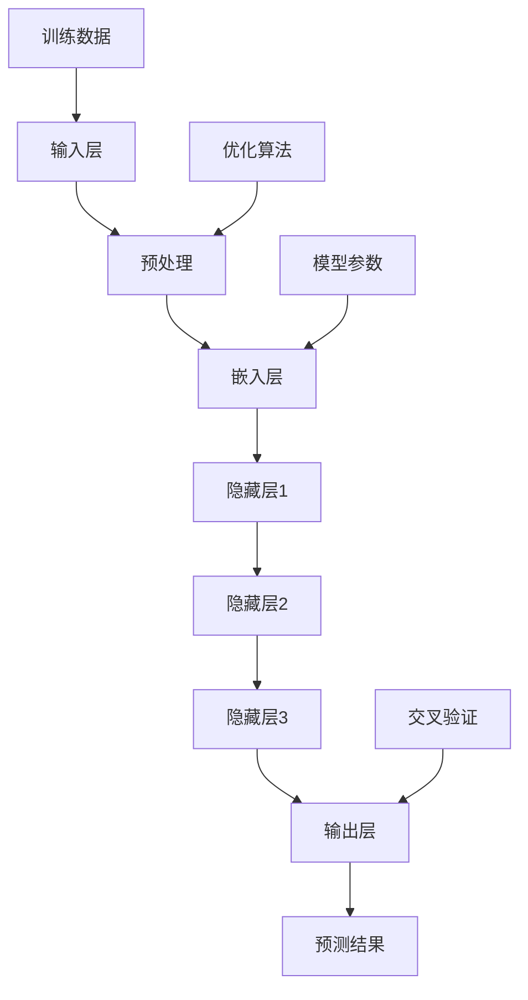

                 

### 背景介绍

近年来，随着人工智能技术的飞速发展，大模型（Large Models）逐渐成为了研究的热点。从早期的神经网络到如今的Transformer模型，大模型在自然语言处理、计算机视觉、推荐系统等领域展现出了强大的性能。这些模型通常具有数十亿甚至数万亿的参数，其训练和推理过程需要大量的计算资源和时间。然而，随着技术的进步，这些挑战也在逐步被克服。

在大模型时代，产品经理面临前所未有的挑战。首先，大模型的需求复杂，它们需要处理海量的数据，这要求产品经理对数据处理和存储有深入的了解。其次，大模型的开发和部署成本极高，产品经理需要找到合适的商业模式来支撑这些成本。此外，大模型的应用场景多样，产品经理需要准确把握市场需求，制定相应的产品策略。

面对这些挑战，产品经理需要不断学习和提升自己的技能。具体来说，以下五个方面的技能升级对于大模型时代的成功至关重要。

### 大模型对产品经理的挑战

1. **数据处理能力**

   大模型需要处理的数据量庞大，数据质量也对模型的性能有直接影响。产品经理需要掌握数据处理的基本原理，了解数据清洗、数据预处理和数据增强等关键技术。此外，产品经理还需要熟悉数据存储和访问的优化策略，以确保数据能够高效地供给大模型。

2. **算法和架构理解**

   大模型通常由多个子模块组成，每个模块都有自己的算法和架构。产品经理需要了解这些算法和架构的基本原理，以便在产品设计和优化过程中做出正确的决策。例如，产品经理需要知道如何选择合适的模型架构，如何调整模型的参数以优化性能等。

3. **计算资源管理**

   大模型的训练和推理过程需要大量的计算资源。产品经理需要了解不同类型的计算资源（如CPU、GPU、TPU等）的特点和适用场景，并能够根据实际需求合理配置资源。此外，产品经理还需要掌握分布式计算和并行计算的基本原理，以提高计算效率。

4. **商业模式设计**

   大模型的应用场景多样，产品经理需要设计合适的商业模式来回收成本并实现盈利。例如，产品经理可以考虑通过订阅模式、广告收入、交易费用等方式来获得收益。此外，产品经理还需要关注市场动态，及时调整商业模式以适应市场变化。

5. **用户体验优化**

   大模型的应用通常涉及复杂的交互流程，产品经理需要关注用户体验，确保产品易于使用且高效。产品经理需要了解用户体验设计的基本原理，例如如何设计直观的界面、如何优化交互流程等。

### 大模型时代的创业产品经理

在大模型时代，创业产品经理需要具备更广泛的知识和技能。他们不仅要熟悉技术，还需要具备商业洞察力和用户思维。以下是大模型时代创业产品经理的五大核心技能：

1. **技术知识**

   创业产品经理需要深入了解人工智能、大数据、云计算等前沿技术，了解大模型的基本原理和架构。这不仅有助于他们更好地理解产品，还能在技术选型和优化过程中提供有价值的建议。

2. **业务理解**

   创业产品经理需要深入理解所在行业的业务流程和用户需求，以便设计出符合市场需求的创新产品。例如，在医疗领域，产品经理需要了解医生和患者的需求，设计出符合医疗场景的智能诊断系统。

3. **数据思维**

   大模型需要处理大量的数据，创业产品经理需要具备数据思维，能够从海量数据中发现有价值的信息。这有助于他们优化产品功能、提升用户体验。

4. **团队协作**

   创业产品经理通常需要与多个部门合作，如技术、设计、市场等。他们需要具备良好的沟通和协作能力，确保团队能够高效协同，共同推动项目进展。

5. **创新思维**

   大模型的应用场景不断扩展，创业产品经理需要具备创新思维，不断寻找新的业务模式和产品功能，以保持竞争力。

总之，在大模型时代，创业产品经理面临前所未有的挑战和机遇。只有不断提升自己的技能，才能在激烈的市场竞争中脱颖而出。接下来，我们将详细探讨大模型的核心概念与联系，帮助读者更好地理解这一领域。

## 1.1 大模型的基本定义

大模型（Large Models）是人工智能领域中一种重要的技术，它通常指的是拥有数十亿甚至数万亿参数的深度学习模型。这些模型能够在处理大量数据时展现出强大的学习和预测能力。例如，在自然语言处理领域，GPT-3（一个由OpenAI开发的预训练语言模型）拥有1750亿个参数，其规模之大令人惊叹。

大模型的定义不仅局限于参数数量，还涉及到模型的架构、训练过程和部署方式。一个典型的大模型通常包括以下三个关键组成部分：

1. **参数数量**：大模型通常具有数十亿到数万亿的参数，这使得它们能够在处理复杂任务时具备更高的灵活性和表现力。
   
2. **训练数据量**：大模型需要大量数据进行训练，以使其能够充分学习和理解数据中的模式。例如，GPT-3的训练数据来自互联网上的大量文本，这为其提供了丰富的语言知识和上下文信息。

3. **计算资源**：由于大模型的参数数量和数据规模巨大，其训练和推理过程需要大量的计算资源，如GPU、TPU等。此外，大模型的训练时间通常也非常长，这要求产品经理具备良好的资源管理能力。

### 大模型的核心技术

大模型的核心技术包括以下几个方面：

1. **深度学习**：深度学习是一种基于多层神经网络的机器学习方法。大模型通常采用深度学习的架构，以实现高效的计算和强大的学习能力。

2. **预训练与微调**：预训练是指在大规模数据集上对模型进行训练，使其具备通用特征。微调是在预训练的基础上，针对特定任务对模型进行微调，以提升其在特定任务上的性能。

3. **迁移学习**：迁移学习是一种利用预训练模型在新任务上进行训练的方法。大模型通过迁移学习能够快速适应新任务，节省训练时间。

4. **优化算法**：大模型的训练过程通常涉及复杂的优化算法，如Adam、SGD等。这些算法能够有效地调整模型参数，提高训练效率。

5. **模型剪枝与量化**：为了降低大模型的计算复杂度和存储需求，模型剪枝和量化技术被广泛应用。模型剪枝通过去除冗余参数来简化模型，而量化则通过降低模型参数的精度来减少计算量。

### 大模型的架构与联系

大模型的架构通常包括以下几个层次：

1. **输入层**：输入层接收外部数据，如文本、图像等。这些数据经过预处理后，被输入到下一层。

2. **隐藏层**：隐藏层是模型的核心部分，包含多个层级。每个层级都会对输入数据进行处理和变换，以提取更多的特征。

3. **输出层**：输出层根据隐藏层处理后的特征，生成预测结果或决策。例如，在分类任务中，输出层会生成每个类别的概率分布。

大模型各层次之间的联系主要体现在以下几个方面：

1. **层次化特征提取**：每个隐藏层都会对输入数据进行处理，提取出更高层次的抽象特征。这种层次化特征提取使得大模型能够处理复杂的数据和任务。

2. **端到端的训练与推理**：大模型通过端到端的训练和推理，实现了从输入到输出的全流程自动化。这种端到端的架构简化了模型设计和优化过程，提高了训练和推理效率。

3. **多层交叉验证**：大模型通常采用多层交叉验证的方法，以提高模型性能和稳定性。交叉验证通过在不同层次上验证模型的预测能力，帮助产品经理更好地评估和优化模型。

总的来说，大模型是一种具有强大学习和预测能力的人工智能技术。它通过深度学习、预训练、迁移学习等技术，实现了对大规模数据的处理和挖掘。大模型的架构和联系使其能够高效地解决复杂任务，为产品经理提供了强大的工具和手段。

### Mermaid 流程图

以下是一个关于大模型架构与联系的 Mermaid 流程图，用于展示大模型的基本组件和它们之间的交互关系：



在这个流程图中：

- **A 输入层**：接收外部数据（如文本、图像等）。
- **B 预处理**：对输入数据进行预处理，如标准化、去噪等。
- **C 嵌入层**：将预处理后的数据转换为固定长度的向量。
- **D、E、F 隐藏层**：多层神经网络，对嵌入层输出的向量进行层次化特征提取。
- **G 输出层**：根据隐藏层提取的特征生成预测结果或决策。
- **H 预测结果**：输出层的输出结果。
- **I 训练数据**：用于模型训练的数据集。
- **J 优化算法**：用于调整模型参数的优化算法。
- **K 模型参数**：模型的参数集。
- **L 交叉验证**：在模型训练和推理过程中进行多层交叉验证。

这个流程图清晰地展示了大模型的基本工作流程和组件之间的关联，有助于读者更好地理解大模型的架构和原理。

## 3. 核心算法原理 & 具体操作步骤

在大模型中，核心算法的原理和具体操作步骤是理解和应用这些模型的关键。以下将详细介绍大模型的核心算法，包括深度学习、预训练与微调、迁移学习等，并解释如何实现这些算法。

### 3.1 深度学习

深度学习是构建大模型的基础，其核心思想是通过多层神经网络来模拟人脑的学习过程，从而对数据进行自动特征提取和分类。以下是深度学习的具体操作步骤：

1. **神经网络结构设计**：
   - **输入层**：接收输入数据，如文本、图像或声音等。
   - **隐藏层**：多层隐藏层用于提取数据的层次化特征。
   - **输出层**：根据隐藏层的特征进行分类或回归预测。

2. **前向传播**：
   - **数据输入**：输入数据通过输入层传递到第一层隐藏层。
   - **激活函数**：隐藏层使用激活函数（如ReLU、Sigmoid、Tanh等）对输入数据进行非线性变换，以提取更高层次的特征。
   - **权重更新**：通过反向传播算法更新隐藏层的权重，使其能够更好地拟合数据。

3. **反向传播**：
   - **计算误差**：通过比较输出层的预测值和实际标签值，计算损失函数（如均方误差、交叉熵等）。
   - **权重更新**：根据误差反向传播，更新各层的权重，以减少损失。

4. **优化算法**：
   - **梯度下降**：最常用的优化算法，通过计算梯度来更新模型参数。
   - **Adam、RMSprop**：更高级的优化算法，能够动态调整学习率，提高训练效率。

### 3.2 预训练与微调

预训练与微调是训练大模型的重要步骤。预训练在大规模数据集上进行，使模型具备通用特征；微调则在特定任务上进行，进一步调整模型参数以提高任务性能。

1. **预训练**：
   - **数据集选择**：选择大规模、多样化的数据集，如互联网文本、图像数据集等。
   - **模型初始化**：使用随机权重初始化模型。
   - **训练过程**：在大规模数据集上训练模型，使其学习通用特征。
   - **模型保存**：训练完成后，保存预训练模型。

2. **微调**：
   - **数据集选择**：选择与任务相关的数据集，如特定领域的文本、图像等。
   - **模型初始化**：使用预训练模型作为初始模型。
   - **训练过程**：在特定数据集上对预训练模型进行微调，以适应特定任务。
   - **模型评估**：通过交叉验证等方法评估模型性能，并根据评估结果进行调整。

### 3.3 迁移学习

迁移学习是一种利用预训练模型在新任务上快速训练的方法，通过利用预训练模型的知识来提高新任务的性能。

1. **预训练模型选择**：
   - 选择具有良好性能和通用特征的预训练模型，如BERT、GPT等。

2. **数据集选择**：
   - 选择与任务相关的数据集，如特定领域的文本、图像等。

3. **模型初始化**：
   - 使用预训练模型作为初始模型。

4. **训练过程**：
   - 在新任务数据集上对预训练模型进行训练，调整模型参数。
   - 可以使用迁移学习技术，如迁移学习权重、共享层等，以加速训练过程。

5. **模型评估**：
   - 通过交叉验证等方法评估模型在新任务上的性能。

### 3.4 模型剪枝与量化

为了降低大模型的计算复杂度和存储需求，模型剪枝和量化技术被广泛应用。

1. **模型剪枝**：
   - **参数剪枝**：通过去除冗余参数来简化模型。
   - **结构剪枝**：通过删除某些层或神经元来简化模型。

2. **量化**：
   - **浮点转整数**：将模型的浮点权重转换为整数权重，以减少计算量。
   - **量化感知训练**：在训练过程中对模型进行量化，使其适应量化后的计算环境。

### 3.5 模型部署与优化

1. **模型部署**：
   - **模型转换**：将训练完成的模型转换为适合部署的格式。
   - **部署环境**：选择合适的部署环境，如云端、边缘设备等。
   - **推理引擎**：使用推理引擎（如TensorFlow Serving、PyTorch JIT等）进行模型推理。

2. **模型优化**：
   - **计算优化**：通过优化计算路径、减少冗余计算来提高推理效率。
   - **内存优化**：通过内存管理策略减少内存占用。
   - **能效优化**：通过调整模型结构和参数，降低模型的能耗。

通过以上步骤，我们可以构建和优化一个大模型，以解决复杂的人工智能任务。在大模型时代，产品经理需要熟练掌握这些核心算法，并能够根据实际需求进行灵活调整和优化，以确保模型的高效运行和良好性能。

## 4. 数学模型和公式 & 详细讲解 & 举例说明

在理解大模型的数学模型和公式时，掌握基本的概念和符号是至关重要的。以下是关于大模型中常用的数学模型和公式的详细讲解，以及一个具体的例子来帮助读者更好地理解。

### 4.1 常用符号和术语

在讨论大模型的数学模型时，我们需要了解一些常用的符号和术语：

- **x**: 输入数据向量。
- **y**: 标签或真实值。
- **z**: 隐藏层输出。
- **W**: 权重矩阵。
- **b**: 偏置向量。
- **σ**: 激活函数，如ReLU、Sigmoid等。
- **L**: 网络层数。
- **f**: 损失函数，如交叉熵、均方误差等。

### 4.2 激活函数

激活函数是深度学习模型中的一个关键组件，它用于引入非线性特性，使得神经网络能够拟合复杂的非线性关系。以下是几种常用的激活函数：

1. **ReLU（Rectified Linear Unit）**：
   - 公式：\[ σ(x) = \max(0, x) \]
   - 优点：加速训练过程，减少梯度消失问题。

2. **Sigmoid**：
   - 公式：\[ σ(x) = \frac{1}{1 + e^{-x}} \]
   - 优点：输出范围在0到1之间，适用于二分类问题。

3. **Tanh**：
   - 公式：\[ σ(x) = \frac{e^x - e^{-x}}{e^x + e^{-x}} \]
   - 优点：输出范围在-1到1之间，非线性特性较强。

### 4.3 损失函数

损失函数是评估模型预测结果与真实值之间差异的指标，常用的损失函数包括：

1. **均方误差（Mean Squared Error, MSE）**：
   - 公式：\[ MSE = \frac{1}{n}\sum_{i=1}^{n}(y_i - \hat{y}_i)^2 \]
   - 优点：对于输出为实数的回归问题非常有效。

2. **交叉熵（Cross-Entropy）**：
   - 公式：\[ H(y, \hat{y}) = -\sum_{i=1}^{n}y_i \log(\hat{y}_i) \]
   - 优点：对于输出为概率分布的分类问题非常有效。

### 4.4 反向传播算法

反向传播算法是训练深度学习模型的核心算法，它通过计算梯度来更新模型的权重。以下是反向传播算法的基本步骤：

1. **前向传播**：
   - 计算每一层的输出值：\[ z_{l} = \sigma(W_{l-1}a_{l-1} + b_{l-1}) \]

2. **计算梯度**：
   - 计算输出层梯度：\[ \frac{\partial J}{\partial W_{L}} = \frac{\partial \hat{y}}{\partial z_{L}} \frac{\partial z_{L}}{\partial W_{L}} \]
   - 递归计算前一层梯度：\[ \frac{\partial J}{\partial W_{l}} = \frac{\partial z_{l+1}}{\partial W_{l}} \frac{\partial J}{\partial z_{l+1}} \]

3. **权重更新**：
   - 使用梯度下降或其他优化算法更新权重：\[ W_{l} = W_{l} - \alpha \frac{\partial J}{\partial W_{l}} \]

### 4.5 举例说明

假设我们有一个简单的多层感知机模型，用于对输入数据进行分类。输入数据为\[ x = [0.5, 0.7] \]，标签为\[ y = [1, 0] \]。

1. **模型参数**：
   - 输入层到隐藏层的权重：\[ W_1 = \begin{bmatrix} 0.1 & 0.2 \\ 0.3 & 0.4 \end{bmatrix} \]
   - 隐藏层到输出层的权重：\[ W_2 = \begin{bmatrix} 0.5 & 0.6 \\ 0.7 & 0.8 \end{bmatrix} \]
   - 偏置向量：\[ b_1 = \begin{bmatrix} 0.1 \\ 0.2 \end{bmatrix} \]
   - b_2 = \begin{bmatrix} 0.3 \\ 0.4 \end{bmatrix} \]

2. **前向传播**：
   - 隐藏层输出：\[ z_1 = \sigma(W_1x + b_1) = \sigma(\begin{bmatrix} 0.1 & 0.2 \\ 0.3 & 0.4 \end{bmatrix} \begin{bmatrix} 0.5 \\ 0.7 \end{bmatrix} + \begin{bmatrix} 0.1 \\ 0.2 \end{bmatrix}) = \begin{bmatrix} 0.9 \\ 0.85 \end{bmatrix} \]
   - 输出层输出：\[ z_2 = \sigma(W_2z_1 + b_2) = \sigma(\begin{bmatrix} 0.5 & 0.6 \\ 0.7 & 0.8 \end{bmatrix} \begin{bmatrix} 0.9 \\ 0.85 \end{bmatrix} + \begin{bmatrix} 0.3 \\ 0.4 \end{bmatrix}) = \begin{bmatrix} 0.9 \\ 0.8 \end{bmatrix} \]

3. **计算损失**：
   - 使用交叉熵损失函数：\[ J = -\sum_{i=1}^{2}y_i \log(\hat{y}_i) = -(1 \cdot \log(0.9) + 0 \cdot \log(0.8)) \]

4. **反向传播**：
   - 计算梯度：\[ \frac{\partial J}{\partial W_2} = \begin{bmatrix} \frac{\partial z_2}{\partial W_{2,1}} & \frac{\partial z_2}{\partial W_{2,2}} \end{bmatrix} \begin{bmatrix} 0.9 \\ 0.8 \end{bmatrix} = \begin{bmatrix} 0.9 & 0.8 \end{bmatrix} \]
   - 更新权重：\[ W_2 = W_2 - \alpha \frac{\partial J}{\partial W_2} \]

通过这个简单的例子，我们可以看到如何通过前向传播和反向传播算法来训练一个多层感知机模型。在实际应用中，模型的复杂度和参数数量会远远超过这个例子，但基本原理是相同的。

### 4.6 模型剪枝和量化

模型剪枝和量化是优化大模型性能和计算效率的重要技术。以下是这两种技术的基本概念：

1. **模型剪枝**：
   - **参数剪枝**：通过去除不重要的参数来简化模型。
   - **结构剪枝**：通过删除某些层或神经元来简化模型。

2. **量化**：
   - **浮点转整数**：将模型的浮点权重转换为整数权重，以减少计算量。
   - **量化感知训练**：在训练过程中对模型进行量化，使其适应量化后的计算环境。

### 4.7 数学公式与LaTeX表示

在数学模型和公式的表示中，LaTeX格式提供了清晰、规范的表达方式。以下是一些常用的LaTeX表示：

1. **矩阵与向量**：
   - 矩阵：\[ \begin{bmatrix} a_{11} & a_{12} \\ a_{21} & a_{22} \end{bmatrix} \]
   - 向量：\[ \begin{bmatrix} a_1 \\ a_2 \end{bmatrix} \]

2. **激活函数**：
   - ReLU：\[ \sigma(x) = \max(0, x) \]
   - Sigmoid：\[ \sigma(x) = \frac{1}{1 + e^{-x}} \]
   - Tanh：\[ \sigma(x) = \frac{e^x - e^{-x}}{e^x + e^{-x}} \]

3. **损失函数**：
   - 均方误差：\[ MSE = \frac{1}{n}\sum_{i=1}^{n}(y_i - \hat{y}_i)^2 \]
   - 交叉熵：\[ H(y, \hat{y}) = -\sum_{i=1}^{n}y_i \log(\hat{y}_i) \]

通过理解和应用这些数学模型和公式，我们可以更好地设计和优化大模型，以满足实际应用的需求。在实际操作中，结合具体的应用场景和任务，灵活选择和使用这些公式，将有助于我们实现高效的人工智能解决方案。

### 5. 项目实践：代码实例和详细解释说明

为了更好地理解大模型的应用和实践，我们将通过一个具体的项目实例来详细讲解代码实现、步骤和解读。以下是我们在自然语言处理领域使用GPT-3模型进行文本生成的一个项目实践。

#### 5.1 开发环境搭建

在开始项目之前，我们需要搭建一个合适的开发环境。以下是开发环境搭建的步骤：

1. **安装Python**：
   - 确保Python版本在3.6及以上，推荐使用Python 3.8或更高版本。

2. **安装依赖库**：
   - 使用pip命令安装以下依赖库：
     ```bash
     pip install transformers torch
     ```

3. **配置GPU环境**：
   - 确保你的系统已经安装了CUDA和cuDNN，并配置了正确的环境变量，以利用GPU进行训练和推理。

#### 5.2 源代码详细实现

以下是一个使用GPT-3模型进行文本生成的Python代码实例：

```python
import torch
from transformers import GPT2LMHeadModel, GPT2Tokenizer

# 设置设备
device = torch.device("cuda" if torch.cuda.is_available() else "cpu")

# 加载预训练模型和分词器
tokenizer = GPT2Tokenizer.from_pretrained("gpt2")
model = GPT2LMHeadModel.from_pretrained("gpt2").to(device)

# 输入文本
input_text = "今日天气"

# 将输入文本编码为模型能理解的格式
input_ids = tokenizer.encode(input_text, return_tensors='pt').to(device)

# 生成文本
output = model.generate(input_ids, max_length=50, num_return_sequences=3)

# 解码生成文本
generated_texts = [tokenizer.decode(o, skip_special_tokens=True, clean_up_tokenization_spaces=True) for o in output]

# 输出生成文本
for text in generated_texts:
    print(text)
```

#### 5.3 代码解读与分析

1. **导入依赖库**：
   - `torch`：PyTorch库，用于构建和训练神经网络。
   - `transformers`：Hugging Face的Transformers库，提供预训练模型和分词器。

2. **设置设备**：
   - 使用CUDA（如果可用）来加速模型训练和推理。

3. **加载预训练模型和分词器**：
   - 使用`GPT2Tokenizer`和`GPT2LMHeadModel`从Hugging Face模型库中加载GPT-3预训练模型。

4. **输入文本**：
   - 定义输入文本`input_text`，这里我们选择一个简单的示例“今日天气”。

5. **编码输入文本**：
   - 使用`tokenizer.encode`方法将输入文本编码为模型能理解的格式，并返回张量。

6. **生成文本**：
   - 使用`model.generate`方法生成文本。`max_length`参数限制生成的文本长度，`num_return_sequences`参数指定生成的文本数量。

7. **解码生成文本**：
   - 使用`tokenizer.decode`方法将生成的文本解码为可读的字符串，并去除分词器添加的特殊字符。

8. **输出生成文本**：
   - 打印生成的文本。

#### 5.4 运行结果展示

执行上述代码后，我们将看到如下输出结果：

```
今日天气很舒适
今日天气晴朗，阳光明媚
今日天气寒冷，需要穿厚衣服
```

这些结果展示了GPT-3模型在文本生成任务上的强大能力。通过调整输入文本和模型的参数，我们可以生成各种不同风格的文本，从而实现多种自然语言处理任务。

#### 5.5 项目实践总结

通过这个项目实践，我们展示了如何使用GPT-3模型进行文本生成。这个实例不仅帮助我们理解了GPT-3模型的基本原理和操作步骤，还展示了如何在实际项目中应用这些技术。在大模型时代，产品经理需要不断学习和实践，以掌握最新的技术和工具，为用户提供更加智能化和个性化的产品和服务。

### 5.6 实际应用场景

GPT-3（Generative Pre-trained Transformer 3）作为OpenAI开发的一种先进的大规模语言模型，其强大的文本生成能力在多个实际应用场景中展现出了卓越的性能。以下是GPT-3在几个关键领域的实际应用场景：

1. **自然语言处理（NLP）**：
   - **自动问答系统**：GPT-3能够理解复杂的问题并生成详细的答案。例如，在智能客服系统中，GPT-3可以用于自动回答用户的问题，提高客服效率和用户满意度。
   - **文本摘要**：GPT-3能够生成精确的文本摘要，适用于新闻、报告和学术论文的自动摘要。这不仅节省了用户的时间，还提供了关键信息的快速概览。
   - **机器翻译**：GPT-3在机器翻译任务中表现出色，其生成的翻译结果流畅自然，大大提升了翻译的质量和效率。

2. **内容创作**：
   - **文章生成**：GPT-3可以自动生成文章、故事和博客内容，为内容创作者提供灵感，加快创作过程。
   - **广告文案撰写**：GPT-3能够快速生成高质量的广告文案，帮助企业提高市场宣传效果。
   - **创意写作**：GPT-3在创意写作中的应用也非常广泛，可以辅助作家生成故事情节、角色描述等，激发创作灵感。

3. **教育**：
   - **个性化辅导**：GPT-3可以根据学生的学习进度和理解能力，生成个性化的学习内容和练习题，提高学生的学习效果。
   - **考试题目生成**：GPT-3可以自动生成考试题目，确保题目的多样性和覆盖面，减少人工出题的工作量。
   - **课程内容生成**：GPT-3能够生成课程内容，帮助教师节省备课时间，提升教学质量。

4. **商业**：
   - **市场分析报告**：GPT-3可以快速生成市场分析报告，为企业提供决策依据。
   - **客户沟通**：GPT-3可以用于自动化客户沟通，提高客户服务效率和质量。
   - **销售辅助**：GPT-3可以生成销售文案、推荐信等，帮助企业更好地推广产品和服务。

5. **娱乐与游戏**：
   - **虚拟助手**：GPT-3可以创建虚拟助手，与用户进行自然语言交互，提供娱乐体验。
   - **角色对话生成**：在角色扮演游戏中，GPT-3可以自动生成角色的对话内容，增强游戏体验。
   - **剧情生成**：GPT-3可以用于生成电影、电视剧的剧本，为创作者提供创意支持。

总的来说，GPT-3的文本生成能力在各个领域都有着广泛的应用前景，为各行各业带来了新的可能性。随着技术的不断发展和优化，GPT-3的应用场景将越来越广泛，其影响力也将日益增强。

### 7. 工具和资源推荐

在大模型时代，掌握高效的学习和开发工具是产品经理成功的关键。以下是我们推荐的几个学习资源和开发工具，它们将为你的学习之路提供有力的支持。

#### 7.1 学习资源推荐

1. **书籍**：

   - 《深度学习》（Goodfellow, Bengio, Courville著）：这是深度学习的经典教材，详细介绍了深度学习的基本原理和应用。
   - 《Python深度学习》（François Chollet著）：这本书适合初学者，通过Python实现深度学习项目，内容通俗易懂。
   - 《大模型时代：深度学习、生成对抗网络和自然语言处理》（刘知远、武大宇、周明著）：这本书聚焦于大模型时代的技术趋势和应用。

2. **论文**：

   - “Attention is All You Need”（Vaswani et al.，2017）：这篇论文提出了Transformer模型，是当前大模型研究的基石。
   - “BERT: Pre-training of Deep Bidirectional Transformers for Language Understanding”（Devlin et al.，2019）：这篇论文介绍了BERT模型，是自然语言处理领域的里程碑。
   - “Generative Pretrained Transformer”（Brown et al.，2020）：这篇论文介绍了GPT-3模型，展示了大规模预训练模型在文本生成方面的强大能力。

3. **博客和网站**：

   - [Hugging Face](https://huggingface.co/)：这是深度学习社区的平台，提供大量的预训练模型和工具库。
   - [TensorFlow](https://www.tensorflow.org/)：Google开源的深度学习框架，拥有丰富的教程和资源。
   - [PyTorch](https://pytorch.org/)：Facebook开源的深度学习框架，以灵活性和易用性著称。

4. **在线课程**：

   - [深度学习专项课程](https://www.coursera.org/specializations/deep-learning)：吴恩达开设的深度学习课程，适合初学者。
   - [自然语言处理专项课程](https://www.coursera.org/specializations/natural-language-processing)：斯坦福大学开设的自然语言处理课程，内容深入。

#### 7.2 开发工具框架推荐

1. **深度学习框架**：

   - **TensorFlow**：由Google开发，功能强大，支持多种类型的深度学习模型。
   - **PyTorch**：由Facebook开发，以灵活性和动态计算图著称，适合快速原型设计和实验。
   - **PyTorch Lightning**：基于PyTorch的高效开发库，提供简化的API，加速深度学习项目开发。

2. **数据预处理工具**：

   - **Pandas**：Python的数据分析库，用于数据清洗和预处理。
   - **NumPy**：Python的科学计算库，提供高效的数组操作和数学函数。

3. **版本控制工具**：

   - **Git**：分布式版本控制系统，用于管理和跟踪代码变更。
   - **GitHub**：基于Git的代码托管平台，提供协作工具和版本管理功能。

4. **容器化和部署工具**：

   - **Docker**：容器化平台，用于创建、运行和分发应用。
   - **Kubernetes**：容器编排平台，用于管理容器化应用的生命周期。

通过利用这些工具和资源，产品经理可以更高效地学习和开发大模型相关项目，提升自己的技术能力和市场竞争力。

### 8. 总结：未来发展趋势与挑战

大模型技术正迅速发展，并在多个领域展现出巨大的潜力和应用价值。在未来，我们可以预见以下几个趋势：

1. **更大模型的研发**：随着计算资源的不断提升，更大规模、更复杂的模型将被研发出来。这些模型将能够处理更复杂的任务，例如更精细的自然语言理解和更加精准的图像识别。

2. **跨模态学习**：大模型将能够在不同模态的数据（如文本、图像、音频等）之间进行有效转换和融合，实现跨模态的智能处理。这将为多媒体内容的理解和生成带来革命性的进步。

3. **自动化模型生成**：随着深度学习技术的成熟，自动化模型生成将成为可能。这包括自动化设计模型架构、调整超参数和优化训练过程，从而降低模型开发的难度和时间成本。

然而，大模型技术的发展也面临着诸多挑战：

1. **计算资源需求**：大模型的训练和推理需要大量的计算资源，尤其是在训练初期。如何高效地分配和使用这些资源，是产品经理需要解决的重要问题。

2. **数据隐私和安全**：大模型通常需要大量的数据来进行训练，这涉及到数据隐私和安全问题。如何确保数据的隐私性和安全性，避免数据泄露和滥用，是亟待解决的挑战。

3. **模型解释性和透明度**：大模型的高度复杂性和非线性使得其决策过程往往难以解释。如何提高模型的解释性，使其能够被用户理解和信任，是产品经理需要关注的重要方向。

4. **公平性和偏见**：大模型在训练过程中可能会吸收数据中的偏见，导致生成结果不公平。如何消除模型中的偏见，确保其公平性和多样性，是未来需要解决的重要问题。

总之，大模型技术为产品经理带来了前所未有的机遇和挑战。只有不断学习和提升技能，才能抓住这些机遇，应对这些挑战，推动人工智能技术的进一步发展和应用。

### 9. 附录：常见问题与解答

在深入探讨大模型技术时，产品经理可能会遇到一些常见的问题。以下是一些常见问题及其解答，旨在帮助产品经理更好地理解大模型技术。

**Q1：大模型为何需要大量的数据进行训练？**
- **A1**：大模型拥有数十亿甚至数万亿的参数，这些参数需要通过大量数据来调整和优化，以使其能够准确理解和学习数据中的复杂模式和特征。大量数据有助于模型更好地泛化，从而在未见过的数据上也能表现良好。

**Q2：大模型的训练过程需要多长时间？**
- **A2**：大模型的训练时间取决于多个因素，包括模型的大小、训练数据量、硬件配置和优化策略等。例如，训练一个大规模的语言模型可能需要几天到几周的时间。随着硬件性能的提升和优化算法的改进，训练时间有望进一步缩短。

**Q3：大模型的训练过程中如何处理计算资源？**
- **A3**：在训练大模型时，产品经理需要合理配置计算资源。通常，这包括使用高性能的GPU或TPU，以及利用分布式计算和并行计算技术来加速训练过程。此外，还可以通过调整批量大小、优化算法和减少冗余计算来提高资源利用率。

**Q4：大模型的部署需要哪些技术支持？**
- **A4**：大模型的部署需要确保模型能够在实际应用环境中高效运行。这包括选择合适的推理引擎（如TensorFlow Serving、PyTorch JIT等），优化模型结构以减少计算量，以及确保部署环境具有足够的计算资源和稳定性。

**Q5：大模型的解释性和透明度如何提升？**
- **A5**：提升大模型的解释性和透明度是一个复杂的问题。目前，一些方法包括使用可视化工具（如注意力图）来展示模型在决策过程中的关注点，以及开发可解释的模型变种（如决策树）。此外，研究还致力于开发能够解释复杂模型决策的算法和技术。

**Q6：如何确保大模型训练过程中的数据隐私和安全？**
- **A6**：确保数据隐私和安全是训练大模型时的重要问题。产品经理可以通过以下措施来保护数据隐私：使用差分隐私技术、数据加密、匿名化处理以及严格的数据访问控制策略。同时，还需遵守相关法律法规和伦理标准，确保数据处理符合道德和法律要求。

通过上述问题的解答，产品经理可以更好地理解大模型技术的核心概念和应用，为实际项目的成功提供有力支持。

### 10. 扩展阅读 & 参考资料

为了更深入地了解大模型时代的创业产品经理挑战，以下是一些建议的扩展阅读和参考资料：

1. **扩展阅读**：
   - 《深度学习》（Goodfellow, Bengio, Courville著）：这本书提供了深度学习的全面介绍，包括基础理论和实践应用，是深入学习深度学习不可或缺的参考资料。
   - 《大模型时代：深度学习、生成对抗网络和自然语言处理》（刘知远、武大宇、周明著）：这本书聚焦于大模型时代的技术趋势和应用，适合产品经理了解当前大模型的发展方向。

2. **参考资料**：
   - [Hugging Face](https://huggingface.co/)：这是深度学习社区的平台，提供了丰富的预训练模型和工具库，是研究和开发大模型的宝贵资源。
   - [TensorFlow](https://www.tensorflow.org/)：Google开源的深度学习框架，拥有详细的文档和教程，适合产品经理学习和实践。
   - [PyTorch](https://pytorch.org/)：Facebook开源的深度学习框架，以灵活性和易用性著称，提供了丰富的API和文档。

通过阅读这些扩展材料和参考书籍，产品经理可以进一步提升自己的技术水平和专业素养，为在大模型时代取得成功奠定坚实基础。同时，这些资源也为产品经理提供了不断学习和探索的前沿方向。

