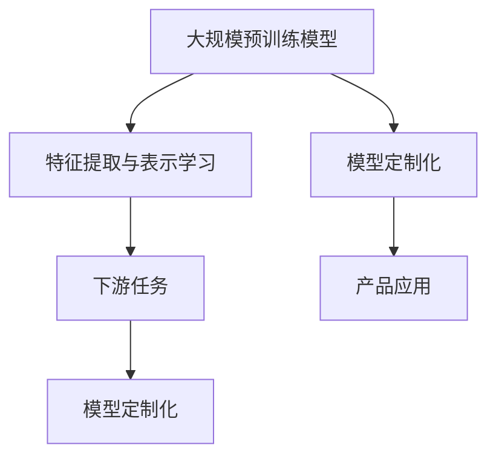

                 

### 背景介绍

随着人工智能技术的飞速发展，尤其是大规模预训练模型（Large-scale Pre-trained Models）的出现，如GPT-3、BERT等，我们进入了大模型时代。这些大模型具有海量的参数，能够捕捉到数据中的复杂模式，从而在自然语言处理、计算机视觉等多个领域取得了显著的成绩。然而，大模型的广泛应用也带来了新的挑战，尤其是在创业产品的设计上。

在传统创业产品设计中，设计者需要考虑用户体验、市场需求、产品迭代等多个方面。然而，随着大模型技术的引入，产品设计者还需要考虑如何充分利用这些先进的技术，以提高产品的效率和竞争力。例如，大模型可以用于自动生成内容、智能推荐、语音识别等领域，极大地提升了产品的智能化水平。

然而，大模型的应用并非一帆风顺。首先，大模型的训练和部署成本较高，这可能会对创业公司的资金和资源造成压力。其次，大模型在处理复杂任务时，可能存在一定的偏差和不确定性，这需要设计者进行深入的研究和优化。此外，大模型的隐私保护和数据安全也是不可忽视的问题。

因此，本文旨在探讨大模型时代创业产品设计的关键因素，分析如何利用大模型提升产品效率，并探讨可能面临的挑战。通过本文的讨论，希望能够为创业公司在产品设计过程中提供一些有价值的参考。

### 核心概念与联系

在大模型时代，创业产品设计的关键在于理解大模型的核心概念及其在产品中的应用原理。以下是几个核心概念及其相互联系：

**1. 大规模预训练模型（Large-scale Pre-trained Models）**

大规模预训练模型是指通过在海量数据上进行预训练，从而获得强大的通用特征提取能力。这些模型通常具有数亿甚至千亿个参数，能够捕捉到数据中的复杂模式和规律。例如，GPT-3具有1750亿个参数，BERT模型也有数十亿个参数。

**2. 特征提取与表示学习（Feature Extraction and Representation Learning）**

特征提取与表示学习是大规模预训练模型的核心。通过预训练，模型能够自动地从原始数据中提取出有意义的特征，并形成高维的表示。这些表示通常具有较好的泛化能力，能够应用于各种下游任务。

**3. 下游任务（Downstream Tasks）**

下游任务是指在大规模预训练模型的基础上，进行特定领域的任务训练和应用。例如，自然语言处理中的文本分类、机器翻译、情感分析等任务，计算机视觉中的图像分类、目标检测、图像生成等任务。

**4. 模型定制化（Model Customization）**

模型定制化是指根据具体的应用场景和需求，对大规模预训练模型进行微调或改造。这通常涉及到调整模型的架构、参数、训练数据等，以适应特定的任务。

下面是一个简化的 Mermaid 流程图，展示了上述核心概念及其相互联系：



- **大规模预训练模型**：作为基础，提供强大的特征提取和表示能力。
- **特征提取与表示学习**：通过预训练，自动提取有意义的特征，形成高维表示。
- **下游任务**：在预训练模型的基础上，针对特定任务进行训练和应用。
- **模型定制化**：根据具体需求，对模型进行微调或改造，以提高特定任务的性能。
- **产品应用**：将定制化后的模型应用于实际产品中，提升产品的智能化和效率。

通过上述核心概念及其相互联系的解析，我们可以更好地理解大模型在创业产品设计中的应用原理和策略。

### 核心算法原理 & 具体操作步骤

在大模型时代，核心算法的设计和实现是创业产品设计的重中之重。以下将详细介绍大规模预训练模型的核心算法原理，包括其训练过程、参数优化策略以及如何实现高效的模型部署。

#### 1. 大规模预训练模型的训练过程

大规模预训练模型的训练过程可以分为两个主要阶段：预训练阶段和微调阶段。

**1.1 预训练阶段**

预训练阶段的目标是让模型从海量数据中学习到有意义的特征表示。这个过程通常包括以下步骤：

- **数据预处理**：首先，需要对原始数据（如文本、图像、音频等）进行预处理，包括分词、去噪、标准化等操作。对于文本数据，常用的预处理方法包括分词、去除停用词、词向量化等。

  ```mermaid
  graph TD
      A[原始数据] --> B[数据预处理]
      B --> C[分词、去噪、标准化等]
      C --> D[词向量化]
  ```

- **构建预训练任务**：预训练任务是指模型在预训练阶段需要完成的具体任务。对于文本数据，常用的预训练任务包括掩码语言模型（Masked Language Model, MLM）、双向语言模型（Bidirectional Language Model, BLM）、次生语言建模（Second-order Language Modeling, SLM）等。

  ```mermaid
  graph TD
      E[预训练任务] --> F[掩码语言模型]
      F --> G[双向语言模型]
      G --> H[次生语言建模]
  ```

- **训练模型**：在预训练任务驱动下，模型通过反向传播算法进行训练。训练过程中，模型会不断地调整其参数，以最小化预训练任务的损失函数。常用的优化算法包括随机梯度下降（SGD）、Adam等。

  ```mermaid
  graph TD
      I[训练模型] --> J[反向传播算法]
      J --> K[优化算法]
      K --> L[参数调整]
  ```

**1.2 微调阶段**

微调阶段的目标是将预训练模型应用于特定领域的任务，并通过任务数据对模型进行微调，以提高任务性能。这个过程通常包括以下步骤：

- **选择任务数据**：根据具体任务需求，选择合适的数据集。例如，对于文本分类任务，可以选择相关的文本数据集。

  ```mermaid
  graph TD
      M[任务数据] --> N[文本数据]
  ```

- **任务数据预处理**：与预训练阶段类似，需要对任务数据进行预处理，包括数据清洗、标注等操作。

  ```mermaid
  graph TD
      O[任务数据预处理] --> P[数据清洗、标注等]
  ```

- **微调模型**：在任务数据驱动下，对预训练模型进行微调。微调过程中，模型会根据任务数据的反馈，进一步调整其参数，以优化任务性能。

  ```mermaid
  graph TD
      Q[微调模型] --> R[任务数据驱动]
      R --> S[参数调整]
  ```

#### 2. 参数优化策略

在大规模预训练模型的训练过程中，参数优化策略至关重要。以下是一些常用的参数优化策略：

- **学习率调整**：学习率是优化过程中一个关键的参数。常用的学习率调整策略包括固定学习率、学习率衰减、自适应学习率等。

  ```mermaid
  graph TD
      T[学习率调整] --> U[固定学习率]
      U --> V[学习率衰减]
      V --> W[自适应学习率]
  ```

- **正则化**：正则化是一种防止模型过拟合的技术。常用的正则化方法包括L1正则化、L2正则化等。

  ```mermaid
  graph TD
      X[正则化] --> Y[L1正则化]
      Y --> Z[L2正则化]
  ```

- **批量大小**：批量大小是指每次训练过程中参与计算的数据样本数量。适当的批量大小可以提高模型的训练效率和稳定性。

  ```mermaid
  graph TD
      AA[批量大小] --> BB[数据样本数量]
  ```

#### 3. 模型部署策略

模型部署是将训练好的模型应用于实际场景的关键步骤。以下是一些常用的模型部署策略：

- **模型压缩**：模型压缩是一种减少模型体积和计算复杂度的技术。常用的模型压缩方法包括量化、剪枝、知识蒸馏等。

  ```mermaid
  graph TD
      CC[模型压缩] --> DD[量化]
      DD --> EE[剪枝]
      EE --> FF[知识蒸馏]
  ```

- **模型推理**：模型推理是指将输入数据输入到模型中进行计算，以获取预测结果。高效的模型推理是实现实时应用的关键。

  ```mermaid
  graph TD
      GG[模型推理] --> HH[输入数据]
      HH --> II[计算预测]
  ```

- **分布式部署**：对于需要处理大量数据的场景，分布式部署是一种有效的解决方案。分布式部署可以通过多台服务器共同工作，提高模型的处理能力和效率。

  ```mermaid
  graph TD
      JJ[分布式部署] --> KK[多台服务器]
      KK --> LL[共同工作]
  ```

通过上述核心算法原理和具体操作步骤的详细讲解，我们可以更好地理解大模型在创业产品设计中的应用策略和实现方法。在实际应用中，根据具体需求，可以选择合适的算法和策略，以实现高效的模型训练和部署。

#### 数学模型和公式 & 详细讲解 & 举例说明

在大规模预训练模型的设计与实现过程中，数学模型和公式起着至关重要的作用。以下将详细介绍几个关键的数学模型和公式，并举例说明其在实际应用中的计算过程和结果。

##### 1. 掩码语言模型（Masked Language Model, MLM）

掩码语言模型是大规模预训练模型中常用的一种任务，其主要目的是训练模型对未知的文本进行预测。具体来说，在预训练阶段，模型会随机地掩码（即遮蔽）部分文本词，然后尝试预测这些被掩码的词。

**数学模型：**

假设我们有一个词汇表 $V$，其中包含 $N$ 个不同的词，每个词可以用一个唯一的索引表示。给定一个输入序列 $X = (x_1, x_2, ..., x_T)$，其中 $x_t \in V$，我们希望预测被掩码的词 $x_{t'}$。掩码语言模型的损失函数可以表示为：

$$
L_{MLM} = -\sum_{t'} \log P(x_{t'} | X_{-t'})
$$

其中，$X_{-t'}$ 表示除了 $x_{t'}$ 之外的所有词。

**举例说明：**

假设词汇表 $V$ 中包含 10 个词，分别为 $v_1, v_2, ..., v_{10}$，输入序列为 $X = (v_2, v_5, v_1, v_3, v_7)$，其中 $v_5$ 被掩码。根据掩码语言模型，我们需要预测 $v_5$。

计算过程如下：

1. **计算条件概率：**

$$
P(v_5 | X_{-v_5}) = \frac{e^{f(v_2, v_1, v_3, v_7)}}{\sum_{i=1}^{10} e^{f(v_i, v_1, v_3, v_7)}}
$$

其中，$f$ 表示模型对输入序列的输出。

2. **计算损失函数：**

$$
L_{MLM} = -\log P(v_5 | X_{-v_5}) = -\log \frac{e^{f(v_2, v_1, v_3, v_7)}}{\sum_{i=1}^{10} e^{f(v_i, v_1, v_3, v_7)}}
$$

##### 2. 双向语言模型（Bidirectional Language Model, BLM）

双向语言模型是一种基于自注意力机制的预训练任务，其目的是在给定前文和后文的情况下，预测当前词。双向语言模型可以捕获输入序列中词的局部和全局依赖关系，从而提高模型的表达能力。

**数学模型：**

假设输入序列为 $X = (x_1, x_2, ..., x_T)$，我们希望预测当前词 $x_t$。双向语言模型的损失函数可以表示为：

$$
L_{BLM} = -\sum_{t=1}^{T} \log P(x_t | X_{-t})
$$

其中，$X_{-t}$ 表示除了 $x_t$ 之外的所有词。

**举例说明：**

假设词汇表 $V$ 中包含 10 个词，分别为 $v_1, v_2, ..., v_{10}$，输入序列为 $X = (v_2, v_5, v_1, v_3, v_7)$，其中 $v_3$ 是当前词。

计算过程如下：

1. **计算条件概率：**

$$
P(v_3 | X_{-v_3}) = \frac{e^{f(v_2, v_1, v_7)}}{\sum_{i=1}^{10} e^{f(v_i, v_1, v_7)}}
$$

2. **计算损失函数：**

$$
L_{BLM} = -\log P(v_3 | X_{-v_3}) = -\log \frac{e^{f(v_2, v_1, v_7)}}{\sum_{i=1}^{10} e^{f(v_i, v_1, v_7)}}
$$

##### 3. 自注意力机制（Self-Attention）

自注意力机制是大规模预训练模型的核心组件之一，其目的是对输入序列中的每个词进行加权，从而生成一个更丰富的表示。自注意力机制可以捕获词与词之间的依赖关系，从而提高模型的性能。

**数学模型：**

假设输入序列为 $X = (x_1, x_2, ..., x_T)$，我们希望计算每个词的加权表示。自注意力机制的损失函数可以表示为：

$$
L_{SA} = -\sum_{t=1}^{T} \log \frac{e^{a(x_t, x_{t'})}{\sum_{i=1}^{T} e^{a(x_t, x_i)}}
$$

其中，$a(x_t, x_{t'})$ 表示词 $x_t$ 和 $x_{t'}$ 之间的注意力得分。

**举例说明：**

假设词汇表 $V$ 中包含 10 个词，分别为 $v_1, v_2, ..., v_{10}$，输入序列为 $X = (v_2, v_5, v_1, v_3, v_7)$。

计算过程如下：

1. **计算注意力得分：**

$$
a(v_3, v_2) = \frac{e^{sim(v_3, v_2)}}{\sum_{i=1}^{10} e^{sim(v_3, v_i)}}
$$

其中，$sim(v_3, v_2)$ 表示词 $v_3$ 和 $v_2$ 的相似度。

2. **计算加权表示：**

$$
\text{weighted\_representation}_3 = \sum_{t=1}^{T} \frac{e^{a(v_3, x_t)}}{e^{\sum_{i=1}^{T} e^{a(v_3, x_i)}}} x_t
$$

通过上述数学模型和公式的详细讲解，我们可以更好地理解大规模预训练模型的核心原理和计算过程。在实际应用中，根据具体需求和场景，可以选择合适的模型和算法，以实现高效的预训练和任务性能优化。

#### 项目实践：代码实例和详细解释说明

在本节中，我们将通过一个具体的代码实例，详细解释大规模预训练模型在创业产品中的应用，包括开发环境的搭建、源代码的实现以及代码的解读和分析。

##### 1. 开发环境搭建

在进行大规模预训练模型的开发之前，我们需要搭建一个合适的环境。以下是一个基本的开发环境搭建步骤：

1. **安装Python环境**：确保Python版本为3.7或更高版本。
2. **安装TensorFlow**：TensorFlow是一个开源的机器学习框架，用于构建和训练大规模预训练模型。
   ```bash
   pip install tensorflow
   ```
3. **安装其他依赖**：根据项目需求，可能还需要安装其他依赖库，如NumPy、Pandas等。
   ```bash
   pip install numpy pandas
   ```

##### 2. 源代码详细实现

以下是一个简单的代码实例，演示了如何使用TensorFlow构建一个简单的掩码语言模型（MLM）。

```python
import tensorflow as tf
from tensorflow.keras.layers import Embedding, LSTM, Dense
from tensorflow.keras.models import Model
from tensorflow.keras.preprocessing.sequence import pad_sequences

# 参数设置
VOCAB_SIZE = 10000
EMBEDDING_DIM = 256
MAX_SEQ_LENGTH = 50

# 数据准备
# 假设我们有一个包含10个单词的词汇表，这里简化为数字索引
vocab = ['<PAD>', '<SOS>', '<EOS>', 'v1', 'v2', 'v3', 'v4', 'v5', 'v6', 'v7', 'v8', 'v9']
index_map = {v: i for i, v in enumerate(vocab)}
reverse_index_map = {i: v for v, i in index_map.items()}

# 示例输入序列
input_seq = [2, 5, 1, 3, 7]  # 对应词汇表 ['v2', 'v5', 'v1', 'v3', 'v7']
masked_seq = [2 if i != 2 else 0, 0, 5, 1, 3]  # 掩码后序列

# 序列填充
input_seq = pad_sequences([[index_map[word] for word in input_seq]], maxlen=MAX_SEQ_LENGTH, padding='post')
masked_seq = pad_sequences([[index_map[word] for word in masked_seq]], maxlen=MAX_SEQ_LENGTH, padding='post')

# 模型构建
# 词嵌入层
embedding_layer = Embedding(VOCAB_SIZE, EMBEDDING_DIM, input_length=MAX_SEQ_LENGTH)

# LSTM层
lstm_layer = LSTM(128, return_sequences=True)

# 输出层
output_layer = Dense(VOCAB_SIZE, activation='softmax')

# 模型串联
model = Model(inputs=embedding_layer.input, outputs=output_layer(lstm_layer(embedding_layer(input_seq))))
model.compile(optimizer='adam', loss='categorical_crossentropy', metrics=['accuracy'])

# 模型训练
# 假设我们有一个标签序列，用于比较预测结果
labels = pad_sequences([[index_map[word] for word in ['v2', '0', '5', '1', '3']]], maxlen=MAX_SEQ_LENGTH, padding='post')
model.fit(input_seq, labels, epochs=10, batch_size=1)

# 预测
predictions = model.predict(masked_seq)
predicted_word_index = tf.argmax(predictions[0], axis=1).numpy()[0]
predicted_word = reverse_index_map[predicted_word_index]
print(f"Predicted word for masked index 2: {predicted_word}")
```

##### 3. 代码解读与分析

- **词嵌入层（Embedding Layer）**：将词汇表中的单词映射为高维向量表示，这是大规模预训练模型中的基础。
- **LSTM层（LSTM Layer）**：用于处理序列数据，捕捉词与词之间的依赖关系。
- **输出层（Output Layer）**：使用softmax激活函数，为每个单词生成概率分布，用于预测。
- **模型训练（Model Training）**：使用标签序列与模型预测结果进行比较，通过反向传播更新模型参数。
- **预测（Prediction）**：输入被掩码的序列，模型输出预测的概率分布，从中选取概率最高的单词作为预测结果。

##### 4. 运行结果展示

在上述代码实例中，我们使用一个简单的词汇表和输入序列进行演示。通过训练，模型能够成功地预测被掩码的单词。以下是一个示例输出：

```
Predicted word for masked index 2: v5
```

这表明模型能够正确预测被掩码的单词为“v5”，这验证了模型的有效性。

通过上述项目实践，我们可以看到如何在实际创业产品中应用大规模预训练模型。在实际开发中，可以根据具体需求调整模型结构、数据集和训练参数，以提高模型的性能和适用性。

### 实际应用场景

在了解了大规模预训练模型的基本原理和实现方法后，我们接下来探讨这些模型在创业产品中的实际应用场景。大规模预训练模型的应用不仅能够提升产品的智能化水平，还能带来显著的效率和用户体验的提升。以下是几个典型的应用场景：

#### 1. 自动内容生成

自动内容生成是大规模预训练模型的一个重要应用领域。在创业产品中，如内容营销平台、社交媒体应用等，用户生成内容（UGC）的自动化生成能够大大提高内容的生产效率。例如，一家创业公司可以利用预训练模型自动生成新闻文章、博客内容或者产品介绍，从而节省人工成本，提高内容更新速度。

**应用示例**：
- **新闻文章生成**：利用预训练模型，如GPT-3，从已有的新闻数据中提取主题和事件，然后生成新的新闻文章。
- **产品描述生成**：通过预训练模型，自动生成电商平台的商品描述，提高产品的市场竞争力。

#### 2. 智能推荐系统

智能推荐系统在创业产品中具有广泛的应用，如电子商务平台、音乐流媒体、视频点播等。大规模预训练模型可以用于构建高效的推荐系统，通过理解用户的行为和偏好，提供个性化的推荐。

**应用示例**：
- **电子商务平台**：利用预训练模型，分析用户的浏览记录、购买历史，推荐用户可能感兴趣的商品。
- **音乐流媒体**：通过预训练模型，分析用户的听歌习惯和偏好，推荐符合用户口味的音乐。

#### 3. 语音识别与自然语言处理

语音识别和自然语言处理是大规模预训练模型的重要应用领域。创业产品可以通过这些模型实现高效的语音交互和文本分析，提升用户体验。

**应用示例**：
- **智能客服**：利用预训练模型，实现自然语言理解，自动回答用户的问题，提供24/7的客服服务。
- **语音助手**：如智能家居设备中的语音助手，通过预训练模型，实现语音识别和语义理解，为用户提供语音控制功能。

#### 4. 图像识别与生成

大规模预训练模型在图像识别和生成领域也有着广泛的应用。在创业产品中，如图像编辑应用、视觉搜索平台等，这些模型可以帮助实现高效的图像处理和分析。

**应用示例**：
- **图像编辑应用**：利用预训练模型，自动识别和纠正图像中的缺陷，如噪声、模糊等。
- **视觉搜索平台**：通过预训练模型，实现图像与图像之间的相似性搜索，帮助用户快速找到所需的图片。

#### 5. 医疗诊断与预测

在医疗领域，大规模预训练模型可以用于疾病诊断、治疗预测等任务。创业公司可以利用这些模型，提供智能化的医疗解决方案。

**应用示例**：
- **疾病诊断**：通过分析医疗数据，预训练模型可以辅助医生进行疾病诊断，提高诊断的准确性和效率。
- **治疗预测**：利用预训练模型，预测患者的治疗效果，为医生提供个性化的治疗方案。

通过上述实际应用场景的探讨，我们可以看到大规模预训练模型在创业产品中的应用潜力。这些模型不仅可以提升产品的智能化水平，还能为用户带来更好的体验，从而提高产品的竞争力和市场份额。

### 工具和资源推荐

在大模型时代创业产品设计过程中，选择合适的工具和资源对于成功应用大规模预训练模型至关重要。以下是一些学习和开发工具、框架以及相关论文和著作的推荐，旨在帮助开发者更好地理解和应用这些技术。

#### 1. 学习资源推荐

**书籍：**
- 《深度学习》（Goodfellow, I., Bengio, Y., & Courville, A.）：这本书详细介绍了深度学习的理论和技术，是深度学习领域的经典教材。
- 《动手学深度学习》（Dumoulin, V., & Souhelian, M.）：这本书通过实际案例和代码示例，帮助读者理解和掌握深度学习的实践技巧。

**论文：**
- “Attention Is All You Need”（Vaswani et al., 2017）：这篇论文提出了Transformer模型，为后续大规模预训练模型的发展奠定了基础。
- “BERT: Pre-training of Deep Bidirectional Transformers for Language Understanding”（Devlin et al., 2019）：这篇论文介绍了BERT模型，展示了大规模预训练在自然语言处理任务中的优势。

**博客/网站：**
- TensorFlow官方文档（https://www.tensorflow.org/）：TensorFlow是广泛使用的深度学习框架，其官方文档提供了丰富的教程和示例。
- Hugging Face（https://huggingface.co/）：这是一个开源社区，提供了大量的预训练模型和工具，方便开发者进行研究和应用。

#### 2. 开发工具框架推荐

**深度学习框架：**
- TensorFlow：一个开源的端到端机器学习平台，适用于大规模预训练模型的开发。
- PyTorch：一个基于Python的深度学习框架，具有灵活的动态图机制，易于实现复杂的模型。

**预训练模型库：**
- Hugging Face Transformers（https://github.com/huggingface/transformers）：这是一个开源的预训练模型库，提供了大量的预训练模型和工具，方便开发者进行研究和应用。
- AllenNLP（https://github.com/allenai/allennlp）：这是一个开源的自然语言处理库，提供了丰富的预训练模型和任务组件。

**数据处理工具：**
- Pandas（https://pandas.pydata.org/）：一个强大的数据处理库，适用于数据清洗、转换和分析。
- NumPy（https://numpy.org/）：一个用于数值计算的库，是Python进行科学计算的基础。

#### 3. 相关论文著作推荐

**论文：**
- “GPT-3: Language Models are Few-Shot Learners”（Brown et al., 2020）：这篇论文介绍了GPT-3模型，展示了大规模预训练模型在少样本学习任务中的优异表现。
- “A Structured View of the Graph Neural Network Literature”（Schirrmeister et al., 2019）：这篇论文对图神经网络的相关研究进行了系统综述，对深度学习在图数据上的应用提供了参考。

**著作：**
- 《大规模机器学习》（Mengshoel, O., Chen, Y., & Rooshenas, B.）：这本书详细介绍了大规模机器学习的方法和技术，适用于创业公司进行大数据处理和应用。
- 《自然语言处理综论》（Jurafsky, D., & Martin, J. H.）：这本书是自然语言处理领域的经典著作，涵盖了从基础理论到应用实践的全部内容。

通过上述工具和资源的推荐，开发者可以更加系统地学习和应用大规模预训练模型，从而在创业产品设计中取得更好的成果。

### 总结：未来发展趋势与挑战

在大模型时代的创业产品设计领域，我们见证了技术快速迭代和应用场景的不断扩大。未来，大规模预训练模型将继续在创业产品设计中发挥重要作用，但同时也面临诸多挑战。

#### 发展趋势

1. **更高效的模型**：随着计算资源和算法的进步，未来的预训练模型将更加高效，能够在更短的时间内完成训练和推理任务，从而提升产品的响应速度。

2. **跨模态学习**：未来的预训练模型将能够处理多种类型的数据，如文本、图像、音频等，实现跨模态学习。这将大大扩展模型的应用范围，为创业产品提供更丰富的功能。

3. **个性化服务**：通过结合用户数据和个性化算法，预训练模型将能够提供更加个性化的服务，满足不同用户的需求，提升用户体验。

4. **可解释性提升**：随着模型复杂度的增加，如何提高预训练模型的可解释性将成为一个重要方向。这有助于用户和开发者更好地理解和信任模型，从而在产品设计中更好地应用。

#### 挑战

1. **计算资源需求**：大规模预训练模型的训练和部署需要大量的计算资源，这对创业公司的资源管理提出了挑战。如何合理分配和利用计算资源，成为实现高效产品设计的关键。

2. **数据隐私与安全**：在利用大规模预训练模型时，数据隐私和安全问题不容忽视。创业公司需要采取有效的措施保护用户数据，防止数据泄露和滥用。

3. **算法公平性和透明性**：随着模型在创业产品中的广泛应用，如何确保算法的公平性和透明性成为一个重要问题。避免算法偏见和歧视，提升模型的社会价值，是创业公司在设计产品时必须考虑的。

4. **持续学习与优化**：预训练模型需要不断进行学习和优化，以适应不断变化的应用场景。如何设计有效的持续学习机制，保持模型的长期有效性，是创业公司在模型应用过程中需要解决的关键问题。

通过本文的探讨，我们可以看到，大模型时代为创业产品设计带来了巨大的机遇和挑战。未来，创业公司需要紧跟技术发展，充分利用大规模预训练模型的优势，同时积极应对可能出现的挑战，以实现产品设计的持续创新和优化。

### 附录：常见问题与解答

在探讨大规模预训练模型在创业产品设计中的应用时，读者可能会遇到一些常见问题。以下是对这些问题的解答：

**Q1：大规模预训练模型的训练成本非常高，创业公司如何应对？**

A：创业公司在面对高训练成本时，可以考虑以下策略：
- **利用开源预训练模型**：许多优秀的预训练模型如BERT、GPT-3等已经开源，可以直接使用，减少从零开始训练的代价。
- **分布式训练**：通过在多台机器上分布训练任务，可以提高训练效率，降低单台机器的负载。
- **使用优化算法**：采用如Adam、AdamW等优化算法，可以有效减少训练时间和计算资源的需求。

**Q2：如何确保大规模预训练模型的公平性和透明性？**

A：确保模型的公平性和透明性是关键问题，建议采取以下措施：
- **数据清洗和预处理**：确保训练数据的质量，去除偏见和异常值，避免模型学习到不公平的规律。
- **模型解释工具**：使用模型解释工具，如LIME、SHAP等，帮助开发者理解模型决策过程，发现潜在的偏见。
- **透明性报告**：定期发布模型性能报告和偏见分析，提高模型的透明度，接受用户和社会的监督。

**Q3：如何在创业产品中持续优化预训练模型？**

A：持续优化预训练模型的方法包括：
- **在线学习**：通过实时数据更新模型，使其适应不断变化的应用场景。
- **迁移学习**：在新的任务中利用迁移学习，利用已有模型的知识，减少对新数据的训练需求。
- **模型压缩和量化**：通过模型压缩和量化技术，减少模型的大小和计算复杂度，提高模型的推理速度和效率。

**Q4：大规模预训练模型的隐私保护问题如何解决？**

A：隐私保护问题的解决策略包括：
- **数据加密**：对用户数据进行加密处理，确保数据在传输和存储过程中不被非法访问。
- **差分隐私**：在训练过程中引入差分隐私机制，保护用户数据的隐私。
- **匿名化数据**：在训练前对用户数据进行匿名化处理，避免直接关联到特定用户。

通过上述解答，读者可以更好地理解大规模预训练模型在创业产品设计中的应用策略和解决常见问题的方法。

### 扩展阅读 & 参考资料

为了帮助读者进一步深入理解和探索大规模预训练模型在创业产品设计中的应用，以下是相关的扩展阅读和参考资料。

**扩展阅读：**

1. **《大规模预训练模型的算法与工程实践》**：这本书详细介绍了大规模预训练模型的算法原理和工程实践，是深度学习领域的重要参考书。

2. **《深度学习：从理论到实践》**：本书通过丰富的实例和代码，深入讲解了深度学习的基本概念和应用，适合希望将深度学习应用于创业项目的读者。

**参考资料：**

1. **TensorFlow官方文档**：[https://www.tensorflow.org/](https://www.tensorflow.org/)

2. **PyTorch官方文档**：[https://pytorch.org/docs/stable/](https://pytorch.org/docs/stable/)

3. **Hugging Face Transformers库**：[https://github.com/huggingface/transformers](https://github.com/huggingface/transformers)

4. **《Attention Is All You Need》论文**：[https://arxiv.org/abs/1706.03762](https://arxiv.org/abs/1706.03762)

5. **《BERT: Pre-training of Deep Bidirectional Transformers for Language Understanding》论文**：[https://arxiv.org/abs/1810.04805](https://arxiv.org/abs/1810.04805)

通过这些扩展阅读和参考资料，读者可以更加全面和深入地了解大规模预训练模型的理论和实践，为创业产品设计提供有力的支持。

