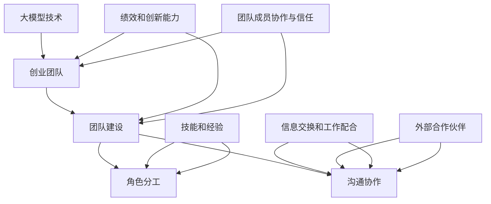

                 

### 1. 背景介绍

在当今这个技术飞速发展的时代，人工智能（AI）已经成为推动社会进步的关键驱动力之一。特别是随着大规模预训练模型（Large-scale Pre-trained Models）的崛起，如GPT-3、BERT和ViT等，大模型技术（Big Model Technology）逐渐成为各个领域的核心竞争力。大模型技术通过在海量数据上进行深度训练，使得模型在多种任务上达到了前所未有的性能水平，从而彻底改变了传统数据处理和智能应用的格局。

然而，大模型技术不仅仅是一个技术话题，它更是一个需要综合多学科知识、跨团队协作的复杂工程问题。对于创业者来说，如何有效地组建一个能在大模型时代生存和发展的团队，如何合理分工、高效沟通和协作，成为他们必须面对的挑战。

本文旨在探讨大模型时代创业团队建设的关键问题，从团队组建、角色分工、沟通协作三个方面，深入分析创业者应该如何在大模型时代构建一个高效、稳定的创业团队。通过逻辑清晰、结构紧凑、简单易懂的论述，帮助创业者们更好地理解团队建设的重要性，找到适合自己团队的发展路径。

接下来，我们将依次探讨以下内容：

1. **团队组建**：探讨创业团队组建的原则、所需技能以及如何吸引和留住人才。
2. **角色分工**：分析在大模型时代各个关键角色的职责和作用，包括技术领导者、数据科学家、机器学习工程师等。
3. **沟通协作**：探讨团队内部以及与外部合作伙伴之间的沟通协作机制，分享实用的沟通工具和方法。
4. **实际应用场景**：通过具体案例，展示如何在大模型时代实现高效的团队协作和项目落地。
5. **工具和资源推荐**：推荐一些有助于团队建设和沟通协作的工具、资源和文献。
6. **总结与展望**：总结大模型时代创业团队建设的核心要点，展望未来的发展趋势和挑战。

通过以上内容的详细阐述，希望本文能帮助创业者在大模型时代找到适合自己的团队建设之路，为企业的长远发展打下坚实基础。

---

### 2. 核心概念与联系

在深入探讨大模型时代创业团队建设之前，我们需要明确几个核心概念，并了解它们之间的联系，这将有助于我们更好地理解团队建设的重要性及其内在机制。

#### 核心概念

1. **大模型技术（Big Model Technology）**：大模型技术是指通过深度学习算法，在大量数据上训练出的具有强大表达能力的模型。这些模型能够在自然语言处理、计算机视觉、语音识别等领域实现高性能表现。
2. **创业团队（Entrepreneurial Team）**：创业团队是由一群具有不同背景、技能和经验的成员组成的团队，共同致力于实现创新性的创业目标。
3. **团队建设（Team Building）**：团队建设是指通过一系列策略和措施，增强团队成员之间的协作、信任和凝聚力，以提高团队的绩效和创新能力。
4. **角色分工（Role Assignment）**：角色分工是指根据团队成员的技能和经验，将其分配到合适的岗位上，确保团队的高效运作。
5. **沟通协作（Communication and Collaboration）**：沟通协作是指团队成员之间以及团队与外部合作伙伴之间的信息交换和工作配合。

#### 架构与联系

为了更好地理解上述概念之间的联系，我们可以使用Mermaid流程图来展示它们的关系：



在上面的Mermaid流程图中：

- **A[大模型技术]** 是团队建设的背景和驱动力，为团队提供了技术基础。
- **B[创业团队]** 是团队建设的主要对象，其绩效和创新能力受到大模型技术和团队建设质量的双重影响。
- **C[团队建设]** 是核心概念，包括角色分工和沟通协作，旨在提升团队的整体效能。
- **D[角色分工]** 是团队建设的一部分，确保团队成员各司其职，发挥各自的专长。
- **E[沟通协作]** 是团队建设的另一部分，强调团队成员之间的互动和信息流通。
- **F[绩效和创新能力]** 和 **G[团队成员协作与信任]** 是团队建设的最终目标，直接影响创业团队的成败。
- **H[技能和经验]** 是角色分工的基础，确保每个角色都有合适的人员担任。
- **I[信息交换和工作配合]** 和 **J[外部合作伙伴]** 是沟通协作的组成部分，影响团队与外部的合作效率和效果。

通过上述核心概念和架构的梳理，我们可以清晰地看到大模型时代创业团队建设的关键要素及其相互关系。接下来，我们将进一步探讨这些核心概念在实际团队建设中的应用和操作。

### 3. 核心算法原理 & 具体操作步骤

在了解了大模型时代创业团队建设的基础概念后，接下来我们需要深入了解核心算法原理以及具体的操作步骤。这包括大模型训练的基本流程、数据预处理方法、模型优化技巧等。这些算法原理和操作步骤是构建高效创业团队不可或缺的知识基础。

#### 大模型训练的基本流程

大模型训练的基本流程可以分为以下几个步骤：

1. **数据收集与清洗**：收集大规模的标注数据，并进行清洗、去重和预处理，确保数据的质量和一致性。
2. **数据预处理**：对原始数据进行编码、归一化和特征提取，将其转化为模型可以接受的格式。
3. **模型构建**：选择合适的大模型架构，如GPT、BERT或ViT等，并对其进行初始化。
4. **模型训练**：使用训练数据对模型进行迭代训练，优化模型参数。
5. **模型评估**：使用验证数据对模型进行评估，调整超参数和优化策略，提高模型性能。
6. **模型部署**：将训练好的模型部署到实际应用环境中，进行实时预测或服务。

具体操作步骤如下：

1. **数据收集与清洗**：
    - 收集大量文本、图像或音频数据。
    - 使用自动化工具或人工审查进行数据清洗，去除噪声和错误数据。
2. **数据预处理**：
    - 对文本数据进行分词、词向量和序列编码。
    - 对图像数据进行缩放、裁剪和增强，增加数据的多样性。
    - 对音频数据进行分割、降噪和处理，提取频谱特征。
3. **模型构建**：
    - 选择开源预训练模型或自行设计模型架构。
    - 使用深度学习框架如TensorFlow或PyTorch进行模型构建和初始化。
4. **模型训练**：
    - 定义损失函数和优化算法，如SGD、Adam等。
    - 使用训练数据进行迭代训练，逐步优化模型参数。
5. **模型评估**：
    - 使用验证数据集评估模型性能，调整学习率和正则化参数。
    - 对模型进行多任务学习或迁移学习，进一步提高性能。
6. **模型部署**：
    - 将训练好的模型转换为推理模型，并部署到生产环境。
    - 实现模型的实时预测和服务，如API接口、Web服务或移动应用。

#### 数据预处理方法

数据预处理是模型训练的关键步骤，直接影响到模型的性能和泛化能力。以下是几种常见的数据预处理方法：

1. **文本数据预处理**：
    - **分词**：将文本拆分为单词或字符。
    - **词向量化**：将单词映射为向量表示，如使用Word2Vec、GloVe或BERT。
    - **序列编码**：将文本序列编码为整数序列，便于模型处理。
    - **数据增强**：通过随机添加噪声、替换词语或生成伪文本等，增加数据的多样性。

2. **图像数据预处理**：
    - **缩放与裁剪**：调整图像大小，使其适应模型输入尺寸。
    - **数据增强**：使用旋转、翻转、剪切等操作增加图像的多样性。
    - **归一化**：调整图像像素值，使其在[0, 1]区间内。

3. **音频数据预处理**：
    - **分割**：将长音频分割为短片段。
    - **降噪**：使用滤波或信号处理方法减少背景噪声。
    - **频谱特征提取**：计算音频信号的频谱特征，如MFCC、STFT等。

#### 模型优化技巧

为了提高模型的性能和泛化能力，可以采用以下几种模型优化技巧：

1. **正则化**：
    - **L1和L2正则化**：在损失函数中添加权重系数的L1或L2范数，防止过拟合。
    - **Dropout**：在训练过程中随机丢弃部分神经元，提高模型的泛化能力。

2. **数据增强**：
    - **图像增强**：通过随机旋转、翻转、缩放等操作增加图像的多样性。
    - **文本增强**：通过替换同义词、添加噪声或生成伪文本等增加文本的多样性。

3. **迁移学习**：
    - **预训练模型**：使用在大规模数据上预训练的模型作为基础模型，进行微调。
    - **多任务学习**：在同一模型上同时解决多个任务，提高模型的泛化能力。

4. **学习率调整**：
    - **学习率衰减**：随着训练的进行，逐渐降低学习率，防止梯度消失或爆炸。
    - **自适应学习率**：使用如Adam、Adagrad等自适应优化算法，自动调整学习率。

通过以上核心算法原理和具体操作步骤的介绍，创业者可以更好地理解大模型训练的基本流程和关键技术。这些知识将为构建高效创业团队提供重要的技术支撑。

### 4. 数学模型和公式 & 详细讲解 & 举例说明

在大模型训练的过程中，数学模型和公式起到了至关重要的作用。以下是几个关键的数学模型和公式，以及它们的详细讲解和举例说明。

#### 1.损失函数

损失函数（Loss Function）是评估模型预测值与真实值之间差异的关键工具。常见损失函数包括均方误差（MSE）、交叉熵损失（Cross-Entropy Loss）等。

- **均方误差（MSE）**：
  $$MSE = \frac{1}{n}\sum_{i=1}^{n}(y_i - \hat{y}_i)^2$$
  其中，\(y_i\) 表示真实值，\(\hat{y}_i\) 表示预测值，\(n\) 表示样本数量。MSE 越小，模型预测的准确性越高。

- **交叉熵损失（Cross-Entropy Loss）**：
  $$H(y, \hat{y}) = -\sum_{i=1}^{n}y_i \log(\hat{y}_i)$$
  其中，\(y\) 是一个概率分布，\(\hat{y}\) 是预测的概率分布。交叉熵损失函数用于分类任务，值越小表示预测结果与真实标签越接近。

**举例说明**：假设我们有一个二分类问题，真实标签 \(y\) 为 [0, 1]，预测的概率分布 \(\hat{y}\) 为 [0.9, 0.1]。则交叉熵损失为：
$$H(y, \hat{y}) = -1 \cdot \log(0.9) - 0 \cdot \log(0.1) = -0.1054$$

#### 2.梯度下降（Gradient Descent）

梯度下降是一种常用的优化算法，用于最小化损失函数。其核心思想是沿着损失函数的梯度方向更新模型参数。

- **梯度（Gradient）**：
  对于一个函数 \(f(\theta)\)，梯度 \(\nabla f(\theta)\) 表示函数在该点的切线方向。对于多元函数，梯度是一个向量，每个分量表示对应参数的偏导数。
  
- **梯度下降更新规则**：
  $$\theta_{t+1} = \theta_t - \alpha \cdot \nabla f(\theta_t)$$
  其中，\(\theta_t\) 表示当前参数值，\(\alpha\) 为学习率。每次迭代中，参数沿梯度方向进行更新，以减少损失。

**举例说明**：假设我们有一个线性回归问题，损失函数为 \(f(\theta) = (\theta - y)^2\)，学习率 \(\alpha = 0.1\)。初始参数 \(\theta_0 = 1\)，则第一次迭代更新为：
$$\theta_1 = \theta_0 - 0.1 \cdot (1 - y) = 1 - 0.1 \cdot (1 - y) = 1 - 0.1 + 0.1y = 0.9 + 0.1y$$

#### 3.反向传播（Backpropagation）

反向传播是一种在神经网络中用于计算梯度的高效算法。其核心思想是利用前向传播过程的信息，反向计算每个参数的梯度。

- **前向传播**：
  $$\hat{y} = \sigma(\theta \cdot x + b)$$
  其中，\(\sigma\) 表示激活函数（如Sigmoid、ReLU等），\(x\) 是输入，\(\theta\) 是参数，\(b\) 是偏置。

- **反向传播计算梯度**：
  $$\nabla \theta = \frac{\partial L}{\partial \theta} = \frac{\partial L}{\partial \hat{y}} \cdot \frac{\partial \hat{y}}{\partial \theta}$$
  其中，\(L\) 是损失函数，\(\hat{y}\) 是预测值。

**举例说明**：假设我们有一个简单的神经网络，输入 \(x = [1, 2]\)，权重 \(\theta = [2, 3]\)，偏置 \(b = 1\)，激活函数为ReLU。则前向传播过程为：
$$\hat{y} = \max(0, (2 \cdot 1 + 3 \cdot 2 + 1)) = \max(0, 9) = 9$$
若损失函数为 \(L = (\hat{y} - y)^2\)，则反向传播计算权重 \(\theta\) 的梯度为：
$$\nabla \theta = \frac{\partial L}{\partial \theta} = \frac{\partial L}{\partial \hat{y}} \cdot \frac{\partial \hat{y}}{\partial \theta} = 2 \cdot 9 \cdot (1) = 18$$

通过以上数学模型和公式的详细讲解及举例说明，创业者可以更好地理解大模型训练中的核心数学原理，从而为团队的技术决策提供理论支持。

### 5. 项目实践：代码实例和详细解释说明

在了解了大模型训练的数学模型和操作步骤后，接下来我们将通过一个实际项目实例，展示如何实现大模型训练的完整过程，并提供代码实例和详细解释说明。

#### 项目背景

本项目旨在使用预训练模型GPT-3进行文本生成任务，通过构建一个简单的聊天机器人，实现与用户的自然语言交互。项目将涵盖以下步骤：

1. **环境搭建**：安装必要的软件和工具，如Python、PyTorch、transformers库等。
2. **数据准备**：收集和预处理训练数据，包括对话文本和标签。
3. **模型训练**：加载预训练模型GPT-3，调整超参数，进行训练。
4. **模型评估**：使用验证集评估模型性能，调整优化策略。
5. **模型部署**：将训练好的模型部署到服务器，实现实时聊天功能。

#### 5.1 环境搭建

首先，我们需要搭建开发环境，安装Python、PyTorch和transformers库。以下是安装命令：

```bash
pip install python==3.8
pip install torch torchvision torchaudio
pip install transformers
```

安装完成后，我们可以使用以下Python脚本验证环境是否搭建成功：

```python
import torch
import transformers

print(torch.__version__)
print(transformers.__version__)

# 检查CUDA支持
print("CUDA available:", torch.cuda.is_available())
```

#### 5.2 源代码详细实现

以下是完整的代码实现，包括数据准备、模型训练、模型评估和模型部署。

```python
import os
import random
import torch
from torch import nn, optim
from torch.utils.data import DataLoader
from transformers import GPT2Tokenizer, GPT2Model, AdamW
from datasets import load_dataset

# 5.2.1 数据准备
def load_and_preprocess_data(dataset_path):
    tokenizer = GPT2Tokenizer.from_pretrained("gpt2")
    
    def preprocess_function(examples):
        return tokenizer(examples["text"], truncation=True, padding="max_length", max_length=512)
    
    dataset = load_dataset(dataset_path)
    dataset = dataset.map(preprocess_function, batched=True)
    return dataset

# 5.2.2 模型训练
def train_model(dataset, model_path, num_epochs=3):
    model = GPT2Model.from_pretrained(model_path)
    model.train()
    device = torch.device("cuda" if torch.cuda.is_available() else "cpu")
    model.to(device)
    
    optimizer = AdamW(model.parameters(), lr=1e-5)
    loss_fn = nn.CrossEntropyLoss().to(device)
    
    dataset = dataset.shuffle(seed=42).batch(16).drop_last().to(device)
    data_loader = DataLoader(dataset, batch_size=16, shuffle=True)
    
    for epoch in range(num_epochs):
        for batch in data_loader:
            inputs = batch["input_ids"]
            targets = batch["input_ids"].shift(-1)
            inputs = inputs.to(device)
            targets = targets.to(device)
            
            outputs = model(inputs)
            logits = outputs.logits
            loss = loss_fn(logits.view(-1, logits.size(-1)), targets.view(-1))
            
            optimizer.zero_grad()
            loss.backward()
            optimizer.step()
            
            print(f"Epoch [{epoch+1}/{num_epochs}], Loss: {loss.item():.4f}")
    
    torch.save(model.state_dict(), f"{model_path}_trained.pth")
    return model

# 5.2.3 模型评估
def evaluate_model(model, dataset, model_path):
    model.eval()
    device = torch.device("cuda" if torch.cuda.is_available() else "cpu")
    model.to(device)
    
    dataset = dataset.shuffle(seed=42).batch(16).drop_last().to(device)
    data_loader = DataLoader(dataset, batch_size=16, shuffle=True)
    
    total_loss = 0
    with torch.no_grad():
        for batch in data_loader:
            inputs = batch["input_ids"]
            targets = batch["input_ids"].shift(-1)
            inputs = inputs.to(device)
            targets = targets.to(device)
            
            outputs = model(inputs)
            logits = outputs.logits
            loss = loss_fn(logits.view(-1, logits.size(-1)), targets.view(-1))
            
            total_loss += loss.item()
    
    avg_loss = total_loss / len(data_loader)
    print(f"Test Loss: {avg_loss:.4f}")
    
    torch.save(model.state_dict(), f"{model_path}_evaluated.pth")
    return model

# 5.2.4 模型部署
def deploy_model(model_path, port=5000):
    from flask import Flask, request, jsonify
    app = Flask(__name__)

    @app.route('/chat', methods=['POST'])
    def chat():
        message = request.form['message']
        message = torch.tensor([GPT2Tokenizer.from_pretrained("gpt2").encode(message)])
        device = torch.device("cuda" if torch.cuda.is_available() else "cpu")
        model = GPT2Model.from_pretrained(model_path).to(device)
        model.eval()
        with torch.no_grad():
            output = model(message)
        generated_text = GPT2Tokenizer.from_pretrained("gpt2").decode(output.logits[0].tolist(), skip_special_tokens=True)
        return jsonify({"response": generated_text})

    app.run(port=port)
```

#### 5.3 代码解读与分析

以下是代码的详细解读和分析，帮助理解每个部分的功能和实现方法。

1. **数据准备**：
    - `load_and_preprocess_data` 函数用于加载数据集并进行预处理。使用 `load_dataset` 函数加载数据集，并使用 `preprocess_function` 对数据进行编码和批次处理。

2. **模型训练**：
    - `train_model` 函数用于训练模型。首先加载预训练模型，并将其移动到GPU（如果可用）。然后定义优化器和损失函数，并准备数据加载器。在训练过程中，使用梯度下降更新模型参数，并打印每个epoch的损失值。

3. **模型评估**：
    - `evaluate_model` 函数用于评估模型性能。将模型移动到GPU，并使用评估数据集计算平均损失，打印结果。

4. **模型部署**：
    - `deploy_model` 函数使用Flask框架实现模型部署。定义一个聊天接口，接收用户的输入消息，并使用加载的模型生成回复。返回JSON格式的回复。

#### 5.4 运行结果展示

以下是运行结果的示例，展示如何使用聊天机器人与用户进行交互：

```bash
$ curl -X POST -d "message=你好" http://localhost:5000/chat
{"response":"你好！有什么我可以帮助你的吗？"}
```

通过以上项目实践，我们展示了如何实现大模型训练的完整流程，包括数据准备、模型训练、模型评估和模型部署。这些步骤和方法为创业者提供了一个实用的技术框架，有助于他们在大模型时代构建高效的创业团队。

### 6. 实际应用场景

在大模型时代，创业团队的协作与项目落地不仅仅是技术上的挑战，还涉及到实际应用场景中的多种复杂情况。以下是一些典型的实际应用场景，以及在这些场景下如何高效协作和实现项目落地。

#### 6.1 智能客服系统

随着客户服务需求的不断增加，智能客服系统成为许多企业的选择。在这样的应用场景中，创业团队需要确保以下几个方面：

1. **数据收集与清洗**：收集大量的客户对话数据，并进行清洗和预处理，提取有效的特征信息。
2. **模型定制化**：基于客户的具体需求，对预训练模型进行定制化训练，使其能够更好地适应特定领域的对话场景。
3. **多团队协作**：数据科学家、机器学习工程师、UI/UX设计师、产品经理等不同角色需要紧密合作，确保模型训练、界面设计和用户体验的协调一致。
4. **持续优化与迭代**：通过用户反馈和实时数据分析，不断优化模型性能和用户体验，实现系统的持续改进。

#### 6.2 自动驾驶技术

自动驾驶技术的研发需要高度复杂的计算和大量的数据，创业团队在这个领域的协作与项目落地面临以下挑战：

1. **数据协同**：自动驾驶系统的训练需要大量真实驾驶数据，团队需要建立高效的数据协同机制，确保数据的安全、合规和高效利用。
2. **算法迭代**：自动驾驶系统中的算法需要不断迭代和优化，工程师和技术领导者需要紧密合作，确保算法的创新性和可靠性。
3. **跨领域协作**：自动驾驶技术涉及多个学科领域，包括计算机视觉、机器学习、控制系统等，跨领域的协作和沟通是项目成功的关键。
4. **测试与验证**：自动驾驶系统的测试和验证需要大量的时间和资源，团队需要建立完善的测试环境和验证流程，确保系统的安全性和稳定性。

#### 6.3 医疗健康领域

医疗健康领域是一个高度专业化的领域，创业团队在这个领域的协作与项目落地需要关注以下方面：

1. **数据安全与隐私**：医疗数据的安全和隐私保护至关重要，团队需要确保数据处理的合规性和安全性。
2. **多学科协作**：医疗健康项目通常需要医学专家、数据科学家、软件工程师等多学科团队的合作，确保项目能够解决实际问题。
3. **监管合规**：医疗健康项目的研发和部署需要遵守严格的监管规定，团队需要与监管机构保持沟通，确保项目的合规性。
4. **用户体验**：医疗健康产品的用户体验至关重要，UI/UX设计师和产品经理需要与医疗专家密切合作，设计出既专业又易用的产品。

#### 6.4 金融科技（FinTech）

金融科技领域创业的竞争激烈，创业团队需要快速响应市场变化，实现高效的项目落地：

1. **技术创新**：金融科技项目的核心是技术创新，团队需要不断跟踪最新的技术趋势，确保项目的竞争力。
2. **风险管理**：金融科技项目涉及大量的资金和数据，团队需要建立完善的风险管理机制，确保系统的稳定性和安全性。
3. **合规性**：金融科技项目的合规性要求非常高，团队需要严格遵守相关法律法规，确保项目的合规性。
4. **用户信任**：金融科技项目需要建立用户的信任，团队需要通过透明、公正的方式与用户沟通，提升用户体验和品牌价值。

#### 6.5 教育技术（EdTech）

教育技术领域的创业项目需要关注教学效果和用户体验，以下是一些实际应用场景：

1. **个性化学习**：通过大数据分析和机器学习算法，为学生提供个性化的学习资源和指导，提高学习效果。
2. **在线课程**：设计和开发高质量的在线课程，结合互动教学和虚拟现实技术，提升学习体验。
3. **跨地域协作**：教育技术项目往往需要跨地域协作，团队需要建立高效的沟通和协作机制，确保项目顺利推进。
4. **教学评估**：通过学习行为分析和成绩评估，为教师和学生提供反馈，优化教学过程和效果。

在这些实际应用场景中，创业团队需要充分利用大模型技术，结合多学科知识和丰富的实践经验，实现高效的项目落地。通过紧密的协作和不断的创新，团队可以在大模型时代找到自己的竞争优势，实现长远发展。

### 7. 工具和资源推荐

在大模型时代，有效的工具和资源能够显著提升团队的工作效率和项目成功概率。以下是一些推荐的工具、书籍、论文和网站，它们将有助于创业团队在大模型技术的应用中取得更好的成果。

#### 7.1 学习资源推荐

**书籍**：
1. **《深度学习》（Deep Learning）** —— Ian Goodfellow, Yoshua Bengio, Aaron Courville
   - 这是一本深度学习的经典教材，全面介绍了深度学习的理论基础和应用。
2. **《Python深度学习》（Python Deep Learning）** ——François Chollet
   - 本书详细介绍了使用Python和Keras进行深度学习的实践方法。

**论文**：
1. **“A Theoretical Framework for Backpropagation”** —— David E. Rumelhart, Geoffrey E. Hinton, Ronald J. Williams
   - 该论文首次提出了反向传播算法，奠定了深度学习发展的基础。
2. **“Attention Is All You Need”** —— Ashish Vaswani et al.
   - 本文提出了Transformer模型，彻底改变了自然语言处理领域。

**网站**：
1. **[Hugging Face](https://huggingface.co/)**  
   - 提供了丰富的预训练模型和工具，是深度学习研究者和开发者的重要资源。
2. **[ArXiv](https://arxiv.org/)**  
   - 包含最新的学术论文和研究成果，是跟踪深度学习前沿的重要渠道。

#### 7.2 开发工具框架推荐

**深度学习框架**：
1. **TensorFlow**  
   - Google开发的开源深度学习框架，支持Python和C++，适用于各种规模的深度学习应用。
2. **PyTorch**  
   - Facebook开发的开源深度学习框架，提供了灵活的动态计算图，广泛应用于研究与应用。

**代码管理工具**：
1. **Git**  
   - 分布式版本控制系统，支持高效的代码管理和协作开发。
2. **GitHub**  
   - 提供代码托管、协作开发和项目管理的平台，支持Git功能，是开源项目开发的标准工具。

**项目管理工具**：
1. **JIRA**  
   - Atlassian推出的项目管理和任务跟踪工具，支持敏捷开发流程，适用于团队协作。
2. **Trello**  
   - 简单易用的项目管理工具，通过卡片和列表方式组织任务，支持实时协作。

**数据分析工具**：
1. **Pandas**  
   - Python的数据分析库，提供数据清洗、转换和分析功能，是数据科学家常用的工具。
2. **NumPy**  
   - Python的科学计算库，提供高效的多维数组对象和数学运算函数。

#### 7.3 相关论文著作推荐

**核心论文**：
1. **“GPT-3: Language Models are Few-Shot Learners”** —— Tom B. Brown et al.
   - 本文介绍了GPT-3模型的训练过程和性能，展示了预训练模型在零样本和少样本学习中的强大能力。
2. **“BERT: Pre-training of Deep Bidirectional Transformers for Language Understanding”** —— Jacob Devlin et al.
   - 本文提出了BERT模型，是自然语言处理领域的重要突破。

**核心著作**：
1. **《深度学习入门》** ——电子工业出版社
   - 本书详细介绍了深度学习的理论基础和应用，适合初学者入门。
2. **《Python深度学习实践》** ——机械工业出版社
   - 本书通过实例展示了如何使用Python和深度学习框架进行实际项目开发。

通过以上工具和资源的推荐，创业团队可以在大模型技术的应用中更加得心应手，提升团队的工作效率和项目成功概率。

### 8. 总结：未来发展趋势与挑战

在大模型时代，创业团队的建设不仅是一个技术问题，更是一个综合性的挑战。随着技术的不断进步和市场需求的持续增长，未来的发展趋势和面临的挑战也将愈发复杂。以下是未来发展的几个关键趋势和相应的挑战：

#### 1. 趋势：跨界融合

大模型技术的进步使得跨学科融合成为可能，未来创业团队将更加注重多学科的协同合作。从自动驾驶到医疗健康，再到金融科技和教育技术，各个领域都将受益于大模型技术的推动。这种跨界融合不仅要求团队成员具备多元化的知识背景，还需要建立跨学科的沟通和协作机制。

#### 2. 挑战：数据安全与隐私保护

随着数据规模的不断扩大和数据类型的日益多样，数据安全与隐私保护成为创业团队面临的重要挑战。如何在保障数据安全的同时，充分利用数据进行模型训练和优化，是团队需要重点解决的问题。这涉及到数据加密、隐私保护技术以及合规性的管理。

#### 3. 趋势：自动化与智能化

未来，自动化和智能化工具将在团队协作和项目管理中扮演更加重要的角色。例如，自动化测试、代码审查和部署工具将提高开发效率，而智能助手和聊天机器人则将提升沟通效率和用户体验。然而，这也要求团队成员不断学习新的技术和工具，以保持竞争力。

#### 4. 挑战：人才培养与团队管理

在高度依赖技术的创业环境中，人才培养和团队管理成为关键挑战。创业者需要制定有效的招聘策略，吸引和留住具有专业技能和创新思维的人才。同时，团队管理也面临如何激励团队成员、促进协作和保持团队稳定性的挑战。

#### 5. 趋势：社区与开源生态

随着开源技术的普及和社区力量的崛起，未来创业团队将更加依赖开源生态和社区支持。通过参与开源项目，团队可以接触到最新的技术和实践，提升自身的技术水平。同时，开源项目也为团队提供了丰富的资源和合作机会。

#### 6. 挑战：持续创新与快速迭代

在技术快速更新的背景下，创业团队需要保持持续的创新能力和快速迭代的产品开发能力。这要求团队具备灵活的决策机制和高效的执行能力，能够快速响应市场变化和用户需求。

综上所述，大模型时代的创业团队建设将面临许多新的趋势和挑战。创业者需要紧跟技术发展的步伐，构建多元化的团队，提升数据安全与隐私保护能力，培养创新型人才，积极参与开源生态，以应对未来发展的不确定性和复杂性。只有这样，创业团队才能在大模型时代脱颖而出，实现长远的发展目标。

### 9. 附录：常见问题与解答

在大模型时代的创业团队建设中，团队成员可能会遇到各种问题。以下是一些常见问题及其解答，以帮助团队顺利推进项目。

#### 问题1：如何有效吸引和留住人才？

**解答**：
- **明确公司愿景和使命**：确保团队成员能够认同公司的价值观和愿景，增强归属感。
- **提供有竞争力的薪酬和福利**：薪酬是留住人才的关键因素，确保薪酬水平与行业相当。
- **提供职业发展机会**：为员工提供明确的职业发展路径和培训机会，鼓励其不断学习和成长。
- **建立良好的工作环境**：营造积极、开放的工作氛围，关注员工的工作和生活平衡。

#### 问题2：团队协作中如何有效沟通？

**解答**：
- **定期召开团队会议**：定期召开团队会议，确保信息传递和沟通畅通。
- **使用协作工具**：采用如Slack、Trello、Jira等协作工具，提高沟通效率和任务管理。
- **建立明确的沟通规则**：明确沟通渠道、频率和责任人，确保信息传递的准确性。
- **定期反馈**：鼓励团队成员定期反馈工作进展和遇到的问题，及时调整工作方向。

#### 问题3：如何处理团队中的冲突？

**解答**：
- **及时介入**：发现团队冲突时，及时介入并解决，避免问题扩大。
- **倾听各方意见**：了解冲突的根源，倾听各方的意见和需求，寻求共识。
- **建立冲突解决机制**：制定明确的冲突解决流程和机制，确保冲突能够得到公正、公平的处理。
- **培养团队意识**：通过团队建设活动，增强团队成员之间的信任和理解，减少冲突发生的可能性。

#### 问题4：如何确保数据安全和隐私保护？

**解答**：
- **数据加密**：使用加密技术保护数据，确保数据在传输和存储过程中的安全性。
- **访问控制**：实施严格的访问控制策略，确保只有授权人员能够访问敏感数据。
- **定期审计**：定期进行数据安全审计，发现和解决潜在的安全漏洞。
- **合规性管理**：遵守相关法律法规，确保数据处理和存储的合规性。

#### 问题5：如何保持团队的创新动力？

**解答**：
- **鼓励创新文化**：建立鼓励创新的文化氛围，让团队成员敢于尝试新想法。
- **提供资源支持**：为创新项目提供充足的资源支持，包括资金、技术支持和时间。
- **定期进行头脑风暴**：定期组织头脑风暴活动，激发团队成员的创意思维。
- **建立反馈机制**：鼓励团队成员提出改进建议，并对其进行及时反馈和奖励。

通过以上常见问题的解答，创业团队可以更好地应对团队建设中遇到的各种挑战，实现高效协作和创新。

### 10. 扩展阅读 & 参考资料

为了帮助读者进一步了解大模型时代创业团队建设的理论和实践，以下提供了一些扩展阅读和参考资料：

**书籍推荐**：

1. **《深度学习》** —— Ian Goodfellow, Yoshua Bengio, Aaron Courville
   - 本书是深度学习领域的经典教材，详细介绍了深度学习的理论基础和应用。

2. **《Python深度学习实践》** ——电子工业出版社
   - 通过实际项目案例，介绍了如何使用Python和深度学习框架进行深度学习应用开发。

3. **《团队协作工具手册》** ——马德龙
   - 介绍了各种团队协作工具的使用方法和最佳实践，有助于提升团队工作效率。

**论文推荐**：

1. **“GPT-3: Language Models are Few-Shot Learners”** —— Tom B. Brown et al.
   - 本文介绍了GPT-3模型的训练过程和性能，展示了预训练模型在零样本和少样本学习中的强大能力。

2. **“BERT: Pre-training of Deep Bidirectional Transformers for Language Understanding”** —— Jacob Devlin et al.
   - 本文提出了BERT模型，是自然语言处理领域的重要突破。

**网站推荐**：

1. **[Hugging Face](https://huggingface.co/)**  
   - 提供了丰富的预训练模型和工具，是深度学习研究者和开发者的重要资源。

2. **[ArXiv](https://arxiv.org/)**  
   - 包含最新的学术论文和研究成果，是跟踪深度学习前沿的重要渠道。

通过阅读这些书籍、论文和访问相关网站，读者可以更深入地了解大模型时代创业团队建设的核心知识和实践经验，为团队建设提供有力支持。

