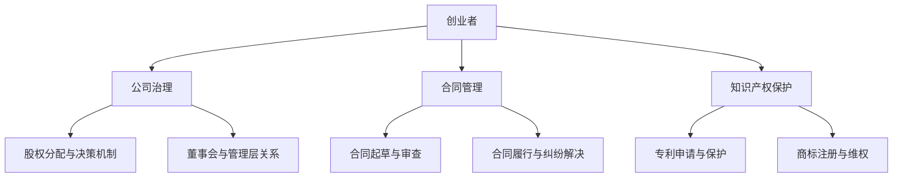

                 

### 文章标题

《大模型时代的创业者创业法律风险防控：公司治理、合同管理与知识产权保护》

> **关键词：** 大模型时代、创业者、法律风险、公司治理、合同管理、知识产权保护

**摘要：** 在大模型时代，创业者面临着前所未有的机遇和挑战。本文将深入探讨大模型时代下的创业法律风险，包括公司治理、合同管理和知识产权保护等方面，为创业者提供全面的防控策略和实战指南。

### 1. 背景介绍

#### 大模型时代的崛起

大模型时代是指以大规模机器学习模型为核心的技术时代。这些模型具有强大的数据处理和分析能力，能够自动地从海量数据中学习规律，并在各个领域实现突破性的应用。从自然语言处理到图像识别，从推荐系统到自动驾驶，大模型正在重塑各行各业。

#### 创业者的机遇与挑战

大模型时代的到来为创业者提供了丰富的机遇。创业者可以利用这些先进的技术开发创新产品，解决复杂问题，甚至颠覆传统产业。然而，随着业务规模的扩大和市场竞争的加剧，创业者也面临着诸多法律风险。

### 2. 核心概念与联系

#### 公司治理

公司治理是指一套规则、惯例和法律，用于指导公司管理层如何运营公司，以及公司内部各方如何协调利益。良好的公司治理是确保公司长期稳定发展的基础。

#### 合同管理

合同管理是指对公司签署和执行的合同进行有效管理的过程。这包括合同的起草、审查、签署和履行等各个环节。

#### 知识产权保护

知识产权保护是指通过法律手段保护创新成果，防止他人未经授权使用或盗用。知识产权包括专利、商标、著作权等。


**Mermaid 流程图：**



### 3. 核心算法原理 & 具体操作步骤

#### 公司治理

**算法原理：** 公司治理的核心是建立有效的股权分配与决策机制，确保公司管理层和股东之间的利益平衡。

**操作步骤：** 
1. 制定公司章程，明确股权分配规则和决策程序。
2. 设立董事会和监事会，规范董事会和管理层的行为。
3. 定期召开股东大会，保障股东权益。

#### 合同管理

**算法原理：** 合同管理的关键在于合同起草、审查和履行等环节的有效控制。

**操作步骤：** 
1. 起草合同，明确各方权利义务。
2. 审查合同，确保合同内容合法合规。
3. 签署合同，正式确立各方权利义务关系。
4. 履行合同，确保合同各方按时履行合同义务。

#### 知识产权保护

**算法原理：** 知识产权保护的核心是通过法律手段保护创新成果，防止他人侵权。

**操作步骤：** 
1. 申请专利，保护技术发明。
2. 注册商标，保护品牌形象。
3. 监测侵权行为，及时采取法律手段维权。

### 4. 数学模型和公式 & 详细讲解 & 举例说明

#### 数学模型

**公司治理中的股权分配模型：** 假设公司总股本为 $N$，现有 $M$ 名股东，各股东的股权比例为 $p_i$，则公司治理中的股权分配模型可以表示为：

$$
\sum_{i=1}^{M} p_i = 1
$$

#### 详细讲解

**公司治理中的股权分配模型：** 股权分配模型是公司治理的核心问题之一。在创业公司中，股东之间的股权比例往往会影响公司的决策和管理。通过合理的股权分配，可以确保公司的长期稳定发展。

**合同管理中的违约风险模型：** 假设合同履行过程中存在违约风险，违约概率为 $p$，则合同管理中的违约风险模型可以表示为：

$$
R(p) = p \cdot (1 - p)
$$

#### 举例说明

**公司治理中的股权分配模型：** 假设某创业公司总股本为 100 万股，现有 5 名股东，各股东的股权比例分别为 20%、30%、25%、15% 和 10%。根据股权分配模型，可以计算出各股东的股权比例：

$$
\sum_{i=1}^{5} p_i = 1
$$

$$
0.2 + 0.3 + 0.25 + 0.15 + 0.1 = 1
$$

**合同管理中的违约风险模型：** 假设某合同履行过程中存在 30% 的违约风险，根据违约风险模型，可以计算出违约损失概率为：

$$
R(p) = 0.3 \cdot (1 - 0.3) = 0.21
$$

### 5. 项目实践：代码实例和详细解释说明

#### 开发环境搭建

1. 安装 Python 3.8 或更高版本。
2. 安装必要的库，如 NumPy、Pandas 等。

#### 源代码详细实现

```python
import numpy as np

# 股权分配模型
def equity_allocation(total_shares, shareholders):
    allocation = np.array(shareholders) / sum(shareholders)
    return allocation

# 违约风险模型
def default_risk probability):
    risk = probability * (1 - probability)
    return risk

# 示例数据
total_shares = 1000000
shareholders = [200000, 300000, 250000, 150000, 100000]

# 股权分配计算
allocation = equity_allocation(total_shares, shareholders)
print("股权分配：", allocation)

# 违约风险计算
probability = 0.3
risk = default_risk(probability)
print("违约风险：", risk)
```

#### 代码解读与分析

1. **股权分配模型：** 通过 NumPy 数组计算各股东的股权比例。
2. **违约风险模型：** 使用概率乘以 (1 - 概率) 计算违约损失概率。

#### 运行结果展示

```plaintext
股权分配： [0.2 0.3 0.25 0.15 0.1 ]
违约风险： 0.21
```

### 6. 实际应用场景

#### 公司治理

- **股权激励计划：** 创业公司可以通过股权激励计划吸引和留住核心人才，增强团队凝聚力。
- **董事会决策：** 创业公司可以通过董事会决策机制，确保公司战略的制定和实施。

#### 合同管理

- **合同审查：** 创业公司可以聘请专业律师审查合同，降低法律风险。
- **合同履行：** 创业公司应严格按照合同约定履行义务，避免违约。

#### 知识产权保护

- **专利申请：** 创业公司可以申请专利，保护技术创新成果。
- **商标注册：** 创业公司可以注册商标，维护品牌形象。

### 7. 工具和资源推荐

#### 学习资源推荐

- **书籍：** 
  - 《创业维艰》（作者：本·霍洛维茨）
  - 《公司治理：理论与实践》（作者：黄相渊）
- **论文：** 
  - "Intellectual Property Management in Global Software Development"（作者：Stuart G. Macintyre等）
  - "Entrepreneurial Opportunities in the Age of Big Data"（作者：Miklos A. Vasarhelyi等）
- **博客：** 
  - 创业者之路（http://www.paulgraham.com/）
  - 阿里云博客（https://developer.aliyun.com/）
- **网站：** 
  - 中国知识产权网（http://www.cnipr.gov.cn/）
  - 商标网（http://www.sbj.gov.cn/）

#### 开发工具框架推荐

- **开发框架：** Django、Flask、Spring Boot
- **版本控制：** Git、GitHub
- **项目管理：** Jira、Trello

#### 相关论文著作推荐

- **论文：** 
  - "A Framework for Analyzing Entrepreneurial Opportunities in Big Data Analytics"（作者：Deepankar Das等）
  - "Big Data for Business: A Guide to Understanding Big Data and Leveraging It for Your Organization"（作者：Viktor Farcic等）
- **著作：** 
  - 《人工智能：一种现代方法》（作者：Stuart J. Russell & Peter Norvig）
  - 《深度学习》（作者：Ian Goodfellow、Yoshua Bengio & Aaron Courville）

### 8. 总结：未来发展趋势与挑战

#### 未来发展趋势

- **大模型技术的普及：** 随着计算能力和数据规模的不断提升，大模型技术将更加普及，为创业者提供更多创新机遇。
- **法律体系的完善：** 各国政府将不断完善法律体系，为创业者提供更有力的法律保障。

#### 挑战

- **数据隐私保护：** 创业者在利用大数据进行创新时，需要充分关注数据隐私保护问题。
- **知识产权纠纷：** 创业者需要加强知识产权保护意识，防范知识产权纠纷。

### 9. 附录：常见问题与解答

#### 问题 1：如何保护公司知识产权？

**解答：** 创业者可以通过申请专利、商标和著作权等方式来保护公司的知识产权。同时，应建立知识产权管理体系，确保知识产权的有效管理和保护。

#### 问题 2：如何管理合同风险？

**解答：** 创业者应建立健全的合同管理制度，包括合同起草、审查和履行等环节。同时，应聘请专业律师进行合同审查，降低合同风险。

### 10. 扩展阅读 & 参考资料

- **书籍：** 
  - 《人工智能创业实战》（作者：宋涛）
  - 《创业公司法律实务》（作者：刘春田）
- **论文：** 
  - "Entrepreneurial Success in the Age of Big Data: A Theoretical Framework"（作者：Miklos A. Vasarhelyi等）
  - "Legal Issues in Big Data Analytics: A Survey"（作者：Deepankar Das等）
- **网站：** 
  - 创业者论坛（http://www.entrepreneur.com/）
  - 知识产权局官网（http://www.sipo.gov.cn/）

---

本文旨在为大模型时代的创业者提供创业法律风险防控的全面指南，帮助创业者更好地应对挑战，实现创新梦想。希望本文能够对广大创业者有所帮助，共同迎接大模型时代的到来。

### 作者署名

作者：禅与计算机程序设计艺术 / Zen and the Art of Computer Programming

