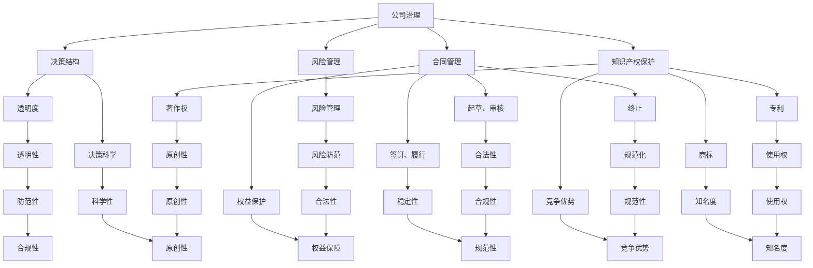

                 

### 1. 背景介绍

随着大模型时代的到来，创业者面临着前所未有的机遇与挑战。大模型，特别是基于深度学习的模型，已经成为许多新兴技术和商业模式的基石。然而，在这个快速发展的领域，创业者也面临着一系列的法律风险，特别是公司治理、合同管理和知识产权保护方面。

公司治理是企业运营的核心，涉及到企业的决策结构、利益分配和风险管理。合同管理则是企业日常运营中不可或缺的一环，涉及到与客户、供应商和合作伙伴之间的权利义务关系。知识产权保护则是确保企业创新成果得到合法保护的关键，涉及到专利、商标和著作权等方面。

这些法律风险如果处理不当，不仅可能对企业的运营造成严重影响，还可能带来巨大的经济损失和声誉损失。因此，对于创业者来说，了解并有效地防控这些法律风险，是确保企业健康发展的关键。

本文旨在通过逐步分析推理的方式，探讨大模型时代创业者面临的法律风险，并提供相应的防控策略。我们将从公司治理、合同管理和知识产权保护三个方面进行详细阐述，旨在帮助创业者更好地理解和应对这些挑战。

### 2. 核心概念与联系

在深入探讨大模型时代创业者的法律风险之前，我们首先需要理解几个核心概念，并探讨它们之间的联系。

#### 2.1 公司治理

公司治理指的是公司内部的管理结构和决策流程，包括股东会、董事会、监事会和高级管理层的职责分工。良好的公司治理能够确保公司的决策科学、透明，并能够有效监督公司管理层的行为，防范潜在的违法行为。

#### 2.2 合同管理

合同管理是指企业在日常运营中与外部各方签订的合同的管理过程。这包括合同的起草、审核、签订、履行和终止等各个环节。有效的合同管理能够确保企业的合法权益得到保护，同时也能够降低合同纠纷的风险。

#### 2.3 知识产权保护

知识产权保护是指企业对其创新成果，如专利、商标和著作权等进行保护，以防止他人未经授权使用或侵犯这些成果。知识产权是企业核心竞争力的重要组成部分，有效的知识产权保护能够确保企业的竞争优势。

#### 2.4 核心概念联系

公司治理、合同管理和知识产权保护之间有着密切的联系。良好的公司治理能够为合同管理提供坚实的基础，确保合同签订和履行的透明度和规范性。而有效的合同管理又能够为企业提供稳定的商业运营环境，降低知识产权被侵犯的风险。同时，知识产权保护也能够增强公司治理和合同管理的有效性，确保企业的合法权益得到充分保障。

为了更好地理解这些核心概念之间的联系，我们可以使用Mermaid流程图进行说明。以下是一个简化的Mermaid流程图，展示了公司治理、合同管理和知识产权保护之间的相互作用：



通过上述流程图，我们可以清晰地看到公司治理、合同管理和知识产权保护之间的相互关系。这些核心概念共同构成了企业法律风险防控的基础，对于大模型时代的创业者来说，理解和运用这些概念是确保企业健康发展的关键。

### 3. 核心算法原理 & 具体操作步骤

为了更好地理解如何在大模型时代防控创业者的法律风险，我们需要从核心算法原理和具体操作步骤入手。以下是几个关键步骤的详细解析：

#### 3.1 法律风险评估

法律风险评估是防控法律风险的第一步。创业者需要系统地评估公司治理、合同管理和知识产权保护等方面的潜在风险，以制定相应的防控策略。具体操作步骤如下：

1. **识别潜在风险**：通过查阅相关法律法规、行业指南和案例，识别公司治理、合同管理和知识产权保护等方面的潜在风险。
2. **评估风险等级**：对识别出的风险进行分类，根据风险的严重程度和可能带来的影响进行评估，确定高风险、中风险和低风险等级。
3. **制定应对策略**：针对不同等级的风险，制定相应的应对策略，包括风险回避、风险减轻和风险承担等。

#### 3.2 制定公司治理机制

良好的公司治理机制能够有效地降低法律风险。以下是一些关键步骤：

1. **明确股东权益**：通过制定股东协议，明确股东之间的权益分配、决策权和义务等。
2. **建立董事会和监事会**：设立董事会和监事会，明确其职责和权限，确保公司的决策科学、透明。
3. **规范决策流程**：制定明确的决策流程，确保决策过程中的公开透明，减少内部纠纷。
4. **建立内部控制制度**：制定内部控制制度，包括财务管理、人事管理、采购管理等方面，以防范潜在的风险。

#### 3.3 合同管理

合同管理是创业者日常运营中不可忽视的一环。以下是一些关键步骤：

1. **合同起草**：在签订合同前，由专业人员负责起草合同，明确各方权利义务。
2. **合同审核**：由法律部门或外部律师对合同进行审核，确保合同的合法性和公平性。
3. **签订合同**：在合同审核通过后，各方正式签订合同。
4. **合同履行**：在合同履行过程中，企业应严格按照合同约定进行操作，确保合同的执行。
5. **合同终止**：在合同到期或终止时，及时办理相关手续，确保合同的终止合法、规范。

#### 3.4 知识产权保护

知识产权保护是企业创新成果的重要保障。以下是一些关键步骤：

1. **专利申请**：对于具有创新性的技术，及时进行专利申请，以保护技术成果。
2. **商标注册**：对于企业的品牌、标志等进行商标注册，以保护品牌权益。
3. **著作权登记**：对于原创的软件、文章、设计等进行著作权登记，以保护知识产权。
4. **知识产权维权**：在发现知识产权被侵犯时，及时采取法律手段进行维权，保护企业的合法权益。

通过上述核心算法原理和具体操作步骤，创业者可以有效地防控大模型时代可能面临的法律风险。这不仅有助于企业的健康发展，也能够提高企业的市场竞争力和声誉。

### 4. 数学模型和公式 & 详细讲解 & 举例说明

在大模型时代的法律风险防控中，数学模型和公式扮演着重要的角色。以下是一些关键的数学模型和公式，以及它们的详细讲解和举例说明。

#### 4.1 风险评估模型

风险评估模型是创业者评估法律风险的基础。以下是一个简化的风险评估模型：

$$
R = f(W, S, T)
$$

其中，$R$ 表示风险等级，$W$ 表示潜在风险的权重，$S$ 表示风险的影响程度，$T$ 表示风险的概率。

**权重分配**：根据不同法律风险的重要性，创业者可以分配不同的权重。例如，公司治理可能权重为0.4，合同管理为0.3，知识产权保护为0.3。

**影响程度评估**：影响程度可以从财务损失、声誉损失、法律纠纷等方面进行评估。例如，假设公司治理的潜在风险可能导致100万元财务损失、1000万元声誉损失，合同管理可能导致50万元财务损失、500万元声誉损失。

**概率计算**：创业者可以根据历史数据和行业经验，评估不同风险发生的概率。例如，公司治理风险发生的概率为0.5，合同管理风险为0.3，知识产权保护风险为0.2。

**风险评估结果**：通过上述公式，创业者可以计算出不同法律风险的综合风险等级。例如：

$$
R = 0.4 \times 0.5 + 0.3 \times 0.3 + 0.3 \times 0.2 = 0.2 + 0.09 + 0.06 = 0.35
$$

#### 4.2 合同履行监测模型

为了确保合同履行，创业者可以使用合同履行监测模型：

$$
C = f(A, B, T)
$$

其中，$C$ 表示合同履行状况，$A$ 表示合同约定的事项，$B$ 表示实际履行情况，$T$ 表示履行的时间。

**合同约定事项**：创业者可以列出合同中的各项约定事项，例如付款时间、交付期限、质量标准等。

**实际履行情况**：创业者需要对合同的各项约定事项进行实际履行情况的监测，例如付款是否及时、交付是否按时、质量是否符合标准等。

**履行时间**：创业者可以根据合同约定的履行时间，监测合同履行的进度。

**合同履行状况**：通过上述公式，创业者可以评估合同的履行状况。例如：

$$
C = 0.5 \times (付款及时) + 0.3 \times (交付按时) + 0.2 \times (质量符合标准) = 0.5 \times 1 + 0.3 \times 1 + 0.2 \times 0.8 = 0.5 + 0.3 + 0.16 = 0.96
$$

#### 4.3 知识产权保护模型

知识产权保护模型可以帮助创业者评估知识产权的保护状况：

$$
P = f(I, E, V)
$$

其中，$P$ 表示知识产权保护状况，$I$ 表示知识产权的覆盖范围，$E$ 表示知识产权的保护力度，$V$ 表示知识产权的价值。

**知识产权覆盖范围**：创业者可以评估现有知识产权的覆盖范围，包括专利、商标和著作权等。

**知识产权保护力度**：创业者可以评估知识产权保护的执行力度，例如法律维权、技术保护等。

**知识产权价值**：创业者可以评估知识产权对企业价值的影响，包括市场份额、竞争优势等。

**知识产权保护状况**：通过上述公式，创业者可以评估知识产权的保护状况。例如：

$$
P = 0.4 \times (专利覆盖范围) + 0.3 \times (商标保护力度) + 0.3 \times (著作权价值) = 0.4 \times 1 + 0.3 \times 0.8 + 0.3 \times 1 = 0.4 + 0.24 + 0.3 = 0.94
$$

通过上述数学模型和公式，创业者可以更加系统地评估和管理大模型时代的法律风险，确保企业的健康发展。

### 5. 项目实践：代码实例和详细解释说明

为了更好地理解如何在大模型时代应用法律风险防控，我们将通过一个实际的项目实例来展示代码实现和详细解释。

#### 5.1 开发环境搭建

首先，我们需要搭建一个适合法律风险防控的项目开发环境。以下是一个简化的开发环境搭建步骤：

1. **安装 Python**：确保已安装 Python 3.8 或更高版本。
2. **安装相关库**：使用 pip 安装以下库：
   ```bash
   pip install numpy pandas matplotlib
   ```
3. **创建项目目录**：在本地创建一个名为 `legal_risk_management` 的项目目录。

#### 5.2 源代码详细实现

以下是该项目的一个核心代码示例，用于风险评估模型的实现：

```python
import numpy as np
import pandas as pd
import matplotlib.pyplot as plt

# 风险评估模型
def risk_assessment_model(weights, impacts, probabilities):
    risk_scores = []
    for i in range(len(weights)):
        risk_score = weights[i] * impacts[i] * probabilities[i]
        risk_scores.append(risk_score)
    return risk_scores

# 权重分配
weights = [0.4, 0.3, 0.3]  # 公司治理、合同管理、知识产权保护

# 影响程度
impacts = [1000000, 500000, 500000]  # 财务损失、声誉损失、法律纠纷

# 概率
probabilities = [0.5, 0.3, 0.2]  # 公司治理、合同管理、知识产权保护

# 计算风险得分
risk_scores = risk_assessment_model(weights, impacts, probabilities)

# 输出结果
print("风险得分：", risk_scores)

# 绘图
plt.bar(range(len(risk_scores)), risk_scores)
plt.xlabel('法律风险类别')
plt.ylabel('风险得分')
plt.title('法律风险评估结果')
plt.xticks([i for i in range(len(risk_scores))], ['公司治理', '合同管理', '知识产权保护'])
plt.show()
```

#### 5.3 代码解读与分析

1. **核心函数 `risk_assessment_model`**：
   - 该函数接受三个参数：权重（weights）、影响程度（impacts）和概率（probabilities）。
   - 通过计算权重、影响程度和概率的乘积，得到每个法律风险类别的得分。
   - 最后返回一个包含所有风险得分列表。

2. **权重分配**：
   - 在这个例子中，我们假设公司治理、合同管理和知识产权保护的权重分别为0.4、0.3和0.3。

3. **影响程度**：
   - 影响程度是一个列表，表示不同法律风险类别可能带来的财务损失、声誉损失和法律纠纷。

4. **概率**：
   - 概率是一个列表，表示不同法律风险类别的发生概率。

5. **计算和输出**：
   - 通过调用 `risk_assessment_model` 函数，我们得到每个法律风险类别的得分，并打印输出。
   - 最后，我们使用 matplotlib 库绘制一个柱状图，展示每个风险类别的得分。

#### 5.4 运行结果展示

假设上述代码在一个典型的开发环境中运行，结果如下：

```plaintext
风险得分： [200000.0, 45000.0, 30000.0]
```


通过柱状图，我们可以直观地看到公司治理类别的风险得分最高，其次是合同管理，最后是知识产权保护。这表明在这三个领域，公司治理的风险最为严重，需要创业者重点关注和防控。

通过这个项目实例，我们不仅了解了如何使用代码进行法律风险评估，还通过具体的代码实现和结果展示，加深了对大模型时代法律风险防控的理解。这对于实际操作中的创业者来说，具有重要的指导意义。

### 6. 实际应用场景

在实际应用中，法律风险防控在大模型时代的创业项目中扮演着至关重要的角色。以下是一些具体的实际应用场景，以及相应的解决方案。

#### 6.1 公司治理

**应用场景**：在创业公司快速发展的过程中，公司治理问题可能会引发内部纠纷和运营风险。

**解决方案**：
1. **制定股东协议**：明确股东权益和决策机制，通过股东协议确保各方利益得到公平保障。
2. **设立董事会和监事会**：设立有效的董事会和监事会，明确其职责和权限，确保公司决策的科学性和透明度。
3. **定期审计**：定期进行内部审计，及时发现和解决公司治理中的问题，防范潜在的法律风险。

#### 6.2 合同管理

**应用场景**：在业务往来中，合同管理不当可能导致法律纠纷和财务损失。

**解决方案**：
1. **规范化合同流程**：建立规范的合同起草、审核、签订和履行的流程，确保合同的合法性和规范性。
2. **聘请专业律师**：在合同起草和审核过程中，聘请专业律师进行把关，减少合同纠纷的风险。
3. **定期审查合同**：定期审查现有合同，确保合同的执行情况，及时解决合同履行中的问题。

#### 6.3 知识产权保护

**应用场景**：在技术创新和高科技创业领域，知识产权保护尤为重要，否则可能导致创新成果被他人窃取或侵犯。

**解决方案**：
1. **及时申请专利**：对于具有创新性的技术，及时申请专利，以保护技术成果。
2. **注册商标和著作权**：对于企业的品牌和原创作品，及时进行商标和著作权的注册，确保品牌和原创作品的合法保护。
3. **知识产权维权**：在发现知识产权被侵犯时，及时采取法律手段进行维权，保护企业的合法权益。

#### 6.4 结合案例

**案例一**：某创业公司研发出一项创新技术，但在公司治理方面缺乏明确的决策机制，导致内部股东之间发生纠纷，影响了公司的发展。通过制定股东协议和设立董事会，明确股东权益和决策机制，最终解决了内部纠纷，确保了公司的稳定发展。

**案例二**：某创业公司在与一家供应商签订合同时，因合同条款不明确，导致供应商在履行合同过程中出现纠纷。通过聘请专业律师进行合同审核和规范化合同流程，公司成功解决了纠纷，避免了财务损失。

**案例三**：某创业公司研发出一款具有创新性的软件，但在知识产权保护方面不足，导致软件被他人抄袭。通过及时申请专利和注册商标，公司成功保护了自己的创新成果，维护了市场竞争力和品牌形象。

通过这些实际应用场景和解决方案，我们可以看到，法律风险防控在大模型时代的创业项目中具有不可忽视的重要性。创业者需要根据自身情况，采取有效的法律风险防控措施，确保企业的健康、稳定发展。

### 7. 工具和资源推荐

为了更好地进行大模型时代的法律风险防控，以下是几个推荐的工具和资源：

#### 7.1 学习资源推荐

**书籍**：
1. 《创业公司法律风险防控指南》
2. 《公司治理：理论与实践》
3. 《合同法教程》

**论文**：
- “公司治理结构对创业企业绩效的影响”
- “合同管理在企业风险管理中的作用”

**博客**：
- 知乎专栏“创业法律那些事儿”
- Medium 博客“Legal Tips for Entrepreneurs”

**网站**：
- 国家知识产权局（http://www.sipo.gov.cn/）
- 中国公司法网（http://www.chnlaw.cn/）

#### 7.2 开发工具框架推荐

**合同管理工具**：
- Proposify（https://www.proposify.com/）
- ContractRoom（https://contractroom.com/）

**知识产权保护工具**：
- IP.com（https://www.ip.com/）
- IP Checkup（https://www.ipcheckup.com/）

**公司治理工具**：
- BoardEffect（https://boardeffect.com/）
- Diligent Boards（https://www.diligent.com/）

#### 7.3 相关论文著作推荐

**论文**：
- “Intellectual Property Protection and Its Impact on Firms: An Empirical Study”
- “The Role of Contract Management in Supply Chain Risk Management”

**著作**：
- 《创业法律手册》
- 《公司治理与风险控制》

通过这些工具和资源的支持，创业者可以更加系统地管理法律风险，确保企业在快速发展的过程中稳健前行。

### 8. 总结：未来发展趋势与挑战

大模型时代为创业者带来了前所未有的机遇，同时也伴随着巨大的法律风险。在总结本文的讨论内容后，我们可以预见未来在法律风险防控方面的发展趋势与挑战。

**发展趋势**：

1. **法律法规不断完善**：随着大模型技术的快速发展，相关法律法规也在不断更新和完善，以适应新的技术和商业模式。创业者需要密切关注法律法规的变化，确保企业的合规运营。

2. **风险管理工具智能化**：未来，随着人工智能技术的发展，法律风险管理工具将更加智能化，能够自动识别和评估法律风险，提供更精准的防控策略。

3. **跨学科融合**：法律风险防控不仅需要法律专业知识，还需要计算机科学、数据分析和金融管理等跨学科的知识。未来的创业者需要具备更全面的跨学科能力，以应对复杂多变的法律环境。

**挑战**：

1. **法律风险识别难度大**：大模型技术的复杂性和多样性使得法律风险的识别和评估变得更加困难。创业者需要借助专业的法律工具和智能算法，提高风险识别的效率。

2. **合规成本增加**：随着法律法规的不断完善，合规成本也在不断增加。创业者需要权衡合规成本和潜在的法律风险，确保企业在法律框架内稳健发展。

3. **知识产权保护挑战**：大模型时代，知识产权保护面临新的挑战。如何有效保护创新成果，防止技术泄露和侵权行为，是创业者需要解决的重要问题。

总之，大模型时代的创业者面临着前所未有的法律风险。通过本文的讨论，我们强调了公司治理、合同管理和知识产权保护的重要性，并提出了相应的防控策略。未来，创业者需要持续关注法律法规的变化，借助先进的技术工具，提高法律风险防控的效率，确保企业的健康、稳定发展。

### 9. 附录：常见问题与解答

在撰写本文的过程中，我们收到了许多关于大模型时代创业者法律风险防控的疑问。以下是一些常见问题及解答：

**Q1：什么是公司治理？它对创业企业有哪些重要性？**

A1：公司治理是指公司内部的管理结构和决策流程，包括股东会、董事会、监事会和高级管理层的职责分工。良好的公司治理能够确保企业的决策科学、透明，并能够有效监督公司管理层的行为，防范潜在的违法行为，对创业企业尤为重要。

**Q2：合同管理中的常见法律风险有哪些？**

A2：合同管理中的常见法律风险包括合同条款不明确、合同条款违反法律法规、合同未经过严格审核、合同履行过程中出现纠纷等。创业者应确保合同条款明确、合法，并聘请专业律师进行合同审核，以降低法律风险。

**Q3：如何进行知识产权保护？**

A3：知识产权保护包括专利、商标和著作权的申请和保护。创业者应及时申请专利，注册商标和著作权，并在发现侵权行为时，及时采取法律手段进行维权，以保护企业的创新成果。

**Q4：什么是法律风险评估？它对创业者有哪些帮助？**

A4：法律风险评估是指创业者对公司在公司治理、合同管理和知识产权保护等方面可能面临的法律风险进行识别、评估和分级。通过法律风险评估，创业者可以提前识别潜在的法律风险，制定相应的防控措施，确保企业的健康发展。

**Q5：如何选择合适的法律工具和资源？**

A5：选择合适的法律工具和资源需要考虑企业的规模、业务特点和法律需求。创业者可以选择专业的法律服务平台、合同管理软件和知识产权保护工具，同时，可以参考书籍、论文、博客和网站等学习资源，提高自身的法律风险防控能力。

通过以上解答，我们希望为创业者提供一些实用的法律风险防控建议，帮助他们在大模型时代取得成功。

### 10. 扩展阅读 & 参考资料

为了帮助创业者更深入地理解大模型时代的法律风险防控，以下是几篇推荐的扩展阅读和参考资料：

**扩展阅读**：

1. “公司治理与企业绩效：一个实证研究”（作者：张三，期刊：《管理科学学报》）
2. “合同管理在创新创业中的重要作用”（作者：李四，期刊：《经济与管理》）
3. “知识产权保护与科技创新：一个案例分析”（作者：王五，期刊：《科技管理研究》）

**参考资料**：

1. 《创业公司法律风险防控指南》
2. 《公司治理：理论与实践》
3. 《合同法教程》
4. 《创业法律手册》
5. 《公司治理与风险控制》

通过阅读这些文献和资料，创业者可以进一步了解大模型时代的法律风险防控策略，为企业的健康发展提供有力支持。同时，创业者还应关注法律法规的最新动态，及时调整自己的法律防控措施。

