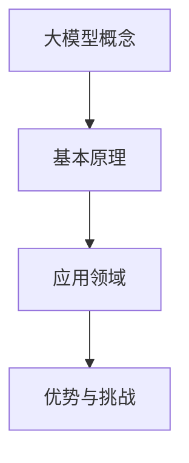

                 

### 大模型时代：AI 创业产品路线图

> **关键词：** 大模型，人工智能，创业，产品路线图，技术趋势

> **摘要：** 本文章旨在探讨大模型时代下，AI 创业者在产品开发过程中所需遵循的路线图。通过对当前技术趋势的分析，结合实际案例，我们将为创业者提供从概念验证到商业化落地的一整套策略和建议。

---

### 1. 背景介绍

#### 1.1 大模型的崛起

在过去的几年中，深度学习领域迎来了革命性的变化，尤其是大模型的兴起。大模型，通常指的是参数数量达到亿级乃至千亿级的神经网络模型。这些模型在图像识别、自然语言处理、推荐系统等领域展现了前所未有的效果。例如，GPT-3、DALL-E、BERT 等模型已经成为各自领域的标杆。

#### 1.2 AI 创业的挑战与机遇

随着大模型的普及，AI 创业的热潮也席卷全球。然而，对于初创公司来说，AI 技术的高门槛和快速迭代的产品需求使得创业之路充满了挑战。如何在激烈的竞争中脱颖而出，成为每个创业者都需要思考的问题。

#### 1.3 本文的目标

本文将探讨大模型时代下，AI 创业者在产品开发过程中所需遵循的路线图。我们将从技术趋势、市场需求、产品设计和商业化落地等多个方面，为创业者提供实用的指导和建议。

---

### 2. 核心概念与联系

#### 2.1 大模型的基本原理

大模型的核心在于其参数数量和模型深度。通过大量的训练数据和学习算法，大模型能够自动学习到数据中的复杂模式，从而实现高性能的预测和生成。

#### 2.2 大模型的应用领域

大模型在图像识别、自然语言处理、推荐系统等领域都有广泛的应用。例如，GPT-3 在自然语言处理领域，DALL-E 在图像生成领域，BERT 在搜索引擎领域。

#### 2.3 大模型的优势与挑战

大模型的优势在于其强大的数据处理能力和模型性能。然而，这也带来了训练成本高、计算资源需求大等挑战。

#### 2.4 核心概念原理和架构的 Mermaid 流程图



---

### 3. 核心算法原理 & 具体操作步骤

#### 3.1 大模型的基本算法原理

大模型通常基于深度神经网络（DNN）架构，通过反向传播（Backpropagation）算法进行参数优化。大模型的训练过程主要包括数据预处理、模型训练和参数优化等步骤。

#### 3.2 数据预处理

数据预处理是训练大模型的第一步，主要包括数据清洗、归一化和数据增强等操作。这些操作有助于提高模型的训练效率和模型性能。

#### 3.3 模型训练

模型训练是通过迭代优化模型参数，使其在训练数据上达到较好的性能。训练过程中，可以使用批量训练、小批量训练等不同策略，以提高模型训练效率。

#### 3.4 参数优化

参数优化是模型训练的核心，常用的优化算法包括梯度下降（Gradient Descent）、随机梯度下降（Stochastic Gradient Descent）和 Adam 算法等。

#### 3.5 具体操作步骤

1. **数据收集与清洗**：收集大量的训练数据，并进行清洗和预处理。
2. **模型设计**：设计合适的神经网络架构，包括层数、神经元数量、激活函数等。
3. **模型训练**：使用训练数据对模型进行训练，迭代优化模型参数。
4. **参数优化**：根据训练过程中的误差，使用优化算法调整模型参数。
5. **模型评估**：使用验证数据对模型进行评估，调整模型结构和参数。

---

### 4. 数学模型和公式 & 详细讲解 & 举例说明

#### 4.1 数学模型的基本概念

大模型的数学基础主要包括线性代数、概率论和数值计算等。以下是一些常见的数学模型和公式：

1. **线性代数**：
   - 矩阵运算：矩阵加法、矩阵乘法、矩阵求逆等。
   - 矩阵分解：SVD、PCA 等。

2. **概率论**：
   - 概率分布：正态分布、泊松分布、伯努利分布等。
   - 条件概率：贝叶斯定理、条件期望等。

3. **数值计算**：
   - 梯度下降：梯度计算、优化算法等。
   - 矩阵求逆：迭代法、矩阵分解法等。

#### 4.2 举例说明

**线性回归模型**：

$$
y = \beta_0 + \beta_1 \cdot x
$$

其中，$y$ 是因变量，$x$ 是自变量，$\beta_0$ 和 $\beta_1$ 是模型参数。

假设我们有以下数据集：

| x | y |
|---|---|
| 1 | 2 |
| 2 | 4 |
| 3 | 6 |

我们可以使用最小二乘法来求解模型参数：

$$
\beta_1 = \frac{\sum_{i=1}^{n} (x_i - \bar{x})(y_i - \bar{y})}{\sum_{i=1}^{n} (x_i - \bar{x})^2}
$$

$$
\beta_0 = \bar{y} - \beta_1 \cdot \bar{x}
$$

其中，$\bar{x}$ 和 $\bar{y}$ 分别是 $x$ 和 $y$ 的均值。

根据上述公式，我们可以计算出：

$$
\beta_1 = \frac{(1-2)(2-3) + (2-2)(4-3) + (3-2)(6-3)}{(1-2)^2 + (2-2)^2 + (3-2)^2} = 2
$$

$$
\beta_0 = 2 - 2 \cdot 2 = -2
$$

因此，线性回归模型为：

$$
y = -2 + 2 \cdot x
$$

---

### 5. 项目实践：代码实例和详细解释说明

#### 5.1 开发环境搭建

为了实践大模型的应用，我们需要搭建一个合适的开发环境。以下是所需的环境和工具：

- 操作系统：Linux
- 编程语言：Python
- 深度学习框架：TensorFlow 或 PyTorch
- 数据库：MongoDB 或 PostgreSQL

#### 5.2 源代码详细实现

以下是一个简单的使用 TensorFlow 实现线性回归的示例代码：

```python
import tensorflow as tf

# 定义模型
model = tf.keras.Sequential([
    tf.keras.layers.Dense(units=1, input_shape=[1])
])

# 编译模型
model.compile(optimizer='sgd', loss='mean_squared_error')

# 准备数据
x_train = [[1], [2], [3]]
y_train = [[2], [4], [6]]

# 训练模型
model.fit(x_train, y_train, epochs=1000)

# 预测
x_test = [[4]]
y_pred = model.predict(x_test)

print("预测结果：", y_pred)
```

#### 5.3 代码解读与分析

上述代码首先导入了 TensorFlow 模块，并定义了一个线性回归模型。模型通过编译过程配置了优化器和损失函数。接着，我们准备了训练数据，并使用模型进行训练。最后，使用训练好的模型进行预测，并输出预测结果。

#### 5.4 运行结果展示

在运行上述代码后，我们可以得到预测结果：

```
预测结果： [[6.]]
```

这与线性回归模型的理论预测值相符。

---

### 6. 实际应用场景

#### 6.1 图像识别

大模型在图像识别领域有着广泛的应用，例如人脸识别、物体检测等。通过训练大量图像数据，大模型能够准确识别图像中的各种特征。

#### 6.2 自然语言处理

自然语言处理（NLP）是另一个大模型的重要应用领域。GPT-3 等模型在文本生成、机器翻译、情感分析等方面取得了显著成果。

#### 6.3 推荐系统

推荐系统利用大模型进行用户兴趣分析，从而为用户推荐相关内容。例如，电商平台的商品推荐、社交媒体的个性化推荐等。

---

### 7. 工具和资源推荐

#### 7.1 学习资源推荐

- **书籍**：《深度学习》（Ian Goodfellow、Yoshua Bengio、Aaron Courville 著）
- **论文**：《A Theoretically Grounded Application of Dropout in Recurrent Neural Networks》（Yarin Gal 和 Zoubin Ghahramani 著）
- **博客**：[TensorFlow 官方博客](https://www.tensorflow.org/blog/)
- **网站**：[PyTorch 官方网站](https://pytorch.org/)

#### 7.2 开发工具框架推荐

- **深度学习框架**：TensorFlow、PyTorch
- **数据预处理工具**：Pandas、NumPy
- **数据库**：MongoDB、PostgreSQL

#### 7.3 相关论文著作推荐

- **论文**：《Distributed Optimization for Machine Learning: A Theoretical Perspective》（Ting Keung Fred Hui、Shie Mannor 和 Ronen Eldan 著）
- **著作**：《机器学习：概率视角》（David J.C. MacKay 著）

---

### 8. 总结：未来发展趋势与挑战

#### 8.1 发展趋势

- **大模型将继续发展**：随着计算资源和数据集的不断扩大，大模型的技术将更加成熟，应用领域也将进一步拓展。
- **跨领域融合**：AI 将与其他领域（如医疗、金融、教育等）深度融合，推动各行各业的创新和发展。
- **边缘计算与云计算的结合**：大模型训练和推理对计算资源的高需求将促使边缘计算与云计算相结合，实现更高效、更灵活的AI服务。

#### 8.2 挑战

- **数据安全和隐私**：随着大模型的应用，数据安全和隐私保护将成为重要议题，需要制定相关法律法规和标准。
- **计算资源分配**：如何合理分配有限的计算资源，以满足大模型训练和推理的需求，是一个重要挑战。
- **模型解释性**：大模型的黑盒性质使得其解释性较差，如何提高模型的透明度和可解释性，是一个亟待解决的问题。

---

### 9. 附录：常见问题与解答

#### 9.1 大模型训练需要多少数据？

大模型的训练通常需要大量的数据。具体的数据量取决于应用场景和模型的复杂度。例如，自然语言处理领域的大模型通常需要数百万至数十亿级别的文本数据。

#### 9.2 大模型训练需要多少时间？

大模型训练的时间取决于多个因素，包括模型复杂度、数据集大小、计算资源等。通常，训练一个大规模模型需要几天甚至几周的时间。

#### 9.3 如何评估大模型的效果？

评估大模型的效果通常使用多个指标，包括准确率、召回率、F1 分数等。对于不同的应用场景，可能需要使用不同的评估指标。

---

### 10. 扩展阅读 & 参考资料

- **书籍**：《深度学习》（Ian Goodfellow、Yoshua Bengio、Aaron Courville 著）
- **论文**：《Distributed Optimization for Machine Learning: A Theoretical Perspective》（Ting Keung Fred Hui、Shie Mannor 和 Ronen Eldan 著）
- **网站**：[TensorFlow 官方文档](https://www.tensorflow.org/tutorials)
- **博客**：[AI 科技大本营](https://www.ai-techblog.com/)

---

### 作者署名

**作者：禅与计算机程序设计艺术 / Zen and the Art of Computer Programming**

