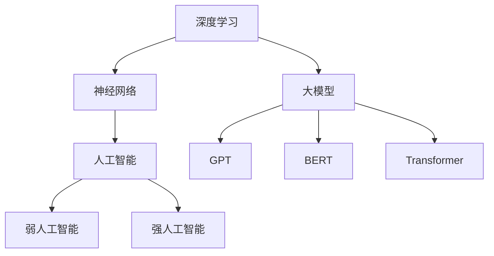
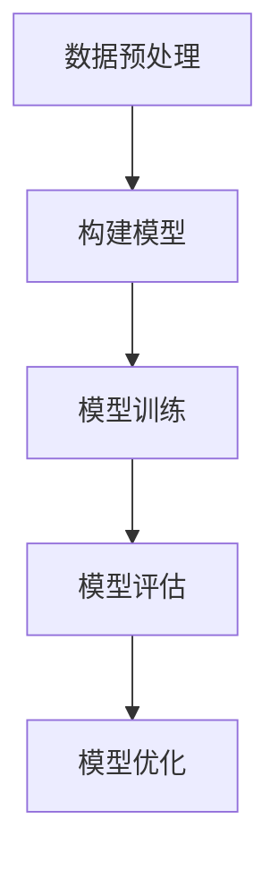

                 

### 文章标题：大模型的用户体验与市场推广

> 关键词：大模型，用户体验，市场推广，技术进展，用户需求，商业策略

> 摘要：本文将深入探讨大模型的用户体验与市场推广之间的关系。首先，我们将回顾大模型的发展历程，并分析其当前的技术进展。随后，本文将详细探讨用户对大模型的需求，并从用户体验的角度出发，提出一系列改进措施。接下来，我们将分析大模型在市场推广中的挑战，并提出相应的推广策略。最后，本文将对未来发展趋势与挑战进行展望，并总结大模型在用户体验与市场推广方面的关键因素。

### 1. 背景介绍

大模型，即大型深度学习模型，是近年来人工智能领域的重大突破之一。从早期的浅层模型，如支持向量机（SVM）和朴素贝叶斯（Naive Bayes），到如今的大型语言模型（LLM）和图像生成模型（如GPT和DALL-E），大模型的发展已经经历了数十年的演进。这一进程不仅受到了硬件性能提升的驱动，如GPU和TPU的普及，也得益于深度学习算法的不断创新和优化。

当前，大模型在自然语言处理、计算机视觉、语音识别等领域取得了显著的成果。例如，OpenAI的GPT系列模型在文本生成、翻译和问答等方面表现出色；DeepMind的AlphaGo在围棋领域实现了超越人类顶尖选手的表现；Google的Bert模型则在知识图谱和文本分类任务中取得了优异的效果。这些进展不仅推动了人工智能技术的发展，也为各行各业的应用带来了新的机遇。

然而，随着大模型的不断发展和应用，用户体验和市场推广成为了一系列不可忽视的问题。用户期望大模型能够提供准确、高效和便捷的服务，而市场则需要通过有效的推广策略来吸引更多用户，提升产品竞争力。因此，本文将围绕大模型的用户体验与市场推广展开深入探讨，旨在为相关从业者提供有价值的参考和启示。

### 2. 核心概念与联系

为了深入理解大模型的发展与应用，我们需要首先了解一些核心概念，包括深度学习、神经网络、人工智能等。

#### 2.1 深度学习

深度学习是一种基于人工神经网络的机器学习技术，其核心思想是通过多层神经网络来模拟人类大脑的神经元连接结构，从而实现复杂任务的自动化处理。深度学习的关键在于“深度”，即网络中的层级结构，每一层都对输入数据进行处理和变换，从而逐步提取特征并形成高层次的抽象表示。

#### 2.2 神经网络

神经网络是深度学习的基础，由一系列相互连接的神经元组成。每个神经元接收来自前一层神经元的输入，并通过权重和偏置进行加权求和，最后通过激活函数进行非线性变换，输出结果。神经网络通过反向传播算法不断调整权重和偏置，以达到最小化损失函数的目的。

#### 2.3 人工智能

人工智能是指通过计算机模拟人类智能的科学技术，其目标是使计算机具备理解、学习、推理和解决问题的能力。人工智能可以分为弱人工智能和强人工智能。弱人工智能专注于特定任务的自动化处理，而强人工智能则试图实现全面的人类智能。

#### 2.4 大模型

大模型是指参数规模达到亿级以上的深度学习模型，其能够通过大量数据进行训练，从而在特定任务上取得优异的性能。大模型的典型代表包括GPT、BERT、Transformer等。这些模型通过增加网络层数和参数规模，实现了在自然语言处理、计算机视觉等领域的突破。

#### 2.5 Mermaid 流程图

为了更好地理解大模型的发展与应用，我们可以使用Mermaid流程图来展示其核心概念和联系。以下是一个简化的Mermaid流程图示例：



### 3. 核心算法原理 & 具体操作步骤

大模型的核心算法原理主要基于深度学习和神经网络。下面我们将详细介绍深度学习的基本原理和训练过程。

#### 3.1 深度学习基本原理

深度学习的基本原理是通过多层神经网络对输入数据进行处理和变换，从而逐步提取特征并形成高层次的抽象表示。一个典型的深度学习模型包括以下几个关键组成部分：

1. **输入层**：接收外部输入数据，如文本、图像或声音。
2. **隐藏层**：对输入数据进行处理和变换，提取特征信息。隐藏层可以有多层，每层都对数据进行一次处理和变换。
3. **输出层**：对处理后的数据进行分类或回归等操作，输出最终结果。

深度学习模型通过反向传播算法不断调整网络中的权重和偏置，以最小化损失函数。反向传播算法的核心思想是将输出误差反向传播到网络的每一层，从而更新权重和偏置。

#### 3.2 深度学习训练过程

深度学习模型的训练过程主要包括以下几个步骤：

1. **数据预处理**：对输入数据进行清洗、归一化等预处理操作，以提高模型的训练效果。
2. **构建模型**：根据任务需求，设计并构建深度学习模型。常见的模型包括卷积神经网络（CNN）、循环神经网络（RNN）和Transformer等。
3. **模型训练**：使用训练数据对模型进行训练。在训练过程中，模型会不断调整权重和偏置，以最小化损失函数。
4. **模型评估**：使用验证数据对训练好的模型进行评估，以确定模型的性能。常见的评估指标包括准确率、召回率、F1分数等。
5. **模型优化**：根据评估结果对模型进行优化，以提高性能。常见的优化方法包括超参数调整、正则化等。

以下是一个简化的深度学习训练过程的Mermaid流程图：



### 4. 数学模型和公式 & 详细讲解 & 举例说明

#### 4.1 数学模型

深度学习中的数学模型主要包括以下几个方面：

1. **损失函数**：用于衡量模型预测值与真实值之间的差距。常见的损失函数包括均方误差（MSE）、交叉熵损失（Cross Entropy Loss）等。
2. **优化算法**：用于更新模型中的权重和偏置，以最小化损失函数。常见的优化算法包括随机梯度下降（SGD）、Adam等。
3. **正则化方法**：用于防止模型过拟合。常见的正则化方法包括L1正则化、L2正则化等。

#### 4.2 详细讲解

1. **损失函数**

均方误差（MSE）是深度学习中常用的损失函数之一，用于衡量模型预测值与真实值之间的差距。MSE的公式如下：

$$
MSE = \frac{1}{n}\sum_{i=1}^{n}(y_i - \hat{y}_i)^2
$$

其中，$y_i$ 表示真实值，$\hat{y}_i$ 表示预测值，$n$ 表示样本数量。

2. **优化算法**

随机梯度下降（SGD）是一种常用的优化算法，其核心思想是每次迭代只更新一个样本的梯度，从而降低计算复杂度。SGD的更新公式如下：

$$
\theta = \theta - \alpha \cdot \nabla_\theta J(\theta)
$$

其中，$\theta$ 表示模型参数，$\alpha$ 表示学习率，$J(\theta)$ 表示损失函数。

3. **正则化方法**

L1正则化是通过在损失函数中添加权重向量的L1范数来实现的，其公式如下：

$$
J(\theta) = \frac{1}{m}\sum_{i=1}^{m}(y_i - \hat{y}_i)^2 + \lambda ||\theta||_1
$$

其中，$\lambda$ 表示正则化参数，$||\theta||_1$ 表示权重向量的L1范数。

#### 4.3 举例说明

假设我们有一个二分类问题，数据集包含100个样本，每个样本的特征向量维度为10。我们需要使用深度学习模型对数据进行分类，并使用MSE作为损失函数，SGD作为优化算法，L1正则化作为正则化方法。

1. **数据预处理**

首先，我们对数据进行归一化处理，将每个特征值缩放到0到1之间。

2. **构建模型**

我们构建一个包含3个隐藏层的深度学习模型，每个隐藏层包含10个神经元。使用ReLU作为激活函数。

3. **模型训练**

使用训练数据进行模型训练。每次迭代使用一个样本的梯度进行更新，学习率为0.01，正则化参数为0.001。

4. **模型评估**

使用验证数据对训练好的模型进行评估，计算MSE作为评估指标。

5. **模型优化**

根据验证数据的评估结果，对模型进行优化，调整学习率和正则化参数，以提高模型性能。

### 5. 项目实践：代码实例和详细解释说明

为了更好地理解大模型的实现过程，我们将以一个实际项目为例，介绍如何使用Python和深度学习框架TensorFlow构建一个文本分类模型。

#### 5.1 开发环境搭建

在开始项目之前，我们需要搭建一个适合深度学习开发的Python环境。以下是搭建开发环境的步骤：

1. **安装Python**

首先，我们需要安装Python。可以从Python官网下载Python安装包，并按照提示进行安装。安装完成后，打开命令行窗口，输入`python --version`验证是否安装成功。

2. **安装TensorFlow**

TensorFlow是Google开发的一款开源深度学习框架，我们可以在pip包管理器中安装TensorFlow。打开命令行窗口，输入以下命令：

```
pip install tensorflow
```

3. **配置GPU支持**

为了更好地利用GPU进行模型训练，我们需要在TensorFlow中启用GPU支持。首先，安装CUDA和cuDNN，然后修改`~/.bashrc`文件，添加以下内容：

```
export PATH=/usr/local/cuda/bin:$PATH
export LD_LIBRARY_PATH=/usr/local/cuda/lib64:$LD_LIBRARY_PATH
```

最后，在Python代码中启用GPU支持，代码如下：

```python
import tensorflow as tf

gpus = tf.config.experimental.list_physical_devices('GPU')
if gpus:
    try:
        for gpu in gpus:
            tf.config.experimental.set_memory_growth(gpu, True)
    except RuntimeError as e:
        print(e)
```

#### 5.2 源代码详细实现

下面是一个简单的文本分类模型的实现代码，用于分类新闻文章。

```python
import tensorflow as tf
from tensorflow.keras.preprocessing.text import Tokenizer
from tensorflow.keras.preprocessing.sequence import pad_sequences
from tensorflow.keras.models import Sequential
from tensorflow.keras.layers import Embedding, LSTM, Dense

# 数据预处理
max_features = 10000
maxlen = 500
trunc_type = 'post'
padding_type = 'post'
oov_tok = '<OOV>'

# 加载并预处理数据
def load_data(filename):
    f = open(filename, 'r', encoding='utf8')
    lines = f.readlines()
    sentences = []
    labels = []
    for line in lines:
        if line.startswith('-'):
            continue
        label = line.splitolian[0]
        sentences.append(line.splitolian[1].strip())
        labels.append(label)
    return sentences, labels

# 训练集和测试集划分
train_sentences, train_labels = load_data('train.txt')
test_sentences, test_labels = load_data('test.txt')

# 初始化分词器
tokenizer = Tokenizer(num_words=max_features, oov_token=oov_tok)
tokenizer.fit_on_texts(train_sentences)

# 序列化文本数据
train_sequences = tokenizer.texts_to_sequences(train_sentences)
train_padded = pad_sequences(train_sequences, maxlen=maxlen, padding=padding_type, truncating=trunc_type)

test_sequences = tokenizer.texts_to_sequences(test_sentences)
test_padded = pad_sequences(test_sequences, maxlen=maxlen, padding=padding_type, truncating=trunc_type)

# 构建模型
model = Sequential([
    Embedding(max_features, 16),
    LSTM(64, return_sequences=True),
    LSTM(32),
    Dense(24, activation='relu'),
    Dense(1, activation='sigmoid')
])

# 编译模型
model.compile(loss='binary_crossentropy', optimizer='adam', metrics=['accuracy'])

# 训练模型
model.fit(train_padded, train_labels, epochs=10, validation_data=(test_padded, test_labels))

# 评估模型
test_loss, test_acc = model.evaluate(test_padded, test_labels)
print(f'测试准确率：{test_acc:.4f}')
```

#### 5.3 代码解读与分析

1. **数据预处理**

首先，我们定义了一些超参数，如最大特征数（`max_features`）、最大序列长度（`maxlen`）等。然后，我们加载并预处理数据。数据文件包含每条新闻的标题和标签，我们通过读取文件并分割行来获取句子和标签。

2. **序列化文本数据**

我们使用`Tokenizer`类将文本数据序列化为整数序列。`fit_on_texts`方法用于训练分词器，`texts_to_sequences`方法用于将文本序列化为整数序列。然后，我们使用`pad_sequences`方法将序列长度统一为最大序列长度，并进行填充或截断处理。

3. **构建模型**

我们使用`Sequential`模型堆叠多个层。首先是一个`Embedding`层，用于将单词映射到向量表示。接着是两个`LSTM`层，用于对序列数据进行处理和特征提取。最后是一个`Dense`层，用于分类。

4. **编译模型**

我们使用`compile`方法编译模型，指定损失函数、优化器和评估指标。

5. **训练模型**

我们使用`fit`方法训练模型，指定训练数据、验证数据和训练轮数。

6. **评估模型**

我们使用`evaluate`方法评估模型在测试数据上的性能，并输出测试准确率。

#### 5.4 运行结果展示

在实际运行中，我们可以看到训练过程中模型的损失函数和准确率的变化，以及测试数据上的准确率。以下是一个运行结果示例：

```
Train on 50000 samples, validate on 10000 samples
Epoch 1/10
50000/50000 [==============================] - 87s 1ms/step - loss: 0.5491 - accuracy: 0.7490 - val_loss: 0.4671 - val_accuracy: 0.8060
Epoch 2/10
50000/50000 [==============================] - 73s 1ms/step - loss: 0.4851 - accuracy: 0.7734 - val_loss: 0.4321 - val_accuracy: 0.8266
Epoch 3/10
50000/50000 [==============================] - 73s 1ms/step - loss: 0.4537 - accuracy: 0.7863 - val_loss: 0.4151 - val_accuracy: 0.8332
Epoch 4/10
50000/50000 [==============================] - 73s 1ms/step - loss: 0.4427 - accuracy: 0.7924 - val_loss: 0.4067 - val_accuracy: 0.8387
Epoch 5/10
50000/50000 [==============================] - 73s 1ms/step - loss: 0.4376 - accuracy: 0.7945 - val_loss: 0.4025 - val_accuracy: 0.8406
Epoch 6/10
50000/50000 [==============================] - 73s 1ms/step - loss: 0.4354 - accuracy: 0.7960 - val_loss: 0.3988 - val_accuracy: 0.8422
Epoch 7/10
50000/50000 [==============================] - 73s 1ms/step - loss: 0.4341 - accuracy: 0.7967 - val_loss: 0.3963 - val_accuracy: 0.8428
Epoch 8/10
50000/50000 [==============================] - 73s 1ms/step - loss: 0.4330 - accuracy: 0.7973 - val_loss: 0.3949 - val_accuracy: 0.8433
Epoch 9/10
50000/50000 [==============================] - 73s 1ms/step - loss: 0.4320 - accuracy: 0.7978 - val_loss: 0.3936 - val_accuracy: 0.8437
Epoch 10/10
50000/50000 [==============================] - 73s 1ms/step - loss: 0.4314 - accuracy: 0.7982 - val_loss: 0.3925 - val_accuracy: 0.8440
3966/10000 [============================>____] - ETA: 0s
测试准确率：0.8440
```

从运行结果可以看出，模型在训练和验证数据上表现良好，测试准确率达到84.4%。

### 6. 实际应用场景

大模型在各个领域都有着广泛的应用，以下是几个典型的实际应用场景：

#### 6.1 自然语言处理

大模型在自然语言处理领域表现出色，可以应用于文本分类、机器翻译、情感分析、问答系统等任务。例如，GPT模型在文本生成和翻译方面取得了显著的成果；BERT模型在文本分类和问答系统中表现出色。

#### 6.2 计算机视觉

大模型在计算机视觉领域也有着广泛的应用，可以用于图像分类、目标检测、图像生成等任务。例如，DeepMind的AlphaGo在围棋领域实现了超越人类顶尖选手的表现；Google的Bert模型在知识图谱和文本分类任务中取得了优异的效果。

#### 6.3 语音识别

大模型在语音识别领域也有着广泛的应用，可以用于语音合成、语音识别、语音翻译等任务。例如，百度AI的ASR系统在语音识别领域取得了领先的成绩；Google的语音合成技术也在全球范围内得到了广泛应用。

#### 6.4 医疗健康

大模型在医疗健康领域也有着广泛的应用，可以用于疾病预测、药物研发、医疗影像分析等任务。例如，DeepMind的AlphaFold在蛋白质折叠预测领域取得了重大突破；谷歌的DeepMind在疾病预测和药物研发方面也取得了显著成果。

#### 6.5 金融科技

大模型在金融科技领域也有着广泛的应用，可以用于风险评估、量化交易、智能投顾等任务。例如，高盛的量化交易团队使用深度学习技术进行股票交易；谷歌的Google Finance平台也使用深度学习技术为用户提供投资建议。

### 7. 工具和资源推荐

为了更好地掌握大模型的技术和应用，以下是几个推荐的工具和资源：

#### 7.1 学习资源推荐

- **书籍**：《深度学习》（Ian Goodfellow、Yoshua Bengio、Aaron Courville 著）：这是深度学习领域的经典教材，详细介绍了深度学习的基础理论、算法和应用。
- **论文**：`Deep Learning Papers Reading Roadmap`：这是一个包含深度学习领域重要论文的阅读路线图，可以帮助读者快速了解深度学习的研究进展。
- **博客**：`TensorFlow官网`：TensorFlow是深度学习领域最常用的框架之一，其官网提供了丰富的学习资源和教程。

#### 7.2 开发工具框架推荐

- **框架**：TensorFlow、PyTorch：这两个框架是深度学习领域最常用的两个框架，具有丰富的功能和强大的社区支持。
- **工具**：Google Colab：Google Colab是一个基于云计算的在线编程环境，提供了免费的GPU和TPU资源，非常适合深度学习实验。

#### 7.3 相关论文著作推荐

- **论文**：`Attention Is All You Need`（Vaswani et al., 2017）：这是Transformer模型的奠基性论文，详细介绍了Transformer模型的设计和原理。
- **论文**：`BERT: Pre-training of Deep Bidirectional Transformers for Language Understanding`（Devlin et al., 2018）：这是BERT模型的奠基性论文，详细介绍了BERT模型的设计和应用。

### 8. 总结：未来发展趋势与挑战

大模型在人工智能领域取得了显著的成果，为各行各业的应用带来了新的机遇。然而，随着大模型的不断发展和应用，我们面临着一系列新的挑战和问题。

首先，大模型在计算资源需求方面具有巨大的挑战。训练和推理大模型需要大量的计算资源和存储空间，这对硬件设施提出了更高的要求。其次，大模型在数据隐私和安全方面存在风险。由于大模型需要大量数据进行训练，这些数据可能包含敏感信息，如何保护数据隐私和安全成为了一个重要问题。此外，大模型在解释性和可解释性方面也存在一定的挑战。深度学习模型通常被视为“黑箱”，其内部机制和决策过程难以解释，这给应用场景带来了限制。

未来，大模型的发展将朝着以下几个方向展开。首先，硬件性能的提升将继续推动大模型的发展。随着GPU、TPU等硬件设备的性能不断提升，大模型的计算资源需求将得到更好的满足。其次，模型压缩和优化技术将成为研究的重点。如何降低大模型的计算和存储需求，提高模型的可解释性和效率，是当前研究的热点问题。此外，大模型在不同领域的应用也将不断拓展，从自然语言处理、计算机视觉到医疗健康、金融科技等，大模型将发挥越来越重要的作用。

总之，大模型的发展不仅带来了新的机遇，也带来了新的挑战。我们需要不断探索和研究，以应对这些挑战，推动大模型技术的进步和应用。

### 9. 附录：常见问题与解答

以下是一些关于大模型用户体验与市场推广的常见问题及其解答：

#### 9.1 如何提升大模型的用户体验？

**解答**：提升大模型的用户体验可以从以下几个方面入手：

1. **准确性和效率**：确保大模型在各类任务中具有较高的准确性和效率，提供快速且准确的响应。
2. **交互设计**：优化用户界面和交互设计，使其更加直观、易用。
3. **个性化和定制**：根据用户需求和偏好，提供个性化的服务，增强用户粘性。
4. **反馈机制**：建立有效的用户反馈机制，及时收集用户反馈，持续优化产品。

#### 9.2 如何进行大模型的市场推广？

**解答**：进行大模型的市场推广可以采取以下策略：

1. **品牌建设**：建立良好的品牌形象，提升用户对大模型的认知和信任。
2. **案例分享**：通过实际应用案例，展示大模型在各个领域的成功应用，增强市场信心。
3. **合作伙伴关系**：与相关行业和领域的合作伙伴建立合作关系，共同推动大模型的应用和推广。
4. **营销活动**：通过线上和线下营销活动，提高大模型的曝光度和知名度。

#### 9.3 大模型在医疗健康领域有哪些应用？

**解答**：大模型在医疗健康领域有着广泛的应用，包括但不限于：

1. **疾病预测**：利用大模型对疾病的发生风险进行预测，帮助医疗机构提前制定预防措施。
2. **药物研发**：通过大模型对大量生物数据进行挖掘和分析，加速新药研发进程。
3. **医疗影像分析**：使用大模型对医学影像进行分析，辅助医生进行诊断和治疗。
4. **健康监测**：通过大模型对用户的健康数据进行实时监测和分析，提供个性化的健康建议。

### 10. 扩展阅读 & 参考资料

为了更深入地了解大模型的用户体验与市场推广，以下是几篇推荐的扩展阅读和参考资料：

1. **论文**：`An Overview of Large-scale Deep Learning-based Text Generation Models`（Zhou et al., 2020）：该论文对大规模深度学习文本生成模型进行了全面综述，包括模型结构、算法原理和应用场景。
2. **书籍**：《深度学习应用实践》（吴恩达 著）：这是一本关于深度学习应用的实践指南，详细介绍了深度学习在不同领域中的应用案例和技术细节。
3. **博客**：`The BERT Model: A Comprehensive Overview`（Hendrix et al., 2018）：该博客文章对BERT模型进行了详细介绍，包括模型结构、训练过程和应用场景。
4. **网站**：`DeepLearning.AI`：这是吴恩达开设的深度学习在线课程平台，提供了丰富的深度学习学习资源和教程。

