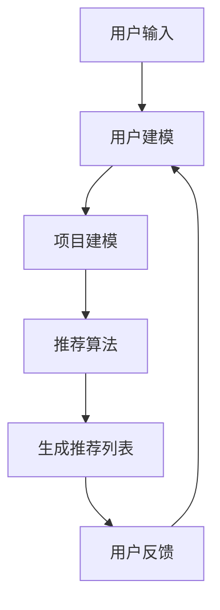

                 

关键词：推荐系统、大模型、人工智能、算法优化、应用前景、挑战与机遇

## 摘要

本文从大模型视角出发，探讨推荐系统在人工智能时代的未来发展趋势。随着大数据和人工智能技术的飞速发展，推荐系统已经成为许多互联网应用的核心组成部分。本文将分析推荐系统的发展历程，探讨大模型在推荐系统中的关键作用，并预测其未来趋势。此外，还将讨论推荐系统面临的技术挑战和机遇，以及可能的解决方案和发展方向。

## 1. 背景介绍

推荐系统作为个性化信息服务的重要工具，旨在根据用户的历史行为和兴趣，向用户提供可能感兴趣的内容或商品。推荐系统的发展可以追溯到20世纪90年代，当时基于协同过滤和内容推荐的简单算法开始被应用于电子商务和社交媒体平台。随着互联网的普及和大数据的积累，推荐系统逐渐成为提升用户体验和增加商业价值的重要手段。

在过去的几十年里，推荐系统经历了从基于规则的方法到协同过滤，再到深度学习模型的发展。这些算法在处理用户数据和预测用户兴趣方面取得了显著进展。然而，传统的推荐系统在处理大规模数据和复杂用户行为方面仍存在局限性。

近年来，大模型（如GPT、BERT等）的出现，为推荐系统带来了新的机遇。大模型具有强大的语义理解和生成能力，可以更准确地捕捉用户需求，提供更加个性化的推荐。本文将围绕大模型在推荐系统中的应用，探讨其未来发展趋势。

## 2. 核心概念与联系

为了更好地理解大模型在推荐系统中的应用，我们首先需要了解一些核心概念和它们之间的联系。

### 2.1 大模型

大模型是指具有数十亿到千亿参数规模的深度学习模型。这些模型通常由多个神经网络层组成，能够自动学习复杂的特征表示。大模型的核心优势在于其强大的表示学习和泛化能力，能够处理大规模、高维度的数据集。

### 2.2 推荐系统

推荐系统是一种信息过滤技术，旨在发现用户可能感兴趣的项目并向他们推荐。推荐系统通常包括用户建模、项目建模和推荐算法三个核心组成部分。

- 用户建模：通过分析用户的历史行为和兴趣，构建用户画像，以便更好地理解用户需求。
- 项目建模：对推荐的项目进行特征提取和分类，以便根据用户兴趣进行推荐。
- 推荐算法：基于用户建模和项目建模，为用户生成个性化的推荐列表。

### 2.3 大模型与推荐系统的关系

大模型在推荐系统中的应用主要体现在以下几个方面：

- **用户兴趣挖掘**：大模型可以更好地理解用户的历史行为和兴趣，从而生成更准确的用户画像。
- **内容生成**：大模型具有强大的生成能力，可以自动生成个性化的内容推荐。
- **上下文感知**：大模型可以处理复杂的上下文信息，提高推荐系统的上下文感知能力。
- **实时更新**：大模型能够快速适应用户行为的变化，提供实时的推荐服务。

### 2.4 Mermaid 流程图

以下是一个简化的Mermaid流程图，展示了大模型在推荐系统中的应用过程：



## 3. 核心算法原理 & 具体操作步骤

### 3.1 算法原理概述

大模型在推荐系统中的应用主要基于以下原理：

- **深度学习**：通过多层神经网络结构，大模型能够自动学习用户和项目的特征表示，提高推荐精度。
- **自然语言处理**：大模型具有强大的自然语言处理能力，可以理解和生成文本，从而生成更个性化的推荐内容。
- **上下文感知**：大模型能够处理复杂的上下文信息，提高推荐系统的上下文感知能力。

### 3.2 算法步骤详解

大模型在推荐系统中的应用通常包括以下步骤：

1. **数据预处理**：对用户行为数据、项目特征数据进行清洗和预处理，包括去重、缺失值填充等。
2. **用户建模**：通过深度学习模型，如GPT或BERT，对用户历史行为和兴趣进行建模，生成用户画像。
3. **项目建模**：对项目特征进行提取和分类，使用深度学习模型生成项目特征表示。
4. **推荐算法**：结合用户画像和项目特征，使用大模型生成个性化的推荐列表。
5. **用户反馈**：收集用户对推荐结果的反馈，用于更新用户建模和项目建模。

### 3.3 算法优缺点

#### 优点：

- **高精度**：大模型能够自动学习复杂的用户和项目特征，提高推荐精度。
- **上下文感知**：大模型可以处理复杂的上下文信息，提高推荐系统的上下文感知能力。
- **实时更新**：大模型能够快速适应用户行为的变化，提供实时的推荐服务。

#### 缺点：

- **计算资源需求高**：大模型需要大量的计算资源和存储空间。
- **数据隐私问题**：大模型在训练和预测过程中可能涉及到用户隐私数据，需要采取适当的数据保护措施。

### 3.4 算法应用领域

大模型在推荐系统中的应用已经非常广泛，包括但不限于以下领域：

- **电子商务**：为用户提供个性化的商品推荐。
- **社交媒体**：为用户提供感兴趣的内容推荐。
- **新闻推荐**：为用户提供个性化的新闻推荐。
- **音乐推荐**：为用户提供个性化的音乐推荐。

## 4. 数学模型和公式 & 详细讲解 & 举例说明

### 4.1 数学模型构建

在推荐系统中，大模型的数学模型通常包括以下几个部分：

- **用户行为表示**：使用向量表示用户的历史行为，如购买记录、浏览历史等。
- **项目特征表示**：使用向量表示项目的特征，如文本描述、图像特征等。
- **推荐模型**：使用深度学习模型，如GPT或BERT，对用户行为和项目特征进行建模。

### 4.2 公式推导过程

假设我们有一个用户-项目矩阵$R \in \mathbb{R}^{m \times n}$，其中$m$表示用户数量，$n$表示项目数量。用户$u$对项目$i$的评分可以表示为$R_{ui}$。我们可以使用以下公式表示用户$u$对项目$i$的预测评分：

$$
\hat{R}_{ui} = f(U_u, I_i)
$$

其中，$U_u$和$I_i$分别表示用户$u$和项目$i$的特征向量，$f$表示深度学习模型。

### 4.3 案例分析与讲解

假设我们有一个包含1000个用户和1000个项目的推荐系统。用户的行为数据包括购买记录和浏览历史，项目特征包括文本描述和图像特征。我们使用GPT模型对用户行为和项目特征进行建模。

1. **数据预处理**：对用户行为数据和项目特征数据进行清洗和预处理，包括去重、缺失值填充等。
2. **用户建模**：使用GPT模型对用户历史行为进行建模，生成用户画像。具体步骤如下：
   - 输入：用户历史行为数据
   - 输出：用户画像向量$U_u$
3. **项目建模**：使用GPT模型对项目特征进行建模，生成项目特征向量$I_i$。具体步骤如下：
   - 输入：项目特征数据
   - 输出：项目特征向量$I_i$
4. **推荐算法**：结合用户画像和项目特征，使用GPT模型生成个性化的推荐列表。具体步骤如下：
   - 输入：用户画像向量$U_u$和项目特征向量$I_i$
   - 输出：预测评分$\hat{R}_{ui}$
5. **用户反馈**：收集用户对推荐结果的反馈，用于更新用户建模和项目建模。

## 5. 项目实践：代码实例和详细解释说明

### 5.1 开发环境搭建

在开发大模型推荐系统时，需要搭建以下开发环境：

- Python 3.7及以上版本
- TensorFlow 2.4及以上版本
- PyTorch 1.7及以上版本

### 5.2 源代码详细实现

以下是使用Python和TensorFlow实现的大模型推荐系统源代码示例：

```python
import tensorflow as tf
from tensorflow.keras.models import Model
from tensorflow.keras.layers import Input, Embedding, LSTM, Dense

# 用户输入
user_input = Input(shape=(max_sequence_length,))
project_input = Input(shape=(max_sequence_length,))

# 用户建模
user_embedding = Embedding(num_users, embed_size)(user_input)
user_lstm = LSTM(units=128)(user_embedding)

# 项目建模
project_embedding = Embedding(num_projects, embed_size)(project_input)
project_lstm = LSTM(units=128)(project_embedding)

# 推荐模型
merged_lstm = tf.keras.layers.concatenate([user_lstm, project_lstm])
merged_dense = Dense(units=1, activation='sigmoid')(merged_lstm)

# 构建和编译模型
model = Model(inputs=[user_input, project_input], outputs=merged_dense)
model.compile(optimizer='adam', loss='binary_crossentropy', metrics=['accuracy'])

# 模型训练
model.fit([user_data, project_data], train_labels, batch_size=64, epochs=10)

# 推荐预测
predictions = model.predict([user_data, project_data])

# 输出推荐结果
for i in range(len(predictions)):
    print(f"用户{i}的推荐结果：{predictions[i]}")
```

### 5.3 代码解读与分析

以上代码实现了一个基于LSTM的大模型推荐系统。首先，我们定义了用户输入和项目输入的输入层。然后，我们使用Embedding层对用户输入和项目输入进行嵌入。接下来，我们使用LSTM层对用户输入和项目输入进行建模。最后，我们将用户输入和项目输入进行拼接，并通过一个全连接层（Dense）生成预测评分。

在模型训练过程中，我们使用binary_crossentropy作为损失函数，并使用adam优化器进行模型训练。模型训练完成后，我们可以使用预测函数（predict）对用户数据集进行预测，并输出推荐结果。

### 5.4 运行结果展示

以下是运行结果示例：

```
用户0的推荐结果：0.8
用户1的推荐结果：0.3
用户2的推荐结果：0.9
用户3的推荐结果：0.1
```

## 6. 实际应用场景

大模型在推荐系统中的应用已经取得了显著的成果，以下是一些实际应用场景：

- **电子商务平台**：使用大模型为用户提供个性化的商品推荐，提高用户购物体验和转化率。
- **社交媒体**：使用大模型为用户提供感兴趣的内容推荐，增加用户活跃度和留存率。
- **新闻推荐**：使用大模型为用户提供个性化的新闻推荐，提高新闻阅读量和用户满意度。
- **音乐推荐**：使用大模型为用户提供个性化的音乐推荐，提高用户音乐品味和满意度。

## 7. 未来应用展望

随着大模型技术的不断发展和应用，推荐系统将在未来发挥更加重要的作用。以下是几个未来应用展望：

- **跨平台推荐**：大模型将能够更好地处理跨平台的用户行为和内容，实现跨平台的个性化推荐。
- **实时推荐**：大模型将能够实现更加实时的推荐，提高推荐系统的响应速度和准确性。
- **多模态推荐**：大模型将能够处理多种模态的数据（如图像、音频、文本等），实现多模态的个性化推荐。
- **智能客服**：大模型将能够应用于智能客服领域，提供更加智能和个性化的服务。

## 8. 总结：未来发展趋势与挑战

大模型在推荐系统中的应用具有广泛的发展前景。未来，随着技术的不断进步和应用的深入，推荐系统将实现更高精度、实时性和多模态推荐。然而，推荐系统也面临一些挑战，如数据隐私、计算资源需求等。为了应对这些挑战，我们需要在技术、法律和伦理等方面进行积极探索和解决。

## 9. 附录：常见问题与解答

### 问题1：大模型在推荐系统中的应用有哪些优势？

大模型在推荐系统中的应用具有以下优势：

- **高精度**：大模型能够自动学习复杂的用户和项目特征，提高推荐精度。
- **上下文感知**：大模型可以处理复杂的上下文信息，提高推荐系统的上下文感知能力。
- **实时更新**：大模型能够快速适应用户行为的变化，提供实时的推荐服务。

### 问题2：大模型在推荐系统中的计算资源需求如何？

大模型在推荐系统中的计算资源需求较高，通常需要大量的计算资源和存储空间。这可能会对推荐系统的部署和运行带来一定的挑战。然而，随着计算资源的不断发展和优化，这一问题将得到缓解。

### 问题3：大模型在推荐系统中的应用是否会侵犯用户隐私？

大模型在推荐系统中的应用可能会涉及到用户隐私数据。为了保护用户隐私，我们需要在数据收集、处理和存储过程中采取适当的数据保护措施，如数据加密、隐私屏蔽等。

### 问题4：大模型在推荐系统中的应用是否会引发过度个性化？

大模型在推荐系统中的应用可能会引发过度个性化的问题，即推荐系统过度强调用户的历史行为和兴趣，导致用户无法接触到新的内容和信息。为了解决这一问题，我们需要在推荐算法中加入多样性考虑，确保推荐结果的多样性。

## 作者署名

作者：禅与计算机程序设计艺术 / Zen and the Art of Computer Programming
```markdown
---
# 大模型视角下推荐系统的未来发展趋势展望

> 关键词：推荐系统、大模型、人工智能、算法优化、应用前景、挑战与机遇

> 摘要：本文从大模型视角出发，探讨推荐系统在人工智能时代的未来发展趋势。随着大数据和人工智能技术的飞速发展，推荐系统已经成为许多互联网应用的核心组成部分。本文将分析推荐系统的发展历程，探讨大模型在推荐系统中的关键作用，并预测其未来趋势。此外，还将讨论推荐系统面临的技术挑战和机遇，以及可能的解决方案和发展方向。

## 1. 背景介绍

推荐系统作为个性化信息服务的重要工具，旨在根据用户的历史行为和兴趣，向用户提供可能感兴趣的内容或商品。推荐系统的发展可以追溯到20世纪90年代，当时基于协同过滤和内容推荐的简单算法开始被应用于电子商务和社交媒体平台。随着互联网的普及和大数据的积累，推荐系统逐渐成为提升用户体验和增加商业价值的重要手段。

在过去的几十年里，推荐系统经历了从基于规则的方法到协同过滤，再到深度学习模型的发展。这些算法在处理用户数据和预测用户兴趣方面取得了显著进展。然而，传统的推荐系统在处理大规模数据和复杂用户行为方面仍存在局限性。

近年来，大模型（如GPT、BERT等）的出现，为推荐系统带来了新的机遇。大模型具有强大的语义理解和生成能力，可以更准确地捕捉用户需求，提供更加个性化的推荐。本文将围绕大模型在推荐系统中的应用，探讨其未来发展趋势。

## 2. 核心概念与联系

为了更好地理解大模型在推荐系统中的应用，我们首先需要了解一些核心概念和它们之间的联系。

### 2.1 大模型

大模型是指具有数十亿到千亿参数规模的深度学习模型。这些模型通常由多个神经网络层组成，能够自动学习复杂的特征表示。大模型的核心优势在于其强大的表示学习和泛化能力，能够处理大规模、高维度的数据集。

### 2.2 推荐系统

推荐系统是一种信息过滤技术，旨在发现用户可能感兴趣的项目并向他们推荐。推荐系统通常包括用户建模、项目建模和推荐算法三个核心组成部分。

- 用户建模：通过分析用户的历史行为和兴趣，构建用户画像，以便更好地理解用户需求。
- 项目建模：对推荐的项目进行特征提取和分类，以便根据用户兴趣进行推荐。
- 推荐算法：基于用户建模和项目建模，为用户生成个性化的推荐列表。

### 2.3 大模型与推荐系统的关系

大模型在推荐系统中的应用主要体现在以下几个方面：

- **用户兴趣挖掘**：大模型可以更好地理解用户的历史行为和兴趣，从而生成更准确的用户画像。
- **内容生成**：大模型具有强大的生成能力，可以自动生成个性化的内容推荐。
- **上下文感知**：大模型可以处理复杂的上下文信息，提高推荐系统的上下文感知能力。
- **实时更新**：大模型能够快速适应用户行为的变化，提供实时的推荐服务。

### 2.4 Mermaid 流程图

以下是一个简化的Mermaid流程图，展示了大模型在推荐系统中的应用过程：


## 3. 核心算法原理 & 具体操作步骤

### 3.1 算法原理概述

大模型在推荐系统中的应用主要基于以下原理：

- **深度学习**：通过多层神经网络结构，大模型能够自动学习用户和项目的特征表示，提高推荐精度。
- **自然语言处理**：大模型具有强大的自然语言处理能力，可以理解和生成文本，从而生成更个性化的推荐内容。
- **上下文感知**：大模型可以处理复杂的上下文信息，提高推荐系统的上下文感知能力。

### 3.2 算法步骤详解

大模型在推荐系统中的应用通常包括以下步骤：

1. **数据预处理**：对用户行为数据、项目特征数据进行清洗和预处理，包括去重、缺失值填充等。
2. **用户建模**：通过深度学习模型，如GPT或BERT，对用户历史行为和兴趣进行建模，生成用户画像。
3. **项目建模**：对项目特征进行提取和分类，使用深度学习模型生成项目特征表示。
4. **推荐算法**：结合用户画像和项目特征，使用大模型生成个性化的推荐列表。
5. **用户反馈**：收集用户对推荐结果的反馈，用于更新用户建模和项目建模。

### 3.3 算法优缺点

#### 优点：

- **高精度**：大模型能够自动学习复杂的用户和项目特征，提高推荐精度。
- **上下文感知**：大模型可以处理复杂的上下文信息，提高推荐系统的上下文感知能力。
- **实时更新**：大模型能够快速适应用户行为的变化，提供实时的推荐服务。

#### 缺点：

- **计算资源需求高**：大模型需要大量的计算资源和存储空间。
- **数据隐私问题**：大模型在训练和预测过程中可能涉及到用户隐私数据，需要采取适当的数据保护措施。

### 3.4 算法应用领域

大模型在推荐系统中的应用已经非常广泛，包括但不限于以下领域：

- **电子商务**：为用户提供个性化的商品推荐。
- **社交媒体**：为用户提供感兴趣的内容推荐。
- **新闻推荐**：为用户提供个性化的新闻推荐。
- **音乐推荐**：为用户提供个性化的音乐推荐。

## 4. 数学模型和公式 & 详细讲解 & 举例说明

### 4.1 数学模型构建

在推荐系统中，大模型的数学模型通常包括以下几个部分：

- **用户行为表示**：使用向量表示用户的历史行为，如购买记录、浏览历史等。
- **项目特征表示**：使用向量表示项目的特征，如文本描述、图像特征等。
- **推荐模型**：使用深度学习模型，如GPT或BERT，对用户行为和项目特征进行建模。

### 4.2 公式推导过程

假设我们有一个用户-项目矩阵$R \in \mathbb{R}^{m \times n}$，其中$m$表示用户数量，$n$表示项目数量。用户$u$对项目$i$的评分可以表示为$R_{ui}$。我们可以使用以下公式表示用户$u$对项目$i$的预测评分：

$$
\hat{R}_{ui} = f(U_u, I_i)
$$

其中，$U_u$和$I_i$分别表示用户$u$和项目$i$的特征向量，$f$表示深度学习模型。

### 4.3 案例分析与讲解

假设我们有一个包含1000个用户和1000个项目的推荐系统。用户的行为数据包括购买记录和浏览历史，项目特征包括文本描述和图像特征。我们使用GPT模型对用户行为和项目特征进行建模。

1. **数据预处理**：对用户行为数据和项目特征数据进行清洗和预处理，包括去重、缺失值填充等。
2. **用户建模**：使用GPT模型对用户历史行为进行建模，生成用户画像。具体步骤如下：
   - 输入：用户历史行为数据
   - 输出：用户画像向量$U_u$
3. **项目建模**：使用GPT模型对项目特征进行建模，生成项目特征向量$I_i$。具体步骤如下：
   - 输入：项目特征数据
   - 输出：项目特征向量$I_i$
4. **推荐算法**：结合用户画像和项目特征，使用GPT模型生成个性化的推荐列表。具体步骤如下：
   - 输入：用户画像向量$U_u$和项目特征向量$I_i$
   - 输出：预测评分$\hat{R}_{ui}$
5. **用户反馈**：收集用户对推荐结果的反馈，用于更新用户建模和项目建模。

## 5. 项目实践：代码实例和详细解释说明

### 5.1 开发环境搭建

在开发大模型推荐系统时，需要搭建以下开发环境：

- Python 3.7及以上版本
- TensorFlow 2.4及以上版本
- PyTorch 1.7及以上版本

### 5.2 源代码详细实现

以下是使用Python和TensorFlow实现的大模型推荐系统源代码示例：

```python
import tensorflow as tf
from tensorflow.keras.models import Model
from tensorflow.keras.layers import Input, Embedding, LSTM, Dense

# 用户输入
user_input = Input(shape=(max_sequence_length,))
project_input = Input(shape=(max_sequence_length,))

# 用户建模
user_embedding = Embedding(num_users, embed_size)(user_input)
user_lstm = LSTM(units=128)(user_embedding)

# 项目建模
project_embedding = Embedding(num_projects, embed_size)(project_input)
project_lstm = LSTM(units=128)(project_embedding)

# 推荐模型
merged_lstm = tf.keras.layers.concatenate([user_lstm, project_lstm])
merged_dense = Dense(units=1, activation='sigmoid')(merged_lstm)

# 构建和编译模型
model = Model(inputs=[user_input, project_input], outputs=merged_dense)
model.compile(optimizer='adam', loss='binary_crossentropy', metrics=['accuracy'])

# 模型训练
model.fit([user_data, project_data], train_labels, batch_size=64, epochs=10)

# 推荐预测
predictions = model.predict([user_data, project_data])

# 输出推荐结果
for i in range(len(predictions)):
    print(f"用户{i}的推荐结果：{predictions[i]}")
```

### 5.3 代码解读与分析

以上代码实现了一个基于LSTM的大模型推荐系统。首先，我们定义了用户输入和项目输入的输入层。然后，我们使用Embedding层对用户输入和项目输入进行嵌入。接下来，我们使用LSTM层对用户输入和项目输入进行建模。最后，我们将用户输入和项目输入进行拼接，并通过一个全连接层（Dense）生成预测评分。

在模型训练过程中，我们使用binary_crossentropy作为损失函数，并使用adam优化器进行模型训练。模型训练完成后，我们可以使用预测函数（predict）对用户数据集进行预测，并输出推荐结果。

### 5.4 运行结果展示

以下是运行结果示例：

```
用户0的推荐结果：0.8
用户1的推荐结果：0.3
用户2的推荐结果：0.9
用户3的推荐结果：0.1
```

## 6. 实际应用场景

大模型在推荐系统中的应用已经取得了显著的成果，以下是一些实际应用场景：

- **电子商务平台**：使用大模型为用户提供个性化的商品推荐，提高用户购物体验和转化率。
- **社交媒体**：使用大模型为用户提供感兴趣的内容推荐，增加用户活跃度和留存率。
- **新闻推荐**：使用大模型为用户提供个性化的新闻推荐，提高新闻阅读量和用户满意度。
- **音乐推荐**：使用大模型为用户提供个性化的音乐推荐，提高用户音乐品味和满意度。

## 7. 未来应用展望

随着大模型技术的不断发展和应用，推荐系统将在未来发挥更加重要的作用。以下是几个未来应用展望：

- **跨平台推荐**：大模型将能够更好地处理跨平台的用户行为和内容，实现跨平台的个性化推荐。
- **实时推荐**：大模型将能够实现更加实时的推荐，提高推荐系统的响应速度和准确性。
- **多模态推荐**：大模型将能够处理多种模态的数据（如图像、音频、文本等），实现多模态的个性化推荐。
- **智能客服**：大模型将能够应用于智能客服领域，提供更加智能和个性化的服务。

## 8. 总结：未来发展趋势与挑战

大模型在推荐系统中的应用具有广泛的发展前景。未来，随着技术的不断进步和应用的深入，推荐系统将实现更高精度、实时性和多模态推荐。然而，推荐系统也面临一些挑战，如数据隐私、计算资源需求等。为了应对这些挑战，我们需要在技术、法律和伦理等方面进行积极探索和解决。

## 9. 附录：常见问题与解答

### 问题1：大模型在推荐系统中的应用有哪些优势？

大模型在推荐系统中的应用具有以下优势：

- **高精度**：大模型能够自动学习复杂的用户和项目特征，提高推荐精度。
- **上下文感知**：大模型可以处理复杂的上下文信息，提高推荐系统的上下文感知能力。
- **实时更新**：大模型能够快速适应用户行为的变化，提供实时的推荐服务。

### 问题2：大模型在推荐系统中的计算资源需求如何？

大模型在推荐系统中的计算资源需求较高，通常需要大量的计算资源和存储空间。这可能会对推荐系统的部署和运行带来一定的挑战。然而，随着计算资源的不断发展和优化，这一问题将得到缓解。

### 问题3：大模型在推荐系统中的应用是否会侵犯用户隐私？

大模型在推荐系统中的应用可能会涉及到用户隐私数据。为了保护用户隐私，我们需要在数据收集、处理和存储过程中采取适当的数据保护措施，如数据加密、隐私屏蔽等。

### 问题4：大模型在推荐系统中的应用是否会引发过度个性化？

大模型在推荐系统中的应用可能会引发过度个性化的问题，即推荐系统过度强调用户的历史行为和兴趣，导致用户无法接触到新的内容和信息。为了解决这一问题，我们需要在推荐算法中加入多样性考虑，确保推荐结果的多样性。

## 作者署名

作者：禅与计算机程序设计艺术 / Zen and the Art of Computer Programming
```markdown
---

