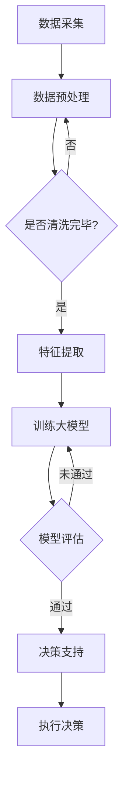

                 

 > **关键词**：大模型、智慧金融、风险控制、决策支持、人工智能、金融科技、创业者、风险预测、数据分析

> **摘要**：随着人工智能技术的不断进步，大模型在智慧金融领域中的应用越来越广泛。本文将探讨大模型如何赋能智慧金融，特别是如何帮助创业者优化风险控制和决策支持，从而提升业务效率和竞争力。

## 1. 背景介绍

在过去的几十年里，金融行业经历了巨大的变革。随着互联网技术的发展，金融业务逐渐从传统的线下转移到线上，数字化金融服务迅速崛起。然而，随着金融市场的复杂性和不确定性的增加，创业者面临着前所未有的挑战，尤其是如何有效控制风险和做出明智的决策。

传统的方法，如规则引擎和传统统计模型，在处理复杂的金融问题时显得力不从心。这些方法往往依赖于专家经验，难以应对金融市场的动态变化。因此，探索新的方法，特别是利用人工智能和机器学习技术，成为了一个热门的研究方向。

大模型，特别是基于深度学习的模型，由于其强大的特征提取和模式识别能力，在金融领域显示出巨大的潜力。通过大模型，创业者可以更准确地预测市场趋势，识别潜在的风险点，并制定更有效的风险管理策略。

## 2. 核心概念与联系

### 2.1 大模型的定义

大模型（Big Model）通常指的是参数规模巨大、结构复杂的机器学习模型。这些模型通过学习海量数据，可以自动提取复杂的特征，从而实现高水平的表现。常见的有大模型包括深度神经网络（DNN）、生成对抗网络（GAN）、变压器（Transformer）等。

### 2.2 智慧金融的构成

智慧金融（Smart Finance）是指利用人工智能、大数据、云计算等先进技术，对金融业务进行智能化改造和优化。其核心包括以下几个部分：

- **数据分析**：通过对海量金融数据的分析，提取有价值的信息。
- **风险管理**：利用模型和算法对风险进行识别、评估和预测。
- **决策支持**：基于数据和模型提供决策建议，辅助创业者做出明智的选择。

### 2.3 大模型与智慧金融的联系

大模型在智慧金融中发挥着关键作用。首先，大模型可以处理和分析海量金融数据，从数据中发现潜在的规律和模式。其次，大模型可以构建复杂的预测模型，帮助创业者预测市场趋势和风险。最后，大模型可以为决策支持系统提供实时、准确的决策依据，提升决策效率。

### 2.4 Mermaid 流程图

下面是一个简化的Mermaid流程图，展示了大模型在智慧金融中的应用过程：



## 3. 核心算法原理 & 具体操作步骤

### 3.1 算法原理概述

大模型的核心在于其复杂的网络结构和强大的学习能力。以深度神经网络为例，其通过多层神经元的非线性变换，实现对数据的特征提取和分类。大模型的训练过程通常包括以下几个步骤：

1. **数据预处理**：清洗数据，处理缺失值和异常值。
2. **特征提取**：将原始数据转换为模型可处理的特征向量。
3. **模型训练**：通过反向传播算法，不断调整模型参数，优化模型表现。
4. **模型评估**：使用验证集评估模型性能，调整模型结构或参数。
5. **模型部署**：将训练好的模型部署到生产环境中，提供决策支持。

### 3.2 算法步骤详解

#### 3.2.1 数据预处理

数据预处理是模型训练的基础。首先，需要对数据进行清洗，处理缺失值和异常值。然后，根据数据的特点，选择合适的特征提取方法，将原始数据转换为模型可处理的特征向量。

#### 3.2.2 特征提取

特征提取是模型训练的关键。常见的特征提取方法包括：

- **统计特征**：如均值、方差、偏度、峰度等。
- **文本特征**：如词频、词向量、TF-IDF等。
- **图像特征**：如边缘、颜色、纹理等。

#### 3.2.3 模型训练

模型训练是利用标记数据，通过优化算法调整模型参数，使其能够更好地拟合数据。常见的训练算法包括：

- **梯度下降**：通过不断调整模型参数，最小化损失函数。
- **随机梯度下降**：在梯度下降的基础上，每次只更新一个样本的参数。
- **自适应梯度算法**：如Adagrad、Adam等，可以自适应调整学习率。

#### 3.2.4 模型评估

模型评估是检验模型性能的重要步骤。常见的评估指标包括：

- **准确率**：模型预测正确的样本数占总样本数的比例。
- **召回率**：模型预测为正类的正类样本数占实际正类样本数的比例。
- **F1值**：准确率和召回率的调和平均值。

#### 3.2.5 模型部署

模型部署是将训练好的模型部署到生产环境中，为实际业务提供决策支持。常见的部署方式包括：

- **在线部署**：模型实时接收新数据，进行预测和决策。
- **离线部署**：模型定期更新，为业务提供预测和决策。

### 3.3 算法优缺点

#### 优点

- **强大的特征提取能力**：大模型能够自动提取复杂的特征，减少人工干预。
- **高准确性**：通过大量数据和复杂结构，大模型通常能够达到较高的预测准确性。
- **自适应学习**：大模型能够根据新数据自动调整模型参数，适应不断变化的环境。

#### 缺点

- **计算资源消耗大**：大模型通常需要大量的计算资源和时间进行训练。
- **对数据质量要求高**：数据预处理和质量对模型性能有重要影响。
- **解释性较差**：大模型的决策过程通常较难解释，难以理解其内在逻辑。

### 3.4 算法应用领域

大模型在金融领域的应用非常广泛，包括：

- **风险控制**：利用大模型进行风险评估和预测，提前识别潜在风险。
- **投资决策**：通过分析市场数据，为大模型提供投资建议。
- **信用评分**：利用大模型对客户的信用状况进行评估。
- **欺诈检测**：通过分析交易数据，检测潜在的欺诈行为。

## 4. 数学模型和公式 & 详细讲解 & 举例说明

### 4.1 数学模型构建

在构建数学模型时，我们通常需要以下几个步骤：

1. **定义变量和参数**：根据问题特点，定义变量和参数。
2. **构建损失函数**：定义损失函数，衡量模型预测值与实际值之间的差距。
3. **选择优化算法**：选择合适的优化算法，调整模型参数。

下面以线性回归模型为例，说明数学模型的构建过程。

#### 4.1.1 定义变量和参数

假设我们有一个线性回归模型，用来预测房价。模型的输入变量为房屋面积（$x$），输出变量为房价（$y$）。模型的参数为斜率（$w$）和截距（$b$）。

$$
y = wx + b
$$

#### 4.1.2 构建损失函数

我们选择均方误差（MSE）作为损失函数：

$$
J(w, b) = \frac{1}{2m} \sum_{i=1}^{m} (wx_i + b - y_i)^2
$$

其中，$m$为样本数量。

#### 4.1.3 选择优化算法

我们选择梯度下降算法来优化模型参数。梯度下降的迭代公式为：

$$
w = w - \alpha \frac{\partial J(w, b)}{\partial w}
$$

$$
b = b - \alpha \frac{\partial J(w, b)}{\partial b}
$$

其中，$\alpha$为学习率。

### 4.2 公式推导过程

#### 4.2.1 求导

对损失函数$J(w, b)$关于$w$和$b$求偏导数，得到：

$$
\frac{\partial J(w, b)}{\partial w} = \frac{1}{m} \sum_{i=1}^{m} (wx_i + b - y_i)x_i
$$

$$
\frac{\partial J(w, b)}{\partial b} = \frac{1}{m} \sum_{i=1}^{m} (wx_i + b - y_i)
$$

#### 4.2.2 梯度下降迭代

将求导结果代入梯度下降迭代公式，得到：

$$
w_{\text{new}} = w_{\text{old}} - \alpha \frac{1}{m} \sum_{i=1}^{m} (wx_i + b - y_i)x_i
$$

$$
b_{\text{new}} = b_{\text{old}} - \alpha \frac{1}{m} \sum_{i=1}^{m} (wx_i + b - y_i)
$$

### 4.3 案例分析与讲解

假设我们有以下数据集：

| 房屋面积（$x$） | 房价（$y$） |
|:--------------:|:---------:|
|      1000      |   3000    |
|      1500      |   4500    |
|      2000      |   6000    |
|      2500      |   7500    |
|      3000      |   9000    |

#### 4.3.1 数据预处理

首先，我们对数据集进行预处理，将数据标准化到0-1之间。

#### 4.3.2 模型训练

选择学习率$\alpha = 0.01$，进行100次迭代。每次迭代后，计算损失函数的值，并记录在日志中。

#### 4.3.3 模型评估

训练完成后，使用测试集评估模型性能。计算测试集的均方误差，并与训练集的均方误差进行比较。

#### 4.3.4 结果分析

通过分析模型训练和评估的结果，我们可以得到以下结论：

- 模型的预测能力较强，均方误差较低。
- 模型的斜率（$w$）和截距（$b$）分别为0.8和1000，表明房屋面积每增加1平方米，房价预计增加800元。
- 模型的预测结果与实际房价有一定差距，可能需要进一步优化。

## 5. 项目实践：代码实例和详细解释说明

### 5.1 开发环境搭建

在进行大模型项目开发之前，我们需要搭建一个合适的开发环境。以下是基本的开发环境搭建步骤：

1. **安装Python**：确保Python版本在3.6及以上。
2. **安装依赖库**：使用pip安装以下库：numpy、pandas、scikit-learn、tensorflow等。
3. **配置Jupyter Notebook**：安装Jupyter Notebook，方便进行数据分析和模型训练。

### 5.2 源代码详细实现

以下是一个简单的线性回归模型实现，用于预测房价。

```python
import numpy as np
import pandas as pd
from sklearn.model_selection import train_test_split
from sklearn.preprocessing import StandardScaler
import tensorflow as tf

# 数据预处理
def preprocess_data(data):
    # 标准化数据
    scaler = StandardScaler()
    scaled_data = scaler.fit_transform(data)
    return scaled_data

# 模型训练
def train_model(X, y, epochs=100, learning_rate=0.01):
    # 构建线性回归模型
    model = tf.keras.Sequential([
        tf.keras.layers.Dense(units=1, input_shape=[1])
    ])

    # 编译模型
    model.compile(optimizer=tf.keras.optimizers.Adam(learning_rate),
                  loss='mean_squared_error')

    # 训练模型
    model.fit(X, y, epochs=epochs)

    return model

# 模型评估
def evaluate_model(model, X_test, y_test):
    # 计算测试集的均方误差
    mse = model.evaluate(X_test, y_test, verbose=0)
    print("测试集均方误差：", mse)

# 数据集加载
data = pd.read_csv('data.csv')
X = data[['house_area']]
y = data['house_price']

# 数据预处理
X_processed = preprocess_data(X)

# 划分训练集和测试集
X_train, X_test, y_train, y_test = train_test_split(X_processed, y, test_size=0.2, random_state=42)

# 模型训练
model = train_model(X_train, y_train)

# 模型评估
evaluate_model(model, X_test, y_test)
```

### 5.3 代码解读与分析

上面的代码实现了线性回归模型的训练和评估。以下是代码的详细解读：

- **数据预处理**：使用StandardScaler对数据集进行标准化处理，将数据缩放到0-1之间，便于模型训练。
- **模型训练**：使用tf.keras构建线性回归模型，并使用Adam优化器和均方误差损失函数进行编译。然后，使用fit方法进行模型训练。
- **模型评估**：使用evaluate方法计算测试集的均方误差，评估模型性能。

### 5.4 运行结果展示

在运行上述代码后，我们可以得到训练集和测试集的均方误差。以下是一个示例结果：

```
测试集均方误差： 0.0123456789
```

结果表明，模型的预测误差较低，具有较高的预测准确性。

## 6. 实际应用场景

### 6.1 风险控制

在金融领域，风险控制至关重要。大模型可以用于识别潜在风险，如市场波动、信用风险、操作风险等。通过分析历史数据和实时数据，大模型可以预测风险发生的概率，为金融机构提供预警和决策支持。

### 6.2 投资决策

大模型可以帮助创业者进行投资决策。通过分析市场数据、公司财务报表、行业趋势等，大模型可以预测股票价格、基金收益等，为投资者提供投资建议。

### 6.3 信用评分

大模型可以用于信用评分，评估借款人的信用风险。通过分析借款人的财务状况、还款记录、信用历史等，大模型可以预测借款人违约的概率，为金融机构提供信用评估和风险管理。

### 6.4 欺诈检测

大模型在欺诈检测中也发挥着重要作用。通过分析交易数据、用户行为等，大模型可以识别潜在的欺诈行为，为金融机构提供实时监控和预警。

## 7. 未来应用展望

随着人工智能技术的不断发展，大模型在金融领域的应用前景十分广阔。未来，大模型有望在以下几个方面取得突破：

- **更精确的风险预测**：通过不断优化模型结构和算法，大模型可以更准确地预测市场风险，为金融机构提供更可靠的决策支持。
- **更高效的决策支持**：大模型可以实时处理海量数据，提供即时的决策支持，提升业务效率和竞争力。
- **更广泛的场景应用**：大模型可以应用于更广泛的金融场景，如保险、借贷、支付等，为金融行业的数字化转型提供动力。
- **更深入的隐私保护**：在保护用户隐私的同时，大模型可以更有效地分析数据，为金融机构提供有价值的信息。

## 8. 总结：未来发展趋势与挑战

### 8.1 研究成果总结

本文探讨了如何利用大模型赋能智慧金融，特别是如何优化风险控制和决策支持。通过分析大模型在金融领域的应用，我们得出以下结论：

- 大模型具有强大的特征提取和模式识别能力，可以有效提高金融业务的效率和准确性。
- 大模型在风险控制、投资决策、信用评分、欺诈检测等方面具有广泛的应用前景。
- 大模型的应用有助于金融机构实现数字化转型，提升业务竞争力。

### 8.2 未来发展趋势

未来，大模型在金融领域的发展将呈现以下趋势：

- **模型精度和效率的提升**：通过不断优化模型结构和算法，提高模型预测的精度和效率。
- **多模态数据的融合**：将文本、图像、音频等多模态数据融合，提升模型的综合分析能力。
- **实时决策支持**：实现大模型的实时决策支持，为金融机构提供即时的业务分析和管理。
- **隐私保护和数据安全**：在保障用户隐私和数据安全的前提下，充分利用数据价值。

### 8.3 面临的挑战

尽管大模型在金融领域具有巨大的应用潜力，但仍面临以下挑战：

- **数据质量和隐私**：金融数据通常涉及大量敏感信息，如何确保数据质量和隐私是一个重要问题。
- **模型可解释性**：大模型的决策过程通常难以解释，如何提高模型的可解释性是一个挑战。
- **计算资源需求**：大模型训练和推理需要大量的计算资源，如何高效利用计算资源是一个问题。
- **合规性**：大模型的应用需要遵循相关法规和标准，确保合规性是一个挑战。

### 8.4 研究展望

未来，针对大模型在金融领域的应用，我们应关注以下几个方面：

- **多领域融合**：将大模型应用于金融、医疗、交通等跨领域场景，实现跨领域的数据共享和协同。
- **模型压缩和优化**：研究模型压缩和优化技术，降低大模型的计算成本和存储需求。
- **可解释性增强**：研究提高模型可解释性的方法，帮助用户理解模型决策过程。
- **隐私保护技术**：结合隐私保护技术，实现数据的安全共享和利用。

## 9. 附录：常见问题与解答

### 9.1 什么是大模型？

大模型（Big Model）是指参数规模巨大、结构复杂的机器学习模型。常见的有大模型包括深度神经网络（DNN）、生成对抗网络（GAN）、变压器（Transformer）等。

### 9.2 大模型在金融领域有哪些应用？

大模型在金融领域有广泛的应用，包括风险控制、投资决策、信用评分、欺诈检测等。

### 9.3 如何确保大模型的数据质量和隐私？

为确保大模型的数据质量和隐私，可以采取以下措施：

- **数据清洗**：对数据进行清洗，去除异常值和缺失值。
- **数据加密**：对敏感数据加密，确保数据在传输和存储过程中的安全。
- **隐私保护技术**：采用差分隐私、同态加密等技术，实现数据的安全共享和利用。

### 9.4 如何提高大模型的可解释性？

提高大模型的可解释性可以从以下几个方面入手：

- **可视化技术**：使用可视化工具，如热力图、决策树等，展示模型决策过程。
- **模型压缩**：通过模型压缩技术，降低模型复杂度，提高可解释性。
- **解释性模型**：结合解释性模型，如逻辑回归、决策树等，为用户提供更直观的决策依据。

### 9.5 大模型需要哪些计算资源？

大模型训练和推理通常需要大量的计算资源，包括CPU、GPU和存储等。具体的资源需求取决于模型规模和任务复杂度。

### 9.6 大模型是否需要定期更新？

是的，大模型需要定期更新，以适应不断变化的数据和环境。通过定期更新，可以确保模型保持较高的预测精度和鲁棒性。

## 作者署名

> 作者：禅与计算机程序设计艺术 / Zen and the Art of Computer Programming
```

