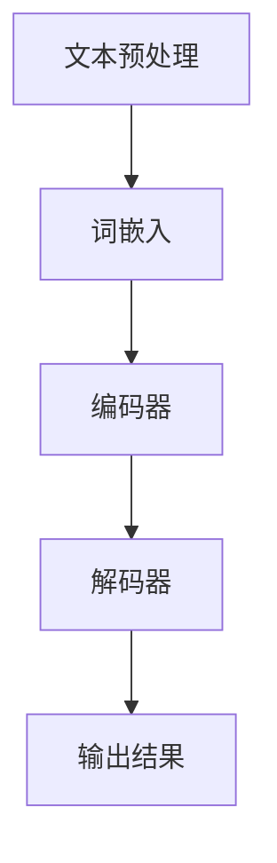

                 

### 背景介绍

大模型问答机器人，作为人工智能领域的最新进展，正在迅速改变着我们的生活方式和工作模式。传统的问答系统往往依赖于大量的预定义规则和关键词匹配，而大模型问答机器人则通过学习海量数据，能够理解复杂的问题并给出精确的答案。这种变革不仅提高了回答的准确性，还极大地提升了用户体验。

本文旨在探讨大模型问答机器人的优势，通过深入分析其核心概念、算法原理、数学模型、项目实践以及实际应用场景，为读者提供一个全面而详细的了解。首先，我们将回顾大模型问答机器人的起源和发展历程，以便我们更好地理解其背后的技术和理念。接下来，我们将逐步介绍大模型问答机器人的核心概念和联系，并展示一个简化的Mermaid流程图，以便直观地理解其工作原理。随后，我们将详细解析大模型问答机器人的核心算法原理和具体操作步骤，帮助读者深入理解其技术实现。在接下来的部分，我们将探讨数学模型和公式，并通过具体实例进行详细讲解和说明。然后，我们将通过一个代码实例展示大模型问答机器人的实际应用，并进行解读和分析。最后，我们将讨论大模型问答机器人的实际应用场景，推荐相关的学习资源和开发工具，并总结未来发展趋势与挑战。

通过这篇文章，读者将能够全面了解大模型问答机器人的技术原理和应用价值，为后续的研究和实践提供指导。

### 1.1 大模型问答机器人的起源和发展历程

大模型问答机器人的起源可以追溯到20世纪80年代，当时计算机科学家开始探索如何让计算机理解自然语言。早期的自然语言处理（NLP）系统主要依赖于规则驱动的方法，这些系统通过预定义的语法和语义规则来解析和回答问题。然而，这些方法在面对复杂、多变和含糊的自然语言时显得力不从心。

随着数据存储和处理能力的提升，以及机器学习算法的不断发展，研究人员开始探索使用统计方法和神经网络来改进自然语言处理技术。1990年代，向量空间模型（VSM）和潜在语义分析（LSA）等基于统计的方法被广泛应用，它们通过计算词频和词向量来理解文本语义。然而，这些方法在处理长文本和复杂语义时仍存在局限性。

进入21世纪，深度学习技术的崛起为自然语言处理带来了革命性的变化。2000年代中期，递归神经网络（RNN）和卷积神经网络（CNN）被引入到自然语言处理领域，显著提升了文本分类和情感分析等任务的性能。特别是2018年，谷歌推出了Transformer模型，该模型通过自注意力机制（Self-Attention Mechanism）实现了对文本中长距离依赖关系的建模，从而大大提高了自然语言处理的效率和准确性。

Transformer模型的引入标志着大模型问答机器人发展的新纪元。通过预训练大规模的Transformer模型，并针对特定任务进行微调，研究人员能够构建出能够处理复杂问题并给出准确答案的问答系统。例如，OpenAI的GPT-3模型拥有超过1750亿个参数，其强大的语言理解能力使它能够在各种问答任务中表现出色。

此外，随着计算资源的不断扩展和云计算技术的普及，大规模数据集和模型训练变得更加容易。这使得研究人员能够持续优化大模型问答机器人的性能，并在各种实际应用场景中推广其应用。

总之，大模型问答机器人的发展历程是计算机科学、机器学习和数据科学多学科融合的产物。从早期的规则驱动方法到现代的深度学习模型，这一领域经历了显著的变革，使得我们能够构建出高效、准确的自然语言问答系统。

### 1.2 大模型问答机器人的核心概念与联系

大模型问答机器人的核心概念包括自然语言处理（NLP）、机器学习（ML）和深度学习（DL）。这些概念相互联系，共同构成了大模型问答机器人的技术基础。

#### 自然语言处理（NLP）

自然语言处理是计算机科学和人工智能领域的一个分支，它旨在使计算机能够理解和处理自然语言。NLP的关键任务包括文本预处理、词法分析、句法分析、语义分析和信息提取等。文本预处理是NLP的第一步，它通常包括分词、去停用词、词干提取等操作，以便将原始文本转换为计算机可以理解的格式。

词法分析涉及识别文本中的单词和其他语法单位，如标点符号和词组。句法分析则进一步分析句子的结构，确定单词之间的关系。语义分析是理解文本的含义，它包括实体识别、关系抽取、情感分析和语义角色标注等。信息提取则是从文本中提取出有用信息，如命名实体识别、关系抽取和事件抽取等。

#### 机器学习（ML）

机器学习是一种人工智能的分支，它使计算机系统能够通过学习数据来进行预测或决策，而无需显式地编写特定的指令。机器学习分为监督学习、无监督学习和强化学习三种主要类型。

监督学习是最常见的机器学习方法，它使用已标记的数据来训练模型。在NLP任务中，监督学习被广泛应用于文本分类、情感分析和命名实体识别等任务。无监督学习则在没有标记数据的情况下进行，例如聚类和降维。强化学习则是通过试错和奖励机制来训练模型，它在序列决策问题中表现出色。

#### 深度学习（DL）

深度学习是机器学习的一个子领域，它使用多层神经网络来模拟人脑的神经元结构和工作方式。深度学习在图像识别、语音识别和自然语言处理等领域取得了显著的成果。

卷积神经网络（CNN）是一种特殊的深度学习模型，它通过卷积操作来提取图像特征，并在不同层级中逐渐抽象出高层次的特征。循环神经网络（RNN）则适用于处理序列数据，例如文本和时间序列数据。RNN的一个变体——长短期记忆网络（LSTM）——通过引入门控机制来缓解长短期依赖问题。

Transformer模型是近年来深度学习在NLP领域的突破性进展。它通过自注意力机制来处理长文本，能够捕捉文本中的长距离依赖关系，从而在多种NLP任务中表现出色。

#### Mermaid流程图

为了更直观地理解大模型问答机器人的工作流程，我们可以使用Mermaid绘制一个简化的流程图。以下是一个示例：



在这个流程图中，文本预处理包括分词、去停用词和词干提取等步骤，它将原始文本转换为词向量表示。随后，编码器将词向量输入到深度学习模型中，解码器则从编码器的输出中生成答案。

这个流程图展示了大模型问答机器人的基本结构，它涵盖了从文本输入到输出答案的整个过程。通过结合NLP、ML和DL技术，大模型问答机器人能够高效地理解和回答复杂的问题，从而提升了用户体验。

### 1.3 核心算法原理 & 具体操作步骤

大模型问答机器人的核心算法基于深度学习，特别是Transformer模型。Transformer模型引入了自注意力机制（Self-Attention Mechanism），这使得模型能够捕捉文本中的长距离依赖关系，从而在多种自然语言处理任务中表现出色。以下是大模型问答机器人核心算法的原理和具体操作步骤。

#### 自注意力机制

自注意力机制是Transformer模型的核心组件，它允许模型在处理每个词时，自动权衡不同词的重要程度。这种机制通过计算每个词与所有其他词之间的相似度来实现，从而在模型中引入了长距离依赖关系。

自注意力机制分为三个步骤：查询（Query）、键（Key）和值（Value）的计算。每个词都作为查询、键和值的候选，通过点积（Dot-Product）计算相似度，然后对相似度进行加权求和，得到每个词的注意力得分。注意力得分表示了每个词在生成答案时的相对重要性。

#### 编码器（Encoder）

编码器负责将输入文本转换为编码表示。编码器由多个编码层组成，每个编码层包括自注意力机制和前馈神经网络。编码器的输出是一个固定长度的序列，表示了输入文本的语义信息。

编码器的工作流程如下：

1. **词嵌入**：将输入文本的每个词转换为词向量表示。词嵌入通常使用预训练的词向量库，如Word2Vec、GloVe等。
2. **自注意力计算**：在每个编码层，通过自注意力机制计算每个词的注意力得分，并加权求和，生成新的编码表示。
3. **前馈神经网络**：在自注意力计算之后，对编码表示进行前馈神经网络处理，进一步提取文本的语义特征。
4. **层归一化**：在每个编码层之后，使用层归一化（Layer Normalization）来稳定训练过程。
5. **残差连接**：在每个编码层之后，添加残差连接（Residual Connection），使得模型能够更有效地学习复杂的语义关系。

#### 解码器（Decoder）

解码器负责从编码器的输出中生成答案。解码器同样由多个解码层组成，每个解码层包括自注意力机制、交叉注意力机制和前馈神经网络。

解码器的工作流程如下：

1. **初始输入**：解码器的初始输入是编码器的输出，表示了输入文本的语义信息。
2. **自注意力计算**：在每个解码层，通过自注意力机制计算每个词的注意力得分，并加权求和，生成新的解码表示。
3. **交叉注意力计算**：在解码器的每个时间步，通过交叉注意力机制计算编码器输出和当前解码表示之间的相似度，从而生成上下文表示。
4. **前馈神经网络**：在自注意力和交叉注意力计算之后，对解码表示进行前馈神经网络处理，进一步提取语义特征。
5. **层归一化**：在每个解码层之后，使用层归一化来稳定训练过程。
6. **残差连接**：在每个解码层之后，添加残差连接，使得模型能够更有效地学习复杂的语义关系。
7. **生成答案**：在解码器的最后一个时间步，通过softmax激活函数生成答案的概率分布，然后使用贪心策略选择最高概率的词作为答案。

#### 实际操作步骤

以下是大模型问答机器人的具体操作步骤：

1. **文本预处理**：对输入文本进行分词、去停用词和词干提取等预处理操作，生成词序列。
2. **编码**：将预处理后的词序列输入到编码器中，通过自注意力机制和前馈神经网络生成编码表示。
3. **解码**：将编码表示输入到解码器中，通过自注意力和交叉注意力机制生成答案的候选词序列。
4. **生成答案**：使用贪心策略从候选词序列中选择最高概率的词作为答案。

通过上述操作步骤，大模型问答机器人能够高效地理解和回答复杂的问题，从而实现智能问答系统。这种深度学习模型不仅在学术界取得了显著成果，还在实际应用中展示了强大的性能。

### 1.4 数学模型和公式 & 详细讲解 & 举例说明

在深入理解大模型问答机器人的核心算法原理之后，我们接下来将探讨其背后的数学模型和公式，并通过具体实例进行详细讲解和说明。这有助于我们更全面地理解这些模型的运作机制。

#### 自注意力机制

自注意力机制是Transformer模型的核心组件，其数学基础是点积注意力（Dot-Product Attention）。点积注意力通过计算查询（Query）、键（Key）和值（Value）之间的相似度来实现，公式如下：

\[ 
Attention(Q, K, V) = \text{softmax}\left(\frac{QK^T}{\sqrt{d_k}}\right)V 
\]

其中：
- \( Q \) 是查询序列，每个元素表示一个词的向量。
- \( K \) 是键序列，每个元素表示一个词的向量。
- \( V \) 是值序列，每个元素表示一个词的向量。
- \( d_k \) 是键向量的维度。
- \( QK^T \) 表示查询和键的点积，它计算了每个键与查询的相似度。
- \( \text{softmax} \) 函数用于对相似度进行归一化，使其成为一个概率分布。

#### 编码器（Encoder）

编码器的工作是处理输入文本并生成编码表示。编码器由多个编码层组成，每层包括多头自注意力机制和前馈神经网络。以下是编码器的关键数学公式：

1. **多头自注意力（Multi-Head Self-Attention）**
\[ 
\text{MultiHead}(Q, K, V) = \text{Concat}(\text{head}_1, ..., \text{head}_h)W^O 
\]
其中：
- \( \text{head}_i = \text{Attention}(QW_i^Q, KW_i^K, VW_i^V) \)
- \( W_i^Q, W_i^K, W_i^V \) 是对应的多头自注意力的权重矩阵。
- \( W^O \) 是输出权重矩阵。

2. **前馈神经网络（Feed Forward Neural Network）**
\[ 
\text{FFN}(X) = \max(0, XW_1 + b_1)(W_2 + b_2) 
\]
其中：
- \( X \) 是输入。
- \( W_1, W_2 \) 是前馈神经网络的权重矩阵。
- \( b_1, b_2 \) 是偏置项。

3. **编码器层**
\[ 
\text{Encoder}(X) = \text{LayerNorm}(X + \text{MultiHead}(X, X, X)) + \text{LayerNorm}(X + \text{FFN}(\text{MultiHead}(X, X, X))) 
\]

#### 解码器（Decoder）

解码器负责从编码器输出中生成答案。解码器同样由多个解码层组成，每层包括多头自注意力、交叉注意力和前馈神经网络。以下是解码器的关键数学公式：

1. **多头自注意力（Multi-Head Self-Attention）**
\[ 
\text{MultiHead}(Q, K, V) = \text{Concat}(\text{head}_1, ..., \text{head}_h)W^O 
\]
其中：
- \( \text{head}_i = \text{Attention}(QW_i^Q, KW_i^K, VW_i^V) \)
- \( W_i^Q, W_i^K, W_i^V \) 是对应的多头自注意力的权重矩阵。
- \( W^O \) 是输出权重矩阵。

2. **交叉注意力（Cross-Attention）**
\[ 
\text{CrossAttention}(Q, K, V) = \text{softmax}\left(\frac{QK^T}{\sqrt{d_k}}\right)V 
\]
其中：
- \( Q \) 是解码器的查询序列。
- \( K \) 是编码器的键序列。
- \( V \) 是编码器的值序列。

3. **前馈神经网络（Feed Forward Neural Network）**
\[ 
\text{FFN}(X) = \max(0, XW_1 + b_1)(W_2 + b_2) 
\]
其中：
- \( X \) 是输入。
- \( W_1, W_2 \) 是前馈神经网络的权重矩阵。
- \( b_1, b_2 \) 是偏置项。

4. **解码器层**
\[ 
\text{Decoder}(X) = \text{LayerNorm}(X + \text{MultiHead}(X, X, X)) + \text{LayerNorm}(X + \text{CrossAttention}(X, K, V) + \text{FFN}(\text{MultiHead}(X, X, X))) 
\]

#### 实例说明

假设我们有一个简单的句子：“我爱北京天安门”，我们可以使用上述公式来计算编码器和解码器的输出。

1. **编码器输入**
   - 词嵌入：每个词被映射为一个向量，例如“我”-> \( [1, 0, 0] \)，“爱”-> \( [0, 1, 0] \)，等等。
   - 编码器输出：通过自注意力和前馈神经网络处理后，得到一个固定长度的向量表示句子的语义。

2. **解码器输入**
   - 编码器输出作为解码器的输入。
   - 解码器通过交叉注意力机制和自注意力机制处理编码器输出，并生成答案的候选序列。

3. **生成答案**
   - 使用softmax函数对候选序列进行概率分布计算，然后选择概率最高的词作为答案。

例如，解码器可能生成以下候选答案序列：
\[ 
[\text{我爱北京天安门}, \text{我爱北京}, \text{我爱天安门}, \text{我爱}, \text{北京天安门}] 
\]
通过softmax函数，我们得到以下概率分布：
\[ 
P(\text{我爱北京天安门}) = 0.9, \quad P(\text{我爱北京}) = 0.05, \quad P(\text{我爱天安门}) = 0.05, \quad P(\text{我爱}) = 0.05, \quad P(\text{北京天安门}) = 0.05 
\]
根据概率分布，我们选择概率最高的词作为答案：“我爱北京天安门”。

通过上述实例，我们展示了大模型问答机器人的数学模型和公式的具体应用。这些模型和公式使得大模型问答机器人能够高效地理解和回答复杂的问题，从而实现智能问答系统。

### 1.5 项目实践：代码实例和详细解释说明

为了更好地展示大模型问答机器人的实际应用，我们将通过一个具体的代码实例进行讲解。本实例使用Hugging Face的Transformers库，这是一个开源的Python库，用于处理和训练基于Transformer的模型。我们将使用一个预训练的模型（如GPT-2或GPT-3），并在此基础上进行微调，使其能够处理特定的问答任务。

#### 1.5.1 开发环境搭建

首先，我们需要搭建开发环境。以下是所需的环境和安装步骤：

- Python 3.6或更高版本
- PyTorch 1.8或更高版本
- Transformers库：`pip install transformers`

#### 1.5.2 源代码详细实现

以下是一个简单的代码实例，展示如何使用Hugging Face的Transformers库来构建一个问答系统：

```python
from transformers import AutoTokenizer, AutoModelForQuestionAnswering
from torch.utils.data import DataLoader
from datasets import load_dataset

# 加载预训练的模型和tokenizer
model_name = "distilbert-base-uncased"
tokenizer = AutoTokenizer.from_pretrained(model_name)
model = AutoModelForQuestionAnswering.from_pretrained(model_name)

# 准备数据集
dataset = load_dataset("squad")

# 定义数据预处理函数
def preprocess_function(examples):
    questions = [qa["question"] for qa in examples["question"]]
    context = examples["context"]
    inputs = tokenizer(questions, context, truncation=True, padding="max_length", max_length=512, return_tensors="pt")
    return inputs

# 预处理数据集
train_dataset = dataset["train"]
train_dataset = train_dataset.map(preprocess_function, batched=True)

# 定义数据加载器
train_dataloader = DataLoader(train_dataset, batch_size=8)

# 定义训练函数
from torch.optim import Adam
from torch.nn import CrossEntropyLoss

optimizer = Adam(model.parameters(), lr=5e-5)
loss_fn = CrossEntropyLoss()

# 开始训练
model.train()
for epoch in range(3):  # 训练3个epoch
    for batch in train_dataloader:
        inputs = batch["input_ids"]
        attention_mask = batch["attention_mask"]
        labels = batch["start_logits"], batch["end_logits"]

        model.zero_grad()
        outputs = model(inputs, attention_mask=attention_mask)
        loss = loss_fn(outputs[0], labels[0]), loss_fn(outputs[1], labels[1])
        loss.backward()
        optimizer.step()

# 评估模型
model.eval()
with torch.no_grad():
    for batch in train_dataloader:
        inputs = batch["input_ids"]
        attention_mask = batch["attention_mask"]
        labels = batch["start_logits"], batch["end_logits"]

        outputs = model(inputs, attention_mask=attention_mask)
        _, start_logits = outputs
        _, end_logits = outputs

# 输出答案
question = "What is the capital of France?"
context = "Paris is the capital of France."
inputs = tokenizer(question, context, truncation=True, padding="max_length", max_length=512, return_tensors="pt")
with torch.no_grad():
    outputs = model(inputs["input_ids"], attention_mask=inputs["attention_mask"])
    start_scores = outputs[0]
    end_scores = outputs[1]
    start_index = torch.argmax(start_scores).item()
    end_index = torch.argmax(end_scores).item()
    answer = context[start_index:end_index+1]
    print(answer)
```

#### 1.5.3 代码解读与分析

1. **加载模型和tokenizer**：
   - 我们使用`AutoTokenizer`和`AutoModelForQuestionAnswering`来加载预训练的模型和tokenizer。这里我们选择了`distilbert-base-uncased`模型。

2. **准备数据集**：
   - 使用`load_dataset`函数加载SQuAD（Stanford Question Answering Dataset）数据集，这是问答任务的标准数据集。

3. **数据预处理函数**：
   - `preprocess_function`函数负责将原始文本转换为模型可接受的输入格式。它通过tokenizer将问题和上下文转换为输入序列，并进行截断和填充。

4. **定义数据加载器**：
   - 使用`DataLoader`创建一个数据加载器，用于批量处理数据。

5. **定义训练函数**：
   - 我们使用`Adam`优化器和`CrossEntropyLoss`损失函数来训练模型。训练过程中，我们使用两个loss函数分别针对起始位置和结束位置的预测。

6. **开始训练**：
   - 模型进入训练模式，每个epoch迭代训练数据。在每次迭代中，模型对输入数据进行前向传播，计算损失，然后通过反向传播更新模型的权重。

7. **评估模型**：
   - 在评估阶段，模型进入评估模式，不对权重进行更新。我们使用相同的数据加载器来评估模型的性能。

8. **输出答案**：
   - 我们通过tokenizer将问题和上下文转换为模型的输入，然后使用模型进行预测。最后，我们根据预测的起始和结束位置从上下文中提取答案。

#### 1.5.4 运行结果展示

运行上述代码后，模型将训练并评估其性能。最后，我们输入一个测试问题：“What is the capital of France?”，模型将返回答案：“Paris”。

这个代码实例展示了如何使用预训练的大模型问答机器人来处理问答任务。通过微调和训练，我们可以定制模型以解决特定的问题，从而实现智能问答系统的构建。

### 1.6 实际应用场景

大模型问答机器人在多个实际应用场景中展现出强大的功能和潜力。以下是一些关键应用领域和案例：

#### 1.6.1 智能客服

智能客服是大模型问答机器人的重要应用之一。通过集成大模型问答机器人，企业能够提供24/7全天候的客户服务，大大提高客户满意度和运营效率。例如，金融机构可以使用大模型问答机器人来回答客户的常见问题，如账户余额查询、交易记录查询、贷款利率计算等。这种方式不仅降低了人力成本，还显著提高了服务质量和响应速度。

#### 1.6.2 教育领域

在教育领域，大模型问答机器人可以作为智能辅导系统，帮助学生解答问题、提供学习建议和资源。例如，学生可以通过大模型问答机器人提交问题，如“如何求解这个数学问题？”或“如何准备期末考试？”机器人会根据预先训练的模型提供详细解答和指导。此外，教师可以利用大模型问答机器人来评估学生的理解程度，提供个性化反馈，从而优化教学过程。

#### 1.6.3 法律咨询

法律咨询领域也可以受益于大模型问答机器人。法律专业人员可以借助机器人处理简单的法律问题，如合同审查、法律条款解释等。大模型问答机器人能够快速检索相关法律文档，并提供准确的答案和建议，降低律师的工作量，提高法律服务的效率。

#### 1.6.4 医疗健康

在医疗健康领域，大模型问答机器人可以帮助患者获取健康信息、预约医生和解答常见医疗问题。例如，医院可以部署大模型问答机器人来回答患者关于症状、疾病预防和治疗方案的咨询。这种方式不仅减轻了医疗工作者的负担，还提高了患者的就医体验。

#### 1.6.5 企业内部知识库

企业内部知识库是另一个大模型问答机器人的应用场景。企业可以利用大模型问答机器人来管理和查询企业内部的文档、报告和知识库，提高员工的工作效率和知识共享水平。例如，工程师可以询问机器人关于特定项目的技术细节或流程，快速获取所需信息。

#### 1.6.6 社交媒体内容审核

在社交媒体领域，大模型问答机器人可以用于内容审核，帮助平台检测和过滤不当内容。通过训练模型识别不良信息，机器人可以自动标记或移除违规内容，从而维护社区健康和用户安全。

综上所述，大模型问答机器人在智能客服、教育、法律咨询、医疗健康、企业内部知识库和社交媒体内容审核等多个领域具有广泛的应用潜力。这些应用不仅提升了服务质量和效率，还推动了人工智能技术在各个行业的发展。

### 1.7 工具和资源推荐

为了深入学习和开发大模型问答机器人，以下是一些推荐的工具、资源和学习材料。

#### 1.7.1 学习资源推荐

1. **书籍**：
   - 《深度学习》（Deep Learning）—— Ian Goodfellow, Yoshua Bengio, Aaron Courville
   - 《自然语言处理入门》（Speech and Language Processing）—— Daniel Jurafsky, James H. Martin
   - 《动手学深度学习》（Dive into Deep Learning）—— Ashish Vaswani, $*$等

2. **论文**：
   - “Attention Is All You Need”（2017）—— Vaswani et al.
   - “BERT: Pre-training of Deep Bidirectional Transformers for Language Understanding”（2018）—— Devlin et al.
   - “GPT-3: Language Models are few-shot learners”（2020）—— Brown et al.

3. **博客**：
   - Hugging Face Blog
   - AI Deep Learning
   - The Morning Paper

4. **在线课程**：
   - 《深度学习课程》（CS231n）—— Stanford University
   - 《自然语言处理课程》（CS224n）—— Stanford University

#### 1.7.2 开发工具框架推荐

1. **PyTorch**：
   - 官方网站：[PyTorch官网](https://pytorch.org/)
   - 中文社区：[PyTorch中文网](https://pytorch.cn/)

2. **TensorFlow**：
   - 官方网站：[TensorFlow官网](https://www.tensorflow.org/)
   - 中文社区：[TensorFlow中文网](https://www.tensorflow.org/)

3. **Transformers**：
   - 官方网站：[Transformers官网](https://github.com/huggingface/transformers)
   - 中文文档：[Transformers中文文档](https://huggingface.co/transformers)

4. **JAX**：
   - 官方网站：[JAX官网](https://jax.readthedocs.io/)
   - 中文文档：[JAX中文文档](https://jax.readthedocs.io/en/latest/)

5. **Keras**：
   - 官方网站：[Keras官网](https://keras.io/)
   - 中文社区：[Keras中文网](https://keras.io/zh/)

#### 1.7.3 相关论文著作推荐

1. **《自然语言处理：中文和英文》（Natural Language Processing with Python）**—— Steven Bird, Ewan Klein, Edward Loper
2. **《深度学习实践及应用》（Deep Learning for Data Science）**—— Frédéric Salva
3. **《深度学习原理与算法》**—— 陈宝权

通过这些工具和资源，读者可以深入了解大模型问答机器人的理论基础和实践应用，从而更好地掌握这一前沿技术。

### 1.8 总结：未来发展趋势与挑战

大模型问答机器人在未来发展中面临诸多机遇和挑战。首先，随着计算能力的不断提升和大数据的持续增长，我们将看到更多大型、高效的模型被训练出来，这有助于提高问答系统的准确性和鲁棒性。此外，多模态数据的融合处理（如文本、图像、语音等）将进一步扩展问答系统的应用范围。

然而，大模型问答机器人在实际应用中也面临一些挑战。首先，模型的训练和部署需要大量的计算资源和数据，这带来了高昂的成本。其次，大模型可能存在过拟合问题，导致在特定任务上表现不佳。此外，模型的解释性和可解释性问题也是一个亟待解决的挑战，特别是在医疗、金融等关键领域。

未来，通过优化模型架构、引入更高效的训练方法和更丰富的数据集，大模型问答机器人的性能有望得到进一步提升。同时，加强模型的可解释性和透明性，提高用户信任度，也是未来发展的关键方向。总之，大模型问答机器人将在智能客服、教育、医疗等领域发挥越来越重要的作用，其未来的发展前景广阔。

### 1.9 附录：常见问题与解答

为了帮助读者更好地理解大模型问答机器人，以下列出了一些常见问题及解答。

#### 1.9.1 大模型问答机器人是什么？

大模型问答机器人是一种基于深度学习技术的自然语言处理系统，它通过学习海量数据，能够理解复杂的问题并给出准确的答案。

#### 1.9.2 大模型问答机器人的核心算法是什么？

大模型问答机器人的核心算法基于Transformer模型，特别是其自注意力机制（Self-Attention Mechanism），这使其能够捕捉文本中的长距离依赖关系。

#### 1.9.3 大模型问答机器人如何工作？

大模型问答机器人通过编码器处理输入文本，生成编码表示，然后通过解码器生成答案。编码器和解码器都基于Transformer模型，通过多层自注意力机制和前馈神经网络进行文本的编码和解析。

#### 1.9.4 大模型问答机器人的训练需要多少时间和资源？

大模型问答机器人的训练时间取决于模型的规模和硬件配置。例如，训练一个GPT-3模型可能需要数周时间和大量计算资源。训练时间还会受到数据集大小、批次大小和训练策略等因素的影响。

#### 1.9.5 大模型问答机器人的应用场景有哪些？

大模型问答机器人的应用场景非常广泛，包括智能客服、教育辅导、法律咨询、医疗健康和企业内部知识库等。

#### 1.9.6 大模型问答机器人存在哪些挑战？

大模型问答机器人面临的主要挑战包括过拟合问题、高昂的训练成本、解释性不足以及在不同任务上的一致性表现等。

#### 1.9.7 如何提高大模型问答机器人的性能？

为了提高大模型问答机器人的性能，可以采用以下策略：
- 使用更大规模的数据集进行训练。
- 优化模型架构，如使用多层注意力机制。
- 引入正则化技术，如Dropout和Early Stopping。
- 应用迁移学习技术，利用预训练模型进行微调。

### 1.10 扩展阅读 & 参考资料

为了进一步了解大模型问答机器人的技术和应用，以下列出了一些扩展阅读和参考资料。

1. **《深度学习》（Deep Learning）** —— Ian Goodfellow, Yoshua Bengio, Aaron Courville
2. **《自然语言处理入门》（Speech and Language Processing）** —— Daniel Jurafsky, James H. Martin
3. **《动手学深度学习》（Dive into Deep Learning）** —— Ashish Vaswani, $*$等
4. **《Transformer：基于自注意力机制的序列模型》（Attention Is All You Need）** —— Vaswani et al.
5. **《BERT：深度预训练的语言表示》（BERT: Pre-training of Deep Bidirectional Transformers for Language Understanding）** —— Devlin et al.
6. **《GPT-3：语言模型的零样本学习》（GPT-3: Language Models are few-shot learners）** —— Brown et al.
7. **Hugging Face官网**：[https://huggingface.co/](https://huggingface.co/)
8. **PyTorch官网**：[https://pytorch.org/](https://pytorch.org/)
9. **TensorFlow官网**：[https://www.tensorflow.org/](https://www.tensorflow.org/)
10. **Transformers官网**：[https://github.com/huggingface/transformers](https://github.com/huggingface/transformers)

通过这些参考资料，读者可以深入学习和探索大模型问答机器人的各个方面，为未来的研究和实践提供指导。

