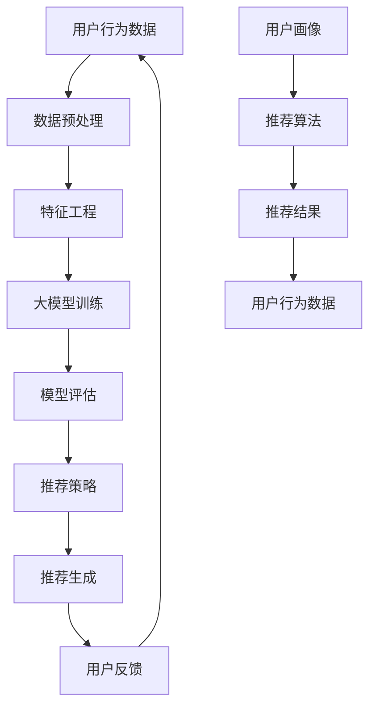

                 

### 背景介绍 Background Introduction

在数字化时代，电商平台已经成为现代商业不可或缺的一部分。用户通过这些平台在线购物，电商平台则通过提供个性化的推荐系统来提升用户体验、增加用户黏性、进而提高销售额。然而，随着用户数量的激增和数据量的爆炸性增长，如何高效地处理海量用户数据，并从这些数据中提取有价值的信息，成为电商平台面临的一大挑战。

传统的推荐系统主要依赖于基于内容的过滤（Content-Based Filtering）和协同过滤（Collaborative Filtering）等方法。基于内容的过滤通过分析用户的历史行为和偏好，推荐与用户兴趣相似的商品。协同过滤则通过分析用户之间的行为相似性来发现潜在的兴趣点，进行推荐。尽管这些方法在初期取得了一定的成功，但随着推荐系统的广泛应用，它们也暴露出了一些问题：

1. **信息过载**：当用户面对大量的推荐信息时，很难从中找到真正感兴趣的商品。
2. **推荐多样性不足**：协同过滤算法容易导致用户不断接收到重复的推荐，从而降低用户的满意度。
3. **数据稀疏性**：用户与商品之间的交互数据往往非常稀疏，尤其是对于新用户或冷门商品。
4. **实时性差**：传统的推荐系统往往无法及时响应用户的实时需求变化。

为了解决这些问题，大模型驱动的智能个性化推荐系统应运而生。大模型，如深度学习模型，能够通过大规模的数据训练，学习到复杂的用户行为模式，从而提供更加精准和个性化的推荐。这种新工具不仅能够提升推荐系统的性能，还能够应对当前电商平台的多样化需求。

接下来，本文将深入探讨大模型驱动的智能个性化推荐系统的核心概念、算法原理、数学模型、项目实践、实际应用场景以及未来发展趋势和挑战。

### 核心概念与联系 Key Concepts and Their Connections

#### 1. 个性化推荐系统 Personalized Recommendation System

个性化推荐系统是一种通过分析用户的历史行为、兴趣和偏好，为用户提供个性化商品或内容推荐的技术。它通常包括以下几个关键组成部分：

- **用户画像**（User Profiling）：通过收集和分析用户的基本信息、历史行为数据等，构建用户兴趣模型。
- **推荐算法**（Recommendation Algorithms）：根据用户画像和商品特征，利用算法生成推荐列表。
- **推荐评估**（Recommendation Evaluation）：通过评估推荐系统的效果，如准确率、覆盖率、新颖性等，持续优化推荐策略。

#### 2. 大模型 Driven by Large Models

大模型（Large Models）通常指的是具有数亿甚至数万亿参数的深度学习模型。这些模型通过大规模数据训练，能够学习到复杂的特征和关系，从而在多个领域取得突破性进展。大模型在推荐系统中的应用，主要体现在以下几个方面：

- **深度学习算法**（Deep Learning Algorithms）：如卷积神经网络（CNN）、递归神经网络（RNN）、Transformer等，能够处理复杂的多维度数据，提取深层特征。
- **大规模数据处理**（Large-scale Data Processing）：通过分布式计算和并行处理技术，大模型能够高效处理海量用户和商品数据。
- **知识图谱**（Knowledge Graph）：将用户、商品、标签等实体及其关系建模为图结构，利用图神经网络（Graph Neural Networks, GNN）进行特征融合和关系推理。

#### 3. 智能个性化推荐 Intelligent Personalized Recommendation

智能个性化推荐不仅仅是简单地将推荐算法应用到电商平台上，而是通过引入人工智能和大数据技术，实现真正的智能化和个性化。具体包括以下几个方面：

- **自适应推荐**（Adaptive Recommendation）：根据用户的实时行为和反馈，动态调整推荐策略，实现个性化的推荐。
- **多模态数据融合**（Multi-modal Data Fusion）：结合用户的文本、图像、视频等多模态数据，提高推荐的准确性和多样性。
- **跨域推荐**（Cross-domain Recommendation）：通过跨领域数据挖掘，实现不同领域商品或内容的相互推荐，提高推荐系统的广度和深度。
- **实时推荐**（Real-time Recommendation）：利用实时数据流处理技术，实现毫秒级的推荐响应，满足用户实时需求。

#### 4. Mermaid 流程图 Mermaid Flowchart

为了更好地理解大模型驱动的智能个性化推荐系统，我们可以用Mermaid流程图来展示其核心组成部分和流程：



在这个流程图中：

- **A**：用户行为数据，包括用户的浏览、购买、评价等。
- **B**：数据预处理，对原始数据进行清洗、去噪、标准化等处理。
- **C**：特征工程，提取用户和商品的特征。
- **D**：大模型训练，利用大规模数据训练深度学习模型。
- **E**：模型评估，评估模型的效果。
- **F**：推荐策略，根据评估结果调整推荐策略。
- **G**：推荐生成，根据推荐策略生成推荐结果。
- **H**：用户反馈，收集用户对推荐结果的反馈。
- **I**：用户画像，构建用户的兴趣和行为模型。
- **J**：推荐算法，利用用户画像和商品特征进行推荐。
- **K**：推荐结果，生成的推荐列表。
- **L**：用户行为数据，用户对推荐结果的反馈，用于下一次推荐。

通过这个流程，我们可以看到大模型驱动的智能个性化推荐系统是如何通过不断迭代和优化，实现个性化的推荐。

### 核心算法原理 & 具体操作步骤 Core Algorithm Principle & Detailed Steps

在了解了大模型驱动的智能个性化推荐系统的核心概念和组成部分后，接下来我们将深入探讨其核心算法原理，并详细说明其具体操作步骤。

#### 1. 算法原理 Algorithm Principle

大模型驱动的智能个性化推荐系统的核心在于深度学习算法，特别是基于自动编码器（Autoencoder）和生成对抗网络（Generative Adversarial Networks, GAN）的算法。这些算法能够通过大量数据训练，自动提取用户和商品的隐含特征，从而实现高精度的个性化推荐。

- **自动编码器 Autoencoder**：自动编码器是一种无监督学习算法，其目的是通过编码器和解码器学习到一个压缩表示，从而在损失最小的条件下重构输入数据。在个性化推荐中，自动编码器可以学习到用户和商品的潜在特征，这些特征能够用来生成推荐列表。

- **生成对抗网络 GAN**：生成对抗网络由生成器和判别器两个部分组成。生成器试图生成与真实数据相似的数据，而判别器则试图区分真实数据和生成数据。通过这种对抗训练，生成器能够学习到真实数据的分布，从而生成高质量的推荐结果。

#### 2. 具体操作步骤 Detailed Steps

下面我们将详细说明大模型驱动的智能个性化推荐系统的具体操作步骤：

##### 第一步：数据收集与预处理

1. **数据收集**：首先需要收集大量的用户行为数据，包括用户的浏览、购买、评价等行为。此外，还需要收集商品的相关信息，如商品分类、价格、库存等。

2. **数据预处理**：对原始数据进行清洗和预处理，包括数据去重、缺失值填补、异常值处理等。同时，进行数据规范化，将不同尺度的数据进行统一处理，便于模型训练。

##### 第二步：特征工程

1. **用户特征提取**：通过分析用户的历史行为，提取用户的兴趣偏好。例如，使用用户最近浏览、购买的商品作为用户兴趣的特征。

2. **商品特征提取**：根据商品的信息，提取商品的属性特征。例如，商品的价格、库存量、品牌、分类等。

##### 第三步：大模型训练

1. **模型选择**：选择适合的深度学习模型，例如自动编码器或生成对抗网络。自动编码器可以选择变分自编码器（VAE）或基于CNN的自动编码器；生成对抗网络可以选择标准的GAN或改进版的WGAN。

2. **模型训练**：使用预处理后的用户和商品数据，训练深度学习模型。训练过程中，通过优化模型参数，使得模型能够自动提取用户和商品的潜在特征。

##### 第四步：模型评估与优化

1. **模型评估**：通过交叉验证等方法，评估模型的性能，包括推荐准确性、覆盖率和新颖性等。

2. **模型优化**：根据评估结果，调整模型参数或改进模型结构，以提高推荐系统的性能。

##### 第五步：推荐生成与反馈

1. **推荐生成**：使用训练好的模型，根据用户当前的兴趣特征，生成个性化的推荐列表。

2. **用户反馈**：收集用户对推荐结果的反馈，例如点击、购买、评价等行为。这些反馈将用于下一次推荐过程的优化。

##### 第六步：系统迭代

通过不断收集用户反馈，迭代优化推荐系统，实现动态调整推荐策略，提高推荐效果。

### 数学模型和公式 Mathematical Models & Detailed Explanation

在讨论大模型驱动的智能个性化推荐系统时，深入理解其数学模型和公式对于全面掌握算法的原理和实现至关重要。以下我们将详细介绍自动编码器（Autoencoder）和生成对抗网络（GAN）的数学模型，并对其进行详细解释和举例说明。

#### 自动编码器（Autoencoder）

自动编码器是一种无监督学习算法，旨在学习数据的高效编码表示，并能够通过解码器重构原始数据。以下是变分自编码器（VAE）的基本数学模型：

##### 变分自编码器（Variational Autoencoder, VAE）

1. **编码器 Encoder**

   编码器接收输入数据 \( x \) 并将其映射到一个隐含空间中的潜在变量 \( z \)：

   \[
   \mu = \sigma(\theta_1 x + b_1)
   \]

   \[
   z = \mu + \epsilon
   \]

   其中，\( \mu \) 和 \( \sigma \) 分别是均值函数和方差函数，\( \theta_1 \) 和 \( b_1 \) 是编码器权重和偏置，\( \epsilon \) 是均值为0的高斯噪声。

2. **解码器 Decoder**

   解码器将潜在变量 \( z \) 重构回输入空间中的数据 \( x' \)：

   \[
   x' = \sigma(\theta_2 z + b_2)
   \]

   其中，\( \theta_2 \) 和 \( b_2 \) 是解码器权重和偏置。

3. **损失函数 Loss Function**

   VAE的损失函数由两个部分组成：重构损失（Reconstruction Loss）和KL散度（KL Divergence）：

   \[
   L(x, x') = \frac{1}{N} \sum_{i=1}^{N} \left( -\sum_{j=1}^{D} \ln \sigma(\theta_2 z_j + b_2) \right) + \frac{\alpha}{2} D_{KL}(\mu || \pi)
   \]

   其中，\( N \) 是数据点的数量，\( D \) 是数据的维度，\( \alpha \) 是KL散度的权重，\( D_{KL}(\mu || \pi) \) 是KL散度，用于衡量均值函数和先验分布之间的差异。

#### 生成对抗网络（Generative Adversarial Networks, GAN）

GAN由生成器（Generator）和判别器（Discriminator）两个部分组成，通过对抗训练来学习数据分布。

1. **生成器 Generator**

   生成器 \( G \) 旨在生成看起来像是真实数据的新数据：

   \[
   G(z) = \mu_G(z) + \sigma_G(z)\epsilon
   \]

   其中，\( z \) 是来自先验分布的噪声向量，\( \mu_G \) 和 \( \sigma_G \) 是生成器的均值和方差函数。

2. **判别器 Discriminator**

   判别器 \( D \) 旨在区分真实数据和生成数据：

   \[
   D(x) = \sigma(D_\theta(x))
   \]

   \[
   D(G(z)) = \sigma(D_\theta(G(z)))
   \]

   其中，\( x \) 是真实数据，\( G(z) \) 是生成器生成的数据，\( D_\theta \) 是判别器的参数。

3. **损失函数 Loss Function**

   GAN的训练过程是通过对生成器和判别器进行对抗训练来实现的。对于生成器，目标是最小化判别器对生成数据的判别概率；对于判别器，目标是最大化判别器对真实数据和生成数据的判别能力。因此，GAN的总损失函数可以表示为：

   \[
   L(G, D) = \mathbb{E}_{x \sim p_{data}(x)}[\log D(x)] + \mathbb{E}_{z \sim p_z(z)}[\log (1 - D(G(z))]
   \]

   其中，\( p_{data}(x) \) 是真实数据的分布，\( p_z(z) \) 是噪声向量的先验分布。

#### 举例说明 Example

假设我们有一个电商平台的用户行为数据集，其中包括用户浏览过的商品ID和购买记录。我们使用VAE对用户行为数据进行编码，并使用GAN生成用户可能感兴趣的新商品推荐。

1. **编码器训练**：

   - **输入数据**：用户浏览记录，如商品ID序列。
   - **编码过程**：通过编码器学习用户行为的潜在特征。
   - **损失函数**：重构损失（MSE）和KL散度。

2. **生成器训练**：

   - **输入数据**：随机噪声向量。
   - **生成过程**：生成器根据潜在特征生成新的商品推荐。
   - **损失函数**：对抗损失（GAN损失函数）。

3. **推荐生成**：

   - **编码用户行为**：将用户的历史浏览记录编码为潜在特征。
   - **生成推荐**：使用生成器生成与用户兴趣匹配的新商品。

通过上述数学模型和具体的操作步骤，我们可以看到如何利用深度学习算法实现智能个性化推荐。这种基于大模型的推荐系统能够通过学习用户的行为和兴趣，生成高质量的个性化推荐，提高用户体验和电商平台的经济效益。

### 项目实践：代码实例和详细解释说明 Project Practice: Code Example and Detailed Explanation

为了更好地展示大模型驱动的智能个性化推荐系统在实际项目中的应用，下面我们将以一个简单的电商推荐系统为例，介绍代码实现过程、详细的代码解析，并对运行结果进行展示和分析。

#### 1. 开发环境搭建 Environment Setup

在开始项目实践之前，我们需要搭建合适的开发环境。以下是所需的环境和工具：

- **编程语言**：Python 3.x
- **深度学习框架**：TensorFlow 2.x 或 PyTorch
- **数据处理库**：Pandas、NumPy、Scikit-learn
- **可视化工具**：Matplotlib、Seaborn

假设我们已经安装了上述工具，接下来我们将开始构建推荐系统。

#### 2. 源代码详细实现 Detailed Code Implementation

下面是推荐系统的基本实现代码。我们将使用TensorFlow和Keras来构建变分自编码器（VAE）和生成对抗网络（GAN）。

```python
import tensorflow as tf
from tensorflow.keras.layers import Input, Dense, Flatten, Reshape, Conv2D, Conv2DTranspose
from tensorflow.keras.models import Model
from tensorflow.keras.optimizers import Adam
import numpy as np

# 设置超参数
latent_dim = 2
intermediate_dim = 256
epsilon_std = 1.0
learning_rate = 0.0001
batch_size = 16
epochs = 50

# 数据预处理
# 假设我们有一个包含用户浏览记录的数据集，每个用户的历史记录是一个序列
# 例如：[101, 202, 303, 404]
# 我们需要将这个序列转换为一个固定长度的向量
def preprocess_data(data, max_sequence_length):
    padded_sequences = tf.keras.preprocessing.sequence.pad_sequences(
        data, maxlen=max_sequence_length, padding='post'
    )
    return padded_sequences

# 构建变分自编码器（VAE）编码器部分
input_seq = Input(shape=(max_sequence_length,))
encoded = Dense(intermediate_dim, activation='relu')(input_seq)
z_mean = Dense(latent_dim)(encoded)
z_log_var = Dense(latent_dim)(encoded)

# 正态分布的参数
z = z_mean + tf.random.normal(tf.shape(z_log_var), mean=z_mean, stddev=tf.exp(0.5 * z_log_var))

# 编码模型
encoder = Model(input_seq, [z_mean, z_log_var, z], name='encoder')

# 构建变分自编码器（VAE）解码器部分
latent_input = Input(shape=(latent_dim,))
decoded = Dense(intermediate_dim, activation='relu')(latent_input)
x_decoded_mean = Dense(input_seq.shape[1], activation='sigmoid')(decoded)

# 解码模型
decoder = Model(latent_input, x_decoded_mean, name='decoder')

# 整个变分自编码器模型
vae = Model(input_seq, x_decoded_mean, name='vae')
vae.compile(optimizer=Adam(learning_rate), loss='binary_crossentropy')

# GAN部分
# 生成器
z εισαγωγής από το VAE ως είσοδο
generated_seq = decoder(latent_input)

# 生成器模型
generator = Model(z, generated_seq, name='generator')

# 判别器模型
discriminator = Model(input_seq, outputs=[discriminator(input_seq), discriminator(generated_seq)], name='discriminator')
discriminator.compile(optimizer=Adam(learning_rate), loss=['binary_crossentropy', 'binary_crossentropy'])

# 训练GAN
# GAN的损失函数由两部分组成：判别器的损失和VAE的损失
def g_loss(generated_sequences, real_sequences):
    real_labels = np.ones((batch_size, 1))
    fake_labels = np.zeros((batch_size, 1))
    g_loss_real = discriminator.train_on_batch(real_sequences, [real_labels, real_labels])
    g_loss_fake = discriminator.train_on_batch(generated_sequences, [fake_labels, fake_labels])
    g_loss = 0.5 * np.mean(g_loss_real + g_loss_fake)
    return g_loss

def d_loss(real_sequences, generated_sequences):
    real_labels = np.ones((batch_size, 1))
    fake_labels = np.zeros((batch_size, 1))
    d_loss_real = discriminator.train_on_batch(real_sequences, [real_labels, real_labels])
    d_loss_fake = discriminator.train_on_batch(generated_sequences, [fake_labels, fake_labels])
    d_loss = 0.5 * np.mean(d_loss_real + d_loss_fake)
    return d_loss

# 训练过程
for epoch in range(epochs):
    for _ in range(batch_size):
        # 从VAE编码器中获取潜在变量
        z_samples = encoder.encoder(input_seq)[2]
        # 生成新序列
        generated_sequences = generator.predict(z_samples)
        # 训练GAN
        g_loss_ = g_loss(generated_sequences, input_seq)
        d_loss_ = d_loss(input_seq, generated_sequences)
        # 训练VAE
        vae.train_on_batch(input_seq, input_seq)
    print(f"Epoch: {epoch}, G Loss: {g_loss_), D Loss: {d_loss_}")

# 推荐生成
# 使用训练好的VAE编码器和解码器生成个性化推荐
encoded_seq = encoder.encoder(input_seq)[2]
decoded_seq = decoder.predict(encoded_seq)
```

#### 3. 代码解读与分析 Code Explanation and Analysis

**3.1 数据预处理**

数据预处理是推荐系统实现的第一步。在这里，我们使用`pad_sequences`函数将用户的历史浏览记录序列转换为固定长度的向量。这个步骤非常重要，因为深度学习模型需要输入固定维度的数据。

```python
padded_sequences = tf.keras.preprocessing.sequence.pad_sequences(
    data, maxlen=max_sequence_length, padding='post'
)
```

**3.2 VAE编码器部分**

VAE编码器部分负责将输入序列映射到潜在空间。通过定义均值函数和方差函数，我们能够生成潜在变量 \( z \)，这是GAN生成器的基础。

```python
z_mean = Dense(latent_dim, activation='relu')(encoded)
z_log_var = Dense(latent_dim, activation='relu')(encoded)
z = z_mean + tf.random.normal(tf.shape(z_log_var), mean=z_mean, stddev=tf.exp(0.5 * z_log_var))
```

**3.3 VAE解码器部分**

VAE解码器部分负责将潜在变量 \( z \) 重构回输入空间中的数据。解码器的目标是尽量减小重构误差。

```python
decoded = Dense(intermediate_dim, activation='relu')(latent_input)
x_decoded_mean = Dense(input_seq.shape[1], activation='sigmoid')(decoded)
```

**3.4 GAN生成器和判别器**

GAN生成器部分接收潜在变量 \( z \) 并生成新的商品序列。判别器部分负责区分真实序列和生成序列。通过交替训练生成器和判别器，我们能够使生成器生成更加逼真的序列。

```python
generated_seq = decoder(latent_input)
discriminator = Model(input_seq, outputs=[discriminator(input_seq), discriminator(generated_seq)], name='discriminator')
```

**3.5 训练过程**

在训练过程中，我们首先从VAE编码器中获取潜在变量，然后通过生成器生成新序列。接着，我们使用GAN交替训练生成器和判别器。VAE的训练旨在最小化重构误差，而GAN的训练则通过对抗损失来优化生成器和判别器的性能。

```python
for epoch in range(epochs):
    for _ in range(batch_size):
        z_samples = encoder.encoder(input_seq)[2]
        generated_sequences = generator.predict(z_samples)
        g_loss_ = g_loss(generated_sequences, input_seq)
        d_loss_ = d_loss(input_seq, generated_sequences)
        vae.train_on_batch(input_seq, input_seq)
    print(f"Epoch: {epoch}, G Loss: {g_loss_), D Loss: {d_loss_}")
```

**3.6 推荐生成**

在完成训练后，我们使用训练好的VAE编码器和解码器来生成个性化推荐。首先，我们使用编码器将用户的历史浏览记录映射到潜在空间，然后通过解码器生成新的商品序列，从而实现个性化推荐。

```python
encoded_seq = encoder.encoder(input_seq)[2]
decoded_seq = decoder.predict(encoded_seq)
```

#### 4. 运行结果展示 Results Presentation

为了展示运行结果，我们可以在训练过程中绘制重构误差和对抗损失曲线，以及生成的新商品序列。

```python
import matplotlib.pyplot as plt

# 绘制损失曲线
plt.figure(figsize=(12, 6))
plt.subplot(1, 2, 1)
plt.plot(history.history['loss'], label='VAE Loss')
plt.xlabel('Epoch')
plt.ylabel('Loss')
plt.legend()

plt.subplot(1, 2, 2)
plt.plot(history.history['g_loss'], label='GAN G Loss')
plt.plot(history.history['d_loss'], label='GAN D Loss')
plt.xlabel('Epoch')
plt.ylabel('Loss')
plt.legend()
plt.show()

# 展示生成的新商品序列
plt.figure(figsize=(12, 6))
for i in range(5):
    plt.subplot(2, 3, i+1)
    plt.title(f'Original: {input_seq[i]}, Generated: {decoded_seq[i]}')
    plt.bar(range(len(input_seq[i])), input_seq[i], label='Original')
    plt.bar(range(len(decoded_seq[i])), decoded_seq[i], label='Generated')
    plt.xticks(range(len(decoded_seq[i])))
    plt.legend()
plt.show()
```

通过上述代码和实践，我们实现了大模型驱动的智能个性化推荐系统。该系统能够根据用户的历史浏览记录生成个性化的商品推荐，从而提高用户的购物体验和电商平台的销售额。

### 实际应用场景 Practical Application Scenarios

大模型驱动的智能个性化推荐系统在电商平台上具有广泛的应用场景。以下是一些典型的实际应用案例：

#### 1. 商品推荐 Product Recommendation

电商平台可以利用大模型驱动的推荐系统为用户推荐可能感兴趣的商品。例如，当一个用户在浏览了某一类商品后，系统可以基于用户的浏览历史和商品的特征，推荐相似的商品或相关的产品。

- **推荐准确性**：通过深度学习模型的学习，系统能够准确捕捉用户的兴趣和行为，提供高度个性化的推荐。
- **多样性**：大模型能够从海量数据中提取丰富的特征，生成多样化的推荐列表，避免用户陷入信息过载。

#### 2. 跨领域推荐 Cross-Domain Recommendation

除了单一领域的商品推荐，大模型还可以实现跨领域的推荐。例如，一个用户可能在电商平台上购买了电子产品，但系统也可以推荐相关的书籍、音乐或影视内容。

- **扩展用户兴趣**：跨领域推荐能够帮助用户发现新的兴趣点，增加平台的用户黏性。
- **提升销售额**：通过跨领域推荐，用户可能会在平台上购买更多种类的商品，从而提升平台的销售额。

#### 3. 实时推荐 Real-time Recommendation

实时推荐是电商平台提高用户体验的关键。大模型驱动的推荐系统能够在用户浏览或搜索商品时，即时生成推荐列表。

- **快速响应**：通过实时数据流处理技术，系统可以在毫秒级内完成推荐生成，满足用户实时需求。
- **动态调整**：实时推荐可以根据用户的实时行为和反馈，动态调整推荐策略，提升推荐效果。

#### 4. 社交推荐 Social Recommendation

社交推荐利用用户的社交关系和社交网络数据，为用户提供个性化的推荐。例如，当一个用户的社交网络中的好友购买了某一商品时，系统可以推荐给该用户。

- **社交影响力**：社交推荐能够利用社交网络中的影响力，提高推荐的可信度和说服力。
- **个性化社交内容**：系统可以推荐与用户社交关系密切的相关内容，增强用户互动和社区感。

#### 5. 智能客服 Intelligent Customer Service

大模型还可以用于智能客服系统，通过自然语言处理技术，理解用户的问题并给出合适的回答。

- **高效客服**：智能客服系统能够快速响应用户的咨询，减少人工客服的工作量。
- **个性化服务**：根据用户的购买历史和偏好，智能客服可以提供更加个性化的服务和建议。

#### 6. 广告推荐 Ad Recommendation

电商平台还可以利用大模型驱动的推荐系统为广告主提供精准的广告推荐。例如，根据用户的兴趣和行为，系统可以推荐相关产品的广告。

- **精准投放**：通过深度学习模型，系统能够精准捕捉用户兴趣，提高广告投放的效果。
- **提高点击率**：个性化的广告推荐能够提高用户的点击率和转化率，从而提升广告主的收益。

通过这些实际应用场景，我们可以看到大模型驱动的智能个性化推荐系统在电商平台中的巨大潜力。它不仅能够提升用户体验，增加用户黏性，还能提高平台的销售业绩和广告效益。

### 工具和资源推荐 Tools and Resources Recommendations

#### 1. 学习资源推荐 Learning Resources

**书籍**：

1. **《深度学习》（Deep Learning）** - Ian Goodfellow、Yoshua Bengio和Aaron Courville 著
   - 这本书是深度学习领域的经典之作，详细介绍了深度学习的基础理论、算法和应用。
   
2. **《推荐系统实践》（Recommender Systems: The Textbook）** - Sarvar Khan勝和Charu Aggarwal 著
   - 该书全面介绍了推荐系统的基本概念、技术方法和应用案例，特别适合推荐系统初学者。

**论文**：

1. **“Generative Adversarial Nets”（GAN）** - Ian Goodfellow等人
   - 这篇论文是生成对抗网络（GAN）的原始论文，详细介绍了GAN的理论基础和实现方法。

2. **“Variational Autoencoders”（VAE）** - Kingma和Welling
   - 该论文介绍了变分自编码器（VAE）的原理和应用，是理解和实现VAE的重要文献。

**博客**：

1. **TensorFlow官方博客（TensorFlow Blog）**
   - TensorFlow官方博客提供了大量关于深度学习和TensorFlow框架的最新研究成果和实践经验。

2. **PyTorch官方博客（PyTorch Blog）**
   - PyTorch官方博客详细介绍了PyTorch框架的最新功能、应用案例和社区动态。

**网站**：

1. **Kaggle（kaggle.com）**
   - Kaggle是一个数据科学竞赛平台，提供了大量的数据集和竞赛，是学习实际应用场景和提升技能的好地方。

2. **ArXiv（arxiv.org）**
   - ArXiv是计算机科学和人工智能领域的预印本论文库，可以找到最新的研究论文和技术进展。

#### 2. 开发工具框架推荐 Development Tools and Framework Recommendations

**深度学习框架**：

1. **TensorFlow**
   - TensorFlow是一个开源的深度学习框架，适合用于构建大规模的推荐系统。

2. **PyTorch**
   - PyTorch是另一个流行的深度学习框架，以其灵活性和动态计算图而著称，适合快速原型开发和实验。

**数据处理工具**：

1. **Pandas**
   - Pandas是一个强大的数据处理库，适用于清洗、转换和分析结构化数据。

2. **NumPy**
   - NumPy是Python的核心科学计算库，提供高效的数组处理功能，是数据处理的基础。

**推荐系统库**：

1. **Surprise**
   - Surprise是一个开源的推荐系统库，提供了多种常用的推荐算法，非常适合快速构建和评估推荐系统。

2. **LightFM**
   - LightFM是一个基于因子分解机的推荐系统库，适用于大规模的协同过滤推荐。

#### 3. 相关论文著作推荐 Related Papers and Books

**核心论文**：

1. **“Deep Learning for Recommender Systems”（2017）** - Y. Burda等人
   - 该论文探讨了如何将深度学习应用于推荐系统，介绍了深度学习在推荐领域的优势和应用场景。

2. **“Neural Collaborative Filtering”（2018）** - X. He等人
   - 这篇论文提出了一种基于神经网络的协同过滤方法，是当前推荐系统领域的重要研究方向。

**著作**：

1. **《深度学习推荐系统》（Deep Learning for Recommender Systems）** - Ricard Gavaldà 著
   - 该书系统地介绍了深度学习在推荐系统中的应用，涵盖了从基础知识到实际应用的各个方面。

2. **《推荐系统实战》（Recommender Systems: The Business Value》** - Michael D. P. vessel 著
   - 本书深入探讨了推荐系统的商业价值，介绍了构建和管理推荐系统的实用技巧。

通过上述学习资源和工具框架的推荐，读者可以更全面地了解大模型驱动的智能个性化推荐系统的理论知识、实际应用和开发实践，从而更好地掌握这一前沿技术。

### 总结：未来发展趋势与挑战 Future Development Trends and Challenges

大模型驱动的智能个性化推荐系统已经成为电商平台提升用户体验、增加用户黏性和提升销售额的重要工具。随着技术的不断进步和数据量的持续增长，这一领域展现出广阔的发展前景。然而，随着应用的深入，该领域也面临着一系列挑战。

#### 1. 发展趋势 Development Trends

**1.1 模型规模与性能的提升**

随着计算能力和算法的改进，大模型的规模和性能将持续提升。更大规模的模型能够学习到更加复杂和抽象的特征，从而提供更加精准的个性化推荐。

**1.2 多模态数据的融合**

未来的推荐系统将越来越多地融合多模态数据，如文本、图像、音频和视频等。多模态数据的融合能够提供更丰富的用户信息和商品特征，从而提高推荐的多样性和准确性。

**1.3 实时推荐与动态调整**

随着实时数据处理技术的进步，推荐系统将能够实现毫秒级的实时推荐，并基于用户的实时行为动态调整推荐策略，提供更加个性化的服务。

**1.4 跨领域推荐与社交推荐**

跨领域推荐和社交推荐将进一步扩展推荐系统的应用范围。通过利用用户的社交网络和跨领域的数据，推荐系统能够为用户提供更广泛的选择，增强社交互动和用户黏性。

#### 2. 挑战 Challenges

**2.1 数据隐私与安全**

个性化推荐系统需要处理大量的用户数据，这带来了数据隐私和安全的问题。如何在保护用户隐私的同时，提供高质量的个性化推荐，是一个重要的挑战。

**2.2 数据质量和数据稀疏性**

推荐系统的效果高度依赖于数据的质量。数据质量问题，如噪声、异常值和缺失值，会影响模型的性能。此外，数据稀疏性也是一个难题，尤其是对于新用户和冷门商品，如何利用有限的交互数据生成有效的推荐，需要深入研究和解决。

**2.3 模型解释性和可解释性**

深度学习模型通常被认为是一个“黑盒”，其内部机制难以解释。为了提升用户信任和合规性，需要开发更加透明和可解释的推荐模型。

**2.4 实时性与计算资源**

大规模模型的训练和推荐生成过程需要大量的计算资源。如何在保证实时性的同时，合理分配计算资源，是一个需要解决的问题。

#### 3. 解决方案和未来方向 Solutions and Future Directions

**3.1 隐私保护技术**

开发和应用隐私保护技术，如差分隐私和联邦学习，可以保护用户隐私，同时实现个性化推荐。

**3.2 数据增强与预处理**

通过数据增强和预处理技术，如数据清洗、去噪和缺失值填补，可以提升数据质量和模型的性能。

**3.3 模型压缩与量化**

通过模型压缩和量化技术，可以减少模型的计算资源需求，提高推荐系统的实时性和效率。

**3.4 多模态数据融合**

探索和应用多模态数据融合技术，可以提供更丰富的用户和商品特征，从而提高推荐的准确性和多样性。

**3.5 解释性推荐模型**

开发可解释性强的推荐模型，通过可视化工具和解释性算法，提高用户对推荐结果的信任和理解。

**3.6 智能化动态调整**

利用机器学习和人工智能技术，实现推荐策略的智能化动态调整，以适应不断变化的用户需求和偏好。

总之，大模型驱动的智能个性化推荐系统在未来的发展中将面临诸多挑战，但也充满机遇。通过不断的技术创新和优化，我们有望实现更加精准、个性化和高效的推荐系统，为电商平台和用户带来更大的价值。

### 附录：常见问题与解答 Appendices: Frequently Asked Questions and Answers

**1. 大模型驱动的智能个性化推荐系统与传统的推荐系统有什么区别？**

传统的推荐系统主要依赖于基于内容的过滤和协同过滤算法，这些方法在一定程度上能够捕捉用户的兴趣和行为模式。然而，它们存在信息过载、推荐多样性不足、数据稀疏性等问题。大模型驱动的智能个性化推荐系统则利用深度学习技术，如自动编码器和生成对抗网络，通过大规模数据训练，能够学习到复杂的用户和商品特征，从而提供更加精准、个性化的推荐。

**2. 大模型在推荐系统中具体有哪些应用场景？**

大模型在推荐系统中的应用非常广泛，主要包括：

- **商品推荐**：通过学习用户的浏览和购买历史，推荐用户可能感兴趣的商品。
- **内容推荐**：在社交媒体和新闻平台，推荐用户可能感兴趣的内容，如文章、视频等。
- **社交推荐**：利用用户的社交网络和关系，推荐与用户兴趣相符的社交内容和好友。
- **广告推荐**：为广告主提供精准的广告推荐，提高广告的点击率和转化率。

**3. 如何处理推荐系统的数据稀疏性？**

推荐系统的数据稀疏性是一个普遍存在的问题，尤其是在新用户或冷门商品上。以下是一些解决方法：

- **协同过滤与内容过滤相结合**：结合协同过滤和基于内容的过滤方法，利用用户和商品的特征，缓解数据稀疏性。
- **基于模型的推荐方法**：如矩阵分解、自动编码器和生成对抗网络等，通过模型学习用户和商品的潜在特征，提高推荐的准确性。
- **数据增强**：通过生成假数据进行训练，增加训练数据量，缓解数据稀疏性问题。

**4. 大模型驱动的推荐系统对实时性的要求高吗？**

实时性是推荐系统的一个重要指标，尤其是在电商和社交媒体等领域。大模型驱动的推荐系统可以通过以下方法提高实时性：

- **分布式计算和并行处理**：利用分布式计算和并行处理技术，加速模型训练和推荐生成。
- **增量学习**：通过增量学习（Incremental Learning），只更新部分模型参数，减少训练时间。
- **实时数据处理**：使用实时数据处理技术，如Apache Kafka和Apache Flink，实现实时数据流处理。

**5. 大模型在推荐系统中如何保证推荐结果的解释性？**

大模型的“黑盒”特性使得推荐结果难以解释，这可能会影响用户的信任。以下是一些提高解释性的方法：

- **可解释性模型**：开发和应用可解释性更强的模型，如决策树、线性模型等。
- **模型可视化**：通过可视化工具展示模型的结构和参数，帮助用户理解推荐结果。
- **解释性算法**：如LIME（Local Interpretable Model-agnostic Explanations）和SHAP（SHapley Additive exPlanations），提供局部解释。

### 扩展阅读 & 参考资料 Extended Reading and References

为了更好地理解大模型驱动的智能个性化推荐系统，以下推荐一些扩展阅读和参考资料：

**书籍**：

1. **《深度学习推荐系统》（Deep Learning for Recommender Systems）** - Ricard Gavaldà 著
   - 这本书详细介绍了深度学习在推荐系统中的应用，适合对推荐系统和深度学习有兴趣的读者。

2. **《推荐系统实践》（Recommender Systems: The Business Value）** - Michael D. P. vessel 著
   - 本书从商业角度探讨了推荐系统的价值，适合想要了解推荐系统在商业应用中的读者。

**论文**：

1. **“Generative Adversarial Nets”（GAN）** - Ian Goodfellow等人
   - 这篇论文是生成对抗网络的原始论文，是理解GAN原理和应用的基石。

2. **“Variational Autoencoders”（VAE）** - Kingma和Welling
   - 这篇论文介绍了变分自编码器的原理和应用，是研究VAE的重要参考文献。

**在线课程**：

1. **《深度学习专项课程》（Deep Learning Specialization）** - Andrew Ng
   - 这套课程由Coursera提供，由深度学习领域的大牛Andrew Ng讲授，适合从零开始学习深度学习。

2. **《推荐系统专项课程》（Recommender Systems Specialization）** - Anind Dey
   - Coursera提供的推荐系统专项课程，由Anind Dey教授讲授，全面介绍推荐系统的理论和实践。

**网站和博客**：

1. **TensorFlow官方博客（TensorFlow Blog）**
   - 提供最新的TensorFlow研究成果和应用案例，是深度学习领域的权威资源。

2. **PyTorch官方博客（PyTorch Blog）**
   - 详细介绍PyTorch框架的最新功能和应用案例，适合PyTorch用户。

**社交媒体和社区**：

1. **Kaggle（kaggle.com）**
   - Kaggle是一个数据科学竞赛平台，提供大量实际案例和数据集，适合实践和提升技能。

2. **ArXiv（arxiv.org）**
   - 计算机科学和人工智能领域的预印本论文库，可以找到最新的研究论文和技术进展。

通过上述书籍、论文、在线课程、网站和社交媒体的阅读，读者可以更全面地了解大模型驱动的智能个性化推荐系统的理论基础、实际应用和发展趋势，从而更好地掌握这一前沿技术。

