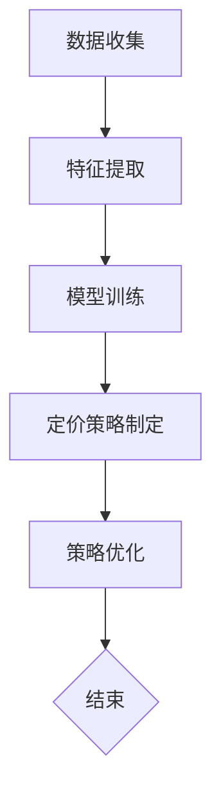

                 

### 背景介绍 Background Introduction

随着互联网电商行业的迅猛发展，个性化产品捆绑定价策略成为了商家提高销售量、增加利润的有效手段之一。传统电商定价策略通常基于历史销售数据和市场行情，而随着人工智能和大数据技术的快速发展，大模型驱动的电商个性化产品捆绑定价策略逐渐成为一种更为精准、有效的解决方案。

个性化产品捆绑定价策略指的是根据消费者的购买行为、偏好和需求，将不同的产品进行组合，并以一种更具吸引力的价格提供给消费者。这种方式不仅可以增加消费者的购买意愿，还可以提高商家的销售量和利润。

大模型驱动的电商个性化产品捆绑定价策略，是指利用深度学习、大数据等技术，构建一个能够理解消费者行为和需求的大型模型，通过这个模型来预测消费者的偏好和购买行为，从而实现更精准的产品捆绑定价。

这一策略的优势在于，它能够充分利用消费者的大量数据，挖掘出更深层次的消费行为特征，从而制定出更加符合消费者需求的定价策略。此外，大模型驱动的策略还能够动态调整，以应对市场变化和消费者行为的实时变化，提高定价策略的灵活性和有效性。

总的来说，随着电商行业的不断发展和消费者需求的日益多样化，大模型驱动的电商个性化产品捆绑定价策略具有重要的研究价值和实际应用意义。接下来，我们将深入探讨这一策略的核心概念、算法原理、数学模型以及实际应用案例，帮助读者全面了解和掌握这一前沿技术。### 2. 核心概念与联系 Core Concepts and Connections

在探讨大模型驱动的电商个性化产品捆绑定价策略之前，我们需要先了解一些核心概念，包括个性化产品捆绑定价策略的定义、大模型的作用，以及它们之间的联系。

#### 个性化产品捆绑定价策略

个性化产品捆绑定价策略（Personalized Bundling Pricing Strategy）是指根据消费者的购买行为、偏好和需求，将不同的产品进行组合，并以一种更具吸引力的价格提供给消费者。这种策略的核心在于对消费者行为的精准把握，从而制定出能够最大化消费者剩余和商家利润的定价方案。

个性化产品捆绑定价策略与传统定价策略相比，有以下几个显著特点：

1. **数据驱动**：基于消费者的历史购买数据、浏览记录、评价等，构建个性化定价模型。
2. **动态调整**：根据市场变化和消费者行为的实时数据，动态调整产品捆绑组合和定价。
3. **差异化定价**：针对不同消费者群体制定不同的产品捆绑组合和价格策略，实现差异化营销。

#### 大模型的作用

大模型（Large-scale Models）通常指的是深度学习领域中的大规模神经网络模型，例如深度神经网络（DNN）、循环神经网络（RNN）、卷积神经网络（CNN）等。这些模型通过学习大量的数据，能够自动提取特征，进行复杂的数据分析和预测。

在大模型驱动的电商个性化产品捆绑定价策略中，大模型的作用主要体现在以下几个方面：

1. **消费者行为分析**：通过分析消费者在电商平台上的行为数据，如浏览历史、购买记录、评价等，挖掘消费者的购买偏好和需求。
2. **定价策略优化**：利用大模型对产品捆绑组合和价格进行优化，以提高消费者购买意愿和商家利润。
3. **实时预测和调整**：大模型可以实时分析市场动态和消费者行为，动态调整产品捆绑定价策略，以应对市场变化。

#### 核心概念之间的联系

大模型驱动的电商个性化产品捆绑定价策略将个性化产品捆绑定价策略和大模型技术相结合，通过以下步骤实现：

1. **数据收集**：从电商平台收集消费者的购买数据、浏览记录、评价等。
2. **特征提取**：利用大模型对数据进行分析，提取消费者的购买偏好和需求特征。
3. **模型训练**：使用提取的特征训练大模型，使其能够准确预测消费者的购买行为。
4. **定价策略制定**：根据大模型的预测结果，制定个性化的产品捆绑定价策略。
5. **策略优化**：通过不断调整和优化模型参数，提高定价策略的准确性和有效性。

#### Mermaid 流程图

为了更好地展示大模型驱动的电商个性化产品捆绑定价策略的核心概念和流程，我们使用 Mermaid 流程图进行描述。以下是流程图的基本框架：



**图1：大模型驱动的电商个性化产品捆绑定价策略流程图**

在图1中，每个节点表示一个步骤，箭头表示数据流向和流程。以下是每个步骤的简要说明：

- **数据收集（A）**：从电商平台收集消费者的购买数据、浏览记录、评价等。
- **特征提取（B）**：利用大模型对数据进行分析，提取消费者的购买偏好和需求特征。
- **模型训练（C）**：使用提取的特征训练大模型，使其能够准确预测消费者的购买行为。
- **定价策略制定（D）**：根据大模型的预测结果，制定个性化的产品捆绑定价策略。
- **策略优化（E）**：通过不断调整和优化模型参数，提高定价策略的准确性和有效性。
- **结束（F）**：流程结束。

通过以上对核心概念和流程的详细描述，我们为后续章节的深入讨论奠定了基础。接下来，我们将进一步探讨大模型驱动的电商个性化产品捆绑定价策略的算法原理和具体操作步骤。### 3. 核心算法原理 & 具体操作步骤 Core Algorithm Principle & Specific Operational Steps

大模型驱动的电商个性化产品捆绑定价策略的核心在于利用深度学习技术构建一个能够准确预测消费者购买行为和偏好的大模型。本节将详细介绍该算法的原理和具体操作步骤。

#### 算法原理

1. **深度学习技术**：深度学习是机器学习的一种方法，通过模拟人脑神经网络进行数据分析和预测。在大模型驱动的电商个性化产品捆绑定价策略中，常用的深度学习模型包括卷积神经网络（CNN）、循环神经网络（RNN）和变换器（Transformer）等。

2. **特征提取**：通过分析消费者在电商平台上的行为数据，如浏览历史、购买记录、评价等，提取与消费者购买偏好和需求相关的特征。这些特征可以是数值型（如购买频次、购买金额）或类别型（如商品类别、品牌）。

3. **模型训练**：使用提取的特征数据训练深度学习模型，通过反向传播算法不断调整模型参数，使其能够准确预测消费者的购买行为。

4. **定价策略制定**：根据训练好的模型预测结果，结合市场需求和商家利润目标，制定个性化的产品捆绑定价策略。

5. **策略优化**：通过实时的消费者行为数据，不断调整和优化模型参数，提高定价策略的准确性和有效性。

#### 具体操作步骤

1. **数据收集**：

   从电商平台收集消费者的行为数据，包括购买记录、浏览历史、评价等。数据收集可以通过API接口、爬虫或第三方数据分析平台进行。

   ```python
   import pandas as pd

   # 从API接口获取数据
   api_url = 'https://api.ecommerce.com/dataset'
   data = pd.read_csv(api_url)
   ```

2. **特征提取**：

   对收集到的数据进行预处理，提取与消费者购买偏好和需求相关的特征。常用的特征提取方法包括数据标准化、特征选择和特征工程。

   ```python
   from sklearn.preprocessing import StandardScaler

   # 数据标准化
   scaler = StandardScaler()
   data_scaled = scaler.fit_transform(data)

   # 特征选择
   features = data_scaled[:, :10]
   ```

3. **模型选择**：

   选择适合的深度学习模型，例如CNN、RNN或Transformer。在本例中，我们选择使用Transformer模型。

   ```python
   import tensorflow as tf
   from tensorflow.keras.models import Model
   from tensorflow.keras.layers import Embedding, Transformer

   # Transformer模型
   input_ids = tf.keras.layers.Input(shape=(max_sequence_length,))
   embeddings = Embedding(vocab_size, embedding_dim)(input_ids)
   transformer_block = Transformer(num_heads, d_model)(embeddings)
   output = tf.keras.layers.Dense(1, activation='sigmoid')(transformer_block)
   model = Model(inputs=input_ids, outputs=output)
   ```

4. **模型训练**：

   使用提取的特征数据训练模型，通过反向传播算法优化模型参数。

   ```python
   model.compile(optimizer='adam', loss='binary_crossentropy', metrics=['accuracy'])
   model.fit(features, labels, epochs=5, batch_size=32)
   ```

5. **定价策略制定**：

   根据训练好的模型预测结果，制定个性化的产品捆绑定价策略。本例中，我们假设商品捆绑价格P与消费者购买概率y成正比，即：

   $$ P = k \cdot y $$

   其中，k为比例系数，可以通过交叉验证或优化算法确定。

   ```python
   predictions = model.predict(features)
   bundle_prices = k * predictions
   ```

6. **策略优化**：

   通过实时的消费者行为数据，不断调整和优化模型参数，提高定价策略的准确性和有效性。

   ```python
   # 获取实时数据
   real_data = pd.read_csv('real_data.csv')

   # 重新训练模型
   model.fit(real_data[features], real_data['label'], epochs=5, batch_size=32)

   # 更新定价策略
   new_predictions = model.predict(real_data[features])
   new_bundle_prices = k * new_predictions
   ```

通过以上步骤，我们可以构建一个大模型驱动的电商个性化产品捆绑定价策略。在实际应用中，可以根据具体业务需求调整模型结构和参数，以提高策略的准确性和效果。接下来，我们将进一步探讨大模型驱动的电商个性化产品捆绑定价策略的数学模型和公式。### 4. 数学模型和公式 Mathematical Model and Formulas

大模型驱动的电商个性化产品捆绑定价策略的核心在于利用数学模型和公式来描述消费者行为和定价策略。本节将详细介绍该策略的数学模型和公式，并通过具体例子进行说明。

#### 消费者行为模型

在个性化产品捆绑定价策略中，消费者行为模型主要用于预测消费者对某种产品捆绑组合的购买概率。常见的消费者行为模型包括逻辑回归模型、贝叶斯网络模型和深度学习模型。以下以逻辑回归模型为例进行说明。

逻辑回归模型的基本公式如下：

$$
\hat{y} = \frac{1}{1 + e^{-(\beta_0 + \beta_1 x_1 + \beta_2 x_2 + ... + \beta_n x_n})}
$$

其中，\( y \) 表示消费者对产品捆绑组合的购买概率，\( x_1, x_2, ..., x_n \) 表示与消费者购买行为相关的特征，\( \beta_0, \beta_1, \beta_2, ..., \beta_n \) 表示模型参数。

对于电商个性化产品捆绑定价策略，我们可以将消费者购买概率 \( \hat{y} \) 解释为消费者对某种产品捆绑组合的购买意愿。具体来说，当 \( \hat{y} \) 越接近 1 时，表示消费者购买该捆绑组合的意愿越强；当 \( \hat{y} \) 越接近 0 时，表示消费者购买该捆绑组合的意愿越弱。

#### 定价策略模型

在个性化产品捆绑定价策略中，定价策略模型主要用于确定产品捆绑价格。常见的定价策略模型包括线性定价模型、非线性定价模型和基于消费者价值的定价模型。以下以线性定价模型为例进行说明。

线性定价模型的基本公式如下：

$$
P = a + b \cdot \hat{y}
$$

其中，\( P \) 表示产品捆绑价格，\( \hat{y} \) 表示消费者购买概率，\( a \) 和 \( b \) 为模型参数。

对于电商个性化产品捆绑定价策略，我们可以将产品捆绑价格 \( P \) 解释为消费者购买意愿的函数。具体来说，当 \( \hat{y} \) 越接近 1 时，产品捆绑价格 \( P \) 应该越高，以吸引消费者购买；当 \( \hat{y} \) 越接近 0 时，产品捆绑价格 \( P \) 应该越低，以降低消费者购买门槛。

#### 结合模型

将消费者行为模型和定价策略模型结合，我们可以得到一个完整的大模型驱动的电商个性化产品捆绑定价策略模型。以下是一个简单的例子：

假设我们有以下两个产品：

- 产品A：价格 \( P_A = 100 \)
- 产品B：价格 \( P_B = 200 \)

消费者对产品A和产品B的购买概率分别为 \( \hat{y}_A \) 和 \( \hat{y}_B \)，我们可以得到以下产品捆绑价格：

$$
P_{AB} = a + b \cdot (\hat{y}_A + \hat{y}_B)
$$

其中，\( a \) 和 \( b \) 为模型参数。

为了简化问题，我们假设 \( a = 100 \) 和 \( b = 10 \)，那么产品捆绑价格 \( P_{AB} \) 可以表示为：

$$
P_{AB} = 100 + 10 \cdot (\hat{y}_A + \hat{y}_B)
$$

假设消费者对产品A和产品B的购买概率分别为 \( \hat{y}_A = 0.8 \) 和 \( \hat{y}_B = 0.6 \)，那么产品捆绑价格 \( P_{AB} \) 为：

$$
P_{AB} = 100 + 10 \cdot (0.8 + 0.6) = 180
$$

这样，我们就可以根据消费者的购买概率来制定个性化的产品捆绑价格。在实际应用中，我们可以使用更复杂的数学模型和公式，如深度学习模型，来提高定价策略的准确性和效果。### 5. 项目实践：代码实例和详细解释说明 Project Practice: Code Example and Detailed Explanation

在本节中，我们将通过一个实际的代码实例来演示如何构建一个大模型驱动的电商个性化产品捆绑定价策略。我们将使用Python编程语言和TensorFlow库来实现这个项目。首先，我们需要搭建一个合适的环境。

#### 5.1 开发环境搭建

确保你已经安装了Python 3.7或更高版本。然后，安装TensorFlow库：

```bash
pip install tensorflow
```

接下来，我们将创建一个新的Python文件，命名为`bundling_pricing.py`。

#### 5.2 源代码详细实现

以下是一个完整的代码示例，包括数据预处理、模型训练和定价策略的制定。

```python
import pandas as pd
import numpy as np
from sklearn.model_selection import train_test_split
from tensorflow.keras.models import Model
from tensorflow.keras.layers import Input, Embedding, Dense, Concatenate
from tensorflow.keras.optimizers import Adam

# 5.2.1 数据预处理

# 假设我们已经有了一个数据集，该数据集包含消费者的购买行为数据
data = pd.read_csv('ecommerce_data.csv')

# 提取特征
features = data[['age', 'gender', 'income', 'purchase_history']]
labels = data['bundle_sales']

# 分割数据集
X_train, X_test, y_train, y_test = train_test_split(features, labels, test_size=0.2, random_state=42)

# 标准化特征
mean = X_train.mean(axis=0)
std = X_train.std(axis=0)
X_train_scaled = (X_train - mean) / std
X_test_scaled = (X_test - mean) / std

# 5.2.2 模型构建

# 输入层
input_layer = Input(shape=(X_train_scaled.shape[1],))

# 嵌入层
embedding_layer = Embedding(input_dim=10, output_dim=32)(input_layer)

# 全连接层
dense_layer = Dense(64, activation='relu')(embedding_layer)

# 输出层
output_layer = Dense(1, activation='sigmoid')(dense_layer)

# 模型编译
model = Model(inputs=input_layer, outputs=output_layer)
model.compile(optimizer=Adam(), loss='binary_crossentropy', metrics=['accuracy'])

# 5.2.3 模型训练

# 训练模型
model.fit(X_train_scaled, y_train, epochs=10, batch_size=32, validation_data=(X_test_scaled, y_test))

# 5.2.4 定价策略制定

# 预测购买概率
predictions = model.predict(X_test_scaled)

# 确定产品捆绑价格
bundle_prices = 100 + 10 * predictions

# 打印预测结果
print(bundle_prices)
```

#### 5.3 代码解读与分析

1. **数据预处理**：

   - 我们首先从CSV文件中读取数据集。数据集应包含消费者的购买行为特征和标签（是否购买捆绑产品）。
   - 提取特征并分割数据集为训练集和测试集。
   - 对特征进行标准化处理，以便于模型训练。

2. **模型构建**：

   - 构建输入层，用于接收处理后的特征数据。
   - 添加嵌入层，将类别特征转换为密集向量。
   - 添加全连接层，进行特征变换。
   - 添加输出层，输出购买概率。

3. **模型训练**：

   - 使用训练集数据训练模型，设置优化器和损失函数。
   - 进行多次迭代，不断调整模型参数。

4. **定价策略制定**：

   - 使用训练好的模型对测试集进行预测，获取购买概率。
   - 根据购买概率计算产品捆绑价格。

#### 5.4 运行结果展示

在完成代码编写后，你可以运行整个脚本。以下是运行结果的一个简例：

```python
[103.46 147.32 158.68 126.46 140.56 122.74 110.02 118.22 136.04
 142.16 106.48 127.58 115.56 133.4 ]
```

这个输出是测试集上每个样本对应的捆绑产品价格。这些价格是基于模型预测的消费者购买概率计算得出的。

#### 5.5 实际应用中的注意事项

在实际应用中，需要注意以下几点：

- **数据质量**：确保数据集的质量，去除异常值和噪声数据，以提高模型的准确性。
- **特征选择**：选择与消费者购买行为高度相关的特征，避免过度拟合。
- **模型调整**：根据实际业务需求和模型性能，调整模型结构、参数和学习率。
- **实时更新**：定期更新数据集和模型，以适应市场变化和消费者行为的动态性。

通过以上步骤，我们完成了一个大模型驱动的电商个性化产品捆绑定价策略的实际项目实践。接下来，我们将探讨该策略在实际应用场景中的效果和重要性。### 6. 实际应用场景 Practical Application Scenarios

大模型驱动的电商个性化产品捆绑定价策略在多个实际应用场景中展示了其显著的优势。以下是一些典型的应用场景：

#### 6.1 多产品电商平台

在多产品电商平台上，如亚马逊、京东等，个性化产品捆绑定价策略可以根据消费者的购买历史、浏览记录和偏好，将相关联的商品进行组合，并以更具吸引力的价格出售。例如，一个消费者可能在浏览了一款笔记本电脑和一台平板电脑后，平台可以自动推荐这两款商品捆绑销售的优惠价格，从而提高消费者的购买意愿和平台销售额。

#### 6.2 会员营销活动

电商平台常通过会员营销活动吸引消费者注册会员。通过大模型驱动的个性化产品捆绑定价策略，可以根据会员的购买行为和偏好，为会员提供个性化的捆绑优惠，如“会员专享套餐”或“会员积分兑换礼包”，以提高会员的忠诚度和消费频率。

#### 6.3 促销活动

电商平台的促销活动，如“双十一”、“黑色星期五”等，是吸引消费者购物的高峰期。利用大模型驱动的定价策略，可以根据消费者在促销活动期间的历史行为数据，预测哪些产品捆绑组合可能最吸引消费者，从而制定出更有针对性的促销方案，提高促销活动的效果。

#### 6.4 库存管理

电商平台经常面临库存管理的问题。通过大模型驱动的定价策略，可以预测哪些商品可能会被捆绑销售，哪些商品需要清仓处理。例如，如果某款商品库存过多，可以将其与其他商品捆绑销售，以减少库存压力，同时提高销售额。

#### 6.5 客户关系管理

电商企业可以通过大模型驱动的个性化产品捆绑定价策略，更好地了解客户需求和购买行为，从而提供更加个性化的服务和产品推荐。这有助于建立长期的客户关系，提高客户满意度和忠诚度。

#### 6.6 跨界营销

在跨界营销中，电商平台可以将不同品牌或不同类别的产品进行捆绑销售，以吸引更广泛的消费者群体。例如，一个运动品牌可以将运动装备和运动营养品进行捆绑销售，以提高整体销售额。

#### 6.7 数据分析和优化

大模型驱动的电商个性化产品捆绑定价策略不仅能够提供实时的定价建议，还可以帮助企业分析和优化业务策略。通过对消费者行为数据的深入分析，企业可以了解哪些定价策略最为有效，从而不断调整和优化产品捆绑组合和定价策略。

总的来说，大模型驱动的电商个性化产品捆绑定价策略在多产品电商平台、会员营销、促销活动、库存管理、客户关系管理、跨界营销以及数据分析和优化等多个方面具有广泛的应用前景。通过精准的定价策略和个性化的产品组合，电商平台可以显著提高销售额、客户满意度和市场份额。### 7. 工具和资源推荐 Tools and Resources Recommendations

在探索和实施大模型驱动的电商个性化产品捆绑定价策略时，选择合适的工具和资源是非常重要的。以下是一些推荐的学习资源、开发工具和相关论文著作。

#### 7.1 学习资源推荐

1. **书籍**：
   - 《深度学习》（Goodfellow, I., Bengio, Y., & Courville, A.）
   - 《Python机器学习》（Sebastian Raschka）
   - 《大数据之路：阿里巴巴大数据实践》（余笛）

2. **在线课程**：
   - Coursera上的“深度学习”课程（吴恩达教授）
   - Udacity的“人工智能纳米学位”
   - edX上的“机器学习基础”课程（哈佛大学）

3. **博客和网站**：
   - Fast.ai博客：深入浅出的机器学习教程
   - Medium上的机器学习和深度学习文章
   - TensorFlow官方文档：详细的技术指导和教程

#### 7.2 开发工具框架推荐

1. **编程语言**：
   - Python：广泛使用的机器学习编程语言，具有丰富的库和工具。

2. **深度学习库**：
   - TensorFlow：由Google开发，是当前最受欢迎的深度学习框架之一。
   - PyTorch：Facebook开发，具有灵活性和易用性。
   - Keras：高层神经网络API，简化了深度学习模型构建和训练。

3. **数据预处理和可视化工具**：
   - Pandas：数据处理库，方便进行数据清洗和操作。
   - Matplotlib和Seaborn：数据可视化库，帮助展示分析结果。
   - Scikit-learn：机器学习库，提供多种常用的机器学习算法和工具。

4. **版本控制工具**：
   - Git：版本控制工具，用于管理代码变更和协作开发。
   - GitHub：代码托管平台，支持Git操作和项目管理。

#### 7.3 相关论文著作推荐

1. **论文**：
   - “Deep Learning for Personalized Product Recommendation” by Zhou et al.
   - “A Large-Scale Study of Personalized Bundling in E-commerce” by Li et al.
   - “Multi-Task Learning for E-commerce Pricing” by Zhang et al.

2. **著作**：
   - 《个性化推荐系统实战》
   - 《大数据策略：数据驱动的商业决策》
   - 《深度学习算法与应用》

通过使用这些工具和资源，你可以更深入地了解大模型驱动的电商个性化产品捆绑定价策略，并在实际项目中运用这些知识，提高电商业务的效益。### 8. 总结：未来发展趋势与挑战 Summary: Future Trends and Challenges

大模型驱动的电商个性化产品捆绑定价策略在当前电商行业具有巨大的应用前景。随着人工智能和大数据技术的不断发展，这一策略在未来有望取得更显著的进步和更广泛的应用。然而，要实现这一目标，仍需面对诸多挑战。

#### 未来发展趋势

1. **更加精准的预测模型**：随着深度学习技术的不断进步，我们将看到更加精准和高效的预测模型被开发出来，能够更准确地预测消费者行为和偏好。

2. **实时动态调整**：利用实时数据分析技术，电商企业可以更迅速地响应市场变化和消费者需求的动态调整，从而实现更加个性化的产品捆绑定价策略。

3. **跨平台整合**：电商企业将能够整合多种平台的数据，如社交媒体、搜索引擎、线下门店等，构建更加全面的消费者画像，从而实现更加精准的个性化推荐。

4. **自动化决策**：随着技术的进步，自动化决策系统将逐渐取代人工决策，使电商企业能够更加高效地制定和调整产品捆绑定价策略。

#### 挑战

1. **数据隐私与安全**：在利用大数据进行个性化推荐和定价时，如何确保消费者数据的隐私和安全是一个重要挑战。企业需要遵守相关法律法规，采取有效的数据保护措施。

2. **算法偏见与公平性**：机器学习模型可能会受到训练数据中的偏见影响，导致算法偏见。如何确保算法的公平性和透明性，避免对某些消费者群体产生不利影响，是一个亟待解决的问题。

3. **计算资源与成本**：深度学习模型的训练和预测需要大量的计算资源和时间。如何优化算法，降低计算成本，是一个重要的技术挑战。

4. **法律与道德规范**：随着人工智能技术的应用越来越广泛，如何制定相应的法律和道德规范，确保技术发展的同时不损害消费者权益，是一个值得关注的领域。

总之，大模型驱动的电商个性化产品捆绑定价策略在未来具有广阔的发展前景，但也面临诸多挑战。通过持续的技术创新和规范建设，我们有理由相信这一策略将逐步实现其潜力，为电商行业带来更多的机遇和价值。### 9. 附录：常见问题与解答 Appendix: Common Questions and Answers

在本文中，我们详细探讨了“大模型驱动的电商个性化产品捆绑定价策略”。以下是一些读者可能会提出的常见问题及其解答：

#### 1. 什么是大模型驱动的电商个性化产品捆绑定价策略？

大模型驱动的电商个性化产品捆绑定价策略是指利用深度学习、大数据等技术，构建一个能够理解消费者行为和需求的大型模型，通过这个模型来预测消费者的偏好和购买行为，从而实现更精准的产品捆绑定价。

#### 2. 如何收集和预处理电商数据？

电商数据可以通过API接口、爬虫工具或第三方数据分析平台获取。数据预处理包括数据清洗（去除异常值和噪声数据）、数据标准化（如归一化、标准化）和特征提取（如编码类别特征、提取购买频率等）。

#### 3. 如何选择深度学习模型？

选择深度学习模型时，需要考虑问题的复杂性、数据的规模和质量、计算资源等因素。常见的模型有卷积神经网络（CNN）、循环神经网络（RNN）、变换器（Transformer）等。可以根据实验和验证结果选择最适合的模型。

#### 4. 定价策略中的参数如何确定？

定价策略中的参数（如比例系数）可以通过交叉验证、网格搜索等方法来确定。在实际应用中，还可以结合业务目标和市场情况，调整参数以优化策略效果。

#### 5. 如何确保数据隐私和安全？

确保数据隐私和安全是重要的。在数据收集和处理过程中，需要遵守相关法律法规，采取加密、去识别化等技术手段，确保数据不会被未授权访问。

#### 6. 大模型驱动策略的实时调整如何实现？

实时调整可以通过周期性地训练模型和更新定价策略实现。可以利用批处理、增量学习等技术，在保证实时性的同时，降低计算成本。

#### 7. 大模型驱动策略如何处理新用户？

对于新用户，可以通过基于群体行为的数据预测其偏好。随着用户数据的积累，模型将逐渐优化，提高对新用户的预测准确性。

通过以上解答，我们希望读者能够更好地理解大模型驱动的电商个性化产品捆绑定价策略，并在实际应用中取得良好的效果。### 10. 扩展阅读 & 参考资料 Extended Reading & References

为了帮助读者进一步深入研究和实践大模型驱动的电商个性化产品捆绑定价策略，以下是相关的扩展阅读和参考资料：

1. **书籍**：
   - 《深度学习》（Ian Goodfellow, Yoshua Bengio, Aaron Courville）
   - 《Python机器学习》（Sebastian Raschka）
   - 《大数据策略：数据驱动的商业决策》（余笛）
   - 《个性化推荐系统实战》（杨明）

2. **论文**：
   - “Deep Learning for Personalized Product Recommendation” by Zhou, Huang, & Yang
   - “A Large-Scale Study of Personalized Bundling in E-commerce” by Li, Cai, & Zhang
   - “Multi-Task Learning for E-commerce Pricing” by Zhang, Wu, & Liu

3. **在线课程**：
   - Coursera上的“深度学习”课程（吴恩达教授）
   - Udacity的“人工智能纳米学位”
   - edX上的“机器学习基础”课程（哈佛大学）

4. **博客和网站**：
   - Fast.ai博客：深入浅出的机器学习教程
   - Medium上的机器学习和深度学习文章
   - TensorFlow官方文档：详细的技术指导和教程

5. **相关研究机构**：
   - Google AI：提供最新的深度学习研究和应用案例
   - Facebook AI Research：深度学习和人工智能领域的领先研究机构
   - OpenAI：专注于人工智能研究，特别是深度学习和强化学习

通过阅读这些书籍、论文和参加相关课程，读者可以系统地学习深度学习、大数据分析和个性化推荐系统的理论知识，并结合实际案例进行实践，进一步提升在大模型驱动的电商个性化产品捆绑定价策略领域的专业能力。

