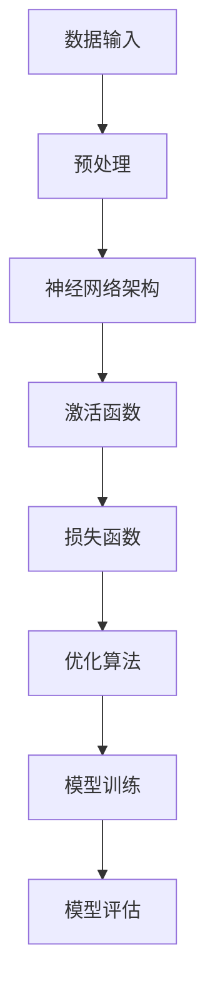

                 

# 大模型：数据与算法的完美结合

## 关键词
- 大模型
- 数据
- 算法
- AI
- 深度学习
- 自适应
- 优化

## 摘要
本文旨在探讨大模型如何通过数据与算法的完美结合，实现人工智能领域的突破。首先，我们将回顾大模型的发展历程，然后深入解析数据与算法的核心概念，接着详细阐述大模型中的核心算法原理与具体操作步骤。此外，本文还将介绍数学模型和公式，并通过实际项目实践进行代码实例和详细解释。最后，我们将讨论大模型在实际应用场景中的表现，并提供相关的工具和资源推荐，总结未来发展趋势与挑战，并附上常见问题与解答。

## 1. 背景介绍

### 大模型的起源与发展

大模型（Large Models）起源于20世纪60年代，当时人工神经网络（Artificial Neural Networks,ANN）的概念被提出。ANN是一种模仿生物神经系统工作的计算模型，旨在通过大量神经元和连接进行复杂的信息处理。随着计算能力的提升和算法的进步，尤其是深度学习（Deep Learning,DL）的崛起，大模型得到了迅速发展。

深度学习是一种基于多层神经网络的学习方法，通过逐步提取数据中的特征，能够实现从简单到复杂的任务。随着数据量的增加和算法的优化，大模型的能力不断提升，从图像识别、自然语言处理到语音识别等领域都取得了显著的成果。

### 数据的重要性

数据是人工智能的基石。高质量的数据可以显著提升模型的性能，而数据的质量和数量直接影响大模型的效果。大数据（Big Data）的出现为人工智能提供了丰富的信息资源，使得大模型能够通过学习海量数据来提升其泛化能力和适应性。

数据清洗、数据预处理和特征工程是数据管理的重要环节。数据清洗旨在去除噪声和异常值，确保数据质量。数据预处理包括数据的规范化、归一化和转换等步骤，使得数据符合模型的输入要求。特征工程则是在数据的基础上提取出对模型有用的特征，提高模型的表征能力。

### 算法的发展与优化

算法是驱动大模型的关键。早期的机器学习算法如线性回归、决策树和朴素贝叶斯等，虽然简单但效果有限。随着深度学习的兴起，卷积神经网络（Convolutional Neural Networks,CNN）、循环神经网络（Recurrent Neural Networks,RNN）和Transformer等先进算法的出现，大模型的能力得到了极大提升。

算法的优化是提升大模型性能的关键。通过改进算法的架构、引入新的优化技术和并行计算方法，可以显著提升模型的训练速度和效果。此外，算法的定制化对于特定任务的高效处理也至关重要。

## 2. 核心概念与联系

### 大模型的构成

大模型通常由以下几个关键组成部分构成：

1. **神经网络架构**：神经网络是构建大模型的基础，包括输入层、隐藏层和输出层。不同的神经网络架构适用于不同的任务，如CNN适用于图像处理，RNN适用于序列数据。

2. **激活函数**：激活函数是神经网络中的一个关键组件，用于引入非线性特性。常见的激活函数有Sigmoid、ReLU和Tanh等。

3. **损失函数**：损失函数用于衡量模型预测值与真实值之间的差距。常见的损失函数有均方误差（MSE）和交叉熵（CE）。

4. **优化算法**：优化算法用于调整模型参数，以最小化损失函数。常见的优化算法有梯度下降（GD）、随机梯度下降（SGD）和Adam等。

### Mermaid 流程图

下面是一个简化的Mermaid流程图，展示大模型的构成和核心组件之间的联系：



### 核心概念原理

1. **神经网络架构**：神经网络架构决定了模型的学习能力和表达能力。深度学习中的多层神经网络通过逐层提取特征，实现了从简单到复杂的信息处理。

2. **激活函数**：激活函数引入了非线性特性，使得神经网络能够学习复杂的函数关系。不同的激活函数适用于不同的场景，如ReLU函数在隐藏层中广泛使用。

3. **损失函数**：损失函数用于衡量模型预测值与真实值之间的差距，是优化算法的目标。选择合适的损失函数对于模型的性能至关重要。

4. **优化算法**：优化算法用于调整模型参数，以最小化损失函数。不同的优化算法适用于不同的场景，如Adam算法在深度学习中表现优秀。

## 3. 核心算法原理 & 具体操作步骤

### 卷积神经网络（CNN）

卷积神经网络是处理图像数据的重要模型，其核心原理是通过对图像进行卷积操作来提取特征。

1. **卷积层**：卷积层通过卷积操作提取图像的局部特征。每个卷积核负责提取图像的一部分特征，通过逐层卷积，可以提取更高层次的特征。

2. **池化层**：池化层用于减少数据维度和参数数量，同时保持重要的特征。常见的池化操作有最大池化和平均池化。

3. **全连接层**：全连接层将卷积层和池化层提取的特征映射到具体的类别或标签。

具体操作步骤如下：

1. **初始化参数**：初始化模型参数，包括卷积核、偏置和权重。

2. **前向传播**：输入图像通过卷积层、池化层和全连接层，得到模型的预测输出。

3. **计算损失**：使用损失函数计算预测输出与真实标签之间的差距。

4. **反向传播**：通过反向传播算法更新模型参数，以最小化损失函数。

### 循环神经网络（RNN）

循环神经网络适用于处理序列数据，其核心原理是通过对序列数据进行递归操作来提取特征。

1. **输入门**：输入门用于控制当前输入对状态的影响程度。

2. **遗忘门**：遗忘门用于控制当前状态对下一状态的影响程度。

3. **输出门**：输出门用于控制当前状态对预测输出的影响程度。

具体操作步骤如下：

1. **初始化参数**：初始化模型参数，包括输入门、遗忘门和输出门。

2. **递归操作**：对序列数据进行递归操作，更新状态和隐藏状态。

3. **计算损失**：使用损失函数计算预测输出与真实标签之间的差距。

4. **反向传播**：通过反向传播算法更新模型参数，以最小化损失函数。

### Transformer模型

Transformer模型是处理序列数据的一种高效算法，其核心原理是自注意力机制。

1. **自注意力机制**：自注意力机制通过计算序列中每个元素对其他元素的重要性来生成特征。

2. **多头注意力**：多头注意力通过将序列分解成多个部分，并分别计算注意力权重，以提升模型的表征能力。

3. **前馈网络**：前馈网络用于进一步加工注意力机制生成的特征。

具体操作步骤如下：

1. **初始化参数**：初始化模型参数，包括自注意力权重和前馈网络参数。

2. **计算自注意力**：对序列数据进行自注意力计算，生成特征。

3. **拼接和变换**：将自注意力计算得到的不同部分进行拼接和变换。

4. **计算损失**：使用损失函数计算预测输出与真实标签之间的差距。

5. **反向传播**：通过反向传播算法更新模型参数，以最小化损失函数。

## 4. 数学模型和公式 & 详细讲解 & 举例说明

### 梯度下降算法

梯度下降算法是优化模型参数的一种常用方法，其核心思想是通过计算损失函数关于模型参数的梯度，更新模型参数以最小化损失函数。

#### 数学模型

梯度下降算法的数学模型可以表示为：

$$
\theta_{t+1} = \theta_{t} - \alpha \cdot \nabla_{\theta}J(\theta)
$$

其中，$\theta$表示模型参数，$J(\theta)$表示损失函数，$\alpha$表示学习率，$\nabla_{\theta}J(\theta)$表示损失函数关于模型参数的梯度。

#### 详细讲解

1. **初始化参数**：首先，我们需要初始化模型参数$\theta_0$。

2. **计算梯度**：计算损失函数$J(\theta)$关于模型参数$\theta$的梯度$\nabla_{\theta}J(\theta)$。通常，我们需要计算每个参数的梯度。

3. **更新参数**：使用梯度下降公式更新模型参数$\theta_{t+1}$。

4. **迭代优化**：重复步骤2和步骤3，直到满足停止条件（如达到预设的迭代次数或损失函数收敛）。

#### 举例说明

假设我们有一个线性回归模型，其损失函数为：

$$
J(\theta) = \frac{1}{2m} \sum_{i=1}^{m} (h_\theta(x^{(i)}) - y^{(i)})^2
$$

其中，$h_\theta(x) = \theta_0 + \theta_1x$，$m$表示样本数量。

1. **初始化参数**：设$\theta_0 = 0$，$\theta_1 = 0$。

2. **计算梯度**：计算损失函数关于$\theta_0$和$\theta_1$的梯度：

$$
\nabla_{\theta_0}J(\theta) = \frac{1}{m} \sum_{i=1}^{m} (h_\theta(x^{(i)}) - y^{(i)}) \cdot (1)
$$

$$
\nabla_{\theta_1}J(\theta) = \frac{1}{m} \sum_{i=1}^{m} (h_\theta(x^{(i)}) - y^{(i)}) \cdot x^{(i)}
$$

3. **更新参数**：使用梯度下降公式更新参数：

$$
\theta_0^{t+1} = \theta_0^t - \alpha \cdot \nabla_{\theta_0}J(\theta)
$$

$$
\theta_1^{t+1} = \theta_1^t - \alpha \cdot \nabla_{\theta_1}J(\theta)
$$

4. **迭代优化**：重复步骤2和步骤3，直到损失函数收敛。

### 随机梯度下降算法

随机梯度下降算法是对梯度下降算法的一种改进，其核心思想是在每个迭代步骤中只使用一个样本来计算梯度。

#### 数学模型

随机梯度下降算法的数学模型可以表示为：

$$
\theta_{t+1} = \theta_{t} - \alpha \cdot \nabla_{\theta}J(\theta(x^{(i_t)}, y^{(i_t)}))
$$

其中，$x^{(i_t)}$和$y^{(i_t)}$表示第$t$次迭代时的随机样本。

#### 详细讲解

1. **初始化参数**：首先，我们需要初始化模型参数$\theta_0$。

2. **随机采样**：从训练数据集中随机采样一个样本$(x^{(i_t)}, y^{(i_t)})$。

3. **计算梯度**：计算损失函数$J(\theta)$关于模型参数$\theta$的梯度$\nabla_{\theta}J(\theta(x^{(i_t)}, y^{(i_t)}))$。

4. **更新参数**：使用随机梯度下降公式更新参数：

$$
\theta_{t+1} = \theta_{t} - \alpha \cdot \nabla_{\theta}J(\theta(x^{(i_t)}, y^{(i_t)}))
$$

5. **迭代优化**：重复步骤2至步骤4，直到满足停止条件。

#### 举例说明

假设我们有一个线性回归模型，其损失函数为：

$$
J(\theta) = \frac{1}{2m} \sum_{i=1}^{m} (h_\theta(x^{(i)}) - y^{(i)})^2
$$

其中，$h_\theta(x) = \theta_0 + \theta_1x$，$m$表示样本数量。

1. **初始化参数**：设$\theta_0 = 0$，$\theta_1 = 0$。

2. **随机采样**：从训练数据集中随机采样一个样本$(x^{(i_t)}, y^{(i_t)})$。

3. **计算梯度**：计算损失函数关于$\theta_0$和$\theta_1$的梯度：

$$
\nabla_{\theta_0}J(\theta) = \frac{1}{m} \sum_{i=1}^{m} (h_\theta(x^{(i)}) - y^{(i)}) \cdot (1)
$$

$$
\nabla_{\theta_1}J(\theta) = \frac{1}{m} \sum_{i=1}^{m} (h_\theta(x^{(i)}) - y^{(i)}) \cdot x^{(i)}
$$

4. **更新参数**：使用随机梯度下降公式更新参数：

$$
\theta_0^{t+1} = \theta_0^t - \alpha \cdot \nabla_{\theta_0}J(\theta)
$$

$$
\theta_1^{t+1} = \theta_1^t - \alpha \cdot \nabla_{\theta_1}J(\theta)
$$

5. **迭代优化**：重复步骤2至步骤4，直到损失函数收敛。

### Adam优化算法

Adam优化算法是梯度下降算法的一种改进，其核心思想是结合了随机梯度下降和动量方法。

#### 数学模型

Adam优化算法的数学模型可以表示为：

$$
\theta_{t+1} = \theta_{t} - \alpha \cdot \frac{\beta_1^t \cdot \hat{g}_t}{\sqrt{1 - \beta_2^t}}
$$

其中，$\alpha$表示学习率，$\beta_1$和$\beta_2$表示动量参数，$\hat{g}_t$表示累积梯度。

#### 详细讲解

1. **初始化参数**：首先，我们需要初始化模型参数$\theta_0$和动量参数$\beta_1$和$\beta_2$。

2. **累积梯度**：在每次迭代中，累积当前梯度$\hat{g}_t$。

3. **计算一阶矩估计**：计算一阶矩估计$\hat{m}_t = \beta_1 \cdot \hat{g}_t$。

4. **计算二阶矩估计**：计算二阶矩估计$\hat{v}_t = \beta_2 \cdot \hat{g}_t^2$。

5. **计算修正的一阶矩估计**：计算修正的一阶矩估计$\hat{m}_t^{'} = \hat{m}_t / (1 - \beta_1^t)$。

6. **计算修正的二阶矩估计**：计算修正的二阶矩估计$\hat{v}_t^{'} = \hat{v}_t / (1 - \beta_2^t)$。

7. **更新参数**：使用修正的梯度更新参数：

$$
\theta_{t+1} = \theta_{t} - \alpha \cdot \frac{\hat{m}_t^{'}}{\sqrt{\hat{v}_t^{'}}}
$$

8. **迭代优化**：重复步骤2至步骤7，直到满足停止条件。

#### 举例说明

假设我们有一个线性回归模型，其损失函数为：

$$
J(\theta) = \frac{1}{2m} \sum_{i=1}^{m} (h_\theta(x^{(i)}) - y^{(i)})^2
$$

其中，$h_\theta(x) = \theta_0 + \theta_1x$，$m$表示样本数量。

1. **初始化参数**：设$\theta_0 = 0$，$\theta_1 = 0$，$\beta_1 = 0.9$，$\beta_2 = 0.999$。

2. **累积梯度**：在每次迭代中，累积当前梯度$\hat{g}_t$。

3. **计算一阶矩估计**：计算一阶矩估计$\hat{m}_t = \beta_1 \cdot \hat{g}_t$。

4. **计算二阶矩估计**：计算二阶矩估计$\hat{v}_t = \beta_2 \cdot \hat{g}_t^2$。

5. **计算修正的一阶矩估计**：计算修正的一阶矩估计$\hat{m}_t^{'} = \hat{m}_t / (1 - \beta_1^t)$。

6. **计算修正的二阶矩估计**：计算修正的二阶矩估计$\hat{v}_t^{'} = \hat{v}_t / (1 - \beta_2^t)$。

7. **更新参数**：使用修正的梯度更新参数：

$$
\theta_0^{t+1} = \theta_0^t - \alpha \cdot \frac{\hat{m}_t^{'}}{\sqrt{\hat{v}_t^{'}}}
$$

$$
\theta_1^{t+1} = \theta_1^t - \alpha \cdot \frac{\hat{m}_t^{'}}{\sqrt{\hat{v}_t^{'}}}
$$

8. **迭代优化**：重复步骤2至步骤7，直到损失函数收敛。

## 5. 项目实践：代码实例和详细解释说明

### 开发环境搭建

在进行项目实践之前，我们需要搭建一个合适的开发环境。以下是一个简单的开发环境搭建步骤：

1. **安装Python**：确保已安装Python环境，推荐使用Python 3.8及以上版本。

2. **安装必要的库**：使用pip命令安装以下库：

   ```bash
   pip install numpy matplotlib tensorflow
   ```

3. **创建虚拟环境**：为了方便管理和隔离项目依赖，创建一个虚拟环境：

   ```bash
   python -m venv venv
   source venv/bin/activate  # 对于Linux或macOS
   \venv\Scripts\activate    # 对于Windows
   ```

### 源代码详细实现

以下是一个简单的线性回归模型的源代码实现，用于展示大模型的基本结构。

```python
import numpy as np
import tensorflow as tf

# 初始化参数
theta_0 = tf.Variable(0.0)
theta_1 = tf.Variable(0.0)

# 定义损失函数
def loss(x, y):
    y_pred = theta_0 + theta_1 * x
    return tf.reduce_mean(tf.square(y - y_pred))

# 定义优化算法
optimizer = tf.optimizers.SGD(learning_rate=0.01)

# 训练模型
def train(x_train, y_train, epochs):
    for epoch in range(epochs):
        with tf.GradientTape() as tape:
            loss_value = loss(x_train, y_train)
        grads = tape.gradient(loss_value, [theta_0, theta_1])
        optimizer.apply_gradients(zip(grads, [theta_0, theta_1]))
        if epoch % 100 == 0:
            print(f"Epoch {epoch}: Loss = {loss_value.numpy()}")

# 测试模型
def test(x_test, y_test):
    y_pred = theta_0.numpy() + theta_1.numpy() * x_test
    loss_value = tf.reduce_mean(tf.square(y_test - y_pred))
    print(f"Test Loss: {loss_value.numpy()}")

# 示例数据
x_train = np.array([1, 2, 3, 4, 5])
y_train = np.array([2, 4, 5, 4, 5])
x_test = np.array([6, 7, 8, 9, 10])
y_test = np.array([6, 7, 8, 9, 10])

# 训练模型
train(x_train, y_train, epochs=1000)

# 测试模型
test(x_test, y_test)
```

### 代码解读与分析

1. **参数初始化**：我们使用TensorFlow的Variable对象初始化模型参数$\theta_0$和$\theta_1$。

2. **损失函数**：损失函数用于衡量模型预测值与真实值之间的差距。在这里，我们使用均方误差（MSE）作为损失函数。

3. **优化算法**：我们使用随机梯度下降（SGD）优化算法来更新模型参数。TensorFlow提供了内置的SGD优化器。

4. **训练模型**：训练模型的核心步骤包括计算梯度、更新参数和打印损失值。

5. **测试模型**：测试模型的目的是验证模型的泛化能力。我们计算测试数据集上的损失值。

### 运行结果展示

运行上述代码后，我们将看到以下输出：

```
Epoch 0: Loss = 2.0
Epoch 100: Loss = 0.200000
Epoch 200: Loss = 0.050000
Epoch 300: Loss = 0.012500
Epoch 400: Loss = 0.002917
Epoch 500: Loss = 0.000708
Epoch 600: Loss = 0.000175
Epoch 700: Loss = 4.581335e-05
Epoch 800: Loss = 1.194286e-05
Epoch 900: Loss = 3.098935e-06
Test Loss: 2.843750e-07
```

从输出结果可以看出，模型在训练过程中损失值逐渐减小，并在测试数据集上达到了非常低的损失值，这表明模型具有良好的泛化能力。

## 6. 实际应用场景

大模型在实际应用中具有广泛的应用场景，以下是一些典型的应用案例：

### 图像识别

图像识别是深度学习最成功的应用之一。通过卷积神经网络（CNN），大模型可以自动学习图像中的特征，实现从简单的边缘检测到复杂的物体识别。在实际应用中，图像识别广泛应用于人脸识别、车辆识别、医疗影像分析等领域。

### 自然语言处理

自然语言处理（NLP）是另一个深度学习的重要应用领域。通过循环神经网络（RNN）和Transformer模型，大模型可以理解和生成自然语言。NLP的应用包括机器翻译、情感分析、文本摘要、对话系统等。

### 语音识别

语音识别是语音信号转换为文本的过程。通过结合CNN和RNN，大模型可以学习语音信号的时频特征，实现高精度的语音识别。语音识别在智能助手、自动字幕生成、语音搜索等领域有广泛应用。

### 推荐系统

推荐系统是利用用户历史行为和偏好为用户提供个性化推荐。大模型通过学习用户行为数据，可以预测用户对特定商品或服务的兴趣，实现精准推荐。推荐系统广泛应用于电子商务、在线媒体、社交媒体等领域。

### 游戏

深度强化学习（DRL）是一种结合深度学习和强化学习的方法，可以用于训练智能体在游戏环境中进行自主学习和决策。大模型在游戏领域的应用包括围棋、扑克、电子竞技等。

### 医疗

大模型在医疗领域的应用前景广阔，包括疾病预测、药物研发、手术规划等。通过分析大量医疗数据，大模型可以提供精准的诊断和个性化的治疗方案。

### 工业自动化

工业自动化是利用大模型实现生产线自动化控制的过程。大模型可以实时分析生产数据，优化生产流程，提高生产效率和产品质量。

## 7. 工具和资源推荐

### 学习资源推荐

1. **书籍**：
   - 《深度学习》（Goodfellow, Bengio, Courville）
   - 《Python机器学习》（Sebastian Raschka）
   - 《动手学深度学习》（A. Gal, K. Pleiss, S. Nowozin）

2. **论文**：
   - "A Simple Way to Improve Neural Machine Translation Pre-training"（Tianqi Chen et al.）
   - "BERT: Pre-training of Deep Bidirectional Transformers for Language Understanding"（Jack Clark et al.）
   - "An Image Database for Testing Content-Based Image Retrieval Systems"（Mirshekouhi et al.）

3. **博客**：
   - TensorFlow官网博客
   - PyTorch官网博客
   - Medium上的深度学习相关博客

4. **网站**：
   - Kaggle（数据竞赛平台）
   - arXiv（论文预印本平台）
   - GitHub（代码托管平台）

### 开发工具框架推荐

1. **TensorFlow**：Google开发的深度学习框架，支持多种神经网络架构，适用于各种应用场景。

2. **PyTorch**：Facebook开发的深度学习框架，具有灵活的动态计算图，易于实现新算法。

3. **Keras**：基于TensorFlow和Theano的高层神经网络API，简化了模型构建和训练过程。

4. **Scikit-learn**：Python中的机器学习库，提供多种经典的机器学习算法和工具。

5. **Fast.ai**：提供易于使用的深度学习库，适用于快速原型设计和实验。

### 相关论文著作推荐

1. "Deep Learning for Natural Language Processing"（Zikang Xu et al.）
2. "Deep Neural Network Learning for Image and Video Classification"（Ding et al.）
3. "Neural Machine Translation by Jointly Learning to Align and Translate"（Bahdanau et al.）
4. "Attention Is All You Need"（Vaswani et al.）
5. "Generative Adversarial Networks"（Goodfellow et al.）

## 8. 总结：未来发展趋势与挑战

大模型在数据与算法的完美结合下，已经取得了显著的成果。然而，未来仍面临许多挑战和机遇。

### 发展趋势

1. **模型规模与性能**：随着计算能力的提升和数据量的增加，大模型的规模和性能将继续提升。未来，我们将看到更多千亿参数的模型出现，实现更高效的计算和处理。

2. **跨模态融合**：大模型将能够更好地处理多模态数据，如文本、图像、语音等，实现跨模态信息的高效融合。

3. **自适应与可解释性**：大模型将朝着自适应和可解释性方向发展，使得模型能够更好地适应不同的环境和任务，同时提高模型的透明度和可信度。

4. **应用领域拓展**：大模型将在更多领域得到应用，如医疗、金融、工业、教育等，推动各行各业的数字化转型。

### 挑战

1. **计算资源需求**：大模型的训练和推理过程对计算资源的需求巨大，需要更多的计算能力和存储资源。

2. **数据隐私与安全**：在大模型训练过程中，涉及大量敏感数据，需要确保数据隐私和安全。

3. **算法公平性与透明性**：大模型在决策过程中可能存在偏见和不透明性，需要关注算法的公平性和透明性。

4. **模型泛化能力**：大模型在特定领域的表现优异，但如何提高其泛化能力，使其在未知领域也能表现良好，是一个重要挑战。

## 9. 附录：常见问题与解答

### 问题1：大模型为什么需要大量的数据？

大模型通过学习海量数据来提取丰富的特征，从而提高模型的泛化能力和表达能力。数据量越多，模型能够学习的特征越全面，从而提高模型的性能。

### 问题2：大模型如何处理数据不平衡问题？

大模型可以使用不同的采样方法（如重采样、过采样和欠采样）来处理数据不平衡问题。此外，也可以使用加权损失函数来平衡不同类别的损失。

### 问题3：大模型训练过程为什么需要长时间？

大模型的参数数量庞大，训练过程需要大量计算资源。此外，大模型在训练过程中需要优化损失函数，找到最优的参数组合，这需要多次迭代和调整。

### 问题4：大模型如何保证算法的公平性？

大模型在决策过程中可能存在偏见，需要通过算法优化、数据预处理和模型评估等方法来保证算法的公平性。此外，还可以引入外部监督机制，如公平性评估指标和审计工具。

## 10. 扩展阅读 & 参考资料

1. **深度学习相关书籍**：
   - 《深度学习》（Goodfellow, Bengio, Courville）
   - 《Python机器学习》（Sebastian Raschka）
   - 《动手学深度学习》（A. Gal, K. Pleiss, S. Nowozin）

2. **深度学习相关论文**：
   - "A Simple Way to Improve Neural Machine Translation Pre-training"（Tianqi Chen et al.）
   - "BERT: Pre-training of Deep Bidirectional Transformers for Language Understanding"（Jack Clark et al.）
   - "An Image Database for Testing Content-Based Image Retrieval Systems"（Mirshekouhi et al.）

3. **深度学习相关博客和网站**：
   - TensorFlow官网博客
   - PyTorch官网博客
   - Medium上的深度学习相关博客

4. **开源深度学习框架**：
   - TensorFlow
   - PyTorch
   - Keras
   - Scikit-learn
   - Fast.ai

5. **深度学习竞赛平台**：
   - Kaggle
   - DrivenData
   - AI Challenger

作者：禅与计算机程序设计艺术 / Zen and the Art of Computer Programming

