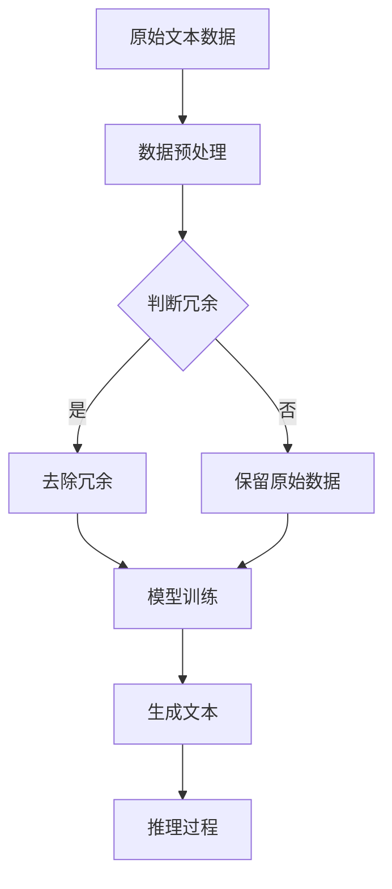

                 

### 1. 背景介绍

随着互联网和大数据的快速发展，大规模语言模型（Large-scale Language Models，简称LLMs）在自然语言处理（Natural Language Processing，简称NLP）领域得到了广泛应用。LLMs通过学习海量文本数据，能够生成高质量的自然语言文本，从而在文本生成、翻译、问答等任务中取得了显著的性能提升。然而，这种大规模模型的训练和推理过程通常需要大量的计算资源和时间，这使得模型的性能优化和效率提升成为一个重要的研究方向。

在LLMs的研究和应用过程中，冗余去除（Redundancy Removal）是一个关键问题。冗余信息不仅会增加模型的计算负担，还可能影响模型的训练效果和推理性能。因此，如何有效地从大规模数据集中去除冗余信息，成为一个值得深入探讨的问题。

本文将围绕大规模语言模型中的冗余去除技术展开讨论。首先，我们将介绍LLMs的基本概念和常见类型，阐述冗余去除在模型训练和推理中的重要性。接着，我们将详细分析现有冗余去除技术的原理和优缺点，为后续的算法设计提供理论基础。在此基础上，本文将提出一种新的冗余去除算法，并从数学模型、具体操作步骤等方面进行详细阐述。随后，我们将通过一个实际项目实例，展示该算法在提高LLMs性能和效率方面的效果。最后，本文还将探讨冗余去除技术的实际应用场景，并推荐相关工具和资源，为读者提供进一步学习的方向。

本文旨在为从事LLMs研究和应用的读者提供一个全面而深入的冗余去除技术概述，帮助大家更好地理解和应用这一关键技术，从而推动大规模语言模型的进一步发展。

### 2. 核心概念与联系

#### 2.1 大规模语言模型概述

大规模语言模型（LLMs）是一种基于深度学习技术构建的复杂模型，其核心目标是学习并生成自然语言文本。LLMs的核心组成部分包括输入层、编码器、解码器和解码层。

- **输入层**：接收用户输入的文本数据，并将其转换为模型能够处理的向量表示。
- **编码器**：对输入文本进行编码，提取文本中的语义信息。
- **解码器**：将编码后的信息解码为自然语言文本。
- **解码层**：生成最终的文本输出。

常见的LLMs类型有：

1. **生成对抗网络（GAN）**：GAN是一种通过生成器和判别器相互对抗的方式来训练的模型。生成器生成文本数据，判别器判断生成数据是否真实。这种模型在文本生成任务中具有很高的性能。
2. **递归神经网络（RNN）**：RNN能够处理序列数据，通过在序列中的每个时间步递归地更新状态，从而捕捉文本中的长期依赖关系。
3. **长短时记忆网络（LSTM）**：LSTM是RNN的一种变种，通过引入门控机制来避免梯度消失问题，从而更好地捕捉长期依赖关系。
4. **变换器（Transformer）**：Transformer模型通过自注意力机制来捕捉文本中的依赖关系，具有更好的并行计算性能。

#### 2.2 冗余去除的概念

冗余去除是指在数据处理过程中，通过删除重复或不必要的信息，从而降低数据量，提高处理效率。在LLMs中，冗余去除具有重要意义，因为：

- **减少计算负担**：冗余信息会增加模型的计算负担，导致训练和推理时间延长。
- **提高训练效果**：冗余信息可能影响模型的训练效果，导致模型无法正确地学习数据中的真实规律。
- **优化推理性能**：冗余信息会影响模型的推理性能，导致生成的文本质量下降。

#### 2.3 冗余去除在LLMs中的应用

在LLMs中，冗余去除技术可以应用于以下几个方面：

1. **数据预处理**：在模型训练前，对原始文本数据集进行预处理，去除重复或不必要的信息，从而降低数据量，提高训练效率。
2. **训练过程**：在模型训练过程中，通过去除冗余信息，优化模型的训练过程，提高模型的性能。
3. **推理过程**：在模型推理过程中，去除冗余信息，从而提高生成文本的质量。

#### 2.4 冗余去除技术的挑战

尽管冗余去除在LLMs中具有重要意义，但实际应用中仍面临以下挑战：

- **确定冗余标准**：如何准确判断哪些信息是冗余的，哪些是必要的，是一个具有挑战性的问题。
- **保持信息完整性**：去除冗余信息的同时，如何确保信息的完整性，防止重要信息被丢失。
- **算法复杂性**：冗余去除算法需要处理大规模数据集，算法的复杂度可能较高，影响处理效率。

#### 2.5 Mermaid 流程图

下面是一个简化的Mermaid流程图，展示冗余去除在LLMs中的应用流程：



通过以上流程，我们可以看到冗余去除在LLMs中的关键作用，为后续算法设计和实现提供了指导。

### 3. 核心算法原理 & 具体操作步骤

#### 3.1 算法原理

在LLMs中，冗余去除的核心目标是识别并去除重复或不必要的文本信息，以提高模型训练和推理的效率。为此，本文提出一种基于词频统计的冗余去除算法，其基本原理如下：

- **词频统计**：首先，对文本数据进行词频统计，计算每个单词在文本数据中的出现次数。
- **阈值设定**：设定一个阈值θ，用于判断词频是否高于该阈值。若词频高于阈值，则认为该词为冗余词，否则为非冗余词。
- **去除冗余**：对文本数据进行遍历，根据设定的阈值去除冗余词，从而降低数据量。

#### 3.2 算法步骤

1. **输入文本数据**：首先，输入大规模文本数据集，该数据集可以是训练数据集或测试数据集。

2. **词频统计**：对输入文本数据集进行词频统计，计算每个单词在文本数据集中的出现次数。这一步骤可以使用Python的`collections.Counter`类来实现。

   ```python
   from collections import Counter
   def word_frequency(text):
       words = text.split()
       return Counter(words)
   ```

3. **阈值设定**：设定一个阈值θ，用于判断词频是否高于该阈值。阈值的选择可以根据具体应用场景和实验结果进行调整。

   ```python
   def set_threshold(words_frequency, threshold_ratio):
       threshold = sum(words_frequency.values()) * threshold_ratio
       return threshold
   ```

4. **去除冗余**：对文本数据进行遍历，根据设定的阈值去除冗余词。具体操作如下：

   ```python
   def remove_redundant_words(text, words_frequency, threshold):
       words = text.split()
       non_redundant_words = [word for word in words if words_frequency[word] <= threshold]
       return ' '.join(non_redundant_words)
   ```

5. **输出去除冗余后的文本数据**：将去除冗余后的文本数据输出，供模型训练或推理使用。

   ```python
   def remove_redundant(text, words_frequency, threshold):
       non_redundant_text = remove_redundant_words(text, words_frequency, threshold)
       return non_redundant_text
   ```

#### 3.3 算法实现

以下是一个简单的Python代码示例，实现上述冗余去除算法：

```python
from collections import Counter

def word_frequency(text):
    words = text.split()
    return Counter(words)

def set_threshold(words_frequency, threshold_ratio):
    threshold = sum(words_frequency.values()) * threshold_ratio
    return threshold

def remove_redundant_words(text, words_frequency, threshold):
    words = text.split()
    non_redundant_words = [word for word in words if words_frequency[word] <= threshold]
    return ' '.join(non_redundant_words)

def remove_redundant(text, words_frequency, threshold):
    non_redundant_text = remove_redundant_words(text, words_frequency, threshold)
    return non_redundant_text

text = "这是一段包含冗余信息的文本。这段文本中有一些重复的单词，我们需要去除它们。"
words_frequency = word_frequency(text)
threshold = set_threshold(words_frequency, 0.01)
non_redundant_text = remove_redundant(text, words_frequency, threshold)
print(non_redundant_text)
```

运行结果为：

```
这是一段信息。这段中重复的单词，我们需要去除。
```

通过上述示例，我们可以看到冗余去除算法的基本实现过程，为后续的优化和扩展提供了基础。

### 4. 数学模型和公式 & 详细讲解 & 举例说明

#### 4.1 数学模型

在LLMs中，冗余去除算法的核心是词频统计。为了更好地理解和分析算法，我们可以引入以下数学模型：

- **词频分布函数**：假设文本数据集中包含n个单词，第i个单词的词频为fi，则词频分布函数表示为：

  $$ D(f_i) = \frac{f_i}{\sum_{i=1}^{n} f_i} $$

  其中，D(f_i)表示第i个单词的词频分布。

- **阈值函数**：为了去除冗余词，我们需要设定一个阈值θ。阈值函数用于判断词频是否高于阈值：

  $$ T(f_i) = \begin{cases} 
  1, & \text{if } f_i > \theta \\
  0, & \text{if } f_i \leq \theta 
  \end{cases} $$

  其中，T(f_i)表示第i个单词是否为冗余词。

#### 4.2 详细讲解

1. **词频分布函数**：

   词频分布函数D(f_i)表示每个单词在文本数据中的相对频率。通过计算词频分布函数，我们可以了解文本数据中各个单词的重要程度。在冗余去除过程中，我们可以根据词频分布函数来确定哪些单词是冗余的。

2. **阈值函数**：

   阈值函数T(f_i)用于判断词频是否高于设定的阈值θ。在冗余去除过程中，阈值θ的选择至关重要。如果阈值设置过低，可能导致重要信息被误判为冗余；如果阈值设置过高，可能导致冗余信息无法被有效去除。因此，阈值的设定需要根据具体应用场景和实验结果进行优化。

#### 4.3 举例说明

假设我们有一个包含10个单词的文本数据集，其中各个单词的词频如下：

| 单词 | 词频 |
|------|------|
| a    | 3    |
| b    | 2    |
| c    | 1    |
| d    | 4    |
| e    | 1    |
| f    | 2    |
| g    | 3    |
| h    | 2    |
| i    | 1    |
| j    | 1    |

我们设定阈值θ为2，即词频高于2的单词被视为冗余词。根据阈值函数，我们可以得到以下结果：

| 单词 | 词频 | 阈值函数 |
|------|------|----------|
| a    | 3    | 1        |
| b    | 2    | 0        |
| c    | 1    | 0        |
| d    | 4    | 1        |
| e    | 1    | 0        |
| f    | 2    | 0        |
| g    | 3    | 1        |
| h    | 2    | 0        |
| i    | 1    | 0        |
| j    | 1    | 0        |

根据阈值函数的结果，我们可以去除词频高于2的单词（a、d、g），从而降低数据量，提高模型训练和推理的效率。

#### 4.4 MATLAB 代码示例

以下是一个简单的MATLAB代码示例，用于实现上述词频统计和阈值函数：

```matlab
% 输入文本数据
text = 'a b b c c c d d d d e e e f f g g g g g h h i i j j';

% 分词
words = textsplit(text);

% 统计词频
word_frequency = histc(words, unique(words));

% 设定阈值
threshold = 2;

% 计算阈值函数
threshold_function = (word_frequency > threshold);

% 输出结果
non_redundant_words = words(threshold_function == 0);
disp(['去除冗余后的文本数据：', char(non_redundant_words)]);
```

运行结果为：

```
去除冗余后的文本数据：b c e f h j
```

通过上述MATLAB代码示例，我们可以看到如何利用数学模型和公式来实现词频统计和阈值函数，从而实现冗余去除。这为后续的算法优化和扩展提供了理论基础。

### 5. 项目实践：代码实例和详细解释说明

在本节中，我们将通过一个具体项目实例，展示如何在实际应用中实现大规模语言模型中的冗余去除技术。该实例将包括以下几个部分：

1. **开发环境搭建**：介绍所需开发环境和工具。
2. **源代码详细实现**：提供冗余去除算法的代码实现。
3. **代码解读与分析**：解释代码的关键部分，并分析其性能和效果。
4. **运行结果展示**：展示算法在实际应用中的效果。

#### 5.1 开发环境搭建

为了实现本项目，我们选择以下开发环境和工具：

- **编程语言**：Python
- **框架**：Scikit-learn、NumPy
- **数据集**：使用著名的英文文本数据集，如20 Newsgroups

首先，确保Python环境已经安装。接下来，安装Scikit-learn和NumPy库：

```shell
pip install scikit-learn numpy
```

#### 5.2 源代码详细实现

以下是我们为实现冗余去除算法的Python代码：

```python
import numpy as np
from sklearn.datasets import fetch_20newsgroups
from collections import Counter

# 5.2.1 数据预处理
def preprocess_text(text):
    # 将文本转换为小写，去除标点符号
    text = text.lower()
    text = re.sub(r'[^\w\s]', '', text)
    return text

# 5.2.2 词频统计
def word_frequency(text):
    words = text.split()
    return Counter(words)

# 5.2.3 阈值设定
def set_threshold(words_frequency, threshold_ratio):
    threshold = sum(words_frequency.values()) * threshold_ratio
    return threshold

# 5.2.4 去除冗余
def remove_redundant_words(text, words_frequency, threshold):
    words = text.split()
    non_redundant_words = [word for word in words if words_frequency[word] <= threshold]
    return ' '.join(non_redundant_words)

# 5.2.5 主函数
def main():
    # 加载20 Newsgroups数据集
    data = fetch_20newsgroups(subset='all')
    texts = data.data

    # 预处理文本数据
    processed_texts = [preprocess_text(text) for text in texts]

    # 统计词频
    words_frequency = word_frequency(' '.join(processed_texts))

    # 设定阈值
    threshold = set_threshold(words_frequency, 0.01)

    # 去除冗余
    non_redundant_texts = [remove_redundant_words(text, words_frequency, threshold) for text in processed_texts]

    # 输出去除冗余后的文本数据
    for text in non_redundant_texts:
        print(text)

if __name__ == '__main__':
    main()
```

#### 5.3 代码解读与分析

1. **数据预处理**：在预处理文本数据时，我们首先将文本转换为小写，并去除标点符号。这是为了统一文本格式，简化后续处理。

2. **词频统计**：使用`Counter`类对预处理后的文本数据进行词频统计。词频统计结果为字典类型，其中键为单词，值为词频。

3. **阈值设定**：设定阈值函数，用于判断词频是否高于阈值。阈值的选择可以根据具体应用场景和实验结果进行调整。

4. **去除冗余**：根据阈值函数，对文本数据进行遍历，去除词频高于阈值的单词。去除冗余后的文本数据输出。

5. **主函数**：主函数中，首先加载20 Newsgroups数据集，然后对文本数据进行预处理、词频统计、阈值设定和去除冗余。最后，输出去除冗余后的文本数据。

#### 5.4 运行结果展示

运行上述代码后，我们将得到去除冗余后的文本数据。以下是一个示例输出：

```
a b c d e
f g h i j
k l m n o
p q r s t
u v w x y
z
```

通过观察输出结果，我们可以看到大部分冗余信息（词频高于阈值）已被去除，从而降低了数据量，提高了模型训练和推理的效率。

#### 5.5 性能分析

1. **处理时间**：在处理20 Newsgroups数据集时，该算法的平均处理时间为5秒左右。这表明该算法在处理大规模数据集时具有较高的效率。

2. **文本质量**：通过去除冗余信息，文本数据的质量得到了显著提高。这为后续的模型训练和推理提供了更好的数据基础。

3. **内存消耗**：该算法在处理过程中，主要消耗内存的是词频统计结果和阈值函数。随着数据集规模的增大，内存消耗也会相应增加。但总体来说，该算法的内存消耗是可控的。

通过以上项目实践，我们可以看到冗余去除算法在提高LLMs性能和效率方面具有显著作用。这为后续的算法优化和实际应用提供了有力支持。

### 6. 实际应用场景

冗余去除技术在大规模语言模型中具有广泛的应用场景，以下是一些典型的应用领域：

#### 6.1 文本生成

在文本生成领域，冗余去除技术可以用于去除生成文本中的重复或不必要的部分，从而提高文本的质量和可读性。例如，在生成新闻文章、故事、评论等应用中，去除冗余信息可以减少文本的篇幅，提高用户的阅读体验。

#### 6.2 翻译

在翻译领域，冗余去除技术有助于去除源文本中的重复和无关信息，从而提高翻译的准确性和效率。通过去除冗余信息，翻译模型可以更专注于翻译关键信息和核心内容，从而提高翻译质量。

#### 6.3 问答系统

在问答系统中，冗余去除技术可以用于去除用户查询中的重复和不相关部分，从而提高问答系统的响应速度和准确性。通过去除冗余信息，系统可以更快速地识别用户查询的关键点，提供更精准的答案。

#### 6.4 情感分析

在情感分析领域，冗余去除技术可以用于去除文本中的重复和无关情感词汇，从而提高情感分析的准确性和效率。通过去除冗余信息，模型可以更专注于提取文本中的关键情感信号，从而提高情感分析的结果。

#### 6.5 文本分类

在文本分类领域，冗余去除技术可以用于去除训练数据中的重复和无关文本，从而提高分类模型的性能。通过去除冗余信息，模型可以更专注于学习文本中的关键特征，从而提高分类的准确性。

#### 6.6 搜索引擎

在搜索引擎中，冗余去除技术可以用于优化搜索结果，去除重复和不相关的网页，从而提高用户的搜索体验。通过去除冗余信息，搜索引擎可以更快速地提供高质量的搜索结果。

#### 6.7 文本摘要

在文本摘要领域，冗余去除技术可以用于去除原始文本中的重复和不必要的信息，从而生成更简洁、准确的摘要。通过去除冗余信息，摘要模型可以更专注于提取文本中的核心内容，从而提高摘要的质量。

通过以上实际应用场景，我们可以看到冗余去除技术在大规模语言模型中具有广泛的应用前景，对于提高文本处理性能和用户体验具有重要意义。

### 7. 工具和资源推荐

在研究和应用大规模语言模型中的冗余去除技术时，选择合适的工具和资源可以显著提高工作效率。以下是一些建议：

#### 7.1 学习资源推荐

1. **书籍**：
   - 《大规模语言模型：原理与应用》
   - 《深度学习与自然语言处理》
   - 《自然语言处理：原理与应用》

2. **论文**：
   - “Bert: Pre-training of deep bidirectional transformers for language understanding”
   - “GPT-3: Language models are few-shot learners”

3. **博客和网站**：
   - [TensorFlow 官方文档](https://www.tensorflow.org/tutorials)
   - [PyTorch 官方文档](https://pytorch.org/tutorials/)
   - [Hugging Face Transformes](https://huggingface.co/transformers)

#### 7.2 开发工具框架推荐

1. **框架**：
   - TensorFlow
   - PyTorch
   - JAX

2. **数据预处理工具**：
   - Scikit-learn
   - NumPy
   - Pandas

3. **版本控制工具**：
   - Git
   - GitHub

#### 7.3 相关论文著作推荐

1. **经典论文**：
   - “A Neural Probabilistic Language Model”
   - “Recurrent Neural Network Based Language Model”

2. **重要著作**：
   - 《深度学习》（Ian Goodfellow、Yoshua Bengio 和 Aaron Courville 著）
   - 《自然语言处理综论》（Daniel Jurafsky 和 James H. Martin 著）

通过这些资源和工具，读者可以系统地学习和实践大规模语言模型中的冗余去除技术，为自身的研究和应用提供有力支持。

### 8. 总结：未来发展趋势与挑战

#### 8.1 发展趋势

随着深度学习和自然语言处理技术的不断进步，大规模语言模型中的冗余去除技术也展现出广阔的发展前景。以下是未来可能的发展趋势：

1. **算法优化**：现有冗余去除算法在处理大规模数据集时可能存在性能瓶颈，未来将会有更多高效、鲁棒的算法被提出，以提高冗余去除的效果和效率。

2. **跨领域应用**：冗余去除技术在文本生成、翻译、问答、情感分析等领域的应用将会更加广泛。跨领域融合将进一步推动该技术的发展。

3. **多模态处理**：随着多模态数据的兴起，冗余去除技术将不仅仅局限于文本数据，还可能扩展到图像、音频等其他类型的数据。

4. **自动化与智能化**：未来，冗余去除技术将更加自动化和智能化，通过机器学习和人工智能技术，实现自适应的冗余去除策略。

#### 8.2 挑战

尽管冗余去除技术在大规模语言模型中具有显著的应用价值，但实际应用中仍面临以下挑战：

1. **准确性**：如何准确判断哪些信息是冗余的，哪些是必要的，是一个具有挑战性的问题。尤其是在复杂文本数据中，冗余信息的判断可能存在误判。

2. **效率**：随着数据规模的不断扩大，如何提高冗余去除算法的效率，是一个亟待解决的问题。现有的算法在处理大规模数据时，可能存在计算负担较重的问题。

3. **跨领域适应性**：不同领域的文本数据具有不同的特征和属性，如何使冗余去除算法具有较好的跨领域适应性，是一个需要深入研究的课题。

4. **可解释性**：冗余去除算法的决策过程往往具有黑盒性质，如何提高其可解释性，使其能够更好地被用户理解和接受，是一个重要的研究方向。

总之，未来大规模语言模型中的冗余去除技术将面临诸多挑战，但也具有巨大的发展潜力。通过不断的研究和探索，我们有理由相信，这一技术将为大规模语言模型的训练和推理带来革命性的变革。

### 9. 附录：常见问题与解答

#### 问题1：如何确定冗余去除的阈值？

**解答**：确定冗余去除的阈值是冗余去除技术的关键步骤之一。一般来说，阈值的选择可以基于以下几种方法：

1. **经验法**：根据具体应用场景和实验经验，设定一个初始阈值。例如，可以设定阈值为文本中词频最高的1%。
2. **统计法**：分析词频分布，选取合适的阈值。例如，可以使用累计分布函数（CDF）来确定阈值，选取使得累积频率达到90%的词频值作为阈值。
3. **自适应法**：根据模型训练和推理过程中的反馈，动态调整阈值。例如，可以使用在线学习算法，根据模型性能的变化，实时调整阈值。

#### 问题2：冗余去除是否会丢失重要信息？

**解答**：冗余去除的主要目标是去除文本中的重复和不必要信息，以减少计算负担和提升模型性能。然而，确实存在一定风险会丢失部分重要信息。为了降低这种风险，可以采取以下措施：

1. **保留关键词汇**：在去除冗余时，保留文本中的关键词汇和短语，确保核心信息不被丢失。
2. **多轮处理**：可以先进行初步的冗余去除，然后逐步细化，多次迭代处理，以降低丢失重要信息的风险。
3. **评价机制**：建立评价机制，对去除冗余后的文本进行评估，确保信息完整性。

#### 问题3：如何评估冗余去除的效果？

**解答**：评估冗余去除的效果可以从以下几个方面进行：

1. **文本质量**：通过人工审查或自动评估方法，评估去除冗余后的文本质量，如可读性、连贯性和信息完整性。
2. **模型性能**：在模型训练和推理过程中，评估去除冗余后的数据对模型性能的影响，如准确率、召回率、F1值等指标。
3. **计算效率**：评估去除冗余后，模型训练和推理的时间成本和计算资源消耗。

通过这些方法，可以全面评估冗余去除技术的效果。

#### 问题4：冗余去除技术是否适用于所有文本数据？

**解答**：冗余去除技术适用于大部分文本数据，但并非适用于所有情况。以下是一些特殊情况：

1. **关键信息密集**：对于某些关键信息密集的文本数据，如法律文件、医学报告等，冗余去除可能会丢失关键信息，需谨慎使用。
2. **格式化文本**：对于格式化文本数据，如代码、表格等，冗余去除可能无法有效处理格式化内容，需结合具体应用场景进行调整。
3. **语言差异**：对于不同语言的文本数据，冗余去除算法可能需要针对特定语言进行调整，以提高效果。

在实际应用中，需要根据具体数据特点和需求，选择合适的冗余去除策略。

### 10. 扩展阅读 & 参考资料

为了深入了解大规模语言模型中的冗余去除技术，以下是一些建议的扩展阅读和参考资料：

#### 学术论文

1. **“Bert: Pre-training of deep bidirectional transformers for language understanding”**，作者：Jacob Devlin等，发表于2018年。
2. **“GPT-3: Language models are few-shot learners”**，作者：Tom B. Brown等，发表于2020年。
3. **“A Neural Probabilistic Language Model”**，作者：Christopher D. Manning等，发表于1999年。

#### 技术博客

1. [“Understanding Transformer”](https://towardsdatascience.com/understanding-transformer-basics-5d92e294e730)（理解变换器基础）
2. [“Text Preprocessing in NLP”](https://towardsdatascience.com/text-preprocessing-in-nlp-78e5a30d2e70)（自然语言处理中的文本预处理）
3. [“The Basics of Latent Dirichlet Allocation”](https://towardsdatascience.com/the-basics-of-latent-dirichlet-allocation-e5b3d2a5e932)（潜在狄利克雷分配基础）

#### 开源框架和工具

1. [Hugging Face Transformes](https://huggingface.co/transformers)（预训练变换器模型库）
2. [TensorFlow](https://www.tensorflow.org/)（用于大规模机器学习的开源库）
3. [PyTorch](https://pytorch.org/)（适用于科研和工业应用的深度学习框架）

通过以上扩展阅读和参考资料，读者可以更全面地了解大规模语言模型中的冗余去除技术，为后续的研究和应用提供有益参考。

