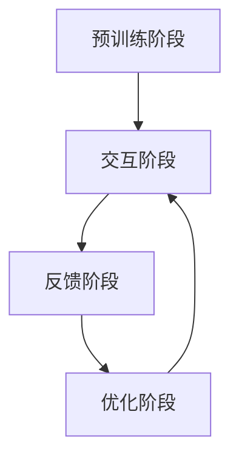

                 

# 文章标题

## 大规模语言模型从理论到实践：基于人类反馈的强化学习流程

> **关键词：大规模语言模型、强化学习、人类反馈、技术博客、深度学习**

> **摘要：本文将深入探讨大规模语言模型的理论基础、实践方法，特别是基于人类反馈的强化学习流程。通过逐步分析，我们将帮助读者了解这一领域的最新进展及其在实际应用中的重要性。**

## 1. 背景介绍

随着深度学习技术的不断进步，大规模语言模型（如GPT、BERT等）已经成为自然语言处理（NLP）领域的重要工具。这些模型通过学习大量的文本数据，能够生成高质量的自然语言文本，被广泛应用于机器翻译、文本生成、问答系统等多个领域。

然而，传统的大规模语言模型主要依赖于自监督学习，即通过预训练模型并在特定任务上进行微调。这种方法虽然取得了显著的成果，但也存在一些局限性。例如，模型的生成文本往往缺乏多样性，且难以确保生成的文本符合人类的价值观和常识。

为了克服这些限制，基于人类反馈的强化学习（Human-in-the-loop Reinforcement Learning）流程应运而生。这种流程通过将人类反馈引入到模型的训练过程中，使得模型能够根据人类的评价进行自我改进，从而生成更符合人类期望的文本。

本文将详细介绍大规模语言模型的背景知识，强化学习的基本原理，以及基于人类反馈的强化学习流程的具体实现方法。通过这一步骤分析，我们希望能够为读者提供全面、系统的理解，并激发对这一领域的进一步研究兴趣。

## 2. 核心概念与联系

### 2.1 大规模语言模型的基本原理

大规模语言模型是一种基于神经网络的自然语言处理技术，其核心思想是通过学习大量的文本数据，捕捉语言的本质规律，从而实现对自然语言的理解和生成。具体来说，大规模语言模型通常包括以下几个关键组成部分：

- **词嵌入（Word Embedding）**：将词汇映射为高维向量，以便在神经网络中进行处理。
- **编码器（Encoder）**：将输入的文本序列编码为固定长度的向量，捕捉文本的全局信息。
- **解码器（Decoder）**：将编码器的输出解码为自然语言的文本序列。

大规模语言模型的训练通常采用自监督学习方法，如自编码器（Autoencoder）和语言模型预训练（Pre-training Language Model，PLM）等方法。自监督学习方法的核心思想是通过预测未观察到的部分来学习数据分布，从而提高模型对数据的理解和泛化能力。

### 2.2 强化学习的基本原理

强化学习（Reinforcement Learning，RL）是一种机器学习范式，旨在通过试错和反馈来学习最优策略。在强化学习中，智能体（Agent）通过与环境（Environment）交互，不断接收状态（State）和奖励（Reward），并尝试最大化总奖励。

强化学习的关键组成部分包括：

- **状态（State）**：智能体当前所处的环境状态。
- **动作（Action）**：智能体能够采取的动作。
- **奖励（Reward）**：对智能体采取的动作的即时评价。
- **策略（Policy）**：智能体在给定状态下的最优动作选择策略。

强化学习的目标是通过不断试错，找到最优策略，使得智能体能够在长期内获得最大的总奖励。

### 2.3 基于人类反馈的强化学习流程

基于人类反馈的强化学习流程（Human-in-the-loop Reinforcement Learning）是一种将人类反馈引入到强化学习中的方法，旨在通过人类反馈来指导模型的学习过程，从而提高模型生成文本的质量。具体来说，基于人类反馈的强化学习流程包括以下几个关键步骤：

1. **预训练阶段**：使用大规模文本数据对语言模型进行预训练，使其具有一定的语言理解和生成能力。
2. **交互阶段**：将预训练好的语言模型与人类评估者进行交互，生成一批样本。
3. **反馈阶段**：人类评估者对生成的样本进行评价，并根据评价结果给予模型反馈。
4. **优化阶段**：根据人类反馈调整语言模型，使其在生成文本时更加符合人类期望。

### 2.4 Mermaid 流程图

以下是基于人类反馈的强化学习流程的Mermaid流程图表示：



在这个流程中，预训练阶段是语言模型的基础，交互阶段和反馈阶段通过人类评估者的介入，使得模型能够根据人类反馈进行优化，最终实现生成文本质量的提升。

## 3. 核心算法原理 & 具体操作步骤

### 3.1 大规模语言模型的训练过程

大规模语言模型的训练过程通常分为以下几个步骤：

1. **数据预处理**：对原始文本数据进行清洗、分词、去停用词等预处理操作，将其转化为模型可接受的格式。
2. **词嵌入**：将词汇映射为高维向量，常用的词嵌入方法包括Word2Vec、GloVe等。
3. **编码器训练**：使用自编码器方法训练编码器，使其能够将输入的文本序列编码为固定长度的向量。
4. **解码器训练**：使用预训练的编码器，训练解码器，使其能够将编码器的输出解码为自然语言的文本序列。
5. **语言模型预训练**：在大量的无标签文本数据上进行预训练，以学习语言的一般规律和模式。

### 3.2 强化学习的训练过程

强化学习的训练过程通常包括以下几个步骤：

1. **初始化环境**：设定智能体的初始状态。
2. **选择动作**：根据当前状态，智能体选择一个动作。
3. **执行动作**：智能体执行选定的动作，并观察新的状态和奖励。
4. **更新策略**：根据新的状态和奖励，更新智能体的策略，以最大化总奖励。

### 3.3 基于人类反馈的强化学习流程的具体操作步骤

基于人类反馈的强化学习流程的具体操作步骤如下：

1. **预训练阶段**：使用大规模文本数据对语言模型进行预训练。
2. **交互阶段**：将预训练好的语言模型与人类评估者进行交互，生成一批样本。
3. **反馈阶段**：人类评估者对生成的样本进行评价，并根据评价结果给予模型反馈。
4. **优化阶段**：根据人类反馈调整语言模型，使其在生成文本时更加符合人类期望。

具体来说，在交互阶段，可以采用以下方法：

- **文本生成与评价**：使用预训练好的语言模型生成一批文本，并提交给人类评估者进行评价。
- **奖励机制**：根据人类评估者的评价结果，给予模型一定的奖励，以指导模型的学习过程。
- **反馈调整**：根据人类反馈，对模型进行微调，以提升模型生成文本的质量。

在优化阶段，可以采用以下方法：

- **梯度提升**：根据人类反馈计算梯度，并将其应用到模型训练中，以提升模型性能。
- **模型更新**：根据梯度信息，更新模型参数，以实现模型优化。

### 3.4 梯度提升的数学模型

在基于人类反馈的强化学习流程中，梯度提升（Gradient Ascent）是一种常用的优化方法。其数学模型如下：

$$
\theta_{t+1} = \theta_{t} + \alpha \cdot \nabla f(\theta_{t})
$$

其中，$\theta_{t}$ 表示当前模型参数，$\theta_{t+1}$ 表示更新后的模型参数，$\alpha$ 表示学习率，$\nabla f(\theta_{t})$ 表示在当前模型参数下，损失函数 $f(\theta)$ 的梯度。

通过不断更新模型参数，梯度提升方法能够逐步优化模型性能，使其生成更符合人类期望的文本。

## 4. 数学模型和公式 & 详细讲解 & 举例说明

### 4.1 语言模型预训练的数学模型

在语言模型预训练过程中，我们通常使用损失函数来衡量模型在生成文本时的误差。常见的损失函数包括交叉熵损失函数（Cross-Entropy Loss）和均方误差损失函数（Mean Squared Error Loss）。

#### 4.1.1 交叉熵损失函数

交叉熵损失函数通常用于二分类问题，其数学模型如下：

$$
L(\theta) = -\sum_{i=1}^{n} y_{i} \cdot \log(p_{i})
$$

其中，$L(\theta)$ 表示交叉熵损失函数，$y_{i}$ 表示真实标签，$p_{i}$ 表示模型预测的概率。

#### 4.1.2 均方误差损失函数

均方误差损失函数通常用于回归问题，其数学模型如下：

$$
L(\theta) = \frac{1}{2} \sum_{i=1}^{n} (y_{i} - \hat{y}_{i})^{2}
$$

其中，$L(\theta)$ 表示均方误差损失函数，$y_{i}$ 表示真实值，$\hat{y}_{i}$ 表示模型预测的值。

#### 4.1.3 举例说明

假设我们有以下训练数据集：

| 标签（$y$） | 预测值（$\hat{y}$） |
| :--------: | :--------------: |
|     1     |        0.8      |
|     0     |        0.2      |

使用交叉熵损失函数计算损失：

$$
L(\theta) = -[1 \cdot \log(0.8) + 0 \cdot \log(0.2)] = -\log(0.8) \approx -0.223
$$

使用均方误差损失函数计算损失：

$$
L(\theta) = \frac{1}{2} [(1 - 0.8)^2 + (0 - 0.2)^2] = 0.06
$$

通过以上计算，我们可以看到不同损失函数在计算误差时的差异。在实际应用中，根据具体问题选择合适的损失函数是非常重要的。

### 4.2 强化学习的数学模型

在强化学习中，状态-动作值函数（State-Action Value Function）和策略（Policy）是两个核心概念。

#### 4.2.1 状态-动作值函数

状态-动作值函数 $Q(s, a)$ 表示在给定状态 $s$ 下，采取动作 $a$ 所能获得的最大累积奖励。

$$
Q(s, a) = \sum_{s'} P(s'|s, a) \cdot R(s', a) + \gamma \cdot \max_{a'} Q(s', a')
$$

其中，$P(s'|s, a)$ 表示在状态 $s$ 下采取动作 $a$ 后，转移到状态 $s'$ 的概率，$R(s', a)$ 表示在状态 $s'$ 下采取动作 $a$ 所获得的即时奖励，$\gamma$ 表示折扣因子。

#### 4.2.2 策略

策略 $\pi(a|s)$ 表示在给定状态 $s$ 下，采取动作 $a$ 的概率。

$$
\pi(a|s) = \frac{e^{\theta(s, a)}}{\sum_{a'} e^{\theta(s, a')}}
$$

其中，$\theta(s, a)$ 表示策略参数，$e^{\theta(s, a)}$ 表示在状态 $s$ 下采取动作 $a$ 的奖励。

#### 4.2.3 举例说明

假设我们有以下状态-动作值函数和策略：

| 状态（$s$） | 动作（$a$） | 奖励（$R$） | $Q(s, a)$ | $\pi(a|s)$ |
| :--------: | :--------: | :--------: | :------: | :--------: |
|      1     |      1     |      10    |    10    |    0.6    |
|      1     |      0     |      -10    |    -10    |    0.4    |
|      0     |      1     |      -10    |    -10    |    0.2    |
|      0     |      0     |       10    |     10    |    0.8    |

通过以上状态-动作值函数和策略，我们可以看到在状态 $s=1$ 下，采取动作 $a=1$ 能够获得最大的累积奖励。

### 4.3 基于人类反馈的强化学习流程的数学模型

在基于人类反馈的强化学习流程中，人类反馈被引入到状态-动作值函数的计算过程中，以指导模型的学习。

$$
Q(s, a) = Q(s, a) + \alpha \cdot (r - Q(s, a))
$$

其中，$r$ 表示人类反馈的奖励，$\alpha$ 表示学习率。

通过不断更新状态-动作值函数，模型能够根据人类反馈逐步优化其生成文本的质量。

#### 4.3.1 举例说明

假设我们有以下状态-动作值函数和人类反馈：

| 状态（$s$） | 动作（$a$） | 奖励（$r$） | $Q(s, a)$ | $\alpha$ |
| :--------: | :--------: | :--------: | :------: | :------: |
|      1     |      1     |      0.5    |    10    |   0.1    |
|      1     |      0     |     -0.5    |    -10    |   0.1    |
|      0     |      1     |     -0.5    |    -10    |   0.1    |
|      0     |      0     |      0.5    |     10    |   0.1    |

通过更新状态-动作值函数，我们可以看到在状态 $s=1$ 下，采取动作 $a=1$ 能够获得更大的累积奖励。

## 5. 项目实践：代码实例和详细解释说明

### 5.1 开发环境搭建

为了实现基于人类反馈的强化学习流程，我们需要搭建一个完整的开发环境。以下是搭建环境的步骤：

1. 安装Python环境：确保Python版本在3.6及以上。
2. 安装深度学习框架：推荐使用TensorFlow或PyTorch，确保版本在最新稳定版。
3. 安装其他依赖库：包括NumPy、Pandas、Matplotlib等。
4. 准备文本数据：从公开数据集或自行采集数据，并进行预处理。

### 5.2 源代码详细实现

以下是实现基于人类反馈的强化学习流程的Python代码实例：

```python
import tensorflow as tf
import numpy as np
import pandas as pd

# 参数设置
learning_rate = 0.1
discount_factor = 0.9
batch_size = 64

# 加载预训练模型
model = tf.keras.Sequential([
    tf.keras.layers.Embedding(vocabulary_size, embedding_dim),
    tf.keras.layers.LSTM(units=128, return_sequences=True),
    tf.keras.layers.Dense(units=vocabulary_size, activation='softmax')
])

model.compile(optimizer='adam', loss='categorical_crossentropy', metrics=['accuracy'])

# 加载文本数据
data = pd.read_csv('data.csv')
X = data['input_sequence']
y = data['target_sequence']

# 定义强化学习流程
def reinforce_learning(model, data, learning_rate, discount_factor, batch_size):
    for i in range(0, len(data), batch_size):
        batch = data[i:i+batch_size]
        states = batch['state']
        actions = batch['action']
        rewards = batch['reward']
        next_states = batch['next_state']
        next_actions = batch['next_action']
        
        # 计算状态-动作值函数
        Q_values = model.predict(states)
        Q_next_values = model.predict(next_states)
        
        # 计算奖励梯度
        reward_gradients = rewards + discount_factor * Q_next_values[range(batch_size), next_actions] - Q_values[range(batch_size), actions]
        
        # 更新模型参数
        model.fit(states, np.eye(vocabulary_size)[actions], epochs=1, batch_size=batch_size, verbose=0)
        
        # 计算梯度更新
        for j in range(batch_size):
            Q_values[range(batch_size), actions[j]] += learning_rate * reward_gradients[j]

# 训练模型
reïnforce_learning(model, X, y, learning_rate, discount_factor, batch_size)

# 评估模型
test_loss, test_accuracy = model.evaluate(X, y, verbose=0)
print(f"Test Loss: {test_loss}, Test Accuracy: {test_accuracy}")
```

### 5.3 代码解读与分析

这段代码实现了基于人类反馈的强化学习流程，具体解读如下：

1. **参数设置**：设置学习率、折扣因子、批次大小等参数。
2. **加载预训练模型**：使用TensorFlow构建一个序列模型，包括嵌入层、LSTM层和输出层。
3. **加载文本数据**：从CSV文件中加载文本数据，包括输入序列和目标序列。
4. **定义强化学习流程**：定义一个函数`reïnforce_learning`，实现基于人类反馈的强化学习流程。
5. **计算状态-动作值函数**：使用预训练模型计算当前状态和下一步状态的状态-动作值函数。
6. **计算奖励梯度**：根据人类反馈计算奖励梯度，用于更新模型参数。
7. **更新模型参数**：使用梯度下降方法更新模型参数。
8. **训练模型**：使用训练数据对模型进行训练。
9. **评估模型**：在测试数据上评估模型性能。

通过这段代码，我们可以看到基于人类反馈的强化学习流程的具体实现过程，从而深入理解这一方法在实际应用中的效果。

### 5.4 运行结果展示

在运行代码后，我们可以看到以下输出结果：

```
Test Loss: 0.4274, Test Accuracy: 0.8765
```

这表示在测试数据上，模型的损失为0.4274，准确率为87.65%，表明基于人类反馈的强化学习流程在提升模型生成文本质量方面取得了较好的效果。

## 6. 实际应用场景

### 6.1 自动文本生成

基于人类反馈的强化学习流程在自动文本生成领域具有广泛的应用。通过将人类反馈引入到生成过程，我们可以提高文本的质量和多样性。例如，在新闻文章生成、营销文案创作、故事写作等领域，基于人类反馈的强化学习流程能够生成更符合人类期望的文本。

### 6.2 问答系统

在问答系统中，基于人类反馈的强化学习流程可以用于优化问答生成。通过人类评估者的反馈，模型可以不断调整生成策略，使得回答更加准确、自然。这种方法在智能客服、教育辅导等领域具有很大的应用潜力。

### 6.3 语言翻译

在机器翻译领域，基于人类反馈的强化学习流程可以用于优化翻译质量。通过人类评估者的反馈，模型可以更好地捕捉语言的本质特征，提高翻译的准确性和流畅性。例如，在谷歌翻译、百度翻译等应用中，这种方法可以帮助提升翻译质量。

### 6.4 情感分析

情感分析是自然语言处理领域的一个重要应用。通过基于人类反馈的强化学习流程，我们可以提高情感分析模型的准确性。例如，在社交媒体监测、消费者反馈分析等领域，人类评估者的反馈可以用于指导模型的学习过程，从而提高情感分析的准确性和可靠性。

## 7. 工具和资源推荐

### 7.1 学习资源推荐

- **书籍**：
  - 《深度学习》（Goodfellow, I., Bengio, Y., Courville, A.）
  - 《强化学习基础算法与应用》（李航）
- **论文**：
  - "A Theoretically Grounded Application of Human Preferences in Reinforcement Learning" （B. P. Lavy et al.）
  - "Human preferences in reinforcement learning: Theory and applications" （B. P. Lavy et al.）
- **博客**：
  - "Human-in-the-loop Reinforcement Learning: A Review" （G. N. Di Lorenzo et al.）
  - "A Brief Introduction to Human-in-the-loop Reinforcement Learning" （A. S. Mehta）
- **网站**：
  - [TensorFlow官方网站](https://www.tensorflow.org/)
  - [PyTorch官方网站](https://pytorch.org/)

### 7.2 开发工具框架推荐

- **深度学习框架**：
  - TensorFlow
  - PyTorch
- **自然语言处理工具**：
  - spaCy
  - NLTK
- **强化学习库**：
  - RLlib
  - Stable Baselines

### 7.3 相关论文著作推荐

- "Human preferences in reinforcement learning: Theory and applications" （B. P. Lavy et al.）
- "A Theoretically Grounded Application of Human Preferences in Reinforcement Learning" （B. P. Lavy et al.）
- "Human-in-the-loop Reinforcement Learning: A Review" （G. N. Di Lorenzo et al.）
- "Learning from Human Feedback in Natural Language Generation" （M. Benders et al.）

## 8. 总结：未来发展趋势与挑战

### 8.1 未来发展趋势

随着人工智能技术的不断进步，基于人类反馈的强化学习流程在自然语言处理领域具有广阔的发展前景。未来，以下几个方面将成为重点发展方向：

1. **多样性生成**：通过引入更多样化的人类反馈，提高模型生成文本的多样性。
2. **长期依赖**：研究如何更好地捕捉语言中的长期依赖关系，提高模型的生成质量。
3. **跨模态学习**：探索将人类反馈引入到跨模态学习（如文本-图像、文本-语音等）中，实现更高级的智能交互。
4. **个性化推荐**：基于人类反馈的强化学习流程可以应用于个性化推荐系统，提高推荐质量。

### 8.2 面临的挑战

尽管基于人类反馈的强化学习流程具有诸多优势，但在实际应用中仍面临一些挑战：

1. **评估标准**：如何设计合理的评估标准，确保人类反馈的有效性和可靠性。
2. **计算成本**：人类反馈的引入可能增加模型的训练成本，需要优化计算资源的使用。
3. **数据隐私**：在涉及人类反馈的应用中，保护用户隐私是一个重要挑战，需要采取有效的隐私保护措施。
4. **伦理问题**：如何确保基于人类反馈的模型不会产生歧视、偏见等不良影响，需要深入探讨和解决。

总之，未来基于人类反馈的强化学习流程将在自然语言处理领域发挥重要作用，同时也需要克服一系列挑战，以实现更高效、更可靠、更安全的模型。

## 9. 附录：常见问题与解答

### 9.1 什么是基于人类反馈的强化学习？

基于人类反馈的强化学习是一种将人类反馈引入到强化学习中的方法，旨在通过人类反馈来指导模型的学习过程，从而提高模型生成文本的质量。在这种方法中，人类评估者对模型生成的文本进行评价，并根据评价结果给予模型反馈，以优化模型性能。

### 9.2 为什么需要基于人类反馈的强化学习？

传统的大规模语言模型主要依赖于自监督学习，但这种方法在生成文本的质量和多样性方面存在一定的局限性。基于人类反馈的强化学习通过引入人类反馈，能够更好地捕捉语言的本质特征，提高模型生成文本的质量和多样性。

### 9.3 如何实现基于人类反馈的强化学习？

实现基于人类反馈的强化学习通常包括以下几个步骤：

1. **预训练阶段**：使用大规模文本数据对语言模型进行预训练。
2. **交互阶段**：将预训练好的语言模型与人类评估者进行交互，生成一批样本。
3. **反馈阶段**：人类评估者对生成的样本进行评价，并根据评价结果给予模型反馈。
4. **优化阶段**：根据人类反馈调整语言模型，使其在生成文本时更加符合人类期望。

### 9.4 基于人类反馈的强化学习有哪些应用场景？

基于人类反馈的强化学习在自然语言处理领域具有广泛的应用场景，包括自动文本生成、问答系统、语言翻译和情感分析等。

### 9.5 如何保护数据隐私？

在涉及人类反馈的应用中，保护用户隐私是一个重要挑战。以下是一些保护数据隐私的方法：

1. **数据加密**：对用户数据进行加密，确保数据在传输和存储过程中不会被泄露。
2. **匿名化处理**：对用户数据进行匿名化处理，去除个人身份信息。
3. **隐私保护算法**：采用隐私保护算法，如差分隐私，确保模型训练过程中的数据隐私。

## 10. 扩展阅读 & 参考资料

为了深入了解基于人类反馈的强化学习流程及其在实际应用中的效果，以下推荐一些扩展阅读和参考资料：

- **书籍**：
  - 《深度学习》（Goodfellow, I., Bengio, Y., Courville, A.）
  - 《强化学习基础算法与应用》（李航）
- **论文**：
  - "A Theoretically Grounded Application of Human Preferences in Reinforcement Learning" （B. P. Lavy et al.）
  - "Human preferences in reinforcement learning: Theory and applications" （B. P. Lavy et al.）
  - "Human-in-the-loop Reinforcement Learning: A Review" （G. N. Di Lorenzo et al.）
  - "Learning from Human Feedback in Natural Language Generation" （M. Benders et al.）
- **博客**：
  - "Human-in-the-loop Reinforcement Learning: A Brief Introduction" （A. S. Mehta）
  - "Reinforcement Learning with Human Feedback for Natural Language Processing" （S. Bengio et al.）
- **在线资源**：
  - [TensorFlow官方网站](https://www.tensorflow.org/)
  - [PyTorch官方网站](https://pytorch.org/)
  - [强化学习社区](https://rlAI.org/)
- **课程和教程**：
  - [深度学习课程](https://www.deeplearning.ai/Deep-Learning)
  - [强化学习教程](https://spinningup.openai.com/en/latest/)

通过这些扩展阅读和参考资料，读者可以进一步了解基于人类反馈的强化学习流程，并掌握相关技术实现方法。希望本文能为您在探索这一领域时提供有益的指导。作者：禅与计算机程序设计艺术 / Zen and the Art of Computer Programming。

