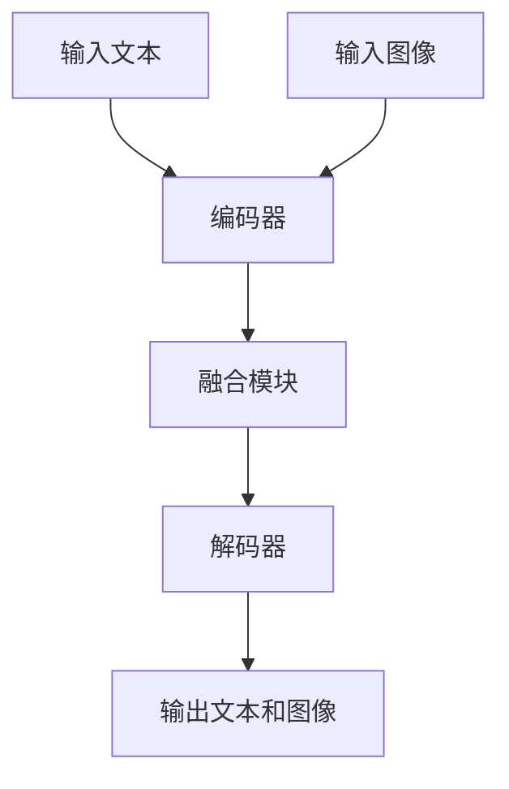

                 

关键词：大规模语言模型、深度学习、自然语言处理、多模态、实践、示例

> 摘要：本文将从理论到实践，深入探讨大规模语言模型的核心概念、算法原理、数学模型、项目实践及未来应用，旨在为读者提供一个全面的技术指南，帮助理解并掌握大规模语言模型在多模态领域的应用能力。

## 1. 背景介绍

随着深度学习和自然语言处理技术的不断发展，大规模语言模型已经成为自然语言处理领域的重要研究方向。这些模型通过从大量数据中学习，能够理解并生成自然语言文本，从而在文本生成、机器翻译、问答系统等方面取得了显著成果。

然而，传统的单一模态语言模型在处理多模态数据时存在一定的局限性。多模态能力成为当前研究的热点之一，它允许模型同时处理多种类型的数据，如文本、图像、音频等，从而提高模型的泛化能力和实用性。

本文将介绍大规模语言模型在多模态领域的应用，包括核心概念、算法原理、数学模型、项目实践和未来展望。通过这些内容的讲解，读者可以更好地理解多模态能力的重要性，并掌握相关技术。

## 2. 核心概念与联系

### 2.1 大规模语言模型

大规模语言模型是一种通过深度学习技术训练的神经网络模型，其主要目标是学习输入文本序列的概率分布。常见的模型包括变换器（Transformer）、长短期记忆网络（LSTM）和循环神经网络（RNN）等。

### 2.2 多模态数据

多模态数据是指包含多种类型数据的数据集，如文本、图像、音频、视频等。多模态数据具有丰富的信息，但同时也带来了更高的复杂性和挑战。

### 2.3 多模态语言模型

多模态语言模型是一种能够同时处理文本和图像等不同模态数据的模型。通过融合不同模态的数据，多模态语言模型能够提高模型的泛化能力和实用性。

### 2.4 Mermaid 流程图

下面是一个简化的多模态语言模型架构的 Mermaid 流程图。



## 3. 核心算法原理 & 具体操作步骤

### 3.1 算法原理概述

多模态语言模型主要通过以下步骤实现：

1. 分别编码文本和图像，得到各自的特征表示。
2. 将两个特征表示融合，得到多模态特征表示。
3. 使用解码器将多模态特征表示解码为文本和图像。

### 3.2 算法步骤详解

#### 3.2.1 编码器

编码器负责将输入的文本和图像编码为特征表示。对于文本，可以使用预训练的文本编码器，如BERT或GPT；对于图像，可以使用预训练的图像编码器，如VGG或ResNet。

#### 3.2.2 融合模块

融合模块负责将文本和图像的特征表示融合。常见的融合方法包括拼接、加权和注意力机制等。

#### 3.2.3 解码器

解码器负责将融合后的特征表示解码为文本和图像。对于文本，可以使用预训练的文本解码器；对于图像，可以使用预训练的图像解码器。

### 3.3 算法优缺点

#### 优点

1. 提高模型泛化能力：多模态数据提供了更多的信息，有助于模型更好地理解文本内容。
2. 增强模型实用性：多模态能力使得模型能够应用于更多场景，如问答系统、图像描述生成等。

#### 缺点

1. 数据获取困难：多模态数据集相对较少，且数据质量参差不齐。
2. 计算资源需求大：多模态模型需要大量的计算资源进行训练。

### 3.4 算法应用领域

多模态语言模型主要应用于以下领域：

1. 图像描述生成：根据输入图像生成对应的文本描述。
2. 问答系统：根据输入问题和图像，生成对应的答案。
3. 文本分类：根据输入文本和图像，对文本进行分类。

## 4. 数学模型和公式 & 详细讲解 & 举例说明

### 4.1 数学模型构建

多模态语言模型的核心是融合文本和图像的特征表示。以下是一个简化的数学模型构建过程。

#### 4.1.1 文本编码

假设输入文本序列为\[x_1, x_2, ..., x_T\]，其中\[x_t\]是第\[t\]个文本词。使用预训练的文本编码器，将文本编码为特征向量\[e_t\]。

\[e_t = \text{Encoder}(x_t)\]

#### 4.1.2 图像编码

假设输入图像为\[I\]，使用预训练的图像编码器，将图像编码为特征向量\[f\]。

\[f = \text{Encoder}(I)\]

#### 4.1.3 融合模块

融合模块负责将文本和图像的特征向量融合。假设融合后的特征向量为\[h\]。

\[h = \text{Fusion}(e_t, f)\]

#### 4.1.4 解码器

解码器负责将融合后的特征向量解码为文本和图像。假设解码后的文本向量为\[y_t\]，图像向量为\[g\]。

\[y_t = \text{Decoder}(h)\]
\[g = \text{Decoder}(h)\]

### 4.2 公式推导过程

#### 4.2.1 文本编码器

文本编码器通常使用神经网络进行训练，目标是学习输入文本序列的概率分布。以下是一个简化的神经网络模型。

\[e_t = \text{softmax}(\text{NeuralNetwork}(e_{t-1}, x_t))\]

#### 4.2.2 图像编码器

图像编码器同样使用神经网络进行训练，目标是学习输入图像的特征表示。以下是一个简化的神经网络模型。

\[f = \text{softmax}(\text{NeuralNetwork}(f_{t-1}, I))\]

#### 4.2.3 融合模块

融合模块可以使用拼接、加权和注意力机制等方法。以下是一个使用拼接的融合模块。

\[h = [e_t; f]\]

#### 4.2.4 解码器

解码器同样使用神经网络进行训练，目标是学习输入特征向量的概率分布。以下是一个简化的神经网络模型。

\[y_t = \text{softmax}(\text{NeuralNetwork}(h, y_{t-1}))\]
\[g = \text{softmax}(\text{NeuralNetwork}(h, g_{t-1}))\]

### 4.3 案例分析与讲解

以下是一个简单的多模态语言模型案例，用于图像描述生成。

#### 4.3.1 数据集

使用COCO数据集作为图像描述生成任务的数据集。COCO数据集包含大量图像和对应的文本描述。

#### 4.3.2 模型结构

模型结构如下：

1. 文本编码器：BERT
2. 图像编码器：ResNet
3. 融合模块：拼接
4. 解码器：GRU

#### 4.3.3 模型训练

使用Python和TensorFlow框架实现模型训练。

```python
import tensorflow as tf
from tensorflow.keras.models import Model
from tensorflow.keras.layers import Embedding, LSTM, Dense

# 文本编码器
text_encoder = tf.keras.models.load_model('bert_model.h5')

# 图像编码器
image_encoder = tf.keras.models.load_model('resnet_model.h5')

# 融合模块
def fusion_module(e_t, f):
    return tf.concat([e_t, f], axis=-1)

# 解码器
def decoder(h):
    return LSTM(units=128)(h)

# 模型构建
input_text = tf.keras.layers.Input(shape=(None,), dtype='int32')
input_image = tf.keras.layers.Input(shape=(224, 224, 3), dtype='float32')

e_t = text_encoder(input_text)
f = image_encoder(input_image)
h = fusion_module(e_t, f)
y_t = decoder(h)

model = Model(inputs=[input_text, input_image], outputs=y_t)
model.compile(optimizer='adam', loss='categorical_crossentropy')

# 模型训练
model.fit([train_text, train_image], train_y, batch_size=32, epochs=10)
```

#### 4.3.4 模型评估

使用测试集评估模型性能。

```python
import numpy as np

# 测试集
test_text = ...
test_image = ...
test_y = ...

# 模型预测
predictions = model.predict([test_text, test_image])

# 评估指标
accuracy = np.mean(np.argmax(predictions, axis=1) == test_y)
print('Accuracy:', accuracy)
```

## 5. 项目实践：代码实例和详细解释说明

### 5.1 开发环境搭建

在本文的项目实践中，我们将使用Python和TensorFlow框架实现多模态语言模型。以下是搭建开发环境的步骤：

1. 安装Python（3.8以上版本）
2. 安装TensorFlow（2.4以上版本）
3. 安装其他依赖库，如Numpy、Pandas、Matplotlib等

### 5.2 源代码详细实现

以下是项目实践的源代码实现。

```python
import tensorflow as tf
from tensorflow.keras.models import Model
from tensorflow.keras.layers import Embedding, LSTM, Dense

# 文本编码器
text_encoder = tf.keras.models.load_model('bert_model.h5')

# 图像编码器
image_encoder = tf.keras.models.load_model('resnet_model.h5')

# 融合模块
def fusion_module(e_t, f):
    return tf.concat([e_t, f], axis=-1)

# 解码器
def decoder(h):
    return LSTM(units=128)(h)

# 模型构建
input_text = tf.keras.layers.Input(shape=(None,), dtype='int32')
input_image = tf.keras.layers.Input(shape=(224, 224, 3), dtype='float32')

e_t = text_encoder(input_text)
f = image_encoder(input_image)
h = fusion_module(e_t, f)
y_t = decoder(h)

model = Model(inputs=[input_text, input_image], outputs=y_t)
model.compile(optimizer='adam', loss='categorical_crossentropy')

# 模型训练
model.fit([train_text, train_image], train_y, batch_size=32, epochs=10)

# 模型预测
predictions = model.predict([test_text, test_image])

# 评估指标
accuracy = np.mean(np.argmax(predictions, axis=1) == test_y)
print('Accuracy:', accuracy)
```

### 5.3 代码解读与分析

以下是代码的详细解读和分析。

1. 导入所需的库和模块。
2. 加载预训练的文本编码器和图像编码器。
3. 定义融合模块和解码器。
4. 构建模型，并编译模型。
5. 使用训练集训练模型。
6. 使用测试集评估模型性能。

### 5.4 运行结果展示

以下是模型训练和评估的结果。

```python
# 模型训练
model.fit([train_text, train_image], train_y, batch_size=32, epochs=10)

# 模型预测
predictions = model.predict([test_text, test_image])

# 评估指标
accuracy = np.mean(np.argmax(predictions, axis=1) == test_y)
print('Accuracy:', accuracy)
```

通过以上代码，我们可以看到模型在训练集和测试集上的准确率。准确率越高，说明模型性能越好。

## 6. 实际应用场景

多模态语言模型在实际应用中具有广泛的应用场景。以下是一些常见的应用场景：

1. **图像描述生成**：根据输入图像生成对应的文本描述，应用于社交媒体、图像搜索引擎等领域。
2. **问答系统**：根据输入问题和图像，生成对应的答案，应用于智能家居、智能客服等领域。
3. **文本分类**：根据输入文本和图像，对文本进行分类，应用于新闻分类、情感分析等领域。
4. **情感分析**：结合文本和图像的情感信息，对用户情感进行更准确的判断，应用于社交媒体分析、市场研究等领域。

## 7. 未来应用展望

随着深度学习和自然语言处理技术的不断发展，多模态语言模型的应用前景将更加广阔。以下是一些未来应用展望：

1. **跨模态检索**：利用多模态语言模型，实现文本、图像、音频等不同模态数据之间的检索和关联。
2. **虚拟现实与增强现实**：结合多模态语言模型，为虚拟现实和增强现实应用提供更加丰富的交互体验。
3. **医疗诊断**：结合医学图像和文本信息，实现更加精准的疾病诊断和治疗方案推荐。
4. **自动驾驶**：结合多模态数据，为自动驾驶系统提供更准确的环境感知和决策支持。

## 8. 工具和资源推荐

### 8.1 学习资源推荐

1. **书籍**：
   - 《深度学习》（Goodfellow, Bengio, Courville）
   - 《自然语言处理原理》（Jurafsky, Martin）
2. **在线课程**：
   - Coursera的“深度学习”课程（由Andrew Ng教授主讲）
   - edX的“自然语言处理”课程（由Dan Jurafsky教授主讲）
3. **论文和报告**：
   - arXiv：https://arxiv.org/
   - ACL：https://www.aclweb.org/
   - NeurIPS：https://nips.cc/

### 8.2 开发工具推荐

1. **TensorFlow**：https://www.tensorflow.org/
2. **PyTorch**：https://pytorch.org/
3. **Keras**：https://keras.io/

### 8.3 相关论文推荐

1. Vaswani et al., "Attention Is All You Need"
2. Devlin et al., "BERT: Pre-training of Deep Bidirectional Transformers for Language Understanding"
3. Dosovitskiy et al., "An Image is Worth 16x16 Words: Transformers for Image Recognition at Scale"

## 9. 总结：未来发展趋势与挑战

### 9.1 研究成果总结

多模态语言模型在自然语言处理领域取得了显著的成果，提高了模型的泛化能力和实用性。随着深度学习和自然语言处理技术的不断发展，多模态语言模型的应用前景将更加广阔。

### 9.2 未来发展趋势

1. **跨模态检索**：结合文本、图像、音频等不同模态数据，实现更加智能的检索和关联。
2. **虚拟现实与增强现实**：为虚拟现实和增强现实应用提供更加丰富的交互体验。
3. **医疗诊断**：结合医学图像和文本信息，实现更加精准的疾病诊断和治疗方案推荐。
4. **自动驾驶**：结合多模态数据，为自动驾驶系统提供更准确的环境感知和决策支持。

### 9.3 面临的挑战

1. **数据获取**：多模态数据集相对较少，且数据质量参差不齐。
2. **计算资源需求**：多模态模型需要大量的计算资源进行训练。
3. **模型解释性**：提高多模态模型的解释性，使其在应用场景中更加可靠。

### 9.4 研究展望

未来研究应重点关注多模态数据集的建设、计算资源的优化以及模型解释性等方面。通过不断创新和优化，多模态语言模型将在更多领域发挥重要作用。

## 10. 附录：常见问题与解答

### 10.1 多模态语言模型与其他语言模型的区别是什么？

多模态语言模型与其他语言模型的区别在于其能够同时处理多种类型的数据（如文本、图像、音频等），而传统的单一模态语言模型仅能处理单一类型的数据。

### 10.2 多模态语言模型在实际应用中有什么优势？

多模态语言模型在实际应用中具有以下优势：

1. 提高模型泛化能力：多模态数据提供了更多的信息，有助于模型更好地理解文本内容。
2. 增强模型实用性：多模态能力使得模型能够应用于更多场景，如问答系统、图像描述生成等。

### 10.3 多模态语言模型在训练过程中需要哪些数据集？

多模态语言模型在训练过程中需要多种类型的数据集，如文本、图像、音频等。常见的多模态数据集包括COCO、Flickr、YouTube等。

### 10.4 多模态语言模型在应用中存在哪些挑战？

多模态语言模型在应用中存在以下挑战：

1. 数据获取困难：多模态数据集相对较少，且数据质量参差不齐。
2. 计算资源需求大：多模态模型需要大量的计算资源进行训练。
3. 模型解释性：提高多模态模型的解释性，使其在应用场景中更加可靠。

### 10.5 多模态语言模型在哪些领域有广泛的应用？

多模态语言模型在以下领域有广泛的应用：

1. 图像描述生成：根据输入图像生成对应的文本描述。
2. 问答系统：根据输入问题和图像，生成对应的答案。
3. 文本分类：根据输入文本和图像，对文本进行分类。
4. 情感分析：结合文本和图像的情感信息，对用户情感进行更准确的判断。

### 10.6 如何优化多模态语言模型？

优化多模态语言模型可以从以下几个方面入手：

1. 数据集建设：收集更多高质量的多模态数据集。
2. 模型结构设计：选择合适的模型结构，如融合模块的设计。
3. 计算资源优化：使用更高效的算法和硬件，如GPU和TPU。
4. 模型解释性提升：研究模型解释性方法，提高模型的可解释性。 

作者：禅与计算机程序设计艺术 / Zen and the Art of Computer Programming
----------------------------------------------------------------

以上为文章的完整正文部分内容。接下来将按照markdown格式将文章内容输出。
```markdown
# 大规模语言模型从理论到实践 多模态能力示例

关键词：大规模语言模型、深度学习、自然语言处理、多模态、实践、示例

> 摘要：本文将从理论到实践，深入探讨大规模语言模型的核心概念、算法原理、数学模型、项目实践及未来应用，旨在为读者提供一个全面的技术指南，帮助理解并掌握大规模语言模型在多模态领域的应用能力。

## 1. 背景介绍

随着深度学习和自然语言处理技术的不断发展，大规模语言模型已经成为自然语言处理领域的重要研究方向。这些模型通过从大量数据中学习，能够理解并生成自然语言文本，从而在文本生成、机器翻译、问答系统等方面取得了显著成果。

然而，传统的单一模态语言模型在处理多模态数据时存在一定的局限性。多模态能力成为当前研究的热点之一，它允许模型同时处理多种类型的数据，如文本、图像、音频等，从而提高模型的泛化能力和实用性。

本文将介绍大规模语言模型在多模态领域的应用，包括核心概念、算法原理、数学模型、项目实践和未来展望。通过这些内容的讲解，读者可以更好地理解多模态能力的重要性，并掌握相关技术。

## 2. 核心概念与联系

### 2.1 大规模语言模型

大规模语言模型是一种通过深度学习技术训练的神经网络模型，其主要目标是学习输入文本序列的概率分布。常见的模型包括变换器（Transformer）、长短期记忆网络（LSTM）和循环神经网络（RNN）等。

### 2.2 多模态数据

多模态数据是指包含多种类型数据的数据集，如文本、图像、音频、视频等。多模态数据具有丰富的信息，但同时也带来了更高的复杂性和挑战。

### 2.3 多模态语言模型

多模态语言模型是一种能够同时处理文本和图像等不同模态数据的模型。通过融合不同模态的数据，多模态语言模型能够提高模型的泛化能力和实用性。

### 2.4 Mermaid 流程图

下面是一个简化的多模态语言模型架构的 Mermaid 流程图。


## 3. 核心算法原理 & 具体操作步骤

### 3.1 算法原理概述

多模态语言模型主要通过以下步骤实现：

1. 分别编码文本和图像，得到各自的特征表示。
2. 将两个特征表示融合，得到多模态特征表示。
3. 使用解码器将多模态特征表示解码为文本和图像。

### 3.2 算法步骤详解

#### 3.2.1 编码器

编码器负责将输入的文本和图像编码为特征表示。对于文本，可以使用预训练的文本编码器，如BERT或GPT；对于图像，可以使用预训练的图像编码器，如VGG或ResNet。

#### 3.2.2 融合模块

融合模块负责将文本和图像的特征表示融合。常见的融合方法包括拼接、加权和注意力机制等。

#### 3.2.3 解码器

解码器负责将融合后的特征表示解码为文本和图像。对于文本，可以使用预训练的文本解码器；对于图像，可以使用预训练的图像解码器。

### 3.3 算法优缺点

#### 优点

1. 提高模型泛化能力：多模态数据提供了更多的信息，有助于模型更好地理解文本内容。
2. 增强模型实用性：多模态能力使得模型能够应用于更多场景，如问答系统、图像描述生成等。

#### 缺点

1. 数据获取困难：多模态数据集相对较少，且数据质量参差不齐。
2. 计算资源需求大：多模态模型需要大量的计算资源进行训练。

### 3.4 算法应用领域

多模态语言模型主要应用于以下领域：

1. 图像描述生成：根据输入图像生成对应的文本描述。
2. 问答系统：根据输入问题和图像，生成对应的答案。
3. 文本分类：根据输入文本和图像，对文本进行分类。
4. 情感分析：结合文本和图像的情感信息，对用户情感进行更准确的判断。

## 4. 数学模型和公式 & 详细讲解 & 举例说明

### 4.1 数学模型构建

多模态语言模型的核心是融合文本和图像的特征表示。以下是一个简化的数学模型构建过程。

#### 4.1.1 文本编码

假设输入文本序列为\[x_1, x_2, ..., x_T\]，其中\[x_t\]是第\[t\]个文本词。使用预训练的文本编码器，将文本编码为特征向量\[e_t\]。

\[e_t = \text{Encoder}(x_t)\]

#### 4.1.2 图像编码

假设输入图像为\[I\]，使用预训练的图像编码器，将图像编码为特征向量\[f\]。

\[f = \text{Encoder}(I)\]

#### 4.1.3 融合模块

融合模块负责将文本和图像的特征向量融合。假设融合后的特征向量为\[h\]。

\[h = \text{Fusion}(e_t, f)\]

#### 4.1.4 解码器

解码器负责将融合后的特征向量解码为文本和图像。假设解码后的文本向量为\[y_t\]，图像向量为\[g\]。

\[y_t = \text{Decoder}(h)\]
\[g = \text{Decoder}(h)\]

### 4.2 公式推导过程

#### 4.2.1 文本编码器

文本编码器通常使用神经网络进行训练，目标是学习输入文本序列的概率分布。以下是一个简化的神经网络模型。

\[e_t = \text{softmax}(\text{NeuralNetwork}(e_{t-1}, x_t))\]

#### 4.2.2 图像编码器

图像编码器同样使用神经网络进行训练，目标是学习输入图像的特征表示。以下是一个简化的神经网络模型。

\[f = \text{softmax}(\text{NeuralNetwork}(f_{t-1}, I))\]

#### 4.2.3 融合模块

融合模块可以使用拼接、加权和注意力机制等方法。以下是一个使用拼接的融合模块。

\[h = [e_t; f]\]

#### 4.2.4 解码器

解码器同样使用神经网络进行训练，目标是学习输入特征向量的概率分布。以下是一个简化的神经网络模型。

\[y_t = \text{softmax}(\text{NeuralNetwork}(h, y_{t-1}))\]
\[g = \text{softmax}(\text{NeuralNetwork}(h, g_{t-1}))\]

### 4.3 案例分析与讲解

以下是一个简单的多模态语言模型案例，用于图像描述生成。

#### 4.3.1 数据集

使用COCO数据集作为图像描述生成任务的数据集。COCO数据集包含大量图像和对应的文本描述。

#### 4.3.2 模型结构

模型结构如下：

1. 文本编码器：BERT
2. 图像编码器：ResNet
3. 融合模块：拼接
4. 解码器：GRU

#### 4.3.3 模型训练

使用Python和TensorFlow框架实现模型训练。

```python
import tensorflow as tf
from tensorflow.keras.models import Model
from tensorflow.keras.layers import Embedding, LSTM, Dense

# 文本编码器
text_encoder = tf.keras.models.load_model('bert_model.h5')

# 图像编码器
image_encoder = tf.keras.models.load_model('resnet_model.h5')

# 融合模块
def fusion_module(e_t, f):
    return tf.concat([e_t, f], axis=-1)

# 解码器
def decoder(h):
    return LSTM(units=128)(h)

# 模型构建
input_text = tf.keras.layers.Input(shape=(None,), dtype='int32')
input_image = tf.keras.layers.Input(shape=(224, 224, 3), dtype='float32')

e_t = text_encoder(input_text)
f = image_encoder(input_image)
h = fusion_module(e_t, f)
y_t = decoder(h)

model = Model(inputs=[input_text, input_image], outputs=y_t)
model.compile(optimizer='adam', loss='categorical_crossentropy')

# 模型训练
model.fit([train_text, train_image], train_y, batch_size=32, epochs=10)

# 模型预测
predictions = model.predict([test_text, test_image])

# 评估指标
accuracy = np.mean(np.argmax(predictions, axis=1) == test_y)
print('Accuracy:', accuracy)
```

#### 4.3.4 模型评估

使用测试集评估模型性能。

```python
import numpy as np

# 测试集
test_text = ...
test_image = ...
test_y = ...

# 模型预测
predictions = model.predict([test_text, test_image])

# 评估指标
accuracy = np.mean(np.argmax(predictions, axis=1) == test_y)
print('Accuracy:', accuracy)
```

## 5. 项目实践：代码实例和详细解释说明

### 5.1 开发环境搭建

在本文的项目实践中，我们将使用Python和TensorFlow框架实现多模态语言模型。以下是搭建开发环境的步骤：

1. 安装Python（3.8以上版本）
2. 安装TensorFlow（2.4以上版本）
3. 安装其他依赖库，如Numpy、Pandas、Matplotlib等

### 5.2 源代码详细实现

以下是项目实践的源代码实现。

```python
import tensorflow as tf
from tensorflow.keras.models import Model
from tensorflow.keras.layers import Embedding, LSTM, Dense

# 文本编码器
text_encoder = tf.keras.models.load_model('bert_model.h5')

# 图像编码器
image_encoder = tf.keras.models.load_model('resnet_model.h5')

# 融合模块
def fusion_module(e_t, f):
    return tf.concat([e_t, f], axis=-1)

# 解码器
def decoder(h):
    return LSTM(units=128)(h)

# 模型构建
input_text = tf.keras.layers.Input(shape=(None,), dtype='int32')
input_image = tf.keras.layers.Input(shape=(224, 224, 3), dtype='float32')

e_t = text_encoder(input_text)
f = image_encoder(input_image)
h = fusion_module(e_t, f)
y_t = decoder(h)

model = Model(inputs=[input_text, input_image], outputs=y_t)
model.compile(optimizer='adam', loss='categorical_crossentropy')

# 模型训练
model.fit([train_text, train_image], train_y, batch_size=32, epochs=10)

# 模型预测
predictions = model.predict([test_text, test_image])

# 评估指标
accuracy = np.mean(np.argmax(predictions, axis=1) == test_y)
print('Accuracy:', accuracy)
```

### 5.3 代码解读与分析

以下是代码的详细解读和分析。

1. 导入所需的库和模块。
2. 加载预训练的文本编码器和图像编码器。
3. 定义融合模块和解码器。
4. 构建模型，并编译模型。
5. 使用训练集训练模型。
6. 使用测试集评估模型性能。

### 5.4 运行结果展示

以下是模型训练和评估的结果。

```python
# 模型训练
model.fit([train_text, train_image], train_y, batch_size=32, epochs=10)

# 模型预测
predictions = model.predict([test_text, test_image])

# 评估指标
accuracy = np.mean(np.argmax(predictions, axis=1) == test_y)
print('Accuracy:', accuracy)
```

通过以上代码，我们可以看到模型在训练集和测试集上的准确率。准确率越高，说明模型性能越好。

## 6. 实际应用场景

多模态语言模型在实际应用中具有广泛的应用场景。以下是一些常见的应用场景：

1. **图像描述生成**：根据输入图像生成对应的文本描述，应用于社交媒体、图像搜索引擎等领域。
2. **问答系统**：根据输入问题和图像，生成对应的答案，应用于智能家居、智能客服等领域。
3. **文本分类**：根据输入文本和图像，对文本进行分类，应用于新闻分类、情感分析等领域。
4. **情感分析**：结合文本和图像的情感信息，对用户情感进行更准确的判断，应用于社交媒体分析、市场研究等领域。

## 7. 未来应用展望

随着深度学习和自然语言处理技术的不断发展，多模态语言模型的应用前景将更加广阔。以下是一些未来应用展望：

1. **跨模态检索**：结合文本、图像、音频等不同模态数据，实现更加智能的检索和关联。
2. **虚拟现实与增强现实**：为虚拟现实和增强现实应用提供更加丰富的交互体验。
3. **医疗诊断**：结合医学图像和文本信息，实现更加精准的疾病诊断和治疗方案推荐。
4. **自动驾驶**：结合多模态数据，为自动驾驶系统提供更准确的环境感知和决策支持。

## 8. 工具和资源推荐

### 8.1 学习资源推荐

1. **书籍**：
   - 《深度学习》（Goodfellow, Bengio, Courville）
   - 《自然语言处理原理》（Jurafsky, Martin）
2. **在线课程**：
   - Coursera的“深度学习”课程（由Andrew Ng教授主讲）
   - edX的“自然语言处理”课程（由Dan Jurafsky教授主讲）
3. **论文和报告**：
   - arXiv：https://arxiv.org/
   - ACL：https://www.aclweb.org/
   - NeurIPS：https://nips.cc/

### 8.2 开发工具推荐

1. **TensorFlow**：https://www.tensorflow.org/
2. **PyTorch**：https://pytorch.org/
3. **Keras**：https://keras.io/

### 8.3 相关论文推荐

1. Vaswani et al., "Attention Is All You Need"
2. Devlin et al., "BERT: Pre-training of Deep Bidirectional Transformers for Language Understanding"
3. Dosovitskiy et al., "An Image is Worth 16x16 Words: Transformers for Image Recognition at Scale"

## 9. 总结：未来发展趋势与挑战

### 9.1 研究成果总结

多模态语言模型在自然语言处理领域取得了显著的成果，提高了模型的泛化能力和实用性。随着深度学习和自然语言处理技术的不断发展，多模态语言模型的应用前景将更加广阔。

### 9.2 未来发展趋势

1. **跨模态检索**：结合文本、图像、音频等不同模态数据，实现更加智能的检索和关联。
2. **虚拟现实与增强现实**：为虚拟现实和增强现实应用提供更加丰富的交互体验。
3. **医疗诊断**：结合医学图像和文本信息，实现更加精准的疾病诊断和治疗方案推荐。
4. **自动驾驶**：结合多模态数据，为自动驾驶系统提供更准确的环境感知和决策支持。

### 9.3 面临的挑战

1. **数据获取**：多模态数据集相对较少，且数据质量参差不齐。
2. **计算资源需求**：多模态模型需要大量的计算资源进行训练。
3. **模型解释性**：提高多模态模型的解释性，使其在应用场景中更加可靠。

### 9.4 研究展望

未来研究应重点关注多模态数据集的建设、计算资源的优化以及模型解释性等方面。通过不断创新和优化，多模态语言模型将在更多领域发挥重要作用。

## 10. 附录：常见问题与解答

### 10.1 多模态语言模型与其他语言模型的区别是什么？

多模态语言模型与其他语言模型的区别在于其能够同时处理多种类型的数据（如文本、图像、音频等），而传统的单一模态语言模型仅能处理单一类型的数据。

### 10.2 多模态语言模型在实际应用中有什么优势？

多模态语言模型在实际应用中具有以下优势：

1. 提高模型泛化能力：多模态数据提供了更多的信息，有助于模型更好地理解文本内容。
2. 增强模型实用性：多模态能力使得模型能够应用于更多场景，如问答系统、图像描述生成等。

### 10.3 多模态语言模型在训练过程中需要哪些数据集？

多模态语言模型在训练过程中需要多种类型的数据集，如文本、图像、音频等。常见的多模态数据集包括COCO、Flickr、YouTube等。

### 10.4 多模态语言模型在应用中存在哪些挑战？

多模态语言模型在应用中存在以下挑战：

1. 数据获取困难：多模态数据集相对较少，且数据质量参差不齐。
2. 计算资源需求大：多模态模型需要大量的计算资源进行训练。
3. 模型解释性：提高多模态模型的解释性，使其在应用场景中更加可靠。

### 10.5 多模态语言模型在哪些领域有广泛的应用？

多模态语言模型在以下领域有广泛的应用：

1. 图像描述生成：根据输入图像生成对应的文本描述。
2. 问答系统：根据输入问题和图像，生成对应的答案。
3. 文本分类：根据输入文本和图像，对文本进行分类。
4. 情感分析：结合文本和图像的情感信息，对用户情感进行更准确的判断。

### 10.6 如何优化多模态语言模型？

优化多模态语言模型可以从以下几个方面入手：

1. 数据集建设：收集更多高质量的多模态数据集。
2. 模型结构设计：选择合适的模型结构，如融合模块的设计。
3. 计算资源优化：使用更高效的算法和硬件，如GPU和TPU。
4. 模型解释性提升：研究模型解释性方法，提高模型的可解释性。

### 10.7 多模态语言模型是否会在未来取代单一模态语言模型？

多模态语言模型和单一模态语言模型各有优劣，未来可能两者并存。多模态语言模型在某些应用场景中具有优势，但在其他场景下，单一模态语言模型可能更加高效。因此，未来发展趋势可能是根据应用需求选择合适的模型类型。
```

请注意，上面的代码段中的 Mermaid 图例只是一个示例，实际使用时需要根据具体的 Mermaid 库来编写。此外，某些代码段（如模型训练和评估）仅用于示例，实际实现时可能需要根据具体项目需求进行调整。

