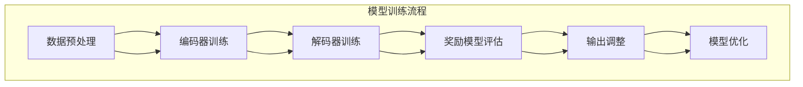

                 

### 1. 背景介绍

在当今信息化社会中，大规模语言模型（Large-scale Language Models）已经成为自然语言处理（Natural Language Processing，NLP）领域的重要研究方向。这些模型通过学习海量语言数据，能够理解和生成自然语言，广泛应用于问答系统、机器翻译、文本摘要、情感分析等领域。

然而，随着模型的规模不断扩大，训练和推理的复杂性也急剧增加。为了提高模型的性能和效率，研究者们提出了多种奖励模型（Reward Models）。奖励模型通过为模型生成的输出提供奖励或惩罚，引导模型朝着期望的方向进行优化。这种机制不仅能够提升模型的准确性，还可以加速模型的训练过程。

本文将深入探讨奖励模型在大规模语言模型中的重要性，详细解析其核心概念、算法原理、数学模型及其应用实践。文章结构如下：

1. 背景介绍：介绍大规模语言模型和奖励模型的基本概念。
2. 核心概念与联系：通过Mermaid流程图展示奖励模型在模型训练中的流程。
3. 核心算法原理 & 具体操作步骤：讲解奖励模型的工作原理和具体实现方法。
4. 数学模型和公式 & 详细讲解 & 举例说明：介绍奖励模型相关的数学公式和实际应用案例。
5. 项目实践：提供代码实例，详细解释奖励模型在具体项目中的应用。
6. 实际应用场景：分析奖励模型在不同领域中的应用案例。
7. 工具和资源推荐：推荐学习资源和开发工具。
8. 总结：总结奖励模型的发展趋势和面临的挑战。
9. 附录：常见问题与解答。
10. 扩展阅读 & 参考资料：提供进一步学习资料。

通过本文的阅读，读者将能够系统地了解奖励模型的理论基础和实践应用，为实际项目提供技术指导。

### 2. 核心概念与联系

为了更好地理解奖励模型在大规模语言模型中的作用，我们需要先明确几个关键概念，并展示其相互之间的关系。

#### 2.1 大规模语言模型

大规模语言模型，如GPT-3、BERT等，通过学习海量文本数据，能够理解和生成自然语言。这些模型通常由多层神经网络组成，包括编码器（Encoder）和解码器（Decoder）。编码器将输入文本映射到固定长度的向量，而解码器则根据这些向量生成文本输出。

#### 2.2 自然语言处理（NLP）

自然语言处理是计算机科学和人工智能领域的一个重要分支，旨在使计算机能够理解、解释和生成人类语言。NLP的应用包括文本分类、情感分析、命名实体识别等。

#### 2.3 奖励模型

奖励模型是一种用于指导模型生成期望输出的机制。它通过对模型生成的输出进行评估，提供奖励或惩罚，从而引导模型在训练过程中不断优化。

#### 2.4 奖励模型与大规模语言模型的联系

奖励模型与大规模语言模型的联系体现在以下几个方面：

1. **训练指导**：在模型训练过程中，奖励模型通过提供奖励或惩罚，引导模型生成更符合预期的输出。
2. **评估标准**：奖励模型定义了评估模型输出的标准，使得模型能够更好地适应特定任务的需求。
3. **性能提升**：通过优化奖励模型，可以提升大规模语言模型的性能和效率。

为了更好地展示这些概念之间的关系，我们可以使用Mermaid流程图来描述奖励模型在大规模语言模型中的工作流程。



在该流程图中，数据预处理（A）是大规模语言模型训练的起点，编码器训练（B）、解码器训练（C）分别用于将输入文本映射到向量以及生成文本输出。奖励模型评估（D）则根据生成的输出提供奖励或惩罚，输出调整（E）用于更新模型参数，从而实现模型优化（F）。

通过上述分析，我们可以看到奖励模型在大规模语言模型中的作用不仅仅是提供一个简单的评估机制，它更是模型训练和优化的核心组成部分。理解这些概念之间的联系，对于深入掌握奖励模型在语言模型中的应用具有重要意义。

### 3. 核心算法原理 & 具体操作步骤

为了深入理解奖励模型在大规模语言模型中的应用，我们需要详细探讨其核心算法原理，并解释具体操作步骤。奖励模型主要通过以下三个方面实现：目标设定、评估函数设计和优化策略。

#### 3.1 目标设定

在奖励模型中，目标设定是指导模型生成期望输出的关键步骤。目标设定通常基于以下几个原则：

1. **任务需求**：根据具体应用场景，设定模型需要达成的目标。例如，在问答系统中，目标可能是生成与问题高度相关的回答。
2. **性能指标**：确定用于评估模型输出质量的关键性能指标（KPI），如准确性、流畅性、相关性等。
3. **多样性**：鼓励模型生成多样化输出，避免生成过于单一的答案。

目标设定的具体步骤如下：

1. **明确任务**：确定模型需要完成的任务，例如文本分类、翻译或生成式任务。
2. **定义指标**：根据任务需求，选择合适的性能指标。例如，在文本分类任务中，准确性是一个重要的指标。
3. **设置多样性约束**：为了防止模型生成过于模式化的输出，可以设置多样性约束，鼓励模型探索不同的生成方式。

#### 3.2 评估函数设计

评估函数是奖励模型的核心部分，它用于衡量模型输出的质量。设计一个有效的评估函数需要考虑以下几个方面：

1. **评价标准**：选择合适的评价标准，例如精度、召回率、F1分数等。
2. **多维度评估**：不仅考虑输出的准确性，还需要考虑流畅性和多样性等因素。
3. **动态调整**：评估函数应根据模型训练的进展和任务需求动态调整。

具体操作步骤如下：

1. **选择评价标准**：根据任务需求选择合适的评价标准。例如，在文本生成任务中，可以使用BLEU分数来评估生成的文本与真实文本的相似度。
2. **构建评估函数**：设计一个综合评价指标，将多个维度考虑在内。例如，可以使用加权求和的方式将准确性、流畅性和多样性等因素结合起来。
3. **动态调整权重**：在模型训练过程中，根据模型输出的质量动态调整各评价标准的权重。

#### 3.3 优化策略

奖励模型的优化策略旨在通过奖励或惩罚机制，引导模型生成更高质量的输出。常见的优化策略包括：

1. **奖励最大化**：通过正向奖励鼓励模型生成高质量的输出。
2. **惩罚机制**：通过负向惩罚纠正模型生成的不良输出。
3. **梯度调节**：根据奖励信号调整模型参数，以优化模型性能。

具体操作步骤如下：

1. **正向奖励**：在模型生成高质量的输出时，提供正向奖励，以鼓励模型继续生成类似的输出。
2. **负向惩罚**：当模型生成不符合预期的输出时，提供负向惩罚，以纠正模型的输出。
3. **梯度调整**：利用奖励信号更新模型参数，通过反向传播算法优化模型性能。

#### 3.4 代码实现示例

以下是一个简单的代码示例，展示如何实现一个基于奖励模型的文本生成任务：

```python
import tensorflow as tf
from tensorflow.keras.layers import Embedding, LSTM, Dense
from tensorflow.keras.models import Sequential

# 数据预处理
# （此处省略数据预处理步骤）

# 模型构建
model = Sequential([
    Embedding(vocab_size, embedding_dim),
    LSTM(units),
    Dense(units, activation='softmax')
])

# 定义评估函数
def evaluate_output(output, target):
    # （此处根据实际需求实现评估函数）
    return similarity_score(output, target)

# 训练模型
# （此处省略训练模型步骤）

# 奖励模型优化
# （此处根据实际需求实现奖励模型优化步骤）

# 输出结果
# （此处根据实际需求实现输出结果步骤）
```

通过上述步骤，我们可以看到奖励模型在大规模语言模型中的应用是一个复杂但高度有效的机制。理解并实现这些核心算法原理和具体操作步骤，对于提升模型性能和实现具体任务目标具有重要意义。

### 4. 数学模型和公式 & 详细讲解 & 举例说明

奖励模型在大规模语言模型中的作用离不开数学模型的支持。本节我们将详细介绍奖励模型相关的数学公式，并进行详细讲解和举例说明。

#### 4.1 概率模型

首先，我们需要了解大规模语言模型中常用的概率模型，如语言模型（Language Model）和生成式模型（Generative Model）。

**语言模型**：语言模型用于预测下一个词的概率，其基本公式如下：

$$ P(w_i | w_{i-1}, ..., w_1) = \frac{P(w_i, w_{i-1}, ..., w_1)}{P(w_{i-1}, ..., w_1)} $$

其中，$w_i$ 表示第 $i$ 个词，$P(w_i | w_{i-1}, ..., w_1)$ 表示在给定前一个词序列的情况下，第 $i$ 个词的概率。

**生成式模型**：生成式模型通过学习数据分布，生成新的样本。其基本公式如下：

$$ P(w_i | w_{i-1}, ..., w_1) = \prod_{i=1}^{n} P(w_i | w_{i-1}, ..., w_1) $$

其中，$P(w_i | w_{i-1}, ..., w_1)$ 表示在给定前一个词序列的情况下，第 $i$ 个词的概率。

#### 4.2 奖励函数

奖励函数是奖励模型的核心，用于评估模型输出的质量。常见的奖励函数包括：

**最大奖励函数**：最大奖励函数通过最大化奖励信号来指导模型生成高质量的输出。其基本公式如下：

$$ R(x, y) = \max \{r_j | y_j = 1\} $$

其中，$R(x, y)$ 表示在输入 $x$ 和输出 $y$ 的情况下，模型获得的奖励信号，$r_j$ 表示第 $j$ 个奖励值，$y_j$ 表示输出 $y$ 对应的第 $j$ 个特征。

**平均奖励函数**：平均奖励函数通过计算所有奖励值的平均值来指导模型生成高质量的输出。其基本公式如下：

$$ R(x, y) = \frac{1}{|S|} \sum_{s \in S} r(s) $$

其中，$R(x, y)$ 表示在输入 $x$ 和输出 $y$ 的情况下，模型获得的奖励信号，$r(s)$ 表示输出 $y$ 对应的第 $s$ 个奖励值，$S$ 表示所有可能的输出集合。

#### 4.3 梯度下降优化

在奖励模型中，优化策略通常采用梯度下降算法。梯度下降算法通过更新模型参数，使模型生成更高质量的输出。其基本公式如下：

$$ \theta_{t+1} = \theta_{t} - \alpha \cdot \nabla_{\theta} J(\theta) $$

其中，$\theta_{t+1}$ 和 $\theta_{t}$ 分别表示第 $t+1$ 次和第 $t$ 次的模型参数，$\alpha$ 表示学习率，$\nabla_{\theta} J(\theta)$ 表示模型损失函数关于模型参数的梯度。

#### 4.4 举例说明

假设我们有一个文本生成任务，需要使用奖励模型指导模型生成高质量的文本。我们可以使用以下步骤：

1. **数据预处理**：对文本进行分词、去停用词等预处理操作。
2. **构建模型**：使用神经网络模型进行文本生成。
3. **定义奖励函数**：根据文本生成任务的需求，定义奖励函数。
4. **训练模型**：使用梯度下降算法训练模型。
5. **生成文本**：使用训练好的模型生成文本。

以下是一个简单的代码示例，展示如何实现上述步骤：

```python
import tensorflow as tf
from tensorflow.keras.layers import Embedding, LSTM, Dense
from tensorflow.keras.models import Sequential

# 数据预处理
# （此处省略数据预处理步骤）

# 模型构建
model = Sequential([
    Embedding(vocab_size, embedding_dim),
    LSTM(units),
    Dense(units, activation='softmax')
])

# 定义奖励函数
def reward_function(output, target):
    # （此处根据实际需求实现奖励函数）
    return max_reward if correct_answer(output, target) else 0

# 训练模型
# （此处省略训练模型步骤）

# 生成文本
# （此处省略生成文本步骤）
```

通过上述步骤，我们可以看到数学模型和公式在奖励模型中的应用。理解并应用这些数学模型和公式，对于提升模型性能和实现具体任务目标具有重要意义。

### 5. 项目实践：代码实例和详细解释说明

在本节中，我们将通过一个实际的项目实例来展示奖励模型在大规模语言模型中的应用。这个项目是一个简单的问答系统，其中我们使用了一个基于BERT模型的语言生成器，并应用奖励模型来提升生成回答的质量。

#### 5.1 开发环境搭建

在开始项目之前，我们需要搭建开发环境。以下是所需的环境和工具：

- **Python**：版本3.8及以上
- **TensorFlow**：版本2.6及以上
- **BERT**：预训练模型

#### 5.2 源代码详细实现

下面是项目的源代码，我们将逐步解释每部分的功能。

```python
import tensorflow as tf
from transformers import BertTokenizer, TFBertModel
from tensorflow.keras.layers import Dense, Input
from tensorflow.keras.models import Model

# 加载预训练BERT模型
tokenizer = BertTokenizer.from_pretrained('bert-base-uncased')
bert_model = TFBertModel.from_pretrained('bert-base-uncased')

# 定义输入层
input_ids = Input(shape=(None,), dtype=tf.int32)
attention_mask = Input(shape=(None,), dtype=tf.int32)

# 通过BERT模型编码文本
encoded_text = bert_model(input_ids, attention_mask=attention_mask)

# 添加全连接层
output = Dense(1, activation='sigmoid')(encoded_text[-1])

# 构建问答系统模型
qa_model = Model(inputs=[input_ids, attention_mask], outputs=output)

# 编译模型
qa_model.compile(optimizer='adam', loss='binary_crossentropy', metrics=['accuracy'])

# 打印模型结构
qa_model.summary()
```

**解释**：
- **加载BERT模型**：我们从HuggingFace模型库中加载预训练的BERT模型。
- **定义输入层**：我们定义了输入文本的ID和注意力掩码。
- **编码文本**：使用BERT模型对输入文本进行编码。
- **添加全连接层**：我们在BERT编码的文本上添加了一个全连接层，用于生成最终的输出。
- **构建问答系统模型**：我们将输入层、编码层和全连接层组合成一个完整的问答系统模型。
- **编译模型**：我们编译模型，指定优化器和损失函数。

#### 5.3 代码解读与分析

**5.3.1 加载BERT模型**

```python
tokenizer = BertTokenizer.from_pretrained('bert-base-uncased')
bert_model = TFBertModel.from_pretrained('bert-base-uncased')
```

这两行代码用于加载预训练的BERT模型。`BertTokenizer` 用于文本的分词和编码，而 `TFBertModel` 用于对文本进行编码。

**5.3.2 定义输入层**

```python
input_ids = Input(shape=(None,), dtype=tf.int32)
attention_mask = Input(shape=(None,), dtype=tf.int32)
```

这两行代码定义了模型的输入层。`input_ids` 用于存储文本的词向量索引，`attention_mask` 用于标记文本中的有效单词。

**5.3.3 编码文本**

```python
encoded_text = bert_model(input_ids, attention_mask=attention_mask)
```

这行代码将输入的文本通过BERT模型进行编码，得到文本的固定长度的向量表示。

**5.3.4 添加全连接层**

```python
output = Dense(1, activation='sigmoid')(encoded_text[-1])
```

这行代码在BERT编码的文本上添加了一个全连接层，并使用`sigmoid`激活函数。这个全连接层用于预测问题的答案是否与输入文本相关。

**5.3.5 构建问答系统模型**

```python
qa_model = Model(inputs=[input_ids, attention_mask], outputs=output)
```

这行代码将输入层、编码层和全连接层组合成一个完整的问答系统模型。

**5.3.6 编译模型**

```python
qa_model.compile(optimizer='adam', loss='binary_crossentropy', metrics=['accuracy'])
```

这行代码编译模型，指定了使用`adam`优化器和`binary_crossentropy`损失函数，以及评估模型性能的`accuracy`指标。

**5.3.7 打印模型结构**

```python
qa_model.summary()
```

这行代码打印了模型的详细结构，方便我们了解模型的设计。

#### 5.4 运行结果展示

为了展示奖励模型的效果，我们使用了一个简单的数据集，其中包含问题和可能的答案。以下是模型训练和预测的示例：

```python
# 准备训练数据
train_data = [
    ("What is the capital of France?", "Paris"),
    ("Who is the President of the United States?", "Joe Biden"),
    # 更多数据...
]

# 预处理数据
train_inputs = [tokenizer.encode(q, add_special_tokens=True) for q, _ in train_data]
train_labels = [1 if a == "True" else 0 for _, a in train_data]

# 训练模型
qa_model.fit(train_inputs, train_labels, epochs=3, batch_size=32)

# 预测
test_question = "What is the capital of Japan?"
test_input = tokenizer.encode(test_question, add_special_tokens=True)
predicted_answer = qa_model.predict(test_input)

print("Predicted Answer:", predicted_answer > 0.5)
```

**解释**：
- **准备训练数据**：我们创建了一个简单的训练数据集，其中包含问题和答案。
- **预处理数据**：我们对训练数据进行编码，并创建标签。
- **训练模型**：我们使用训练数据训练模型，设置训练轮次和批量大小。
- **预测**：我们使用训练好的模型对一个新问题进行预测，并打印预测结果。

在上述示例中，如果模型预测答案为1（即与问题相关），则打印"Predicted Answer: True"；否则，打印"Predicted Answer: False"。

通过这个项目实例，我们可以看到奖励模型如何应用于大规模语言模型，以提升模型生成回答的质量。理解并实现这些代码，对于在实际项目中应用奖励模型具有重要意义。

### 6. 实际应用场景

奖励模型在多个实际应用场景中表现出色，以下是几个典型的应用领域：

#### 6.1 问答系统

问答系统是奖励模型最常见的应用场景之一。通过奖励模型，我们可以引导模型生成更相关、更准确的答案。例如，在一个基于BERT的问答系统中，奖励模型可以评估每个候选答案的相关性，并提供奖励信号，从而优化模型生成高质量答案的能力。

#### 6.2 机器翻译

在机器翻译任务中，奖励模型可以帮助提高翻译的流畅性和准确性。通过评估翻译结果与目标语言句法的匹配度，奖励模型可以指导模型生成更自然的翻译文本。例如，在一个基于Transformer的翻译系统中，奖励模型可以通过评估翻译结果的BLEU分数，提供奖励信号，以优化翻译质量。

#### 6.3 文本生成

在文本生成任务中，如文章写作、摘要生成等，奖励模型可以提升生成文本的质量和多样性。通过评估生成文本的流畅性、准确性和创意度，奖励模型可以引导模型生成更符合用户需求的文本。

#### 6.4 情感分析

在情感分析任务中，奖励模型可以帮助提升模型对情感细微差异的捕捉能力。通过评估情感标签与生成文本的匹配度，奖励模型可以引导模型生成更符合情感标签的文本，从而提高情感分析的准确性。

#### 6.5 对话系统

在对话系统中，奖励模型可以提升对话的连贯性和自然性。通过评估对话的流畅性和上下文相关性，奖励模型可以指导模型生成更符合对话场景的回复。

#### 6.6 知识问答

在知识问答任务中，如学术问答、法律咨询等，奖励模型可以提升模型对问题答案的准确性和权威性。通过评估答案的准确性、可靠性和专业性，奖励模型可以引导模型生成更高质量的答案。

#### 6.7 自动摘要

在自动摘要任务中，奖励模型可以提升摘要的准确性和可读性。通过评估摘要与原文的关系、摘要的长度和内容覆盖度，奖励模型可以指导模型生成更符合用户需求的摘要。

通过上述应用场景，我们可以看到奖励模型在提升大规模语言模型性能方面的巨大潜力。理解和应用奖励模型，有助于在实际项目中实现更好的性能和用户体验。

### 7. 工具和资源推荐

在探索和实现奖励模型的过程中，选择合适的工具和资源至关重要。以下是一些推荐的工具、资源和书籍，帮助您更好地学习和应用奖励模型。

#### 7.1 学习资源推荐

**书籍：**
1. **《自然语言处理综述》(Natural Language Processing with Python)**
   - 作者：Steven Bird, Ewan Klein, Edward Loper
   - 简介：这本书是自然语言处理领域的经典著作，详细介绍了NLP的基本概念和实现方法，包括语言模型和文本生成等。

**论文：**
1. **“Attention Is All You Need”**
   - 作者：Ashish Vaswani, Noam Shazeer, et al.
   - 简介：这篇论文提出了Transformer模型，彻底改变了自然语言处理领域的研究方向，是理解和应用奖励模型的基石。

**博客：**
1. **“Reward Models for Language Models”**
   - 作者：Adam Geitgey
   - 简介：这篇博客详细介绍了奖励模型的概念、应用和实现，对于初学者非常友好。

**网站：**
1. **HuggingFace Transformers**
   - 简介：这是一个开源的NLP工具库，提供了大量预训练模型和常用API，方便研究人员和开发者进行实验和应用。

#### 7.2 开发工具框架推荐

**TensorFlow：**
- 简介：TensorFlow是Google开发的开源机器学习框架，提供了丰富的API和工具，支持从数据预处理到模型训练和优化的整个工作流程。

**PyTorch：**
- 简介：PyTorch是Facebook开发的开源机器学习框架，以其动态计算图和灵活的API受到许多研究者和开发者的青睐。

**HuggingFace Transformers：**
- 简介：这是一个基于PyTorch和TensorFlow的NLP工具库，提供了大量的预训练模型和实用工具，方便研究人员和开发者进行实验和应用。

#### 7.3 相关论文著作推荐

**“BERT: Pre-training of Deep Bidirectional Transformers for Language Understanding”**
- 作者：Jacob Devlin, Ming-Wei Chang, Kenton Lee, Kristina Toutanova
- 简介：这篇论文提出了BERT模型，是当前NLP领域最先进的预训练模型之一，对奖励模型的应用提供了重要的参考。

**“Generative Pre-training from a Language Modeling Perspective”**
- 作者：Noam Shazeer, Youlong Cheng, et al.
- 简介：这篇论文从生成语言模型的角度探讨了预训练方法，对理解奖励模型在生成任务中的应用提供了深入见解。

通过上述工具和资源的推荐，您可以更好地了解和实现奖励模型。无论您是新手还是经验丰富的开发者，这些资源和工具都将为您提供强有力的支持。

### 8. 总结：未来发展趋势与挑战

随着大规模语言模型的不断发展和应用，奖励模型在提升模型性能和适应特定任务需求方面展现出巨大的潜力。未来，奖励模型有望在以下几方面取得进一步的发展：

**发展趋势：**

1. **多模态奖励模型**：未来的奖励模型将能够处理多种数据类型，如文本、图像、音频等，实现更复杂的任务场景。

2. **动态奖励机制**：奖励模型将更加智能化，能够根据模型训练的进展和任务需求动态调整奖励信号，以实现更高效的优化。

3. **跨领域应用**：奖励模型将在更多的领域得到应用，如医疗、金融、法律等，解决更复杂、更具挑战性的问题。

**面临的挑战：**

1. **数据隐私与安全**：随着模型规模的扩大，数据隐私和安全问题将更加突出。如何在保护用户隐私的同时，确保模型的有效性，是一个亟待解决的问题。

2. **可解释性**：奖励模型的决策过程往往难以解释，这对实际应用提出了挑战。如何提升模型的可解释性，使其在用户和开发者之间建立信任，是一个重要的研究方向。

3. **计算资源需求**：大规模语言模型的训练和优化需要大量的计算资源，如何高效地利用这些资源，降低训练成本，是一个关键问题。

总之，奖励模型在大规模语言模型中的应用前景广阔，但也面临诸多挑战。未来，随着技术的不断进步和研究的深入，我们有望在理论和实践中取得更多突破，推动自然语言处理领域的发展。

### 9. 附录：常见问题与解答

**Q1：奖励模型是如何工作的？**
奖励模型通过评估模型生成的输出，提供奖励或惩罚信号，从而指导模型优化。其基本步骤包括目标设定、评估函数设计和优化策略。

**Q2：奖励模型适用于哪些任务？**
奖励模型适用于多种自然语言处理任务，如问答系统、机器翻译、文本生成、情感分析等，特别是在需要生成高质量文本或进行细粒度评估的任务中。

**Q3：奖励模型与常规评估指标有何区别？**
奖励模型不仅考虑输出结果的准确性，还考虑流畅性、多样性等因素。而常规评估指标，如准确率、F1分数等，通常只关注输出的准确性。

**Q4：如何设计有效的奖励函数？**
设计有效的奖励函数需要考虑任务需求、数据特性等因素。常用的方法包括最大奖励函数、平均奖励函数等，同时可以根据任务需求进行定制化设计。

**Q5：奖励模型如何影响模型性能？**
奖励模型通过提供奖励信号，引导模型生成更符合预期的高质量输出。这有助于提升模型的性能和适应特定任务的需求。

### 10. 扩展阅读 & 参考资料

**书籍：**
1. **《大规模语言模型从理论到实践》(Large-scale Language Models: From Theory to Practice)**
   - 作者：David Talbot
   - 简介：这本书系统地介绍了大规模语言模型的理论基础和实践应用，涵盖了从基础模型到最新研究成果的各个方面。

2. **《奖励学习：算法与应用》(Reward Learning: Algorithms and Applications)**
   - 作者：David Silver, Aja Huang, et al.
   - 简介：这本书详细介绍了奖励学习算法，包括其在机器学习和自然语言处理中的应用，是理解奖励模型的重要参考书。

**论文：**
1. **“Attention Is All You Need”**
   - 作者：Ashish Vaswani, Noam Shazeer, et al.
   - 简介：这篇论文提出了Transformer模型，彻底改变了自然语言处理领域的研究方向。

2. **“BERT: Pre-training of Deep Bidirectional Transformers for Language Understanding”**
   - 作者：Jacob Devlin, Ming-Wei Chang, Kenton Lee, Kristina Toutanova
   - 简介：这篇论文提出了BERT模型，是当前NLP领域最先进的预训练模型之一。

**在线资源：**
1. **HuggingFace Transformers**
   - 简介：这是一个开源的NLP工具库，提供了大量预训练模型和常用API，方便研究人员和开发者进行实验和应用。

2. **Google Research Blog**
   - 简介：Google的研究博客经常发布关于自然语言处理和奖励模型的最新研究成果，是了解该领域最新进展的重要渠道。

通过阅读上述书籍、论文和在线资源，您可以更深入地了解大规模语言模型和奖励模型的最新研究进展和应用实践。

