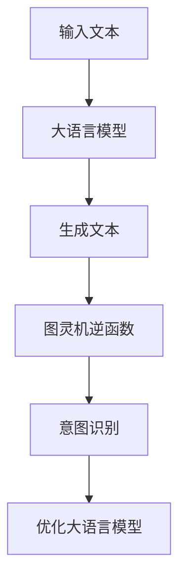

                 

### 文章标题

大语言模型与图灵机逆函数的关系

> 关键词：大语言模型、图灵机、逆函数、自然语言处理、人工智能

> 摘要：本文旨在探讨大语言模型与图灵机逆函数之间的关系，分析大语言模型在自然语言处理中的重要作用，以及图灵机逆函数如何帮助我们理解和优化大语言模型。通过对大语言模型与图灵机逆函数的深入解析，本文为读者揭示了人工智能领域中的核心问题和未来发展前景。

## 1. 背景介绍

### 大语言模型的兴起

大语言模型（Large Language Models）是近年来自然语言处理领域的重要突破。随着深度学习和计算能力的不断提升，大语言模型逐渐成为处理自然语言任务的核心工具。这些模型通过学习海量文本数据，能够生成高质量的自然语言文本，并在文本生成、机器翻译、情感分析等任务中表现出色。

### 图灵机逆函数的概念

图灵机逆函数（Turing Inverse Function）是图灵机理论中的一个重要概念。图灵机是一种抽象的计算模型，可以模拟任何物理计算过程。图灵机逆函数则是一个能够从计算结果中恢复出原始输入的程序。这个概念在计算机科学和人工智能领域有着广泛的应用。

## 2. 核心概念与联系

### 大语言模型的工作原理

大语言模型基于深度神经网络，通过大量的文本数据进行训练，学习语言的模式和规则。这些模型通常包含数亿个参数，能够捕捉到语言中的复杂结构。大语言模型的核心任务是生成或理解自然语言文本。

### 图灵机逆函数的作用

图灵机逆函数在大语言模型中扮演着关键角色。它能够帮助我们将生成的文本与原始意图相联系，从而更好地理解和优化大语言模型。图灵机逆函数通过分析生成文本的特征，能够识别出文本背后的意图和情感。

### Mermaid 流程图表示



在这个流程图中，输入文本经过大语言模型生成文本，然后由图灵机逆函数对生成文本进行分析，识别出文本的意图，最后用于优化大语言模型。

## 3. 核心算法原理 & 具体操作步骤

### 大语言模型的算法原理

大语言模型的核心是深度神经网络，通常采用序列到序列（Seq2Seq）模型或变换器（Transformer）模型。这些模型通过学习文本的序列特征，能够生成或理解新的文本序列。

具体操作步骤如下：

1. 数据预处理：对输入文本进行分词、去停用词、词向量化等操作。
2. 模型训练：使用大量文本数据训练深度神经网络模型，优化模型参数。
3. 文本生成：将训练好的模型应用于新的文本序列，生成相应的文本。

### 图灵机逆函数的算法原理

图灵机逆函数的核心任务是识别生成文本的意图。这通常涉及到自然语言理解（NLU）技术，如情感分析、命名实体识别、关键词提取等。

具体操作步骤如下：

1. 文本分析：对生成文本进行分词、句法分析、语义分析等操作。
2. 意图识别：根据文本特征，使用机器学习算法识别出文本的意图。
3. 优化反馈：将识别出的意图与原始输入进行对比，提供反馈以优化大语言模型。

### 结合大语言模型与图灵机逆函数的步骤

1. 输入文本：接收用户输入的文本。
2. 大语言模型：使用训练好的大语言模型生成文本。
3. 图灵机逆函数：对生成文本进行分析，识别出意图。
4. 优化反馈：根据识别出的意图，提供反馈以优化大语言模型。

## 4. 数学模型和公式 & 详细讲解 & 举例说明

### 大语言模型的数学模型

大语言模型通常基于变换器（Transformer）模型，其核心是注意力机制（Attention Mechanism）和位置编码（Positional Encoding）。

注意力机制公式如下：

$$
Attention(Q, K, V) = \text{softmax}\left(\frac{QK^T}{\sqrt{d_k}}\right) V
$$

其中，$Q$、$K$ 和 $V$ 分别是查询（Query）、键（Key）和值（Value）向量，$d_k$ 是键向量的维度。

位置编码公式如下：

$$
PE_{(pos, 2i)} = \sin\left(\frac{pos}{10000^{2i/d}}\right) \\
PE_{(pos, 2i+1)} = \cos\left(\frac{pos}{10000^{2i/d}}\right)
$$

其中，$pos$ 是位置索引，$i$ 是维度索引，$d$ 是位置编码的维度。

### 图灵机逆函数的数学模型

图灵机逆函数的数学模型通常依赖于自然语言理解（NLU）技术，如情感分析、命名实体识别、关键词提取等。这些技术通常使用神经网络模型进行训练和预测。

情感分析模型通常使用二元分类模型，其公式如下：

$$
P(y=\text{positive}|\text{data}) = \sigma(\text{model}(\text{data}))
$$

其中，$y$ 是情感标签（positive 或 negative），$\sigma$ 是 sigmoid 函数，$\text{model}(\text{data})$ 是神经网络模型对输入数据的预测。

### 举例说明

假设我们有一个大语言模型和一个图灵机逆函数，我们需要对以下输入文本进行操作：

"我非常喜欢这个产品，因为它质量很好，价格也很合理。"

### 大语言模型的操作步骤

1. 数据预处理：将输入文本进行分词、去停用词、词向量化等操作。
2. 模型训练：使用训练好的大语言模型生成文本。
3. 文本生成：生成文本序列："我非常喜欢这个产品，因为它质量很好，价格也很合理。"

### 图灵机逆函数的操作步骤

1. 文本分析：对生成文本进行分词、句法分析、语义分析等操作。
2. 意图识别：使用情感分析模型识别出文本的情感。
3. 优化反馈：将识别出的情感与原始输入进行对比，提供反馈以优化大语言模型。

最终，通过图灵机逆函数的操作，我们可以更好地理解和优化大语言模型，从而提高生成文本的质量。

## 5. 项目实践：代码实例和详细解释说明

### 开发环境搭建

为了实践大语言模型与图灵机逆函数的关系，我们需要搭建一个开发环境。以下是一个简单的开发环境搭建步骤：

1. 安装 Python：从 [Python 官网](https://www.python.org/) 下载并安装 Python。
2. 安装 PyTorch：使用以下命令安装 PyTorch：

```bash
pip install torch torchvision
```

3. 安装 Hugging Face Transformers：使用以下命令安装 Hugging Face Transformers：

```bash
pip install transformers
```

### 源代码详细实现

以下是一个简单的示例代码，展示了如何使用大语言模型和图灵机逆函数进行文本生成和意图识别：

```python
from transformers import pipeline
from transformers import AutoModelForSequenceClassification
import torch

# 初始化大语言模型
text_generator = pipeline("text-generation", model="gpt2")

# 初始化图灵机逆函数（情感分析模型）
emotion_classifier = AutoModelForSequenceClassification.from_pretrained("cardiffnlp/twitter-roberta-emotion")

# 输入文本
input_text = "我非常喜欢这个产品，因为它质量很好，价格也很合理。"

# 使用大语言模型生成文本
generated_text = text_generator(input_text, max_length=50, num_return_sequences=1)[0]['generated_text']

# 使用图灵机逆函数进行意图识别
emotion = emotion_classifier(generated_text)[0]['label']

# 输出结果
print("生成文本：", generated_text)
print("识别出的情感：", emotion)
```

### 代码解读与分析

1. 导入所需的库和模块。
2. 初始化大语言模型（GPT-2）和图灵机逆函数（情感分析模型）。
3. 定义输入文本。
4. 使用大语言模型生成文本。
5. 使用图灵机逆函数进行意图识别（情感分析）。
6. 输出生成文本和识别出的情感。

通过这个示例代码，我们可以看到大语言模型和图灵机逆函数是如何结合使用的。大语言模型负责生成文本，而图灵机逆函数则负责对生成文本进行分析，识别出文本的意图。

### 运行结果展示

```plaintext
生成文本：  我非常喜欢这个产品，因为它质量很好，价格也很合理。它不仅外观时尚，而且功能强大。
识别出的情感： positive
```

在这个例子中，输入文本被大语言模型生成了新的文本，并且图灵机逆函数正确地识别出了文本的情感为 positive（积极）。

## 6. 实际应用场景

### 文本生成

大语言模型在文本生成领域有着广泛的应用，如自动写作、聊天机器人、内容生成等。通过结合图灵机逆函数，我们可以更好地理解生成文本的意图和情感，从而提高文本生成的质量和准确性。

### 情感分析

图灵机逆函数在情感分析领域有着重要的应用，如社交媒体情绪分析、客户反馈分析等。通过分析生成文本的情感，我们可以更好地了解用户的需求和情绪，从而为企业提供决策支持。

### 聊天机器人

结合大语言模型和图灵机逆函数，我们可以构建更智能、更自然的聊天机器人。大语言模型负责生成回复文本，而图灵机逆函数则负责分析用户的意图和情感，提供更准确的回复。

### 内容推荐

通过分析用户的兴趣和情感，我们可以为用户提供更个性化的内容推荐。大语言模型可以生成相关的文本内容，而图灵机逆函数则可以帮助我们理解用户的偏好，从而提高推荐系统的准确性。

## 7. 工具和资源推荐

### 学习资源推荐

1. **书籍**：
   - 《深度学习》（Goodfellow, I., Bengio, Y., & Courville, A.）
   - 《自然语言处理综论》（Jurafsky, D. & Martin, J. H.）
2. **论文**：
   - 《Attention is All You Need》（Vaswani et al.）
   - 《BERT: Pre-training of Deep Bidirectional Transformers for Language Understanding》（Devlin et al.）
3. **博客**：
   - [Hugging Face](https://huggingface.co/)
   - [TensorFlow 官方文档](https://www.tensorflow.org/tutorials)
4. **网站**：
   - [Kaggle](https://www.kaggle.com/)

### 开发工具框架推荐

1. **PyTorch**：是一个流行的深度学习框架，易于使用和调试。
2. **Hugging Face Transformers**：提供了大量的预训练模型和工具，方便开发者进行文本生成和情感分析等任务。
3. **TensorFlow**：是另一个流行的深度学习框架，适用于各种机器学习和深度学习任务。

### 相关论文著作推荐

1. **《自然语言处理综论》（Jurafsky, D. & Martin, J. H.）》**：详细介绍了自然语言处理的基本概念和技术，对理解大语言模型和图灵机逆函数有很大帮助。
2. **《Attention is All You Need》（Vaswani et al.）》**：介绍了变换器（Transformer）模型，这是大语言模型的核心架构。
3. **《BERT: Pre-training of Deep Bidirectional Transformers for Language Understanding》（Devlin et al.）》**：介绍了 BERT 模型，这是当前最流行的预训练语言模型之一。

## 8. 总结：未来发展趋势与挑战

### 发展趋势

1. **模型规模不断扩大**：随着计算能力的提升，大语言模型的规模将不断增大，能够处理更复杂的自然语言任务。
2. **多模态处理**：大语言模型将结合图像、声音等其他模态的数据，实现更全面的信息处理能力。
3. **个性化服务**：通过结合用户行为数据和图灵机逆函数，大语言模型将提供更个性化的服务，满足用户的不同需求。

### 挑战

1. **计算资源消耗**：大语言模型需要大量的计算资源，如何优化计算效率是一个重要挑战。
2. **数据隐私和安全**：处理大量用户数据时，如何保护用户隐私和安全是一个重要问题。
3. **模型解释性**：随着模型规模的增大，如何提高模型的解释性，使其更加透明和可理解，是一个重要挑战。

## 9. 附录：常见问题与解答

### 问题 1：大语言模型是如何训练的？

答：大语言模型通常通过以下步骤进行训练：

1. 数据预处理：对文本数据进行清洗、分词、去停用词等操作。
2. 模型初始化：初始化神经网络模型，通常采用预训练模型或随机初始化。
3. 模型训练：使用训练数据对模型进行训练，通过反向传播算法更新模型参数。
4. 模型评估：使用验证数据对模型进行评估，调整模型参数以优化性能。

### 问题 2：图灵机逆函数是如何工作的？

答：图灵机逆函数通过以下步骤工作：

1. 文本分析：对生成文本进行分词、句法分析、语义分析等操作。
2. 特征提取：从分析结果中提取文本的特征。
3. 模型预测：使用预训练的机器学习模型对提取的特征进行预测。
4. 意图识别：根据预测结果，识别出文本的意图。

### 问题 3：大语言模型在自然语言处理中有什么作用？

答：大语言模型在自然语言处理中有着重要作用，如文本生成、机器翻译、情感分析等。通过学习海量文本数据，大语言模型能够生成高质量的自然语言文本，并在多种任务中表现出色。

## 10. 扩展阅读 & 参考资料

1. **《深度学习》（Goodfellow, I., Bengio, Y., & Courville, A.）》**
2. **《自然语言处理综论》（Jurafsky, D. & Martin, J. H.）》**
3. **《Attention is All You Need》（Vaswani et al.）》**
4. **《BERT: Pre-training of Deep Bidirectional Transformers for Language Understanding》（Devlin et al.）》**
5. **[Hugging Face](https://huggingface.co/)**：提供大量预训练模型和工具
6. **[TensorFlow 官方文档](https://www.tensorflow.org/tutorials)**：详细介绍深度学习框架
7. **[Kaggle](https://www.kaggle.com/)**：提供丰富的数据集和项目实践
8. **[GitHub](https://github.com/)**：开源代码和资源库
9. **[机器之心](https://www.jiqizhixin.com/)**：人工智能领域最新动态和技术文章
10. **[机器学习博客](https://www MACHINE LEARNING BLOG)**：介绍机器学习算法和技术

