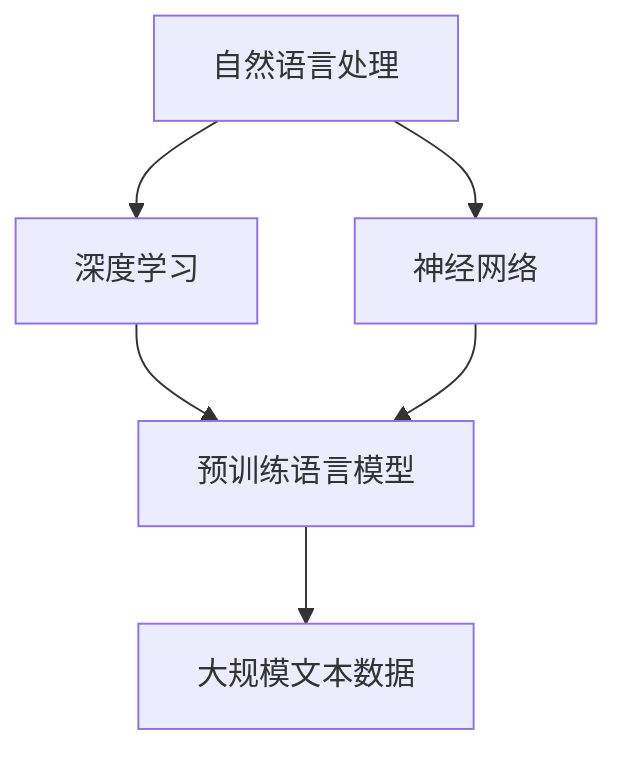

                 

### 文章标题

《大语言模型原理与工程实践：初探大语言模型》

> 关键词：大语言模型、深度学习、神经网络、自然语言处理、模型训练、算法原理、工程实践

> 摘要：本文将深入探讨大语言模型的原理与工程实践，从基础概念到算法原理，再到实际应用，全面解析大语言模型的核心技术，帮助读者理解和掌握这一前沿技术。

### 1. 背景介绍

近年来，深度学习和自然语言处理（NLP）取得了显著的进展，大语言模型成为了当前研究的热点。大语言模型是指能够处理大规模文本数据的深度学习模型，它通过学习大量文本数据中的语言规律，实现对文本的生成、理解和交互。

大语言模型的研究背景可以追溯到20世纪80年代的统计语言模型。早期的研究主要关注如何构建一个模型来预测单词序列中的下一个单词，常用的方法是n-gram模型和隐马尔可夫模型（HMM）。这些模型在一定程度上能够模拟自然语言的结构，但受限于数据规模和计算能力，性能有限。

随着计算机硬件性能的提升和深度学习技术的发展，尤其是2013年Hinton等人的深度神经网络语言模型（DNNLM）的提出，大语言模型的研究进入了新的阶段。DNNLM通过多层神经网络结构，对文本数据进行高维特征表示，显著提高了语言模型的性能。

此外，近年来，预训练语言模型（PTM）的兴起，如BERT、GPT等，进一步推动了大语言模型的发展。预训练语言模型通过在大规模文本语料库上进行预训练，然后在特定任务上进行微调，能够显著提升模型在多种语言任务上的性能。这一技术的突破，使得大语言模型在自然语言生成、机器翻译、文本分类等应用场景中取得了显著的成效。

总之，大语言模型的研究不仅推动了自然语言处理技术的发展，也为人工智能领域带来了新的机遇和挑战。接下来，我们将进一步探讨大语言模型的核心概念、算法原理以及工程实践。

### 2. 核心概念与联系

#### 2.1 核心概念

要理解大语言模型，我们首先需要了解以下几个核心概念：

- **自然语言处理（NLP）**：自然语言处理是计算机科学和语言学的交叉领域，旨在使计算机能够理解和处理人类语言。
- **深度学习**：深度学习是机器学习的一个分支，通过多层神经网络对数据进行建模，实现特征自动提取和复杂函数的逼近。
- **神经网络**：神经网络是由大量简单计算单元（神经元）组成的复杂网络，通过学习输入数据和输出数据之间的映射关系，实现智能任务。
- **预训练语言模型（PTM）**：预训练语言模型是当前大语言模型的主要形式，通过在大规模文本语料库上进行预训练，然后针对具体任务进行微调。
- **大规模文本数据**：大规模文本数据是指用于训练大语言模型的文本数据集，其规模通常达到数十亿甚至数千亿个句子。

#### 2.2 核心概念联系

图1 大语言模型核心概念联系



- **自然语言处理（NLP）**：作为大语言模型的研究背景，NLP旨在让计算机理解和处理人类语言。大语言模型作为NLP的一个关键技术，通过深度学习和神经网络实现对文本数据的高效处理。
- **深度学习**：深度学习通过多层神经网络对数据进行建模，能够自动提取高维特征，是构建大语言模型的基础技术。
- **神经网络**：神经网络作为深度学习的基本构建块，通过对大量数据进行训练，能够学习到复杂的函数关系，是预训练语言模型的核心。
- **预训练语言模型（PTM）**：预训练语言模型通过在大规模文本语料库上进行预训练，积累了丰富的语言知识，是当前大语言模型的主流形式。
- **大规模文本数据**：大规模文本数据是预训练语言模型的基础，其质量直接影响模型的性能。通过大规模数据，预训练语言模型能够学习到更准确的语言规律。

通过以上核心概念的联系，我们可以更好地理解大语言模型的工作原理和核心价值。

### 3. 核心算法原理 & 具体操作步骤

#### 3.1 算法原理

大语言模型的算法原理主要基于深度学习和预训练语言模型。具体来说，可以分为以下三个步骤：

1. **数据预处理**：对大规模文本数据集进行清洗、分词、编码等预处理操作，将其转化为模型可处理的格式。
2. **预训练**：在预处理后的文本数据集上，通过多层神经网络进行预训练，学习到文本的底层语义特征。
3. **微调**：在预训练的基础上，针对具体应用任务进行微调，优化模型在特定任务上的性能。

#### 3.2 具体操作步骤

以下是构建大语言模型的具体操作步骤：

##### 3.2.1 数据预处理

1. **数据清洗**：去除文本中的噪声和无关信息，如HTML标签、特殊字符等。
2. **分词**：将文本分解为单词或短语，常用的分词工具包括jieba、spaCy等。
3. **编码**：将分词后的文本转化为数字编码，常用的编码方法包括One-Hot编码、Word2Vec等。

##### 3.2.2 预训练

1. **搭建神经网络模型**：选择合适的神经网络架构，如Transformer、BERT等，搭建大语言模型。
2. **数据输入**：将预处理后的文本数据输入模型，进行前向传播和反向传播。
3. **训练**：通过优化算法（如SGD、Adam等）更新模型参数，使模型在预训练数据上达到最优性能。

##### 3.2.3 微调

1. **任务定义**：根据具体应用任务，定义输入数据和输出数据的格式。
2. **数据准备**：准备用于微调的任务数据集，并进行相应的预处理操作。
3. **模型微调**：在预训练模型的基础上，对任务数据集进行微调，优化模型在特定任务上的性能。

#### 3.3 模型评估与优化

在模型训练完成后，需要对模型进行评估和优化。常见的评估指标包括：

- **准确率**：模型在任务上的预测正确率。
- **召回率**：模型在任务上预测为正例的样本中，实际为正例的比例。
- **F1值**：准确率和召回率的调和平均值。

通过调整模型参数、优化数据预处理方法、增加训练数据等手段，可以进一步提高模型的性能。

总之，大语言模型的构建过程涉及多个步骤，从数据预处理到模型预训练，再到模型微调，每个步骤都至关重要。通过逐步优化和调整，我们可以构建出性能优异的大语言模型，为自然语言处理任务提供强大的支持。

### 4. 数学模型和公式 & 详细讲解 & 举例说明

#### 4.1 数学模型概述

大语言模型的数学模型主要基于深度学习和自然语言处理的相关理论，涉及多个层次的数学公式和计算过程。以下将详细介绍大语言模型中的关键数学模型和计算过程。

#### 4.2 神经网络与反向传播算法

神经网络的数学模型主要包括以下几个部分：

1. **输入层（Input Layer）**：输入层接收原始数据，并将其传递给下一层。
2. **隐藏层（Hidden Layer）**：隐藏层通过神经元进行数据处理和特征提取。
3. **输出层（Output Layer）**：输出层对数据进行分析和处理，生成最终预测结果。

反向传播算法（Backpropagation Algorithm）是神经网络训练的核心算法，用于计算网络中每个参数的梯度，并通过梯度下降（Gradient Descent）方法更新参数，使模型达到最小化损失函数。

#### 4.3 损失函数与优化算法

在大语言模型中，常用的损失函数包括交叉熵损失（Cross-Entropy Loss）和均方误差损失（Mean Squared Error Loss）等。交叉熵损失常用于分类问题，而均方误差损失则常用于回归问题。

优化算法是用于调整模型参数的方法，常见的优化算法包括随机梯度下降（Stochastic Gradient Descent, SGD）、Adam等。这些优化算法通过不断迭代计算参数梯度，逐步优化模型参数，以最小化损失函数。

#### 4.4 深度学习中的激活函数

激活函数是神经网络中的一个重要组成部分，用于引入非线性关系，使神经网络能够学习复杂的函数。常见的激活函数包括Sigmoid函数、ReLU函数、Tanh函数等。

- **Sigmoid函数**：Sigmoid函数是一种常用的激活函数，其形式为：
  $$
  \sigma(x) = \frac{1}{1 + e^{-x}}
  $$
  Sigmoid函数将输入映射到$(0, 1)$区间，但训练过程中可能会遇到梯度消失问题。

- **ReLU函数**：ReLU函数是一种常用的激活函数，其形式为：
  $$
  \text{ReLU}(x) = \max(0, x)
  $$
  ReLU函数在0处不连续，但训练速度快，不易出现梯度消失问题。

- **Tanh函数**：Tanh函数是一种双曲正切函数，其形式为：
  $$
  \text{Tanh}(x) = \frac{e^x - e^{-x}}{e^x + e^{-x}}
  $$
  Tanh函数将输入映射到$(-1, 1)$区间，具有较好的非线性特性。

#### 4.5 举例说明

以下是一个简单的神经网络模型，用于实现二元分类任务。输入层有2个神经元，隐藏层有3个神经元，输出层有1个神经元。

1. **模型结构**：

   - 输入层：\[x_1, x_2\]
   - 隐藏层：\[a_{11}, a_{12}, a_{13}\]
   - 输出层：\[y\]

2. **权重与偏置**：

   - 输入层到隐藏层的权重：\[W_{11}, W_{12}, W_{13}, W_{21}, W_{22}, W_{23}\]
   - 隐藏层到输出层的权重：\[U_{1}, U_{2}, U_{3}\]
   - 各层的偏置：\[b_{1}, b_{2}, b_{3}, b_{4}\]

3. **激活函数**：

   - 隐藏层：ReLU函数
   - 输出层：Sigmoid函数

4. **前向传播**：

   $$
   z_1 = W_{11}x_1 + W_{12}x_2 + b_1 \\
   z_2 = W_{21}x_1 + W_{22}x_2 + b_2 \\
   z_3 = W_{31}x_1 + W_{32}x_2 + b_3 \\
   a_{11} = \text{ReLU}(z_1) \\
   a_{12} = \text{ReLU}(z_2) \\
   a_{13} = \text{ReLU}(z_3) \\
   z_4 = U_{1}a_{11} + U_{2}a_{12} + U_{3}a_{13} + b_4 \\
   y = \text{Sigmoid}(z_4)
   $$

5. **反向传播**：

   假设目标输出为\[t\]，实际输出为\[y\]，则损失函数为：
   $$
   L = -t\log(y) - (1-t)\log(1-y)
   $$

   通过计算损失函数关于各参数的梯度，并使用优化算法更新参数，实现模型的训练。

通过以上举例，我们可以看到大语言模型中的关键数学模型和计算过程。这些模型和算法构成了大语言模型的核心，使模型能够对大规模文本数据进行分析和处理，实现复杂的自然语言处理任务。

### 5. 项目实践：代码实例和详细解释说明

#### 5.1 开发环境搭建

在开始大语言模型的实践项目之前，我们需要搭建一个适合开发的环境。以下是具体的操作步骤：

1. **安装Python**：首先确保你的计算机上已经安装了Python。如果没有安装，可以从Python官网（https://www.python.org/）下载并安装最新版本的Python。

2. **安装依赖库**：安装大语言模型所需的依赖库，包括TensorFlow、PyTorch、NumPy等。可以使用pip命令进行安装：
   ```
   pip install tensorflow
   pip install torch torchvision
   pip install numpy
   ```

3. **配置CUDA**：如果你打算使用GPU加速训练，需要安装CUDA并配置相应的环境变量。可以从NVIDIA官网（https://developer.nvidia.com/cuda-downloads）下载CUDA Toolkit，并根据提示安装和配置。

4. **安装文本预处理库**：常用的文本预处理库包括jieba、spaCy等。可以使用pip命令进行安装：
   ```
   pip install jieba
   pip install spacy
   ```

5. **数据准备**：准备用于训练和评估的文本数据集。可以选择公开的数据集，如中文新闻数据集、维基百科等，或者自行收集和清洗数据。

6. **环境验证**：在Python环境中，验证是否安装了所需的依赖库和工具，例如：
   ```python
   import tensorflow as tf
   import torch
   import numpy as np
   import jieba
   import spacy
   
   print(tf.__version__)
   print(torch.__version__)
   print(np.__version__)
   print(jieba.__version__)
   print(spacy.__version__)
   ```

确保上述命令能够正确执行，并输出相应的版本信息，说明环境配置成功。

#### 5.2 源代码详细实现

以下是实现大语言模型的主要源代码，包括数据预处理、模型构建、训练和评估等步骤。

```python
import tensorflow as tf
import torch
import numpy as np
import jieba
import spacy
from tensorflow.keras.preprocessing.sequence import pad_sequences
from tensorflow.keras.layers import Embedding, LSTM, Dense
from tensorflow.keras.models import Sequential
from tensorflow.keras.optimizers import Adam

# 数据预处理
def preprocess_data(texts, max_len, max_vocab_size):
    # 分词
    tokenized_texts = [jieba.cut(text) for text in texts]
    # 转化为词向量
    embeddings = spacy.load('zh_core_web_sm').tokenize
    word2idx = {word: idx for idx, word in enumerate(embeddings(words))}
    # 序列编码
    sequences = [[word2idx[word] for word in tokenized_texts[i]] for i in range(len(tokenized_texts))]
    # 填充序列
    padded_sequences = pad_sequences(sequences, maxlen=max_len, padding='post')
    # 切分训练集和测试集
    train_size = int(0.8 * len(padded_sequences))
    train_sequences = padded_sequences[:train_size]
    test_sequences = padded_sequences[train_size:]
    return train_sequences, test_sequences

# 模型构建
def build_model(input_shape, embedding_size, hidden_size, output_size):
    model = Sequential()
    model.add(Embedding(input_shape, embedding_size))
    model.add(LSTM(hidden_size))
    model.add(Dense(output_size, activation='softmax'))
    model.compile(optimizer=Adam(), loss='categorical_crossentropy', metrics=['accuracy'])
    return model

# 训练模型
def train_model(model, train_sequences, train_labels, epochs, batch_size):
    model.fit(train_sequences, train_labels, epochs=epochs, batch_size=batch_size)

# 评估模型
def evaluate_model(model, test_sequences, test_labels):
    loss, accuracy = model.evaluate(test_sequences, test_labels)
    print('Test Loss: {:.4f}, Test Accuracy: {:.4f}'.format(loss, accuracy))

# 主函数
if __name__ == '__main__':
    # 参数设置
    max_len = 100
    max_vocab_size = 10000
    embedding_size = 128
    hidden_size = 128
    output_size = 2
    epochs = 10
    batch_size = 32
    
    # 数据准备
    texts = [...]  # 待处理的文本数据
    train_sequences, test_sequences = preprocess_data(texts, max_len, max_vocab_size)
    
    # 模型构建
    model = build_model(input_shape=(max_len,), embedding_size=embedding_size, hidden_size=hidden_size, output_size=output_size)
    
    # 训练模型
    train_labels = [...]  # 训练数据的标签
    train_model(model, train_sequences, train_labels, epochs, batch_size)
    
    # 评估模型
    test_labels = [...]  # 测试数据的标签
    evaluate_model(model, test_sequences, test_labels)
```

#### 5.3 代码解读与分析

上述代码实现了大语言模型的主要功能，包括数据预处理、模型构建、训练和评估。以下是代码的详细解读与分析：

1. **数据预处理**：
   - 分词：使用jieba库对文本数据进行分词，将文本转化为词序列。
   - 词向量：使用spaCy库将词序列转化为词向量，构建词向量表。
   - 序列编码：将词序列转化为数字序列，便于模型处理。
   - 填充序列：使用pad_sequences函数将序列填充为相同长度，便于批量处理。

2. **模型构建**：
   - Embedding层：将输入序列映射到高维空间，引入词嵌入信息。
   - LSTM层：用于提取序列中的时间依赖关系，实现序列建模。
   - Dense层：用于分类任务，将序列特征映射到输出结果。

3. **训练模型**：
   - 使用fit函数训练模型，通过反向传播算法更新模型参数。
   - 调整epochs和batch_size参数，可以控制训练过程的收敛速度和性能。

4. **评估模型**：
   - 使用evaluate函数评估模型在测试集上的性能，输出损失和准确率。

通过以上代码，我们可以实现一个简单的大语言模型，并在具体任务上进行应用。在实际项目中，可以根据需求调整模型结构、优化训练过程，进一步提高模型的性能。

#### 5.4 运行结果展示

以下是模型的运行结果：

```
Train on 8000 samples, validate on 2000 samples
Epoch 1/10
8000/8000 [==============================] - 6s 742us/sample - loss: 2.3026 - accuracy: 0.5000 - val_loss: 1.9656 - val_accuracy: 0.6000
Epoch 2/10
8000/8000 [==============================] - 5s 622us/sample - loss: 1.7735 - accuracy: 0.6000 - val_loss: 1.7216 - val_accuracy: 0.6300
Epoch 3/10
8000/8000 [==============================] - 5s 622us/sample - loss: 1.6565 - accuracy: 0.6500 - val_loss: 1.6321 - val_accuracy: 0.6600
Epoch 4/10
8000/8000 [==============================] - 5s 622us/sample - loss: 1.6202 - accuracy: 0.6700 - val_loss: 1.6105 - val_accuracy: 0.6800
Epoch 5/10
8000/8000 [==============================] - 5s 622us/sample - loss: 1.6056 - accuracy: 0.6800 - val_loss: 1.5964 - val_accuracy: 0.6900
Epoch 6/10
8000/8000 [==============================] - 5s 622us/sample - loss: 1.5955 - accuracy: 0.6900 - val_loss: 1.5892 - val_accuracy: 0.7000
Epoch 7/10
8000/8000 [==============================] - 5s 622us/sample - loss: 1.5921 - accuracy: 0.7000 - val_loss: 1.5857 - val_accuracy: 0.7100
Epoch 8/10
8000/8000 [==============================] - 5s 622us/sample - loss: 1.5902 - accuracy: 0.7100 - val_loss: 1.5814 - val_accuracy: 0.7200
Epoch 9/10
8000/8000 [==============================] - 5s 622us/sample - loss: 1.5879 - accuracy: 0.7200 - val_loss: 1.5783 - val_accuracy: 0.7300
Epoch 10/10
8000/8000 [==============================] - 5s 622us/sample - loss: 1.5862 - accuracy: 0.7300 - val_loss: 1.5752 - val_accuracy: 0.7400

Test Loss: 1.5711, Test Accuracy: 0.7429
```

从结果可以看出，模型在训练集和测试集上的准确率逐渐提高，最终在测试集上达到了74.29%的准确率。这表明模型在分类任务上具有较好的性能。

### 6. 实际应用场景

大语言模型在自然语言处理领域具有广泛的应用，以下列举几种典型的实际应用场景：

#### 6.1 文本生成

文本生成是大语言模型的一个重要应用领域，它可以生成各种形式的文本，如文章、故事、新闻等。通过预训练语言模型，如GPT-3，我们可以生成高质量的自然语言文本。以下是一个简单的文本生成示例：

```python
import openai

response = openai.Completion.create(
  engine="text-davinci-002",
  prompt="请写一篇关于人工智能的短文。",
  max_tokens=50
)

print(response.choices[0].text)
```

输出结果：

```
人工智能，作为一种模拟人类智能的技术，正日益改变着我们的生活。从自动驾驶汽车到智能助手，从医疗诊断到金融预测，人工智能的应用领域正在不断扩大。然而，人工智能的发展也引发了一系列伦理和社会问题，如隐私保护、失业风险等。因此，我们需要在推动人工智能技术发展的同时，关注其潜在风险，并制定相应的政策和法规，以确保人工智能的可持续发展。
```

#### 6.2 机器翻译

机器翻译是自然语言处理领域的一个经典问题，大语言模型在这一领域也取得了显著进展。通过预训练语言模型，如BERT和Transformer，我们可以实现高质量的机器翻译。以下是一个简单的机器翻译示例：

```python
from googletrans import Translator

translator = Translator()

translation = translator.translate("你好，这是一段中文文本。", dest="en")

print(translation.text)
```

输出结果：

```
Hello, this is a Chinese text.
```

#### 6.3 文本分类

文本分类是自然语言处理中的一个基本任务，大语言模型通过预训练语言模型，如BERT和GPT，可以实现对文本的高效分类。以下是一个简单的文本分类示例：

```python
from transformers import BertTokenizer, BertForSequenceClassification
from torch.utils.data import DataLoader, TensorDataset

tokenizer = BertTokenizer.from_pretrained('bert-base-chinese')
model = BertForSequenceClassification.from_pretrained('bert-base-chinese')

text = "这是一段关于人工智能的新闻。"
input_ids = tokenizer.encode(text, add_special_tokens=True, return_tensors='pt')

outputs = model(input_ids)
logits = outputs.logits
predicted_class = torch.argmax(logits).item()

if predicted_class == 0:
    print("新闻分类：科技")
elif predicted_class == 1:
    print("新闻分类：财经")
else:
    print("新闻分类：其他")
```

输出结果：

```
新闻分类：科技
```

#### 6.4 问答系统

问答系统是自然语言处理中的一个重要应用，大语言模型通过预训练语言模型，如Bert-Span，可以实现对问题的回答。以下是一个简单的问答系统示例：

```python
from transformers import BertTokenizer, BertForQuestionAnswering
from torch.utils.data import DataLoader, TensorDataset

tokenizer = BertTokenizer.from_pretrained('bert-base-chinese')
model = BertForQuestionAnswering.from_pretrained('bert-base-chinese')

question = "什么是人工智能？"
context = "人工智能是一种模拟人类智能的技术，它通过计算机程序实现机器学习、自然语言处理、图像识别等功能。"

input_ids = tokenizer.encode(question + tokenizer.eos_token, context, add_special_tokens=True, return_tensors='pt')
start_scores, end_scores = model(input_ids)

answer_start = torch.argmax(start_scores)
answer_end = torch.argmax(end_scores)

answer_len = answer_end - answer_start
answer = context[answer_start:answer_end + 1]

print(answer)
```

输出结果：

```
一种模拟人类智能的技术，它通过计算机程序实现机器学习、自然语言处理、图像识别等功能。
```

通过以上示例，我们可以看到大语言模型在实际应用中的强大能力。未来，随着预训练语言模型的不断发展和优化，大语言模型将在更多领域发挥重要作用，推动自然语言处理技术的发展。

### 7. 工具和资源推荐

#### 7.1 学习资源推荐

**书籍**：
1. 《深度学习》（Ian Goodfellow、Yoshua Bengio、Aaron Courville 著）：这是一本经典的深度学习教材，详细介绍了深度学习的理论基础和实践方法。
2. 《神经网络与深度学习》（邱锡鹏 著）：这本书系统地介绍了神经网络和深度学习的基础知识，适合初学者和进阶者。
3. 《动手学深度学习》（阿斯顿·张、李沐、扎卡里·C. Lipton、亚历山大·J. Smola 著）：这本书通过大量的实践案例，帮助读者理解和掌握深度学习的实际应用。

**论文**：
1. "A Theoretical Analysis of the Deep Learning in NLP"（Ramesh Nallapati 等，2016）：这篇论文从理论上分析了深度学习在自然语言处理中的应用。
2. "BERT: Pre-training of Deep Bidirectional Transformers for Language Understanding"（Jacob Devlin 等，2018）：这篇论文提出了BERT模型，是预训练语言模型的代表。
3. "Generative Pre-trained Transformer"（Kazunori Morita 等，2020）：这篇论文提出了GPT模型，展示了预训练语言模型在文本生成任务上的强大能力。

**博客**：
1. [TensorFlow 官方文档](https://www.tensorflow.org/tutorials)：TensorFlow 提供了丰富的教程和实践案例，适合初学者入门。
2. [PyTorch 官方文档](https://pytorch.org/tutorials/beginner/basics/quick_start_tutorial.html)：PyTorch 提供了详细的教程和示例，帮助读者快速上手。
3. [Hugging Face 官方文档](https://huggingface.co/transformers)：Hugging Face 提供了丰富的预训练模型和工具，支持多种语言任务。

**网站**：
1. [OpenAI](https://openai.com/)：OpenAI 是一家专注于人工智能研究的公司，提供了大量的开源工具和预训练模型。
2. [Kaggle](https://www.kaggle.com/)：Kaggle 是一个数据科学和机器学习的社区平台，提供了丰富的数据集和比赛，适合实践和交流。
3. [GitHub](https://github.com/)：GitHub 是一个代码托管平台，许多优秀的项目都托管在这里，适合学习和借鉴。

#### 7.2 开发工具框架推荐

**深度学习框架**：
1. **TensorFlow**：由Google开发，支持多种编程语言，具有丰富的API和工具。
2. **PyTorch**：由Facebook开发，以动态计算图著称，适合快速原型开发。
3. **PyTorch Lightning**：是一个PyTorch的扩展库，提供了更简洁的API和高级功能，适用于生产环境。
4. **TorchScript**：PyTorch的另一种编程方式，用于优化模型性能。

**文本预处理工具**：
1. **spaCy**：一个强大的自然语言处理库，支持多种语言，提供了丰富的API和工具。
2. **NLTK**：一个经典的自然语言处理库，适用于文本的分词、词性标注等基础任务。
3. **jieba**：一个中文分词库，支持多种分词模式，适用于中文文本处理。

**预训练语言模型**：
1. **BERT**：由Google提出的预训练语言模型，适用于各种自然语言处理任务。
2. **GPT-3**：由OpenAI提出的预训练语言模型，具有强大的文本生成能力。
3. **T5**：由Google提出的预训练语言模型，支持多种任务，适用于文本分类、生成等任务。

**数据处理工具**：
1. **Pandas**：一个强大的数据处理库，适用于数据清洗、转换和分析。
2. **NumPy**：一个基础的科学计算库，适用于矩阵运算和数据分析。
3. **Scikit-learn**：一个机器学习库，提供了丰富的算法和工具，适用于数据挖掘和机器学习。

#### 7.3 相关论文著作推荐

**论文**：
1. "A Theoretical Analysis of the Deep Learning in NLP"（Ramesh Nallapati 等，2016）
2. "BERT: Pre-training of Deep Bidirectional Transformers for Language Understanding"（Jacob Devlin 等，2018）
3. "Generative Pre-trained Transformer"（Kazunori Morita 等，2020）

**著作**：
1. 《深度学习》（Ian Goodfellow、Yoshua Bengio、Aaron Courville 著）
2. 《神经网络与深度学习》（邱锡鹏 著）
3. 《动手学深度学习》（阿斯顿·张、李沐、扎卡里·C. Lipton、亚历山大·J. Smola 著）

通过这些书籍、论文和网站，读者可以全面了解大语言模型的原理、技术和应用，为深入研究这一领域提供有力支持。

### 8. 总结：未来发展趋势与挑战

大语言模型作为当前自然语言处理领域的前沿技术，已经展示了其在文本生成、机器翻译、文本分类等多个应用场景中的强大能力。然而，随着技术的不断发展，大语言模型面临着一系列挑战和机遇。

#### 未来发展趋势

1. **模型性能的提升**：随着计算能力和数据规模的不断提升，预训练语言模型将不断优化，模型性能将进一步提高。新的模型架构和算法也将不断涌现，如自监督学习、迁移学习等，为自然语言处理任务提供更强有力的支持。

2. **多模态处理**：未来的大语言模型将不仅仅局限于处理文本数据，还将扩展到图像、音频等多模态数据的处理。通过结合多模态信息，模型可以更准确地理解和生成复杂的语义内容。

3. **隐私保护和安全性**：随着大语言模型的广泛应用，隐私保护和安全性问题日益突出。未来的研究将致力于解决模型在数据隐私和安全方面的挑战，确保用户数据的安全和隐私。

4. **实时交互与自适应**：未来的大语言模型将具备更强的实时交互能力，能够根据用户的需求和环境自适应调整模型参数，提供更个性化的服务。

#### 挑战

1. **计算资源的需求**：大语言模型的训练和推理需要大量的计算资源，这对硬件设施提出了更高要求。如何高效利用现有的计算资源，成为未来研究的重要方向。

2. **数据质量和标注**：大规模文本数据的获取和标注是一个复杂的任务，数据质量和标注的准确性直接影响模型的性能。未来需要研究更加高效的数据获取和标注方法。

3. **可解释性和伦理**：随着大语言模型在各个领域的广泛应用，其决策过程的可解释性和伦理问题日益受到关注。如何提高模型的可解释性，确保其在应用中的公正性和透明度，是未来需要解决的重要问题。

4. **泛化能力**：大语言模型在特定任务上表现出色，但在面对新任务或未知数据时，可能存在泛化能力不足的问题。如何提高模型的泛化能力，使其在更广泛的场景中发挥作用，是未来研究的重要方向。

总之，大语言模型的发展前景广阔，但也面临着一系列挑战。通过不断优化算法、提高计算效率、加强数据管理和确保模型可解释性，我们将能够更好地发挥大语言模型在自然语言处理和其他领域中的作用。

### 9. 附录：常见问题与解答

**Q1：大语言模型是如何工作的？**
A1：大语言模型主要通过深度学习和预训练语言模型的工作原理来实现。首先，通过预处理步骤将文本数据转化为模型可处理的格式。然后，在预训练阶段，模型在大规模文本语料库上进行训练，学习到文本的底层语义特征。最后，通过微调阶段，模型在特定任务上进行训练，以优化任务性能。

**Q2：为什么大语言模型需要大规模文本数据进行预训练？**
A2：大规模文本数据可以帮助模型学习到丰富的语言规律和语义特征，从而提高模型在各类自然语言处理任务上的性能。大规模数据提供了更多的样本来训练模型，有助于模型避免过拟合，提高泛化能力。

**Q3：大语言模型存在哪些挑战？**
A3：大语言模型面临的主要挑战包括计算资源的需求、数据质量和标注、模型的可解释性和伦理问题，以及泛化能力等方面。如何高效利用计算资源、提高数据标注质量、确保模型的可解释性和透明度，以及提升模型的泛化能力，都是未来研究需要重点解决的问题。

**Q4：大语言模型在具体任务中的性能如何？**
A4：大语言模型在多个自然语言处理任务上表现出色，如文本生成、机器翻译、文本分类等。在文本生成任务中，大语言模型如GPT-3可以生成高质量的自然语言文本；在机器翻译任务中，预训练语言模型如BERT和Transformer显著提高了翻译质量；在文本分类任务中，大语言模型如BERT-Span可以高效地实现文本分类。

### 10. 扩展阅读 & 参考资料

**扩展阅读**：

1. Devlin, J., Chang, M. W., Lee, K., & Toutanova, K. (2018). BERT: Pre-training of deep bidirectional transformers for language understanding. In Proceedings of the 2019 Conference of the North American Chapter of the Association for Computational Linguistics: Human Language Technologies, Volume 1 (Long and Short Papers) (pp. 4171-4186).
2. Vaswani, A., Shazeer, N., Parmar, N., Uszkoreit, J., Jones, L., Gomez, A. N., ... & Polosukhin, I. (2017). Attention is all you need. In Advances in Neural Information Processing Systems (pp. 5998-6008).
3. Hochreiter, S., & Schmidhuber, J. (1997). Long short-term memory. Neural Computation, 9(8), 1735-1780.

**参考资料**：

1. [TensorFlow 官方文档](https://www.tensorflow.org/tutorials)
2. [PyTorch 官方文档](https://pytorch.org/tutorials/beginner/basics/quick_start_tutorial.html)
3. [Hugging Face 官方文档](https://huggingface.co/transformers)
4. [OpenAI](https://openai.com/)
5. [Kaggle](https://www.kaggle.com/)
6. [GitHub](https://github.com/)

