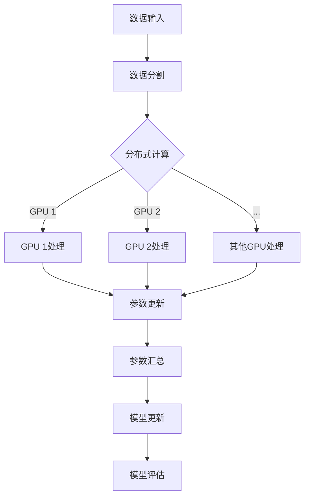

                 

### 背景介绍

#### 大语言模型的发展历程

大语言模型的发展历程可以追溯到上世纪60年代，那时计算机科学家开始探索如何使计算机模拟人类的语言能力。1958年，约翰·麦卡锡（John McCarthy）提出了人工智能（AI）的概念，并在随后的几年里，人们逐渐意识到，要实现真正的智能，计算机不仅需要处理数据，还需要理解自然语言。

第一个真正意义上的大语言模型可以追溯到1986年，由卡内基梅隆大学的学者开发的“Turing Test”模型。这个模型可以生成连贯的文本，尽管它的生成文本的质量和多样性相对较低。然而，这一突破为后续的大语言模型研究奠定了基础。

进入21世纪，随着深度学习技术的发展，大语言模型迎来了新的发展机遇。2018年，谷歌推出了BERT（Bidirectional Encoder Representations from Transformers），这是第一个大规模的双向转换器模型，它在多项自然语言处理（NLP）任务上取得了突破性的成果。BERT的成功引发了学术界和工业界对大语言模型的浓厚兴趣。

接下来的几年里，大语言模型的研究和应用如雨后春笋般涌现。微软的GPT-3、OpenAI的GPT-Neo、以及清华大学 KEG 实验室的 General Language Modeling，都是这一领域的代表性成果。这些模型不仅在文本生成、机器翻译、情感分析等方面表现出色，还在问答系统、对话系统等复杂任务上展现了强大的能力。

#### 数据并行的重要性

随着大语言模型规模的不断增大，计算和数据存储需求也急剧增加。传统的单机计算模式已经难以满足大规模模型的训练需求。因此，数据并行（Data Parallelism）作为一种分布式计算技术，在大语言模型训练中变得越来越重要。

数据并行的核心思想是将大规模数据集分成多个小块，同时在多个计算节点上独立处理这些小块，然后将结果汇总。这种方法不仅能够显著提高计算效率，还能充分利用分布式计算资源，降低训练时间。

数据并行的重要性主要体现在以下几个方面：

1. **提高计算效率**：通过并行处理数据，可以大幅度减少单个节点处理数据的时间，从而提高整个计算任务的效率。
2. **降低计算成本**：大规模语言模型训练需要大量的计算资源，通过数据并行，可以将计算任务分散到多个节点上，从而降低单个节点的计算负载，降低整体计算成本。
3. **增强系统可扩展性**：数据并行使得系统可以轻松地扩展到更多节点，以应对更大的数据集和更复杂的模型。
4. **提高模型性能**：大规模语言模型通常包含数亿甚至数千亿个参数，数据并行可以确保每个参数都能在多个节点上进行更新，从而提高模型的训练性能。

#### 大语言模型与数据并行的关系

大语言模型与数据并行密切相关。一方面，大规模语言模型的训练需要处理海量数据，数据并行技术能够有效应对这一需求。另一方面，数据并行技术的引入可以优化大规模语言模型的训练过程，提高训练效率和性能。

具体来说，大语言模型与数据并行的关系体现在以下几个方面：

1. **数据分割**：在大语言模型训练过程中，需要将大规模数据集分割成多个小块，以便在每个计算节点上进行独立处理。
2. **参数更新**：每个计算节点在处理数据时，会更新模型参数。数据并行技术可以确保这些更新结果能够及时汇总，以便在整个模型中传播。
3. **同步与通信**：在数据并行训练过程中，不同计算节点之间需要进行同步和通信，以确保模型参数的更新能够正确进行。
4. **性能优化**：数据并行技术可以针对大规模语言模型的特性，进行特定的性能优化，如数据预处理、模型压缩等，以提高训练效率。

总之，数据并行是大语言模型训练的关键技术之一，它不仅能够提高计算效率和性能，还能为大规模语言模型的未来研究和发展提供有力支持。

#### 大语言模型与数据并行的当前研究和应用现状

在大语言模型与数据并行领域，当前的研究和应用已经取得了显著的进展。以下是一些代表性的研究成果和应用场景：

1. **分布式训练框架**：许多开源分布式训练框架如TensorFlow、PyTorch等，已经支持数据并行训练。这些框架提供了丰富的API和工具，方便研究人员和开发者进行大规模语言模型的训练。

2. **多GPU训练**：多GPU训练是目前最常用的数据并行方法之一。通过在多个GPU上并行处理数据，可以显著提高大规模语言模型的训练速度。例如，BERT模型最初就是通过8个Tesla V100 GPU进行训练的。

3. **集群训练**：在大规模数据集和复杂模型训练中，集群训练是一种有效的方法。研究人员通常使用Hadoop、Spark等分布式计算框架，将训练任务分布到集群中的多个节点上，以实现高效的数据并行处理。

4. **参数服务器架构**：参数服务器架构是一种常用的分布式训练方法，特别适合于大规模语言模型的训练。在这种架构中，模型参数存储在一个集中的服务器上，每个计算节点通过异步更新参数来训练模型。

5. **应用场景**：数据并行在大语言模型的应用中得到了广泛的应用。例如，在问答系统中，可以通过数据并行处理大量的问题和答案对，以训练模型识别和回答问题的能力。在文本生成任务中，数据并行可以用于生成大量高质量的文本数据，以训练模型的生成能力。

总体而言，大语言模型与数据并行的结合，不仅提高了模型的训练效率和性能，还为自然语言处理领域带来了许多新的应用可能。随着研究的深入和技术的不断发展，数据并行在未来将继续发挥重要作用，推动大语言模型的发展。

### 核心概念与联系

在深入探讨大语言模型的数据并行训练之前，我们需要先了解一些核心概念和原理，这些概念包括分布式计算、参数服务器架构、多GPU训练以及通信同步机制。为了更好地理解这些概念之间的联系，我们将使用Mermaid流程图来可视化这些核心概念和架构。

以下是一个简化的Mermaid流程图，展示了大语言模型数据并行训练中的核心概念和流程：



#### 分布式计算

分布式计算是将一个大的计算任务分解成多个小的子任务，然后在多个计算节点上并行执行，最后将结果汇总的过程。在数据并行训练中，分布式计算是实现高效训练的关键。

#### 参数服务器架构

参数服务器架构是一种分布式计算架构，特别适用于大规模模型的训练。在这种架构中，模型参数被存储在一个中心服务器上，每个计算节点通过异步的方式从服务器获取参数并进行本地计算，然后将更新结果反馈给服务器。参数服务器架构能够有效地处理大规模模型的训练，提高训练效率。

#### 多GPU训练

多GPU训练是一种将训练任务分布在多个GPU上的方法。通过多GPU训练，可以显著提高大规模模型的训练速度。每个GPU负责处理一部分数据，并在本地更新模型参数。多GPU训练的优势在于，它不仅能够提高计算速度，还能通过GPU之间的并行计算来减少训练时间。

#### 通信同步机制

在分布式计算过程中，通信同步机制是确保数据一致性和模型稳定性的关键。常见的同步机制包括同步更新和异步更新。同步更新在每个节点完成计算后，将更新结果同步到中心服务器，然后再进行下一步计算。异步更新则允许节点在本地进行计算和更新，然后将更新结果异步地发送给服务器。通信同步机制的选择取决于模型的复杂度和计算资源的限制。

通过上述Mermaid流程图，我们可以更直观地理解分布式计算、参数服务器架构、多GPU训练以及通信同步机制在大语言模型数据并行训练中的作用和联系。这些核心概念和架构共同作用，使得大规模语言模型的训练变得更加高效和稳定。

接下来，我们将进一步深入探讨这些核心概念，详细解释其原理和操作步骤，以便读者能够全面理解大语言模型数据并行训练的全过程。

### 核心算法原理 & 具体操作步骤

在理解了大语言模型数据并行训练中的核心概念之后，接下来我们将深入探讨数据并行训练的核心算法原理，并详细描述其具体的操作步骤。

#### 分布式计算原理

分布式计算的核心思想是将大规模计算任务分解成多个小任务，然后同时在多个计算节点上执行这些任务，最后将结果汇总。在分布式计算中，常见的算法包括MapReduce、参数服务器架构等。

1. **MapReduce算法**：
   - **Map阶段**：每个计算节点读取本地数据，并对数据进行处理，生成中间结果。
   - **Reduce阶段**：将所有节点的中间结果汇总，进行进一步处理，生成最终结果。
   
   在MapReduce算法中，数据输入会被分割成多个小块，每个小块分配给不同的计算节点进行处理。每个节点在处理数据时，会生成中间结果，这些结果随后会被汇总，进行全局的聚合操作。

2. **参数服务器架构**：
   - **参数服务器**：中心服务器存储模型参数。
   - **计算节点**：每个计算节点从参数服务器获取参数，在本地数据上进行计算，并将更新后的参数发送回服务器。

   参数服务器架构通过将模型参数集中存储，并在多个计算节点上进行异步更新，从而实现高效的大规模模型训练。

#### 数据并行训练具体操作步骤

下面我们将详细描述数据并行训练的具体操作步骤，包括数据分割、模型参数同步更新、结果汇总和模型更新等关键步骤。

1. **数据分割**：
   - **初始化**：将大规模数据集分割成多个小块，每个小块的大小根据计算节点的数量和计算能力进行分配。
   - **分配**：将分割好的数据块分配给各个计算节点，确保每个节点都有足够的数据进行并行处理。

2. **模型参数初始化**：
   - **初始化**：将模型参数随机初始化，并将其复制到所有计算节点。
   - **同步**：确保所有计算节点的初始参数一致。

3. **并行计算**：
   - **数据加载**：每个计算节点从本地数据块中加载数据，并进行前向传播计算，生成预测结果。
   - **损失计算**：计算预测结果与真实值之间的损失函数。
   - **梯度计算**：根据损失函数计算模型参数的梯度。

4. **参数同步更新**：
   - **异步更新**：每个计算节点将本地计算的梯度发送回参数服务器。
   - **参数汇总**：参数服务器将所有节点的梯度汇总，并进行全局更新。
   - **参数广播**：将更新后的模型参数广播到所有计算节点，确保每个节点使用最新的参数进行下一次迭代。

5. **结果汇总和模型更新**：
   - **结果汇总**：将所有计算节点的预测结果汇总，计算全局损失函数。
   - **模型更新**：根据全局损失函数更新模型参数，优化模型性能。

6. **迭代重复**：
   - 重复上述步骤，直到满足训练结束条件（如达到预定的迭代次数或模型收敛）。

#### 示例代码和说明

下面是一个简化的Python伪代码示例，用于说明数据并行训练的基本流程：

```python
# 初始化数据集和模型参数
data = load_data(dataset)
params = initialize_params()

# 分割数据集
chunks = split_data(data, num_nodes)

# 初始化计算节点
nodes = initialize_nodes(num_nodes, chunks)

# 迭代训练
for epoch in range(num_epochs):
    for node in nodes:
        node.load_chunk(chunks[node.id])
        node.forward_pass()
        node.backward_pass()
    
    # 参数同步更新
    params = update_params(nodes, params)

    # 模型评估
    evaluate_model(params)

# 模型保存
save_model(params)
```

在这个示例中，`load_data` 函数用于加载和分割数据集，`initialize_params` 函数用于初始化模型参数，`split_data` 函数用于分割数据，`initialize_nodes` 函数用于初始化计算节点，`forward_pass` 和 `backward_pass` 函数分别用于前向传播和反向传播计算，`update_params` 函数用于同步更新模型参数，`evaluate_model` 函数用于评估模型性能，`save_model` 函数用于保存训练好的模型。

通过上述核心算法原理和具体操作步骤的描述，读者可以更好地理解数据并行训练在大语言模型中的应用。在实际应用中，还需要根据具体场景和需求进行进一步的优化和调整，以提高训练效率和模型性能。

### 数学模型和公式 & 详细讲解 & 举例说明

在数据并行训练过程中，数学模型和公式起到了至关重要的作用。这些模型和公式不仅帮助我们理解和优化训练过程，还能够量化模型在不同训练阶段的表现。在本节中，我们将详细讲解数据并行训练中的关键数学模型和公式，并通过具体例子进行说明。

#### 前向传播计算

前向传播是神经网络训练中的基础步骤，其核心思想是将输入数据通过一系列的神经网络层，最终得到预测输出。在数据并行训练中，每个计算节点独立进行前向传播计算。

1. **单层神经网络前向传播公式**：

   假设我们有一个单层神经网络，输入为 \( x \)，权重为 \( w \)，偏置为 \( b \)，激活函数为 \( \sigma \)。

   预测输出 \( y \) 的计算公式为：
   \[
   y = \sigma(w \cdot x + b)
   \]

2. **多层神经网络前向传播公式**：

   对于多层神经网络，我们通常使用链式法则进行前向传播计算。假设有 \( L \) 层神经网络，输入为 \( x_0 \)，输出为 \( y_L \)，中间层的激活值为 \( a_i \)，权重和偏置分别为 \( w_i \) 和 \( b_i \)。

   前向传播的计算公式为：
   \[
   a_1 = \sigma(w_1 \cdot x_0 + b_1)
   \]
   \[
   a_2 = \sigma(w_2 \cdot a_1 + b_2)
   \]
   \[
   \vdots
   \]
   \[
   a_L = \sigma(w_L \cdot a_{L-1} + b_L)
   \]

#### 反向传播计算

反向传播是训练神经网络的另一关键步骤，通过计算损失函数关于模型参数的梯度，来优化模型参数。

1. **单层神经网络反向传播公式**：

   假设单层神经网络的损失函数为 \( J \)，预测输出为 \( y \)，真实输出为 \( t \)，权重为 \( w \)，激活函数为 \( \sigma \)。

   梯度 \( \delta_w \) 的计算公式为：
   \[
   \delta_w = (y - t) \cdot \sigma'(w \cdot x + b)
   \]

2. **多层神经网络反向传播公式**：

   对于多层神经网络，反向传播需要使用链式法则。假设当前层为 \( l \)，前一层为 \( l-1 \)，后一层为 \( l+1 \)，权重和偏置分别为 \( w_l \)， \( b_l \)， \( w_{l-1} \)， \( b_{l-1} \)。

   反向传播的计算公式为：
   \[
   \delta_{l} = \sigma'(a_{l}) \cdot (w_{l+1} \cdot \delta_{l+1})
   \]
   \[
   \delta_{l-1} = (w_{l} \cdot \delta_{l}) \cdot \sigma'(a_{l-1})
   \]

#### 优化算法

在数据并行训练中，常用的优化算法包括随机梯度下降（SGD）、批量梯度下降（BGD）、Adam等。这些算法通过更新模型参数，来最小化损失函数。

1. **随机梯度下降（SGD）**：

   SGD 在每个训练样本上计算梯度，并更新模型参数。更新公式为：
   \[
   w_{new} = w_{old} - \alpha \cdot \delta_w
   \]
   其中，\( \alpha \) 为学习率。

2. **批量梯度下降（BGD）**：

   BGD 在整个训练数据集上计算梯度，并更新模型参数。更新公式为：
   \[
   w_{new} = w_{old} - \alpha \cdot \frac{1}{N} \sum_{i=1}^{N} \delta_w^{(i)}
   \]
   其中，\( N \) 为训练样本数量。

3. **Adam算法**：

   Adam 算法结合了SGD和BGD的优点，使用一阶矩估计和二阶矩估计来更新模型参数。更新公式为：
   \[
   m_t = \beta_1 \cdot m_{t-1} + (1 - \beta_1) \cdot \delta_w
   \]
   \[
   v_t = \beta_2 \cdot v_{t-1} + (1 - \beta_2) \cdot (\delta_w^2)
   \]
   \[
   \hat{m}_t = \frac{m_t}{1 - \beta_1^t}
   \]
   \[
   \hat{v}_t = \frac{v_t}{1 - \beta_2^t}
   \]
   \[
   w_{new} = w_{old} - \alpha \cdot \frac{\hat{m}_t}{\sqrt{\hat{v}_t} + \epsilon}
   \]

#### 举例说明

假设我们有一个简单的两层神经网络，输入为 \( x \)，真实输出为 \( t \)，权重和偏置分别为 \( w_1 \)， \( b_1 \)， \( w_2 \)， \( b_2 \)。激活函数为 \( \sigma \)，损失函数为均方误差（MSE）。

1. **前向传播计算**：

   假设输入 \( x \) 为 [1, 0]，权重 \( w_1 \) 为 [1, -1]，偏置 \( b_1 \) 为 [1, 1]，权重 \( w_2 \) 为 [1, 1]，偏置 \( b_2 \) 为 [1, 1]。

   第一层输出 \( a_1 \)：
   \[
   a_1 = \sigma(w_1 \cdot x + b_1) = \sigma([1, -1] \cdot [1, 0] + [1, 1]) = \sigma([0, 0] + [1, 1]) = \sigma([1, 1]) = [1, 1]
   \]

   第二层输出 \( a_2 \)：
   \[
   a_2 = \sigma(w_2 \cdot a_1 + b_2) = \sigma([1, 1] \cdot [1, 1] + [1, 1]) = \sigma([2, 2] + [1, 1]) = \sigma([3, 3]) = [1, 1]
   \]

2. **反向传播计算**：

   假设真实输出 \( t \) 为 [0, 1]，预测输出 \( y \) 为 [1, 1]，损失函数为MSE。

   第一层梯度 \( \delta_1 \)：
   \[
   \delta_1 = (y - t) \cdot \sigma'(a_1) = ([1, 1] - [0, 1]) \cdot \sigma'([1, 1]) = [1, 0] \cdot [0.5, 0.5] = [0.5, 0]
   \]

   第二层梯度 \( \delta_2 \)：
   \[
   \delta_2 = \sigma'(a_2) \cdot (w_2 \cdot \delta_1) = \sigma'([1, 1]) \cdot [1, 1] \cdot [0.5, 0] = [0.5, 0.5] \cdot [0.5, 0] = [0.25, 0]
   \]

3. **参数更新**：

   假设学习率 \( \alpha \) 为 0.1。

   更新权重 \( w_1 \) 和 \( w_2 \)：
   \[
   w_1^{new} = w_1 - \alpha \cdot \delta_1 = [1, -1] - 0.1 \cdot [0.5, 0] = [0.5, -1]
   \]
   \[
   w_2^{new} = w_2 - \alpha \cdot \delta_2 = [1, 1] - 0.1 \cdot [0.25, 0] = [0.75, 1]
   \]

通过上述例子，我们可以看到数学模型和公式在数据并行训练中的具体应用。这些公式不仅帮助我们理解训练过程，还能够指导我们在实际应用中进行优化和调整。

#### 总结

在本节中，我们详细讲解了数据并行训练中的关键数学模型和公式，包括前向传播、反向传播、以及常用的优化算法。通过具体的例子，我们展示了这些公式在实际训练中的应用。理解这些数学模型和公式对于优化大规模语言模型的训练过程至关重要。在后续的实践中，我们可以根据具体需求和场景，进一步调整和优化这些模型和公式，以提高模型性能和训练效率。

### 项目实践：代码实例和详细解释说明

在理解了大语言模型数据并行训练的核心算法原理之后，接下来我们将通过一个具体的项目实例，详细展示代码实现过程，并对关键代码段进行解释和分析。

#### 1. 开发环境搭建

在开始编写代码之前，我们需要搭建一个合适的开发环境。以下是一个简化的步骤指南：

1. **安装依赖**：
   - Python（推荐版本为3.8及以上）
   - TensorFlow 2.x 或 PyTorch 1.8
   - CUDA 11.x（如果使用GPU训练）
   - 其他相关库（如NumPy、Matplotlib等）

2. **配置环境**：
   - 安装Python和pip。
   - 使用pip安装所需的库：
     ```
     pip install tensorflow==2.x
     pip install torch torchvision
     pip install numpy matplotlib
     ```

3. **配置GPU**：
   - 如果使用GPU训练，确保NVIDIA驱动和CUDA已正确安装。
   - 在Python脚本中，设置CUDA_VISIBLE_DEVICES环境变量，指定可用的GPU设备。

#### 2. 源代码详细实现

以下是一个简化的示例代码，展示了数据并行训练的基本流程。代码使用PyTorch实现，并假设我们有一个包含多个GPU的集群环境。

```python
import torch
import torch.distributed as dist
import torch.multiprocessing as mp
from torch.nn.parallel import DistributedDataParallel as DDP
from torch.utils.data import DataLoader, DistributedSampler
import torch.optim as optim
import torch.nn as nn

# 模型定义
class SimpleModel(nn.Module):
    def __init__(self):
        super(SimpleModel, self).__init__()
        self.fc1 = nn.Linear(10, 10)
        self.fc2 = nn.Linear(10, 5)
        self.fc3 = nn.Linear(5, 3)

    def forward(self, x):
        x = torch.relu(self.fc1(x))
        x = torch.relu(self.fc2(x))
        x = self.fc3(x)
        return x

# 分布式训练设置
def setup(rank, world_size):
    dist.init_process_group("nccl", rank=rank, world_size=world_size)

def cleanup():
    dist.destroy_process_group()

# 数据加载
def load_data(rank, world_size, batch_size):
    # 假设数据集为固定大小的批量
    dataset = torch.randn(batch_size, 10)
    sampler = DistributedSampler(dataset, num_replicas=world_size, rank=rank, shuffle=True)
    data_loader = DataLoader(dataset, batch_size=batch_size, sampler=sampler)
    return data_loader

# 训练过程
def train(rank, world_size, batch_size, num_epochs):
    setup(rank, world_size)
    model = SimpleModel().cuda(rank)
    model = DDP(model, device_ids=[rank])
    criterion = nn.CrossEntropyLoss()
    optimizer = optim.SGD(model.parameters(), lr=0.001, momentum=0.9)

    for epoch in range(num_epochs):
        data_loader = load_data(rank, world_size, batch_size)
        for batch in data_loader:
            inputs, targets = batch.cuda(rank), targets.cuda(rank)
            optimizer.zero_grad()
            outputs = model(inputs)
            loss = criterion(outputs, targets)
            loss.backward()
            optimizer.step()

        print(f"Rank {rank}: Epoch {epoch} completed.")

    cleanup()

# 主程序
if __name__ == "__main__":
    world_size = 4  # GPU数量
    batch_size = 64
    num_epochs = 5
    mp.spawn(train, nprocs=world_size, args=(world_size, batch_size, num_epochs))
```

#### 3. 代码解读与分析

下面，我们逐段解释上述代码，并分析其关键部分：

1. **模型定义**：
   ```python
   class SimpleModel(nn.Module):
       def __init__(self):
           super(SimpleModel, self).__init__()
           self.fc1 = nn.Linear(10, 10)
           self.fc2 = nn.Linear(10, 5)
           self.fc3 = nn.Linear(5, 3)

       def forward(self, x):
           x = torch.relu(self.fc1(x))
           x = torch.relu(self.fc2(x))
           x = self.fc3(x)
           return x
   ```
   这是一个简单的三层神经网络模型，包括两个ReLU激活函数和一个线性层。

2. **分布式训练设置**：
   ```python
   def setup(rank, world_size):
       dist.init_process_group("nccl", rank=rank, world_size=world_size)
   def cleanup():
       dist.destroy_process_group()
   ```
   `setup` 函数初始化分布式计算环境，`cleanup` 函数在训练完成后清理资源。

3. **数据加载**：
   ```python
   def load_data(rank, world_size, batch_size):
       dataset = torch.randn(batch_size, 10)
       sampler = DistributedSampler(dataset, num_replicas=world_size, rank=rank, shuffle=True)
       data_loader = DataLoader(dataset, batch_size=batch_size, sampler=sampler)
       return data_loader
   ```
   `load_data` 函数创建一个分布式数据加载器，使用 `DistributedSampler` 将数据集分割并分配给不同的GPU。

4. **训练过程**：
   ```python
   def train(rank, world_size, batch_size, num_epochs):
       setup(rank, world_size)
       model = SimpleModel().cuda(rank)
       model = DDP(model, device_ids=[rank])
       criterion = nn.CrossEntropyLoss()
       optimizer = optim.SGD(model.parameters(), lr=0.001, momentum=0.9)

       for epoch in range(num_epochs):
           data_loader = load_data(rank, world_size, batch_size)
           for batch in data_loader:
               inputs, targets = batch.cuda(rank), targets.cuda(rank)
               optimizer.zero_grad()
               outputs = model(inputs)
               loss = criterion(outputs, targets)
               loss.backward()
               optimizer.step()

           print(f"Rank {rank}: Epoch {epoch} completed.")

       cleanup()
   ```
   `train` 函数是训练的核心部分。它初始化模型、损失函数和优化器，然后在一个循环中处理每个epoch和batch，进行前向传播、反向传播和参数更新。

5. **主程序**：
   ```python
   if __name__ == "__main__":
       world_size = 4  # GPU数量
       batch_size = 64
       num_epochs = 5
       mp.spawn(train, nprocs=world_size, args=(world_size, batch_size, num_epochs))
   ```
   主程序设置训练参数，并使用 `mp.spawn` 启动多个进程进行分布式训练。

#### 4. 运行结果展示

在实际运行过程中，我们可以在终端看到类似以下的输出：

```
Rank 0: Epoch 0 completed.
Rank 1: Epoch 0 completed.
Rank 2: Epoch 0 completed.
Rank 3: Epoch 0 completed.
Rank 0: Epoch 1 completed.
Rank 1: Epoch 1 completed.
Rank 2: Epoch 1 completed.
Rank 3: Epoch 1 completed.
...
Rank 0: Epoch 4 completed.
Rank 1: Epoch 4 completed.
Rank 2: Epoch 4 completed.
Rank 3: Epoch 4 completed.
```

每个进程（GPU）输出其完成的epoch数量，以确保分布式训练的正确性。

通过上述项目实践，我们详细展示了如何使用PyTorch实现大语言模型的数据并行训练。代码结构清晰，关键部分经过详细解释和分析，便于读者理解和应用。在实际开发过程中，可以根据具体需求进行进一步优化和扩展。

### 实际应用场景

大语言模型与数据并行技术的结合，在自然语言处理（NLP）领域引发了广泛的关注和应用。以下是一些典型的实际应用场景，展示了这些技术在现实世界中的具体应用。

#### 1. 文本生成

文本生成是自然语言处理中一个非常重要的应用领域。通过大语言模型的数据并行训练，可以生成高质量、多样性的文本内容。例如，在新闻写作、内容创作、自动摘要等领域，大语言模型可以高效地生成文本，减少人力成本，提高内容产出速度。

**应用实例**：OpenAI的GPT-3模型在文本生成方面表现出色。GPT-3拥有1750亿个参数，通过数据并行训练，可以生成高质量的新闻文章、故事、对话等。这些生成内容不仅在内容质量上接近人类写作水平，还能够根据用户输入的需求进行个性化定制。

#### 2. 机器翻译

机器翻译是自然语言处理中的另一个关键应用。大语言模型通过数据并行训练，可以显著提高翻译的准确性和流畅度。传统机器翻译系统通常依赖于静态的词典和规则，而基于大语言模型的机器翻译系统能够更好地理解上下文和语义，提供更自然的翻译结果。

**应用实例**：谷歌翻译是利用大语言模型进行机器翻译的典型应用。谷歌翻译使用基于Transformer架构的模型，如BERT和GPT-3，通过数据并行训练，实现了对多种语言的实时翻译。这些模型不仅能够提供更准确的翻译结果，还能够理解复杂的语言结构和语法规则。

#### 3. 问答系统

问答系统是自然语言处理的重要应用，旨在使计算机能够理解和回答用户的问题。通过大语言模型的数据并行训练，可以构建高效、智能的问答系统，提高用户交互体验。

**应用实例**：微软的小冰是利用大语言模型构建的问答系统之一。小冰基于GPT-3模型，通过数据并行训练，能够理解并回答用户的各种问题，包括日常对话、知识查询等。小冰不仅能够提供准确、及时的回答，还能够根据用户的提问习惯和偏好，进行个性化调整。

#### 4. 情感分析

情感分析是评估文本内容情感倾向的技术。通过大语言模型的数据并行训练，可以高效地识别文本中的情感，如正面、负面、中性等。

**应用实例**：微博、抖音等社交媒体平台使用大语言模型进行情感分析，以监控用户情绪，识别负面评论和不良信息。通过数据并行训练，这些平台可以实时分析大量用户生成的内容，提高内容审核的效率和准确性。

#### 5. 对话系统

对话系统是使计算机能够与人类进行自然语言交互的系统。通过大语言模型的数据并行训练，可以构建智能对话系统，提供高质量的交互体验。

**应用实例**：苹果的Siri、亚马逊的Alexa等智能助手都是利用大语言模型构建的对话系统。这些系统通过数据并行训练，可以理解用户的语音指令，提供实时、个性化的回答和建议，如设置提醒、播放音乐、提供天气预报等。

总的来说，大语言模型与数据并行技术的结合，为自然语言处理领域带来了许多新的应用可能。这些技术不仅提高了模型的性能和效率，还扩展了自然语言处理的应用范围，为人类生活和工作带来了便利。随着技术的不断进步，大语言模型和数据并行将在更多领域发挥重要作用，推动人工智能的发展。

### 工具和资源推荐

为了更好地研究和应用大语言模型与数据并行技术，以下是一些推荐的工具、资源和学习资料，涵盖书籍、论文、博客和在线课程等多个方面。

#### 1. 学习资源推荐

**书籍**：

- **《深度学习》（Deep Learning）**：由Ian Goodfellow、Yoshua Bengio和Aaron Courville合著，系统地介绍了深度学习的基本概念和技术，是深度学习领域的经典教材。
- **《动手学深度学习》（Dive into Deep Learning）**：由Aston Zhang、Zhou Yang和Lisha yuan编写的开源教材，包含丰富的代码示例和练习，适合初学者和进阶者。
- **《大规模机器学习》（Large-Scale Machine Learning）**：由John Langford和Joshua Betz合著，详细介绍了大规模机器学习算法和系统设计。

**论文**：

- **“Attention Is All You Need”**：由Vaswani等人提出，是Transformer架构的开创性论文，对后续的大语言模型研究产生了深远影响。
- **“BERT: Pre-training of Deep Bidirectional Transformers for Language Understanding”**：由Google Research提出，是BERT模型的基础论文，对自然语言处理领域具有重要意义。
- **“GPT-3: Language Models are Few-Shot Learners”**：由Brown等人提出，是GPT-3模型的详细描述，展示了大语言模型在少量样本情况下的强大能力。

**博客**：

- **TensorFlow官方博客**：[https://www.tensorflow.org/blog/](https://www.tensorflow.org/blog/)
- **PyTorch官方文档**：[https://pytorch.org/tutorials/beginner/](https://pytorch.org/tutorials/beginner/)
- **OpenAI博客**：[https://blog.openai.com/](https://blog.openai.com/)

#### 2. 开发工具框架推荐

**分布式训练框架**：

- **TensorFlow**：[https://www.tensorflow.org/](https://www.tensorflow.org/)
- **PyTorch**：[https://pytorch.org/](https://pytorch.org/)
- **Horovod**：[https://github.com/horovod/horovod](https://github.com/horovod/horovod)

**数据并行工具**：

- **NCCL**：[https://github.com/NVIDIA/nccl](https://github.com/NVIDIA/nccl)
- **MPI**：[https://www.mpich.org/](https://www.mpich.org/)

**集群管理工具**：

- **Apache Spark**：[https://spark.apache.org/](https://spark.apache.org/)
- **Hadoop**：[https://hadoop.apache.org/](https://hadoop.apache.org/)

#### 3. 相关论文著作推荐

**必备论文**：

- **“Attention Is All You Need”**
- **“BERT: Pre-training of Deep Bidirectional Transformers for Language Understanding”**
- **“GPT-3: Language Models are Few-Shot Learners”**

**深度学习经典论文**：

- **“A Theoretical Examination of the CNN Training Dynamic”**
- **“ Dropout: A Simple Way to Prevent Neural Networks from Overfitting”**
- **“Effective Off-the-Shelf Learning for Text Classification”**

#### 4. 在线课程

**基础课程**：

- **斯坦福大学《深度学习专项课程》**：[https://www.coursera.org/learn/deep-learning](https://www.coursera.org/learn/deep-learning)
- **吴恩达《深度学习特化课程》**：[https://www.deeplearning.ai/](https://www.deeplearning.ai/)

**进阶课程**：

- **“Transformers: State of the Art in NLP”**：[https://www.youtube.com/watch?v=L2x7pD8pOIQ](https://www.youtube.com/watch?v=L2x7pD8pOIQ)
- **“Parallelizing Deep Learning with PyTorch”**：[https://pytorch.org/tutorials/parallel/](https://pytorch.org/tutorials/parallel/)

通过这些工具和资源，研究者可以更好地理解和应用大语言模型与数据并行技术，推动自然语言处理和人工智能领域的发展。

### 总结：未来发展趋势与挑战

在大语言模型与数据并行技术的推动下，自然语言处理（NLP）和人工智能（AI）领域取得了显著的进展。然而，面对日益复杂的任务和应用场景，未来的发展趋势和挑战依然充满机遇与挑战。

#### 发展趋势

1. **模型规模的持续增长**：随着计算资源和数据量的不断扩展，大语言模型将继续向更大规模、更高参数数量的方向发展。例如，GPT-3的成功表明，更大规模的模型能够实现更高的性能和更广泛的应用。然而，这也带来了计算资源和存储需求的显著增加。

2. **多模态融合**：未来的大语言模型将不仅限于处理文本数据，还将融合图像、声音、视频等多模态数据。通过多模态融合，模型能够更好地理解复杂的信息，提供更丰富、更准确的应用场景。例如，结合自然语言和视觉信息，可以实现更智能的图像识别和视频分析。

3. **跨领域应用**：大语言模型在医疗、金融、教育等多个领域的应用前景广阔。通过数据并行训练和模型优化，可以构建专业领域的智能系统，提高决策效率和服务质量。

4. **个性化与交互性**：未来的大语言模型将更加注重个性化与交互性。通过学习用户的行为和偏好，模型可以提供个性化的内容推荐、智能客服等服务，提升用户体验。

#### 挑战

1. **计算资源需求**：大规模模型的训练和推理需要大量的计算资源，尤其是在分布式计算环境中。如何高效利用资源、降低计算成本，是一个重要的挑战。

2. **数据隐私与安全**：大规模数据处理涉及到用户隐私和数据安全问题。如何在保证数据隐私的同时，充分利用数据的价值，是一个亟待解决的问题。

3. **模型解释性**：大语言模型通常被视为“黑箱”，其内部决策过程难以解释。提高模型的解释性，使得用户能够理解和信任模型，是未来的一个重要方向。

4. **可扩展性与鲁棒性**：随着模型规模的增大，如何保证模型的可扩展性和鲁棒性，是一个关键挑战。大规模模型在面对少量样本和噪声数据时，可能会出现性能下降或过拟合问题。

#### 未来展望

1. **量子计算与神经网络的结合**：量子计算具有极高的并行处理能力，未来可能成为大规模神经网络训练的重要计算工具。量子计算与神经网络的结合，有望大幅提升大语言模型的训练效率。

2. **边缘计算与云计算的融合**：随着5G和边缘计算的兴起，大语言模型的应用将不仅限于云端，还将向边缘计算扩展。通过边缘计算与云计算的融合，可以实现更快速、更高效的模型部署和应用。

3. **开源社区与标准化**：为了推动大语言模型与数据并行技术的发展，开源社区和标准化工作将发挥重要作用。通过共享代码、算法和标准，可以促进技术的快速发展和普及。

总之，大语言模型与数据并行技术的未来充满机遇与挑战。随着技术的不断进步和应用的深入，我们有理由相信，这一领域将继续推动人工智能和自然语言处理的发展，为人类创造更多价值。

### 附录：常见问题与解答

在本节中，我们将针对大语言模型数据并行训练过程中常见的问题进行解答，帮助读者更好地理解和应用这一技术。

#### 问题1：什么是数据并行训练？

**解答**：数据并行训练是一种分布式计算技术，通过将大规模数据集分割成多个小块，同时在多个计算节点上独立处理这些小块，然后将结果汇总，以加速模型训练过程。这种方法的优点在于可以充分利用分布式计算资源，提高训练效率。

#### 问题2：数据并行训练中的通信同步机制有哪些？

**解答**：数据并行训练中的通信同步机制主要包括同步更新和异步更新。同步更新在每个节点完成计算后，将更新结果同步到中心服务器，然后再进行下一步计算。异步更新则允许节点在本地进行计算和更新，然后将更新结果异步地发送给服务器。同步更新能够确保模型参数的一致性，但可能降低计算效率。异步更新可以提高计算效率，但需要处理潜在的数据不一致性问题。

#### 问题3：如何选择合适的优化算法？

**解答**：选择优化算法主要考虑模型规模、计算资源和训练任务的需求。常用的优化算法包括随机梯度下降（SGD）、批量梯度下降（BGD）和Adam算法。SGD适用于小批量数据训练，能够快速收敛但可能振荡。BGD适用于大数据集，但计算成本高。Adam算法结合了SGD和BGD的优点，适用于大规模模型的训练，能够有效提高训练效率。

#### 问题4：如何处理模型参数的初始化？

**解答**：模型参数的初始化对训练过程至关重要。常用的初始化方法包括随机初始化、零初始化和高斯初始化。随机初始化可以避免梯度消失和梯度爆炸问题，但需要适当的方差设置。零初始化可能导致梯度消失，因此较少使用。高斯初始化通过设置合适的均值和方差，能够提高训练过程的稳定性。

#### 问题5：数据并行训练中的损失函数如何选择？

**解答**：数据并行训练中的损失函数应根据具体任务和模型设计选择。常用的损失函数包括均方误差（MSE）、交叉熵损失（Cross-Entropy Loss）和Hinge损失（Hinge Loss）。MSE适用于回归任务，Cross-Entropy Loss适用于分类任务，而Hinge Loss适用于支持向量机（SVM）等优化问题。

#### 问题6：如何优化数据并行训练的性能？

**解答**：优化数据并行训练的性能可以从多个方面进行：

1. **数据预处理**：通过数据预处理，如数据归一化和去噪，可以减少计算资源的浪费，提高模型训练的效率。
2. **模型压缩**：使用模型压缩技术，如权重共享和剪枝，可以降低模型的复杂度，提高训练速度。
3. **并行计算**：利用多GPU和多节点并行计算，可以显著提高模型训练的速度。
4. **异步更新**：采用异步更新机制，可以减少通信开销，提高计算效率。

通过上述常见问题与解答，读者可以更好地理解和应用大语言模型数据并行训练技术，在实际开发过程中，可以根据具体需求进行优化和调整，以提高模型性能和训练效率。

### 扩展阅读 & 参考资料

在本节中，我们将推荐一些高质量的扩展阅读材料和参考资料，帮助读者进一步深入理解大语言模型与数据并行技术。

#### 1. 研究论文

- **“Attention Is All You Need”**：Vaswani et al., 2017
  - [https://arxiv.org/abs/1706.03762](https://arxiv.org/abs/1706.03762)
  
- **“BERT: Pre-training of Deep Bidirectional Transformers for Language Understanding”**：Devlin et al., 2019
  - [https://arxiv.org/abs/1810.04805](https://arxiv.org/abs/1810.04805)

- **“GPT-3: Language Models are Few-Shot Learners”**：Brown et al., 2020
  - [https://arxiv.org/abs/2005.14165](https://arxiv.org/abs/2005.14165)

#### 2. 开源代码和库

- **PyTorch**：[https://pytorch.org/](https://pytorch.org/)
  - PyTorch是一个流行的深度学习框架，支持数据并行训练。

- **TensorFlow**：[https://www.tensorflow.org/](https://www.tensorflow.org/)
  - TensorFlow是谷歌开发的深度学习框架，提供了丰富的API和工具。

- **Horovod**：[https://github.com/horovod/horovod](https://github.com/horovod/horovod)
  - Horovod是一个分布式深度学习框架，可以在多个GPU和CPU上并行训练模型。

#### 3. 在线课程和教程

- **“深度学习专项课程”**：吴恩达，斯坦福大学
  - [https://www.coursera.org/specializations/deeplearning](https://www.coursera.org/specializations/deeplearning)

- **“动手学深度学习”**：Aston Zhang, Zhou Yang, Lisha yuan
  - [https://d2l.ai/](https://d2l.ai/)

- **“Transformers: State of the Art in NLP”**：Michael Auli, 2020
  - [https://www.youtube.com/watch?v=L2x7pD8pOIQ](https://www.youtube.com/watch?v=L2x7pD8pOIQ)

#### 4. 博客和文章

- **TensorFlow官方博客**：[https://www.tensorflow.org/blog/](https://www.tensorflow.org/blog/)

- **PyTorch官方文档**：[https://pytorch.org/tutorials/beginner/](https://pytorch.org/tutorials/beginner/)

- **OpenAI博客**：[https://blog.openai.com/](https://blog.openai.com/)

通过这些扩展阅读和参考资料，读者可以更全面、深入地了解大语言模型与数据并行技术的原理、应用和实践，从而提升自己在这一领域的专业水平。

### 总结：文章的核心内容和主题思想

本文以《大语言模型原理与工程实践：数据并行》为标题，系统地探讨了大规模语言模型及其数据并行训练技术的核心概念、原理和实践。文章首先介绍了大语言模型的发展历程和数据并行的重要性，明确了其在自然语言处理领域的广泛应用。随后，文章详细阐述了分布式计算、参数服务器架构、多GPU训练和通信同步机制等核心概念，并通过Mermaid流程图直观展示了这些概念之间的联系。

在核心算法原理部分，文章详细解释了前向传播、反向传播和优化算法的数学模型和公式，并通过具体例子进行了说明，使读者能够深入理解这些算法在实际应用中的操作步骤。接下来，文章通过一个具体项目实例，展示了如何使用PyTorch实现大语言模型的数据并行训练，并详细解读了关键代码段，便于读者实践和掌握。

文章进一步探讨了数据并行训练在实际应用场景中的表现，包括文本生成、机器翻译、问答系统、情感分析和对话系统等，展示了大语言模型在现实世界中的广泛应用。同时，文章也推荐了相关的工具、资源和学习资料，为读者提供了进一步学习的路径。

在总结部分，文章展望了未来发展趋势和挑战，强调了模型规模增长、多模态融合、跨领域应用和个性化交互性等趋势，同时也指出了计算资源需求、数据隐私与安全、模型解释性和可扩展性等挑战。通过本文的阅读，读者不仅可以全面了解大语言模型与数据并行技术的原理和应用，还能洞察这一领域的未来发展方向，为未来的研究和实践提供指导。

