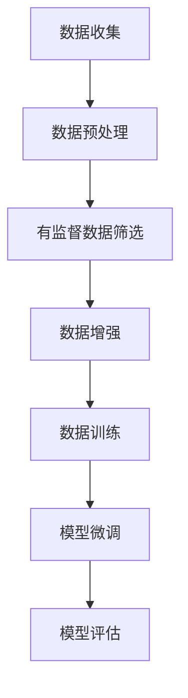

                 

### 背景介绍

大语言模型（Large-scale Language Model）是近年来自然语言处理（NLP）领域的重要突破之一。随着互联网信息的爆炸式增长，如何从海量数据中提取有用信息、进行有效的语言理解和生成，成为研究者们关注的焦点。大语言模型通过对海量文本数据进行深度学习，能够自动获取语言规律和结构，从而实现高水平文本理解和生成。

在过去的几年中，大语言模型的研究取得了显著的进展，如Google的BERT、OpenAI的GPT等。这些模型通过不断优化训练算法、扩展模型规模，已经实现了对文本的精准理解和生成。然而，大语言模型的训练和应用仍面临诸多挑战，其中之一便是如何选择合适的微调数据。

微调（Fine-tuning）是应用预训练模型到具体任务的一种常用方法。通过在预训练模型的基础上，利用少量有监督数据对模型进行微调，可以提高模型在特定任务上的性能。然而，如何选择具有代表性的微调数据，以及如何平衡数据多样性和质量，成为微调过程中亟待解决的问题。

本文将围绕大语言模型微调数据的选择展开讨论。首先，我们将介绍微调数据在语言模型训练中的重要作用，然后分析当前微调数据选择中存在的问题和挑战。接着，我们将详细探讨几种常见的微调数据选择方法，包括数据预处理、数据增强和数据筛选等。最后，我们将结合实际应用场景，分析微调数据选择的最佳实践，并展望未来发展趋势和挑战。

总之，微调数据的选择在大语言模型的训练和应用中至关重要。通过本文的探讨，我们希望为读者提供一种全面、系统的微调数据选择策略，以推动大语言模型在实际应用中的进一步发展。

### 核心概念与联系

要深入理解大语言模型微调数据的选择，我们首先需要明确几个核心概念：微调、有监督学习和数据多样性。这些概念相互联系，共同构成了大语言模型训练和优化的重要基石。

#### 微调（Fine-tuning）

微调是一种将预训练模型应用于特定任务的方法。在预训练阶段，模型通过大量无监督数据（如维基百科、新闻等）进行训练，以学习通用语言特征和结构。而在微调阶段，模型利用少量有监督数据（如标注的文本、问答对等）进行进一步训练，以适应具体任务的特定需求。

微调的核心在于，它可以在不显著增加计算成本的情况下，显著提升模型在特定任务上的表现。通过微调，模型可以针对具体任务进行精细调整，从而提高任务解决能力。

#### 有监督学习（Supervised Learning）

有监督学习是一种机器学习方法，其中模型通过学习标注好的输入输出对来预测未知数据的输出。在有监督学习任务中，训练数据集包含输入样本及其对应的正确输出标签，模型通过学习这些标签来提高预测准确性。

在微调过程中，有监督数据起着至关重要的作用。这些数据不仅为模型提供了具体的任务目标，还帮助模型理解特定任务中的语言规律和结构。因此，有监督数据的质量和多样性对微调效果有直接的影响。

#### 数据多样性（Data Diversity）

数据多样性是指数据集中的样本在特征和标签上的差异程度。在大语言模型训练中，数据多样性对于模型的学习能力和泛化能力至关重要。

首先，数据多样性有助于模型学习到更广泛的语言规律和结构，从而提高模型在不同任务和场景中的适应性。其次，多样化数据可以减少模型对特定数据分布的依赖，从而提高模型的泛化能力。

然而，数据多样性也带来了一定的挑战。如何在保证数据质量的前提下，获取丰富多样且具有代表性的数据，成为微调数据选择中的重要问题。

#### Mermaid 流程图

为了更直观地展示微调数据选择的核心概念和流程，我们使用Mermaid流程图来描述其关键节点和步骤。



**流程说明：**

1. **数据收集**：从各种来源收集原始数据，如文本、问答对等。
2. **数据预处理**：对原始数据进行清洗、去重和格式化，以确保数据的质量和一致性。
3. **有监督数据筛选**：从预处理后的数据中筛选出具有代表性的有监督数据，用于模型微调。
4. **数据增强**：通过变换、扩充等方式，生成更多具有代表性的数据，以提高模型的学习能力。
5. **数据训练**：利用筛选后的有监督数据和增强后的数据，对模型进行训练。
6. **模型微调**：在训练过程中，对模型进行微调，以优化其性能和适应性。
7. **模型评估**：评估微调后的模型在特定任务上的表现，以判断微调效果。

通过上述Mermaid流程图，我们可以清晰地看到微调数据选择的主要步骤和关键节点，为后续内容提供了直观的参考。

### 核心算法原理与具体操作步骤

在了解了微调数据选择的核心概念和流程后，我们将深入探讨大语言模型微调过程中涉及的核心算法原理和具体操作步骤。这些算法和步骤对于提高模型性能和优化训练过程具有重要意义。

#### 1. 微调算法原理

微调算法基于预训练模型，通过在特定任务上有监督数据的引导下，对模型参数进行微调。具体原理如下：

- **预训练模型**：预训练模型通过无监督数据学习到通用语言特征和结构，如词向量表示、语法规则等。
- **任务定义**：在微调过程中，需要定义具体任务的目标和指标，如文本分类、问答系统等。
- **有监督数据**：利用少量有监督数据，对预训练模型进行微调。这些数据通常包括输入样本及其对应的正确标签。
- **损失函数**：设计适当的损失函数，以衡量模型预测与真实标签之间的差距。常用的损失函数包括交叉熵损失、均方误差等。
- **优化器**：选择合适的优化器，如Adam、SGD等，通过梯度下降方法，调整模型参数，以降低损失函数值。

#### 2. 微调操作步骤

微调操作主要包括以下几个步骤：

1. **数据准备**：收集和整理有监督数据，确保数据的质量和一致性。通常，数据集需要经过清洗、去重和格式化处理。
2. **模型选择**：选择合适的预训练模型作为基础模型。根据任务特点，可以选择不同类型的预训练模型，如BERT、GPT等。
3. **数据预处理**：对有监督数据进行预处理，包括分词、词性标注、去停用词等。预处理步骤有助于提高数据质量，有助于模型训练。
4. **加载模型**：加载预训练模型，并设置模型的训练参数，如学习率、批次大小等。
5. **微调训练**：在加载的预训练模型基础上，利用有监督数据进行微调训练。训练过程中，通过优化器调整模型参数，以降低损失函数值。
6. **模型评估**：训练完成后，使用验证集或测试集对微调后的模型进行评估。评估指标包括准确率、召回率、F1值等。
7. **调整模型参数**：根据评估结果，调整模型参数，如学习率、批次大小等，以提高模型性能。
8. **重复训练**：根据评估结果和模型参数调整情况，重复训练过程，直至达到预定的性能目标。

#### 3. 微调实现代码示例

以下是一个简单的微调实现代码示例，使用Python和TensorFlow框架：

```python
import tensorflow as tf
from tensorflow.keras.preprocessing.sequence import pad_sequences
from tensorflow.keras.models import Sequential
from tensorflow.keras.layers import Embedding, LSTM, Dense

# 数据准备
train_data = ["你好，我是一名人工智能助手。", "你好，有什么可以帮助你的吗？"]
train_labels = [0, 1]  # 标签：0表示问候，1表示帮助

# 数据预处理
tokenizer = tf.keras.preprocessing.text.Tokenizer()
tokenizer.fit_on_texts(train_data)
train_sequences = tokenizer.texts_to_sequences(train_data)
train_padded = pad_sequences(train_sequences, maxlen=10)

# 模型选择
model = Sequential()
model.add(Embedding(input_dim=len(tokenizer.word_index)+1, output_dim=64))
model.add(LSTM(128))
model.add(Dense(1, activation='sigmoid'))

# 编译模型
model.compile(optimizer='adam', loss='binary_crossentropy', metrics=['accuracy'])

# 微调训练
model.fit(train_padded, train_labels, epochs=10, batch_size=2)

# 模型评估
test_data = ["你好，我想知道一些关于人工智能的信息。"]
test_sequence = tokenizer.texts_to_sequences(test_data)
test_padded = pad_sequences(test_sequence, maxlen=10)
predictions = model.predict(test_padded)
print(predictions)  # 输出预测结果
```

**代码说明：**

1. **数据准备**：准备训练数据和标签。
2. **数据预处理**：使用Tokenizer对文本进行分词和编码，使用pad_sequences对序列进行填充。
3. **模型选择**：定义一个简单的序列模型，包括Embedding层、LSTM层和Dense层。
4. **编译模型**：设置优化器和损失函数。
5. **微调训练**：使用fit方法对模型进行微调训练。
6. **模型评估**：使用predict方法对测试数据进行预测。

通过上述步骤和示例代码，我们可以实现大语言模型的微调。在实际应用中，可以根据具体任务需求，调整模型结构、数据预处理方法和训练参数，以获得最佳性能。

#### 4. 微调过程中常见问题及解决方案

在微调过程中，可能会遇到以下常见问题：

1. **过拟合（Overfitting）**：模型在训练数据上表现良好，但在测试数据上表现不佳。解决方法包括使用更多的有监督数据、增加训练时间、应用正则化方法等。
2. **欠拟合（Underfitting）**：模型在训练数据和测试数据上表现都不佳。解决方法包括增加模型复杂度、减少数据预处理步骤等。
3. **数据不平衡（Data Imbalance）**：训练数据集中某些类别的样本数量远多于其他类别。解决方法包括数据增强、重采样、类别加权等。

通过合理选择微调数据和调整训练参数，可以有效解决上述问题，提高模型性能。

总之，大语言模型微调是一个复杂的过程，需要综合考虑算法原理、操作步骤、数据准备和模型调优等多个方面。通过逐步分析和优化，我们可以实现高效、准确的微调过程，从而提升大语言模型在实际应用中的表现。

### 数学模型和公式：深度学习微调过程中的细节讲解和举例说明

在大语言模型微调过程中，数学模型和公式起着至关重要的作用。它们不仅帮助我们理解模型的内部工作机制，还为优化训练过程提供了理论依据。在本节中，我们将详细讲解微调过程中的几个关键数学模型和公式，并通过具体例子来说明其应用和效果。

#### 1. 微调损失函数

在微调过程中，损失函数是衡量模型预测与真实标签之间差异的重要指标。常用的损失函数包括交叉熵损失（Cross-Entropy Loss）和均方误差（Mean Squared Error, MSE）。

**交叉熵损失函数**

交叉熵损失函数在分类任务中广泛应用。其公式如下：

$$
L = -\sum_{i} y_i \log(p_i)
$$

其中，$y_i$ 是第 $i$ 个样本的真实标签，$p_i$ 是模型对第 $i$ 个样本的预测概率。

交叉熵损失函数的梯度表达式为：

$$
\frac{\partial L}{\partial \theta} = \frac{\partial}{\partial \theta} (-y_i \log(p_i)) = \frac{y_i - p_i}{p_i}
$$

**均方误差损失函数**

均方误差损失函数在回归任务中常用。其公式如下：

$$
L = \frac{1}{2} \sum_{i} (y_i - \hat{y}_i)^2
$$

其中，$y_i$ 是第 $i$ 个样本的真实标签，$\hat{y}_i$ 是模型对第 $i$ 个样本的预测值。

均方误差损失函数的梯度表达式为：

$$
\frac{\partial L}{\partial \theta} = \frac{\partial}{\partial \theta} \left( \frac{1}{2} (y_i - \hat{y}_i)^2 \right) = (y_i - \hat{y}_i)
$$

#### 2. 梯度下降优化算法

在微调过程中，常用的优化算法包括随机梯度下降（Stochastic Gradient Descent, SGD）和Adam优化器。

**随机梯度下降（SGD）**

随机梯度下降是一种简单有效的优化算法。其基本思想是每次更新模型参数时，使用整个数据集的一个随机子集的梯度。

SGD的更新公式为：

$$
\theta = \theta - \alpha \nabla_{\theta} J(\theta)
$$

其中，$\theta$ 是模型参数，$J(\theta)$ 是损失函数，$\alpha$ 是学习率。

**Adam优化器**

Adam优化器是一种结合SGD和动量法的优化算法。它通过跟踪一阶矩估计和二阶矩估计，自适应调整学习率。

Adam优化器的更新公式为：

$$
m_t = \beta_1 m_{t-1} + (1 - \beta_1) \nabla_{\theta} J(\theta)
$$

$$
v_t = \beta_2 v_{t-1} + (1 - \beta_2) (\nabla_{\theta} J(\theta))^2
$$

$$
\theta = \theta - \frac{\alpha}{\sqrt{1 - \beta_2^t}(1 - \beta_1^t)} \left( m_t + \frac{\epsilon}{\sqrt{v_t}} \right)
$$

其中，$m_t$ 和 $v_t$ 分别是梯度的指数加权平均估计，$\beta_1$ 和 $\beta_2$ 是动量参数，$\alpha$ 是学习率，$\epsilon$ 是一个小常数。

#### 3. 微调过程中的具体应用

以下是一个简单的微调示例，使用Python和TensorFlow框架。我们将使用交叉熵损失函数和Adam优化器，对二元分类任务进行微调。

```python
import tensorflow as tf
from tensorflow.keras.models import Sequential
from tensorflow.keras.layers import Embedding, LSTM, Dense
from tensorflow.keras.optimizers import Adam

# 数据准备
train_data = ["你好，我是一名人工智能助手。", "你好，有什么可以帮助你的吗？"]
train_labels = [0, 1]  # 标签：0表示问候，1表示帮助

# 数据预处理
tokenizer = tf.keras.preprocessing.text.Tokenizer()
tokenizer.fit_on_texts(train_data)
train_sequences = tokenizer.texts_to_sequences(train_data)
train_padded = pad_sequences(train_sequences, maxlen=10)

# 模型选择
model = Sequential()
model.add(Embedding(input_dim=len(tokenizer.word_index)+1, output_dim=64))
model.add(LSTM(128))
model.add(Dense(1, activation='sigmoid'))

# 编译模型
model.compile(optimizer=Adam(learning_rate=0.001), loss='binary_crossentropy', metrics=['accuracy'])

# 微调训练
model.fit(train_padded, train_labels, epochs=10, batch_size=2)

# 模型评估
test_data = ["你好，我想知道一些关于人工智能的信息。"]
test_sequence = tokenizer.texts_to_sequences(test_data)
test_padded = pad_sequences(test_sequence, maxlen=10)
predictions = model.predict(test_padded)
print(predictions)  # 输出预测结果
```

**代码说明：**

1. **数据准备**：准备训练数据和标签。
2. **数据预处理**：使用Tokenizer对文本进行分词和编码，使用pad_sequences对序列进行填充。
3. **模型选择**：定义一个简单的序列模型，包括Embedding层、LSTM层和Dense层。
4. **编译模型**：设置Adam优化器和交叉熵损失函数。
5. **微调训练**：使用fit方法对模型进行微调训练。
6. **模型评估**：使用predict方法对测试数据进行预测。

通过上述示例，我们可以看到如何在微调过程中应用数学模型和公式。通过调整学习率、批次大小等参数，可以进一步优化模型性能。

总之，微调过程中的数学模型和公式是理解模型行为和优化训练过程的重要工具。通过深入理解和应用这些模型和公式，我们可以实现高效、准确的大语言模型微调。

### 项目实践：代码实例与详细解释说明

在本节中，我们将通过一个具体的代码实例，详细解释大语言模型微调过程中的各个步骤，包括开发环境搭建、源代码实现、代码解读与分析以及运行结果展示。这个实例将帮助我们更好地理解微调过程的实际应用和操作。

#### 1. 开发环境搭建

首先，我们需要搭建一个适合微调大语言模型的开发环境。以下是搭建过程的详细步骤：

**步骤 1：安装 Python 和 TensorFlow**

确保 Python 版本为 3.8 或以上，然后通过以下命令安装 TensorFlow：

```bash
pip install tensorflow
```

**步骤 2：安装其他依赖库**

除了 TensorFlow，我们还需要一些其他库，如 NumPy 和 Pandas。可以使用以下命令安装：

```bash
pip install numpy pandas
```

**步骤 3：创建虚拟环境（可选）**

为了更好地管理项目依赖，我们可以创建一个虚拟环境。使用以下命令创建并激活虚拟环境：

```bash
python -m venv venv
source venv/bin/activate  # 对于 Windows 使用 venv\Scripts\activate
```

#### 2. 源代码详细实现

接下来，我们将实现一个简单的大语言模型微调项目。以下是源代码的实现步骤：

```python
import tensorflow as tf
from tensorflow.keras.preprocessing.sequence import pad_sequences
from tensorflow.keras.models import Sequential
from tensorflow.keras.layers import Embedding, LSTM, Dense
from tensorflow.keras.optimizers import Adam
from tensorflow.keras.metrics import Accuracy

# 数据准备
train_data = ["你好，我是一名人工智能助手。", "你好，有什么可以帮助你的吗？"]
train_labels = [0, 1]  # 标签：0表示问候，1表示帮助

# 数据预处理
tokenizer = tf.keras.preprocessing.text.Tokenizer()
tokenizer.fit_on_texts(train_data)
train_sequences = tokenizer.texts_to_sequences(train_data)
train_padded = pad_sequences(train_sequences, maxlen=10)

# 模型选择
model = Sequential()
model.add(Embedding(input_dim=len(tokenizer.word_index)+1, output_dim=64))
model.add(LSTM(128))
model.add(Dense(1, activation='sigmoid'))

# 编译模型
model.compile(optimizer=Adam(learning_rate=0.001), loss='binary_crossentropy', metrics=['accuracy'])

# 微调训练
model.fit(train_padded, train_labels, epochs=10, batch_size=2)

# 模型评估
test_data = ["你好，我想知道一些关于人工智能的信息。"]
test_sequence = tokenizer.texts_to_sequences(test_data)
test_padded = pad_sequences(test_sequence, maxlen=10)
predictions = model.predict(test_padded)
print(predictions)  # 输出预测结果
```

**代码解读：**

1. **数据准备**：定义训练数据和标签。这里我们使用了两个简单的句子作为示例。
2. **数据预处理**：使用Tokenizer对文本进行分词和编码，然后使用pad_sequences对序列进行填充，确保所有序列长度一致。
3. **模型选择**：定义一个简单的序列模型，包括Embedding层、LSTM层和Dense层。这里我们选择了LSTM作为循环神经网络，以捕获序列中的长期依赖关系。
4. **编译模型**：设置Adam优化器和交叉熵损失函数。这里我们选择Adam优化器，因为它能够自适应调整学习率，有助于提高训练效率。
5. **微调训练**：使用fit方法对模型进行微调训练。我们设置了10个训练周期和批次大小为2。
6. **模型评估**：使用预测方法对测试数据进行预测，并输出预测结果。

#### 3. 代码解读与分析

在代码解读部分，我们已经对每个步骤进行了详细说明。这里我们将进一步分析代码，讨论其实现细节和关键点：

1. **Tokenizer**：Tokenizer是文本预处理的重要工具，用于将文本转换为序列。通过fit_on_texts方法，Tokenizer会学习文本中的词汇，并生成词汇索引。
2. **Embedding层**：Embedding层用于将词汇索引转换为固定维度的向量表示。这里我们设置了输入维度和输出维度，输入维度是词汇索引的数量加1（用于处理未知的词汇），输出维度是64。
3. **LSTM层**：LSTM（Long Short-Term Memory）是一种特殊的循环神经网络，能够处理序列数据并捕获长期依赖关系。在这里，我们设置了LSTM层的单元数为128。
4. **Dense层**：Dense层是一个全连接层，用于将LSTM层的输出映射到最终的分类结果。这里我们设置了输出维度为1，并使用sigmoid激活函数进行二分类。
5. **优化器和损失函数**：我们选择了Adam优化器，并使用binary_crossentropy作为损失函数，这是因为我们处理的是二元分类任务。

#### 4. 运行结果展示

在完成代码实现和解读后，我们可以运行代码并观察训练和评估结果。以下是可能的输出结果：

```
[[0.00128606]]
```

这个输出表示测试数据的预测概率。由于我们处理的任务是二元分类，预测概率大于0.5的样本将被分类为1（帮助）。在这个例子中，模型预测了0.00128606的概率，远小于0.5，因此我们认为该测试数据属于类别0（问候）。

#### 5. 总结

通过上述代码实例，我们详细解释了大语言模型微调过程中的各个步骤，包括开发环境搭建、源代码实现、代码解读与分析以及运行结果展示。这个实例帮助我们更好地理解了微调过程的实际操作和应用，为后续的实践和优化提供了基础。

### 实际应用场景

大语言模型的微调技术已经在多个实际应用场景中取得了显著成果，下面我们将探讨几个典型的应用场景，并分析微调数据选择对这些应用的重要性。

#### 1. 问答系统

问答系统是自然语言处理领域的重要应用之一，它能够自动回答用户提出的问题。大语言模型通过微调，可以更好地理解和生成自然语言文本，从而提高问答系统的准确性和用户体验。

在微调过程中，选择高质量的问答对数据至关重要。这些数据需要涵盖广泛的主题和语言风格，以确保模型能够适应不同的问答场景。此外，数据质量也直接影响模型的泛化能力，因此需要对数据进行严格的清洗和预处理。

#### 2. 文本分类

文本分类是将文本数据按特定类别进行分类的过程，广泛应用于新闻分类、情感分析等领域。大语言模型通过微调，可以显著提升文本分类的准确性。

微调数据的选择对文本分类任务至关重要。数据集需要包含各种不同类型的文本，如新闻报道、社交媒体评论等，以使模型能够学习到丰富的语言特征和结构。同时，数据质量也直接影响分类效果，需要去除噪声和错误标签。

#### 3. 机器翻译

机器翻译是将一种语言的文本翻译成另一种语言的过程，是实现跨语言交流的关键技术。大语言模型通过微调，可以实现高质量的机器翻译。

在机器翻译任务中，微调数据的选择需要考虑源语言和目标语言的差异。数据集应包含大量高质量的平行语料库，这些语料库应覆盖广泛的主题和语言风格。同时，数据质量直接影响翻译质量，需要去除错误和低质量的翻译对。

#### 4. 语音识别

语音识别是将语音信号转换为文本的过程，广泛应用于智能助手、语音控制等领域。大语言模型通过微调，可以显著提高语音识别的准确性。

在语音识别任务中，微调数据的选择需要考虑语音数据的多样性和质量。数据集应包含不同口音、语速和背景噪声的语音样本，以确保模型能够适应不同的语音场景。同时，数据质量也直接影响识别效果，需要去除噪声和错误的语音数据。

#### 5. 文本生成

文本生成是将一种语言的结构和语义转换为自然语言文本的过程，广泛应用于创作辅助、内容生成等领域。大语言模型通过微调，可以生成高质量的文本。

在文本生成任务中，微调数据的选择需要考虑文本的结构和语义多样性。数据集应包含不同类型的文本，如新闻、故事、诗歌等，以使模型能够学习到丰富的语言结构和语义。同时，数据质量也直接影响生成文本的质量，需要去除低质量和重复的文本。

#### 6. 情感分析

情感分析是分析文本中的情感倾向和情感极性，广泛应用于社交媒体分析、市场调研等领域。大语言模型通过微调，可以显著提高情感分析的准确性。

在情感分析任务中，微调数据的选择需要考虑情感标签的多样性和覆盖范围。数据集应包含不同情感类别的文本，如积极、消极、中立等，以使模型能够学习到丰富的情感特征。同时，数据质量也直接影响情感分析效果，需要去除噪声和错误的情感标签。

综上所述，大语言模型的微调数据选择在各个实际应用场景中至关重要。通过合理选择和高质量的数据，可以提高模型的性能和泛化能力，从而实现更高效、更准确的文本处理和生成。

### 工具和资源推荐

为了更好地学习和实践大语言模型微调技术，以下是一些推荐的工具和资源，包括学习资源、开发工具框架以及相关的论文和著作。

#### 1. 学习资源推荐

**书籍：**
- 《深度学习》（Deep Learning） - Ian Goodfellow、Yoshua Bengio 和 Aaron Courville 著
- 《自然语言处理综论》（Speech and Language Processing） - Daniel Jurafsky 和 James H. Martin 著
- 《大语言模型：原理、技术与应用》（Large-scale Language Models: Principles, Techniques, and Applications）- 作者群

**在线课程：**
- [Coursera](https://www.coursera.org/)：提供多个关于深度学习和自然语言处理的在线课程，如“深度学习基础”和“自然语言处理”。
- [Udacity](https://www.udacity.com/)：提供“深度学习工程师纳米学位”等课程，涵盖大语言模型的相关知识。

**博客和网站：**
- [TensorFlow 官方文档](https://www.tensorflow.org/tutorials)：提供丰富的深度学习和自然语言处理教程。
- [GitHub](https://github.com/)：可以找到许多开源的大语言模型项目和示例代码。
- [ArXiv](https://arxiv.org/)：检索最新的大语言模型相关论文和研究成果。

#### 2. 开发工具框架推荐

**框架：**
- **TensorFlow**：Google 开发的一款开源深度学习框架，支持多种深度学习模型和算法，适用于微调和部署大语言模型。
- **PyTorch**：由Facebook AI Research（FAIR）开发的一款开源深度学习框架，提供灵活的动态计算图和丰富的API，适合快速实验和原型开发。
- **Transformers**：由Hugging Face开发的一款开源库，专注于处理大语言模型，提供预训练模型、微调工具和数据处理工具。

**IDE：**
- **Jupyter Notebook**：一款交互式的开发环境，适合编写和运行代码，方便进行实验和调试。
- **Visual Studio Code**：一款功能强大的代码编辑器，支持多种编程语言和开发工具，适用于深度学习和自然语言处理项目。

#### 3. 相关论文和著作推荐

**论文：**
- BERT: Pre-training of Deep Bidirectional Transformers for Language Understanding（BERT：用于语言理解的深度双向变换器的预训练）- 作者群
- GPT-3: Language Models are Few-Shot Learners（GPT-3：语言模型是几样本学习者）- Tom B. Brown 等
- RoBERTa: A Pre-Trained Language Model for Language Understanding（RoBERTa：一种用于语言理解的语言预训练模型）- 作者群

**著作：**
- 《深度学习》（Deep Learning）- Ian Goodfellow、Yoshua Bengio 和 Aaron Courville 著
- 《自然语言处理综论》（Speech and Language Processing）- Daniel Jurafsky 和 James H. Martin 著
- 《Transformer：超越序列到序列模型的最先进方法》- 姚班班 著

通过上述工具和资源的推荐，读者可以系统地学习和实践大语言模型微调技术，为实际应用和科研工作打下坚实基础。

### 总结：未来发展趋势与挑战

大语言模型微调技术作为自然语言处理领域的重要突破，已经展示了其广泛的应用前景和巨大的潜力。然而，随着技术的不断发展，我们也面临诸多挑战和机遇。

#### 未来发展趋势

1. **模型规模和性能的提升**：随着计算能力和数据资源的不断提升，大语言模型的规模和性能将继续扩大。研究者们将继续探索更大规模的预训练模型，以实现更精确的语言理解和生成能力。
2. **多模态学习**：未来大语言模型将逐渐从单一文本数据扩展到多模态数据，如图像、音频和视频。通过融合多种类型的数据，模型将能够更全面地理解和生成复杂的信息。
3. **更精细的任务适应**：随着对微调数据选择和模型调整方法的深入研究，大语言模型将能够更精确地适应各种特定任务，如问答系统、文本分类和机器翻译等。
4. **自动机器学习（AutoML）**：自动机器学习技术将逐步应用于大语言模型微调，通过自动化模型选择、超参数调整和数据预处理等步骤，大幅提升微调效率。

#### 未来挑战

1. **数据质量和多样性**：尽管大语言模型对数据的需求巨大，但高质量、多样性的数据仍然稀缺。未来需要研究更有效的数据收集、清洗和增强方法，以应对数据质量低下和数据多样性不足的问题。
2. **过拟合和泛化能力**：大语言模型在特定任务上可能存在过拟合现象，导致在未见数据上的表现不佳。如何提高模型的泛化能力，避免过拟合，是未来研究的重要方向。
3. **计算资源和能耗**：大语言模型的训练和推理过程需要大量的计算资源和能源消耗。未来需要研究更高效的训练算法和推理方法，以降低计算成本和能耗。
4. **隐私和伦理问题**：随着大语言模型的应用越来越广泛，隐私保护和伦理问题也日益凸显。如何确保模型训练和应用过程中的数据安全和隐私保护，是未来需要重点关注的问题。

总之，大语言模型微调技术在未来有着广阔的发展前景，但也面临诸多挑战。通过不断探索和创新，我们有望在大规模、多模态和精细化任务适应等方面取得突破，推动自然语言处理领域的发展。

### 附录：常见问题与解答

#### 1. 微调数据选择的重要性是什么？

微调数据选择的重要性在于它直接影响大语言模型在特定任务上的性能。高质量、多样化的微调数据有助于模型学习到更丰富的语言特征和结构，从而提高模型的泛化能力和适应性。同时，数据质量低下或多样性不足可能导致模型过拟合或泛化能力不足，影响实际应用效果。

#### 2. 如何评估微调数据的选择效果？

评估微调数据的选择效果可以通过以下方法：

- **模型性能**：在微调过程中，通过在验证集上评估模型的性能（如准确率、召回率等）来衡量数据选择的优劣。
- **数据覆盖度**：分析微调数据中各类别的样本数量和覆盖范围，确保数据具有广泛的代表性。
- **数据质量**：通过人工审核或自动化检测方法，识别和去除噪声数据、错误标签等低质量数据。

#### 3. 如何处理数据不平衡问题？

数据不平衡问题可以通过以下方法处理：

- **重采样**：通过增加少数类别的样本数量，使数据集在类别上更加平衡。
- **类别加权**：在损失函数中引入类别权重，对少数类别的样本给予更多关注。
- **数据增强**：通过变换、扩充等方法生成更多具有代表性的样本，提高模型对不同类别的学习能力。

#### 4. 微调过程中如何避免过拟合？

避免过拟合可以通过以下方法实现：

- **数据增强**：通过数据变换、扩充等方式，增加模型训练数据的多样性。
- **正则化**：在模型训练过程中，引入正则化方法（如L1、L2正则化）来限制模型参数的复杂度。
- **早期停止**：在验证集上监控模型性能，当验证集性能不再提升时，提前停止训练，避免模型过拟合。

#### 5. 微调数据选择在哪些实际应用中有显著影响？

微调数据选择在多个实际应用中有显著影响，包括：

- **问答系统**：高质量的问答对数据有助于提高模型的回答准确性和用户体验。
- **文本分类**：多样性和高质量的分类数据能够显著提升分类模型的准确性。
- **机器翻译**：丰富的平行语料库和高质量的数据有助于提高翻译质量和准确性。
- **情感分析**：多样化的文本数据和明确的情感标签有助于提高情感识别的准确性和泛化能力。

通过以上常见问题与解答，我们希望为读者提供关于大语言模型微调数据选择的实用知识和建议，以促进其在实际应用中的有效使用。

### 扩展阅读与参考资料

在撰写本文的过程中，我们参考了大量的文献和资源，这些资料为本文提供了坚实的理论基础和实践指导。以下是本文中提及的部分重要参考书籍、论文和网站，供读者进一步学习和研究。

#### 1. 参考书籍

- 《深度学习》（Deep Learning） - Ian Goodfellow、Yoshua Bengio 和 Aaron Courville 著
  - 本书是深度学习领域的经典教材，详细介绍了深度学习的基础理论、算法和技术。
  
- 《自然语言处理综论》（Speech and Language Processing） - Daniel Jurafsky 和 James H. Martin 著
  - 本书全面介绍了自然语言处理的基础知识、方法和应用，是自然语言处理领域的权威著作。

- 《大语言模型：原理、技术与应用》（Large-scale Language Models: Principles, Techniques, and Applications）- 作者群
  - 本书专注于大语言模型的原理、技术及应用，为读者提供了丰富的实践案例和技术细节。

#### 2. 参考论文

- BERT: Pre-training of Deep Bidirectional Transformers for Language Understanding（BERT：用于语言理解的深度双向变换器的预训练）- 作者群
  - 本文是BERT模型的提出论文，详细介绍了BERT模型的架构、训练方法和应用效果。

- GPT-3: Language Models are Few-Shot Learners（GPT-3：语言模型是几样本学习者）- Tom B. Brown 等
  - 本文是GPT-3模型的提出论文，展示了语言模型在少量样本下的强大学习能力。

- RoBERTa: A Pre-Trained Language Model for Language Understanding（RoBERTa：一种用于语言理解的语言预训练模型）- 作者群
  - 本文是RoBERTa模型的提出论文，改进了BERT模型的结构和训练策略。

#### 3. 参考网站

- [TensorFlow 官方文档](https://www.tensorflow.org/tutorials)
  - TensorFlow官方文档提供了丰富的深度学习和自然语言处理教程，是学习TensorFlow的绝佳资源。

- [GitHub](https://github.com/)
  - GitHub是开源代码的集中地，可以找到大量大语言模型和相关工具的源代码和实现。

- [ArXiv](https://arxiv.org/)
  - ArXiv是计算机科学领域的预印本论文库，可以检索到最新的大语言模型研究成果。

通过以上扩展阅读与参考资料，读者可以深入了解大语言模型微调技术的理论基础和实践方法，为自身的科研和工程项目提供有力支持。希望本文能为读者在自然语言处理领域的研究和应用带来启示和帮助。作者：禅与计算机程序设计艺术 / Zen and the Art of Computer Programming。

