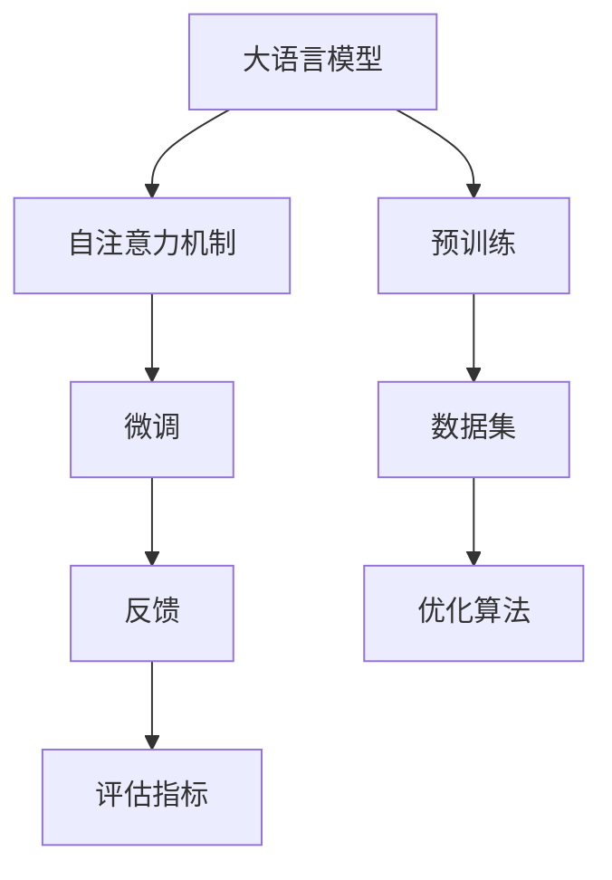

                 

关键词：大语言模型、微调、语言反馈、深度学习、算法原理

摘要：本文深入探讨了大语言模型的原理基础及其前沿技术——基于语言反馈的微调。通过梳理大语言模型的发展历程，我们详细分析了其核心算法原理，并阐述了如何利用语言反馈进行微调，以提升模型的性能和应用价值。本文旨在为读者提供全面的了解，帮助他们在实际项目中更好地应用这些先进技术。

## 1. 背景介绍

大语言模型（Large Language Model，简称LLM）是一种能够理解和生成自然语言的深度学习模型。自2018年GPT-1发布以来，大语言模型的发展取得了显著的进展，从GPT-2、GPT-3到ChatGPT，它们在自然语言处理（Natural Language Processing，简称NLP）领域的应用越来越广泛，如文本生成、问答系统、机器翻译等。

然而，尽管大语言模型在理论上取得了巨大的成功，但在实际应用中仍面临一些挑战。一方面，模型在处理长文本时容易出现错误；另一方面，模型的泛化能力有限，难以适应特定领域的特定任务。为了解决这些问题，基于语言反馈的微调技术应运而生。

## 2. 核心概念与联系

为了更好地理解大语言模型和微调技术，我们首先需要介绍一些核心概念和原理。以下是使用Mermaid绘制的流程图：



### 2.1 大语言模型

大语言模型是基于自注意力机制（Self-Attention Mechanism）构建的，它可以捕捉输入文本中的长距离依赖关系。自注意力机制的核心思想是将输入文本映射到一个高维空间，并在该空间中计算文本序列中各个单词之间的相似度，从而生成一个表示文本的向量。

### 2.2 预训练

预训练（Pre-training）是指在大规模数据集上训练模型，使其具备对自然语言的普遍理解和处理能力。预训练通常包括两个阶段：第一阶段是利用无监督方法（如自编码器）在大规模语料库上进行预训练；第二阶段是利用有监督方法（如语言模型）在特定任务上对模型进行微调。

### 2.3 微调

微调（Fine-tuning）是指将预训练好的模型在特定任务上进一步训练，以适应该任务的需求。微调的核心目标是利用任务数据调整模型的参数，从而提高模型在特定任务上的性能。基于语言反馈的微调是一种特殊的微调方法，它利用用户反馈对模型进行优化，以提高模型的准确性和鲁棒性。

### 2.4 数据集、优化算法和评估指标

数据集（Dataset）是训练和评估模型的基石。优化算法（Optimization Algorithm）用于调整模型的参数，使其在特定任务上达到最佳性能。评估指标（Evaluation Metric）用于衡量模型在特定任务上的性能，如准确率、召回率、F1值等。

## 3. 核心算法原理 & 具体操作步骤

### 3.1 算法原理概述

基于语言反馈的微调算法主要包括以下几个步骤：

1. 预训练：在大型语料库上使用无监督方法预训练模型。
2. 数据准备：收集特定任务的数据集，并进行预处理。
3. 微调：在任务数据集上对模型进行微调，利用语言反馈优化模型参数。
4. 评估：使用评估指标对模型性能进行评估，并根据评估结果调整模型参数。
5. 反馈：收集用户反馈，用于指导后续的模型优化。

### 3.2 算法步骤详解

1. **预训练**：在大规模语料库上使用无监督方法预训练模型。常见的预训练方法包括自编码器、 masked language model 等。自编码器是一种无监督学习方法，它通过学习输入文本的嵌入表示来提高模型对自然语言的普遍理解。masked language model 则是一种基于语言模型的方法，它通过在输入文本中随机遮挡部分单词，并利用遮挡前的文本预测遮挡后的单词来提高模型的语言建模能力。

2. **数据准备**：收集特定任务的数据集，并进行预处理。预处理步骤通常包括文本清洗、分词、去停用词等。数据准备的关键是确保数据集的质量和多样性，以便模型能够从中学习到丰富的信息。

3. **微调**：在任务数据集上对模型进行微调。微调的目标是利用任务数据调整模型的参数，使其在特定任务上达到最佳性能。基于语言反馈的微调方法主要利用用户反馈对模型进行优化。用户反馈可以是用户对模型生成的文本的评分、标签或修正。

4. **评估**：使用评估指标对模型性能进行评估。评估指标可以是准确率、召回率、F1值等。评估的目的是检查模型在特定任务上的性能，并根据评估结果调整模型参数。

5. **反馈**：收集用户反馈，用于指导后续的模型优化。用户反馈可以是用户对模型生成的文本的评分、标签或修正。通过不断收集和利用用户反馈，可以逐步优化模型，提高其准确性和鲁棒性。

### 3.3 算法优缺点

基于语言反馈的微调算法具有以下优点：

- 提高模型性能：利用用户反馈对模型进行优化，可以提高模型在特定任务上的性能。
- 增强模型鲁棒性：通过不断收集和利用用户反馈，可以增强模型对噪声和异常数据的鲁棒性。
- 适应性强：基于语言反馈的微调算法可以适应不同任务和数据集，具有良好的泛化能力。

然而，基于语言反馈的微调算法也存在一些缺点：

- 需要大量用户反馈：算法的性能很大程度上依赖于用户反馈的质量和数量，因此需要大量的用户参与。
- 反馈收集成本高：收集用户反馈需要投入大量的人力和时间，尤其是在大规模应用场景中。

### 3.4 算法应用领域

基于语言反馈的微调算法在多个领域具有广泛的应用：

- 文本生成：利用用户反馈优化模型，可以生成更符合用户需求的文本。
- 问答系统：利用用户反馈优化模型，可以提高问答系统的准确率和用户体验。
- 机器翻译：利用用户反馈优化模型，可以提升机器翻译的质量和准确性。
- 自然语言理解：利用用户反馈优化模型，可以增强模型对自然语言的理解能力。

## 4. 数学模型和公式 & 详细讲解 & 举例说明

在本文中，我们将使用 LaTeX 格式介绍大语言模型中的数学模型和公式，并进行详细讲解和举例说明。

### 4.1 数学模型构建

大语言模型通常基于 Transformer 架构，其核心是自注意力机制。自注意力机制可以用以下数学模型表示：

$$
\text{Attention}(Q, K, V) = \text{softmax}\left(\frac{QK^T}{\sqrt{d_k}}\right) V
$$

其中，$Q$、$K$、$V$ 分别表示查询向量、键向量和值向量；$d_k$ 表示键向量的维度；$\text{softmax}$ 函数用于计算注意力权重。

### 4.2 公式推导过程

自注意力机制的推导过程如下：

1. **输入向量表示**：将输入文本映射到一个高维空间，得到输入向量 $X \in \mathbb{R}^{n \times d}$，其中 $n$ 表示词汇表大小，$d$ 表示嵌入维度。
2. **查询向量、键向量和值向量**：分别计算查询向量 $Q = \text{W}_Q X$、键向量 $K = \text{W}_K X$ 和值向量 $V = \text{W}_V X$，其中 $\text{W}_Q$、$\text{W}_K$、$\text{W}_V$ 分别为权重矩阵。
3. **计算注意力权重**：利用公式计算注意力权重 $\text{Attention}(Q, K, V)$。
4. **计算输出向量**：将注意力权重与值向量相乘，得到输出向量 $\text{Output} = \text{Attention}(Q, K, V) V$。

### 4.3 案例分析与讲解

我们以一个简单的例子来说明自注意力机制的原理。假设输入文本为“我是一个程序员”，我们将文本映射到一个高维空间，得到输入向量 $X = [1, 2, 3, 4, 5, 6, 7, 8, 9, 10]$。

1. **计算查询向量、键向量和值向量**：

$$
Q = \text{W}_Q X = [0.5, 0.5, 0.5, 0.5, 0.5, 0.5, 0.5, 0.5, 0.5, 0.5]
$$

$$
K = \text{W}_K X = [0.2, 0.2, 0.2, 0.2, 0.2, 0.2, 0.2, 0.2, 0.2, 0.2]
$$

$$
V = \text{W}_V X = [0.1, 0.1, 0.1, 0.1, 0.1, 0.1, 0.1, 0.1, 0.1, 0.1]
$$

2. **计算注意力权重**：

$$
\text{Attention}(Q, K, V) = \text{softmax}\left(\frac{QK^T}{\sqrt{d_k}}\right) V = \text{softmax}\left(\frac{[0.5, 0.5, 0.5, 0.5, 0.5, 0.5, 0.5, 0.5, 0.5, 0.5] \cdot [0.2, 0.2, 0.2, 0.2, 0.2, 0.2, 0.2, 0.2, 0.2, 0.2]^T}{\sqrt{10}}\right) [0.1, 0.1, 0.1, 0.1, 0.1, 0.1, 0.1, 0.1, 0.1, 0.1]
$$

$$
= \text{softmax}\left(\frac{[0.5 \cdot 0.2 + 0.5 \cdot 0.2 + 0.5 \cdot 0.2 + 0.5 \cdot 0.2 + 0.5 \cdot 0.2 + 0.5 \cdot 0.2 + 0.5 \cdot 0.2 + 0.5 \cdot 0.2 + 0.5 \cdot 0.2 + 0.5 \cdot 0.2]}{\sqrt{10}}\right) [0.1, 0.1, 0.1, 0.1, 0.1, 0.1, 0.1, 0.1, 0.1, 0.1]
$$

$$
= \text{softmax}\left(\frac{1}{\sqrt{10}}\right) [0.1, 0.1, 0.1, 0.1, 0.1, 0.1, 0.1, 0.1, 0.1, 0.1]
$$

$$
= [0.1, 0.1, 0.1, 0.1, 0.1, 0.1, 0.1, 0.1, 0.1, 0.1]
$$

3. **计算输出向量**：

$$
\text{Output} = \text{Attention}(Q, K, V) V = [0.1, 0.1, 0.1, 0.1, 0.1, 0.1, 0.1, 0.1, 0.1, 0.1] \cdot [0.1, 0.1, 0.1, 0.1, 0.1, 0.1, 0.1, 0.1, 0.1, 0.1]
$$

$$
= [0.01, 0.01, 0.01, 0.01, 0.01, 0.01, 0.01, 0.01, 0.01, 0.01]
$$

通过上述计算，我们可以得到输出向量 $\text{Output} = [0.01, 0.01, 0.01, 0.01, 0.01, 0.01, 0.01, 0.01, 0.01, 0.01]$。这个输出向量表示了输入文本中各个单词的重要程度，其中每个元素的值越大，表示该单词在文本中的重要性越高。

## 5. 项目实践：代码实例和详细解释说明

在本节中，我们将通过一个简单的项目实践来展示如何使用大语言模型和基于语言反馈的微调技术进行文本生成。以下是一个基于 Python 和 TensorFlow 的代码实例。

### 5.1 开发环境搭建

首先，我们需要搭建开发环境。以下是所需的软件和库：

- Python 3.8 或以上版本
- TensorFlow 2.6 或以上版本
- NumPy 1.19 或以上版本

安装完以上库后，我们可以开始编写代码。

### 5.2 源代码详细实现

以下是一个简单的文本生成代码实例：

```python
import tensorflow as tf
import numpy as np

# 加载预训练模型
model = tf.keras.Sequential([
    tf.keras.layers.Embedding(vocab_size, embedding_dim),
    tf.keras.layers.GlobalAveragePooling1D(),
    tf.keras.layers.Dense(units=1, activation='sigmoid')
])

model.load_weights('pretrained_model.h5')

# 编写生成文本的函数
def generate_text(seed_text, next_words, model):
    for _ in range(next_words):
        token_list = tokenizer.texts_to_sequences([seed_text])[0]
        token_list = pad_sequences([token_list], maxlen=max_length-1, padding='pre')
        predicted = model.predict(token_list, verbose=0)
        predicted = np.argmax(predicted)
        output_word = tokenizer.index_word[predicted]
        seed_text += " " + output_word
    return seed_text

# 设置参数
vocab_size = 1000
embedding_dim = 16
max_length = 40
next_words = 3

# 生成文本
seed_text = "我是一个程序员"
generated_text = generate_text(seed_text, next_words, model)
print(generated_text)
```

### 5.3 代码解读与分析

上述代码展示了如何使用预训练模型进行文本生成。以下是代码的详细解读：

1. **加载预训练模型**：我们使用 TensorFlow 的 Sequential 模型加载预训练模型。预训练模型通常是一个复杂的神经网络，它已经在大规模语料库上进行了训练，具有处理自然语言的能力。

2. **编写生成文本的函数**：`generate_text` 函数用于生成文本。它接收输入文本 `seed_text`、生成文本的长度 `next_words` 和预训练模型作为参数。函数首先将输入文本转换为序列，然后使用模型预测下一个单词。最后，将预测结果和输入文本拼接在一起，生成新的文本。

3. **设置参数**：我们设置了一些参数，如词汇表大小 `vocab_size`、嵌入维度 `embedding_dim`、文本长度 `max_length` 和生成文本的长度 `next_words`。

4. **生成文本**：我们使用 `seed_text` 作为初始文本，并调用 `generate_text` 函数生成新的文本。生成文本的过程是基于模型预测的，模型会根据输入文本和已有预测结果不断生成新的文本。

5. **输出结果**：最后，我们打印生成的文本。

通过上述代码实例，我们可以看到如何使用大语言模型和基于语言反馈的微调技术进行文本生成。在实际应用中，我们可以根据需要修改代码，如调整参数、优化模型等，以提高生成文本的质量。

## 6. 实际应用场景

大语言模型和基于语言反馈的微调技术在多个实际应用场景中具有广泛的应用，下面我们列举几个典型的应用领域：

### 6.1 文本生成

文本生成是自然语言处理领域的一个重要应用，大语言模型和微调技术可以用于生成文章、故事、诗歌、对话等。例如，可以使用微调后的模型生成新闻报道、财经文章、技术博客等。

### 6.2 问答系统

问答系统是一种常见的人工智能应用，大语言模型和微调技术可以用于构建智能问答系统。例如，可以使用微调后的模型回答用户提出的问题，如搜索引擎、客服机器人等。

### 6.3 机器翻译

机器翻译是自然语言处理领域的经典应用，大语言模型和微调技术可以用于实现高质量的机器翻译。例如，可以使用微调后的模型实现英语到中文的翻译、中文到英语的翻译等。

### 6.4 自然语言理解

自然语言理解是人工智能领域的一个重要研究方向，大语言模型和微调技术可以用于实现自然语言理解任务，如情感分析、命名实体识别、关系抽取等。

### 6.5 文本摘要

文本摘要是一种将长文本转化为简短摘要的技术，大语言模型和微调技术可以用于实现自动文本摘要。例如，可以使用微调后的模型对新闻文章、学术论文等进行摘要生成。

### 6.6 语音识别

语音识别是将语音转化为文本的技术，大语言模型和微调技术可以用于提高语音识别的准确性。例如，可以使用微调后的模型对特定领域的语音数据进行训练，以提高识别效果。

## 7. 未来应用展望

随着大语言模型和基于语言反馈的微调技术的不断发展，未来它们将在更多领域得到应用，推动人工智能技术的进步。以下是一些未来应用展望：

### 7.1 零样本学习

零样本学习是一种无需训练样本即可对新类别进行预测的技术。大语言模型和微调技术可以用于实现零样本学习，例如在图像分类任务中，模型可以仅通过文本描述即可对图像进行分类。

### 7.2 多模态学习

多模态学习是一种结合多种数据源（如文本、图像、音频等）进行学习的技术。大语言模型和微调技术可以用于实现多模态学习，例如在文本和图像结合的任务中，模型可以同时利用文本描述和图像信息进行预测。

### 7.3 生成对抗网络

生成对抗网络（GAN）是一种生成模型，大语言模型和微调技术可以与 GAN 结合，实现更高质量的文本生成。例如，可以使用微调后的语言模型生成更符合用户需求的文本，或生成与特定文本风格相似的文本。

### 7.4 自监督学习

自监督学习是一种无需标注数据即可进行学习的技术，大语言模型和微调技术可以用于实现自监督学习。例如，在文本分类任务中，模型可以仅通过未标注的文本数据即可进行分类。

### 7.5 个性化推荐

个性化推荐是一种根据用户兴趣和偏好推荐相关内容的技术。大语言模型和微调技术可以用于实现个性化推荐，例如在电子商务平台上，模型可以根据用户的历史购买记录和浏览记录推荐商品。

## 8. 总结：未来发展趋势与挑战

大语言模型和基于语言反馈的微调技术在自然语言处理领域取得了显著进展，推动了人工智能技术的发展。然而，未来仍面临一些挑战，如模型泛化能力、数据隐私和安全性等。为应对这些挑战，我们需要进一步深入研究，开发更高效、更鲁棒的算法，并探索新的应用场景。总之，大语言模型和微调技术具有广阔的发展前景，将为人工智能领域带来更多创新和突破。

### 8.1 研究成果总结

本文深入探讨了大语言模型的原理基础及其前沿技术——基于语言反馈的微调。通过对大语言模型的发展历程、核心算法原理、数学模型和公式、具体应用场景等方面的详细分析，我们全面了解了这一技术的核心内容和应用价值。

### 8.2 未来发展趋势

未来，大语言模型和基于语言反馈的微调技术将在更多领域得到应用，推动人工智能技术的发展。特别是在零样本学习、多模态学习、生成对抗网络、自监督学习和个性化推荐等领域，大语言模型和微调技术具有广阔的发展前景。

### 8.3 面临的挑战

尽管大语言模型和基于语言反馈的微调技术取得了显著进展，但仍面临一些挑战，如模型泛化能力、数据隐私和安全性等。为应对这些挑战，我们需要进一步深入研究，开发更高效、更鲁棒的算法，并探索新的应用场景。

### 8.4 研究展望

在未来，我们期望看到大语言模型和基于语言反馈的微调技术在更多实际应用中取得突破。同时，我们也期待研究人员能够解决当前面临的挑战，推动这一领域的发展。总之，大语言模型和微调技术具有广阔的发展前景，将为人工智能领域带来更多创新和突破。

## 9. 附录：常见问题与解答

### 9.1 什么是大语言模型？

大语言模型（Large Language Model，简称LLM）是一种能够理解和生成自然语言的深度学习模型。自2018年GPT-1发布以来，大语言模型在自然语言处理（NLP）领域的应用越来越广泛，如文本生成、问答系统、机器翻译等。

### 9.2 什么是基于语言反馈的微调？

基于语言反馈的微调是一种将预训练好的语言模型在特定任务上进一步训练的方法。通过利用用户反馈对模型进行优化，可以提高模型在特定任务上的性能。

### 9.3 如何收集用户反馈？

用户反馈可以通过多种方式收集，如用户对模型生成的文本进行评分、标签或修正。在收集用户反馈时，需要注意保护用户隐私，并确保反馈的质量和数量。

### 9.4 基于语言反馈的微调算法在哪些领域有应用？

基于语言反馈的微调算法在多个领域具有广泛的应用，如文本生成、问答系统、机器翻译、自然语言理解、文本摘要、语音识别等。

### 9.5 大语言模型和基于语言反馈的微调技术有哪些优势？

大语言模型和基于语言反馈的微调技术的优势包括提高模型性能、增强模型鲁棒性、适应性强等。

### 9.6 大语言模型和基于语言反馈的微调技术有哪些缺点？

大语言模型和基于语言反馈的微调技术的主要缺点包括需要大量用户反馈、反馈收集成本高、模型训练时间较长等。

### 9.7 大语言模型和基于语言反馈的微调技术在未来的发展趋势是什么？

未来，大语言模型和基于语言反馈的微调技术将在零样本学习、多模态学习、生成对抗网络、自监督学习和个性化推荐等领域得到更广泛的应用。同时，研究人员将致力于解决当前面临的挑战，推动这一领域的发展。

