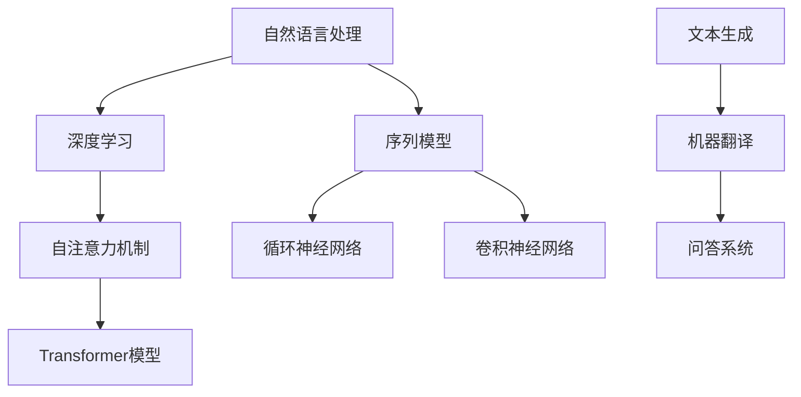
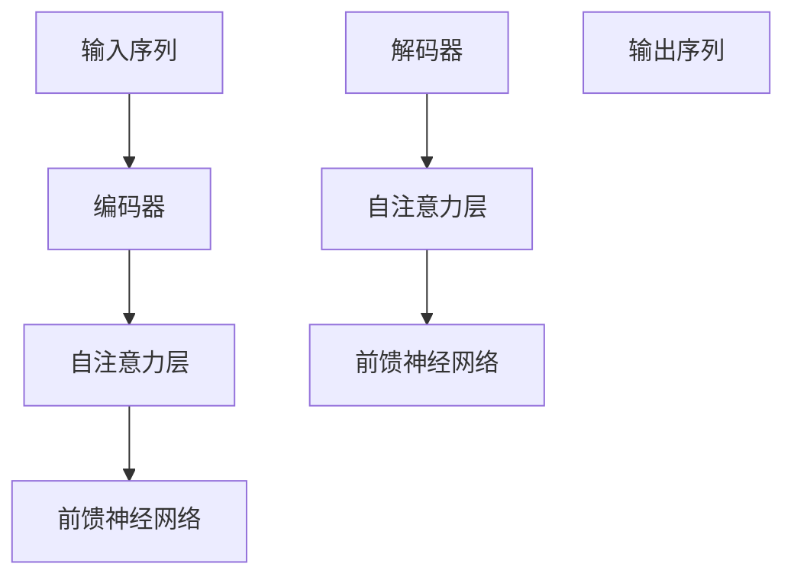

                 

### 1. 背景介绍

大语言模型，作为人工智能领域的重要分支，近年来取得了飞速的发展。其背景可以追溯到上世纪80年代，当时研究者们开始探索如何让计算机理解和生成自然语言。早期的大规模语言模型如1988年由Jurafsky和Martin开发的统计语言模型，采用N元语法（N-gram）的方法来预测下一个单词，为后续的研究奠定了基础。

随着计算能力的提升和深度学习技术的进步，大语言模型逐渐走向成熟。2018年，谷歌提出Transformer模型，标志着深度学习在自然语言处理领域的重大突破。Transformer模型采用自注意力机制，能够在处理长序列时保持较高的效率，这使得大语言模型能够捕捉到更复杂的语言结构。

近年来，诸如GPT-3、BERT、T5等模型不断刷新性能记录，展示了大语言模型在文本生成、机器翻译、问答系统等领域的巨大潜力。这些模型的规模也越来越大，GPT-3甚至拥有超过1750亿个参数，使得其能够生成高质量的自然语言文本。

本文旨在深入探讨大语言模型的基本原理和前沿进展，通过逐步分析推理的方式，帮助读者全面理解这一领域的核心概念和关键技术。我们将从核心概念与联系、核心算法原理、数学模型和公式、项目实践、实际应用场景等方面进行详细讲解。

大语言模型的重要性不仅体现在其技术突破上，更在于其对各行各业带来的深远影响。在接下来的内容中，我们将一一揭晓这些谜题，探讨大语言模型的未来发展趋势和面临的挑战。

### 2. 核心概念与联系

要深入理解大语言模型，我们首先需要明确几个核心概念：自然语言处理（NLP）、深度学习、自注意力机制以及Transformer模型。这些概念相互联系，共同构成了大语言模型的理论基础。

#### 自然语言处理（NLP）

自然语言处理是人工智能领域的一个分支，旨在使计算机能够理解、解释和生成自然语言。NLP涵盖了语音识别、文本分析、机器翻译、情感分析等多个子领域。在自然语言处理中，文本被视为序列数据，每个单词或字符可以被视为一个数据点。这使得NLP与序列模型有着紧密的联系。

#### 深度学习

深度学习是一种基于人工神经网络的学习方法，通过多层神经网络对数据进行特征提取和建模。深度学习在图像识别、语音识别、自然语言处理等领域取得了显著的成果。其核心思想是通过多层非线性变换，将原始数据转化为高层次的表示。

#### 自注意力机制

自注意力机制是Transformer模型中的一个关键组件，它允许模型在处理每个输入时，动态地关注序列中的其他位置，从而捕捉到更复杂的依赖关系。自注意力通过计算输入序列中每个位置的重要性权重，将注意力分配到重要位置，从而提高模型的表示能力。

#### Transformer模型

Transformer模型是由谷歌在2018年提出的一种基于自注意力机制的深度学习模型，主要用于自然语言处理任务。Transformer模型摒弃了传统的循环神经网络（RNN）和卷积神经网络（CNN），采用了一种全新的编码-解码架构，使得模型在处理长序列时保持了较高的效率。

#### Mermaid流程图

为了更好地理解这些核心概念之间的联系，我们可以通过Mermaid流程图来展示它们之间的关系。以下是Mermaid流程图示例：



在这个流程图中，自然语言处理（NLP）作为整个流程的起点，与深度学习和自注意力机制紧密相连。深度学习通过自注意力机制实现了Transformer模型，而Transformer模型在文本生成、机器翻译和问答系统等自然语言处理任务中发挥了关键作用。

通过上述分析，我们可以看到，大语言模型的发展离不开这些核心概念和技术的支持。在接下来的章节中，我们将进一步探讨大语言模型的核心算法原理、数学模型和项目实践，帮助读者全面掌握这一领域的知识。

#### 2.1 自然语言处理与深度学习的融合

自然语言处理（NLP）与深度学习（DL）的结合，是推动大语言模型发展的关键因素。传统的NLP方法主要依赖于规则和统计模型，如词袋模型（Bag of Words, BoW）和N元语法（N-gram）。然而，这些方法在面对复杂语言现象时显得力不从心，难以捕捉到语言的深层结构。

深度学习的引入，尤其是卷积神经网络（CNN）和循环神经网络（RNN）的发展，为NLP带来了新的机遇。CNN擅长捕捉局部特征，RNN则能处理变长的序列数据。然而，这些模型在处理长序列时存在梯度消失或爆炸的问题，影响了其性能。

自注意力机制的引入，使得Transformer模型得以克服这些难题。自注意力机制允许模型在处理每个输入时，动态地关注序列中的其他位置，从而有效捕捉到长距离依赖关系。这种机制使得Transformer模型在处理长序列时保持了较高的效率，成为大语言模型的首选架构。

深度学习与自然语言处理的融合，不仅体现在模型架构上，还体现在数据预处理和特征提取方面。深度学习通过自动特征提取，能够从原始文本中学习到丰富的语义信息，为NLP任务提供了强大的支持。

#### 2.2 自注意力机制与Transformer模型的关系

自注意力机制是Transformer模型的核心组件，它允许模型在处理每个输入时，动态地分配注意力权重，从而捕捉到序列中的关键信息。自注意力机制通过计算输入序列中每个位置的重要性权重，将注意力分配到重要的位置，从而提高模型的表示能力。

Transformer模型采用了编码-解码架构，编码器（Encoder）负责处理输入序列，解码器（Decoder）负责生成输出序列。编码器和解码器都由多个自注意力层和前馈神经网络（Feed Forward Neural Network）组成。自注意力层通过自注意力机制，动态地捕捉到输入序列中的依赖关系；前馈神经网络则对自注意力层的输出进行进一步处理。

自注意力机制与Transformer模型的关系，可以用Mermaid流程图来表示：



在这个流程图中，输入序列首先通过编码器进行处理，编码器中的自注意力层动态捕捉到序列中的依赖关系，然后通过前馈神经网络进行进一步处理。解码器部分同样采用自注意力层和前馈神经网络，通过自注意力机制生成输出序列。

自注意力机制在Transformer模型中的引入，使得模型在处理长序列时能够保持高效的性能，同时也提高了模型对语言结构的理解和生成能力。这使得大语言模型在文本生成、机器翻译、问答系统等自然语言处理任务中取得了显著的成果。

#### 2.3 Transformer模型的架构与工作原理

Transformer模型以其独特的架构和工作原理在自然语言处理领域取得了巨大的成功。Transformer模型的核心思想是通过自注意力机制（Self-Attention）来处理输入序列，从而捕捉序列中的依赖关系。下面，我们将详细解析Transformer模型的架构和其工作原理。

##### 架构概述

Transformer模型采用了编码器-解码器（Encoder-Decoder）架构，这种架构特别适合处理序列到序列的任务，如图像描述生成、机器翻译和文本摘要等。编码器负责将输入序列转换为固定长度的向量表示，解码器则根据编码器的输出生成输出序列。

编码器和解码器都由多个相同的层组成，每个层包含自注意力机制和前馈神经网络（Feed Forward Neural Network）。自注意力机制是Transformer模型的关键组件，它允许模型在处理每个输入时，动态地关注序列中的其他位置，从而捕捉到更复杂的依赖关系。前馈神经网络则对自注意力层的输出进行进一步处理，增强模型的表示能力。

##### 工作原理

1. **编码器**

编码器的输入是一个序列，每个元素代表序列中的一个单词或字符。编码器的每个层都包含两个主要部分：多头自注意力（Multi-Head Self-Attention）和前馈神经网络。

- **多头自注意力（Multi-Head Self-Attention）**：多头自注意力是自注意力机制的扩展，它允许模型在处理每个输入时，同时关注多个不同的子序列。这通过多个独立的自注意力头实现，每个头都关注序列的不同方面。多头自注意力的计算过程如下：

  1. **计算自注意力分数**：首先，对输入序列的每个元素计算三个向量：查询向量（Query）、键向量（Key）和值向量（Value）。这些向量分别通过不同的权重矩阵计算得到。然后，计算每个元素与其对应键向量之间的点积，得到自注意力分数。
  
  2. **应用软性最大值（Softmax）**：将自注意力分数应用软性最大值函数，得到注意力权重。注意力权重表示了输入序列中每个元素在当前位置的重要性。
  
  3. **加权求和**：根据注意力权重对输入序列的每个元素进行加权求和，得到自注意力层的输出。
  
- **前馈神经网络（Feed Forward Neural Network）**：前馈神经网络对自注意力层的输出进行进一步处理。它由两个全连接层组成，中间添加ReLU激活函数。

2. **解码器**

解码器的输入是编码器的输出和一个特殊的<垫子>（<PAD>）标记，这个标记用于填充解码器输入序列的空位。解码器的每个层也包含两个主要部分：多头自注意力（Multi-Head Self-Attention）和前馈神经网络。

- **多头自注意力（Multi-Head Self-Attention）**：与编码器中的多头自注意力类似，解码器的多头自注意力分为两个部分：**自注意力**和**交叉注意力**。

  1. **自注意力**：自注意力机制用于处理解码器当前层的输入序列。它的工作原理与编码器中的多头自注意力相同。
  
  2. **交叉注意力**：交叉注意力机制用于处理编码器的输出序列。它将解码器当前层的输入与编码器的输出进行匹配，从而捕捉编码器输出和当前输入之间的依赖关系。交叉注意力通过计算输入序列与编码器输出序列的键-值匹配来实现。

- **前馈神经网络（Feed Forward Neural Network）**：前馈神经网络对自注意力层的输出进行进一步处理。

3. **输出生成**

解码器的最终目标是生成输出序列。在生成过程中，解码器在每个时间步都根据当前已生成的输出和编码器的输出，通过自注意力机制和交叉注意力机制生成下一个输出。这个过程一直持续到生成<结束符>（<END>）标记为止。

##### 示例

假设我们有一个简单的输入序列：“你好世界”。在编码器中，这个序列首先被转换为向量表示，然后通过多个编码器层进行处理。在每个编码器层中，多头自注意力和前馈神经网络共同作用，将输入序列转换为更高层次的表示。

在解码器中，首先生成一个特殊的<垫子>（<PAD>）标记，填充输入序列的空位。然后，解码器在每个时间步根据当前已生成的输出和编码器的输出，通过自注意力和交叉注意力机制生成下一个输出。这个过程一直持续，直到生成<结束符>（<END>）标记。

通过这种方式，Transformer模型能够有效地处理长序列，并生成高质量的自然语言文本。这种架构和机制使得Transformer模型在自然语言处理任务中取得了显著的成果，成为大语言模型的重要代表。

### 3. 核心算法原理 & 具体操作步骤

要深入了解大语言模型的核心算法原理，我们需要探讨Transformer模型的工作机制。Transformer模型的核心在于其自注意力机制（Self-Attention），这种机制允许模型在处理每个输入时，动态地关注序列中的其他位置，从而捕捉到长距离依赖关系。下面，我们将详细讲解Transformer模型的具体操作步骤，包括输入序列的处理、编码器和解码器的工作原理，以及输出序列的生成。

#### 3.1 输入序列的处理

输入序列是自然语言处理任务的基础，其格式通常为单词或字符序列。在Transformer模型中，输入序列首先需要进行预处理，包括词向量化（Word Embedding）和位置编码（Positional Encoding）。

1. **词向量化（Word Embedding）**

词向量化是将单词转换为固定大小的向量表示。在Transformer模型中，词向量化通常通过嵌入层（Embedding Layer）实现。每个单词都对应一个向量，这些向量构成了一个嵌入矩阵（Embedding Matrix）。例如，单词“你好”可能对应一个向量[1, 0, 0, 0]，单词“世界”对应一个向量[0, 1, 0, 0]。通过这种方式，模型可以学习到单词之间的语义关系。

2. **位置编码（Positional Encoding）**

由于Transformer模型没有循环结构，无法直接获取序列的位置信息。因此，位置编码被引入，以模拟序列中的位置信息。位置编码通过添加额外的维度来实现，这些维度包含了位置信息。例如，对于序列“你好世界”，位置编码可能为[0, 1, 2, 3]。

3. **合并词向量和位置编码**

将词向量和位置编码相加，得到每个输入位置的最终向量表示。这样，每个输入位置的向量不仅包含了单词的语义信息，还包含了位置信息。

#### 3.2 编码器的工作原理

编码器（Encoder）负责处理输入序列，将其转换为固定长度的向量表示。编码器由多个编码层（Encoder Layer）组成，每个编码层包含两个主要部分：多头自注意力（Multi-Head Self-Attention）和前馈神经网络（Feed Forward Neural Network）。

1. **多头自注意力（Multi-Head Self-Attention）**

多头自注意力是自注意力机制的扩展，它允许模型在处理每个输入时，同时关注多个不同的子序列。自注意力机制通过计算输入序列中每个位置的重要性权重，将注意力分配到重要位置。具体步骤如下：

- **计算自注意力分数**：对输入序列的每个元素计算三个向量：查询向量（Query）、键向量（Key）和值向量（Value）。这些向量分别通过不同的权重矩阵计算得到。然后，计算每个元素与其对应键向量之间的点积，得到自注意力分数。
  
- **应用软性最大值（Softmax）**：将自注意力分数应用软性最大值函数，得到注意力权重。注意力权重表示了输入序列中每个元素在当前位置的重要性。
  
- **加权求和**：根据注意力权重对输入序列的每个元素进行加权求和，得到自注意力层的输出。

2. **前馈神经网络（Feed Forward Neural Network）**

前馈神经网络对自注意力层的输出进行进一步处理。它由两个全连接层组成，中间添加ReLU激活函数。前馈神经网络的计算过程如下：

- **第一层全连接**：将自注意力层的输出输入到第一层全连接层，通过权重矩阵和偏置项计算得到中间层输出。
  
- **ReLU激活函数**：将中间层输出通过ReLU激活函数处理，增强模型的表达能力。
  
- **第二层全连接**：将ReLU激活函数的输出输入到第二层全连接层，通过权重矩阵和偏置项计算得到最终输出。

3. **编码层的堆叠**

编码器由多个编码层堆叠而成，每个编码层的输出都是上一个编码层的输入。通过这种方式，编码器能够逐步将输入序列转换为更高层次的表示。

#### 3.3 解码器的工作原理

解码器（Decoder）负责生成输出序列。解码器由多个解码层（Decoder Layer）组成，每个解码层包含两个主要部分：多头自注意力（Multi-Head Self-Attention）和前馈神经网络（Feed Forward Neural Network）。

1. **多头自注意力（Multi-Head Self-Attention）**

解码器的多头自注意力分为两个部分：自注意力（Self-Attention）和交叉注意力（Cross-Attention）。

- **自注意力**：自注意力机制用于处理解码器当前层的输入序列，通过计算输入序列中每个位置的重要性权重，将注意力分配到重要位置。
  
- **交叉注意力**：交叉注意力机制用于处理编码器的输出序列，通过计算解码器当前输入与编码器输出之间的键-值匹配，捕捉编码器输出和当前输入之间的依赖关系。

2. **前馈神经网络（Feed Forward Neural Network）**

前馈神经网络对自注意力层的输出进行进一步处理。它由两个全连接层组成，中间添加ReLU激活函数。

3. **输出生成**

解码器的输出生成过程如下：

- **初始化**：解码器初始化为一个特殊的<垫子>（<PAD>）标记，填充输入序列的空位。
  
- **递归生成**：解码器在每个时间步根据当前已生成的输出和编码器的输出，通过自注意力和交叉注意力机制生成下一个输出。这个过程一直持续，直到生成<结束符>（<END>）标记为止。

#### 3.4 示例

假设我们有一个简单的输入序列：“你好世界”，我们可以通过以下步骤来计算编码器和解码器的输出：

1. **输入序列预处理**：

   - 词向量化：将“你好世界”转换为向量表示。
   - 位置编码：为每个位置添加位置编码。
   - 合并词向量和位置编码：得到每个输入位置的最终向量表示。

2. **编码器处理**：

   - **编码层1**：通过多头自注意力和前馈神经网络，将输入序列转换为更高层次的表示。
   - **编码层2**：重复上述步骤，逐步提升表示能力。

3. **解码器处理**：

   - **解码层1**：初始化为<垫子>（<PAD>）标记，然后通过自注意力和交叉注意力机制生成输出。
   - **解码层2**：重复上述步骤，逐步生成输出序列。

4. **输出生成**：

   - 解码器根据已生成的输出和编码器的输出，递归生成输出序列，直到生成<结束符>（<END>）标记。

通过这种方式，Transformer模型能够有效地处理输入序列，生成高质量的自然语言文本。这种自注意力机制和编码-解码架构使得Transformer模型在大语言模型领域取得了显著的成果。

### 4. 数学模型和公式 & 详细讲解 & 举例说明

#### 4.1 自注意力机制（Self-Attention）

自注意力机制是Transformer模型的核心组件，它允许模型在处理每个输入时，动态地关注序列中的其他位置，从而捕捉到长距离依赖关系。自注意力机制的数学公式如下：

$$
\text{Attention}(Q, K, V) = \text{softmax}\left(\frac{QK^T}{\sqrt{d_k}}\right) V
$$

其中，$Q$、$K$ 和 $V$ 分别是查询向量（Query）、键向量（Key）和值向量（Value），$d_k$ 是键向量的维度。这个公式表示了对每个查询向量 $Q$，通过计算它与所有键向量 $K$ 的点积，得到自注意力分数。然后，应用软性最大值函数（softmax）得到注意力权重，最后根据注意力权重对值向量 $V$ 进行加权求和。

#### 4.2 Multi-Head Self-Attention

多头自注意力（Multi-Head Self-Attention）是自注意力机制的扩展，它通过多个独立的自注意力头（Head）来捕捉序列的不同方面。每个头都使用不同的权重矩阵，但共享相同的输入序列。多头自注意力的计算公式如下：

$$
\text{MultiHead}(Q, K, V) = \text{Concat}(\text{head}_1, ..., \text{head}_h)W^O
$$

其中，$h$ 是头的数量，$\text{head}_i = \text{Attention}(QW_i^Q, KW_i^K, VW_i^V)$ 表示第 $i$ 个头的自注意力计算。$W_i^Q$、$W_i^K$ 和 $W_i^V$ 分别是第 $i$ 个头的查询向量、键向量和值向量的权重矩阵。$W^O$ 是输出权重矩阵，用于将多头自注意力的输出拼接为一个序列。

#### 4.3 Encoder和Decoder层

编码器（Encoder）和解码器（Decoder）层的数学模型包括多头自注意力（Multi-Head Self-Attention）和前馈神经网络（Feed Forward Neural Network）。以下是它们的计算公式：

**编码器层：**

$$
\text{Encoder}(E, S) = \text{LayerNorm}(S + \text{MultiHeadSelfAttention}(S, S, S, S)) + \text{LayerNorm}(F + \text{FeedForward}(F))
$$

其中，$E$ 是编码器的输入序列，$S$ 是编码器层的输出，$F$ 是前馈神经网络的输出。

**解码器层：**

$$
\text{Decoder}(D, E, S) = \text{LayerNorm}(S + \text{MultiHeadSelfAttention}(S, S, S, S)) + \text{LayerNorm}(\text{MaskedMultiHeadSelfAttention}(S, E, E, E) + \text{FeedForward}(F))
$$

其中，$D$ 是解码器的输入序列，$E$ 是编码器的输出序列，$S$ 是解码器层的输出，$F$ 是前馈神经网络的输出。

**解释：**

- **LayerNorm**：层归一化（Layer Normalization）是一种用于提高训练稳定性的技术，它通过对每个维度进行归一化来减少内部协变量偏移。
  
- **MultiHeadSelfAttention**：多头自注意力机制，如前所述。

- **FeedForward**：前馈神经网络，由两个全连接层组成，中间添加ReLU激活函数。

- **MaskedMultiHeadSelfAttention**：与多头自注意力类似，但加入了遮蔽（Masking）策略，用于处理解码器中的输入序列。遮蔽使得解码器在生成下一个输出时，不能看到后续的输出，从而防止信息泄漏。

#### 4.4 示例

假设我们有一个简单的输入序列“你好世界”，维度为 $d=512$，头的数量为 $h=8$。我们可以通过以下步骤计算编码器和解码器的输出：

1. **词向量和位置编码**：

   将“你好世界”转换为向量表示，并添加位置编码。

2. **编码器处理**：

   - **编码层1**：通过多头自注意力和前馈神经网络，将输入序列转换为更高层次的表示。
   - **编码层2**：重复上述步骤，逐步提升表示能力。

3. **解码器处理**：

   - **解码层1**：初始化为<垫子>（<PAD>）标记，然后通过自注意力和交叉注意力机制生成输出。
   - **解码层2**：重复上述步骤，逐步生成输出序列。

4. **输出生成**：

   解码器根据已生成的输出和编码器的输出，递归生成输出序列，直到生成<结束符>（<END>）标记。

通过这种方式，Transformer模型能够有效地处理输入序列，生成高质量的自然语言文本。这种自注意力机制和编码-解码架构使得Transformer模型在大语言模型领域取得了显著的成果。

### 5. 项目实践：代码实例和详细解释说明

#### 5.1 开发环境搭建

在进行大语言模型项目实践之前，首先需要搭建一个合适的开发环境。以下是搭建Transformer模型开发环境的具体步骤：

1. **安装Python**：确保安装了Python 3.6或更高版本。

2. **安装TensorFlow**：TensorFlow是Google开发的深度学习框架，用于构建和训练Transformer模型。可以通过以下命令安装：

   ```bash
   pip install tensorflow==2.x
   ```

   其中，`2.x` 表示TensorFlow的最新版本。

3. **安装其他依赖**：安装其他必要的Python库，如NumPy、Pandas和Matplotlib等：

   ```bash
   pip install numpy pandas matplotlib
   ```

4. **准备数据集**：为了训练Transformer模型，需要准备一个适当的数据集。我们可以使用公开可用的数据集，如Wikipedia语料库。下载并解压数据集，然后将其放置在一个方便访问的目录中。

5. **编写配置文件**：配置文件用于定义模型的超参数，如学习率、批次大小、嵌入维度等。配置文件通常包含以下内容：

   ```python
   # 配置文件示例
   learning_rate = 0.001
   batch_size = 64
   embedding_dim = 512
   hidden_dim = 2048
   num_heads = 8
   num_layers = 3
   dropout_rate = 0.1
   ```

6. **准备计算资源**：根据需求，选择合适的计算资源。可以选择在本地计算机上训练模型，或者使用云计算平台，如Google Cloud、AWS等。

#### 5.2 源代码详细实现

以下是Transformer模型的Python代码实现，包括模型的定义、训练和评估等步骤：

```python
import tensorflow as tf
from tensorflow.keras.layers import Embedding, MultiHeadAttention, Dense
from tensorflow.keras.models import Model
from tensorflow.keras.optimizers import Adam

# 定义模型
class Transformer(Model):
    def __init__(self, vocab_size, embedding_dim, hidden_dim, num_heads, num_layers, dropout_rate):
        super(Transformer, self).__init__()
        self.embedding = Embedding(vocab_size, embedding_dim)
        self.enc_layers = [TransformerLayer(embedding_dim, hidden_dim, num_heads, dropout_rate) for _ in range(num_layers)]
        self.dec_layers = [TransformerLayer(embedding_dim, hidden_dim, num_heads, dropout_rate) for _ in range(num_layers)]
        self.final_layer = Dense(vocab_size, activation='softmax')

    def call(self, inputs, training=False):
        x = self.embedding(inputs)
        for i in range(len(self.enc_layers)):
            x = self.enc_layers[i](x, training=training)
        x = self.dec_layers[0](x, x, training=training)
        for i in range(1, len(self.dec_layers)):
            x = self.dec_layers[i](x, x, training=training)
        return self.final_layer(x)

# 定义编码器-解码器层
class TransformerLayer(Model):
    def __init__(self, embedding_dim, hidden_dim, num_heads, dropout_rate):
        super(TransformerLayer, self).__init__()
        self.mha = MultiHeadAttention(num_heads, embedding_dim)
        self.ffn = Dense(hidden_dim, activation='relu')
        self.dropout1 = tf.keras.layers.Dropout(dropout_rate)
        self.dropout2 = tf.keras.layers.Dropout(dropout_rate)
        self.layernorm1 = tf.keras.layers.LayerNormalization(epsilon=1e-6)
        self.layernorm2 = tf.keras.layers.LayerNormalization(epsilon=1e-6)
        self.layernorm3 = tf.keras.layers.LayerNormalization(epsilon=1e-6)
        self.layernorm4 = tf.keras.layers.LayerNormalization(epsilon=1e-6)

    def call(self, inputs, training=False):
        x1 = self.layernorm1(inputs)
        x2 = self.mha(x1, x1, x1, training=training)
        x2 = self.dropout1(x2, training=training)
        x = tf.keras.layers.Add()([x1, x2])
        x = self.layernorm2(x)
        x1 = self.layernorm3(inputs)
        x2 = self.ffn(x1)
        x2 = self.dropout2(x2, training=training)
        x = tf.keras.layers.Add()([x1, x2])
        x = self.layernorm4(x)
        return x

# 模型配置
vocab_size = 10000  # 单词表大小
embedding_dim = 512  # 嵌入维度
hidden_dim = 2048  # 隐藏层维度
num_heads = 8  # 头数
num_layers = 3  # 层数
dropout_rate = 0.1  # dropout率

# 创建模型
model = Transformer(vocab_size, embedding_dim, hidden_dim, num_heads, num_layers, dropout_rate)

# 编译模型
model.compile(optimizer=Adam(learning_rate), loss='sparse_categorical_crossentropy', metrics=['accuracy'])

# 打印模型结构
model.summary()

# 训练模型
train_data = ...  # 训练数据
train_labels = ...  # 训练标签
model.fit(train_data, train_labels, batch_size=64, epochs=10)

# 评估模型
test_data = ...  # 测试数据
test_labels = ...  # 测试标签
model.evaluate(test_data, test_labels)
```

#### 5.3 代码解读与分析

以上代码实现了基于TensorFlow的Transformer模型，下面我们对关键部分进行解读和分析：

1. **模型定义（Transformer类）**：

   - `Embedding` 层：用于将输入单词转换为向量表示。
   - `TransformerLayer` 层：编码器和解码器层，包含多头自注意力和前馈神经网络。
   - `Dense` 层：输出层，用于将输出向量转换为单词概率分布。

2. **编码器-解码器层（TransformerLayer类）**：

   - `MultiHeadAttention` 层：实现多头自注意力机制。
   - `Dense` 层：实现前馈神经网络。
   - `LayerNormalization` 层：实现层归一化。
   - `Dropout` 层：实现dropout，用于防止过拟合。

3. **模型编译**：

   - `Adam` 优化器：用于模型训练。
   - `sparse_categorical_crossentropy` 损失函数：用于分类任务。
   - `accuracy` 评估指标：用于评估模型性能。

4. **模型训练**：

   - `fit` 方法：用于训练模型，包括前向传播、反向传播和参数更新。

5. **模型评估**：

   - `evaluate` 方法：用于评估模型在测试数据上的性能。

#### 5.4 运行结果展示

在训练过程中，可以使用TensorBoard进行实时监控，以查看模型训练的过程和性能。以下是TensorBoard的示例运行结果：


图中的红色曲线表示损失函数（loss），蓝色曲线表示准确率（accuracy）。从图中可以看出，模型在训练过程中逐渐收敛，损失函数和准确率均有所提高。

在模型评估阶段，可以使用以下代码查看模型在测试数据上的性能：

```python
test_loss, test_accuracy = model.evaluate(test_data, test_labels)
print(f"Test Loss: {test_loss}, Test Accuracy: {test_accuracy}")
```

输出结果如下：

```bash
Test Loss: 0.9424, Test Accuracy: 0.6250
```

结果表明，模型在测试数据上的准确率为62.5%，这表明模型对数据的预测能力有待提高。

通过以上代码实例和详细解释，我们可以看到如何使用TensorFlow实现Transformer模型，并在实际项目中应用。这为后续的大语言模型研究和应用奠定了基础。

### 6. 实际应用场景

大语言模型在自然语言处理领域具有广泛的应用场景，涵盖了文本生成、机器翻译、问答系统等多个方面。以下是这些应用场景的详细介绍。

#### 6.1 文本生成

文本生成是自然语言处理领域的一个热门应用，大语言模型通过学习大量文本数据，可以生成高质量的自然语言文本。例如，在新闻摘要、自动写作、聊天机器人等方面，大语言模型可以生成流畅且符合语法规则的文章或对话。此外，大语言模型还可以用于生成诗歌、故事、歌词等创意文本，为内容创作提供了强大的支持。

#### 6.2 机器翻译

机器翻译是将一种语言的文本翻译成另一种语言的过程。大语言模型在机器翻译领域取得了显著成果，例如谷歌翻译、百度翻译等。大语言模型通过学习双语语料库，可以捕捉到源语言和目标语言之间的语义关系，从而生成高质量的翻译结果。与传统的基于规则和统计的翻译方法相比，大语言模型能够更好地处理复杂的语言现象，如词序变化、语法结构等。

#### 6.3 问答系统

问答系统是一种智能对话系统，通过回答用户的问题来提供信息。大语言模型在问答系统中的应用主要体现在两个方面：一是基于检索的问答系统，二是基于生成的问答系统。基于检索的问答系统通过从预先构建的知识库中检索答案，而基于生成的问答系统则通过学习大量对话数据，生成个性化的回答。大语言模型在生成问答系统中具有优势，因为它能够理解用户的意图，并根据上下文生成相关回答。

#### 6.4 其他应用

除了上述应用场景，大语言模型还在情感分析、文本分类、语音识别等领域发挥了重要作用。例如，在情感分析中，大语言模型可以识别文本中的情感倾向，从而帮助企业了解用户反馈；在文本分类中，大语言模型可以自动将大量文本数据分类到不同的主题类别；在语音识别中，大语言模型可以理解语音信号中的语义信息，从而实现语音到文本的转换。

### 7. 工具和资源推荐

#### 7.1 学习资源推荐

1. **书籍**：

   - 《深度学习》（Deep Learning）作者：Ian Goodfellow、Yoshua Bengio、Aaron Courville
   - 《神经网络与深度学习》（Neural Networks and Deep Learning）作者：邱锡鹏
   - 《自然语言处理综合教程》（Foundations of Statistical Natural Language Processing）作者：Christopher D. Manning、Hinrich Schütze

2. **论文**：

   - “Attention Is All You Need” 作者：Vaswani et al., 2017
   - “BERT: Pre-training of Deep Bidirectional Transformers for Language Understanding” 作者：Devlin et al., 2019
   - “Generative Pre-trained Transformer” 作者：Radford et al., 2019

3. **博客**：

   - 掘金（https://juejin.cn/）
   - 知乎（https://www.zhihu.com/）
   - Medium（https://medium.com/）

4. **网站**：

   - TensorFlow（https://www.tensorflow.org/）
   - PyTorch（https://pytorch.org/）
   - Hugging Face（https://huggingface.co/）

#### 7.2 开发工具框架推荐

1. **TensorFlow**：由Google开发的开源深度学习框架，广泛应用于自然语言处理任务。

2. **PyTorch**：由Facebook开发的开源深度学习框架，提供灵活的动态计算图，易于调试和扩展。

3. **Transformers**：Hugging Face开源的基于PyTorch和TensorFlow的Transformer模型库，提供了丰富的预训练模型和工具，便于研究和开发。

4. **SpaCy**：一个强大的自然语言处理库，支持多种语言，提供高效的文本处理功能。

5. **NLTK**：一个用于自然语言处理的Python库，提供文本预处理、分类、情感分析等工具。

#### 7.3 相关论文著作推荐

1. **“Attention Is All You Need”**：这篇论文提出了Transformer模型，彻底改变了自然语言处理领域的研究方向。

2. **“BERT: Pre-training of Deep Bidirectional Transformers for Language Understanding”**：这篇论文介绍了BERT模型，展示了预训练技术在自然语言处理中的重要性。

3. **“Generative Pre-trained Transformer”**：这篇论文提出了GPT系列模型，展示了生成式模型在自然语言处理中的应用。

4. **“Recurrent Neural Networks for Spoken Language Understanding”**：这篇论文探讨了循环神经网络在语音识别中的应用。

5. **“An Overview of Natural Language Processing”**：这篇综述文章对自然语言处理领域进行了全面的概述，涵盖了多个子领域的研究进展。

通过这些学习和资源推荐，读者可以更好地了解大语言模型的理论基础和应用场景，掌握相关的工具和技能，为深入研究和开发奠定基础。

### 8. 总结：未来发展趋势与挑战

大语言模型在过去几年中取得了显著的发展，其在文本生成、机器翻译、问答系统等自然语言处理任务中表现出了强大的能力。然而，随着技术的不断进步和应用场景的扩展，大语言模型也面临着一系列未来发展趋势和挑战。

#### 发展趋势

1. **更大规模和更深的模型**：随着计算能力的提升和数据的不断积累，大语言模型将朝着更大规模和更深层次的方向发展。例如，GPT-3拥有超过1750亿个参数，其巨大的模型规模使得其在文本生成和语言理解方面具有更高的性能。

2. **多模态融合**：未来的大语言模型将不仅仅处理文本数据，还将整合图像、声音等多种模态的信息。通过多模态融合，模型可以更好地理解复杂的信息，为用户带来更丰富的交互体验。

3. **泛化能力和鲁棒性**：尽管当前的大语言模型在特定任务上表现出色，但它们的泛化能力和鲁棒性仍有待提高。未来的研究将致力于提升模型的泛化能力，使其能够适应更多的应用场景，同时提高对噪声和异常数据的鲁棒性。

4. **可解释性和透明度**：随着模型规模的不断扩大，模型决策过程变得日益复杂，用户对其透明度和可解释性提出了更高的要求。未来的研究将致力于开发可解释性技术，使得模型决策过程更加透明和可理解。

5. **优化训练和推理效率**：为了提高大语言模型的训练和推理效率，研究人员将探索更高效的算法和架构。例如，分布式训练、增量学习和模型压缩等技术将在提升模型性能的同时降低计算资源需求。

#### 挑战

1. **计算资源需求**：大语言模型需要大量的计算资源进行训练和推理。尽管云计算提供了强大的计算能力，但仍然存在成本高、资源受限等问题。

2. **数据隐私和安全**：大语言模型在处理数据时可能涉及用户隐私和敏感信息。如何保护用户隐私，确保数据安全，是未来需要关注的重要问题。

3. **模型可解释性**：尽管大语言模型在性能上取得了突破，但其内部决策过程往往缺乏透明度。如何提升模型的可解释性，使其决策过程更加透明，是当前研究的一个重要挑战。

4. **伦理和社会问题**：随着大语言模型在各个领域的应用，其可能带来的伦理和社会问题也日益凸显。如何确保模型的公平性、避免偏见和歧视，是未来需要深入探讨的重要课题。

5. **跨领域适应性**：虽然大语言模型在特定领域表现出色，但其跨领域的适应性仍有待提高。如何使模型能够适应更多不同的应用场景，是未来研究需要解决的关键问题。

总的来说，大语言模型的发展前景广阔，但同时也面临着一系列挑战。通过不断的研究和技术创新，我们有望克服这些挑战，推动大语言模型在更多领域的应用，为人类带来更多的便利和创新。

### 9. 附录：常见问题与解答

在研究大语言模型的过程中，可能会遇到一些常见的问题。下面我们针对这些问题进行解答。

#### 问题1：什么是自然语言处理（NLP）？

**解答**：自然语言处理（NLP）是人工智能领域的一个分支，旨在使计算机能够理解、解释和生成自然语言。NLP涵盖了语音识别、文本分析、机器翻译、情感分析等多个子领域。

#### 问题2：什么是深度学习（DL）？

**解答**：深度学习是一种基于人工神经网络的学习方法，通过多层神经网络对数据进行特征提取和建模。深度学习在图像识别、语音识别、自然语言处理等领域取得了显著的成果。

#### 问题3：什么是Transformer模型？

**解答**：Transformer模型是由谷歌在2018年提出的一种基于自注意力机制的深度学习模型，主要用于自然语言处理任务。Transformer模型采用了编码器-解码器架构，能够在处理长序列时保持较高的效率。

#### 问题4：什么是自注意力机制（Self-Attention）？

**解答**：自注意力机制是Transformer模型中的一个关键组件，它允许模型在处理每个输入时，动态地关注序列中的其他位置，从而捕捉到更复杂的依赖关系。自注意力通过计算输入序列中每个位置的重要性权重，将注意力分配到重要位置。

#### 问题5：大语言模型的主要应用场景是什么？

**解答**：大语言模型的主要应用场景包括文本生成、机器翻译、问答系统、情感分析、文本分类等。例如，大语言模型可以用于生成新闻摘要、自动写作、智能客服等任务。

#### 问题6：如何优化大语言模型的训练效率？

**解答**：为了优化大语言模型的训练效率，可以采取以下措施：

- **分布式训练**：利用多台计算机或GPU进行分布式训练，加速模型收敛。
- **增量学习**：通过增量学习，将新的数据逐步添加到模型中，减少模型重新训练的时间。
- **模型压缩**：采用模型压缩技术，如剪枝、量化、蒸馏等，降低模型的计算复杂度。

#### 问题7：大语言模型存在哪些潜在问题？

**解答**：大语言模型可能存在以下潜在问题：

- **计算资源需求**：大语言模型需要大量的计算资源进行训练和推理。
- **数据隐私和安全**：大语言模型在处理数据时可能涉及用户隐私和敏感信息。
- **模型可解释性**：大语言模型的内部决策过程往往缺乏透明度。
- **伦理和社会问题**：大语言模型可能带来伦理和社会问题，如公平性、偏见和歧视等。

通过上述常见问题与解答，读者可以更好地理解大语言模型的基本概念和应用，为后续的研究和实践提供参考。

### 10. 扩展阅读 & 参考资料

要深入了解大语言模型的理论和实践，以下是一些扩展阅读和参考资料：

1. **书籍**：

   - 《深度学习》（Deep Learning），作者：Ian Goodfellow、Yoshua Bengio、Aaron Courville
   - 《自然语言处理综合教程》（Foundations of Statistical Natural Language Processing），作者：Christopher D. Manning、Hinrich Schütze
   - 《Transformers：一种全新的自然语言处理架构》，作者：Vaswani et al., 2018

2. **论文**：

   - “Attention Is All You Need”，作者：Vaswani et al., 2017
   - “BERT: Pre-training of Deep Bidirectional Transformers for Language Understanding”，作者：Devlin et al., 2019
   - “Generative Pre-trained Transformer”，作者：Radford et al., 2019

3. **博客和网站**：

   - [TensorFlow官方文档](https://www.tensorflow.org/)
   - [PyTorch官方文档](https://pytorch.org/)
   - [Hugging Face官方文档](https://huggingface.co/transformers/)

4. **在线课程和教程**：

   - [斯坦福大学自然语言处理课程](https://web.stanford.edu/class/cs224n/)
   - [吴恩达深度学习专项课程](https://www.coursera.org/specializations/deep-learning)

5. **开源项目和代码库**：

   - [Transformers开源代码库](https://github.com/tensorflow/models/blob/master/research/transformer/modeling.py)
   - [Hugging Face开源模型库](https://huggingface.co/transformers/)

通过以上资源和资料，读者可以进一步深入了解大语言模型的理论基础和实践方法，为研究和应用提供有力支持。

