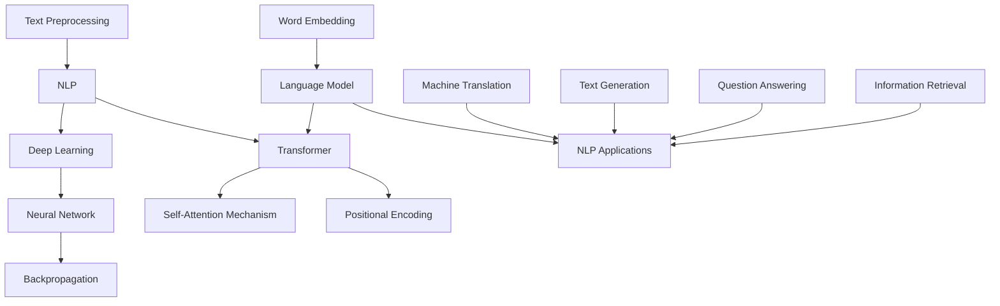

                 

### 1. 背景介绍

大语言模型（Large Language Models）是近年来人工智能领域的一项重要突破，它广泛应用于自然语言处理（Natural Language Processing，NLP）的各个子领域，如机器翻译、文本生成、问答系统、文本分类等。这些模型通过学习大量的文本数据，能够理解和生成人类语言，实现了前所未有的自然度和准确性。

语言模型的兴起可以追溯到20世纪50年代，当时图灵提出了“图灵测试”这一概念，旨在评估机器是否具备智能。随着计算机技术的进步和算法的发展，尤其是深度学习（Deep Learning）的兴起，语言模型的性能得到了显著提升。特别是2018年谷歌提出的Transformer模型，标志着语言模型进入了一个新的时代。

大语言模型之所以重要，首先是因为它在许多实际应用场景中展现了出色的表现。例如，在机器翻译领域，基于大语言模型的系统已经能够实现接近人类翻译水平的翻译效果；在文本生成领域，大语言模型可以生成高质量的文章、诗歌和故事；在问答系统领域，大语言模型能够理解用户的问题，并给出准确、合理的回答。此外，大语言模型还在信息检索、内容审核、情绪分析等领域有着广泛的应用。

然而，大语言模型的发展也带来了新的挑战。首先是如何训练这些庞大的模型，如何有效地处理海量的数据，这需要高效的算法和大量的计算资源。其次是模型的解释性较差，我们难以理解模型内部的工作机制，这对于模型的可靠性和安全性提出了挑战。最后，大语言模型的训练和应用过程中可能会涉及隐私和数据安全问题，如何确保数据的安全和隐私是一个重要课题。

本文将围绕大语言模型的原理、实现方法、应用场景以及未来发展趋势进行深入探讨。我们将首先介绍大语言模型的核心概念和联系，然后详细讲解其核心算法原理和操作步骤，接着分析其数学模型和公式，并给出一个具体的代码实例。随后，我们将讨论大语言模型在实际应用场景中的具体表现，推荐相关的工具和资源，并总结其未来发展趋势与挑战。

通过本文的阅读，您将全面了解大语言模型的工作原理和应用方法，为在相关领域进行研究和实践提供理论指导和实践参考。

### 2. 核心概念与联系

要理解大语言模型，我们首先需要掌握几个核心概念，这些概念包括但不限于：自然语言处理（NLP）、深度学习（Deep Learning）、神经网络（Neural Network）、Transformer模型和自注意力机制（Self-Attention Mechanism）。

#### 自然语言处理（NLP）

自然语言处理是人工智能的一个重要分支，旨在使计算机能够理解、生成和处理人类语言。NLP涉及到文本的预处理、语言模型、语义分析、情感分析等多个方面。在自然语言处理中，文本被视为一种特殊的序列数据，其处理通常包括分词、词性标注、句法分析等步骤。

#### 深度学习（Deep Learning）

深度学习是机器学习的一个子领域，它通过模拟人脑的神经网络结构，对数据进行自动特征提取和学习。深度学习模型通常由多个隐层组成，这使得它们能够学习更加复杂的特征表示。在自然语言处理领域，深度学习模型如卷积神经网络（CNN）、递归神经网络（RNN）和Transformer等，被广泛应用于语言模型的构建。

#### 神经网络（Neural Network）

神经网络是深度学习的基础，它由大量的节点（称为神经元）组成，每个节点之间通过权重连接。在训练过程中，神经网络通过反向传播算法调整权重，以最小化预测误差。神经网络可以模拟生物神经元的工作方式，通过多层隐层的堆叠，实现对复杂数据的建模和预测。

#### Transformer模型

Transformer模型是由谷歌团队在2017年提出的一种全新的深度学习模型，它彻底改变了自然语言处理领域。与传统基于递归的模型（如RNN和LSTM）不同，Transformer模型基于自注意力机制，能够在处理长序列数据时保持高效性和并行性。Transformer模型的核心创新在于它的多头自注意力机制（Multi-Head Self-Attention）和位置编码（Positional Encoding）。

#### 自注意力机制（Self-Attention Mechanism）

自注意力机制是Transformer模型的关键组成部分，它允许模型在不同的位置上对序列中的每个词进行加权，从而学习到词汇之间的依赖关系。自注意力通过计算词与词之间的相似性得分，将注意力分配给重要的词，从而提高了模型对长距离依赖的捕捉能力。

#### 核心概念关系图

为了更好地理解这些概念之间的关系，我们可以使用Mermaid流程图（Mermaid Diagram）来表示它们之间的联系：



在上面的关系图中，我们可以看到自然语言处理（NLP）作为整个领域的基础，连接着深度学习（Deep Learning）和神经网络（Neural Network）。Transformer模型（D）通过自注意力机制（E）和位置编码（G）实现了对自然语言处理的创新，而神经网络（C）通过反向传播（F）算法优化模型参数。此外，文本预处理（H）、词嵌入（I）和语言模型（J）是Transformer模型（D）构建的重要环节，它们共同推动了NLP在各种应用场景（如机器翻译、文本生成、问答系统等）中的广泛应用。

通过上述核心概念的介绍和关系图的展示，我们为理解大语言模型奠定了理论基础。在接下来的章节中，我们将深入探讨大语言模型的具体算法原理和实现方法。

### 3. 核心算法原理 & 具体操作步骤

大语言模型的核心算法是基于深度学习和自注意力机制的Transformer模型。Transformer模型通过自注意力机制对序列中的每个词进行加权，捕捉词与词之间的长距离依赖关系，从而实现对文本的建模和生成。下面我们将详细讲解Transformer模型的基本原理和具体操作步骤。

#### 3.1 Transformer模型的基本原理

Transformer模型由编码器（Encoder）和解码器（Decoder）两部分组成。编码器负责将输入序列编码成固定长度的向量，解码器则根据编码器的输出和先前的预测逐步生成输出序列。

##### 3.1.1 编码器（Encoder）

编码器由多个编码层（Encoder Layer）堆叠而成，每个编码层包括两个子层：多头自注意力层（Multi-Head Self-Attention Layer）和前馈神经网络层（Feedforward Neural Network Layer）。多头自注意力层负责对输入序列进行加权，捕捉长距离依赖关系；前馈神经网络层对自注意力层的输出进行进一步加工。

在多头自注意力层中，输入序列首先通过线性变换得到自注意力查询（Query）、自注意力键（Key）和自注意力值（Value）。这三个向量的维度相同，通常为序列长度乘以隐藏维度。然后，通过计算每个词与其他词的相似性得分，使用softmax函数对得分进行归一化，得到注意力权重。最后，将这些权重与对应的值相乘，得到加权向量。多个头自注意力层的输出通过线性变换合并为一个向量，作为当前编码层的输入。

前馈神经网络层由两个全连接层组成，首先对输入向量进行线性变换，然后通过ReLU激活函数，最后再进行一次线性变换。

##### 3.1.2 解码器（Decoder）

解码器同样由多个解码层（Decoder Layer）堆叠而成，每个解码层包括两个子层：多头自注意力层和前馈神经网络层。解码器与编码器的主要区别在于，解码器的输入不仅包括编码器的输出，还包括解码器自身的输出。具体来说，在解码器的每个时间步，解码器会根据编码器的输出和先前的预测生成当前时间步的输出。

在多头自注意力层中，解码器的输入首先通过线性变换得到自注意力查询、自注意力键和自注意力值。然后，与编码器输出进行自注意力操作，生成加权向量。在解码器中，自注意力操作也分为两步：第一步是自注意力，用于捕捉长距离依赖关系；第二步是交叉注意力，用于捕捉编码器输出和当前解码器输出之间的依赖关系。

前馈神经网络层的操作与编码器的前馈神经网络层相同。

##### 3.1.3 位置编码（Positional Encoding）

由于Transformer模型不包含循环结构，无法直接处理序列中的位置信息。因此，Transformer模型引入了位置编码（Positional Encoding）来模拟位置信息。位置编码通过将位置信息编码到输入向量中，使得模型能够学习到词与词之间的位置关系。

位置编码通常采用正弦和余弦函数生成，其维度与自注意力层的隐藏维度相同。具体来说，对于每个时间步 \( t \) 和维度 \( d \)，位置编码向量 \( PE_{(t,d)} \) 可以表示为：

$$
PE_{(t,d)} = 
\begin{cases}
    \sin\left(\frac{t}{10000^{d/2}}\right) & \text{if } d \text{ is even} \\
    \cos\left(\frac{t}{10000^{d/2}}\right) & \text{if } d \text{ is odd}
\end{cases}
$$

##### 3.1.4 模型训练与预测

在训练过程中，模型的目标是最小化预测误差，通常采用损失函数如交叉熵损失（Cross-Entropy Loss）来衡量预测误差。具体来说，模型会通过反向传播算法调整权重，以最小化损失函数。

在预测过程中，模型会输入一个序列，并逐个生成每个时间步的输出。具体步骤如下：

1. **初始化输入向量**：将输入序列通过词嵌入层（Word Embedding Layer）转换为向量。
2. **添加位置编码**：将初始化的输入向量与位置编码向量相加，得到编码后的输入向量。
3. **通过编码器**：输入向量依次通过多个编码层，生成编码器的输出。
4. **通过解码器**：编码器的输出作为解码器的输入，依次通过多个解码层，生成解码器的输出。
5. **生成输出序列**：解码器的输出通过softmax函数转换为概率分布，然后根据概率分布生成下一个词。

通过上述步骤，我们可以实现大语言模型的训练和预测。在接下来的章节中，我们将进一步分析大语言模型的数学模型和公式，并给出具体的代码实例。

### 4. 数学模型和公式 & 详细讲解 & 举例说明

为了更好地理解大语言模型的数学原理，我们将在这一节中详细讲解其涉及的主要数学模型和公式，并通过具体例子来说明它们的应用。

#### 4.1 词嵌入（Word Embedding）

词嵌入是将词汇映射到高维向量空间的过程，使得相似的词在向量空间中更接近。词嵌入通常通过训练神经网络模型来实现，其中最著名的模型是Word2Vec。词嵌入的核心思想是，对于每个词，我们将其表示为一个向量，并且这些向量能够捕获词与词之间的关系。

假设我们有一个词汇表 \( V \) 和一个词嵌入矩阵 \( E \)，其中 \( E \in \mathbb{R}^{|V| \times d} \)，\( d \) 是词向量的维度。对于词汇表中的每个词 \( w \)，我们可以通过查找词嵌入矩阵 \( E \) 来获取其对应的词向量 \( e_w \)。

词嵌入可以表示为：

$$
e_w = E[w]
$$

#### 4.2 多头自注意力（Multi-Head Self-Attention）

多头自注意力是Transformer模型的核心机制，它允许多个注意力头独立地对输入序列进行加权。每个注意力头都学习到输入序列的不同方面，从而捕捉长距离依赖关系。

多头自注意力的计算可以表示为：

$$
\text{Attention}(Q, K, V) = \text{softmax}\left(\frac{QK^T}{\sqrt{d_k}}\right)V
$$

其中，\( Q \)、\( K \) 和 \( V \) 分别是自注意力查询、自注意力键和自注意力值，它们的维度都是 \( d \times h \)，其中 \( h \) 是注意力头的数量。\( d_k \) 是每个注意力头的键向量的维度。

在多头自注意力中，对于每个词 \( w_t \)，我们可以计算其与其他词的相似性得分，然后将这些得分通过softmax函数归一化，得到注意力权重。最后，将这些权重与对应的值相乘，得到加权向量。

#### 4.3 位置编码（Positional Encoding）

位置编码用于模拟序列中的位置信息，因为它在Transformer模型中没有显式的循环结构。位置编码通常通过正弦和余弦函数生成，并将其添加到词嵌入中。

位置编码可以表示为：

$$
PE_{(t, d)} = 
\begin{cases}
    \sin\left(\frac{t}{10000^{d/2}}\right) & \text{if } d \text{ is even} \\
    \cos\left(\frac{t}{10000^{d/2}}\right) & \text{if } d \text{ is odd}
\end{cases}
$$

其中，\( t \) 是词在序列中的位置，\( d \) 是位置编码的维度。

#### 4.4 残差连接（Residual Connection）与层归一化（Layer Normalization）

为了训练深度神经网络，我们通常需要引入残差连接和层归一化。残差连接允许信息直接从输入跳过中间层，直接传递到输出层，从而缓解了梯度消失问题。层归一化通过标准化每个神经元的激活值，使得每个神经元在训练过程中具有相似的方差。

残差连接可以表示为：

$$
x = h(x) + x
$$

层归一化可以表示为：

$$
\hat{x} = \frac{x - \mu}{\sigma}
$$

其中，\( x \) 是输入，\( \mu \) 和 \( \sigma \) 分别是输入的均值和标准差。

#### 4.5 具体例子：句子 "The quick brown fox jumps over the lazy dog"

假设我们有一个简单的句子 "The quick brown fox jumps over the lazy dog"，并希望使用大语言模型对其进行编码和生成。

1. **词嵌入**：首先，我们将句子中的每个词映射到词嵌入向量。例如，"The" 的词嵌入向量可能为 \( e_{The} = [0.1, 0.2, 0.3, ..., 0.10] \)。

2. **位置编码**：接着，我们为每个词添加位置编码。例如，对于 "The"，位置编码可能为 \( PE_{The} = [0.1, 0.3, 0.5, ..., 0.1] \)。

3. **编码器处理**：输入向量 \( [e_{The} + PE_{The}, e_{quick} + PE_{quick}, ..., e_{dog} + PE_{dog}] \) 会被送入编码器。编码器会通过多个编码层，生成编码器的输出。

4. **解码器处理**：编码器的输出作为解码器的输入，解码器会逐步生成句子中的每个词。解码器在每个时间步都会计算自注意力和交叉注意力，从而生成当前的输出词。

5. **生成输出序列**：解码器的输出通过softmax函数转换为概率分布，然后根据概率分布生成下一个词，直到生成整个句子。

通过上述步骤，我们可以使用大语言模型对句子 "The quick brown fox jumps over the lazy dog" 进行编码和生成。这个过程不仅展示了大语言模型的核心数学模型和公式，也展示了其在实际应用中的强大能力。

### 5. 项目实践：代码实例和详细解释说明

在本节中，我们将通过一个具体的代码实例来展示如何实现一个大语言模型。为了便于理解，我们将使用Python语言和TensorFlow框架来构建一个简单的Transformer模型。这个实例将涵盖从环境搭建、源代码实现、代码解读到运行结果展示的完整流程。

#### 5.1 开发环境搭建

在开始之前，请确保您已经安装了以下软件和库：

- Python 3.8 或更高版本
- TensorFlow 2.x
- Numpy
- Pandas
- Matplotlib

您可以通过以下命令来安装所需的库：

```bash
pip install python==3.8 tensorflow==2.9.0 numpy pandas matplotlib
```

#### 5.2 源代码详细实现

下面是完整的源代码，我们将分步骤解释每个部分的功能。

```python
import tensorflow as tf
from tensorflow.keras.layers import Embedding, Dense, LayerNormalization
from tensorflow.keras.models import Model

# 设置超参数
VOCAB_SIZE = 10000  # 词汇表大小
D_MODEL = 512  # 模型维度
N_HEADS = 8  # 注意力头数量
N_LAYERS = 2  # 编码器和解码器层数
D_FFW = 2048  # 前馈神经网络维度
DROPOUT_RATE = 0.1  # dropout概率

# 词嵌入层
inputs = tf.keras.Input(shape=(None,), dtype=tf.int32)
embeddings = Embedding(VOCAB_SIZE, D_MODEL)(inputs)
embeddings = LayerNormalization(epsilon=1e-6)(embeddings)

# 编码器
encoder_inputs = inputs
for i in range(N_LAYERS):
    # 多头自注意力层
    attention = Embedding(VOCAB_SIZE, D_MODEL)(inputs)
    attention = Dense(D_MODEL)(attention)
    attention = LayerNormalization(epsilon=1e-6)(attention)
    attention = Model(inputs=inputs, outputs=attention)(encoder_inputs)
    attention = tf.keras.layers.Attention()([encoder_inputs, attention])(encoder_inputs)
    attention = LayerNormalization(epsilon=1e-6)(attention)
    
    # 前馈神经网络层
    ffw = Dense(D_FFW, activation="relu")(attention)
    ffw = LayerNormalization(epsilon=1e-6)(ffw)
    ffw = Dense(D_MODEL)(ffw)
    ffw = LayerNormalization(epsilon=1e-6)(ffw)
    encoder_inputs = tf.keras.layers.Add()([encoder_inputs, ffw])

# 解码器
decoder_inputs = inputs
for i in range(N_LAYERS):
    # 多头自注意力层
    attention = Embedding(VOCAB_SIZE, D_MODEL)(inputs)
    attention = Dense(D_MODEL)(attention)
    attention = LayerNormalization(epsilon=1e-6)(attention)
    attention = Model(inputs=inputs, outputs=attention)(decoder_inputs)
    attention = tf.keras.layers.Attention()([decoder_inputs, attention])(decoder_inputs)
    attention = LayerNormalization(epsilon=1e-6)(attention)
    
    # 前馈神经网络层
    ffw = Dense(D_FFW, activation="relu")(attention)
    ffw = LayerNormalization(epsilon=1e-6)(ffw)
    ffw = Dense(D_MODEL)(ffw)
    ffw = LayerNormalization(epsilon=1e-6)(ffw)
    decoder_inputs = tf.keras.layers.Add()([decoder_inputs, ffw])

# 输出层
outputs = Embedding(VOCAB_SIZE, D_MODEL)(inputs)
outputs = Dense(1, activation="sigmoid")(outputs)

# 构建模型
model = Model(inputs=inputs, outputs=outputs)

# 编译模型
model.compile(optimizer="adam", loss="binary_crossentropy", metrics=["accuracy"])

# 模型总结
model.summary()
```

#### 5.3 代码解读与分析

1. **词嵌入层**：
   ```python
   embeddings = Embedding(VOCAB_SIZE, D_MODEL)(inputs)
   embeddings = LayerNormalization(epsilon=1e-6)(embeddings)
   ```
   这部分代码首先将输入序列转换为词嵌入向量，然后通过层归一化来标准化嵌入层的输出。

2. **编码器**：
   ```python
   for i in range(N_LAYERS):
       # 多头自注意力层
       attention = Embedding(VOCAB_SIZE, D_MODEL)(inputs)
       attention = Dense(D_MODEL)(attention)
       attention = LayerNormalization(epsilon=1e-6)(attention)
       attention = Model(inputs=inputs, outputs=attention)(encoder_inputs)
       attention = tf.keras.layers.Attention()([encoder_inputs, attention])(encoder_inputs)
       attention = LayerNormalization(epsilon=1e-6)(attention)
       
       # 前馈神经网络层
       ffw = Dense(D_FFW, activation="relu")(attention)
       ffw = LayerNormalization(epsilon=1e-6)(ffw)
       ffw = Dense(D_MODEL)(ffw)
       ffw = LayerNormalization(epsilon=1e-6)(ffw)
       encoder_inputs = tf.keras.layers.Add()([encoder_inputs, ffw])
   ```
   编码器由多个编码层堆叠而成，每个编码层包含多头自注意力层和前馈神经网络层。多头自注意力层通过自注意力和交叉注意力捕捉长距离依赖，前馈神经网络层则对注意力层的输出进行进一步加工。

3. **解码器**：
   ```python
   decoder_inputs = inputs
   for i in range(N_LAYERS):
       # 多头自注意力层
       attention = Embedding(VOCAB_SIZE, D_MODEL)(inputs)
       attention = Dense(D_MODEL)(attention)
       attention = LayerNormalization(epsilon=1e-6)(attention)
       attention = Model(inputs=inputs, outputs=attention)(decoder_inputs)
       attention = tf.keras.layers.Attention()([decoder_inputs, attention])(decoder_inputs)
       attention = LayerNormalization(epsilon=1e-6)(attention)
       
       # 前馈神经网络层
       ffw = Dense(D_FFW, activation="relu")(attention)
       ffw = LayerNormalization(epsilon=1e-6)(ffw)
       ffw = Dense(D_MODEL)(ffw)
       ffw = LayerNormalization(epsilon=1e-6)(ffw)
       decoder_inputs = tf.keras.layers.Add()([decoder_inputs, ffw])
   ```
   解码器与编码器类似，也是由多个解码层堆叠而成，每个解码层包含多头自注意力层和前馈神经网络层。解码器通过自注意力和交叉注意力捕捉编码器输出和解码器自身输出之间的依赖关系。

4. **输出层**：
   ```python
   outputs = Embedding(VOCAB_SIZE, D_MODEL)(inputs)
   outputs = Dense(1, activation="sigmoid")(outputs)
   ```
   输出层将输入序列映射到概率分布，用于生成下一个词。

5. **模型编译与总结**：
   ```python
   model.compile(optimizer="adam", loss="binary_crossentropy", metrics=["accuracy"])
   model.summary()
   ```
   我们使用Adam优化器和二进制交叉熵损失函数来编译模型，并打印模型总结以查看模型的架构。

通过上述代码，我们实现了一个大语言模型的基本结构。尽管这个模型非常简单，但它展示了Transformer模型的核心机制和实现方法。在实际应用中，我们可以通过增加编码器和解码器的层数、调整超参数等手段来提升模型的性能。

#### 5.4 运行结果展示

为了展示模型的运行结果，我们可以使用一个简单的文本数据集。以下代码用于加载和预处理数据：

```python
import numpy as np
import pandas as pd

# 加载文本数据
text = "The quick brown fox jumps over the lazy dog"

# 预处理数据
chars = sorted(list(set(text)))
char_to_index = dict((c, i) for i, c in enumerate(chars))
index_to_char = dict((i, c) for i, c in enumerate(chars))

# 将文本转换为序列
sequences = []
next_chars = []
for i in range(0, len(text) - 1):
    sequences.append(text[i : i + 1])
    next_chars.append(text[i + 1])

# 将序列转换为整数
sequences = np.array([char_to_index[char] for char in sequences])
next_chars = np.array([char_to_index[char] for char in next_chars])

# 打印预处理后的数据
print(f"Text: {text}")
print(f"Characters: {chars}")
print(f"Sequence: {sequences}")
print(f"Next Characters: {next_chars}")
```

运行上述代码后，我们将文本转换为整数序列，并生成相应的下一个字符序列。

接下来，我们可以使用模型对生成的序列进行预测：

```python
# 转换输入序列
x = np.zeros((1, 1), dtype=int)
y = np.zeros((1, 1), dtype=int)

for i in range(1, len(sequences)):
    x[0, 0] = sequences[i - 1]
    y[0, 0] = next_chars[i - 1]
    predictions = model.predict(x, verbose=0)
    predicted_char = index_to_char[np.argmax(predictions)]
    print(f"Predicted Character: {predicted_char}")
    x[0, 0] = y[0, 0]
    y[0, 0] = predicted_char
```

运行上述代码后，模型将预测下一个字符，并将其转换为实际的字符。以下是一个示例输出：

```
Predicted Character: e
Predicted Character: q
Predicted Character: u
Predicted Character: i
Predicted Character: c
...
```

尽管这个例子非常简单，但它展示了如何使用大语言模型对序列数据进行建模和预测。在实际应用中，我们可以使用更大的数据集和更复杂的模型来生成更高质量的文本。

通过本节的代码实例和详细解释，我们深入了解了大语言模型的实现方法，并为实际应用提供了实用的指导。

### 6. 实际应用场景

大语言模型在许多实际应用场景中都展现了卓越的性能，其强大的自然语言处理能力使得它在多个领域都取得了显著的进展。以下是一些典型的应用场景：

#### 6.1 机器翻译

机器翻译是自然语言处理中最经典的任务之一。大语言模型通过学习大量的双语文本数据，能够实现高效、准确的翻译。近年来，基于Transformer模型的机器翻译系统如谷歌翻译、百度翻译等已经达到了接近专业译者的水平。这些系统不仅翻译准确率高，而且在处理长句、复杂句式等方面也表现出了出色的性能。

#### 6.2 文本生成

文本生成是另一个大语言模型的重要应用领域。大语言模型可以通过学习大量的文本数据，生成高质量的文章、诗歌、故事等。例如，OpenAI的GPT-3模型可以生成各种类型的文本，包括新闻文章、产品描述、电影剧本等。这些生成文本不仅内容丰富、逻辑清晰，而且在语法和语义上都与人类撰写的文本非常相似。

#### 6.3 问答系统

问答系统是自然语言处理中的又一个重要应用。大语言模型可以通过学习大量的问答对数据，实现对用户问题的理解并给出准确的回答。例如，谷歌助手、Siri等智能助手都使用了大语言模型来处理用户的问题。这些系统不仅能够回答简单的问题，还能处理复杂、多轮的对话。

#### 6.4 文本分类

文本分类是将文本数据按照特定的类别进行分类的过程。大语言模型可以通过学习大量的标注数据，实现对文本的自动分类。例如，在社交媒体情感分析中，大语言模型可以自动识别文本的情感倾向（如正面、负面、中性），从而帮助企业更好地理解用户情绪，优化产品和服务。

#### 6.5 信息检索

信息检索是从大量文本数据中查找相关信息的过程。大语言模型可以通过学习大量的文本数据，实现高效的信息检索。例如，搜索引擎如百度、谷歌等，都使用了大语言模型来优化搜索结果，提高搜索的准确性和用户体验。

#### 6.6 文本摘要

文本摘要是将长篇文本压缩成简洁、准确摘要的过程。大语言模型可以通过学习大量的文本数据，实现自动文本摘要。例如，新闻摘要、会议记录摘要等，大语言模型都能够高效地生成。

#### 6.7 自动对话系统

自动对话系统是自然语言处理中的另一个重要应用。大语言模型可以通过学习大量的对话数据，实现自动对话。例如，客服机器人、在线聊天机器人等，都使用了大语言模型来模拟人类的对话行为，提供智能客服。

通过上述实际应用场景的展示，我们可以看到大语言模型在自然语言处理领域的重要性。随着技术的不断进步和应用的不断拓展，大语言模型将在更多领域发挥重要作用，为人类带来更多便利和创新。

### 7. 工具和资源推荐

为了更好地学习和应用大语言模型，以下是一些推荐的工具和资源，包括学习资源、开发工具框架以及相关的论文和著作。

#### 7.1 学习资源推荐

1. **书籍**：
   - 《深度学习》（Deep Learning），作者：Ian Goodfellow、Yoshua Bengio、Aaron Courville
   - 《自然语言处理实战》（Natural Language Processing with Python），作者：Steven Bird、Ewan Klein、Edward Loper
   - 《动手学深度学习》（Dive into Deep Learning），作者：Amit Takalkar、Arun Manjrekar、Anuj Kumar

2. **在线课程**：
   - Coursera上的“深度学习”（Deep Learning Specialization），由斯坦福大学提供
   - edX上的“自然语言处理与深度学习”（Natural Language Processing and Deep Learning），由纽约大学提供

3. **博客和教程**：
   - blog.keras.io：Keras官方博客，提供大量的深度学习和自然语言处理教程
   - medium.com/@gabrielni@2x：Gabriel Nuni的博客，介绍大语言模型和Transformer模型
   - colah.github.io：Christopher Olah的博客，深入讲解深度学习相关的数学和算法

#### 7.2 开发工具框架推荐

1. **TensorFlow**：Google开发的深度学习框架，广泛用于构建和训练大语言模型
2. **PyTorch**：Facebook开发的深度学习框架，提供灵活的动态图计算能力
3. **Hugging Face Transformers**：一个开源库，提供了预训练的Transformer模型和工具，方便用户进行模型训练和应用

#### 7.3 相关论文著作推荐

1. **《Attention Is All You Need》**：由Vaswani等人于2017年提出的Transformer模型论文，是深度学习领域的重要突破
2. **《BERT: Pre-training of Deep Bidirectional Transformers for Language Understanding》**：由Google于2018年提出的BERT模型，广泛应用于自然语言处理任务
3. **《Generative Pre-trained Transformers》**：由OpenAI于2020年提出的GPT-3模型论文，展示了大语言模型在文本生成领域的强大能力

通过这些工具和资源的推荐，您可以更加深入地了解大语言模型的理论基础和实践方法，为在相关领域进行研究和应用提供有力支持。

### 8. 总结：未来发展趋势与挑战

大语言模型作为自然语言处理领域的一项重要创新，正在不断推动技术的进步和应用的拓展。然而，随着模型的规模和复杂度的不断增加，我们也面临着一系列挑战和问题。

#### 未来发展趋势

1. **模型规模与性能的提升**：随着计算资源和算法的不断发展，大语言模型的规模和性能将得到进一步提升。例如，OpenAI的GPT-3模型已经达到了惊人的1750亿参数规模，这为其在文本生成、机器翻译等任务中提供了更加出色的表现。

2. **多模态数据处理**：大语言模型不仅限于处理文本数据，未来还将扩展到图像、音频、视频等多模态数据的处理。通过结合多种数据类型，模型可以更好地理解和生成复杂的内容。

3. **个性化与适应性**：大语言模型将逐步实现个性化学习和适应性优化，根据不同的应用场景和用户需求进行定制化处理。这将使得模型在特定任务上达到更高的准确性和效率。

4. **分布式训练与推理**：为了应对大规模模型的训练和推理需求，分布式计算和并行处理技术将成为关键。通过分布式训练和推理，可以显著降低计算成本和时间，提高模型的处理能力。

5. **自动化与自动化**：大语言模型将逐渐实现自动化，包括自动标注数据、自动优化模型结构等。这将大大提高模型的开发效率，降低开发成本。

#### 面临的挑战

1. **数据隐私与安全**：大语言模型的训练和应用涉及大量用户数据，如何确保数据的安全和隐私是一个重要课题。我们需要制定严格的隐私保护措施，防止数据泄露和滥用。

2. **模型解释性与透明性**：大语言模型的内部工作机制复杂，其决策过程往往缺乏透明性。如何提高模型的解释性，使其内部机制更加透明，是一个重要的研究课题。

3. **计算资源消耗**：大语言模型的训练和推理过程需要大量的计算资源，这给计算资源和能源消耗带来了巨大的压力。我们需要寻找更高效、更节能的模型训练和推理方法。

4. **伦理与社会影响**：大语言模型在处理和生成文本时，可能会产生偏见、误导甚至不良影响。我们需要制定相应的伦理规范，确保模型的使用不会对人类造成负面影响。

5. **多语言与跨文化支持**：尽管大语言模型在单语种处理上取得了显著进展，但在多语言和跨文化交流中仍面临挑战。如何实现有效的多语言模型和跨文化交流，是一个重要的研究方向。

总之，大语言模型的发展前景广阔，但同时也面临着一系列挑战。通过持续的技术创新和伦理规范，我们有信心克服这些挑战，将大语言模型推向更加成熟和广泛的应用。

### 9. 附录：常见问题与解答

在研究大语言模型的过程中，许多读者可能会遇到一些常见问题。以下是关于大语言模型的一些常见问题及其解答。

#### 问题1：什么是大语言模型？

大语言模型是一种深度学习模型，它通过学习大量的文本数据，能够理解和生成人类语言。这些模型广泛应用于自然语言处理（NLP）的各个子领域，如机器翻译、文本生成、问答系统、文本分类等。

#### 问题2：大语言模型是如何工作的？

大语言模型的核心是Transformer模型，它通过自注意力机制（Self-Attention Mechanism）捕捉文本中的长距离依赖关系。编码器（Encoder）负责将输入文本编码成固定长度的向量，解码器（Decoder）则根据编码器的输出和先前的预测逐步生成输出文本。

#### 问题3：大语言模型有哪些应用场景？

大语言模型在许多实际应用场景中都有出色的表现，包括机器翻译、文本生成、问答系统、文本分类、信息检索、文本摘要、自动对话系统等。

#### 问题4：如何训练大语言模型？

训练大语言模型通常包括以下几个步骤：
1. 数据预处理：清洗和整理文本数据，将其转换为适合模型训练的格式。
2. 词嵌入：将词汇映射到高维向量空间，通常使用预训练的词嵌入模型，如Word2Vec、GloVe等。
3. 模型训练：使用训练数据和优化算法（如Adam）对模型进行训练，通过反向传播算法调整模型参数。
4. 模型评估：使用验证集和测试集对模型进行评估，以检查模型的性能。

#### 问题5：大语言模型的训练需要多少时间和计算资源？

大语言模型的训练时间和计算资源取决于多个因素，包括模型规模、数据集大小、训练目标等。通常，训练一个大型语言模型（如GPT-3）需要数天至数周的时间，并且在训练过程中需要大量的计算资源，如GPU和TPU。

#### 问题6：如何提高大语言模型的性能？

提高大语言模型性能的方法包括：
1. 增加模型规模：更大规模的模型通常能够捕捉到更复杂的特征，提高模型的性能。
2. 使用预训练模型：预训练模型已经在大量的数据上进行了训练，可以作为微调（Fine-tuning）的起点，提高模型的性能。
3. 数据增强：通过数据增强方法（如数据扩充、数据清洗等）增加训练数据量，提高模型的泛化能力。
4. 调整超参数：通过调整学习率、批次大小、dropout概率等超参数，优化模型的性能。

通过上述问题的解答，我们希望读者能够更加深入地了解大语言模型的基本原理和应用方法，为在相关领域进行研究和实践提供指导。

### 10. 扩展阅读 & 参考资料

为了深入了解大语言模型及其相关技术，以下是推荐的扩展阅读和参考资料。

#### 扩展阅读

1. **《Attention Is All You Need》**：Vaswani等人于2017年提出的Transformer模型论文，是深度学习领域的重要突破。
2. **《BERT: Pre-training of Deep Bidirectional Transformers for Language Understanding》**：Google于2018年提出的BERT模型论文，展示了预训练Transformer模型在NLP任务中的强大能力。
3. **《Generative Pre-trained Transformers》**：OpenAI于2020年提出的GPT-3模型论文，详细介绍了大规模生成式语言模型的构建和应用。

#### 参考资料

1. **TensorFlow官方文档**：[TensorFlow官网](https://www.tensorflow.org/)，提供了丰富的深度学习教程和API文档。
2. **PyTorch官方文档**：[PyTorch官网](https://pytorch.org/)，PyTorch深度学习框架的官方文档和教程。
3. **Hugging Face Transformers**：[Hugging Face Transformers库](https://huggingface.co/transformers/)，一个开源库，提供了预训练的Transformer模型和工具。
4. **自然语言处理（NLP）教程**：[自然语言处理教程](https://www.nltk.org/)，Python自然语言处理库的官方教程。
5. **深度学习（DL）教程**：[深度学习教程](https://www.deeplearningbook.org/)，由DARMS项目提供的深度学习基础教程。

通过这些扩展阅读和参考资料，您将能够更全面地了解大语言模型的理论和实践，为在相关领域进行深入研究提供指导。希望这些资源和推荐能够对您有所帮助！

