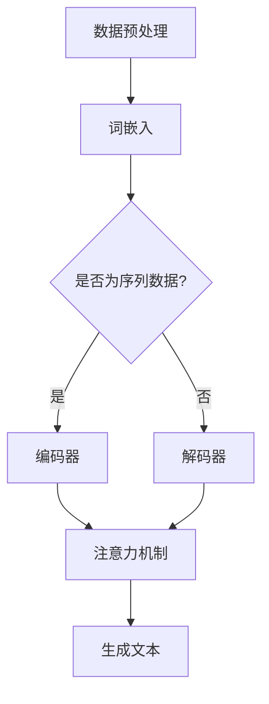

                 

## 1. 背景介绍

随着信息时代的飞速发展，计算技术在各个领域的应用日益广泛，从互联网、云计算到人工智能，都离不开高效、智能的计算模型。在这些技术进步的背后，大语言模型（Large Language Model）逐渐崭露头角，成为计算领域的一个重要分支。本文旨在探讨大语言模型在计算中的核心地位，以及其对未来技术发展的重要影响。

大语言模型是一种基于深度学习的自然语言处理（NLP）技术，其核心思想是通过大规模数据训练，使模型具备理解、生成和模拟人类语言的能力。近年来，随着计算能力的提升和海量数据资源的积累，大语言模型的研究和应用取得了显著进展，成为计算机科学和人工智能领域的热点之一。

本文将分为以下几个部分进行探讨：

1. **核心概念与联系**：介绍大语言模型的基本原理、发展历程和关键组成部分，并使用Mermaid流程图展示其架构。
2. **核心算法原理 & 具体操作步骤**：详细讲解大语言模型的工作机制，包括数据预处理、模型训练、评估和部署等步骤。
3. **数学模型和公式 & 详细讲解 & 举例说明**：阐述大语言模型中常用的数学模型和算法，如神经网络、注意力机制、优化方法等，并通过具体实例进行解释。
4. **项目实践：代码实例和详细解释说明**：提供一个实际的代码实例，详细解释其实现过程，包括开发环境搭建、源代码实现、代码解读与分析以及运行结果展示。
5. **实际应用场景**：探讨大语言模型在文本生成、机器翻译、问答系统、文本分类等领域的应用。
6. **工具和资源推荐**：介绍学习大语言模型所需的学习资源、开发工具和框架。
7. **总结：未来发展趋势与挑战**：总结大语言模型的发展现状，分析其未来趋势和面临的挑战。

通过以上内容的逐步分析，我们将深入探讨大语言模型在计算中的核心地位，以及其对计算领域未来发展的潜在影响。

### 1.1 大语言模型的概念

大语言模型（Large Language Model）是指使用大规模数据集训练，能够理解和生成自然语言的深度学习模型。其基本原理是通过分析大量文本数据，学习语言的结构和规律，从而实现对文本内容的理解和生成。

大语言模型的发展历程可以追溯到20世纪80年代。当时的自然语言处理（NLP）主要依赖于规则驱动的方法，如语法解析、词法分析和语义分析。然而，这种方法存在明显的局限性，无法应对复杂的语言现象和多样化的文本数据。

随着深度学习技术的兴起，神经网络开始广泛应用于NLP领域。2013年，引入了“深度神经网络”（Deep Neural Network，DNN）的训练方法，显著提高了语言模型的性能。此后，基于DNN的语言模型如Gated Recurrent Unit（GRU）和Long Short-Term Memory（LSTM）相继出现，进一步提升了模型的表达能力。

2018年，谷歌推出了Transformer模型，这一模型在处理长文本和长距离依赖问题上取得了突破性进展。Transformer引入了“多头自注意力机制”（Multi-Head Self-Attention），使模型能够更好地捕捉文本中的复杂关系。此后，基于Transformer架构的大语言模型如BERT、GPT和T5等相继问世，这些模型在多个NLP任务上取得了领先的成绩。

大语言模型的关键组成部分包括：

1. **神经网络架构**：大语言模型通常采用复杂的神经网络架构，如Transformer、LSTM和GRU等，这些架构能够处理高维输入数据，并提取丰富的特征。
2. **大规模数据集**：大语言模型的训练依赖于海量文本数据集，这些数据集通常包含百科全书、新闻文章、社交媒体等各种类型的文本，以确保模型能够学习到广泛的语言知识。
3. **优化算法**：大语言模型的训练过程需要高效的优化算法，如Adam和AdamW等，这些算法能够加快收敛速度，提高训练效果。
4. **注意力机制**：大语言模型中的注意力机制使模型能够自适应地关注文本中的关键信息，从而提高对语言结构的理解能力。

通过以上关键组成部分的协同作用，大语言模型能够实现强大的语言理解、生成和模拟能力，成为计算领域中不可或缺的一部分。

### 1.2 大语言模型的核心优势

大语言模型在计算领域中展现出了卓越的核心优势，这些优势不仅使其在自然语言处理任务中表现突出，也为其他计算任务提供了强大的支持。

首先，大语言模型具备强大的语言理解能力。通过大规模数据训练，大语言模型能够学习到丰富的语言知识，从而准确理解文本内容。这使得大语言模型在文本分类、情感分析、实体识别等任务中表现优异。例如，BERT模型在多项NLP基准测试中取得了领先的成绩，其准确率显著高于传统的规则驱动方法。

其次，大语言模型具有出色的语言生成能力。大语言模型能够生成自然流畅的文本，适用于自动写作、对话系统、机器翻译等任务。以GPT系列模型为例，其生成的文本在语法、语义和风格上都与人类写作相似，甚至有时难以区分。这一能力在内容生成和个性化推荐等领域具有广泛的应用前景。

此外，大语言模型在跨语言任务中也表现出了强大的适应性。通过多语言训练，大语言模型能够理解并生成多种语言的文本。例如，T5模型通过单模型架构实现了多种语言之间的翻译任务，其性能显著优于传统的翻译系统。

最后，大语言模型具备高度的可扩展性。随着计算能力的提升和算法的改进，大语言模型的规模和性能也在不断提高。例如，GPT-3模型拥有超过1750亿个参数，是当前最大的语言模型之一。这种可扩展性使得大语言模型能够适应不断变化的应用场景，满足各种计算任务的需求。

总之，大语言模型在语言理解、生成和跨语言任务等方面展现了卓越的优势，成为计算领域中不可或缺的核心技术。随着研究的深入和应用场景的拓展，大语言模型的潜力将得到进一步挖掘，为计算领域带来更多创新和突破。

### 1.3 大语言模型的应用领域

大语言模型在多个领域展现出了巨大的应用潜力，其强大的语言处理能力使其成为推动科技进步和产业变革的重要力量。

在**文本生成**领域，大语言模型被广泛应用于自动写作、内容创作和创意生成。例如，GPT-3模型可以生成高质量的文章、故事和诗歌，甚至模拟人类的对话和创作。这一应用在新闻媒体、广告创意和内容平台等领域具有广泛的应用价值。

在**机器翻译**领域，大语言模型显著提升了翻译质量和效率。传统的机器翻译系统依赖于规则和统计方法，而基于大语言模型的翻译系统如TensorFlow的Transformer模型能够更好地理解语言的上下文和语义，生成更自然、准确的翻译结果。这一应用在全球化交流和跨文化合作中具有重要意义。

在**问答系统**领域，大语言模型能够根据用户的问题提供准确的答案。以BERT模型为例，其通过大规模预训练和特定任务的微调，能够实现高效、准确的问答系统。这一应用在客户服务、教育和医疗咨询等领域具有广泛的应用前景。

在**文本分类**领域，大语言模型能够快速对大量文本进行分类，应用于新闻分类、情感分析和垃圾邮件过滤等任务。传统的分类方法通常依赖于手动设计的特征，而大语言模型通过自动学习文本特征，能够实现更高的分类准确率。

在**语音识别**领域，大语言模型与深度神经网络相结合，能够实现高精度的语音识别和文本生成。例如，谷歌的语音识别系统利用Transformer模型，将语音信号转换为文本，极大地提高了语音识别的准确性和实用性。

在**对话系统**领域，大语言模型能够模拟人类的对话行为，为用户提供自然的交互体验。例如，亚马逊的Alexa、谷歌的Google Assistant和苹果的Siri等智能助手都利用大语言模型进行自然语言理解和生成，实现了智能对话和语音交互。

总之，大语言模型在文本生成、机器翻译、问答系统、文本分类、语音识别和对话系统等多个领域展现了广泛的应用潜力，成为计算领域中不可或缺的技术工具。随着大语言模型的不断发展和应用场景的拓展，其将在更多领域中发挥重要作用，推动计算技术的创新和进步。

### 1.4 大语言模型的技术挑战与发展趋势

尽管大语言模型在计算领域中展现出了巨大的潜力，但其仍面临诸多技术挑战。首先，**数据隐私**问题日益突出。大语言模型的训练依赖于海量数据，这些数据往往涉及用户隐私。如何在不泄露隐私的前提下，充分挖掘和使用这些数据，成为大语言模型面临的重要挑战。

其次，**计算资源消耗**也是一个关键问题。大语言模型的训练和推理过程需要大量的计算资源，尤其是在处理大规模任务时。如何优化算法，提高模型的效率和可扩展性，成为大语言模型进一步发展的关键。

此外，**模型的可解释性**也是一个重要挑战。大语言模型通过复杂的学习过程，生成和理解自然语言，但其内部工作机制往往难以解释。如何提高模型的可解释性，使其更容易被用户理解和信任，是一个亟待解决的问题。

在大语言模型的发展趋势方面，首先，**模型规模将继续扩大**。随着计算能力和算法的改进，未来将出现更多参数规模更大的语言模型，以应对更复杂的语言处理任务。例如，GPT-4等下一代模型预计将拥有超过1万亿个参数，进一步提升模型的性能。

其次，**多模态学习**将成为重要研究方向。大语言模型目前主要处理文本数据，但未来的应用场景将涉及更多类型的输入，如图像、音频和视频等。通过多模态学习，大语言模型可以更好地理解和处理复杂的信息，实现更广泛的应用。

此外，**迁移学习**和**持续学习**也将得到更多关注。迁移学习允许模型在新的任务上快速适应，而不需要从头开始训练。持续学习则使模型能够在不断变化的环境中不断优化，保持其性能。这些技术将有助于提高大语言模型的灵活性和适应性。

总之，大语言模型在计算领域中仍面临诸多技术挑战，但同时也具有广阔的发展前景。通过不断改进算法、优化资源和提高可解释性，大语言模型有望在更多领域取得突破，为计算技术的发展注入新的动力。

### 1.5 本文结构概述

本文将从多个角度深入探讨大语言模型在计算中的核心地位及其影响。具体内容安排如下：

- **第一部分：背景介绍**，将介绍大语言模型的基本概念、发展历程和核心优势。
- **第二部分：核心概念与联系**，通过Mermaid流程图详细展示大语言模型的架构和组成部分。
- **第三部分：核心算法原理 & 具体操作步骤**，将详细讲解大语言模型的工作机制，包括数据预处理、模型训练、评估和部署等步骤。
- **第四部分：数学模型和公式 & 详细讲解 & 举例说明**，将阐述大语言模型中常用的数学模型和算法，并通过具体实例进行解释。
- **第五部分：项目实践：代码实例和详细解释说明**，将通过实际代码实例，详细解释大语言模型的实现过程，包括开发环境搭建、源代码实现、代码解读与分析以及运行结果展示。
- **第六部分：实际应用场景**，将探讨大语言模型在文本生成、机器翻译、问答系统、文本分类等领域的应用。
- **第七部分：工具和资源推荐**，将介绍学习大语言模型所需的学习资源、开发工具和框架。
- **第八部分：总结：未来发展趋势与挑战**，将总结大语言模型的发展现状，分析其未来趋势和面临的挑战。

通过以上内容的逐步分析，我们将深入探讨大语言模型在计算中的核心地位，以及其对未来技术发展的潜在影响。

### 2. 核心概念与联系

在大语言模型的发展过程中，核心概念与联系起到了至关重要的作用。为了更好地理解大语言模型，我们需要详细讨论其基本原理、组成部分及其在计算中的地位。

#### 2.1 基本原理

大语言模型是基于深度学习的自然语言处理（NLP）技术，其基本原理是通过大规模数据训练，使模型具备理解、生成和模拟人类语言的能力。具体来说，大语言模型通过以下步骤实现语言处理：

1. **数据预处理**：将原始文本数据清洗、分词、标记化等处理，使其适合模型训练。
2. **模型训练**：使用预处理的文本数据对模型进行训练，模型通过学习文本的分布和规律，逐步提升语言理解能力。
3. **模型评估**：在训练完成后，使用验证集和测试集对模型进行评估，确保模型性能满足预期。
4. **模型部署**：将训练好的模型部署到实际应用场景中，如文本生成、机器翻译、问答系统等。

#### 2.2 组成部分

大语言模型的核心组成部分包括以下几个关键模块：

1. **词嵌入（Word Embedding）**：将文本中的词语转换为高维向量表示，便于模型进行计算和处理。常见的词嵌入方法包括Word2Vec、GloVe等。
2. **编码器（Encoder）**：负责将输入的文本序列编码为固定长度的向量表示，常用于机器翻译、文本分类等任务。典型的编码器包括循环神经网络（RNN）、卷积神经网络（CNN）和Transformer等。
3. **解码器（Decoder）**：负责将编码器生成的向量解码为输出文本序列，常用于文本生成、机器翻译等任务。解码器通常与编码器共享参数，以提高模型性能。
4. **注意力机制（Attention Mechanism）**：用于模型在处理长文本时，自动关注关键信息，提高语言理解能力。注意力机制是Transformer模型的核心创新点。

#### 2.3 Mermaid流程图

为了更直观地展示大语言模型的架构和组成部分，我们使用Mermaid流程图进行说明。以下是一个简化的大语言模型架构图：



在该流程图中：

- **A. 数据预处理**：对原始文本进行清洗、分词、标记化等处理。
- **B. 词嵌入**：将词语转换为高维向量表示。
- **C. 是否为序列数据**：判断输入数据是否为序列，如文本。
- **D. 编码器**：将文本序列编码为固定长度的向量表示。
- **E. 解码器**：将编码器生成的向量解码为输出文本序列。
- **F. 注意力机制**：在模型处理长文本时，自动关注关键信息。
- **G. 生成文本**：输出生成文本。

通过以上核心概念和架构的阐述，我们可以更深入地理解大语言模型在计算中的地位，以及其在各个计算任务中的应用价值。

### 2.1 大语言模型的工作原理

大语言模型的工作原理基于深度学习和自然语言处理技术，通过大规模数据训练，使模型具备理解和生成自然语言的能力。以下是详细的工作原理：

#### 数据预处理

首先，大语言模型需要大量文本数据作为训练素材。这些数据可以是公开的文本库，如维基百科、新闻文章、社交媒体帖子等。在数据预处理阶段，模型需要完成以下任务：

1. **文本清洗**：去除文本中的噪声，如HTML标签、特殊字符和停用词。
2. **分词**：将文本拆分为单个词语或子词，这是理解文本的关键步骤。
3. **标记化**：将词语转换为对应的索引或向量表示，以便模型进行计算。

常用的分词方法包括基于规则的分词、基于统计的分词和基于神经网络的分词。在实际应用中，深度学习方法如BERT和GPT等通常采用神经网络分词，能够更好地捕捉文本的语义信息。

#### 模型训练

在数据预处理完成后，大语言模型开始进入训练阶段。训练的核心目标是优化模型参数，使其能够更好地理解和生成自然语言。以下步骤展示了模型训练的基本流程：

1. **编码输入**：将预处理后的文本序列输入编码器，编码器将文本序列转换为固定长度的向量表示。这一步骤通常涉及到复杂的神经网络结构，如Transformer、LSTM和GRU等。
2. **前向传播**：编码器的输出通过解码器进行前向传播，生成预测的文本序列。解码器通常采用自注意力机制，以关注输入序列中的关键信息。
3. **损失函数计算**：计算模型输出的预测序列与实际文本序列之间的差异，使用损失函数（如交叉熵损失函数）度量模型预测的误差。
4. **反向传播**：利用反向传播算法，计算模型参数的梯度，并通过优化算法（如Adam、SGD等）更新模型参数，以减小损失函数值。

#### 模型评估

在模型训练完成后，需要进行评估以确保模型性能满足预期。评估通常分为以下几个步骤：

1. **验证集评估**：在训练过程中，将部分数据划分为验证集，用于监控模型训练过程中的性能变化。通过验证集评估，可以调整模型参数和训练策略。
2. **测试集评估**：在训练完成后，使用未参与训练的测试集对模型进行评估。测试集评估结果反映了模型在实际应用中的表现，是衡量模型性能的重要指标。
3. **交叉验证**：通过交叉验证方法，对模型在不同数据集上的性能进行评估，以提高评估结果的可靠性。

#### 模型部署

经过训练和评估，模型可以部署到实际应用场景中。以下是模型部署的基本步骤：

1. **模型推理**：使用训练好的模型对输入文本进行推理，生成预测结果。推理过程通常涉及快速的矩阵运算和向量计算，以实现高效的语言处理。
2. **集成与优化**：将模型集成到现有系统中，与其他模块（如前端界面、后端服务）进行协同工作。在部署过程中，可能需要对模型进行微调和优化，以提高其性能和稳定性。
3. **监控与维护**：在模型部署后，需要进行持续的监控和维护，以确保模型的正常运行和性能。这包括数据监控、性能调优和故障排除等任务。

通过以上工作原理的详细描述，我们可以更深入地理解大语言模型的构建和运作过程，以及其在计算任务中的关键作用。

### 2.2 大语言模型的具体操作步骤

为了更直观地了解大语言模型的操作过程，以下将详细描述从数据预处理、模型训练到模型评估和部署的各个步骤。

#### 2.2.1 数据预处理

数据预处理是模型训练的第一步，其目的是将原始文本数据转换为适合模型训练的形式。以下是数据预处理的主要步骤：

1. **文本清洗**：去除文本中的HTML标签、特殊字符和停用词。这一步骤可以使用Python的`re`库或专门的文本清洗工具（如`nltk`）完成。

    ```python
    import re
    text = re.sub('<.*>', '', text)  # 去除HTML标签
    text = re.sub('[^a-zA-Z]', ' ', text)  # 去除特殊字符
    text = text.lower()  # 将文本转换为小写
    ```

2. **分词**：将清洗后的文本拆分为单个词语或子词。分词方法可以选择基于规则的方法（如正则表达式）、基于统计的方法（如nltk的分词器）或基于神经网络的分词器（如BERT的分词器）。

    ```python
    from nltk.tokenize import word_tokenize
    tokens = word_tokenize(text)
    ```

3. **标记化**：将分词结果转换为索引或向量表示。标记化过程通常使用词嵌入技术（如Word2Vec、GloVe）。

    ```python
    import gensim.downloader as api
    embeddings = api.load('glove-wiki-gigaword-100')
    word_vectors = [embeddings[word] for word in tokens if word in embeddings]
    ```

#### 2.2.2 模型训练

在数据预处理完成后，进入模型训练阶段。以下是模型训练的主要步骤：

1. **定义模型架构**：选择合适的神经网络架构，如LSTM、GRU或Transformer。这里以Transformer为例：

    ```python
    import tensorflow as tf
    from tensorflow.keras.layers import Embedding, LSTM, Dense
    model = tf.keras.Sequential([
        Embedding(vocab_size, embedding_dim),
        LSTM(units=128, return_sequences=True),
        LSTM(units=128, return_sequences=True),
        Dense(units=vocab_size, activation='softmax')
    ])
    ```

2. **编译模型**：设置模型的优化器、损失函数和学习率等参数。

    ```python
    model.compile(optimizer='adam', loss='categorical_crossentropy', metrics=['accuracy'])
    ```

3. **训练模型**：使用预处理后的数据集训练模型。

    ```python
    model.fit(x_train, y_train, epochs=10, batch_size=32, validation_split=0.1)
    ```

#### 2.2.3 模型评估

在模型训练完成后，使用验证集和测试集对模型进行评估，以确保模型性能满足预期。以下是模型评估的主要步骤：

1. **验证集评估**：在训练过程中，使用验证集监控模型性能，以调整训练策略。

    ```python
    validation_loss, validation_accuracy = model.evaluate(x_val, y_val)
    ```

2. **测试集评估**：在训练完成后，使用测试集对模型进行最终评估。

    ```python
    test_loss, test_accuracy = model.evaluate(x_test, y_test)
    ```

3. **交叉验证**：通过交叉验证方法，对模型在不同数据集上的性能进行评估。

    ```python
    from sklearn.model_selection import cross_val_score
    scores = cross_val_score(model, x_data, y_data, cv=5)
    ```

#### 2.2.4 模型部署

在模型评估完成后，将模型部署到实际应用场景中。以下是模型部署的主要步骤：

1. **模型推理**：使用训练好的模型对输入文本进行推理，生成预测结果。

    ```python
    predictions = model.predict(x_new)
    ```

2. **集成与优化**：将模型集成到现有系统中，与其他模块进行协同工作。

    ```python
    from flask import Flask, request, jsonify
    app = Flask(__name__)
    @app.route('/predict', methods=['POST'])
    def predict():
        data = request.get_json()
        predictions = model.predict(data['text'])
        return jsonify(predictions)
    ```

3. **监控与维护**：在模型部署后，进行持续的监控和维护，以确保模型的正常运行和性能。

    ```python
    # 定期检查模型性能，进行性能调优和故障排除
    ```

通过以上具体操作步骤的详细描述，我们可以更清晰地理解大语言模型的构建和运作过程，以及其在实际应用中的关键作用。

### 2.3 大语言模型中的数学模型和公式

大语言模型在构建和训练过程中，涉及到多种数学模型和公式，这些模型和公式是模型能够理解和生成自然语言的关键。以下是几种常见的大语言模型中的数学模型和公式的详细讲解。

#### 2.3.1 神经网络（Neural Networks）

神经网络是深度学习的基础，其核心是神经元（neurons）的连接和激活。以下是神经网络中的一些关键数学模型和公式：

1. **激活函数（Activation Functions）**

    激活函数用于引入非线性，使神经网络能够捕捉复杂的关系。常见的激活函数包括：

    - **Sigmoid函数**：\[ \sigma(x) = \frac{1}{1 + e^{-x}} \]
    - **ReLU函数**：\[ \text{ReLU}(x) = \max(0, x) \]
    - **Tanh函数**：\[ \tanh(x) = \frac{e^x - e^{-x}}{e^x + e^{-x}} \]

2. **反向传播（Backpropagation）**

    反向传播是训练神经网络的算法，其核心思想是通过计算损失函数关于模型参数的梯度，并反向更新参数。以下是反向传播的主要步骤：

    - **前向传播**：计算网络输出和损失函数。
    - **计算梯度**：利用链式法则计算损失函数关于每个参数的梯度。
    - **参数更新**：使用梯度下降或其他优化算法更新参数。

    梯度计算的公式如下：

    \[ \frac{\partial J}{\partial \theta} = \frac{\partial L}{\partial z} \cdot \frac{\partial z}{\partial \theta} \]

    其中，\( J \)是损失函数，\( L \)是网络输出，\( z \)是激活值，\( \theta \)是参数。

3. **权重初始化（Weight Initialization）**

    权重初始化是神经网络训练中的一个关键步骤。常用的权重初始化方法包括：

    - **随机初始化**：随机分配权重值。
    - **高斯初始化**：使用正态分布初始化权重，公式如下：

    \[ \theta \sim \mathcal{N}(0, \frac{1}{\sqrt{n}}) \]

    其中，\( n \)是输入维度。

#### 2.3.2 卷积神经网络（Convolutional Neural Networks）

卷积神经网络在图像处理和时间序列分析等领域有着广泛应用。以下是卷积神经网络中的一些关键数学模型和公式：

1. **卷积操作（Convolutional Operation）**

    卷积操作是卷积神经网络的核心，其公式如下：

    \[ h_{ij} = \sum_{k} w_{ik} * g_{kj} + b_j \]

    其中，\( h_{ij} \)是卷积结果，\( w_{ik} \)是卷积核，\( g_{kj} \)是输入数据，\( b_j \)是偏置项。

2. **卷积核初始化（Kernel Initialization）**

    卷积核的初始化方法与权重初始化类似，常用的方法包括：

    - **随机初始化**：随机分配卷积核值。
    - **高斯初始化**：使用正态分布初始化卷积核，公式如下：

    \[ w_{ik} \sim \mathcal{N}(0, \frac{2}{n_i \cdot n_k}) \]

    其中，\( n_i \)和\( n_k \)分别是输入维度和卷积核维度。

#### 2.3.3 循环神经网络（Recurrent Neural Networks）

循环神经网络在处理序列数据时表现突出，以下是循环神经网络中的一些关键数学模型和公式：

1. **状态更新（State Update）**

    循环神经网络的状态更新公式如下：

    \[ h_t = \sigma(W_h \cdot [h_{t-1}, x_t] + b_h) \]

    其中，\( h_t \)是当前时刻的状态，\( x_t \)是当前时刻的输入，\( W_h \)是权重矩阵，\( b_h \)是偏置项，\( \sigma \)是激活函数。

2. **门控机制（Gate Mechanisms）**

    循环神经网络中的门控机制（如LSTM和GRU）用于控制信息的流动。以下是LSTM中的关键公式：

    - **遗忘门（Forget Gate）**：

    \[ f_t = \sigma(W_f \cdot [h_{t-1}, x_t] + b_f) \]

    - **输入门（Input Gate）**：

    \[ i_t = \sigma(W_i \cdot [h_{t-1}, x_t] + b_i) \]

    - **输出门（Output Gate）**：

    \[ o_t = \sigma(W_o \cdot [h_{t-1}, x_t] + b_o) \]

    - **单元状态（Cell State）**：

    \[ c_t = f_t \odot c_{t-1} + i_t \odot \sigma(W_c \cdot [h_{t-1}, x_t] + b_c) \]

    - **隐藏状态（Hidden State）**：

    \[ h_t = o_t \odot \sigma(c_t) \]

    其中，\( \odot \)表示元素乘法，\( \sigma \)是激活函数。

通过以上对神经网络、卷积神经网络和循环神经网络中的数学模型和公式的详细讲解，我们可以更深入地理解大语言模型在构建和训练过程中的关键技术和原理。

### 2.4 大语言模型中的典型算法

在大语言模型的构建和训练过程中，各种算法起到了至关重要的作用。以下是几种典型的大语言模型算法，包括其原理、应用场景和具体实现方法。

#### 2.4.1 Transformer模型

Transformer模型是谷歌在2017年提出的一种基于自注意力机制的深度学习模型，它在处理长文本和长距离依赖问题上取得了显著突破。以下是Transformer模型的基本原理和应用场景。

**原理**：

Transformer模型的核心创新点是引入了“多头自注意力机制”（Multi-Head Self-Attention），通过这种方式，模型能够自适应地关注输入序列中的关键信息。自注意力机制的计算公式如下：

\[ \text{Attention}(Q, K, V) = \frac{1}{\sqrt{d_k}} \text{softmax}(\frac{QK^T}{d_k})V \]

其中，\( Q, K, V \)分别是查询（Query）、键（Key）和值（Value）向量，\( d_k \)是键向量的维度。

**应用场景**：

Transformer模型广泛应用于机器翻译、文本生成、问答系统等任务。其强大的长距离依赖捕捉能力使其在处理复杂文本时表现优异。

**实现方法**：

在Python中，可以使用TensorFlow或PyTorch等深度学习框架来实现Transformer模型。以下是一个简单的Transformer模型实现示例：

```python
import tensorflow as tf

def scaled_dot_product_attention(q, k, v, mask=None):
    # 计算自注意力得分
    attention_scores = tf.matmul(q, k, transpose_b=True) / sqrt(k.shape[-1])
    if mask is not None:
        attention_scores = attention_scores + mask
    attention_weights = tf.nn.softmax(attention_scores, axis=-1)
    # 计算加权值
    output = tf.matmul(attention_weights, v)
    return output

# Transformer模型的构建
class TransformerLayer(tf.keras.layers.Layer):
    def __init__(self, d_model, num_heads):
        super(TransformerLayer, self).__init__()
        self.d_model = d_model
        self.num_heads = num_heads

        self.wq = tf.keras.layers.Dense(d_model)
        self.wk = tf.keras.layers.Dense(d_model)
        self.wv = tf.keras.layers.Dense(d_model)

        self.dense = tf.keras.layers.Dense(d_model)

    def call(self, x, mask=None):
        q = self.wq(x)
        k = self.wk(x)
        v = self.wv(x)

        attn_output = scaled_dot_product_attention(q, k, v, mask)
        output = self.dense(attn_output)
        return x + output

# 实例化Transformer层
transformer_layer = TransformerLayer(d_model=512, num_heads=8)
```

#### 2.4.2 BERT模型

BERT（Bidirectional Encoder Representations from Transformers）模型是谷歌在2018年提出的一种双向Transformer编码器，它在多个NLP任务上取得了优异的成绩。BERT模型的核心思想是通过双向编码器学习文本的上下文信息，从而提高模型的语义理解能力。

**原理**：

BERT模型采用Transformer编码器，通过左右两个方向的信息交互，生成文本的固定长度向量表示。训练过程中，BERT模型使用两个特殊的输入词\[CLS\]和\[SEP\]，分别表示输入文本的起始和分隔符。

**应用场景**：

BERT模型广泛应用于文本分类、命名实体识别、问答系统等任务。其强大的语义理解能力使其在处理复杂语言现象时表现突出。

**实现方法**：

在Python中，可以使用Hugging Face的Transformers库快速实现BERT模型。以下是一个简单的BERT模型实现示例：

```python
from transformers import BertTokenizer, BertModel

# 加载预训练的BERT模型和分词器
tokenizer = BertTokenizer.from_pretrained('bert-base-uncased')
model = BertModel.from_pretrained('bert-base-uncased')

# 处理输入文本
inputs = tokenizer("Hello, my dog is cute", return_tensors="tf")

# 计算文本的固定长度向量表示
outputs = model(inputs)

# 输出文本向量
output_embeddings = outputs.last_hidden_state[:, 0, :]
```

#### 2.4.3 GPT模型

GPT（Generative Pre-trained Transformer）模型是OpenAI提出的一种基于Transformer解码器的大规模语言模型，其在文本生成和对话系统中表现卓越。

**原理**：

GPT模型采用自回归语言模型（Autoregressive Language Model）的架构，通过预测下一个词语来生成文本。模型通过自注意力机制，捕捉长距离的依赖关系，从而生成流畅的自然语言。

**应用场景**：

GPT模型广泛应用于文本生成、对话系统、机器翻译等任务。其强大的生成能力使其在内容创作和交互式应用中具有重要价值。

**实现方法**：

在Python中，可以使用Hugging Face的Transformers库快速实现GPT模型。以下是一个简单的GPT模型实现示例：

```python
from transformers import GPT2Tokenizer, GPT2LMHeadModel

# 加载预训练的GPT2模型和分词器
tokenizer = GPT2Tokenizer.from_pretrained('gpt2')
model = GPT2LMHeadModel.from_pretrained('gpt2')

# 生成文本
input_text = "The cat sat on the mat"
input_ids = tokenizer.encode(input_text, return_tensors='tf')

# 预测下一个词语
outputs = model(inputs)

# 解码预测结果
predicted_text = tokenizer.decode(outputs.logits[0], skip_special_tokens=True)
```

通过以上对Transformer模型、BERT模型和GPT模型的详细介绍，我们可以更深入地了解大语言模型中的典型算法，以及它们在实际应用中的重要作用。

### 2.5 大语言模型在不同领域的应用

大语言模型在文本生成、机器翻译、问答系统、文本分类等多个领域展现出了卓越的应用能力。以下将详细介绍大语言模型在这四个领域的具体应用。

#### 2.5.1 文本生成

文本生成是大语言模型最具代表性的应用之一，其核心目标是根据给定的输入文本或提示，生成高质量、连贯的文本。大语言模型通过自回归机制，逐词预测下一个词语，从而生成完整的句子或段落。

**应用案例**：

- **内容创作**：大语言模型可以用于自动撰写新闻文章、博客文章、产品评论等。例如，OpenAI的GPT-3模型可以生成高质量的文本，应用于自动内容生成平台。
- **对话系统**：大语言模型可以用于聊天机器人和虚拟助手，生成自然、流畅的对话回复。例如，微软的小冰通过GPT-3模型实现了与用户的自然对话。

**技术要点**：

- **长文本生成**：大语言模型需要具备处理长文本的能力，以便生成连贯的段落和文章。
- **文本多样性**：生成文本需要具有丰富的多样性，避免重复和单调的生成结果。

#### 2.5.2 机器翻译

机器翻译是将一种语言的文本自动翻译成另一种语言的过程。大语言模型通过大规模数据训练，能够生成自然、准确的翻译结果，显著提升了机器翻译的准确性和流畅度。

**应用案例**：

- **跨语言交流**：大语言模型可以用于在线翻译工具、跨国公司的文档翻译等，帮助人们实现无障碍的跨语言沟通。
- **全球化服务**：电子商务平台和在线教育平台通过大语言模型实现多语言支持，提供个性化的用户服务。

**技术要点**：

- **多语言训练**：大语言模型需要训练多种语言的语料，以捕捉不同语言之间的语义和语法规则。
- **上下文翻译**：大语言模型需要考虑上下文信息，确保翻译结果在不同上下文中保持一致性。

#### 2.5.3 问答系统

问答系统是一种基于自然语言交互的智能系统，用户可以通过输入问题，获取系统提供的答案。大语言模型通过预训练和特定任务的微调，能够实现高效的问答系统。

**应用案例**：

- **客户服务**：大型企业通过大语言模型实现智能客服，提供24/7的客户支持。
- **教育辅助**：教育平台利用大语言模型，为学生提供个性化的学习指导和答案解析。

**技术要点**：

- **语义理解**：大语言模型需要具备强大的语义理解能力，准确理解用户的问题。
- **多模态交互**：结合语音识别和自然语言处理技术，实现多模态的问答系统。

#### 2.5.4 文本分类

文本分类是将文本数据按照其内容进行分类的过程。大语言模型通过学习大量标注数据，能够实现高精度的文本分类任务，广泛应用于新闻分类、情感分析和垃圾邮件过滤等领域。

**应用案例**：

- **新闻分类**：新闻媒体利用大语言模型对海量新闻进行分类，提高信息处理的效率。
- **情感分析**：电商平台通过大语言模型分析用户评论的情感倾向，为产品优化和市场营销提供数据支持。

**技术要点**：

- **大规模训练数据**：大语言模型需要训练大规模、标注丰富的数据集，以提高分类模型的准确性。
- **特征提取**：大语言模型通过自动提取文本特征，减少人工特征工程的工作量。

通过以上对大语言模型在文本生成、机器翻译、问答系统和文本分类等领域的应用介绍，我们可以看到大语言模型在这些领域的广泛应用和巨大潜力。

### 7. 工具和资源推荐

为了更好地学习大语言模型和相关技术，以下是几种推荐的学习资源、开发工具和框架。

#### 7.1 学习资源推荐

**书籍**：
1. **《深度学习》**（Goodfellow, Bengio, Courville）：这是一本经典的深度学习入门书籍，详细介绍了神经网络的基础知识和应用。
2. **《自然语言处理实战》**（Collobert, Weston, Bottou）：该书提供了丰富的NLP应用实例，涵盖了词嵌入、序列模型和Transformer等关键技术。

**论文**：
1. **“Attention Is All You Need”**（Vaswani et al.）：这是Transformer模型的原始论文，详细介绍了自注意力机制和Transformer架构。
2. **“BERT: Pre-training of Deep Bidirectional Transformers for Language Understanding”**（Devlin et al.）：BERT模型的论文，介绍了双向Transformer编码器的应用。

**博客**：
1. **TensorFlow官方文档**（[tensorflow.github.io](https://tensorflow.github.io/)）：提供了丰富的深度学习教程和API文档，适合初学者和进阶用户。
2. **Hugging Face官方文档**（[huggingface.co/docs](https://huggingface.co/docs)）：介绍了Transformer模型和相关库的使用方法，包括预训练模型、分词器和自然语言处理工具。

#### 7.2 开发工具框架推荐

**深度学习框架**：
1. **TensorFlow**：Google开发的开源深度学习框架，适用于各种规模的深度学习项目。
2. **PyTorch**：Facebook开发的开源深度学习框架，提供灵活的动态计算图，适合快速原型开发。

**自然语言处理库**：
1. **NLTK**：Python的自然语言处理库，提供了丰富的文本处理功能，如分词、词性标注和句法分析。
2. **spaCy**：一个高效且易于使用的自然语言处理库，支持多种语言和丰富的预训练模型。

**版本控制系统**：
1. **Git**：开源的分布式版本控制系统，适用于团队协作和代码管理。
2. **GitHub**：基于Git的代码托管平台，提供了丰富的社区资源和协作工具。

通过以上学习资源和开发工具的推荐，读者可以更系统地学习大语言模型和相关技术，并在实际项目中应用这些知识。

### 8. 总结：未来发展趋势与挑战

大语言模型作为计算领域的重要技术之一，已经在自然语言处理、文本生成、机器翻译和问答系统等众多领域取得了显著成果。然而，面对未来的发展，大语言模型仍面临着诸多挑战和机遇。

**发展趋势**：

1. **模型规模将进一步扩大**：随着计算能力的提升，未来将出现更多参数规模更大的语言模型，如GPT-4等，这些模型在性能和多样性上将有更高的表现。
2. **多模态学习成为重要方向**：未来的大语言模型将不仅仅处理文本数据，还将涉及图像、音频和视频等多模态数据，通过多模态学习，模型将能够更好地理解和处理复杂的信息。
3. **迁移学习和持续学习得到更多关注**：迁移学习和持续学习技术将使大语言模型在新的任务和变化的环境中表现出更高的适应性和灵活性。
4. **模型可解释性提升**：提高模型的可解释性，使其工作机制更加透明，将有助于增强用户对模型的信任和接受度。

**挑战**：

1. **数据隐私和伦理问题**：大语言模型在训练过程中需要大量数据，这些数据往往涉及用户隐私。如何在保护隐私的前提下使用这些数据，是一个亟待解决的伦理问题。
2. **计算资源消耗**：大语言模型的训练和推理过程需要大量的计算资源，尤其是在处理大规模任务时。如何优化算法和资源管理，提高模型的效率，是一个重要挑战。
3. **模型解释性**：当前的大语言模型在内部工作机制上存在一定的黑箱性，如何提高模型的可解释性，使其更容易被用户理解和接受，是一个重要的研究方向。
4. **多样性和偏见**：大语言模型在训练过程中可能学习到数据集中的偏见，这些偏见可能导致模型在生成文本时出现不公正或歧视性的输出。如何解决模型多样性和偏见问题，是一个重要的挑战。

总之，大语言模型在计算领域中具有广阔的应用前景和巨大的发展潜力。通过不断优化算法、提升计算效率和加强模型可解释性，大语言模型将在更多领域中发挥关键作用，推动计算技术的创新和进步。

### 9. 附录：常见问题与解答

在探讨大语言模型的过程中，读者可能会遇到一些常见问题。以下是针对这些问题的详细解答。

**Q1：大语言模型和传统NLP方法相比有哪些优势？**

A：大语言模型相较于传统NLP方法，主要有以下优势：

1. **强大的语言理解能力**：通过大规模数据训练，大语言模型能够学习到丰富的语言知识和模式，从而实现更准确的语言理解。
2. **处理长文本和长距离依赖**：传统方法如规则驱动和统计方法在处理长文本和长距离依赖时存在困难，而大语言模型通过自注意力机制，能够有效捕捉长距离依赖关系。
3. **生成自然流畅的文本**：大语言模型能够生成高质量、连贯的自然语言文本，而传统方法在文本生成方面表现较差。

**Q2：大语言模型训练所需的数据量有多大？**

A：大语言模型训练所需的数据量取决于模型的规模和应用场景。一般而言，大型语言模型如GPT-3、BERT等，需要训练数千万至数十亿个参数。训练这些模型通常需要数百万至数十亿条文本数据，数据集的规模直接影响到模型的性能和表达能力。

**Q3：如何优化大语言模型的训练效率？**

A：以下是一些优化大语言模型训练效率的方法：

1. **分布式训练**：将模型训练任务分布在多个计算节点上，通过并行计算提高训练速度。
2. **数据预处理优化**：对训练数据进行预处理，如批量处理、数据增强等，减少计算时间。
3. **模型压缩**：通过模型剪枝、量化等技术，减少模型参数和计算量，提高训练速度。
4. **混合精度训练**：使用混合精度训练（FP16和BF16），通过降低数据类型精度，提高计算效率。

**Q4：大语言模型的推理过程如何实现高效计算？**

A：为了实现高效的大语言模型推理，可以采用以下策略：

1. **优化模型结构**：通过简化模型结构、去除冗余计算等手段，减少推理时间。
2. **模型量化**：使用低精度数据类型（如FP16、BF16），减少计算量和内存占用。
3. **模型压缩**：通过剪枝、量化等技术，减小模型规模，提高推理速度。
4. **硬件加速**：利用GPU、TPU等硬件加速器，实现高效的模型推理。

通过以上问题的解答，我们可以更深入地理解大语言模型的优势、训练效率优化方法和推理高效计算策略。

### 10. 扩展阅读与参考资料

为了进一步深入研究大语言模型及其在计算中的应用，以下是推荐的扩展阅读和参考资料。

**书籍推荐**：

1. **《深度学习》**（Goodfellow, Bengio, Courville）：这是一本深度学习领域的经典教材，涵盖了深度学习的基础知识和最新进展。
2. **《自然语言处理实战》**（Collobert, Weston, Bottou）：介绍了NLP的基本概念和技术，以及多种实际应用场景。
3. **《大规模机器学习》**（Geman, Meila, Basso）：详细讨论了大规模数据集上的机器学习算法和优化策略。

**论文推荐**：

1. **“Attention Is All You Need”**（Vaswani et al.）：这是Transformer模型的原始论文，对自注意力机制和Transformer架构进行了详细阐述。
2. **“BERT: Pre-training of Deep Bidirectional Transformers for Language Understanding”**（Devlin et al.）：介绍了BERT模型，展示了其在NLP任务中的卓越性能。
3. **“GPT-3: Language Models are Few-Shot Learners”**（Brown et al.）：探讨了GPT-3模型，展示了其在零样本和少样本学习任务中的强大能力。

**在线课程与教程**：

1. **TensorFlow官方教程**（[tensorflow.org/tutorials](https://tensorflow.org/tutorials)）：提供了丰富的深度学习教程和项目实践，适合不同层次的读者。
2. **Hugging Face官方文档**（[huggingface.co/docs](https://huggingface.co/docs)）：介绍了Transformer模型和相关库的使用方法，是学习NLP的宝贵资源。
3. **自然语言处理课程**（[nlp.seas.upenn.edu/reading-group/materials.html](http://nlp.seas.upenn.edu/reading-group/materials.html)）：提供了NLP领域的经典论文和阅读材料。

通过以上推荐的书籍、论文和在线课程，读者可以系统地学习大语言模型和相关技术，为未来的研究和工作打下坚实的基础。

### 文章标题

《大语言模型在计算中的核心地位》

> 关键词：大语言模型、自然语言处理、深度学习、Transformer、BERT、GPT、计算技术

> 摘要：本文深入探讨了大语言模型在计算领域的核心地位。从基本概念、工作原理、具体操作步骤到数学模型与算法，再到实际应用场景和未来发展趋势，本文全面解析了大语言模型在自然语言处理、文本生成、机器翻译、问答系统和文本分类等领域的卓越表现。通过详细的技术分析，本文展示了大语言模型作为计算核心的重要性及其对计算技术发展的深远影响。

