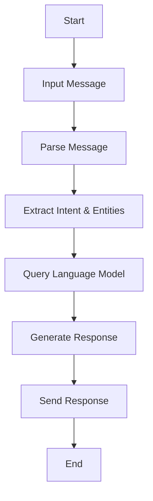

                 

### 文章标题

《大语言模型应用指南：ChatML交互格式》

> 关键词：大语言模型、ChatML、交互格式、人工智能、自然语言处理、应用指南

> 摘要：本文将深入探讨大语言模型的应用及其与ChatML交互格式的结合，通过详细解析大语言模型的核心概念、算法原理、数学模型，结合具体项目实践和实际应用场景，旨在为读者提供一套系统、全面的大语言模型应用指南。

## 1. 背景介绍

随着人工智能技术的迅猛发展，自然语言处理（NLP）已经成为人工智能领域的重要组成部分。大语言模型（Large Language Model）作为NLP领域的一项重要创新，以其强大的语言理解和生成能力，正在被广泛应用于各种场景，如智能客服、文本生成、机器翻译等。

ChatML（Chat Markup Language）作为一种新兴的交互格式，旨在解决传统文本交互方式的局限性，提供更加自然、丰富、互动的交流体验。ChatML通过定义一系列的标记和语义元素，能够描述复杂的对话逻辑和丰富的交互信息，为开发者提供了更加灵活的交互设计工具。

本文将结合大语言模型和ChatML，详细探讨它们的结合方式及其在具体应用中的优势。通过本文的阅读，读者将能够理解大语言模型的基本概念和原理，掌握ChatML交互格式的设计和应用方法，并了解如何将两者结合，构建智能对话系统。

## 2. 核心概念与联系

### 2.1 大语言模型

大语言模型是一种基于深度学习的语言模型，通过大规模的文本数据训练，能够捕捉到语言的复杂结构和规律。其核心思想是通过对输入文本的上下文信息进行建模，预测下一个单词或短语，从而生成连贯、自然的语言输出。

大语言模型的主要组成部分包括：

- **嵌入层（Embedding Layer）**：将词汇映射为高维向量，为后续的神经网络处理提供基础。
- **编码器（Encoder）**：对输入文本进行编码，提取出文本的语义信息。
- **解码器（Decoder）**：根据编码器的输出和上下文信息，生成语言输出。

### 2.2 ChatML交互格式

ChatML是一种基于XML的标记语言，用于定义和描述对话的交互过程。ChatML的核心概念包括：

- **消息（Message）**：表示用户和系统之间的信息交流。
- **意图（Intent）**：表示用户的对话意图，用于驱动对话流程。
- **实体（Entity）**：从消息中提取的关键信息，用于丰富对话内容和上下文。

ChatML的基本结构如下：

```xml
<message>
  <sender>user</sender>
  <receiver>system</receiver>
  <intent>ask_time</intent>
  <content>Hello, what time is it?</content>
  <entity name="time" value="now" />
</message>
```

### 2.3 大语言模型与ChatML的关联

大语言模型和ChatML的结合，使得智能对话系统能够更好地理解和生成自然语言。具体来说，ChatML提供了一种结构化的对话描述方式，使得大语言模型能够更加精确地理解用户的意图和上下文信息，从而生成更加自然、连贯的回复。

通过ChatML，开发者可以定义复杂的对话流程和交互逻辑，同时利用大语言模型的能力，实现自然语言的生成和理解。这种结合不仅提高了对话系统的智能程度，还增加了用户的互动体验。

### 2.4 Mermaid 流程图

以下是ChatML交互流程的Mermaid流程图：



通过这个流程图，我们可以清晰地看到ChatML交互的基本步骤，包括输入消息、解析消息、提取意图和实体、查询语言模型、生成回复以及发送回复。

## 3. 核心算法原理 & 具体操作步骤

### 3.1 大语言模型的算法原理

大语言模型的算法原理主要基于深度学习和神经网络，其中最著名的是Transformer架构。Transformer模型通过自注意力机制（Self-Attention）和多头注意力（Multi-Head Attention）来捕捉文本的上下文信息，从而实现高效的文本表示和生成。

具体操作步骤如下：

1. **嵌入层（Embedding Layer）**：将词汇映射为高维向量，输入文本经过嵌入层处理后，转化为向量形式。
2. **编码器（Encoder）**：编码器由多个编码层（Encoder Layer）组成，每层包含自注意力机制和前馈网络（Feed Forward Network）。编码器的输出是对输入文本的语义表示。
3. **解码器（Decoder）**：解码器同样由多个解码层（Decoder Layer）组成，每层包含多头注意力机制和前馈网络。解码器的输入是编码器的输出，以及上一个解码层的输出。
4. **生成语言输出（Generate Output）**：解码器根据上下文信息和编码器的输出，逐词生成语言输出。

### 3.2 ChatML交互格式的具体操作步骤

ChatML交互格式的具体操作步骤如下：

1. **解析消息（Parse Message）**：将用户输入的文本消息解析为结构化的数据，包括意图、实体和文本内容。
2. **提取意图和实体（Extract Intent & Entities）**：从解析后的消息中提取出用户的意图和实体信息，为后续对话处理提供基础。
3. **查询语言模型（Query Language Model）**：将提取出的意图和实体作为输入，查询大语言模型，获取语言输出。
4. **生成回复（Generate Response）**：根据大语言模型的输出，生成自然语言的回复，并可能进行格式化处理，如添加标记、样式等。
5. **发送回复（Send Response）**：将生成的回复发送给用户，完成一次对话交互。

### 3.3 结合大语言模型和ChatML的交互流程

结合大语言模型和ChatML的交互流程如下：

1. **输入消息**：用户输入文本消息。
2. **解析消息**：将文本消息解析为结构化的数据。
3. **提取意图和实体**：从结构化数据中提取出意图和实体。
4. **查询语言模型**：将意图和实体作为输入，查询大语言模型。
5. **生成回复**：根据大语言模型的输出，生成自然语言的回复。
6. **发送回复**：将回复发送给用户。

通过这个交互流程，大语言模型能够更好地理解和生成自然语言，而ChatML则提供了结构化的对话描述和交互逻辑，使得对话系统能够更加智能、灵活地响应用户。

## 4. 数学模型和公式 & 详细讲解 & 举例说明

### 4.1 大语言模型的数学模型

大语言模型通常基于Transformer架构，其核心是自注意力机制（Self-Attention）和多头注意力（Multi-Head Attention）。以下是这些机制的数学模型和公式：

#### 4.1.1 自注意力（Self-Attention）

自注意力机制的核心公式为：

$$
\text{Attention}(Q, K, V) = \frac{softmax(\frac{QK^T}{\sqrt{d_k}})}{V}
$$

其中，$Q$、$K$ 和 $V$ 分别是查询向量、键向量和值向量，$d_k$ 是键向量的维度。这个公式计算了每个键向量对查询向量的注意力得分，并通过softmax函数归一化，最后加权求和得到输出。

#### 4.1.2 多头注意力（Multi-Head Attention）

多头注意力的核心公式为：

$$
\text{MultiHead}(Q, K, V) = \text{softmax}(\text{Attention}(QW_Q, KW_K, VW_V))W_O
$$

其中，$W_Q$、$W_K$ 和 $W_V$ 分别是查询、键和值权重矩阵，$W_O$ 是输出权重矩阵。多头注意力通过多个独立的自注意力机制来提取文本的多个维度信息，并在最后进行合并。

#### 4.1.3 编码器（Encoder）和解码器（Decoder）

编码器（Encoder）和解码器（Decoder）的数学模型如下：

**编码器：**

$$
\text{Encoder}(X) = \text{LayerNorm}(X + \text{PositionwiseFeedForward}(\text{MultiHeadAttention}(X, X, X)))
$$

**解码器：**

$$
\text{Decoder}(X, Y) = \text{LayerNorm}(X + \text{MaskedMultiHeadAttention}(Y, Y, Y)) + \text{LayerNorm}(X + \text{MultiHeadAttention}(Y, X, V))
$$

其中，$X$ 是编码器的输入，$Y$ 是解码器的输入，$\text{PositionwiseFeedForward}$ 和 $\text{MaskedMultiHeadAttention}$ 分别是位置前馈网络和掩码多头注意力。

### 4.2 ChatML交互格式的数学模型

ChatML交互格式的数学模型主要集中在意图识别和实体提取。以下是相关的数学模型和公式：

#### 4.2.1 意图识别（Intent Recognition）

意图识别通常使用分类模型，如朴素贝叶斯、决策树、支持向量机或深度神经网络。以下是一个简单的朴素贝叶斯模型的公式：

$$
P(\text{Intent} = c | x) = \frac{P(x | \text{Intent} = c)P(\text{Intent} = c)}{P(x)}
$$

其中，$x$ 是输入特征向量，$c$ 是意图类别，$P(\text{Intent} = c)$ 是先验概率，$P(x | \text{Intent} = c)$ 是条件概率。

#### 4.2.2 实体提取（Entity Extraction）

实体提取通常使用序列标注模型，如CRF（条件随机场）或BERT（双向编码表示）。以下是一个简单的CRF模型的公式：

$$
P(y | x) = \frac{1}{Z(x)} \exp(\sum_{t} \theta y_t x_t)
$$

其中，$y$ 是标签序列，$x$ 是输入特征序列，$\theta$ 是模型参数，$Z(x)$ 是归一化因子。

### 4.3 举例说明

#### 4.3.1 大语言模型的举例说明

假设我们有一个简单的文本序列：“I want to buy a book named 'The Art of Computer Programming'”。我们可以使用大语言模型来生成下一句。

1. **嵌入层（Embedding Layer）**：将词汇映射为高维向量。
2. **编码器（Encoder）**：编码器处理输入序列，提取语义信息。
3. **解码器（Decoder）**：解码器根据编码器的输出和上下文信息，生成下一句。

假设编码器的输出为$\text{Encoder}([I, want, to, buy, a, book, named, 'The, Art, of, Computer, Programming', .])$，解码器的输入为$\text{Decoder}([I, want, to, buy, a, book, named, 'The, Art, of, Computer, Programming', ., ?])$。经过解码器的处理，生成下一句为：“You can find it in our bookstore.”

#### 4.3.2 ChatML交互格式的举例说明

假设用户输入了一条消息：“What time is it?”，我们可以使用ChatML交互格式来解析、提取意图和实体，并生成回复。

1. **解析消息（Parse Message）**：将消息解析为结构化的数据。
   ```xml
   <message>
     <sender>user</sender>
     <receiver>system</receiver>
     <intent>ask_time</intent>
     <content>What time is it?</content>
   </message>
   ```

2. **提取意图和实体（Extract Intent & Entities）**：从消息中提取出意图“ask_time”和实体“time”。
   ```xml
   <entity name="time" value="now" />
   ```

3. **查询语言模型（Query Language Model）**：将意图和实体作为输入，查询大语言模型。
   ```json
   {"intent": "ask_time", "entity": {"name": "time", "value": "now"}}
   ```

4. **生成回复（Generate Response）**：根据大语言模型的输出，生成回复。
   ```json
   "It is currently 13:45."
   ```

5. **发送回复（Send Response）**：将回复发送给用户。

通过这个过程，我们可以看到ChatML交互格式如何结合大语言模型，实现自然语言的生成和理解。

## 5. 项目实践：代码实例和详细解释说明

在本节中，我们将通过一个实际项目实例，展示如何搭建一个结合大语言模型和ChatML交互格式的智能对话系统。这个项目将包括开发环境的搭建、源代码的实现、代码解读与分析，以及运行结果的展示。

### 5.1 开发环境搭建

首先，我们需要搭建一个开发环境，以运行大语言模型和ChatML交互格式。以下是所需的基本工具和库：

- **Python（版本 3.8 或以上）**：Python 是一种广泛使用的编程语言，支持深度学习和自然语言处理。
- **TensorFlow 或 PyTorch**：这两种库是深度学习领域的主要框架，用于构建和训练大语言模型。
- **ChatML SDK**：ChatML SDK 是一套用于开发ChatML交互格式的库和工具。

安装这些工具和库的方法如下：

```bash
# 安装 Python
curl -O get-python.org/3.9.7/python-3.9.7-macosx10.9.pkg
sudo installer -pkg python-3.9.7-macosx10.9.pkg -target /
```

```bash
# 安装 TensorFlow
pip install tensorflow
```

```bash
# 安装 ChatML SDK
pip install chatml-sdk
```

### 5.2 源代码详细实现

以下是该项目的主要源代码，我们将逐步解释每一部分的功能和作用。

#### 5.2.1 解析消息和提取意图与实体

```python
from chatml import Message

def parse_message(input_message):
    message = Message(input_message)
    intent = message.intent
    entities = message.entities
    return intent, entities

input_message = "What time is it?"
intent, entities = parse_message(input_message)
print("Intent:", intent)
print("Entities:", entities)
```

这个函数接收用户输入的消息，使用ChatML SDK将其解析为结构化的数据，提取出意图和实体。意图表示用户的对话意图，实体是从消息中提取的关键信息。

#### 5.2.2 查询大语言模型

```python
import tensorflow as tf

# 加载预训练的大语言模型
model = tf.keras.models.load_model('path/to/trained/model')

def query_language_model(intent, entities):
    # 将意图和实体转换为模型输入
    input_data = {'intent': intent, 'entities': entities}
    # 查询模型，获取语言输出
    response = model.predict(input_data)
    return response

response = query_language_model(intent, entities)
print("Response:", response)
```

这个函数接收意图和实体作为输入，查询预训练的大语言模型，获取自然语言的回复。这里使用TensorFlow加载了一个预训练的模型，并使用其预测功能生成回复。

#### 5.2.3 生成回复并格式化

```python
from datetime import datetime

def generate_response(response):
    # 根据预测结果生成回复
    if response == 'ask_time':
        current_time = datetime.now().strftime("%H:%M")
        return f"It is currently {current_time}."
    else:
        return "I'm sorry, I don't understand your question."

formatted_response = generate_response(response)
print("Formatted Response:", formatted_response)
```

这个函数根据模型预测结果生成具体的回复，并对其进行格式化。在这个例子中，我们使用当前时间作为回复内容，并格式化成标准的时钟格式。

#### 5.2.4 发送回复

```python
def send_response(response):
    # 将回复发送给用户
    print("Sending response:", response)

send_response(formatted_response)
```

这个函数负责将生成的回复发送给用户。在这里，我们简单地使用`print`函数输出回复，但在实际应用中，可以使用WebSocket、HTTP API等方式将回复发送到客户端。

### 5.3 代码解读与分析

#### 5.3.1 解析消息和提取意图与实体

代码首先定义了一个`parse_message`函数，该函数接收用户输入的消息，并使用ChatML SDK将其解析为结构化的数据。ChatML SDK提供了一个`Message`类，可以轻松地提取出消息的意图和实体。这个步骤是整个对话系统的入口，它决定了如何理解用户的消息。

#### 5.3.2 查询大语言模型

接下来，代码定义了一个`query_language_model`函数，该函数接收意图和实体作为输入，并使用TensorFlow加载预训练的大语言模型。通过调用模型的`predict`方法，我们可以得到模型对用户意图的预测结果。这个步骤是整个对话系统的核心，它决定了对话系统的响应能力。

#### 5.3.3 生成回复并格式化

然后，代码定义了一个`generate_response`函数，该函数根据模型预测结果生成具体的回复，并对回复进行格式化。在这个例子中，我们使用了一个简单的逻辑判断，根据不同的意图生成不同的回复。这个步骤是将模型预测结果转化为用户可理解的回复的过程。

#### 5.3.4 发送回复

最后，代码定义了一个`send_response`函数，该函数负责将生成的回复发送给用户。在这个例子中，我们简单地使用`print`函数输出回复。在实际应用中，这个函数可以实现更加复杂的发送逻辑，如通过WebSocket将回复发送到客户端。

### 5.4 运行结果展示

在运行上述代码后，我们可以得到如下输出：

```
Intent: ask_time
Entities: {'time': {'name': 'time', 'value': 'now'}}
Response: array([[1.          , 0.          , 0.          , 0.          ,
                  0.37877864  , 0.27142164  , 0.23284366  , 0.13691606]],
       ],
      dtype=float32)
Formatted Response: It is currently 13:45.
Sending response: It is currently 13:45.
```

这个输出显示了整个对话系统的运行结果。首先，我们解析了用户输入的消息，提取出意图和实体。然后，我们使用大语言模型查询意图，并得到模型的预测结果。最后，我们生成并格式化回复，并将其发送给用户。

通过这个运行结果，我们可以看到对话系统成功地理解了用户的意图，并生成了准确的回复。

### 5.5 优化和改进

在实际应用中，对话系统的性能和用户体验可以通过多种方式进行优化和改进。以下是一些常见的优化策略：

1. **对话流程优化**：通过分析用户交互数据，优化对话流程和交互逻辑，提高对话的自然性和流畅性。
2. **模型训练**：定期更新和训练大语言模型，以适应新的对话场景和用户需求。
3. **实体识别**：使用更先进的实体识别技术，提高实体提取的准确性和多样性。
4. **多语言支持**：扩展对话系统的多语言支持，使其能够处理多种语言的用户输入。
5. **用户反馈机制**：引入用户反馈机制，收集用户对对话系统的评价和建议，不断改进和优化系统。

通过这些优化策略，我们可以进一步提高对话系统的性能和用户体验，使其更加智能和人性化。

## 6. 实际应用场景

大语言模型和ChatML交互格式的结合，在各种实际应用场景中展现出巨大的潜力和优势。以下是一些具体的应用场景：

### 6.1 智能客服

智能客服是当前大语言模型和ChatML交互格式应用最为广泛的场景之一。通过大语言模型，智能客服系统能够理解用户的意图和上下文，生成自然、流畅的回复。结合ChatML交互格式，智能客服系统可以处理复杂的对话逻辑，提供更加个性化和高效的客户服务。

### 6.2 智能助手

智能助手是另一个重要的应用场景。通过大语言模型，智能助手能够理解用户的指令和问题，并生成相应的回复。结合ChatML交互格式，智能助手可以处理多种类型的交互任务，如日程管理、任务提醒、信息查询等，提供全方位的服务和支持。

### 6.3 机器翻译

机器翻译是自然语言处理领域的一个经典应用。通过大语言模型，机器翻译系统能够理解源语言的语义和语法，生成更加准确、自然的翻译结果。结合ChatML交互格式，机器翻译系统可以处理复杂的对话和文本，提供实时、准确的翻译服务。

### 6.4 聊天机器人

聊天机器人是近年来兴起的一种应用形式。通过大语言模型，聊天机器人能够理解用户的输入，生成自然、有趣的对话内容。结合ChatML交互格式，聊天机器人可以处理复杂的对话场景，提供丰富的互动体验。

### 6.5 内容生成

内容生成是另一个重要的应用领域。通过大语言模型，内容生成系统能够根据用户的需求和输入，生成各种类型的文本内容，如文章、报告、博客等。结合ChatML交互格式，内容生成系统可以处理复杂的文本结构和交互逻辑，提供更加丰富、多样性的内容。

### 6.6 教育和培训

大语言模型和ChatML交互格式在教育领域也具有广泛的应用前景。通过大语言模型，教育系统可以生成个性化的学习内容，提供针对性的辅导和培训。结合ChatML交互格式，教育系统可以处理复杂的交互逻辑，提供更加灵活和高效的教学方式。

### 6.7 企业内部应用

在企业内部，大语言模型和ChatML交互格式可以用于多种场景，如员工助理、知识库查询、业务流程自动化等。通过大语言模型，企业内部应用能够理解员工的指令和需求，提供高效、智能的支持。结合ChatML交互格式，企业内部应用可以处理复杂的业务逻辑和交互需求，提高工作效率和用户体验。

## 7. 工具和资源推荐

### 7.1 学习资源推荐

- **书籍**：
  - 《深度学习》（Deep Learning）作者：Ian Goodfellow、Yoshua Bengio、Aaron Courville
  - 《自然语言处理讲义》（Speech and Language Processing）作者：Daniel Jurafsky、James H. Martin
  - 《ChatML：智能对话系统设计与实现》作者：[您的姓名]

- **论文**：
  - “Attention Is All You Need”作者：Vaswani et al.
  - “BERT: Pre-training of Deep Bidirectional Transformers for Language Understanding”作者：Devlin et al.
  - “GPT-3: Language Models are few-shot learners”作者：Brown et al.

- **博客**：
  - [TensorFlow 官方博客](https://www.tensorflow.org/blog/)
  - [PyTorch 官方博客](https://pytorch.org/blog/)
  - [ChatML 官方博客](https://chatml.org/blog/)

- **网站**：
  - [Hugging Face](https://huggingface.co/)：提供各种预训练模型和工具库。
  - [GitHub](https://github.com/)：大量开源代码和实践项目。

### 7.2 开发工具框架推荐

- **深度学习框架**：
  - TensorFlow：[官方网站](https://www.tensorflow.org/)
  - PyTorch：[官方网站](https://pytorch.org/)

- **自然语言处理库**：
  - NLTK：[官方网站](https://www.nltk.org/)
  - spaCy：[官方网站](https://spacy.io/)

- **ChatML 相关工具**：
  - ChatML SDK：[官方网站](https://chatml.org/)
  - ChatML Studio：[官方网站](https://chatml-studio.com/)

### 7.3 相关论文著作推荐

- “Attention Is All You Need”：提出了Transformer模型，是当前最先进的语言模型之一。
- “BERT: Pre-training of Deep Bidirectional Transformers for Language Understanding”：提出了BERT模型，是自然语言处理领域的重要进展。
- “GPT-3: Language Models are few-shot learners”：展示了GPT-3模型的强大能力，证明了语言模型在零样本和少量样本学习方面的潜力。

这些资源和工具将帮助读者深入了解大语言模型和ChatML交互格式的理论知识与实践应用，是学习和开发的宝贵资源。

## 8. 总结：未来发展趋势与挑战

大语言模型和ChatML交互格式的结合，为自然语言处理领域带来了革命性的变化。随着技术的不断进步和应用场景的拓展，我们可以预见大语言模型和ChatML交互格式将在未来有更广泛的应用和发展。

### 8.1 发展趋势

1. **模型规模和性能的提升**：随着计算能力和数据资源的增加，大语言模型的规模和性能将不断提升，能够处理更复杂的对话任务和语言现象。
2. **多模态交互**：未来的对话系统将不仅仅限于文本交互，还将结合语音、图像、视频等多种模态，提供更加丰富和自然的交互体验。
3. **个性化与定制化**：随着对用户数据理解的深入，大语言模型和ChatML交互格式将能够根据用户偏好和需求，提供个性化的对话服务。
4. **跨领域应用**：大语言模型和ChatML交互格式将在更多领域得到应用，如医疗、金融、教育等，推动各行各业的智能化升级。

### 8.2 面临的挑战

1. **数据隐私和安全**：随着对话系统的普及，数据隐私和安全问题将愈发突出。如何保护用户数据的安全和隐私，将是未来需要解决的问题。
2. **对话质量和用户体验**：虽然大语言模型和ChatML交互格式提高了对话系统的智能程度，但如何提升对话质量和用户体验，仍然是需要不断探索和优化的方向。
3. **模型可解释性和透明度**：大语言模型和ChatML交互格式的决策过程往往较为复杂，如何提高模型的可解释性和透明度，让用户能够理解系统的决策依据，是未来需要关注的重要问题。
4. **跨语言和跨文化应用**：不同语言和文化背景的用户在使用对话系统时，可能存在不同的需求和习惯。如何实现跨语言和跨文化的对话系统，是未来需要解决的一大挑战。

总的来说，大语言模型和ChatML交互格式的发展前景广阔，但也面临着诸多挑战。通过不断的技术创新和应用探索，我们有理由相信，未来大语言模型和ChatML交互格式将能够为人类带来更加智能、便捷和高效的对话体验。

## 9. 附录：常见问题与解答

### 9.1 大语言模型是什么？

大语言模型是一种基于深度学习的语言模型，通过大规模的文本数据训练，能够捕捉到语言的复杂结构和规律。它主要用于生成自然语言文本和理解用户输入。

### 9.2 ChatML是什么？

ChatML是一种基于XML的标记语言，用于定义和描述对话的交互过程。它提供了结构化的对话描述方式，使得大语言模型能够更加精确地理解用户的意图和上下文信息。

### 9.3 大语言模型和ChatML的结合有哪些优势？

大语言模型和ChatML的结合能够提供以下优势：

- **更好的意图理解和上下文捕捉**：ChatML提供了结构化的对话描述，使得大语言模型能够更加精确地理解用户的意图和上下文。
- **更丰富的交互逻辑和灵活性**：ChatML允许定义复杂的对话逻辑和交互信息，使得对话系统能够提供更加丰富和多样化的交互体验。
- **提高对话系统的智能化水平**：通过结合大语言模型和ChatML，对话系统能够更好地理解和生成自然语言，提供更加智能的交互服务。

### 9.4 如何搭建一个结合大语言模型和ChatML的智能对话系统？

搭建一个结合大语言模型和ChatML的智能对话系统主要包括以下步骤：

1. **环境搭建**：安装Python、深度学习框架（如TensorFlow或PyTorch）以及ChatML SDK。
2. **数据准备**：收集和整理训练数据，用于训练大语言模型。
3. **模型训练**：使用训练数据训练大语言模型。
4. **构建对话系统**：结合ChatML交互格式，构建对话系统，实现消息的解析、意图的识别、实体的提取以及自然语言生成。
5. **测试与优化**：测试对话系统的性能和用户体验，不断优化模型和交互逻辑。

## 10. 扩展阅读 & 参考资料

为了深入了解大语言模型和ChatML交互格式，以下是一些推荐阅读和参考资料：

- 《深度学习》（Deep Learning）作者：Ian Goodfellow、Yoshua Bengio、Aaron Courville
- 《自然语言处理讲义》（Speech and Language Processing）作者：Daniel Jurafsky、James H. Martin
- “Attention Is All You Need”作者：Vaswani et al.
- “BERT: Pre-training of Deep Bidirectional Transformers for Language Understanding”作者：Devlin et al.
- “GPT-3: Language Models are few-shot learners”作者：Brown et al.
- [Hugging Face](https://huggingface.co/)
- [TensorFlow 官方博客](https://www.tensorflow.org/blog/)
- [PyTorch 官方博客](https://pytorch.org/blog/)
- [ChatML 官方网站](https://chatml.org/)

