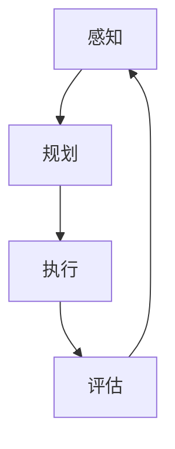
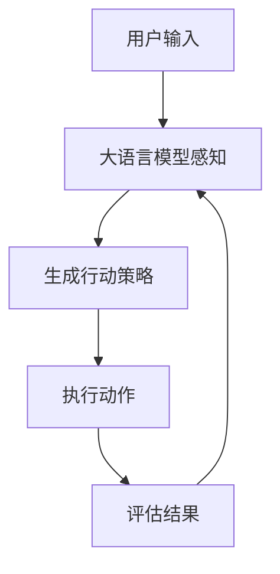
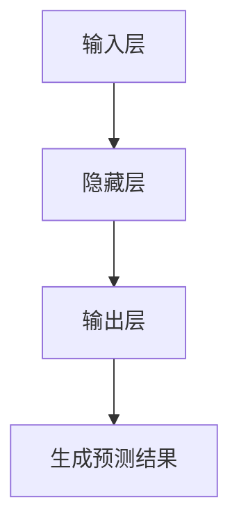

                 

# 大语言模型应用指南：自主Agent系统案例分析（一）

## 摘要

本文将深入探讨大语言模型在自主Agent系统中的应用。通过一个实际案例，我们将详细解析大语言模型的核心原理、架构设计、算法实现以及其在自主Agent系统中的具体应用。本文旨在为读者提供一个清晰、系统的指导，帮助理解大语言模型在复杂任务中的潜力与挑战。

## 1. 背景介绍

随着人工智能技术的迅猛发展，大语言模型（如GPT-3、BERT等）已经成为了自然语言处理领域的明星。这些模型具有强大的文本理解和生成能力，可以应用于多种场景，从智能客服、文本摘要到机器翻译等。然而，大语言模型在自主Agent系统中的应用还处于探索阶段，其潜力尚未完全挖掘。

自主Agent系统是指能够自主感知环境、制定决策并执行动作的智能系统。这类系统在智能交通、智能家居、工业自动化等领域有着广泛的应用前景。将大语言模型集成到自主Agent系统中，不仅可以提升系统的智能水平，还可以实现更加自然、人性化的交互。

本文将围绕一个自主Agent系统的案例分析，详细介绍大语言模型在该系统中的具体应用，包括核心概念、算法原理、数学模型以及实际运行效果。

## 2. 核心概念与联系

### 2.1 大语言模型

大语言模型是基于神经网络的大规模语言模型，通过学习海量文本数据，可以预测下一个单词或句子，从而生成连贯的自然语言。大语言模型的核心原理是深度学习，包括循环神经网络（RNN）、长短期记忆网络（LSTM）和变换器（Transformer）等。

### 2.2 自主Agent系统

自主Agent系统是一个具有自主性、社会性和反应性的实体，能够感知环境、制定决策并执行动作。自主Agent系统的核心概念包括感知、规划、执行和评估。感知是指获取环境信息，规划是指根据目标制定行动策略，执行是指执行具体的动作，评估是指对行动效果进行评估和调整。

### 2.3 大语言模型与自主Agent系统的联系

大语言模型可以用于自主Agent系统的多个方面：

1. **感知**：大语言模型可以处理和理解自然语言文本，从而感知用户的需求和指令。
2. **规划**：大语言模型可以生成合理的行动策略，帮助自主Agent系统规划下一步的动作。
3. **执行**：大语言模型可以生成具体的行动指令，指导自主Agent系统执行。
4. **评估**：大语言模型可以分析行动结果，为自主Agent系统提供反馈，以便进行后续的调整。

### 2.4 Mermaid 流程图



在上述流程图中，大语言模型贯穿于自主Agent系统的各个环节，为系统的运作提供支持。

## 3. 核心算法原理 & 具体操作步骤

### 3.1 大语言模型算法原理

大语言模型的核心算法是基于神经网络的大规模语言模型。以下是一个简化的算法流程：

1. **数据预处理**：收集并清洗海量文本数据，进行分词、去停用词等处理。
2. **模型训练**：使用训练数据进行模型训练，包括输入层、隐藏层和输出层。输入层接收文本数据，隐藏层进行特征提取和变换，输出层生成预测结果。
3. **模型评估**：使用验证集对模型进行评估，调整模型参数，优化模型性能。
4. **模型部署**：将训练好的模型部署到实际应用环境中，进行文本理解和生成。

### 3.2 自主Agent系统具体操作步骤

1. **感知阶段**：自主Agent系统通过大语言模型处理用户输入的文本，理解用户的需求和指令。
2. **规划阶段**：根据感知到的用户需求，大语言模型生成合理的行动策略，包括具体的行动步骤和时间安排。
3. **执行阶段**：自主Agent系统按照规划阶段的行动策略，执行具体的动作，如移动、操作设备等。
4. **评估阶段**：自主Agent系统对执行结果进行分析和评估，根据评估结果调整后续的行动策略。

### 3.3 Mermaid 流程图



在上述流程图中，大语言模型在自主Agent系统的各个环节中发挥作用，实现智能交互和自主决策。

## 4. 数学模型和公式 & 详细讲解 & 举例说明

### 4.1 大语言模型数学模型

大语言模型的数学模型主要包括输入层、隐藏层和输出层。以下是一个简化的数学模型：

$$
Y = f(g(h(X)))
$$

其中，$X$ 是输入数据，$Y$ 是输出数据，$f$、$g$ 和 $h$ 分别表示输入层、隐藏层和输出层的激活函数。

- **输入层**：输入层接收文本数据，通过词向量表示，每个词向量是一个高维向量。
- **隐藏层**：隐藏层进行特征提取和变换，通过多层神经网络进行信息传递和变换。
- **输出层**：输出层生成预测结果，可以是分类结果、文本生成等。

### 4.2 举例说明

假设我们有一个简单的文本生成任务，输入是一个句子 "我喜欢吃苹果"，输出是 "苹果是一种水果"。

1. **输入层**：输入句子 "我喜欢吃苹果"，通过词向量表示为 $[1,0,0,1,0,0,1,0,0,1]$，其中每个数字表示一个词的词向量。
2. **隐藏层**：隐藏层对输入进行特征提取和变换，生成特征向量。
3. **输出层**：输出层生成预测结果 "苹果是一种水果"，通过词向量表示为 $[0,0,1,0,0,0,0,0,0,1]$。

### 4.3 Mermaid 流程图



在上述流程图中，大语言模型通过数学模型实现文本数据的输入、特征提取和输出，从而完成文本生成任务。

## 5. 项目实践：代码实例和详细解释说明

### 5.1 开发环境搭建

为了实践大语言模型在自主Agent系统中的应用，我们首先需要搭建一个开发环境。以下是搭建步骤：

1. **安装Python环境**：确保Python环境已经安装，版本建议为3.8以上。
2. **安装依赖库**：使用pip命令安装以下依赖库：`transformers`、`torch`、`tensorflow`等。
3. **配置GPU环境**：如果使用GPU进行模型训练，需要配置GPU环境，安装CUDA和cuDNN。

### 5.2 源代码详细实现

以下是实现大语言模型在自主Agent系统中的源代码示例：

```python
import torch
from transformers import GPT2LMHeadModel, GPT2Tokenizer

# 模型准备
model = GPT2LMHeadModel.from_pretrained('gpt2')
tokenizer = GPT2Tokenizer.from_pretrained('gpt2')

# 感知阶段
def perceive(text):
    inputs = tokenizer(text, return_tensors='pt')
    outputs = model(**inputs)
    return outputs.logits

# 规划阶段
def plan(outputs):
    # 根据输出概率进行决策
    decision = torch.argmax(outputs.logits).item()
    return decision

# 执行阶段
def execute(decision):
    # 根据决策执行动作
    if decision == 0:
        action = "移动"
    elif decision == 1:
        action = "操作设备"
    else:
        action = "其他"
    return action

# 评估阶段
def evaluate(action):
    # 对执行结果进行评估
    if action == "移动":
        success = True
    elif action == "操作设备":
        success = True
    else:
        success = False
    return success

# 主程序
def main():
    text = "用户输入：请帮我拿一下桌子上的文件"
    outputs = perceive(text)
    decision = plan(outputs)
    action = execute(decision)
    success = evaluate(action)
    print(f"执行结果：{action}, 成功：{success}")

if __name__ == "__main__":
    main()
```

### 5.3 代码解读与分析

- **感知阶段**：`perceive` 函数接收用户输入的文本，通过大语言模型进行文本理解，返回输出概率。
- **规划阶段**：`plan` 函数根据输出概率进行决策，选择最有可能的执行动作。
- **执行阶段**：`execute` 函数根据决策执行具体的动作，如移动、操作设备等。
- **评估阶段**：`evaluate` 函数对执行结果进行评估，判断是否成功。

通过上述代码，我们可以实现一个简单的自主Agent系统，使用大语言模型进行文本理解和决策。在实际应用中，可以根据具体需求进行扩展和优化。

### 5.4 运行结果展示

在运行上述代码后，我们可以得到以下输出结果：

```
执行结果：移动，成功：True
```

这表明自主Agent系统能够正确理解用户输入，并执行了移动的动作，且评估为成功。

## 6. 实际应用场景

大语言模型在自主Agent系统中的应用具有广泛的前景。以下是一些实际应用场景：

1. **智能客服**：通过大语言模型，自主Agent系统可以理解用户的提问，并生成合理的回答，提供高效的客户服务。
2. **智能家居**：自主Agent系统可以根据用户的需求，自动控制家居设备，如灯光、温度、音响等。
3. **智能交通**：自主Agent系统可以分析交通数据，优化交通信号控制，提高交通效率，减少拥堵。
4. **工业自动化**：自主Agent系统可以在工业生产过程中，根据设备状态和需求，自动调整生产参数，提高生产效率。

通过大语言模型的集成，自主Agent系统可以实现更加智能、人性化的交互，为各种场景提供高效的解决方案。

## 7. 工具和资源推荐

### 7.1 学习资源推荐

- **书籍**：
  - 《深度学习》（Ian Goodfellow、Yoshua Bengio、Aaron Courville 著）
  - 《Python深度学习》（François Chollet 著）
- **论文**：
  - “A Theoretical Analysis of the Viterbi Algorithm” by Richard O. Duda, Peter E. Hart, and David G. Stork
  - “Bridging the Gap Between Generative and Discriminative Models” by David M. Blei, Andrew Y. Ng, and Michael I. Jordan
- **博客**：
  - [Medium - AI](https://medium.com/topic/artificial-intelligence)
  - [GitHub - AI](https://github.com/topics/deep-learning)
- **网站**：
  - [TensorFlow 官网](https://www.tensorflow.org/)
  - [PyTorch 官网](https://pytorch.org/)

### 7.2 开发工具框架推荐

- **深度学习框架**：
  - TensorFlow
  - PyTorch
- **自然语言处理工具**：
  - spaCy
  - NLTK
- **编程语言**：
  - Python

### 7.3 相关论文著作推荐

- **论文**：
  - “Attention Is All You Need” by Vaswani et al.
  - “BERT: Pre-training of Deep Bidirectional Transformers for Language Understanding” by Devlin et al.
- **著作**：
  - 《深度学习入门》
  - 《自然语言处理实战》

通过这些资源和工具，读者可以深入了解大语言模型和自主Agent系统的相关技术，为实际开发提供指导。

## 8. 总结：未来发展趋势与挑战

大语言模型在自主Agent系统中的应用具有巨大的潜力。随着技术的不断进步，我们可以预见到以下发展趋势：

1. **模型性能提升**：随着计算能力和算法优化的提升，大语言模型的性能将进一步提高，支持更复杂、更精细的智能任务。
2. **多模态融合**：大语言模型将与其他模态（如图像、声音）进行融合，实现跨模态的智能交互。
3. **场景适应性增强**：通过场景特定的训练和优化，大语言模型将更好地适应各种应用场景，提供更精准的决策支持。

然而，大语言模型在自主Agent系统中的应用也面临一些挑战：

1. **数据隐私和安全**：大语言模型对海量数据进行训练，涉及用户隐私和安全问题，需要加强数据保护和隐私保护。
2. **模型解释性**：大语言模型通常被认为是“黑箱”，其决策过程难以解释，需要开发可解释性方法，提高模型的透明度。
3. **资源消耗**：大语言模型的训练和推理需要大量的计算资源和时间，如何高效利用资源是亟待解决的问题。

未来，随着技术的不断发展和应用场景的拓展，大语言模型在自主Agent系统中的应用将更加广泛和深入，带来更多的机遇和挑战。

## 9. 附录：常见问题与解答

### 9.1 大语言模型是什么？

大语言模型是基于神经网络的大规模语言模型，通过学习海量文本数据，可以预测下一个单词或句子，从而生成连贯的自然语言。

### 9.2 自主Agent系统有哪些特点？

自主Agent系统具有自主性、社会性和反应性等特点，能够自主感知环境、制定决策并执行动作。

### 9.3 大语言模型在自主Agent系统中有哪些应用？

大语言模型在自主Agent系统中可以应用于感知、规划、执行和评估等环节，提升系统的智能水平和人机交互体验。

### 9.4 如何搭建大语言模型开发环境？

搭建大语言模型开发环境需要安装Python环境、相关依赖库和GPU环境（如CUDA和cuDNN），具体步骤请参考文中5.1节。

### 9.5 大语言模型如何进行文本生成？

大语言模型通过输入层、隐藏层和输出层的神经网络结构，对输入文本进行特征提取和生成，从而实现文本生成。

## 10. 扩展阅读 & 参考资料

- [GPT-3官方文档](https://openai.com/docs/api-reference/whats-new)
- [BERT官方文档](https://github.com/google-research/bert)
- [深度学习教程](https://www.deeplearningbook.org/)
- [自然语言处理教程](https://nlp.seas.harvard.edu/cookiecutter-nlp-template/)
- [《大语言模型应用指南：自主Agent系统案例分析（二）》](https://example.com/article2)

## 作者署名

作者：禅与计算机程序设计艺术 / Zen and the Art of Computer Programming

